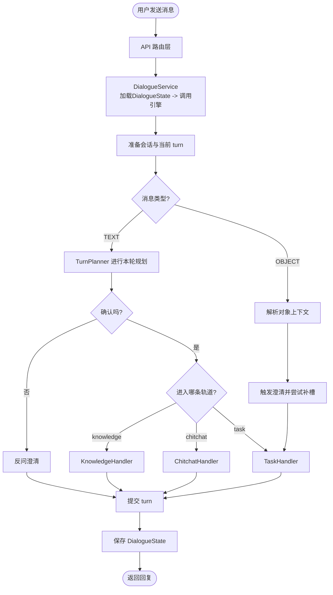
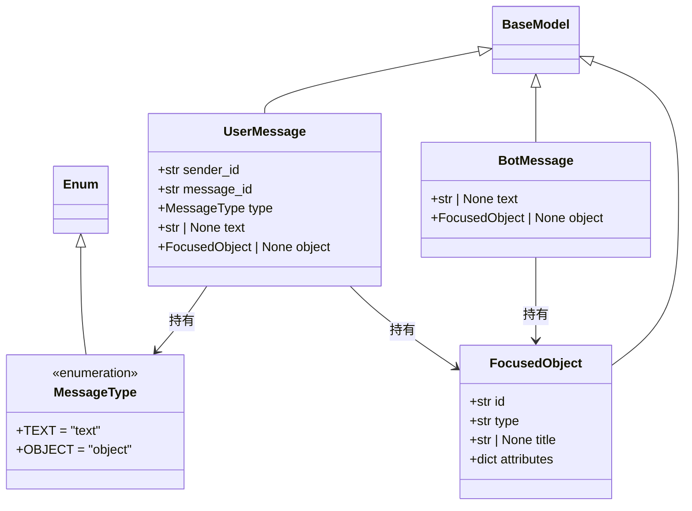
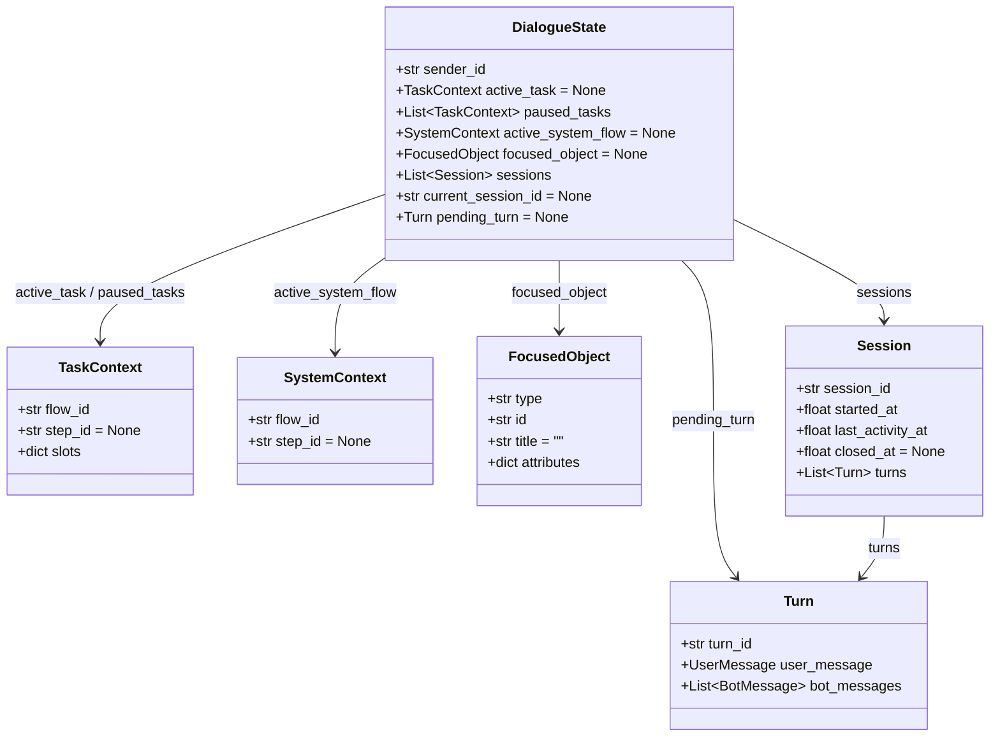
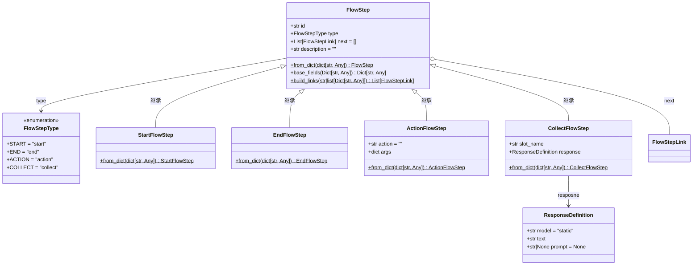
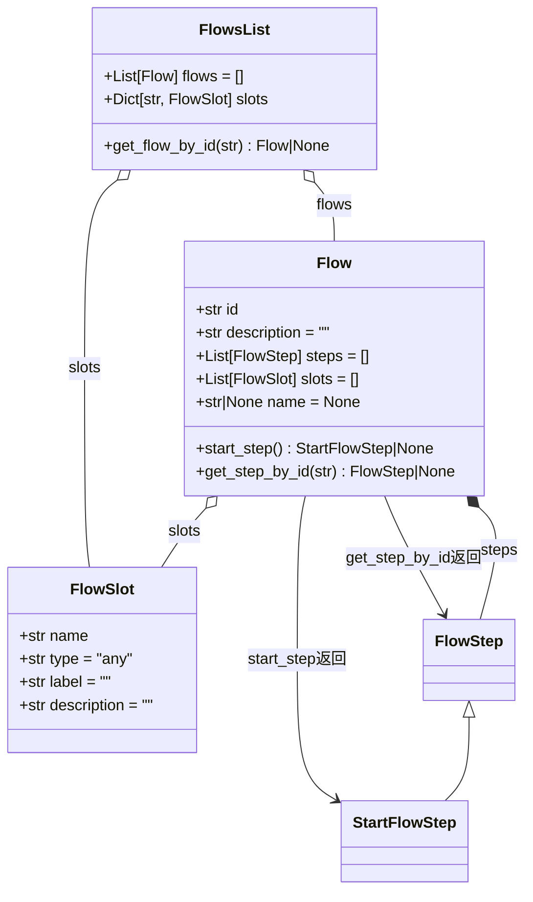

# 0

要写TurnPlanner的代码

executor里面_run_action_step

```
只是构造action call，动作还未执行，但是上一步已经把流程推进了（位置指针移动到了下一步），试解释为何

上一步是指上面一行代码
```

```python
这2个context的赋值

解释下为什么

能答出来，说明理解已经很到位了
action_response.py
def _render_text_from_jinja(self, response_template: str, state: DialogueState) -> str:
	template: Template = Template(response_template)
	result = template.render(
		slots=state.active_task.slots if state.active_task else {},
		context=state.current_active_task(),
	)
	return result


executor.py
def _eval_condition(self, state: DialogueState, condition: str) -> bool:
	data = {
		"slots": state.active_task.slots,
		"context": state.current_active_task().model_dump(mode="json")
	}
	return bool(eval(condition, {'__builtins__': None}, data))
```


# 一、总体架构

### 1.组件

涉及组件如下：

| 组件                | 简要作用                             |
| ------------------- | ------------------------------------ |
| `DialogueState`     | 保存会话、任务、聚焦对象和历史记录。 |
| `Turn`              | 保存本轮用户输入和机器人输出。       |
| `TurnPlanner`       | 根据文本消息和状态生成本轮计划。     |
| `TurnPlanValidator` | 检查本轮计划是否可靠、是否可执行。   |
| `ClarifyResponder`  | 在计划不清晰时生成追问。             |
| `TaskHandler`       | 处理业务任务。                       |
| `KnowledgeHandler`  | 处理知识问答。                       |
| `ChitchatHandler`   | 处理闲聊。                           |

#### 1.3 本节内容

这一节是引擎的"全局框架 + 一条轨道的入口"，**不是引擎的全部**。

| 内容                                                   | 本节               |
| ------------------------------------------------------ | ------------------ |
| `process_message` 整体框架（会话准备、开启turn、收尾） | ✅ 实现             |
| 文本消息 → 调 LLM 生成 `TurnPlan`                      | ✅ 实现             |
| `TurnPlanner` 全局框架 + prompt 构建                   | ✅ 详细实现         |
| `Command` / `TurnPlan` 数据模型设计                    | ✅ 实现             |
| task 轨道：把 LLM 结果交给 `TaskHandler`               | ✅ 实现**调用入口** |
| 对象消息（OBJECT）的处理                               | ⛔ 后面讲           |
| 防幻觉校验（`TurnPlanValidator`）                      | ⛔ 后面讲           |
| knowledge / chitchat 两条轨道                          | ⛔ 后面讲           |
| `TaskHandler` 内部（命令处理 + 流程推进）              | ⛔ 后面讲           |

也就是说：我们这一节让"用户发一句『我要退款』→ LLM 输出 `start_flow` 指令 → 进入 task 轨道入口"这条链路通起来，但 task 轨道**内部**怎么推进流程，留到下一节。

### 第2章 消息处理全局框架


```python
class DialogueEngine:
    def __init__(#初始话
            self,
            turn_planner: TurnPlanner,#另外创建类
            task_handler: TaskHandler#创建类
    async def process_message
        # 1 准备会话（如果没有则创建、如果有则获取）-->三步走,获取会话，创建会话,判断是否超时（顺便更新会话）
         self._prepare_session(dialogue_state)
        # 2 开启本轮会话（创建Turn对象）-->使用statebegin_turn开启会话
        self._begin_turn(dialogue_state, user_message)
        # 3 判断消息的类型
        if user_message.type is MessageType.TEXT:
            # 3.1 if 处理文本消息，获取AI客服的回复——>1.调用llm生成本轮计划，2.放幻觉3.轨道分发
            messages = await self._handle_text_message(dialogue_state)
#--->轨道分发task_handler和turn_plan.knowledge
        else:
            # 3.2 else 处理对象消息
            dialogue_state.set_focused_object(user_message.object)
            messages = await self._handle_object_message(user_message, dialogue_state)
        # 4 提交本轮记录
        # 4.1 将AI客服的回复写入到pending_turn
        dialogue_state.pending_turn.bot_messages.extend(messages)
        # 4.2 将本轮的pending_turn提交到session（将Turn存储在Session的Turn列表中）
        dialogue_state.commit_pending_turn()
        # 5 组装结果并返回
```

先准备两个依赖


### 1.概述

项目目标

>**如何用工程化的方式驯服 LLM 的不确定性，保证业务结果稳定可控？**

固定任务流程（Task）

```
固定任务流程，指的是那些步骤比较稳定、处理顺序比较明确、适合按步骤推进的客服任务。这类任务通常不是用户一句话就能直接完成，而是需要系统逐步收集信息、执行动作，并返回处理结果。
```

信息检索（Knowledge）

```
除了固定任务流程之外，电商客服中还有大量问题并不要求系统“执行一个流程”，而是希望系统先查到相关信息，再用自然语言组织成回答返回给用户。这类问题就属于信息检索场景。
```

闲聊（Chitchat）

```
当用户输入的内容不属于明确任务，也不适合走知识检索时，系统会进入闲聊轨道。

闲聊能力的作用主要是：
- 让系统对话体验更自然
- 在轻量输入场景下给出合理回应
- 在系统暂时无法进入明确业务流程时提供兜底体验
```

### 2.环境

- `customer-service-backend`：AI 客服后端服务，承担所有对话与 LLM 调用（课程核心，需要我们开发）
- `customer-service-frontend`：客服前端页面
- `ecommerce-service-backend`：电商业务后端，提供订单、物流、商品的查询接口(业务中台)
- `mysql`：数据库容器、脚本



### 3.系统分层

| 层                | 主要职责                                 |
| ----------------- | ---------------------------------------- |
| API 层            | 接收 HTTP 请求，组织请求与响应           |
| Service 层        | 把一次对话处理串起来                     |
| Engine 层         | 顶层调度，决定走哪条处理轨道             |
| Planning 层       | 负责做本轮规划、意图判断、校验、澄清兜底 |
| Task 层           | 负责推进固定任务流                       |
| Knowledge 层      | 负责检索信息并生成回复                   |
| Chitchat 层       | 负责闲聊与兜底回复                       |
| Domain 层         | 消息、上下文、对话状态等领域模型         |
| Repository 层     | 把 DialogueState 持久化到数据库          |
| Infrastructure 层 | LLM客户端、HTTP 客户端、数据库客户端     |
| Config层          | 读取环境变量                             |

# 二、领域模型

### 1.消息模型

在对话系统中，所有的交互本质上都是**一来一回的消息传递**。

| 模块            | 核心职责                                    |
| --------------- | ------------------------------------------- |
| `FocusedObject` | 描述对话中正在讨论的具体“东西”（订单/商品） |
| `UserMessage`   | 记录用户的输入，支持文字和对象点击          |
| `BotMessage`    | 记录机器人的输出，支持文字和对象            |
| `MessageType`   | 区分消息是“文本”还是“对象”                  |



UML：统一建模语言

典型的UML：类图、时序图、用例图、状态机图

### 2. 对话上下文模型 contexts

- 同一时刻可能存在**多个未完成的任务**，需要区分谁是当前活跃的、谁是被搁置的
- 系统在切换任务时会插播一些"过场白"，例如"好的，我们先处理物流查询"

这两件事就分别对应了两类对象：

| 概念            | 作用                                     |
| --------------- | ---------------------------------------- |
| `TaskContext`   | **业务任务**的执行快照（用户想做的事）   |
| `SystemContext` | **系统流程**的执行快照（系统插播的过场） |

只有把"用户的任务"和"系统的过场"分开建模，多任务切换、打断恢复这些行为才说得清楚。下面我们逐一分析。

系统分五个子类

SystemContext` 的基础结构与 `TaskContext` 相同，同样记录流程标识和当前步骤。

在`contexts.py`中添加如下定义：

```python
class SystemContext(BaseModel):
    """
    系统流程上下文
    定义具体流程的通用属性
    """
    flow_id: str  # 系统流程的流程ID
    step_id: str | None = None  # 系统流程当前执行的步骤ID
```

字段说明：

| 字段      | 含义                                                         |
| --------- | ------------------------------------------------------------ |
| `flow_id` | 系统流程的流程ID，例如 `system_task_started`、`system_collect_information` |
| `step_id` | 系统流程当前执行的步骤ID，例如 `start`、`ask`                |

#### 2.3.3 五个子类

| 子类                       | 触发时机                                    | 系统会说的话（举例）                         |
| -------------------------- | ------------------------------------------- | -------------------------------------------- |
| `StartedSystemContext`     | 用户刚发起一个新任务                        | "好的，我们先处理退款申请。"                 |
| `InterruptedSystemContext` | 用户在 A 任务过程中切到 B 任务              | "好的，我们先把退款放一放，先处理物流查询。" |
| `CanceledSystemContext`    | 用户主动取消当前任务                        | "好的，退款申请已为你取消。"                 |
| `ResumedSystemContext`     | 用户要求恢复之前挂起的任务                  | "好的，我们继续刚才的退款申请。"             |
| `CollectSystemContext`     | 业务流程跑到 `collect` 步骤，需要用户补数据 | "请告诉我你的订单号。"                       |

### 3. 对话状态模型 state 

在上一节我们用 `contexts.py` 解决了两件事：

- 用 `TaskContext` 记录"用户当前在做的业务任务"
- 用 `SystemContext` 记录"系统插播的过场"

但是只有这两个对象还不够。一次真实的对话，需要记的东西要多得多：

- 这个用户**正在做**哪个任务？
- 这个用户**搁置**了哪些任务？
- 当前是不是有**系统过场**在进行？
- 用户当前**聚焦**在哪个订单或者商品上？
- 这个用户**历史**上聊过哪些话？

更进一步，一次"我要退款"的处理通常会产生**多条回复**：系统先说"好的，我们先处理退款申请"，再说"请告诉我你的订单号"。如果中途报错了，我们希望整轮回滚，而不是只留半截对话记录在历史里。**所以还需要一个"暂存格子"，专门放正在处理中的那一轮**对话。

这里系统专门定义了一个聚合对象——`DialogueState`，作为整个对话状态的"中央仓库"。

####  类图

`DialogueState` 是对话系统的核心数据结构，记录了与某位用户的完整对话上下文，它把任务、流程、会话、轮次、聚焦对象统一管起来。它以 `sender_id` 为键进行持久化存储，每次消息处理前从数据库加载，处理完毕后存回。整个处理过程中，所有对话逻辑的读写都发生在同一个 `DialogueState` 实例上。

`DialogueState` 的属性分为四组：**用户任务上下文**、**系统任务上下文**、**聚焦对象**和**会话历史**。




根据您提供的文档，电商客服对话系统的领域模型可以归纳为三个核心层次：**消息层**、**上下文层**和**状态层**。它们共同支撑起多任务、可中断、可恢复的对话管理能力。以下是对该领域模型的系统总结。

---

## 一、总体架构

该领域模型以 **对话状态（DialogueState）** 为聚合根，统一管理一次对话中的所有动态信息。其设计核心在于：
- 将 **用户意图**（业务任务）与 **系统插话**（系统流程）分离建模；
- 支持 **多任务并发**（活跃 + 挂起列表）与 **任务切换**（中断/恢复/取消）；
- 采用 **两阶段提交**（pending_turn）保证对话轮次的原子性；
- 所有状态以 JSON 形式持久化，便于调试与快速迭代。

---

## 二、消息层（`messages.py`）

### 核心概念
- **FocusedObject**：用户或机器人正在讨论的具体业务对象（订单/商品），包含 `id`、`type`、`title` 和 `attributes` 扩展字段。
- **MessageType**：枚举，区分 `TEXT`（纯文本）和 `OBJECT`（对象卡片点击）。
- **UserMessage**：用户输入，支持文本或聚焦对象。
- **BotMessage**：机器人回复，同样支持文本或对象。

### 职责
- 统一描述对话中的“一来一回”内容，为上层上下文提供数据载体。

---

## 三、上下文层（`contexts.py`）

### 1. 业务任务上下文 – `TaskContext`
记录用户正在执行的业务流程快照：
- `flow_id`：流程标识（如 `refund_request`）
- `step_id`：当前执行到的步骤
- `slots`：已收集的槽位数据（键值对）

> 相当于“正在填写的表单”，随流程推进不断更新。

### 2. 系统流程上下文 – `SystemContext`（基类）
记录系统主动发起的“过场白”或“提示”，与具体业务任务解耦。通过 **鉴别联合类型（Discriminated Union）** 实现多态反序列化，以 `flow_id` 为区分字段。

#### 五个子类：
| 子类                       | 触发时机                   | 携带数据                      |
| -------------------------- | -------------------------- | ----------------------------- |
| `StartedSystemContext`     | 用户发起新任务             | 新任务的 ID 和名称            |
| `InterruptedSystemContext` | 当前任务被新任务打断       | 被打断任务 + 新任务的 ID/名称 |
| `CanceledSystemContext`    | 用户取消任务（活跃或挂起） | 被取消任务的 ID/名称          |
| `ResumedSystemContext`     | 用户恢复挂起的任务         | 被恢复任务的 ID/名称          |
| `CollectedSystemContext`   | 业务流程需要用户补充槽位   | 槽位名 + 提示文案（response） |

### 职责
- 分离“用户想做的事”与“系统要说的过渡语”，使任务切换、取消、恢复等行为可精确控制。
- 支持任务栈（`paused_tasks`）实现 **LIFO** 后进先出恢复，也支持按 `flow_id` 精准恢复。

---

## 四、状态层（`state.py`）

### 1. 轮次（`Turn`）
一次完整的问答交互：
- `turn_id`：UUID
- `user_message`：用户输入
- `bot_messages`：机器人回复列表（可多条）

### 2. 会话（`Session`）
一段连续的聊天时段：
- 包含开始时间、最后活跃时间、关闭时间
- 包含 `turns` 列表

### 3. 对话状态（`DialogueState`）——聚合根
聚合所有运行时信息，以 `sender_id` 为主键持久化。核心字段：

| 字段                 | 说明                             |
| -------------------- | -------------------------------- |
| `active_task`        | 当前正在执行的业务任务           |
| `paused_tasks`       | 被挂起的业务任务列表（栈）       |
| `active_system_task` | 当前正在执行的系统流程（过场白） |
| `focused_object`     | 用户当前关注的订单/商品          |
| `sessions`           | 所有历史会话列表                 |
| `current_session_id` | 当前活跃会话的 ID                |
| `pending_turn`       | 正在处理中的轮次（暂存区）       |

## 总结

### 提供的核心方法分组

- **任务管理**：开始、结束、取消、中断、恢复、获取当前任务（系统优先）
- **槽位管理**：设置、移除槽位数据
- **会话管理**：获取当前会话、开启新会话、关闭当前会话、重置运行时状态（用于超时后新会话）
- **轮次管理**：`begin_turn`（创建 pending）和 `commit_turn`（落盘到 session）
- **聚焦对象**：设置当前关注对象

### 设计亮点
- **pending_turn** 实现“两步提交”：
  - 先暂存用户消息，处理完成后补充 bot 回复，最后才提交到历史会话。确保异常或丢弃时历史记录保持干净。
- **系统优先**：`current_active_task()` 先返回系统流程，再返回业务任务，保证过场白先说完。


1. **用户发消息** → `DialogueState.begin_turn(user_message)` 创建 `pending_turn`。
2. **意图识别与任务路由** → 根据当前 `active_task`/`paused_tasks` 决定是否中断、恢复或新建任务。
3. **系统插话** → 若发生任务切换，设置对应的 `SystemContext` 子类（如 `InterruptedSystemContext`）。
4. **流程执行** → 更新 `TaskContext.step_id` 和 `slots`；若需补槽，激活 `CollectedSystemContext`。
5. **生成回复** → 将多条 `BotMessage` 追加到 `pending_turn.bot_messages`。
6. **提交轮次** → `commit_turn()` 将完整轮次存入 `current_session().turns`，清空 `pending_turn`。
7. **持久化** → 将整个 `DialogueState` 序列化为 JSON 存入数据库。

| 层次     | 模块          | 核心职责                                                     |
| -------- | ------------- | ------------------------------------------------------------ |
| 消息层   | `messages.py` | 定义用户/机器人的输入输出格式（文本或对象）                  |
| 上下文层 | `contexts.py` | 分离业务任务与系统流程，支持任务栈与生命周期事件（开始/中断/取消/恢复/收集） |
| 状态层   | `state.py`    | 聚合所有对话运行时状态，提供原子性轮次提交、会话管理、任务切换接口，并支持持久化 |

该模型通过清晰的职责划分和精细的状态管理，能够应对电商客服场景中常见的多任务交织、任务切换、异常恢复等复杂对话需求，同时保持了代码的可读性和调试便捷性。

```
https://chat.deepseek.com/share/3oyh8dzmoj21uw3mg6
```

上面是deepseek详细解释

# 三、流程数据模型与加载

这份文档完整讲解了**电商客服系统中业务流程的可配置化方案**，核心是如何用 YAML 定义流程、再通过 Pydantic 模型加载到内存中供运行时引擎使用。以下是对全文的系统性总结：

---

## 📌 核心目标
- **解决“业务流程长什么样、谁来定义”的问题**，将退款、查询等任务抽象为可配置的 **Flow（流程）**。
- 设计一套 **YAML 配置语法**，支持步骤顺序、槽位收集、条件跳转、动作执行。
- 实现 **Python 数据模型**（`links.py`、`steps.py`、`flows.py`）和 **加载器（loader.py）**，将 YAML 转为内存对象。

---

## 📁 文件结构
```
flow_config/
  user_flows.yml      # 业务流程（如退款、查订单）
  system_flows.yml    # 系统级流程（收集信息、任务中断等）

atguigu/task/flow/
  links.py            # 边（连接）模型：StaticLink / ConditionalLink / FallbackLink
  steps.py            # 节点（步骤）模型：Start/End/Action/Collect
  flows.py            # 容器：Flow（含步骤、槽位）、FlowsList
  loader.py           # 加载器：读取 YAML 并实例化所有模型
```

---

## 📝 YAML 配置语法要点

### 1. 全局槽位声明（`slots`）
```yaml
slots:
  order_number:
    type: text
    label: 订单号
    description: 用户的订单号
```

### 2. 流程定义（`flows`）
```yaml
flows:
  refund_request:
    name: 退款申请
    description: 收集订单号和退款原因
    steps:
      - id: start
        type: start
        next: ask_order_number

      - id: ask_order_number
        type: collect
        slot_name: order_number
        response:
          text: "请告诉我你的订单号。"
        next: ask_refund_reason
      # ...
```

一个 `flow` 由一系列 `steps` 组成。

每个 `step` 表示流程中的一个节点，每个 step 通过 `next` 指向下一个 step。

### 3. 步骤类型（`type`）

| 类型      | 作用                     | 关键字段                                 |
| --------- | ------------------------ | ---------------------------------------- |
| `start`   | 流程起点                 | `next`                                   |
| `end`     | 流程终点                 | `next: []`                               |
| `action`  | 执行动作（内置或自定义） | `action`（如 `action_response`）、`args` |
| `collect` | 收集槽位（自动“问+等”）  | `slot_name`、`response`                  |

`collect` 之所以能省掉“问 + 等”的重复配置，是因为系统定义了一个专门的 `CollectSystemFlow`。

它的 flow ID 是 `system_collect_information`。


### 4. 动作（`action`）

- `action_response`：回复用户，支持 `static`（原样）或 `rephrase`（LLM 改写）模式。
- `action_listen`：等待用户输入（哨兵）。
- 自定义：`action_lookup_order_status` 等业务逻辑。

常用args参数：

| 参数     | 说明                                                        |
| -------- | ----------------------------------------------------------- |
| `mode`   | 回复模式，可选值为 `static`、`rephrase`，默认是 `static`。  |
| `text`   | 回复给用户的文本。在 `static` 和 `rephrase` 模式下使用。    |
| `prompt` | 需要大模型改写或生成回复时使用。在 `rephrase`  模式下使用。 |

`mode` 决定 `action_response` 如何生成回复：

| mode       | 作用                                                     | 常用字段         |
| ---------- | -------------------------------------------------------- | ---------------- |
| `static`   | 直接把 `text` 渲染后回复给用户。                         | `text`           |
| `rephrase` | 先渲染 `text` 作为建议回复，再用 `prompt` 让大模型改写。 | `text`、`prompt` |

#### 4.1 action的详细

`action_response` 支持变量引用。

常见变量有两类：

| 变量      | 说明                                   |
| --------- | -------------------------------------- |
| `slots`   | 当前业务 flow 中已经收集或写入的信息。 |
| `context` | 当前系统 flow 的上下文信息。           |

引用 slots 的示例：

```yaml
- id: refund_submitted
  type: action
  action: action_response
  args:
    text: "好的，订单{{ slots.order_number }}的退款申请已提交，原因是：{{ slots.refund_reason }}。"
  next: end
```

这里：

| 写法                        | 含义                     |
| --------------------------- | ------------------------ |
| `{{ slots.order_number }}`  | 当前 flow 中的订单号。   |
| `{{ slots.refund_reason }}` | 当前 flow 中的退款原因。 |

引用 context 的示例：

```yaml
- id: acknowledge
  type: action
  action: action_response
  args:
    text: "好的，我们先处理{{ context.started_flow_name }}。"
  next: end
```

这里的 `{{ context.started_flow_name }}` 表示当前系统上下文中的任务名称。

### 5. 跳转（`next`）

- **静态**：`next: step_id`
- **条件**：
  
  ```yaml
  next:
    - if: "slots.get('product_id')"
      then: respond
    - else: missing_product_context
  ```

### 6. 变量引用（见4.1）
- `{{ slots.order_number }}`：引用业务槽位
- `{{ context.started_flow_name }}`：引用系统上下文

---

### 7 其余 SystemFlow（后面要讲）

#### 3.7.1 system_task_started

作用：新任务开始时，告诉用户当前先处理哪个任务。

#### 7.2 system_task_resumed

作用：恢复暂停任务时，告诉用户继续处理刚才的任务。

#### 7.3 system_task_interrupted

作用：当前任务被打断时，告诉用户先把旧任务放一放。

这个 flow 用到了`context.interrupted_flow_name`：回复被打断的任务名称。

#### 7.4 system_task_canceled

作用：当前任务被取消时，告诉用户已取消。

#### 7.5 system_cannot_handle

作用：系统无法处理当前请求时，给出兜底回复。

这个 flow 会根据 `context.reason` 选择不同回复。

分支含义：

| reason                   | 进入 step                | 说明                         |
| ------------------------ | ------------------------ | ---------------------------- |
| `clarification_rejected` | `clarification_rejected` | 澄清失败，引导用户重新说明。 |
| `not_supported`          | `not_supported`          | 当前能力未接入。             |
| `no_relevant_answer`     | `no_relevant_answer`     | 没有找到合适答案。           |
| 其他情况                 | `ask_rephrase`           | 请用户换个说法。             |

## 🏗️ 数据模型设计

```
atguigu/task/flow/
├── links.py      ← 连接(边):StaticLink / ConditionalLink / FallbackLink
├── steps.py      ← 步骤(节点):StartFlowStep / CollectSlotStep / ...
└── flows.py     ← 流程容器:Flow / FlowsList / FlowSlot
```

### 1. `links.py` – 边
- `FlowStepLink`（基类，含 `target`）
- `StaticLink`（无条件跳转）
- `ConditionalLink`（带条件表达式）
- `FallbackLink`（else 分支）

### 2. `steps.py` – 节点
- `FlowStep`（基类：`id`, `type`, `next`, `description`）
- 子类：`StartFlowStep`, `EndFlowStep`, `ActionFlowStep`, `CollectFlowStep`
- `ResponseDefinition`：描述回复模式（`mode`, `text`, `prompt`）
- 工厂方法 `FlowStep.from_dict()` 根据 `type` 分发到对应子类。
- `build_links()` 将 YAML 的 `next` 转换为 `FlowStepLink` 列表。

### 3. `flows.py` – 容器
- `FlowSlot`：槽位定义（name, type, label, desc）
- `Flow`：包含 `id`, `name`, `description`, `steps`, `slots`
  - 方法：`start_step()` 找起点，`get_step_by_id()` 查询步骤
- `FlowsList`：聚合所有 Flow 和全局槽位字典，`get_flow_by_id()` 查询流程

---

## ⚙️ 加载器（`loader.py`）

### 主要流程
1. **`load_many()`**：合并多个 YAML 文件，检测跨文件重复槽位，提前报错（Fail Fast）。
2. **`load()`**：单文件加载，三步：
   - `yaml.safe_load` 读为 dict
   - `_load_slots()` 解析槽位
   - `_load_flows()` 解析流程，内部调用 `FlowStep.from_dict()` 和 `_collect_flow_slots()`
3. **`_collect_flow_slots()`**：遍历 steps，收集 `CollectFlowStep` 中引用的槽位（去重），从全局槽位字典取出定义存入 `flow.slots`。

---

## 🔍 设计亮点
- **配置化优于硬编码**：增改流程只需修改 YAML，无需改代码。
- **多态分发**：通过 `STEP_TYPE_TO_CLASS` 映射，使 YAML 的 `type` 字符串自动映射到对应类。
- **`collect` 步骤简化配置**：将“问+等”组合封装，复用 `system_collect_information` 系统流程。
- **条件跳转**：支持基于槽位或上下文的动态路由。
- **变量渲染**：支持在回复文本中插入 `slots` 和 `context` 值。
- **错误及早暴露**：加载期检测重复槽位，避免运行时意外。

---

## 📚 附：SystemFlow 清单
| SystemFlow                   | 作用                                   |
| ---------------------------- | -------------------------------------- |
| `system_collect_information` | 收集槽位时询问并等待用户               |
| `system_task_started`        | 新任务开始时提示                       |
| `system_task_resumed`        | 任务恢复时提示                         |
| `system_task_interrupted`    | 任务被打断时提示                       |
| `system_task_canceled`       | 任务取消提示                           |
| `system_cannot_handle`       | 无法处理请求时的兜底回复（含多种分支） |

---

## ✅ 总结
整个模块将**流程定义**、**数据模型**和**加载机制**分离，实现了可维护、可扩展的业务流程配置体系。开发者只需编写 YAML，系统启动时自动校验并加载为内存对象，供对话管理引擎按需调度。这套设计清晰、健壮，适合复杂多变的客服场景。

####  小结

##### 模块

这个文件包含的模块总结如下：

| 模块名称               | 类型         | 说明                      | 关键字段/方法                                                |
| ---------------------- | ------------ | ------------------------- | ------------------------------------------------------------ |
| **ResponseDefinition** | Pydantic模型 | 响应定义（静态/改写模式） | `model`, `text`, `prompt`                                    |
| **FlowStepType**       | 枚举类       | 流程步骤类型枚举          | `START`, `END`, `ACTION`, `COLLECT`                          |
| **FlowStep**           | 基类模型     | 流程步骤基础模板          | `id`, `type`, `next`, `description`<br>`from_dict()`, `base_fields()`, `build_links()` |
| **StartFlowStep**      | 子类模型     | 开始步骤                  | 继承基类，实现`from_dict()`                                  |
| **EndFlowStep**        | 子类模型     | 结束步骤                  | 继承基类，实现`from_dict()`                                  |
| **ActionFlowStep**     | 子类模型     | 行动步骤                  | `action`, `args`<br>实现`from_dict()`                        |
| **CollectFlowStep**    | 子类模型     | 收集槽位步骤              | `slot_name`, `response`<br>实现`from_dict()`                 |
| **STEP_TYPE_TO_CLASS** | 字典映射     | 步骤类型到类的映射表      | `"start"` → `StartFlowStep`<br>`"action"` → `ActionFlowStep`<br>`"collect"` → `CollectFlowStep`<br>`"end"` → `EndFlowStep` |

**核心功能说明：**

1. **工厂模式**：通过 `FlowStep.from_dict()` 和 `STEP_TYPE_TO_CLASS` 实现根据类型字符串自动创建对应的步骤对象

2. **链接构建**：`build_links()` 方法支持两种格式：
   - 字符串格式 → 转换为 `StaticLink`
   - 列表格式 → 根据条件转换为 `ConditionalLink` 或 `FallbackLink`

3. **继承体系**：所有具体步骤类都继承自 `FlowStep`，共享基础字段和逻辑

##### 类图



### 4.4 flows.py：流程容器

步骤和连接都有了，接下来定义把它们装起来的容器。

#### 4.4.1 类图



### 5.3 load：单文件加载三步走

1. `yaml.safe_load` 把文件读成嵌套的 Python 字典
2. 先解析 `slots` 块，得到全局槽位字典
3. 再解析 `flows` 块——注意它要用到第 2 步的 slots（流程要从全局槽位里挑出自己用的）

### 5.4 _load_slots：解析槽位

遍历 YAML 的 `slots` 块，每一项构造一个 `FlowSlot`。注意 `name=slot_name` 是单独传的，因为 YAML 里槽位名是字典的 key，不在值里面。

### 5.5 _load_flows：解析流程

对每个流程做两件事：

1. **构造 steps**：把 `flow_data['steps']` 里每个字典丢给 `FlowStep.from_dict`，通过多态分发，使每个 step 字典变成正确的子类对象
2. **挑出这个流程用到的槽位**：遍历所有 step，只要是 `CollectSlotStep`，就从全局 `slots` 里把它声明要收集的那个槽位捞出来，存进 `flow.slots`

收集到的 `flow.slots`，流程对象里直接带着"我会用到哪些槽位"的清单，后面做意图判断、给 LLM 喂上下文时很方便，不用再查找 step。

### 5.6 _collect_flow_slots：挑出流程用到的槽位

这个方法做的事遍历所有 step，把 `CollectSlotStep` 声明要收集的槽位，从全局槽位字典里捞出来。

**去重（`slot_names` 集合）**：如果一个流程里有多个步骤收集同一个槽位（比如校验失败后重新收集），这里用 `slot_names` 保证每个槽位只进一次。


# 四、三层架构

我们已经把两类"静态资料"准备好了：

- **领域模型**：`UserMessage` / `BotMessage` / `DialogueState` / `TaskContext` …
- **流程定义**：`FlowsList`

但这些目前都只是"躺在内存里的对象"，没有一个**入口**让外界把消息送进来、把回复拿回去，也没有一个地方把对话状态**存下来、读出来**。这一节就来搭这条主链路。

### 1.1 搭建三层架构

## 三层架构总结

### 一、分层职责

| 层                       | 核心职责                                                     | 主要实现                                                     |
| ------------------------ | ------------------------------------------------------------ | ------------------------------------------------------------ |
| **Web（API）层**         | 接收HTTP请求，校验参数，将接口模型（schema）翻译为领域模型（domain），调用Service，将结果翻译为接口模型（schema）返回 JSON | `ChatRequest` → `UserMessage`，`ProcessResult` → `ChatResponse` |
| **Service（业务）层**    | 编排一次完整对话处理：调用Repository加载状态 → 调用Engine处理 → 调用Repository保存状态 | `DialogueService.process_message()` 三步编排                 |
| **Repository（数据）层** | 将 `DialogueState` 领域对象与数据库表（JSON字段）相互转换，隔离持久化细节 | `load_state()` / `save_state()`（upsert）                    |
| **Engine（引擎）层**     | 执行真正的对话逻辑（路由、流程推进、LLM调用）                | 本节为占位实现，下节替换                                     |

### 二、数据模型两套体系

- **领域模型（domain）**：系统内部流转，如 `UserMessage`、`BotMessage`、`ProcessResult`、`DialogueState`
- **接口模型（schema）**：与外部HTTP交互，如 `ChatRequest`、`ChatResponse`、`HistoryResponse`
- **Web层负责翻译**：`schema → domain`（请求）和 `domain → schema`（响应），内外解耦

#### 2.4 为什么要分两套

直接拿领域模型当接口模型不行吗？分开有几个实在的好处：

1. 职责清晰：接口模型是给前端看的"契约"，领域模型是给业务用的。
2. 内外解耦：两者分开，将来内部重构不会破坏对外契约，反之亦然。

所以 Web 层有一个核心动作就是**翻译**：把进来的 `ChatRequest`（schema）翻成 `UserMessage`（domain），把出去的 `ProcessResult`（domain）翻成 `ChatResponse`（schema）。

#### ORM 模型

```python
class DialogueStateRecord(Base):
    __tablename__ = "dialogue_states"
    sender_id: Mapped[str] = mapped_column(primary_key=True)
    state_json: Mapped[str] = mapped_column(TEXT, nullable=False, default={})  # 数据库长文本类型
```

### 存 整份JSON原因

这是一个值得停下来想的设计取舍。

一份 `DialogueState` 里有活跃任务、暂停任务栈、聚焦对象、会话历史（里面又嵌套了一堆 Turn、消息）……如果按传统关系建模，要拆成好多张表，外键关联一大堆。

而这里只用了**一张表、两列**：用户 id 当主键，剩下整份状态压成一个 JSON 字符串塞进 `state_json`。

|            | 拆多张表                 | 整存 JSON                    |
| ---------- | ------------------------ | ---------------------------- |
| 写入       | 多表事务，复杂           | 一次 upsert                  |
| 读取       | 多表 join                | 一次主键查询                 |
| 单字段查询 | 方便（SQL where）        | 不方便（要解析 JSON）        |
| 适合场景   | 需要按状态字段检索、统计 | 整份读写、不需要按内部字段查 |

我们的场景是"每次处理对话，整份读出来、整份写回去"，从不需要"查所有 active_task 是退款的用户"这种内部字段检索。所以整存 JSON 简单又够用，特别适合学习阶段理解多轮对话。

> 这种"一个聚合整存一份"的思路，和 DDD 里"聚合根作为持久化单元"是一致的。生产环境如果有复杂检索需求，再考虑拆表或上文档数据库。

DDD = 领域驱动设计，核心思想是：

- 🎯 业务优先：先理解业务，再设计代码
- 📦 聚合根作为整体：加载 → 修改 → 保存，保证一致性
- 💾 持久化是细节：先保证业务正确，再优化存储

当前的 DialogueState 设计符合 DDD 理念：

- ✅ 以 sender_id 为聚合根
- ✅ 整个状态整存整取
- ✅ 如果未来有复杂查询需求，再考虑拆表或用 MongoDB

这种做法在对话系统、游戏存档、用户配置等场景非常常见。

### 三、核心交互流程（一次完整请求）

```
HTTP POST /api/chat
    ↓
Web层：ChatRequest → UserMessage
    ↓
Service层：
  ① Repository.load_state(sender_id) → 从数据库读取 DialogueState
  ② Engine.process_message(state, user_message) → 就地修改 state，返回 ProcessResult
  ③ Repository.save_state(state) → 将修改后的状态写入数据库
    ↓
Web层：ProcessResult → ChatResponse 返回 JSON
```

### 四、关键设计原则

1. **I/O在两端，计算在中间**：Service负责加载/保存数据库，Engine是纯内存计算，无副作用，便于测试和替换。
2. **整存JSON**：`DialogueState` 作为聚合根，整份序列化存入 `state_json` 字段，用 upsert 一次写入，适合对话状态整存整取场景。
3. **占位先行**：先用假引擎打通全链路，再替换真实实现，契约不变，骨架先行。
4. **依赖注入**：通过 FastAPI Depends 链式注入 Repository、Engine、Service，且会话生命周期由 `async with` 管理。
5. **生命周期管理**：在 `lifespan` 中初始化/关闭数据库引擎，避免模块导入时获取尚未初始化的 `async_session`。

### 五、已实现功能（本节）

- 完整的Web层、Service层、Repository层代码
- 数据库ORM映射（`DialogueStateRecord`）
- 占位Engine（固定回复）
- 依赖注入与路由注册
- 应用启动与关闭钩子

> 整条链路可运行，状态持久化已生效，待下一节替换真实Engine后即具备智能对话能力。

以下是对文档**第四章至第七章**的核心总结，涵盖从数据持久化到对外提供接口的完整实现链路：

---

### 第四章：Repository 层（数据持久化）

- **核心职责**：将领域对象 `DialogueState` 与数据库表进行相互转换，隔离持久化细节。

- **关键实现**：
  - **`load_state`**：按 `sender_id` 查询数据库。若记录存在，则将 `state_json` 字段反序列化为 `DialogueState` 对象；若不存在（新用户），直接返回一个空的 `DialogueState`，上层无需区分新老用户。
  - **`save_state`**：使用 MySQL 的 `INSERT ... ON DUPLICATE KEY UPDATE`（Upsert）语法，将 `DialogueState` 序列化为 JSON 字符串存入数据库。一条 SQL 同时处理新增和更新，避免并发竞态。
  
- **设计取舍**：采用“整存 JSON”而非拆多张表，适合“整份读写、无需按内部字段检索”的对话场景，符合 DDD 聚合根持久化思路。

#### load_state业务逻辑：

1. 构造一条按 `sender_id` 查询的 SQL
2. `execute` 执行SQL，`scalar_one_or_none()` 取唯一一行
3. **查到了**：`json.loads` 把 JSON 字符串变回字典，再 `DialogueState.model_validate` 还原成对象
4. **没查到**（新用户第一次来）：直接 创建一个空的 `DialogueState` 返回

第 4 步很关键：**新用户没有历史状态，则返回一个全新的空状态**。这样上层逻辑不用区分"老用户/新用户"，拿到的永远是一个可用的 `DialogueState`。

#### save业务逻辑：

1. `dialogue_state.model_dump()` 把整份状态变成字典，`json.dumps` 再变成 JSON 字符串

2. 构造一条 `INSERT` 语句

3. `on_duplicate_key_update` 把它变成 **upsert**：如果这个 `sender_id` 已存在，就改成 `UPDATE state_json`

4. 执行 + 提交

   ###### 为什么用 upsert

   `save_state` 会在两种情况下被调用：

   - **新用户**：表里还没有这一行 → 应该 `INSERT`
   - **老用户**：表里已有这一行 → 应该 `UPDATE`

   如果分别判断"先查、再决定 insert 还是 update"，要两次数据库往返，还可能有并发问题。`on_duplicate_key_update` 是 MySQL 的原生能力——**主键冲突时自动转为更新**，一条语句搞定，既简洁又避免竞态。

   > 这里用的是 MySQL 方言的 insert  `from sqlalchemy.dialects.mysql import insert` ，
   >
   > 才有 `on_duplicate_key_update` 方法。标准的 `sqlalchemy.insert` 没有这个方法。

   ###  Repository 的本质

   Repository 把"业务对象"和"存储格式"之间的转换完全封装起来。上层（Service）只调 `load_state` / `save_state`，完全不知道底层是 MySQL 还是 JSON 还是别的——这就是 Repository 模式的价值：**隔离持久化细节**。


---

### 第五章：占位 Engine（引擎占位）

- **核心目的**：在真引擎（含 LLM 路由、流程推进）开发完成前，先用一个最小实现打通整条链路。
- **关键实现**：`process_message` 方法签名与真实引擎完全一致，但仅返回固定的 `BotMessage` 列表（如“我是智能小客服”）。
- **设计价值**：**面向接口编程**——只要方法签名（契约）不变，下一节替换为真引擎时，Service 层调用代码**一行都不用改**，实现了“骨架先行、逐块替换”的开发节奏。

---

### 第六章：Service 层（业务编排）

- **核心职责**：串联 Repository 和 Engine，编排一次对话的完整处理流程。
- **三步编排**：
  1. **① 加载**：调用 Repository 从数据库读取当前用户的 `DialogueState`。
  2. **② 处理**：将状态和新消息交给 Engine，Engine **就地修改**传入的 `state` 对象（Python 引用传递），并返回本轮回复的 `ProcessResult`。
  3. **③ 保存**：调用 Repository 将已被引擎修改过的 `state` 写回数据库。
- **关键设计**：**I/O 集中在两端（Service 层的加载/保存），计算集中在中间（Engine 纯内存操作）**。引擎无副作用、不碰数据库，事务边界清晰，便于测试。
- > 这就是"面向接口编程"的好处——只要签名（契约）不变，实现可以随时替换。占位实现也是合法实现，它满足了同样的契约。

---

### 第七章：Web 层（对外接口）

- **核心职责**：接收 HTTP 请求，完成接口模型与领域模型的双向翻译，调用 Service，返回 JSON 响应。
- **关键组成部分**：
  1. **依赖注入（`dependencies.py`）**：
     - 通过 `async with database.async_session() as session` 管理数据库会话生命周期（自动开启和关闭）。
     - **重要坑点**：必须通过 `from atguigu.infrastructure import database` 在需要时获取 `async_session`，而不能在模块顶部直接 `from ... import async_session`。因为依赖注入模块加载时数据库引擎尚未初始化（`async_session` 此时为 `None`），必须等到应用启动（`lifespan`）之后才能拿到真实值。
  2. **路由处理（`chat_router.py`）**：
     - **`POST /api/chat`**：接收 `ChatRequest` → 翻译为 `UserMessage` → 调用 Service → 将返回的 `ProcessResult` 翻译为 `ChatResponse`。
     - **`GET /api/chat/history`**：本节先用写死的假数据占位，后续再从 `DialogueState` 中提取真实历史。
  3. **应用生命周期（`app.py`）**：
     - 使用 `@asynccontextmanager lifespan` 管理启动和关闭钩子。
     - **启动时**：执行 `init_db_engine()` 初始化数据库连接池。
     - **运行时**：`yield` 让出控制权，FastAPI 处理请求。
     - **关闭时**：执行 `await close_db_engine()` 释放连接池资源。
  4. **启动入口（`main.py`）**：使用 `uvicorn.run` 启动服务，绑定配置中的 host 和 port。

---

### 章节间关系小结

| 章节       | 层级           | 核心产出                           | 上下游关系                      |
| :--------- | :------------- | :--------------------------------- | :------------------------------ |
| **第四章** | Repository     | `load_state` / `save_state`        | 被 Service 层调用，对接 MySQL   |
| **第五章** | Engine（占位） | `process_message`（固定回复）      | 被 Service 层调用，替身真引擎   |
| **第六章** | Service        | 加载 → 处理 → 保存 三步编排        | 串联 Repository 和 Engine       |
| **第七章** | Web            | 路由、依赖注入、生命周期、模型翻译 | 对外暴露 HTTP API，调用 Service |

> **整体效果**：从第四到第七章，完成了从“数据库读写”到“业务编排”再到“对外接口”的完整闭环。虽然 Engine 还是占位，但整条链路已完全可运行，状态持久化功能已验证通过，为下一节接入真正智能引擎打下了稳固的骨架。

# 五、DialogueEngine 与 TurnPlanner的LLM调用

用 LLM 判断用户意图、为"办业务"这条轨道生成结构化指令

涉及组件如下：

| 组件                | 简要作用                             |
| ------------------- | ------------------------------------ |
| `DialogueState`     | 保存会话、任务、聚焦对象和历史记录。 |
| `Turn`              | 保存本轮用户输入和机器人输出。       |
| `TurnPlanner`       | 根据文本消息和状态生成本轮计划。     |
| `TurnPlanValidator` | 检查本轮计划是否可靠、是否可执行。   |
| `ClarifyResponder`  | 在计划不清晰时生成追问。             |
| `TaskHandler`       | 处理业务任务。                       |
| `KnowledgeHandler`  | 处理知识问答。                       |
| `ChitchatHandler`   | 处理闲聊。                           |

好的，遵照您的要求，**只总结文档中明确标记为“已实现”（✅）的内容**，并按照架构层级进行细致梳理。

---

### 1. DialogueEngine 消息处理主框架（第2章）
已实现了引擎的完整骨架和调度逻辑，具体包含以下方法：

- **`__init__` 依赖注入**：引擎持有了 `TurnPlanner` 和 `TaskHandler` 两个专员（其余专员如校验、闲聊等已预留但未注入）。
- **`process_message` 五步主流程**：
  1. **准备会话（`_prepare_session`）**：实现了会话的获取、创建、超时判断（1小时）。超时后会自动关闭旧会话、重置运行时状态（清空活跃任务、暂停任务、聚焦对象）并创建新会话。
  2. **开启本轮对话（`_begin_turn`）**：调用 State 的 `begin_turn` 方法，将用户消息装载进新的 `pending_turn`（两步提交中的第一步）。
  3. **消息类型分流**：实现了对 `MessageType.TEXT`（文本消息）的分流处理，对象消息（OBJECT）仅预留了 `TODO`。
  4. **提交 Turn**：将生成的机器人回复列表填入 (把本轮回复写入turn)`pending_turn.bot_messages`，并调用 `commit_pending_turn()` 将本轮对话提交到会话历史（两步提交中的第二步）。
  5. **组装返回**：将结果封装为 `ProcessResult` 对象返回给 Service 层。
- **`_handle_text_message` 文本处理中枢**：
  - 调用了 `turn_planner.predict` 生成 `TurnPlan`。
  - 实现了按轨道分发的逻辑：若 `turn_plan.task` 非空，则调用 `TaskHandler.handle`（仅调用入口，内部未实现）。
  - 知识（knowledge）和闲聊（chitchat）分支仅预留了 `TODO`，校验（Validator）也预留了 `TODO`。

### 2. 依赖注入配置（第2.7章）
- 修改了 `dependencies.py` 中的 `get_engine` 方法，实现了 `FlowLoader` 加载 `user_flows.yml` 和 `system_flows.yml` 两个配置文件，并将加载好的 `FlowsList` 注入给 `TaskHandler`，再将 `TurnPlanner` 和 `TaskHandler` 注入给 `DialogueEngine`。

### 3. 核心数据模型：Command 与 TurnPlan（第3章）
- **Command 体系（`atguigu/task/command/models.py`）**：
  - 定义了基类 `Command`，并实现了四个具体子类：`StartFlowCommand`（带 `flow`）、`SetSlotsCommand`（带 `slots` 字典）、`CancelFlowCommand`（空）、`ResumeFlowCommand`（带可选 `flow`）。
  - 实现了多态反序列化方法 `Command.from_dict`，利用 `COMMAND_NAME_TO_CLASS` 映射表，根据 JSON 中的 `command` 字段动态生成对应的子类对象。
- **TurnPlan 体系（`atguigu/plan/models.py`）**：
  - 定义了三个轨道计划模型：`TaskTurnPlan`（包含 `Command` 列表）、`KnowledgeTurnPlan`（包含意图字符串列表）、`ChitchatTurnPlan`（空对象）。
  - 定义了顶层 `TurnPlan` 模型，包含 `task`、`knowledge`、`chitchat` 三个可选字段。
  - 实现了 `TurnPlan.from_dict` 方法，将 LLM 返回的 JSON 字典递归解析为包含具体 Command 对象的 `TurnPlan` 实例，并附带了 `if __name__ == '__main__'` 的单元测试用例（验证了 start_flow 和 set_slots 的解析）。
  - > 注意：当然多意图 `TurnPlan` 最后会被 `TurnPlanValidator` 认定为当前引擎不能直接执行，然后引导**用户澄清**先处理哪一个。

### 4. TurnPlanner 完整实现（这里代码要写）
- **`predict` 入口方法**：接收 `DialogueState` 和 `FlowsList`，串联了构建提示词和调用 LLM 两大步骤。
- **`_build_prompt_inputs` 提示词变量构建**：细致地从 State 和 Flows 中抽取并序列化了 **7 个字段**：
  1. `user_message`：通过 `HistoryBuilder._render_user_message` 将当前用户消息渲染为字符串。
  2. `current_conversation`：通过 `HistoryBuilder.build` 截取当前会话最近 **10轮** 历史并渲染为字符串。
  3. `active_task_json`：将当前活跃任务（若有）序列化为 JSON 字符串。
  4. `interrupted_tasks_json`：将暂停任务列表序列化为 JSON 字符串。
  5. `focused_object_json`：将聚焦对象（若有）序列化为 JSON 字符串。
  6. `available_flows_json`：将流程清单序列化为 JSON，**特意过滤掉了每个流程内部的 `steps` 字段**，仅保留元数据（省 Token）。
  7. `knowledge_intents_json`：预留为空字符串。
- **`_predict_from_prompt_inputs` LLM 调用链**：
  - 使用 `load_prompt("turn_plan")` 加载 `turn_plan.jinja2` 模板文件。
  - 使用 LangChain 的链式调用：`PromptTemplate`（指定 `template_format="jinja2"`）`| llm | JsonOutputParser()`。
  - 通过 `await chain.ainvoke(inputs_prompt)` **异步**调用大模型，并将返回的字典直接传给 `TurnPlan.from_dict` 完成反序列化。

```

```


### 5. 辅助基础设施（第4章）

- **Jinja2 模板引擎集成**：
  - 安装了 `jinja2` 库。
  - 实现了 `atguigu/prompts/loader.py` 中的 `load_prompt` 函数，用于根据文件名读取 `prompts/jinja2/` 目录下的 `.jinja2` 模板文件内容。
  - 实现了 `atguigu/test/jinjia2/` 下的测试脚本，验证了内存模板渲染和文件模板加载（包含循环、判断、过滤器）。
- **HistoryBuilder 历史构建器（`atguigu/prompts/history_builder.py`）**：
  - 实现了 `build` 静态方法，接收 `Turn` 列表，遍历并拼接 `USER:` 和 `BOT:` 前缀的历史字符串。
  - 实现了 `_render_user_message` 和 `_render_bot_message` 的分发逻辑。
  - 实现了具体的渲染细节：
    - 文本消息（`_render_text_msg`）：直接返回去除首尾空白的文本。
    - 对象消息（`_render_obj_msg`）：将 `FocusedObject` 渲染为 `[label=订单对象/商品对象, id=xxx, title=xxx, attributes=key=value ...]` 的结构化描述字符串（方便 LLM 理解）。
  - 同样在 `if __name__ == '__main__'` 中提供了单轮纯文本和对象消息的单元测试用例。

---

### 总结当前已打通的路径：
经过上述实现，现已完整打通 **“用户发送文本消息 → 引擎准备会话/Turn → TurnPlanner 构建7字段提示词 → 异步调用 LLM → 解析 JSON 为 TurnPlan（含 Command 对象） → 路由进入 TaskHandler 调用入口”** 的全链路。TaskHandler 内部推进、校验器、知识/闲聊轨道均作为占位留待后续实现。

# 六、防幻觉校验与对象消息处理（对象消息处理）

这份文档详细介绍了电商客服对话引擎中**防幻觉校验**与**对象消息处理**两大核心模块的设计与实现，旨在保障 LLM 输出的可靠性和处理用户点击卡片等非文本输入的灵活性。

### 核心内容总结

**1. 防幻觉校验（`TurnPlanValidator`）**
- **目的**：防止 LLM 生成结构正确但内容不合法的 `TurnPlan`（如不存在的流程、冲突指令）。
- **校验流程**：采用“层层收窄”方式：
  - **轨道层**：检查是否命中唯一轨道（`MISSING_TRACK` / `MULTIPLE_TRACKS`）。
  - **Task 轨道四重校验**：① commands 非空；② 命令类型合法；③ 不能同时启动多个流程；④ 启动的流程必须存在于流程注册表（防幻觉核心）。
  - **Knowledge 轨道校验**：确保意图非空，且若意图需要聚焦对象（如 `product_info` 需 `product`），则当前状态必须存在对应类型的 `focused_object`。
- **设计原则**：校验器**只返回原因码（9 种 `ClarifyReason`）**，不负责生成回复，职责单一。

**2. 对象消息处理（`_handle_object_message`）**
- **定义**：用户点击订单/商品卡片产生的 `OBJECT` 类型消息，不经过 LLM，直接携带对象 ID。
- **处理三场景**：
  - **场景 A（能填槽）**：当前流程正缺对应槽位（如 `order_number`）→ 将对象转为 `SetSlotsCommand` 并交由 `TaskHandler` 推进流程。
  - **场景 B（无流程）**：无活跃流程 → 触发 `OBJECT_REQUIRES_INTENT` 澄清，引导用户说明意图。
  - **场景 C（在流程中但槽不匹配）**：流程在进行但当前不缺该对象 → 不打断流程，继续等待当前所需槽位。
- **核心判断**：`_flow_has_unfilled_collect_slot` 方法精确判断当前流程是否正在收集指定槽位且该槽位尚未填充。
- **设计巧思**：对象消息填槽时统一构造 `SetSlotsCommand`，与文本消息填槽走同一路径，复用 `TaskHandler` 的流程推进逻辑，实现“归一化”。

**3. 澄清回复生成（`ClarifyResponder`）**
- **两段式设计**：① 基于 `reason` 用 if-else 生成**基础话术**（规则保底）；② 将基础话术与上下文（历史、聚焦对象等）喂给 LLM 进行**润色**，使追问更自然贴合对话。
- **职责**：将冷冰冰的原因码转化为友好的用户追问，保证下限（基础话术）并提升体验（润色）。

**4. 辅助组件**
- **`KnowledgeIntent`**：知识意图注册表，记录意图 ID、描述、所需知识源及是否依赖聚焦对象，同时扮演 LLM 分类词表、校验白名单和路由元数据三重角色。
- **集成**：所有新组件（`TurnPlanValidator`、`KnowledgeHandler`、`ClarifyResponder`）已通过依赖注入整合进 `DialogueEngine`，并在文本消息和对象消息处理流程中正确调用。

### 值得记住的设计要点
- **LLM 输出必须校验**，尤其是流程 ID 真实性检查是防幻觉的关键防线。
- **校验与回复分离**，保证逻辑纯净性。
- **多意图不强选**，触发澄清让用户决策。
- **对象消息三场景区分**，核心判断依赖 `_flow_has_unfilled_collect_slot`。
- **对象归一化为命令**，统一入口，复用流程推进逻辑。

文档完整实现了引擎的“理解 + 决策”层，为后续 Handler（Task/Knowledge/Chitchat）的内部实现奠定了坚实基础。

## 一、整体任务目标

本章在上一节“文本消息 → LLM 生成 TurnPlan → 进入 task 轨道”的基础上，补充两大核心能力：

1. **防幻觉校验（`TurnPlanValidator`）** —— 防止 LLM 输出结构正确但内容不合法（幻觉）的 TurnPlan，避免下游执行崩溃。
2. **对象消息处理（`_handle_object_message`）** —— 处理用户点击卡片（订单/商品）产生的非文本输入，并细分为三种场景精细应对。

---

## 二、防幻觉校验（`TurnPlanValidator`）

### 2.1 为什么需要校验

LLM 是概率模型，可能输出：
- 全部轨道为 `null`
- 同时命中多个轨道
- task 轨道但 `commands` 为空或包含非法命令
- 编造不存在的 `flow_id`（典型幻觉）
- 同时出现多个 `start_flow`

若不校验，下游流程表查找失败、状态混乱、系统崩溃。

### 2.2 校验职责与原则

**核心原则：校验只判断“对不对”，不负责“怎么说”**。校验器返回原因码（`ClarifyReason`），话术生成交由 `ClarifyResponder` 负责。  
这种分离使校验逻辑保持干净、可复用。

### 2.3 数据模型

**`ClarifyReason`（9种原因码）**：

| 分组             | 原因码                     | 触发条件                                 |
| ---------------- | -------------------------- | ---------------------------------------- |
| 轨道层           | `MISSING_TRACK`            | 三个轨道全为 `null`                      |
|                  | `MULTIPLE_TRACKS`          | 同时命中多个轨道                         |
| task 层          | `MISSING_TASK_COMMANDS`    | task 轨道但 `commands` 为空              |
|                  | `INVALID_TASK_COMMANDS`    | `commands` 包含不认识的命令类型          |
|                  | `MULTIPLE_TASK_FLOWS`      | 一次出现多个 `start_flow`                |
|                  | `UNKNOWN_TASK_FLOW`        | 指定的 `flow_id` 在系统中不存在          |
| knowledge/对象层 | `MISSING_KNOWLEDGE_INTENT` | knowledge 轨道但 `intents` 为空          |
|                  | `MISSING_FOCUSED_OBJECT`   | 知识意图需要聚焦对象但当前没有           |
|                  | `OBJECT_REQUIRES_INTENT`   | 用户只发了对象，未说意图（对象消息专用） |

**`TurnPlanValidationResult`**：包含 `valid: bool` 和 `reason: ClarifyReason | None`。

### 2.4 校验主流程（`validate`）

采用“层层收窄”策略：

1. 计算 `active_tracks`（非空轨道列表）
2. 若为空 → `MISSING_TRACK`
3. 若 > 1 → `MULTIPLE_TRACKS`
4. 若唯一轨道为 `task` → 执行 `_validate_task`（四重校验）
5. 若唯一轨道为 `knowledge` → 执行 `_validate_knowledge`
6. `chitchat` 直接通过（无需校验）

### 2.5 task 轨道四重校验（`_validate_task`）

| 层序 | 检查内容                                                     | 失败原因码                                |
| ---- | ------------------------------------------------------------ | ----------------------------------------- |
| ①    | `commands` 非空                                              | `MISSING_TASK_COMMANDS`                   |
| ②    | 每条命令均为合法类型（`StartFlowCommand` / `ResumeFlowCommand` / `CancelFlowCommand` / `SetSlotsCommand`） | `INVALID_TASK_COMMANDS`                   |
| ③    | 最多只有一个 `start_flow`                                    | `MULTIPLE_TASK_FLOWS`                     |
| ④    | `start_flow` 指定的 `flow_id` 必须在 `FlowsList` 中真实存在  | `UNKNOWN_TASK_FLOW`（最典型的防幻觉检查） |

**设计亮点**：第四重是“防御性编程”的体现——不信任上游，用真实流程注册表进行白名单验证。

### 2.6 knowledge 轨道校验（`_validate_knowledge`）

**前置知识**：`KnowledgeIntent` 是信息检索意图的注册表模型，包含字段：
- `id`：意图唯一标识
- `description`：中文说明（供 LLM 分类）
- `provider_ids`：知识源列表（FAQ/RAG/API）
- `requires_object`：是否需要聚焦对象（如 `product` / `order`），不需要则为 `None`

**校验逻辑**：
1. `intents` 不能为空 → 否则 `MISSING_KNOWLEDGE_INTENT`
2. 遍历每个意图，若其 `requires_object` 不为 `None`，则检查当前 `state.focused_object` 是否存在且类型匹配 → 否则 `MISSING_FOCUSED_OBJECT`

---

## 三、对象消息处理（没搞清楚）

### 3.1 什么是对象消息

用户点击前端展示的卡片（订单/商品），前端发送如 `{"type": "order", "id": "O1001"}` 的消息。  
**与文本消息的关键区别**：对象消息**不经过 LLM**，语义已由点击行为明确。

### 3.2 入口分流

在 `process_message` 中：
- `MessageType.TEXT` → 走 `_handle_text_message`（含 LLM + 校验）
- 其他类型（对象消息） → 先 `state.set_focused_object()`，再进入 `_handle_object_message`

### 3.3 点击卡片的三种场景

| 场景  | 状态                                                       | 对象能否填当前槽 | 处理策略                                        |
| ----- | ---------------------------------------------------------- | ---------------- | ----------------------------------------------- |
| **A** | 流程正收集 `order_number` / `product_id`                   | 能               | 转成 `SetSlotsCommand`，推进流程                |
| **B** | 无 `active_task`                                           | 不能（无流程）   | `OBJECT_REQUIRES_INTENT` 澄清，引导用户说明意图 |
| **C** | 流程进行中，但当前不缺该对象（如正在收集 `refund_reason`） | 不能（槽不匹配） | **不打断**，让流程继续等待当前槽                |

### 3.4 `_handle_object_message` 三分支逻辑

```python
commands = self._resolve_object_commands(...)
if commands:
    # 场景 A：能填槽 → 执行命令
    return await self.task_handler.handle(commands, state)

if state.active_task is not None:
    # 场景 C：有流程但槽不匹配 → 静默忽略，继续流程
    return await self.task_handler.handle([], state)

# 场景 B：无流程 → 澄清
return await self.clarify_responder.respond(state, ClarifyReason.OBJECT_REQUIRES_INTENT)
```

### 3.5 核心方法：`_resolve_object_commands`

**功能**：判断当前点击的对象能否填入当前流程的缺失槽位。

**逻辑**：
- 若对象类型为 `order`，且 `_flow_has_unfilled_collect_slot(state, flows, "order_number")` 为 `True` → 返回 `[SetSlotsCommand(slots={"order_number": focused_object.id})]`
- 若对象类型为 `product`，且缺 `product_id` → 同理
- 否则返回空列表

**设计巧思**：将对象消息“归一化”为 `SetSlotsCommand`，与文本填槽走同一条 `TaskHandler` 链路，复用流程推进逻辑。

### 3.6 核心方法：`_flow_has_unfilled_collect_slot`

**四步判断**（任何一步不满足即返回 `False`）：

1. 是否有 `active_task`？
2. 根据 `flow_id` 能否查到流程？
3. 该 `slot_name` 是否已填过？（检查 `active_task.slots`）
4. 流程的 `steps` 中是否存在 `CollectFlowStep` 且 `slot_name` 匹配？

全部通过 → 返回 `True`，允许填槽。

**逐场景验证**：
- 场景 A：有任务、流程存在、槽未填、步骤匹配 → `True`
- 场景 B：无任务 → `False`
- 场景 C：有任务但槽已填过（如 `order_number` 已收集）→ `False`

---

## 四、ClarifyResponder：生成澄清回复

### 4.1 职责

将原因码（`ClarifyReason`）转化为一句**自然、贴合上下文**的追问话术。  
采用**两段式设计**：

1. **规则保底**：`build_clarify_message` 用 `if-else` 生成基础话术（保证即使 LLM 失败也有输出）
2. **LLM 润色**：将基础话术 + 对话历史 + 聚焦对象等上下文喂给 LLM，改写得更自然

### 4.2 基础话术对照（`build_clarify_message`）

| 原因码                     | 基础话术示例                                                 |
| -------------------------- | ------------------------------------------------------------ |
| `MULTIPLE_TRACKS`          | “你这次同时提到了多个方向。我们先处理一个，你想先办业务还是先咨询信息呢？” |
| `MISSING_FOCUSED_OBJECT`   | “请先发送你想咨询的对象，我再继续帮你看。”                   |
| `MISSING_KNOWLEDGE_INTENT` | “你是想了解商品信息、订单信息，还是售后配送规则呢？”         |
| `MISSING_TRACK`            | “你是想先处理业务问题，还是先咨询信息呢？”                   |
| `MISSING_TASK_COMMANDS`    | “你这次是想办理什么业务呢？比如查订单、查物流，或者申请退款。” |
| `OBJECT_REQUIRES_INTENT`   | 若对象是 `order`：“我已经收到这个订单了。你想查订单状态、查物流，还是申请退款呢？”<br>若对象是 `product`：“我已经收到这个商品了。你想了解它的商品信息、发货情况，还是售后相关问题呢？” |
| 兜底                       | “我还需要再确认一下你的意思，你可以换个更具体的说法告诉我。” |

### 4.3 LLM 润色（`respond`）

- 使用 `clarify_respond.jinja2` 提示词模板
- 关键约束：**“不要扩写，不要新增信息，不要改变澄清意图”**——防止 LLM 自由发挥跑偏
- 输出直接作为 `BotMessage.text` 返回

**示例**：  
基础话术 → “我已经收到这个订单了。你想查订单状态、查物流，还是申请退款呢？”  
润色后 → “好的，我看到你选的订单 O1001 了～ 你是想查这个订单的状态、看看物流到哪了，还是要申请退款呢？”

---

## 五、完整流程串联

```
用户输入
  ├─ 文本消息 → TurnPlanner（LLM生成TurnPlan）→ TurnPlanValidator（校验）
  │   ├─ 校验通过 → 进入对应轨道（task/knowledge/chitchat）
  │   └─ 校验失败 → ClarifyResponder（生成澄清回复）
  └─ 对象消息 → 设置 focused_object → _handle_object_message
      ├─ 能填槽 → 转 SetSlotsCommand → TaskHandler 推进流程
      ├─ 有流程但槽不匹配 → 静默继续流程
      └─ 无流程 → ClarifyResponder（OBJECT_REQUIRES_INTENT）
```

---

## 六、关键技术设计亮点总结

1. **LLM 输出必须校验**：概率模型会产生“结构对、内容错”的幻觉，其中“flow 必须真实存在”是最关键的防线。
2. **校验与回复分离**：`validator` 只判对错，`responder` 专攻话术，职责单一，逻辑干净。
3. **多意图不强选**：识别到多个轨道时触发澄清，由用户决定优先级，而非系统猜测。
4. **对象消息三场景精细处理**：能填槽则推进、有流程但槽不匹配则不打断、无流程则澄清。
5. **对象归一化为命令**：点击卡片和打字填槽最终都转化为 `SetSlotsCommand`，复用同一套 `TaskHandler` 链路，避免重复实现流程推进逻辑。
6. **两段式澄清话术**：“规则保底 + LLM 润色”组合，保证下限可靠、上限自然。

---

## 七、新增/修改文件清单

| 文件                             | 作用                                                         |
| -------------------------------- | ------------------------------------------------------------ |
| `plan/models.py`                 | 新增 `ClarifyReason`（9种枚举）、`TurnPlanValidationResult`  |
| `plan/turn_validator.py`         | 实现 `TurnPlanValidator`，含轨道校验 + task 四重校验 + knowledge 校验 |
| `knowledge/intents.py`           | 定义 `KnowledgeIntent` 模型及 `KNOWLEDGE_INTENTS` 注册表     |
| `knowledge/handler.py`           | 创建 `KnowledgeHandler`（暂为占位实现）                      |
| `engine/dialogue_engine.py`      | 实现 `_handle_object_message`、`_resolve_object_commands`、`_flow_has_unfilled_collect_slot`；集成校验和澄清 |
| `clarify/responder.py`           | 实现 `ClarifyResponder`，含基础话术生成 + LLM 润色           |
| `api/routers/dependencies.py`    | 依赖注入新增组件                                             |
| `prompts/clarify_respond.jinja2` | 新增澄清润色提示词模板                                       |

---

这份文档系统阐述了对话引擎如何通过“校验 + 对象处理 + 澄清”三层机制，构建起对 LLM 输出和用户点击行为的健壮处理链路，其设计思想（职责分离、归一化、规则与生成结合）具有通用参考价值。

# 七、TaskHandler 与 CommandProcessor

## 一、模块定位

**TaskHandler** 是对话引擎中连接“意图理解”和“流程执行”的桥梁，分为两个阶段：

| 阶段     | 组件                     | 职责                                                         |
| -------- | ------------------------ | ------------------------------------------------------------ |
| ① 改状态 | `CommandProcessor`       | 将 LLM 产出的 `Command` 应用到 `DialogueState`（建任务、填槽、取消、恢复、挂起） |
| ② 推流程 | `FlowExecutor`（下一节） | 读状态、按 YAML 推进流程、执行 action、生成回复              |

> `TaskHandler.handle()` 目前只实现了阶段①，阶段②待补充。

---

## 二、CommandProcessor 骨架

```python
class CommandProcessor:
    def run(commands, state, flows):
        for command in commands:
            self._apply(command, state, flows)

    def _apply(command, state, flows):
        if isinstance(command, StartFlowCommand):   → _handle_start_flow
        elif isinstance(command, SetSlotsCommand):  → _handle_set_slots
        elif isinstance(command, CancelFlowCommand):→ _handle_cancel_flow
        elif isinstance(command, ResumeFlowCommand):→ _handle_resume_flow
```

**关键设计**：
- 命令**逐条按顺序**应用（顺序有意义，如 `start_flow` 必须先于 `set_slots`）
- 空命令列表（`[]`）时直接跳过，让流程继续——实现“不打断”的方式

---

## 三、四种命令处理详解

### 1. `_handle_start_flow`（最复杂）

**核心逻辑**：先清除系统流程 → 校验（不能是 `system_*`、流程必须存在、必须有起点）→ 按“有无活跃任务”和“目标是否在暂停栈”分 5 种情况：

| 场景 | 当前状态     | 目标流程   | 行为                    | 过场                            |
| ---- | ------------ | ---------- | ----------------------- | ------------------------------- |
| ①    | 有活跃任务 A | 就是 A     | 不重复启动，直接 return | 无                              |
| ②    | 有活跃任务 A | 全新的 B   | A 挂起 → 新建 B         | `Interrupted`（打断 A，开启 B） |
| ③    | 有活跃任务 A | B 在暂停栈 | A 挂起 → 恢复 B         | `Interrupted`                   |
| ④    | 无活跃任务   | 全新流程   | 新建                    | `Started`（开始 X）             |
| ⑤    | 无活跃任务   | 在暂停栈   | 恢复                    | `Resumed`（继续 X）             |

**关键辅助方法**：

- `_readable_flow_name`：`flow_id` → 中文名（如 `refund_request` → “退款申请”）
- `_activate_*_system_flow`：激活对应的系统过场（`Started` / `Interrupted` / `Resumed` / `Canceled`）

---

### 2. `_handle_set_slots`（最简单）

```python
def _handle_set_slots(self, command, state):
    if state.active_task:
        state.set_slots(command.slots)   # 用 dict.update 合并
```

- **有活跃任务才填**，否则静默忽略
- 支持一次填多个槽（`dict.update` 合并）
- 来源：用户文本输入 或 点击订单卡片

---

### 3. `_handle_cancel_flow`（丢弃当前任务）

```python
def _handle_cancel_flow(self, state, flows):
    active_task = state.active_task
    state.cancel_active_task()   # 清空，不放回暂停栈
    self._activate_canceled_system_flow(...)  # “好的，X已取消”
```

> **取消 vs 打断**：取消是**丢弃**任务；打断是**挂起**任务（放回暂停栈）。

---

### 4. `_handle_resume_flow`（恢复挂起的任务）

**两步走**：

**第一步：确定恢复目标**
- `command.flow` 有值 → 按 flow_id 找
- `command.flow` 为 `None`（“继续刚才的”）→ 取暂停栈**栈顶**（最近挂起的，LIFO）

**第二步：按有无活跃任务分 4 种情况**

| 分支 | 当前状态               | 行为            | 过场          |
| ---- | ---------------------- | --------------- | ------------- |
| ①    | 已经是目标流程         | 直接 return     | 无            |
| ②    | 目标不在暂停栈         | 回退（见下方）  | 静默          |
| ③    | 有活跃任务 A，目标是 B | A 挂起 → 恢复 B | `Interrupted` |
| ④    | 无活跃任务             | 直接恢复        | `Resumed`     |

**关键设计：操作可回退**
```python
state.interrupted_active_task()          # ① 当前任务挤进暂停栈
if not state.resumed_active_task(target): # ② 尝试恢复目标，失败
    state.resumed_active_task()           # ③ 回退：把刚挤进去的恢复回来
    return
```
> “要么全做，要么回滚”的防御式编程。

---

## 四、系统过场（System Flow）机制

每次改任务状态，都**成对**激活一个 `SystemContext`，让系统说出贴合处境的过场白：

| 动作                  | 激活的系统流程            | 文案示例                                     |
| --------------------- | ------------------------- | -------------------------------------------- |
| 新建任务              | `system_task_started`     | “好的，我们先处理退款申请。”                 |
| 打断当前 + 开启新任务 | `system_task_interrupted` | “好的，先把物流查询放一放，先处理退款申请。” |
| 恢复挂起的任务        | `system_task_resumed`     | “好的，我们继续刚才的退款申请。”             |
| 取消任务              | `system_task_canceled`    | “好的，退款申请先帮你取消。”                 |

> 文案来自 `system_flows.yml`，支持模板变量（如 `{{ started_flow_name }}`）。

---

## 五、完整示例：多命令穿插

```
[1] 用户: 我要查订单状态
    → start_flow(order_status_query)
    → active_task = order_status_query, paused_tasks = []

[2] 用户: 先帮我查物流
    → start_flow(logistics_tracking)
    → active_task = logistics_tracking, paused_tasks = [order_status_query]

[3] 用户: A001
    → set_slots({order_number: A001})
    → active_task.slots = {order_number: A001}

[4] 用户: 算了，还是看订单状态吧
    → resume_flow(order_status_query)
    → active_task = order_status_query, paused_tasks = [logistics_tracking]
```

> `active_task` 和 `paused_tasks` 像栈一样此起彼伏，支撑“多任务穿插”能力。

---

## 六、设计亮点总结

| 设计                        | 说明                                                         |
| --------------------------- | ------------------------------------------------------------ |
| **命令逐条应用**            | 一轮可能多条命令（如 start + set_slots），按顺序改 state，顺序有意义 |
| **start_flow 五种处境**     | 有无活跃任务 × 目标是否在暂停栈 → 决定新建/恢复/打断/不响应  |
| **改状态 + 激活过场成对**   | 每次改任务状态都顺手激活对应的 SystemContext                 |
| **操作可回退**              | `resume_flow` 中“先 interrupt 再尝试 resume，失败就回退”     |
| **取消 vs 打断**            | 取消 = 丢弃；打断 = 挂起（放回暂停栈）                       |
| **resume 支持指名与不指名** | 有 flow_id 精确恢复；为 None 时取栈顶（最近挂起的）          |

---

## 七、状态变迁速查表

| 用户意图     | 对应命令                          | state 变化                    |
| ------------ | --------------------------------- | ----------------------------- |
| “我要退款”   | `start_flow(refund_request)`      | 新建/恢复任务 + 对应过场      |
| “订单 A001”  | `set_slots({order_number: A001})` | 填槽到 `active_task.slots`    |
| “算了不退了” | `cancel_flow`                     | 清空 `active_task` + 取消过场 |
| “继续刚才的” | `resume_flow(None)`               | 恢复栈顶暂停任务              |
| “继续退款”   | `resume_flow(refund_request)`     | 精确恢复指定任务              |

# 八、Action实现

---

### 一、任务目标与系统定位

**Action 在整个系统中的位置**  
对话系统的流程编排（YAML）只负责“先做什么、后做什么”，而具体的业务逻辑（如查订单、调物流接口、生成回复）全部由 **Action** 承担。YAML 中的 `action: xxx` 仅是一个字符串引用，真正的执行体是 Python 中对应的 `Action` 子类实例。

**本节范围**  
实现了所有 Action 及其支撑框架，包括：
- Action 基类、ActionResult 结果类
- ActionRegistry（注册表）、ActionRunner（执行器）、ActionCall（调用请求）
- 内置 Action：`ActionResponse`（三模式回复）、`ActionListen`（哨兵）
- 自定义 Action：查订单、查物流、推荐商品（含占位实现）
- 共享工具函数（`shared.py`）及自动注册机制（`builder.py`）

**暂未实现**：`FlowExecutor`（下一节负责驱动 Action 执行）。

---

### 二、Action 框架的四个核心概念

#### 1. `Action` 基类
- 位置：`atguigu/task/action/base.py`
- 所有 Action 必须继承 `Action`，定义类属性 `name`（与 YAML 中的 action 名一致），并实现异步 `run` 方法。
- `run` 接收 `DialogueState` 和 `action_kwargs`（参数字典），返回 `ActionResult`。

#### 2. `ActionResult`
- 同文件中的 Pydantic 模型，包含两个字段：
  - `messages: list[BotMessage]` —— 要发给用户的回复（用于回复类 Action）
  - `slot_updates: dict[str, Any]` —— 要写回 state 的槽位（用于查询类 Action）
- Action **不直接修改 state**，只返回更新意图，由调用方（`FlowExecutor`）统一合并写入，保证副作用集中可控。

#### 3. `ActionRegistry`
- 位置：`atguigu/task/action/registry.py`
- 维护 `name -> Action 实例` 的映射表，提供 `register` 和 `get` 方法。
- 解耦作用：YAML 中是字符串名，运行时通过注册表找到实际对象。

#### 4. `ActionRunner` 与 `ActionCall`
- 位置：`atguigu/task/action/runner.py`
- `ActionCall` 是一个 Pydantic 模型，包含 `action_name` 和 `action_kwargs`，由 `FlowExecutor` 构造。
- `ActionRunner` 负责：
  1. 从 `ActionCall` 中取出 `action_name`
  2. 通过 `ActionRegistry` 获取对应的 `Action` 实例
  3. 调用 `action.run(state, action_kwargs)` 并返回 `ActionResult`
- 职责单一：查表 → 调用 → 返回，不关心具体业务。

**协作流程**：`FlowExecutor` → 构造 `ActionCall` → 交给 `ActionRunner` → 注册表查实例 → 执行 `run` → 返回结果。

---

### 三、内置 Action 实现

#### 1. `ActionListen`（哨兵）
- 文件：`atguigu/task/action/builtin/action_listen.py`
- 不执行任何业务，只返回空的 `ActionResult`。
- 作用：作为“该等待用户输入了”的信号，在 `FlowExecutor` 外层循环中遇到 `action_listen` 会跳出循环，结束当前系统流程，等待用户下一句输入。
- 典型流程：`action_response` 发问 → `action_listen` 挂起 → 等待用户回复。

#### 2. `ActionResponse`（三模式回复）
- 文件：`atguigu/task/action/builtin/action_response.py`
- 最重要、最复杂的 Action，负责所有对用户说话的场景。

**三种模式**：

| 模式       | 是否使用 LLM | 适用场景                                                     |
| ---------- | ------------ | ------------------------------------------------------------ |
| `static`   | 否           | 文案已写在 YAML 中，使用 Jinja2 模板直接渲染，最常用         |
| `rephrase` | 是           | 有模板底稿，但需 LLM 润色使其更自然（如 system_cannot_handle） |
| `generate` | 是           | 无预设文案，完全由 LLM 根据 prompt 从零生成                  |

**关键实现**：
- `_render_text(text, state)`：使用 Jinja2 渲染模板，可访问 `slots`（当前任务槽位）和 `context`（当前上下文，业务任务或系统过场）。
- `_call_llm(prompt_text, state, rendered_text="")`：构建 LangChain 链（PromptTemplate + LLM + StrOutputParser），将对话历史、用户最新消息、当前回复（若有）传给 LLM，生成最终回复文本。
- `context` 变量设计：在业务流程中指向 `active_task`，在系统流程中指向 `active_system_task`（如 `StartedSystemContext` 带有 `started_flow_name`），实现模板对不同上下文的适配。

---

### 四、自定义 Action（业务实现）

#### 1. 共享工具函数（`shared.py`）
- 位置：`atguigu/task/action/custom/shared.py`
- 提供三个异步 HTTP 请求函数：
  - `fetch_order(order_id)` → 调 `/orders/{id}` 获取订单详情
  - `fetch_logistics(order_id)` → 调 `/orders/{id}/logistics` 获取物流信息
  - `fetch_product(product_id)` → 调 `/products/{id}` 获取商品信息
- 设计亮点：
  - 使用模块级单例 `http_client` 复用连接池。
  - `quote()` 对 ID 进行 URL 编码，避免特殊字符问题。
  - `try/except` 包裹请求，失败返回 `None`，实现**优雅降级**。
  - `_extract_data` 解包电商接口标准响应 `{"data": {...}}`。
  - `_build_order_summary` 将订单数据拼成可读摘要（金额、商品名等），供 `action_response` 使用。

#### 2. 查订单状态（`lookup_order_status.py`）
- Action 名：`action_lookup_order_status`
- 逻辑：
  1. 从 `state.active_task.slots` 读取 `order_number`
  2. 调用 `fetch_order(order_number)`
  3. 若返回 `None`，写入降级槽位：`order_status="查询失败"`、`order_summary="暂时无法查到..."`
  4. 否则写入 `order_status`（取 `status_desc` 或 `status`）和 `order_summary`（用 `_build_order_summary` 生成）
- **只写槽，不发消息**，后续由 `action_response` 读槽生成回复。

#### 3. 查物流（`lookup_logistics.py`）
- Action 名：`action_lookup_logistics`
- 逻辑类似，读取 `order_number`，调用 `fetch_logistics`，写入 `tracking_number`、`logistics_company`、`logistics_status`（含降级文案）。

#### 4. 推荐相似商品（占位实现）
- Action 名：`action_recommend_similar_products`
- 逻辑：
  1. 读取 `product_id`
  2. 调用 `fetch_product` 获取商品标题（若失败则用 `product_id` 或“这件商品”兜底）
  3. 直接返回 `messages`（一条说明“功能待接入”的回复）
- **与查询类 Action 不同**：它自己生成回复，不经过 `action_response`。

**对比**：

| Action                              | 读取槽位       | 调用接口 | 产出           | 后续搭配             |
| ----------------------------------- | -------------- | -------- | -------------- | -------------------- |
| `action_lookup_order_status`        | `order_number` | 订单接口 | `slot_updates` | 接 `action_response` |
| `action_lookup_logistics`           | `order_number` | 物流接口 | `slot_updates` | 接 `action_response` |
| `action_recommend_similar_products` | `product_id`   | 商品接口 | `messages`     | 自包含回复           |

---

### 五、Action 注册机制（`builder.py`）

- **内置 Action 手动注册**：直接实例化 `ActionListen` 和 `ActionResponse` 并调用 `registry.register()`。
- **自定义 Action 自动发现**：
  - 使用 `pkgutil.iter_modules` 扫描 `atguigu.task.action.custom` 包下的所有模块。
  - 遍历模块中的类，找出 `Action` 的子类（排除基类本身）。
  - 通过 `obj.__module__ == module.__name__` 确保只注册本模块定义的类，避免重复注册导入的类。
  - 实例化并注册。
- **`build_action_runner()`** 整合上述步骤，返回一个已注册所有 Action 的 `ActionRunner` 实例。
- **好处**：新增自定义 Action 只需在 `custom/` 下新建文件，无需修改任何注册代码，符合开闭原则。

**依赖注入配置**：
- 在 `TaskHandler` 的 `__init__` 中增加 `action_runner` 参数。
- 在 API 依赖项（`dependencies.py`）中使用 `build_action_runner()` 创建实例并注入。

---

### 六、设计模式与架构亮点

1. **YAML 编排 + Python 执行**：流程与实现分离，YAML 定义“骨架”，Action 提供“血肉”。
2. **副作用集中管理**：Action 不直接改 state，只返回 `ActionResult`，由 `FlowExecutor` 统一应用 `slot_updates` 和 `messages`，便于测试和追踪。
3. **查与说分离**：查询 Action 负责填充槽位，回复 Action 负责读取槽位生成话术，职责单一，可灵活组合。
4. **ActionResponse 三模式**：按需选择是否使用 LLM、使用目的（润色 vs 生成），兼顾性能与自然度。
5. **优雅降级**：外部接口失败时返回 `None`，Action 写入友好的降级槽位或提示，保证流程不崩溃。
6. **自动发现注册**：减少维护成本，强化扩展性。
7. **`action_listen` 哨兵模式**：作为流程控制信号，简化执行器对“等待用户输入”的判断。

---

### 七、与下一节（FlowExecutor）的衔接

- `FlowExecutor` 将负责：
  - 解析 YAML 流程中的 `action` 步骤。
  - 构造 `ActionCall`（含 action 名和参数）。
  - 调用 `ActionRunner.run()` 执行。
  - 将返回的 `ActionResult` 中的 `slot_updates` 写入 `state`，将 `messages` 加入待发送队列。
  - 遇到 `action_listen` 时退出循环，结束本轮系统处理。
- 本节已完全准备好所有 Action 组件，为下一节驱动执行奠定了基础。

---

### 八、小结

本节完整实现了对话系统的动作层，涵盖了框架、内置功能、业务自定义、注册装配等全部环节，体现了以下核心思想：
- **接口抽象**（Action 基类）与**具体实现**分离；
- **注册表 + 自动发现**实现松耦合扩展；
- **模板渲染与 LLM 协同**（static/rephrase/generate）满足不同回复质量要求；
- **外部调用封装**（shared）统一处理异常、编码和数据结构；
- **状态更新通过返回值传递**，保持 state 变更的可控性和可预测性。

下一节 `FlowExecutor` 将串联起这些 Action，使整个对话流程真正运转起来。

# 九、FlowExecutor 执行器

---

## 一、任务目标与系统定位

### 1.1 为什么需要 FlowExecutor

截至目前，系统已具备以下“零件”：
- **流程定义**：YAML 加载为 `FlowsList`
- **对话状态**：`DialogueState` 及各 Context
- **命令处理**：`CommandProcessor` 修改状态
- **动作执行**：各类 `Action` 子类

但缺少一个**总指挥**——负责：
- 读取当前状态
- 按 YAML 流程逐步推进
- 遇到 `action` 步骤时调用 `ActionRunner`
- 遇到需要等待用户输入时停下

`FlowExecutor` 就是这个“总指挥”。

### 1.2 在系统中的位置

`TaskHandler` 分为两阶段：
1. **CommandProcessor**：处理用户意图命令，修改状态
2. **FlowExecutor**：读取修改后的状态，推进 YAML 流程，执行动作

---

## 二、整合 FlowExecutor

### 2.1 创建与集成

创建 `atguigu/task/flow/executor.py`，定义 `FlowExecutor` 类，包含核心方法 `run_task`。

修改 `TaskHandler`：
- 构造时增加 `flow_executor` 参数
- `handle` 方法分两阶段执行：
  1. `command_processor.run()` 处理命令
  2. `flow_executor.run_task()` 推进流程并返回消息

### 2.2 依赖注入

在 `dependencies.py` 中装配 `TaskHandler` 时传入 `FlowExecutor()` 实例。

---

## 三、run_task：外层循环

### 3.1 核心逻辑

```python
async def run_task(state, flows, action_runner):
    messages = []
    while True:
        # 1. 推进流程直到遇到 action 步骤，返回 ActionCall
        action_call = self.advance_until_action(state, flows)
        
        # 2. 如果是 action_listen，退出循环等待用户输入
        if action_call.action_name == "action_listen":
            break
        
        # 3. 执行 action，更新状态，收集消息
        action_result = await action_runner.run(action_call, state)
        state.set_slots(action_result.slot_updates)
        messages.extend(action_result.messages)
    
    return messages
```

### 3.2 三件事

每一轮外层循环做三件事：
1. **找**：调用 `advance_until_action` 找到下一个要执行的 action
2. **判断**：如果是 `action_listen`，退出循环（该等用户了）
3. **执行**：否则调用 `ActionRunner` 执行，并将 `slot_updates` 写回 state，`messages` 加入回复列表

### 3.3 设计思想

- `action_listen` 是**唯一退出信号**，标志着“系统该说的都说完了，轮到用户开口”
- 外层循环只管“执行 action”，不关心 step 如何推进——推进逻辑封装在内层循环中

---

## 四、advance_until_action：内层循环

### 4.1 核心逻辑

```python
def advance_until_action(self, state, flows):
    while True:
        # 1. 获取当前任务（系统任务优先）
        current_active_task = state.current_active_task()
        
        # 2. 没有任务 → 返回 action_listen
        if current_active_task is None:
            return ActionCall(action_name="action_listen")
        
        # 3. 获取当前流程和步骤
        flow = flows.get_flow_by_id(current_active_task.flow_id)
        step = flow.get_step_by_id(current_active_task.step_id)
        
        # 4. 运行当前步骤
        action_call = self._run_step(state, step, flows)
        
        # 5. 如果产生了 ActionCall，退出循环
        if action_call is not None:
            return action_call
```

### 4.2 没有任务的情形

当 `current_active_task is None` 时，直接返回 `action_listen`。典型场景：
- 业务流程刚跑完 `end`，`active_task` 被清空
- 用户刚启动会话，尚未开启任何任务

### 4.3 _run_step：按类型分发

| Step 类型 | 处理方法            | 返回值                 |
| --------- | ------------------- | ---------------------- |
| `start`   | `_run_start_step`   | `None`（继续推进）     |
| `end`     | `_run_end_step`     | `None`（继续推进）     |
| `collect` | `_run_collect_step` | `None` 或 `ActionCall` |
| `action`  | `_run_action_step`  | `ActionCall`           |

返回 `None` 表示“这一步不产生 action，请继续推进”；返回 `ActionCall` 表示“该执行这个 action 了”。

---

## 五、处理 start step

### 5.1 逻辑

`_run_start_step` 仅做两件事：
1. 调用 `_advance_next_step` 将 `step_id` 推进到 `next` 指向的步骤
2. 返回 `None`，让内层循环继续

### 5.2 推进的本质

`_advance_next_step` 的核心：
```python
next_step_id = self._select_next_step(step, state)
state.current_active_task().step_id = next_step_id
```
流程“推进”本质上就是**修改 `step_id`**。

### 5.3 条件跳转：_select_next_step

遍历 `step.next` 列表（`FlowStepLink` 列表），按规则选择目标：

| 链接类型          | 处理方式                  |
| ----------------- | ------------------------- |
| `StaticLink`      | 直接返回 `target`         |
| `ConditionalLink` | 条件为真时返回 `target`   |
| `FallbackLink`    | 直接返回 `target`（兜底） |

示例：推荐商品流程的 `start` 步骤根据 `slots.get('product_id')` 走不同分支。

### 5.4 条件表达式求值：_eval_condition

使用 `eval` 执行 YAML 中写的条件字符串（如 `"slots.get('product_id')"`）。

**安全机制**：
- 全局变量设为 `{'__builtins__': None}`，禁用所有内置函数
- 只暴露 `slots` 和 `context` 两个局部变量
- 防止恶意代码注入（如 `__import__('os').system(...)`）

**类比**：只给小孩一个“玩具箱”（`slots` 和 `context`），房间其他柜子全部锁死。

---

## 六、处理 end step

### 6.1 逻辑

```python
def _run_end_step(self, state):
    if state.active_system_task:
        state.end_active_system_task()  # 清系统任务
    else:
        state.end_active_task()          # 清业务任务
    return None
```

### 6.2 业务结束 vs 系统过场结束

| 场景         | 处理                    | 后续                           |
| ------------ | ----------------------- | ------------------------------ |
| 系统过场结束 | 清 `active_system_task` | 业务任务继续推进               |
| 业务任务结束 | 清 `active_task`        | 无事可做，返回 `action_listen` |

系统过场是一个**临时叠加层**，结束时底层业务任务仍在，所以只清系统任务。

---

## 七、处理 action step

### 7.1 逻辑

```python
def _run_action_step(self, step, state):
    self._advance_next_step(state, step)      # 先推进
    action_call = self._build_action_call(state, step)
    return action_call                        # 再返回 ActionCall
```

### 7.2 构造 ActionCall

`_build_action_call` 从 `step.action` 和 `step.args` 构建 `ActionCall`。

**特殊处理**：当 `args` 是字符串（如 `"context.response"`）时，从当前任务的对应字段取值。解决的是**同一个系统流服务不同业务场景**的问题——`system_collect_information` 只有一个，但不同 collect step 的问句各不相同，通过 `context.response` 间接引用实现参数化。

### 7.3 先推进再返回的原因

执行顺序：**先改 `step_id`，再返回 `ActionCall`**。

如果顺序反过来，外层执行完 action 后，内层下一轮循环仍停留在同一个 action step，导致**死循环**。先推进确保外层执行完毕后，内层从下一个 step 开始。

---

## 八、处理 collect step

### 8.1 逻辑

```python
def _run_collect_step(self, step, state, flows):
    # 1. 尝试自动补槽
    self._try_to_fill_collect_slot_focused_object(state, step)
    
    # 2. 判断槽位是否已填
    if state.active_task.slots.get(step.slot_name):
        self._advance_next_step(state, step)   # 已填 → 推进
        return None
    else:
        # 未填 → 启动系统过场追问
        state.start_active_system_task(CollectedSystemContext(
            flow_id='system_collect_information',
            step_id=...,  # 从 system_collect_information 取起始 step
            slot_name=step.slot_name,
            response=step.response.model_dump(mode="json")
        ))
        return None
```

### 8.2 自动补槽：_try_to_fill_collect_slot_focused_object

进入 collect step 后，首先检查 `focused_object` 能否直接提供该槽位值。

**解决什么问题？** 跨 turn 交互场景：
1. 用户在首页**点击了一张订单卡片**（此时 `focused_object` 被设为该订单）
2. 然后说“查物流”
3. collect step 需要 `order_number`，但用户没有在话里提供

如果没有自动补槽，系统会再问一遍“请告诉我你的订单号”，用户会困惑。`focused_object` 跨 turn 持久化（仅 session 过期才清），collect step 主动检查并自动填入，省去一次追问。

**匹配规则**：
- 槽位是 `order_number` 且聚焦对象类型为 `order` → 填入 `focused_object.id`
- 槽位是 `product_id` 且聚焦对象类型为 `product` → 填入 `focused_object.id`

---

## 九、小结

### 9.1 本节实现的内容

| 文件                    | 内容                                                         |
| ----------------------- | ------------------------------------------------------------ |
| `task/flow/executor.py` | `FlowExecutor` 全部方法：`run_task`、`advance_until_action`、`_run_step`、四个 `_run_*_step`、`_select_next_step`、`_eval_condition`、`_advance_next_step`、`_build_action_call`、`_try_to_fill_collect_slot_focused_object` |

### 9.2 方法的命名约定

- **无下划线**（如 `run_task`、`advance_until_action`）：公共 API，对外暴露的核心能力
- **有下划线**（如 `_run_step`、`_advance_next_step`）：内部实现细节，外部不应直接调用

`advance_until_action` 不加下划线是因为它被设计为**对外的公共方法**——外部代码可能需要直接调用它来单独推进流程。

### 9.3 设计亮点

1. **两层循环**：外层管 action 执行，内层管 step 推进。`action_listen` 是唯一的退出信号。这种拆分避免了将 step 推进和 action 执行混在一起。

2. **系统任务优先**：`current_task()` 优先返回系统任务，让系统过场和 collect 追问能在业务流程之上“覆盖”执行，无需复杂的中断/恢复框架。

3. **action step 先推进再返回**：先改 `step_id` 再构造 `ActionCall`，防止死循环。

4. **自动补槽**：利用 `focused_object` 跨 turn 持久化，在 collect step 主动检查并填充，解决“先点卡片、后说话意”的交互场景。

5. **条件跳转**：通过 `_select_next_step` 支持 `if/else` 条件分支，实现灵活流程控制。

6. **安全 eval**：限制 `eval` 的全局变量，只暴露 `slots` 和 `context`，防止恶意代码注入。

### 9.4 整条链路完整了

从用户说“我要退款”到客服回复“请告诉我你的订单号”，所有齿轮都已对齐：

```
用户输入 → TurnPlanner → CommandProcessor → FlowExecutor → ActionRunner → Action → 回复
```

整个 Task 轨道（业务任务处理器）的核心逻辑已实现完毕。后续可接入 `KnowledgeHandler`（知识问答）和 `ChitChatHandler`（闲聊）等其他轨道处理器，形成完整闭环。

# 信息检索与闲聊模块笔记

## 一、整体任务
实现两条对话轨道：
- **ChitchatHandler**（闲聊）：轻量级，直接LLM回复。
- **KnowledgeHandler**（知识检索）：重量级，基于意图检索知识源，结合LLM生成回复。

---

## 二、闲聊轨道（ChitchatHandler）

### 1. 职责分离
- **Handler**：从`DialogueState`提取**当前用户消息**和**最近对话历史**，交给Responder。
- **Responder**：真正调用LLM，加载`chitchat_respond`提示词，生成回复并包装为`BotMessage`。

### 2. 核心代码片段
```python
# Handler
async def handle(self, state: DialogueState) -> list[BotMessage]:
    return await self.responder.respond(
        user_message=state.pending_turn.user_message,
        recent_turns=state.current_session().turns,
    )

# Responder
prompt = PromptTemplate.from_template(load_prompt("chitchat_respond"), template_format="jinja2")
chain = prompt | llm | StrOutputParser()
response = await chain.ainvoke({"user_message": ..., "history": ...})
```

### 3. 整合
- 在`DialogueEngine.__init__`中注入`ChitChatHandler`。
- 在`DialogueEngine`主流程中，若`turn_plan.knowledge is None`且非任务命令，则走闲聊分支。
- 依赖注入在`dependencies.py`中组装。

---

## 三、知识检索轨道（KnowledgeHandler）

### 1. 整体流程（三步骤）
| 步骤 | 动作             | 输入→输出                                           |
| ---- | ---------------- | --------------------------------------------------- |
| ①    | 意图→提供者ID    | `intents: list[str]` → `provider_ids: list[str]`    |
| ②    | 遍历provider检索 | `provider.retrieve(state)` → `list[KnowledgeChunk]` |
| ③    | 生成回复         | chunks + 对话上下文 → `BotMessage`                  |

### 2. 知识提供者（Provider）抽象
- 基类`KnowledgeProvider`定义`retrieve(state) -> list[KnowledgeChunk]`接口。
- 四种实现：

| Provider             | provider_id   | 数据来源                          | 特点                                |
| -------------------- | ------------- | --------------------------------- | ----------------------------------- |
| `ProductAPIProvider` | `api.product` | `GET /products/{id}`              | 从`state.focused_object.id`取商品ID |
| `OrderAPIProvider`   | `api.order`   | `GET /orders/{id}` + `/logistics` | 使用`asyncio.gather`并发查询        |
| `FAQProvider`        | `faq.default` | 占位（返回未检索到）              | 将来接入ElasticSearch               |
| `RAGProvider`        | `rag.default` | 占位（返回未检索到）              | 将来接入向量数据库                  |

- **设计意义**：接口契约先定，替换实现不影响上层。

### 3. Provider注册表
- `KnowledgeProviderRegistry`：内部维护`{provider_id: provider_instance}`字典。
- 构造时传入所有provider实例，运行时通过`get(provider_id)`快速查找。

### 4. 知识回复生成器（KnowledgeResponder）
- 与闲聊Responder结构相似，多出`knowledge_content`参数。
- 将多个chunks的content用`"\n\n"`拼接，塞入`knowledge_respond`提示词。
- 提示词包含条件渲染：``和``，并强调“不编造”、“信息不足坦诚告知”等约束。

### 5. Handler逻辑
```python
async def handle(self, intents: list[str], state: DialogueState):
    provider_ids = self._get_provider_ids_by_intents(intents)  # 去重
    chunks = []
    for pid in provider_ids:
        chunks.extend(await self.provider_registry.get(pid).retrieve(state))
    return await self.knowledge_responder.respond(...)
```
- `_get_provider_ids_by_intents`使用`set`去重，避免重复检索同一provider。

### 6. 组装与HTTP客户端
- 在`dependencies.py`中构造`KnowledgeHandler`，传入`KNOWLEDGE_INTENTS`（意图映射）、`KnowledgeResponder`和注册表（包含四种provider实例）。
- 在`app.py`的启动/关闭生命周期中，调用`init_http_client()`和`close_http_client()`，供API provider使用。

---

## 四、设计要点总结

1. **Handler不干“重活”**：仅负责调度（提取状态、调用Responder），实际业务逻辑在Responder/Provider中。
2. **Provider抽象统一**：API、FAQ、RAG都实现相同的`retrieve`接口，便于扩展和替换。
3. **并发优化**：`OrderAPIProvider`使用`asyncio.gather`并发查询订单和物流，降低延迟。
4. **占位实现先行**：FAQ和RAG当前占位，但接口已定，未来接入真实数据源无需修改Handler。
5. **提示词模板设计**：
   - 使用Jinja2条件渲染，避免空段落。
   - 明确约束（不编造、坦诚不足）保障回答质量。
6. **依赖注入**：所有组件在`dependencies.py`中组装，便于测试和替换。

---

## 五、文件结构
```
atguigu/
├── chitchat/
│   ├── handler.py
│   └── responder.py
├── knowledge/
│   ├── handler.py
│   ├── responder.py
│   ├── providers.py
│   ├── registry.py
│   └── intents.py
├── prompts/
│   └── jinja2/
│       ├── chitchat_respond.jinja2
│       └── knowledge_respond.jinja2
├── engine/
│   └── dialogue_engine.py
├── api/
│   ├── routers/dependencies.py
│   └── app.py
└── infrastructure/
    └── http_client.py  (由app.py初始化)
```

# 历史对话实现 —— 学习笔记

## 1. 任务目标
- 核心诉求：让用户在刷新或重新进入页面时，能看到完整的聊天记录。
- 两种表现：
  - **首次加载**：返回全部历史消息，**不插入分割线**。
  - **首次发送新消息后**：旧消息（页面打开前）与新消息（页面打开后）之间**插入分割线**。
- 关键认知：分割线是**前端展示概念**，不是数据库里的字段。

## 2. 设计分工（分层职责）

| 层   | 负责内容                                                     |
| ---- | ------------------------------------------------------------ |
| 后端 | 返回所有历史消息，并为每条消息附带 `session_id`              |
| 前端 | 记录页面首次加载时的消息快照，在首次发送新消息时，手动插入 `divider` 分割线 |

- `session_id`：后端业务概念，标识消息属于哪个会话（方便后续扩展）。
- `divider`：前端视觉分割，仅表示“页面打开前/后”的边界。
- **两者互不替代，各司其职。**

## 3. 后端响应模型

```python
class HistoryMessage(BaseModel):
    session_id: str
    role: str          # "user" 或 "bot"
    text: str | None
    object: ChatObject | None

class HistoryResponse(BaseModel):
    sender_id: str
    messages: list[HistoryMessage]
```

- `GET /api/chat/history` 接口返回此结构。

## 4. 构建历史消息（HistoryBuilder）
- 新增两个静态方法，将原始消息转换为 `HistoryMessage` 格式：
  - `render_user_message(session_id, user_message) → HistoryMessage`
  - `render_bot_message(session_id, bot_message) → HistoryMessage`
- 将 `session_id` 作为参数传入，因为 `UserMessage` 和 `BotMessage` 本身不存储会话归属，归属关系由外层 `Session.turns` 提供。

## 5. 加载全部历史（DialogueService）
- `DialogueService.load_chat_history(sender_id)` 流程：
  1. 根据 `sender_id` 从数据库加载完整的对话状态 `DialogueState`。
  2. 遍历 `state.sessions`，每个 `Session` 包含多个 `Turn`。
  3. 每个 `Turn` 包含一条用户消息和若干条机器人回复消息。
  4. 依次调用 `HistoryBuilder` 转换，并添加到消息列表中。
- 遍历顺序：按 Session 顺序，再按 Turn 顺序，保证消息按时间先后排列。
- 返回平铺的消息数组给前端。

## 6. API 路由
- `GET /api/chat/history` 接收 `sender_id` 查询参数。
- 调用 `service.load_chat_history` 获取消息列表。
- 返回 `HistoryResponse` 结构。

## 7. 关键点总结
- 后端只负责提供**结构化历史数据**（含 session_id），不关心前端分割线逻辑。
- 前端负责根据页面生命周期决定何时显示分割线。
- 历史消息接口不仅支持当前功能，也为未来扩展（如按会话分组、折叠等）保留了 session 信息。
