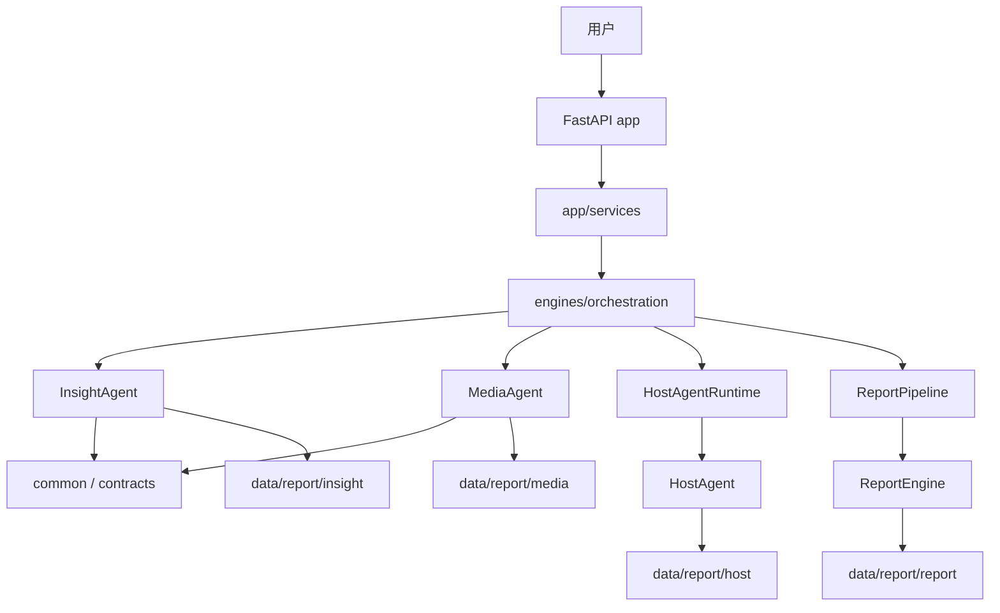
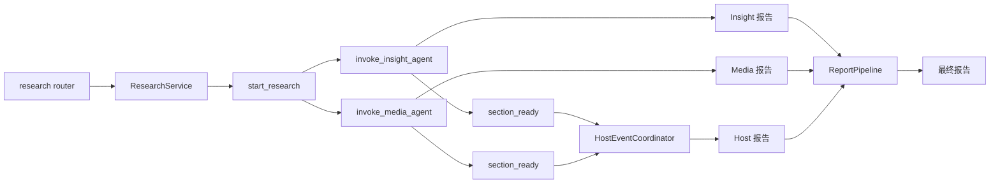
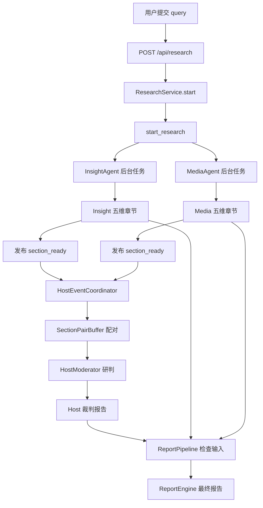
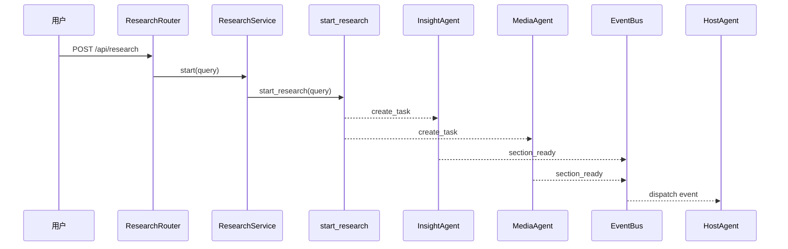
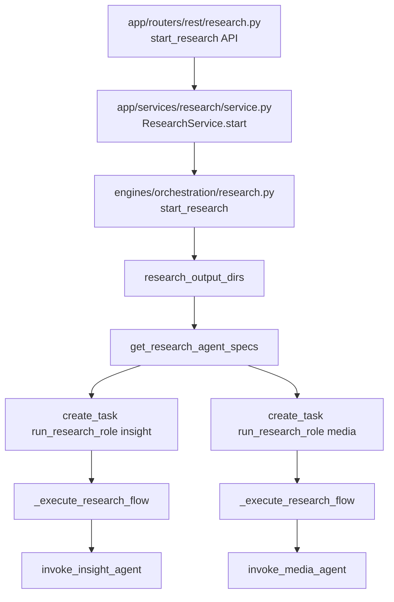

# Day01 上午：项目业务背景、整体架构、端到端主流程

## 1. 本节讲解范围

### 1.1 本节涉及的模块

#### 1.1.1 相关目录

本节用于建立整个项目的第一张“全局地图”，主要涉及：

```text
app/                 FastAPI 应用层
engines/             核心业务引擎层
data/report/         报告产物目录
main.py              后端启动入口
```

本项目不是一个简单的 CRUD 系统，而是一个“多 Agent 舆情研究平台”。它的核心不是某个单独接口，而是多个后端模块围绕一次研究任务协作。

#### 1.1.2 相关文件

本节会围绕这些文件建立主线：

```text
main.py
app/main.py
app/routers/rest/research.py
app/services/research/service.py
engines/orchestration/research.py
engines/orchestration/host_runtime.py
engines/orchestration/report_pipeline.py
engines/insight_agent/agent.py
engines/media_agent/agent.py
engines/host_agent/coordinator.py
engines/report_engine/engine.py
```

这些文件共同构成一次完整研究任务的主干。

#### 1.1.3 本节范围边界

本节不展开具体 Agent 内部算法。

暂时不深入：

```text
InsightAgent 的 DB / Milvus 检索细节
MediaAgent 的 WebSearch Provider 细节
HostAgent 的每个 LangGraph 节点
ReportEngine 的 prompt 与 HTML 渲染细节
```

本节只回答一个问题：

```text
用户输入一个研究主题之后，后端系统如何把它推进为最终报告？
```

### 1.2 本节要解决的问题

#### 1.2.1 本节需要掌握的核心问题

本节需要掌握四个核心问题：

```text
1. 项目的业务目标是什么
2. app 层和 engines 层为什么要分开
3. Insight、Media、Host 三个 Agent 如何协作
4. ReportEngine 为什么是后处理引擎，而不是第四个 Agent
```

#### 1.2.2 本节的理解难点

本节最容易混淆的是“多个报告”和“多个阶段”。

系统中至少有四类产物：

```text
Insight 私域研究报告
Media 全网媒体研究报告
Host 主持人裁判报告
ReportEngine 最终综合报告
```

它们不是同一个文件，也不是同一个阶段生成。

#### 1.2.3 本节和下一节的关系

本节讲“架构和主流程”。

Day01 下午讲“如何启动、如何跑通、如何观察输出”。

也就是说：

```text
上午：先知道系统怎么设计
下午：再把系统真实跑起来
```

## 2. 本节在项目中的位置

### 2.1 全局架构定位

#### 2.1.1 当前模块属于哪一层

本节覆盖的是全项目架构层。

项目可以分成四层：

```text
HTTP 接入层       app/routers
应用服务层       app/services
核心业务引擎层   engines
文件产物层       data/report
```

其中最重要的是 `app` 和 `engines` 的边界。

#### 2.1.2 上游模块是谁

上游是外部用户动作，最终表现为 HTTP 请求：

```text
POST /api/research
POST /api/report/generate
GET  /api/report/result/{task_id}
```

本节重点关注：

```text
POST /api/research
```

因为它是研究链路的起点。

#### 2.1.3 下游模块是谁

下游包括：

```text
LLM 服务
私域数据库
向量库
Web 搜索 API
本地报告文件
```

不同 Agent 的下游不同：

```text
InsightAgent -> 私域 DB / Milvus / LLM
MediaAgent   -> Web Search / LLM
HostAgent    -> EventBus / LLM / Host 报告目录
ReportEngine -> 三方报告文件 / LLM / Markdown / HTML
```

### 2.2 当前模块的职责边界

#### 2.2.1 它负责什么

整体架构中各模块职责如下：

```text
app
接收请求、绑定路由、依赖注入、应用生命周期、任务状态。

engines/orchestration
负责编排研究任务、Host 运行时、最终报告 pipeline。

engines/insight_agent
负责私域舆情库研究。

engines/media_agent
负责全网媒体研究。

engines/host_agent
负责主持人配对裁决。

engines/report_engine
负责最终综合报告生成。
```

#### 2.2.2 它不负责什么

`app` 层不应该直接做检索、搜索、LLM 生成、报告拼接。

`engines` 层不应该关心 HTTP 请求细节。

这种分层让业务逻辑可以脱离 Web 框架单独演进。

#### 2.2.3 为什么这样分层

如果不分层，代码会变成：

```text
router 里查数据库
router 里调用 LLM
router 里搜索网页
router 里写文件
router 里拼最终报告
```

这样很快无法维护。

当前设计把“接口适配”和“业务引擎”分开，后续扩展新的 Agent 或替换搜索服务时，不需要重写 API 层。

### 2.3 位置流程图

#### 2.3.1 全局位置图



#### 2.3.2 当前模块放大图



#### 2.3.3 图中每个节点的含义

`ResearchService` 是应用服务层入口。

它不关心 Agent 内部怎么跑，只负责调用编排层。

`start_research` 是研究编排入口。

它会并发启动 Insight 和 Media。

`section_ready` 是跨 Agent 协作事件。

HostAgent 不是被 Insight/Media 直接调用，而是通过事件监听被动接收章节结果。

`ReportPipeline` 是最终报告生成编排。

它读取三方报告，再调用 ReportEngine。

## 3. 总体逻辑流程图

### 3.1 主流程说明

#### 3.1.1 输入从哪里来

主输入来自研究主题：

```json
{
  "query": "高考"
}
```

它先进入：

```text
POST /api/research
```

然后传给：

```text
ResearchService.start(query)
```

#### 3.1.2 中间经过哪些步骤

完整链路分为六步：

```text
1. FastAPI 接收研究请求
2. ResearchService 调用编排层
3. orchestration 并发启动 Insight 和 Media
4. Insight/Media 生成章节并发布 section_ready
5. Host 监听事件并做主持人裁判
6. ReportPipeline 调用 ReportEngine 生成最终报告
```

#### 3.1.3 输出到哪里去

输出最终进入文件系统：

```text
data/report/insight
data/report/media
data/report/host
data/report/report
```

四个目录对应四类报告。

### 3.2 主流程图

#### 3.2.1 Mermaid 流程图



#### 3.2.2 流程图逐节点解释

`POST /api/research` 只负责启动研究任务。

它不会直接返回最终报告。

`start_research` 会创建两个后台任务：

```text
InsightAgent
MediaAgent
```

它们并行研究同一个 query。

HostAgent 的触发点不是 HTTP 请求，而是：

```text
section_ready 事件
```

ReportEngine 的触发点也不是研究接口，而是最终报告接口。

#### 3.2.3 关键转折点

第一个转折点：

```text
同步请求 -> 后台任务
```

第二个转折点：

```text
独立研究 -> 事件协作
```

第三个转折点：

```text
三方报告 -> 最终综合报告
```

## 4. 核心数据流图

### 4.1 输入数据结构

#### 4.1.1 请求参数或事件数据

研究请求输入是 query。

跨 Agent 事件输入是 `SectionReadyEvent`，包含：

```text
source
agent
section_key
section_index
title
query
body
hit_count
used_query
sources
evidence_pack
evidence_strength
missing_notes
```

#### 4.1.2 关键字段含义

`source` 表示来源：

```text
insight
media
```

`section_key` 表示固定研究维度。

`body` 表示章节正文。

`evidence_strength` 表示证据强度。

#### 4.1.3 字段为什么这样设计

HostAgent 需要把 Insight 和 Media 的同一维度章节配对。

如果没有 `section_key`，只能靠标题匹配，稳定性很差。

所以项目使用固定五维研究框架，让两个 Agent 输出天然可对齐。

### 4.2 中间状态变化

#### 4.2.1 初始状态

Agent 初始状态一般包含：

```text
query
role
save_report
```

#### 4.2.2 状态更新点

InsightAgent 状态更新更复杂：

```text
retrieval -> rank -> cluster -> plan -> section_assign -> summarize
```

MediaAgent 状态更新相对轻：

```text
plan -> search -> summarize
```

HostAgent 状态更新是事件驱动：

```text
incoming event -> section_result -> ready_pairs -> moderation -> final_report
```

#### 4.2.3 状态如何传递

状态传递有两种方式：

```text
LangGraph 内部 state 传递
EventBus 跨 Agent 事件传递
```

### 4.3 输出数据结构

#### 4.3.1 返回值

研究启动接口返回的是启动状态，不是最终报告：

```json
{
  "success": true,
  "message": "已启动所有研究角色",
  "query": "高考"
}
```

#### 4.3.2 文件产物

核心文件产物包括：

```text
Insight Markdown / JSON
Media Markdown / JSON
Host Markdown / JSON
Report Markdown / HTML
```

#### 4.3.3 事件产物

运行时会产生：

```text
role_progress
role_result
role_error
section_ready
host_discussion_message
```

## 5. 核心调用链图

### 5.1 调用入口

#### 5.1.1 入口函数

后端入口：

```text
main.py
```

FastAPI 应用入口：

```text
app/main.py
```

研究编排入口：

```text
engines/orchestration/research.py
```

#### 5.1.2 入口类

核心入口类：

```text
ResearchService
HostAgentRuntime
ReportPipeline
```

#### 5.1.3 谁调用入口

调用顺序：

```text
HTTP 请求
-> FastAPI router
-> app service
-> engines orchestration
-> Agent invoker
```

### 5.2 调用链展开

#### 5.2.1 第一层调用

第一层是路由：

```text
app/routers/rest/research.py
```

它调用：

```text
ResearchService.start()
```

#### 5.2.2 第二层调用

第二层是应用服务：

```text
app/services/research/service.py
```

它调用：

```text
start_research(query)
```

#### 5.2.3 第三层调用

第三层是编排层：

```text
engines/orchestration/research.py
```

它通过注册表启动不同研究角色。

### 5.3 调用链图

#### 5.3.1 Mermaid 时序图



#### 5.3.2 每一步调用解释

Router 负责 HTTP 入口。

Service 负责应用层语义。

Orchestration 负责后台任务编排。

Insight 和 Media 负责独立研究。

EventBus 负责跨 Agent 解耦。

Host 负责主持裁决。

#### 5.3.3 调用链中的关键依赖

关键依赖：

```text
ResearchAgentSpec
EventBus
Report 文件系统
```

## 6. 手写真实项目核心逻辑

### 6.1 为什么手写真实项目文件

#### 6.1.1 手写不是独立 Demo

本课程中的“手写代码”不是另外新建一个脱离项目的 demo。

手写必须发生在真实项目结构中。

也就是说，手写代码时要明确：

```text
完整包路径
完整 .py 文件名
完整文件代码
这个文件在项目链路中的位置
```

本节手写的不是伪代码，而是研究任务启动主链路上的真实文件。

#### 6.1.2 本节手写哪些真实文件

本节手写三层真实代码：

```text
app/routers/rest/research.py
app/services/research/service.py
engines/orchestration/research.py
```

这三个文件正好对应：

```text
HTTP 入口
应用服务门面
核心研究编排
```

#### 6.1.3 和项目主链路的对应关系

这三个真实文件串起来就是：

```text
POST /api/research
-> app/routers/rest/research.py
-> app/services/research/service.py
-> engines/orchestration/research.py
-> InsightAgent / MediaAgent
```

所以手写时不是为了写“更简单的代码”，而是为了把真实项目主链路按顺序写出来。

### 6.2 手写代码一：`app/routers/rest/research.py`

#### 6.2.1 要实现什么

这一段先手写研究任务的 HTTP 入口。

它要实现两个接口：

```text
POST /api/research
GET  /api/research/latest
```

第一个接口负责启动研究。

第二个接口负责获取最新研究结果。

#### 6.2.2 代码实现

完整包路径与文件名：

```text
app/routers/rest/research.py
```

完整代码如下：

```python
"""研究任务路由。"""

from fastapi import APIRouter

from app.dependencies import ResearchServiceDep
from app.schemas.research import LatestResearchResultsResponse, ResearchRequest, ResearchStartResponse

router = APIRouter(prefix="/api/research", tags=["研究任务"])


@router.post("", response_model=ResearchStartResponse)
async def start_research(payload: ResearchRequest, service: ResearchServiceDep):
    return service.start(payload.query)


@router.get("/latest", response_model=LatestResearchResultsResponse)
async def latest_research_results(service: ResearchServiceDep):
    return service.latest_results()
```

#### 6.2.3 逐行解释

`APIRouter(prefix="/api/research", tags=["研究任务"])` 定义当前 router 的统一前缀。

这意味着：

```text
@router.post("")
```

最终路径是：

```text
POST /api/research
```

`ResearchServiceDep` 是依赖注入类型。

Router 不自己创建 `ResearchService`，而是交给 FastAPI 依赖系统。

`payload: ResearchRequest` 表示请求体必须符合研究请求 schema。

`response_model=ResearchStartResponse` 表示返回值会按照响应模型输出。

`service.start(payload.query)` 是当前接口唯一真正做的事情。

Router 不直接调用 Agent，也不直接调用 engines。

#### 6.2.4 为什么这样手写

这一段手写的重点不是 FastAPI 语法本身，而是建立一个规则：

```text
Router 只负责 HTTP 入口
Router 不负责业务编排
Router 不直接调用 Agent
```

如果一开始就让 Router 调用 `invoke_insight_agent()` 或 `invoke_media_agent()`，后面应用层和引擎层就会耦合。

### 6.3 手写代码二：`app/services/research/service.py`

#### 6.3.1 要实现什么

这一段手写研究任务的应用服务门面。

它位于：

```text
Router 和 engines/orchestration 中间
```

它要完成两件事：

```text
启动研究任务
读取最新研究结果
```

#### 6.3.2 代码实现

完整包路径与文件名：

```text
app/services/research/service.py
```

完整代码如下：

```python
"""应用服务模块：app/services/research/service.py。"""

from typing import Any

from engines.common.io import latest_markdown_report, matching_state_file
from engines.orchestration import research_output_dirs, start_research


class ResearchService:
    def output_dirs(self) -> dict[str, str]:
        return research_output_dirs()

    def start(self, query: str) -> dict[str, Any]:
        start_research(query)
        return {"success": True, "message": "已启动所有研究角色", "query": query}

    def latest_results(self) -> dict[str, Any]:
        results: dict[str, Any] = {}
        for role, output_dir in self.output_dirs().items():
            latest_md = latest_markdown_report(output_dir)
            if not latest_md:
                continue

            state_file = matching_state_file(latest_md)

            results[role] = {
                "role": role,
                "status": "done",
                "final_report": latest_md.read_text(encoding="utf-8", errors="ignore"),
                "report_file": str(latest_md),
                "state_file": str(state_file) if state_file else "",
                "updated_at": latest_md.stat().st_mtime,
            }
        return {"success": True, "results": results}
```

```text
ResearchService 不是 Agent
ResearchService 不做研究
ResearchService 只是 app 层门面
```

`start()` 方法只调用：

```python
start_research(query)
```

然后返回启动确认。

这说明研究任务是后台执行，不是同步返回最终结果。

#### 6.3.4 为什么这样手写

如果没有 `ResearchService`，Router 就会直接调用 engines。

短期可以运行，但长期会出现问题：

```text
HTTP 参数处理和业务编排混在一起
后续任务状态、权限、日志不好加
测试时难以单独替换 service
```

所以这里保留应用服务层。

### 6.4 手写代码三：`engines/orchestration/research.py`

#### 6.4.1 要实现什么

这一段手写真正的研究编排层。

它负责：

```text
定义研究角色规格
注册 InsightAgent 和 MediaAgent
并发启动研究角色
发布角色进度、完成、错误事件
```

#### 6.4.2 代码实现

完整包路径与文件名：

```text
engines/orchestration/research.py
```

完整代码如下：

```python
"""研究 Agent 注册与运行编排。"""

from __future__ import annotations

import asyncio
import traceback
from dataclasses import dataclass
from typing import Awaitable, Callable

from loguru import logger

from engines.common.eventing import (
    publish_role_error,
    publish_role_progress,
    publish_role_result,
)
from engines.common.models import ProgressUpdate
from engines.common.runtime.role_log_stream import route_logs_by_role
from engines.contracts import config
from engines.contracts.config import Settings
from engines.contracts.events import RoleErrorEvent, RoleProgressEvent, RoleResultEvent
from engines.insight_agent.agent import invoke_insight_agent
from engines.llm.llm_client import LLMClient
from engines.media_agent.agent import invoke_media_agent

ProgressCallback = Callable[[ProgressUpdate], None]
AgentInvoker = Callable[[str, str, Settings, LLMClient, str, ProgressCallback | None, bool], Awaitable[None]]


@dataclass(frozen=True)
class ResearchAgentSpec:
    role: str
    output_dir: str
    invoker: AgentInvoker


def get_research_agent_specs() -> dict[str, ResearchAgentSpec]:
    return {
        "insight": ResearchAgentSpec(
            role="insight",
            output_dir=config.settings.INSIGHT_REPORT_DIR,
            invoker=invoke_insight_agent,
        ),
        "media": ResearchAgentSpec(
            role="media",
            output_dir=config.settings.MEDIA_REPORT_DIR,
            invoker=invoke_media_agent,
        ),
    }


def research_output_dirs() -> dict[str, str]:
    return {role: spec.output_dir for role, spec in get_research_agent_specs().items()}


def start_research(query: str) -> tuple[str, ...]:
    roles = tuple(research_output_dirs())
    for role in roles:
        asyncio.create_task(run_research_role(role, query))
    return roles


async def run_research_role(role: str, query: str) -> None:
    with route_logs_by_role(role):
        try:
            _publish_role_progress(role, ProgressUpdate("starting", "正在初始化研究角色...", 0))
            await _execute_research_flow(role, query)
            publish_role_result(RoleResultEvent(role=role, status="done"))
        except Exception as exc:
            logger.exception(f"[{role}] 研究角色执行失败: {exc}")
            publish_role_error(RoleErrorEvent(
                role=role,
                error=str(exc),
                traceback=traceback.format_exc(),
            ))


async def _execute_research_flow(role: str, query: str) -> None:
    agent_spec = get_research_agent_specs()[role]
    llm_client = LLMClient.from_role(agent_spec.role)

    await agent_spec.invoker(
        query,
        agent_spec.role,
        config.settings,
        llm_client,
        agent_spec.output_dir,
        lambda update: _publish_role_progress(role, update),
        True,
    )


def _publish_role_progress(role: str, update: ProgressUpdate) -> None:
    publish_role_progress(RoleProgressEvent(role=role, **update.to_dict()))
```

#### 6.4.3 逐块解释

`ResearchAgentSpec` 是研究角色规格。

它告诉系统：

```text
角色叫什么
输出目录在哪里
启动入口函数是谁
```

`get_research_agent_specs()` 是研究角色注册表。

当前只注册两个研究角色：

```text
insight
media
```

`start_research()` 会遍历输出目录中的角色键，并通过：

```python
asyncio.create_task(...)
```

启动后台任务。

`run_research_role()` 是单个角色的运行包装。

它负责：

```text
role_progress
role_result
role_error
```

这些事件不是 Agent 内部业务，而是运行时状态。

`_execute_research_flow()` 才真正调用 Agent invoker。

#### 6.4.4 为什么这样手写

这个文件是 Day01 上午最重要的手写文件。

它体现了项目主流程里的三个关键设计：

```text
注册表驱动
异步后台运行
运行事件发布
```

如果这三个点不理解，后面讲 InsightAgent 和 MediaAgent 时会很难理解为什么它们不是直接被 API 同步调用。

## 7. 手写逻辑执行流程图

### 7.1 手写代码执行过程

#### 7.1.1 第一步执行什么

真实入口从 HTTP router 开始：

```python
service.start(payload.query)
```

对应真实文件：

```text
app/routers/rest/research.py
```

这一步表示研究请求已经通过 FastAPI 进入应用服务层。

#### 7.1.2 第二步执行什么

`ResearchService.start()` 会调用编排层：

```python
start_research(query)
```

对应真实文件：

```text
app/services/research/service.py
```

然后 `engines/orchestration/research.py` 会创建两个后台任务：

```text
run_research_role("insight", query)
run_research_role("media", query)
```

#### 7.1.3 最终得到什么

研究编排层本身不会直接得到最终报告。

它会得到两个后台运行中的研究任务。

每个任务完成后会产生运行事件：

```text
role_progress
role_result
role_error
```

后续在具体 Agent 内部，章节写作完成后还会发布：

```text
section_ready
```

这个 `section_ready` 才是 HostAgent 介入的关键。

### 7.2 手写流程图

#### 7.2.1 Mermaid 流程图



#### 7.2.2 流程图对应代码位置

`app/routers/rest/research.py` 中的入口调用：

```python
return service.start(payload.query)
```

`app/services/research/service.py` 中的应用服务调用：

```python
start_research(query)
```

`engines/orchestration/research.py` 中的后台任务创建：

```python
asyncio.create_task(run_research_role(role, query))
```

`_execute_research_flow()` 中真正调用 Agent：

```python
await agent_spec.invoker(...)
```

#### 7.2.3 需要抓住的核心点

核心点是：

```text
Router 只接收 HTTP 请求
Service 只做应用层转发
orchestration 决定启动哪些研究角色
ResearchAgentSpec 决定角色入口和输出目录
asyncio.create_task 决定后台并发执行
```

## 8. 项目源码解读

### 8.1 文件一：`app/main.py`

#### 8.1.1 文件职责

`app/main.py` 负责创建 FastAPI 应用、注册中间件、注册路由、绑定生命周期。

#### 8.1.2 为什么需要这个文件

所有 HTTP 请求都要先进入 FastAPI 应用。

如果没有这个入口，后续 router、service、engine 都不会被调用。

#### 8.1.3 上游调用者

上游是：

```text
main.py
uvicorn
```

#### 8.1.4 下游依赖

下游包括：

```text
app.routers
ApplicationLifecycleService
```

#### 8.1.5 完整源码

完整包路径与文件名：

```text
app/main.py
```

完整代码如下：

```python
"""FastAPI 应用入口与路由注册。"""

from contextlib import asynccontextmanager

from fastapi import FastAPI
from fastapi.middleware.cors import CORSMiddleware

from app.routers import sse
from app.routers.rest import config, dimensions, host, report, research
from app.services.system import get_lifecycle_service


@asynccontextmanager
async def lifespan(app: FastAPI):
    lifecycle_service = get_lifecycle_service()
    lifecycle_service.start()
    try:
        yield
    finally:
        lifecycle_service.shutdown()


app = FastAPI(title="尚舆分析平台 API", version="3.0.0", lifespan=lifespan)

app.add_middleware(
    CORSMiddleware,
    allow_origins=["*"],
    allow_methods=["*"],
    allow_headers=["*"],
)

app.include_router(config.router)
app.include_router(dimensions.router)
app.include_router(host.router)
app.include_router(research.router)
app.include_router(sse.router)
app.include_router(report.router)


@app.get("/")
async def root():
    return {"service": "尚舆分析平台 API", "version": "3.0.0", "status": "running"}
```

#### 8.1.6 代码逐块解释

`FastAPI(...)` 创建应用实例。

`lifespan=lifespan` 表示应用启动和关闭时会执行生命周期逻辑。

`include_router(...)` 把不同业务接口挂到同一个 FastAPI 应用上。

#### 8.1.7 关键设计意图

路由按业务拆开：

```text
research
host
report
sse
config
dimensions
```

这样接口入口清晰，不会堆在一个大文件里。

#### 8.1.8 如果不这样设计会怎样

如果所有接口都写在 `app/main.py`，启动入口会变成巨型文件。

路由、业务、状态管理混在一起，后续很难维护。

### 8.2 文件二：`app/services/research/service.py`

#### 8.2.1 文件职责

`ResearchService` 是研究任务的应用服务门面。

它负责把 API 层请求转给编排层。

#### 8.2.2 为什么需要这个文件

Router 不应该直接调用 engines。

中间加一层 service，可以隔离 HTTP 和业务引擎。

#### 8.2.3 上游调用者

上游是：

```text
app/routers/rest/research.py
```

#### 8.2.4 下游依赖

下游是：

```text
engines.orchestration.start_research
engines.orchestration.research_output_dirs
```

#### 8.2.5 完整源码

完整包路径与文件名：

```text
app/services/research/service.py
```

完整代码如下：

```python
"""应用服务模块：app/services/research/service.py。"""

from typing import Any

from engines.common.io import latest_markdown_report, matching_state_file
from engines.orchestration import research_output_dirs, start_research


class ResearchService:
    def output_dirs(self) -> dict[str, str]:
        return research_output_dirs()

    def start(self, query: str) -> dict[str, Any]:
        start_research(query)
        return {"success": True, "message": "已启动所有研究角色", "query": query}

    def latest_results(self) -> dict[str, Any]:
        results: dict[str, Any] = {}
        for role, output_dir in self.output_dirs().items():
            latest_md = latest_markdown_report(output_dir)
            if not latest_md:
                continue

            state_file = matching_state_file(latest_md)

            results[role] = {
                "role": role,
                "status": "done",
                "final_report": latest_md.read_text(encoding="utf-8", errors="ignore"),
                "report_file": str(latest_md),
                "state_file": str(state_file) if state_file else "",
                "updated_at": latest_md.stat().st_mtime,
            }
        return {"success": True, "results": results}
```

#### 8.2.6 代码逐块解释

`output_dirs()` 用于获取各研究角色的输出目录。

`start()` 调用 `start_research(query)`，启动后台研究任务。

返回值只是启动确认，不是最终结果。

#### 8.2.7 关键设计意图

应用服务层保持很薄。

它只做协调，不做具体研究。

#### 8.2.8 如果不这样设计会怎样

如果 Router 直接调用 `start_research()`，短期也能运行。

但后续如果要加权限、任务记录、参数清洗、审计日志，就会污染 Router。

### 8.3 文件三：`engines/orchestration/research.py`

#### 8.3.1 文件职责

这个文件负责研究角色注册和运行编排。

它把 Insight 和 Media 注册成可启动的研究角色。

#### 8.3.2 为什么需要这个文件

系统不能把启动逻辑写死在 API 层。

需要一个地方统一说明：

```text
当前有哪些研究角色
每个角色输出到哪里
每个角色的执行入口是谁
```

#### 8.3.3 上游调用者

上游是：

```text
ResearchService
```

#### 8.3.4 下游依赖

下游是：

```text
invoke_insight_agent
invoke_media_agent
LLMClient
EventBus publishers
```

#### 8.3.5 完整源码

完整包路径与文件名：

```text
engines/orchestration/research.py
```

完整代码如下：

```python
"""研究 Agent 注册与运行编排。"""

from __future__ import annotations

import asyncio
import traceback
from dataclasses import dataclass
from typing import Awaitable, Callable

from loguru import logger

from engines.common.eventing import (
    publish_role_error,
    publish_role_progress,
    publish_role_result,
)
from engines.common.models import ProgressUpdate
from engines.common.runtime.role_log_stream import route_logs_by_role
from engines.contracts import config
from engines.contracts.config import Settings
from engines.contracts.events import RoleErrorEvent, RoleProgressEvent, RoleResultEvent
from engines.insight_agent.agent import invoke_insight_agent
from engines.llm.llm_client import LLMClient
from engines.media_agent.agent import invoke_media_agent

ProgressCallback = Callable[[ProgressUpdate], None]
AgentInvoker = Callable[[str, str, Settings, LLMClient, str, ProgressCallback | None, bool], Awaitable[None]]


@dataclass(frozen=True)
class ResearchAgentSpec:
    role: str
    output_dir: str
    invoker: AgentInvoker


def get_research_agent_specs() -> dict[str, ResearchAgentSpec]:
    return {
        "insight": ResearchAgentSpec(
            role="insight",
            output_dir=config.settings.INSIGHT_REPORT_DIR,
            invoker=invoke_insight_agent,
        ),
        "media": ResearchAgentSpec(
            role="media",
            output_dir=config.settings.MEDIA_REPORT_DIR,
            invoker=invoke_media_agent,
        ),
    }


def research_output_dirs() -> dict[str, str]:
    return {role: spec.output_dir for role, spec in get_research_agent_specs().items()}


def start_research(query: str) -> tuple[str, ...]:
    roles = tuple(research_output_dirs())
    for role in roles:
        asyncio.create_task(run_research_role(role, query))
    return roles


async def run_research_role(role: str, query: str) -> None:
    with route_logs_by_role(role):
        try:
            _publish_role_progress(role, ProgressUpdate("starting", "正在初始化研究角色...", 0))
            await _execute_research_flow(role, query)
            publish_role_result(RoleResultEvent(role=role, status="done"))
        except Exception as exc:
            logger.exception(f"[{role}] 研究角色执行失败: {exc}")
            publish_role_error(RoleErrorEvent(
                role=role,
                error=str(exc),
                traceback=traceback.format_exc(),
            ))


async def _execute_research_flow(role: str, query: str) -> None:
    agent_spec = get_research_agent_specs()[role]
    llm_client = LLMClient.from_role(agent_spec.role)

    await agent_spec.invoker(
        query,
        agent_spec.role,
        config.settings,
        llm_client,
        agent_spec.output_dir,
        lambda update: _publish_role_progress(role, update),
        True,
    )


def _publish_role_progress(role: str, update: ProgressUpdate) -> None:
    publish_role_progress(RoleProgressEvent(role=role, **update.to_dict()))
```

#### 8.3.6 代码逐块解释

`ResearchAgentSpec` 是研究角色规格。

它包含：

```text
role
output_dir
invoker
```

`role` 是角色名。

`output_dir` 是报告输出目录。

`invoker` 是真正执行 Agent 的函数。

#### 8.3.7 关键设计意图

注册表让编排层不需要写大量 if/else。

新增研究角色时，可以通过增加一条 spec 扩展。

#### 8.3.8 如果不这样设计会怎样

如果写成：

```python
if role == "insight":
    ...
elif role == "media":
    ...
```

随着角色增加，编排层会越来越乱。

### 8.4 文件四：`main.py`

#### 8.4.1 文件职责

`main.py` 是项目根目录下的服务启动入口。

它负责导入 FastAPI 应用对象，并在直接运行该文件时启动 `uvicorn`。

#### 8.4.2 为什么需要这个文件

`app/main.py` 定义的是 FastAPI 应用本身。

`main.py` 提供的是“从命令行启动服务”的入口。

这两个职责不能混在一起。

#### 8.4.3 上游调用者

上游通常是命令行：

```text
python main.py
```

或者开发工具中的 Run 配置。

#### 8.4.4 下游依赖

下游依赖：

```text
app.main.app
app.settings.config
uvicorn
```

#### 8.4.5 完整源码

完整包路径与文件名：

```text
main.py
```

完整代码如下：

```python
"""服务启动入口。"""

from app.main import app

if __name__ == "__main__":
    import uvicorn

    from app import settings as config

    uvicorn.run(app, host=config.settings.HOST, port=config.settings.PORT, log_level="info")
```

#### 8.4.6 代码逐块解释

`from app.main import app` 导入 FastAPI 应用对象。

`if __name__ == "__main__":` 表示只有直接运行 `main.py` 时才执行启动逻辑。

`uvicorn.run(...)` 负责启动 ASGI 服务。

`config.settings.HOST` 和 `config.settings.PORT` 来自项目配置。

#### 8.4.7 关键设计意图

根入口只做启动，不写业务逻辑。

真正的应用配置、路由注册、生命周期都放在 `app/main.py`。

#### 8.4.8 如果不这样设计会怎样

如果把路由注册、服务启动、业务逻辑都写进根目录 `main.py`，项目入口会越来越臃肿。

分离后，`main.py` 可以保持稳定，`app/main.py` 可以专注 FastAPI 应用定义。

### 8.5 文件五：`app/routers/rest/research.py`

#### 8.5.1 文件职责

`app/routers/rest/research.py` 负责研究任务相关 HTTP 接口。

它是用户启动研究任务和查看最新研究结果的 API 入口。

#### 8.5.2 为什么需要这个文件

研究任务接口不应该直接写在 `app/main.py`。

单独拆成 router 后，接口职责更清楚。

#### 8.5.3 上游调用者

上游是 HTTP 请求：

```text
POST /api/research
GET  /api/research/latest
```

#### 8.5.4 下游依赖

下游依赖：

```text
ResearchServiceDep
ResearchRequest
ResearchStartResponse
LatestResearchResultsResponse
```

`ResearchServiceDep` 由 FastAPI 依赖注入提供。

#### 8.5.5 完整源码

完整包路径与文件名：

```text
app/routers/rest/research.py
```

完整代码如下：

```python
"""研究任务路由。"""

from fastapi import APIRouter

from app.dependencies import ResearchServiceDep
from app.schemas.research import LatestResearchResultsResponse, ResearchRequest, ResearchStartResponse

router = APIRouter(prefix="/api/research", tags=["研究任务"])


@router.post("", response_model=ResearchStartResponse)
async def start_research(payload: ResearchRequest, service: ResearchServiceDep):
    return service.start(payload.query)


@router.get("/latest", response_model=LatestResearchResultsResponse)
async def latest_research_results(service: ResearchServiceDep):
    return service.latest_results()
```

#### 8.5.6 代码逐块解释

`APIRouter(prefix="/api/research")` 表示当前文件下所有接口都以 `/api/research` 开头。

`@router.post("")` 对应：

```text
POST /api/research
```

它接收 `ResearchRequest`，然后调用：

```python
service.start(payload.query)
```

`@router.get("/latest")` 对应：

```text
GET /api/research/latest
```

它用于读取最新研究报告结果。

#### 8.5.7 关键设计意图

Router 只做三件事：

```text
声明 URL
声明请求/响应模型
调用 service
```

它不做 Agent 编排、不读写报告、不调用 LLM。

#### 8.5.8 如果不这样设计会怎样

如果 Router 直接调用 Agent，HTTP 层会和业务引擎强耦合。

后续如果要换接口形式，例如 CLI、任务队列、内部 RPC，就很难复用核心逻辑。

## 9. 关键对象与状态拆解

### 9.1 核心对象一：`ResearchAgentSpec`

#### 9.1.1 对象定义

`ResearchAgentSpec` 表示一个研究角色的运行规格。

#### 9.1.2 字段含义

```text
role        角色标识
output_dir  报告输出目录
invoker     Agent 执行入口
```

#### 9.1.3 生命周期

每次调用 `get_research_agent_specs()` 都会构造当前注册表。

它不保存运行状态，只描述角色如何启动。

### 9.2 核心对象二：`SectionReadyEvent`

#### 9.2.1 对象定义

`SectionReadyEvent` 是章节完成事件。

它是 Insight/Media 与 Host 的接口契约。

#### 9.2.2 字段含义

核心字段：

```text
source
section_key
title
body
evidence_strength
```

#### 9.2.3 生命周期

当某个 Agent 完成一个章节写作后发布。

HostAgent 接收后进入配对缓冲区。

### 9.3 对象之间的关系

#### 9.3.1 组合关系

```text
ResearchService 使用 orchestration
orchestration 使用 ResearchAgentSpec
ResearchAgentSpec 持有 invoker
invoker 启动具体 Agent
```

#### 9.3.2 调用关系

```text
ResearchService.start
-> start_research
-> run_research_role
-> _execute_research_flow
-> agent_spec.invoker
```

#### 9.3.3 数据传递关系

```text
query
-> ResearchService
-> start_research
-> Insight/Media
-> section_ready
-> Host
-> report files
-> ReportEngine
```

## 10. 边界情况与异常分支

### 10.1 空数据情况

#### 10.1.1 什么情况下为空

可能出现：

```text
私域数据库没有命中
搜索 API 没有结果
某个报告目录还没有 Markdown 文件
```

#### 10.1.2 代码如何处理

研究结果读取时会跳过不存在的最新报告。

最终报告生成时会检查输入是否就绪。

#### 10.1.3 为什么这样处理

因为研究任务是异步执行的。

不能假设用户一发请求，所有报告马上存在。

### 10.2 重复调用情况

#### 10.2.1 什么情况下重复

用户可能连续点击开始研究。

Host 也可能收到重复 section。

#### 10.2.2 代码如何避免问题

研究阶段通过后台任务运行。

Host 内部通过配对缓冲和质量比较处理重复 section。

#### 10.2.3 如果不处理会怎样

重复章节可能导致 Host 重复研判。

最终报告可能混入旧数据。

### 10.3 失败兜底情况

#### 10.3.1 哪些地方可能失败

```text
LLM 调用失败
搜索 API 失败
DB 连接失败
事件发布失败
报告文件未准备好
```

#### 10.3.2 失败后如何记录

研究角色运行失败会发布 `role_error`。

日志也会按角色路由。

#### 10.3.3 失败是否影响主流程

部分失败会降级为数据缺口。

严重失败会导致该角色报告无法生成。

最终报告阶段如果三方输入不齐，会直接提示输入未就绪。

## 11. 本节代码在完整链路中的作用

### 11.1 本节之前发生了什么

#### 11.1.1 上一段链路输出

本节是第一节，没有上一段代码链路。

从业务上看，上一段是用户在页面输入研究主题。

#### 11.1.2 本节接收的数据

本节主线接收：

```text
query
```

#### 11.1.3 本节开始的条件

后端服务已经启动，FastAPI 路由已经注册。

### 11.2 本节推进了什么

#### 11.2.1 推进了哪一步业务

本节从全局解释：

```text
研究请求如何启动多个 Agent
多个 Agent 如何协作
三方报告如何进入最终报告
```

#### 11.2.2 改变了哪些状态

研究启动后会产生：

```text
后台任务状态
角色进度事件
章节事件
报告文件
```

#### 11.2.3 产出了哪些结果

本节不直接产出代码结果，而是产出一张全局认知地图。

后续所有课程都会依赖这张地图。

### 11.3 本节之后交给谁

#### 11.3.1 下游模块

下一节会进入：

```text
项目启动
环境搭建
接口运行
报告目录观察
```

#### 11.3.2 下游输入

下一节使用的输入仍然是：

```text
query
```

但会真正通过接口提交。

#### 11.3.3 下一节课如何衔接

本节已经知道一次研究任务理论上如何流转。

下一节要验证：

```text
服务如何启动
接口如何访问
事件和报告文件如何真实产生
```
