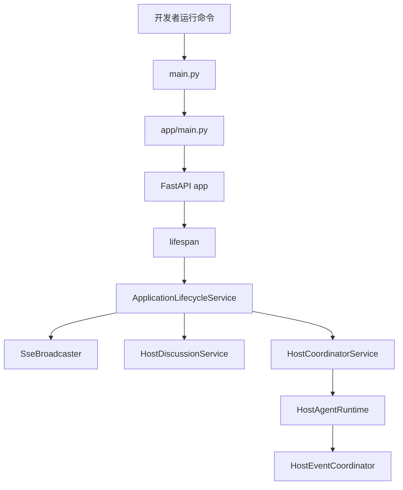
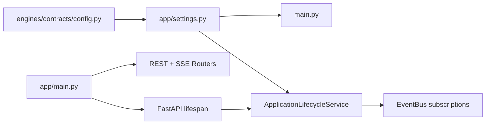
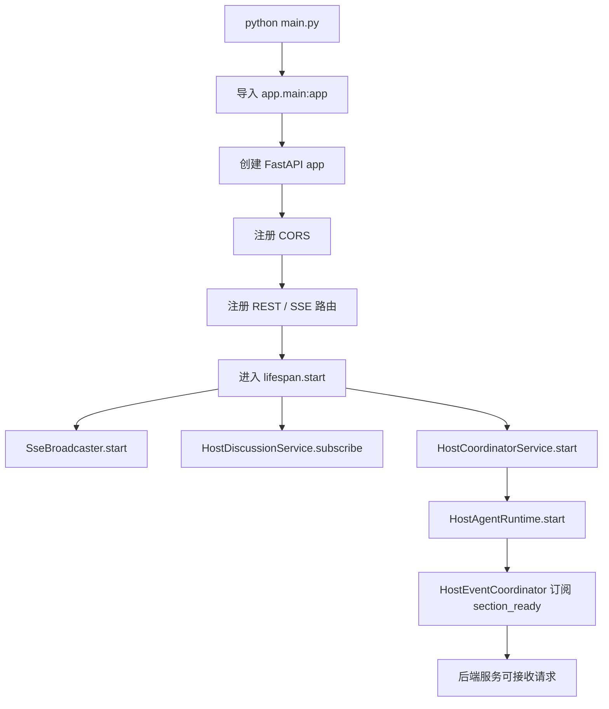
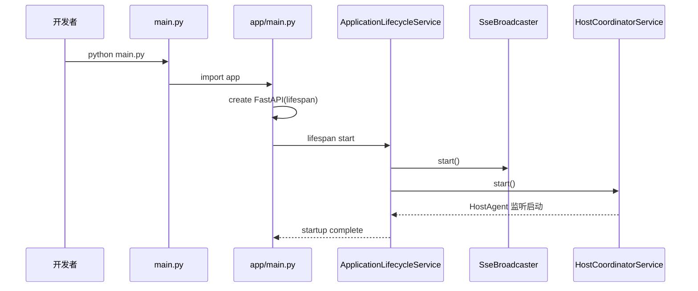
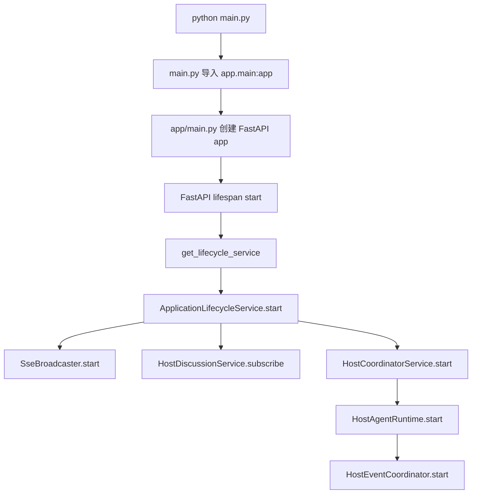

# Day01 下午：环境搭建、启动流程、第一次完整运行

## 1. 本节讲解范围

### 1.1 本节涉及的模块

#### 1.1.1 相关目录

本节从“项目如何真实运行”切入，主要涉及这些目录和文件：

```text
项目根目录
app/
app/services/system/
app/services/realtime/
app/routers/sse/
engines/contracts/
data/report/
```

上午已经讲清楚了项目为什么要分成 `app` 和 `engines`。

下午要解决的问题是：

```text
这个后端项目如何安装依赖、读取配置、启动服务、初始化共享服务、观察第一次运行结果。
```

#### 1.1.2 相关文件

本节重点讲解这些文件：

```text
pyproject.toml
main.py
app/main.py
app/settings.py
engines/contracts/config.py
app/services/system/lifecycle.py
app/services/realtime/sse.py
app/services/realtime/broadcaster.py
app/routers/sse/stream.py
```

其中：

```text
pyproject.toml
```

说明项目依赖和构建配置。

```text
main.py
```

是服务启动入口。

```text
engines/contracts/config.py
```

是配置读取的真实来源。

```text
app/services/system/lifecycle.py
```

负责应用启动时初始化共享服务。

#### 1.1.3 本节范围边界

本节不讲具体 Agent 内部逻辑。

本节也不讲前端代码。

本节重点是后端运行闭环：

```text
安装依赖
配置环境变量
启动 FastAPI
生命周期初始化
SSE 事件通道初始化
HostAgent 监听初始化
第一次调用接口
观察报告目录
```

### 1.2 本节要解决的问题

#### 1.2.1 本节需要掌握的核心问题

本节需要掌握五个问题：

```text
1. 项目依赖从哪里声明
2. 配置从哪里读取
3. main.py 和 app/main.py 的关系是什么
4. FastAPI 启动时哪些共享服务会被初始化
5. 第一次运行时应该观察哪些接口、日志和文件目录
```

#### 1.2.2 本节的理解难点

本节的难点不在算法，而在“启动链路”。

很多项目看起来是从 `main.py` 启动，但真正的初始化逻辑不一定写在 `main.py` 里。

本项目的启动链路是：

```text
main.py
-> app.main:app
-> FastAPI lifespan
-> ApplicationLifecycleService.start()
-> SseBroadcaster.start()
-> HostDiscussionService.subscribe_discussion_messages()
-> HostCoordinatorService.start()
-> HostAgentRuntime.start()
-> HostEventCoordinator.start()
```

这条链路如果不画图，只看代码很容易断。

#### 1.2.3 本节和上一节的关系

上午讲的是：

```text
一次研究任务如何在架构上流动
```

下午讲的是：

```text
这个架构如何在本地进程中启动起来
```

上午偏“业务主流程”，下午偏“运行主流程”。

## 2. 本节在项目中的位置

### 2.1 全局架构定位

#### 2.1.1 当前模块属于哪一层

本节主要处于：

```text
启动入口层
配置层
应用生命周期层
实时事件层
```

这些模块不是业务算法，但它们决定系统能不能跑起来。

如果这些启动和配置逻辑不清楚，后面调试 Agent 时会很困难。

#### 2.1.2 上游模块是谁

上游通常是开发者运行命令：

```bash
python main.py
```

或者：

```bash
uvicorn app.main:app --host 0.0.0.0 --port 5000
```

如果使用 `python main.py`，会走项目根目录的 `main.py`。

如果使用 `uvicorn app.main:app`，会直接加载 `app/main.py` 中的 `app` 对象。

#### 2.1.3 下游模块是谁

启动链路下游包括：

```text
FastAPI app
ApplicationLifecycleService
SseBroadcaster
HostDiscussionService
HostCoordinatorService
HostAgentRuntime
HostEventCoordinator
```

这些模块在应用启动时建立运行时环境。

### 2.2 当前模块的职责边界

#### 2.2.1 它负责什么

本节涉及的启动模块负责：

```text
读取运行配置
创建 FastAPI 应用
注册路由
注册 CORS
启动共享服务
订阅事件总线
准备 SSE 实时事件流
准备 HostAgent 事件监听
```

#### 2.2.2 它不负责什么

启动模块不负责：

```text
执行 InsightAgent 检索
执行 MediaAgent 搜索
执行 HostAgent 研判
执行 ReportEngine 生成最终报告
```

它只负责把系统运行环境搭起来。

#### 2.2.3 为什么这样分层

如果启动入口同时写业务逻辑，会导致：

```text
启动代码难以维护
业务代码难以测试
应用关闭时资源无法统一释放
事件订阅容易重复
```

现在把启动和关闭统一放到生命周期服务里，可以保证：

```text
启动时订阅
关闭时取消订阅
启动时创建共享服务
关闭时清理共享服务
```

### 2.3 位置流程图

#### 2.3.1 全局位置图



#### 2.3.2 当前模块放大图



#### 2.3.3 图中每个节点的含义

`engines/contracts/config.py` 是配置源头。

`app/settings.py` 是应用层对配置的再导出。

`main.py` 使用配置决定监听地址和端口。

`app/main.py` 创建 FastAPI 应用对象。

`lifespan` 负责应用启动和关闭钩子。

`ApplicationLifecycleService` 统一初始化和清理共享服务。

## 3. 总体逻辑流程图

### 3.1 主流程说明

#### 3.1.1 输入从哪里来

启动流程的输入不是业务 query，而是运行环境：

```text
Python 解释器
依赖包
.env 配置
命令行启动方式
```

最常见启动命令：

```bash
python main.py
```

#### 3.1.2 中间经过哪些步骤

启动流程分为七步：

```text
1. Python 执行 main.py
2. main.py 导入 app.main:app
3. app/main.py 创建 FastAPI 应用
4. app/main.py 注册中间件和路由
5. FastAPI 进入 lifespan
6. lifecycle_service.start() 初始化共享服务
7. 后端开始接收 HTTP 请求
```

#### 3.1.3 输出到哪里去

启动成功后的输出不是文件，而是一个可访问的 HTTP 服务。

典型验证接口：

```text
GET /
GET /api/report/status
GET /api/events/stream
```

启动成功后，后续研究流程才可以被触发。

### 3.2 主流程图

#### 3.2.1 Mermaid 流程图



#### 3.2.2 流程图逐节点解释

`python main.py` 是命令行入口。

`导入 app.main:app` 会执行 `app/main.py` 中的应用定义。

`创建 FastAPI app` 会绑定应用名称、版本和 lifespan。

`注册路由` 决定哪些 HTTP 接口可访问。

`lifespan.start` 是真正的运行时初始化点。

`SseBroadcaster.start` 订阅角色进度事件。

`HostCoordinatorService.start` 最终启动 HostAgent 的事件监听。

#### 3.2.3 关键转折点

第一个关键转折点：

```text
配置读取发生在导入配置模块时
```

第二个关键转折点：

```text
FastAPI app 创建不等于服务已启动
```

第三个关键转折点：

```text
HostAgent 不是研究请求触发时才启动，而是应用生命周期启动时就开始监听
```

### 3.3 主流程中的核心判断

#### 3.3.1 正常路径

正常路径：

```text
.env 可读
依赖安装完整
端口未被占用
FastAPI app 创建成功
lifespan.start 执行成功
SSE 和 Host 事件监听启动成功
```

#### 3.3.2 分支路径

常见分支：

```text
没有 .env，使用默认配置
某些 API key 为空，后续具体调用时失败
Insight 向量检索未开启，跳过 Milvus 依赖
搜索 Provider 配置不同，运行时选择不同客户端
```

#### 3.3.3 失败路径

常见失败：

```text
端口被占用
依赖包未安装
Python 版本不满足 >=3.11
.env 配置错误
LLM key 缺失
DB 配置错误
搜索 API key 缺失
```

注意：很多配置错误不会在启动时马上报错，而是在执行具体 Agent 时暴露。

## 4. 核心数据流图

### 4.1 输入数据结构

#### 4.1.1 请求参数或事件数据

启动阶段主要输入是配置。

配置来自：

```text
.env
环境变量
Settings 默认值
```

核心配置字段包括：

```text
HOST
PORT
LOG_LEVEL
DB_HOST
DB_PORT
DB_USER
DB_PASSWORD
INSIGHT_ENGINE_API_KEY
MEDIA_ENGINE_API_KEY
HOST_API_KEY
REPORT_ENGINE_API_KEY
SEARCH_TOOL_TYPE
TAVILY_API_KEY
HOST_REPORT_DIR
INSIGHT_REPORT_DIR
MEDIA_REPORT_DIR
OUTPUT_DIR
```

#### 4.1.2 关键字段含义

`HOST` 和 `PORT` 决定后端监听地址。

`*_API_KEY` 决定对应 LLM 或搜索服务是否能调用。

`*_REPORT_DIR` 决定不同角色报告写到哪里。

`SEARCH_TOOL_TYPE` 决定 MediaAgent 使用哪个搜索提供方。

#### 4.1.3 字段为什么这样设计

不同角色使用不同模型配置。

所以配置不是只有一个：

```text
API_KEY
MODEL_NAME
BASE_URL
```

而是拆成：

```text
INSIGHT_ENGINE_*
MEDIA_ENGINE_*
HOST_*
REPORT_ENGINE_*
```

这样每个角色可以独立切换模型。

### 4.2 中间状态变化

#### 4.2.1 初始状态

导入配置模块时，会创建：

```python
settings = Settings()
```

这个对象读取 `.env` 和环境变量。

#### 4.2.2 状态更新点

应用运行中可以通过：

```python
reload_settings()
```

重新读取配置。

应用生命周期中会创建进程内单例：

```text
ApplicationLifecycleService
SseBroadcaster
HostCoordinatorService
HostDiscussionService
```

#### 4.2.3 状态如何传递

配置传递路径：

```text
engines/contracts/config.py
-> app/settings.py
-> main.py
-> app services
-> engines runtime
```

### 4.3 输出数据结构

#### 4.3.1 返回值

启动后访问根路径：

```text
GET /
```

返回：

```json
{
  "service": "尚舆分析平台 API",
  "version": "3.0.0",
  "status": "running"
}
```

#### 4.3.2 文件产物

启动阶段一般不生成报告文件。

报告文件会在研究和报告生成阶段出现：

```text
data/report/insight
data/report/media
data/report/host
data/report/report
```

#### 4.3.3 事件产物

启动时会建立 SSE 转发器。

真正产生事件是在研究任务运行时：

```text
role_progress
role_result
role_error
```

## 5. 核心调用链图

### 5.1 调用入口

#### 5.1.1 入口函数

启动入口：

```text
main.py
```

应用入口：

```text
app/main.py
```

生命周期入口：

```text
ApplicationLifecycleService.start()
```

#### 5.1.2 入口类

关键类：

```text
Settings
ApplicationLifecycleService
SseBroadcaster
HostAgentRuntime
```

#### 5.1.3 谁调用入口

调用者包括：

```text
命令行
uvicorn
FastAPI lifespan
```

### 5.2 调用链展开

#### 5.2.1 第一层调用

第一层：

```text
python main.py
```

调用：

```python
uvicorn.run(app, host=config.settings.HOST, port=config.settings.PORT, log_level="info")
```

#### 5.2.2 第二层调用

第二层：

```text
FastAPI 加载 app/main.py
```

创建：

```python
app = FastAPI(..., lifespan=lifespan)
```

#### 5.2.3 第三层调用

第三层：

```text
lifespan -> lifecycle_service.start()
```

内部启动：

```text
sse_broadcaster.start()
host_discussion_service.subscribe_discussion_messages()
host_coordinator_service.start()
```

### 5.3 调用链图

#### 5.3.1 Mermaid 时序图



#### 5.3.2 每一步调用解释

`main.py` 负责启动服务。

`app/main.py` 负责定义 FastAPI 应用。

`lifespan` 是启动和关闭的桥。

`ApplicationLifecycleService` 负责集中初始化共享服务。

`SseBroadcaster` 负责实时事件转发。

`HostCoordinatorService` 负责启动 HostAgent 监听。

#### 5.3.3 调用链中的关键依赖

关键依赖：

```text
settings
FastAPI lifespan
EventBus subscribe/unsubscribe
进程内单例服务
```

## 6. 手写真实项目核心逻辑

### 6.1 为什么手写真实项目文件

#### 6.1.1 手写不是独立 Demo

本节手写仍然使用真实项目文件。

不写单独 demo。

因为启动流程最重要的是理解真实包路径和真实导入关系。

#### 6.1.2 本节手写哪些真实文件

本节手写三个文件：

```text
main.py
app/settings.py
app/services/system/lifecycle.py
```

这三个文件构成：

```text
启动入口
配置桥接
生命周期初始化
```

#### 6.1.3 和项目主链路的对应关系

```text
main.py
-> app.main:app
-> app/settings.py
-> ApplicationLifecycleService
-> SSE / Host runtime
```

### 6.2 手写代码一：`main.py`

#### 6.2.1 要实现什么

手写根启动入口。

它只做两件事：

```text
导入 FastAPI app
直接运行时启动 uvicorn
```

#### 6.2.2 代码实现

完整包路径与文件名：

```text
main.py
```

完整代码如下：

```python
"""服务启动入口。"""

from app.main import app

if __name__ == "__main__":
    import uvicorn

    from app import settings as config

    uvicorn.run(app, host=config.settings.HOST, port=config.settings.PORT, log_level="info")
```

#### 6.2.3 逐行解释

`from app.main import app` 导入 FastAPI 应用对象。

`if __name__ == "__main__":` 确保只有直接运行该文件时才启动服务。

`from app import settings as config` 引入应用层配置。

`uvicorn.run(...)` 使用配置中的 `HOST` 和 `PORT` 启动服务。

#### 6.2.4 为什么这样手写

根启动入口要保持薄。

它不注册路由，不初始化业务服务，不写 Agent 逻辑。

这样启动入口稳定，业务变化不会污染根文件。

### 6.3 手写代码二：`app/settings.py`

#### 6.3.1 要实现什么

手写应用层配置桥接文件。

它不重新定义配置字段，只从 `engines.contracts.config` 再导出。

#### 6.3.2 代码实现

完整包路径与文件名：

```text
app/settings.py
```

完整代码如下：

```python
"""应用层运行配置导出。"""

from engines.contracts import config as _config

ENV_FILE = _config.ENV_FILE
PROJECT_ROOT = _config.PROJECT_ROOT
Settings = _config.Settings
settings = _config.settings


def reload_settings() -> Settings:
    global settings
    settings = _config.reload_settings()
    return settings


__all__ = ["ENV_FILE", "PROJECT_ROOT", "Settings", "reload_settings", "settings"]
```

#### 6.3.3 逐行解释

`from engines.contracts import config as _config` 表示真实配置定义在 contracts 层。

`settings = _config.settings` 把全局配置对象导出到 app 层。

`reload_settings()` 用于重新加载配置。

`__all__` 明确当前模块对外暴露哪些符号。

#### 6.3.4 为什么这样手写

`app` 层需要配置，但不应该重复定义配置模型。

所以 `app/settings.py` 是一个桥接层。

真实配置契约仍然放在：

```text
engines/contracts/config.py
```

### 6.4 手写代码三：`app/services/system/lifecycle.py`

#### 6.4.1 要实现什么

手写应用生命周期协调器。

它负责启动和关闭共享服务。

#### 6.4.2 代码实现

完整包路径与文件名：

```text
app/services/system/lifecycle.py
```

完整代码如下：

```python
"""应用服务模块：app/services/system/lifecycle.py。"""

from loguru import logger

from app.services.host import get_host_coordinator_service, get_host_discussion_service
from app.services.realtime import get_sse_broadcaster


class ApplicationLifecycleService:
    """进程生命周期协调器,统一初始化和清理共享服务。"""

    def __init__(self) -> None:
        self.host_discussion_service = get_host_discussion_service()
        self.host_coordinator_service = get_host_coordinator_service()
        self.sse_broadcaster = get_sse_broadcaster()

    def start(self) -> None:
        self.sse_broadcaster.start()
        self.host_discussion_service.subscribe_discussion_messages()
        self.host_coordinator_service.start()
        logger.info("FastAPI 服务器已启动,共享服务已初始化")

    def shutdown(self) -> None:
        self.host_coordinator_service.stop()
        self.host_discussion_service.shutdown()
        self.sse_broadcaster.stop()
        logger.info("FastAPI 服务器已关闭,共享服务已清理")


_lifecycle_service = ApplicationLifecycleService()


def get_lifecycle_service() -> ApplicationLifecycleService:
    return _lifecycle_service
```

#### 6.4.3 逐块解释

`__init__()` 中拿到三个共享服务：

```text
HostDiscussionService
HostCoordinatorService
SseBroadcaster
```

`start()` 负责启动：

```text
SSE 事件转发
Host 讨论消息订阅
HostAgent 事件监听
```

`shutdown()` 负责反向关闭。

`_lifecycle_service` 是进程内单例。

#### 6.4.4 为什么这样手写

生命周期必须集中管理。

否则很容易出现：

```text
事件重复订阅
HostAgent 重复启动
SSE 连接列表未清理
关闭服务时状态残留
```

## 7. 手写逻辑执行流程图

### 7.1 手写代码执行过程

#### 7.1.1 第一步执行什么

执行：

```bash
python main.py
```

进入：

```text
main.py
```

#### 7.1.2 第二步执行什么

`main.py` 导入：

```text
app.main:app
```

FastAPI 应用创建后，会在启动时进入：

```text
lifespan
```

#### 7.1.3 最终得到什么

最终得到一个已启动的后端服务。

同时共享服务已经初始化：

```text
SSE broadcaster 已订阅 role 事件
Host discussion 已订阅 host 讨论事件
HostAgent 已订阅 section_ready 事件
```

### 7.2 手写流程图

#### 7.2.1 Mermaid 流程图



#### 7.2.2 流程图对应代码位置

`python main.py` 对应：

```text
main.py
```

`FastAPI lifespan start` 对应：

```text
app/main.py
```

`ApplicationLifecycleService.start` 对应：

```text
app/services/system/lifecycle.py
```

#### 7.2.3 需要抓住的核心点

启动流程的核心点：

```text
main.py 很薄
app/main.py 定义应用
lifespan 触发生命周期
lifecycle 统一初始化共享服务
HostAgent 在服务启动时就开始监听事件
```

## 8. 项目源码解读

### 8.1 文件一：`pyproject.toml`

#### 8.1.1 文件职责

`pyproject.toml` 是项目依赖和构建配置文件。

它说明：

```text
项目名称
Python 版本要求
运行依赖
可选依赖
构建后端
包路径
```

#### 8.1.2 为什么需要这个文件

没有依赖声明，就无法稳定复现环境。

本项目依赖 FastAPI、LangGraph、LLM SDK、数据库、搜索 API、Markdown 渲染等多个组件。

#### 8.1.3 上游调用者

上游通常是包管理工具：

```text
uv
pip
构建工具
IDE 环境解析器
```

#### 8.1.4 下游依赖

下游是整个 Python 运行环境。

安装依赖后，项目代码才能正常 import。

#### 8.1.5 完整源码

完整包路径与文件名：

```text
pyproject.toml
```

完整内容如下：

```toml
[project]
name = "sentiment-platform"
version = "3.0.0"
description = "尚舆分析平台 — 多专家圆桌讨论的 AI 深度舆情研究平台"
requires-python = ">=3.11"

dependencies = [
    # Web framework
    "fastapi>=0.121.1",
    "uvicorn>=0.37.0",
    # Config & logging
    "pydantic>=2.12.0",
    "pydantic-settings>=2.11.0",
    "python-dotenv>=1.1.1",
    "loguru>=0.7.2",
    # LLM / AI Agent
    "openai>=1.109.1",
    "langgraph>=1.0.4",
    # Database (舆情库只读访问)
    "sqlalchemy>=2.0.43",
    "aiomysql>=0.3.2",
    "pymysql>=1.1.2",
    "asyncpg>=0.31.0",
    # Search & network
    "tavily-python>=0.7.24",
    "requests>=2.32.5",
    "httpx>=0.28.1",
    # Markdown rendering (report engine)
    "mistune>=3.1",
    "cryptography>=48.0.1",
    "langchain-openai>=1.3.0",
    "langchain>=1.3.9",
    "sse-starlette>=3.4.4",
    "jieba>=0.42.1",
    "pymilvus[model]>=2.6.0",
]

[project.optional-dependencies]
dev = [
    "pytest>=9.0.2",
    "pytest-asyncio>=1.3.0",
]

ml = [
    "torch>=2.9.0",
    "transformers>=4.57.1",
    "scikit-learn>=1.7.2",
    "sentence-transformers>=5.1.2",
    "FlagEmbedding>=1.3.5",
]

[build-system]
requires = ["hatchling"]
build-backend = "hatchling.build"

[[tool.uv.index]]
url = "https://pypi.tuna.tsinghua.edu.cn/simple"
default = true

[[tool.uv.index]]
name = "pytorch"
url = "https://download.pytorch.org/whl/cu128"
explicit = true

[tool.uv.sources]
torch = { index = "pytorch" }
torchvision = { index = "pytorch" }

[tool.hatch.build.targets.wheel]
packages = ["app", "engines"]
```

#### 8.1.6 代码逐块解释

`requires-python = ">=3.11"` 表示最低 Python 版本。

`fastapi` 和 `uvicorn` 是 Web 服务基础。

`pydantic-settings` 负责从 `.env` 读取配置。

`openai`、`langchain-openai`、`langgraph` 支撑 LLM 和 Agent 图流程。

`sqlalchemy`、`aiomysql`、`pymilvus` 支撑 InsightAgent 私域检索。

`tavily-python`、`httpx`、`requests` 支撑 MediaAgent 搜索。

`mistune` 支撑最终 Markdown 到 HTML 的渲染。

#### 8.1.7 关键设计意图

依赖分组体现项目性质：

```text
Web 框架
配置日志
LLM Agent
数据库
搜索网络
报告渲染
机器学习可选能力
```

#### 8.1.8 如果不这样设计会怎样

如果依赖散落在说明文档里，环境很难复现。

使用 `pyproject.toml` 可以让项目具备标准 Python 工程结构。

### 8.2 文件二：`main.py`

#### 8.2.1 文件职责

根启动入口。

#### 8.2.2 为什么需要这个文件

提供统一命令行启动方式：

```bash
python main.py
```

#### 8.2.3 上游调用者

命令行、IDE Run 配置、运维脚本。

#### 8.2.4 下游依赖

```text
app.main.app
uvicorn
app.settings
```

#### 8.2.5 完整源码

完整包路径与文件名：

```text
main.py
```

完整代码如下：

```python
"""服务启动入口。"""

from app.main import app

if __name__ == "__main__":
    import uvicorn

    from app import settings as config

    uvicorn.run(app, host=config.settings.HOST, port=config.settings.PORT, log_level="info")
```

#### 8.2.6 代码逐块解释

`from app.main import app` 是导入应用对象。

`uvicorn.run(...)` 是启动 ASGI 服务。

`host` 和 `port` 来自配置。

#### 8.2.7 关键设计意图

根入口保持薄。

#### 8.2.8 如果不这样设计会怎样

根入口会变得越来越臃肿。

### 8.3 文件三：`engines/contracts/config.py`

#### 8.3.1 文件职责

定义全局配置模型，并从 `.env` 和环境变量读取配置。

#### 8.3.2 为什么需要这个文件

多 Agent 项目有大量配置。

如果不集中管理，就会出现：

```text
API key 分散
模型名分散
输出目录分散
搜索 Provider 分散
```

#### 8.3.3 上游调用者

上游主要是：

```text
app/settings.py
engines 内部模块
LLMClient
搜索工具
报告 IO
```

#### 8.3.4 下游依赖

下游是所有需要配置的业务模块。

#### 8.3.5 完整源码

完整包路径与文件名：

```text
engines/contracts/config.py
```

完整代码如下：

```python
"""全局运行配置契约。"""

import threading
from pathlib import Path
from typing import Literal, Optional

from pydantic import ConfigDict, Field
from pydantic_settings import BaseSettings

# .env 固定在项目根目录,不依赖运行时 cwd
PROJECT_ROOT: Path = Path(__file__).resolve().parents[2]
ENV_FILE: str = str(PROJECT_ROOT / ".env")


class Settings(BaseSettings):
    """全局配置;支持 .env 与环境变量自动加载。"""

    # ================== 服务器 ==================
    HOST: str = Field("0.0.0.0", description="监听地址")
    PORT: int = Field(5000, description="监听端口")
    LOG_LEVEL: str = Field("INFO", description="日志等级")

    # ================== 舆情库(只读) ==================
    DB_DIALECT: str = Field("mysql", description="数据库类型:mysql 或 postgresql")
    DB_HOST: str = Field("localhost", description="数据库主机")
    DB_PORT: int = Field(3306, description="数据库端口")
    DB_USER: str = Field("root", description="数据库用户名")
    DB_PASSWORD: str = Field("", description="数据库密码")
    DB_NAME: str = Field("media_crawler", description="数据库名称")
    DB_CHARSET: str = Field("utf8mb4", description="字符集")

    # ================== LLM 位:insight 研究角色 ==================
    INSIGHT_ENGINE_API_KEY: Optional[str] = Field(None, description="Insight 角色 API 密钥")
    INSIGHT_ENGINE_BASE_URL: Optional[str] = Field("https://api.moonshot.cn/v1", description="Insight 角色 BaseUrl")
    INSIGHT_ENGINE_MODEL_NAME: str = Field("kimi-k2-0711-preview", description="Insight 角色模型名")
    INSIGHT_ENGINE_MODEL_PROVIDER: str = Field("openai", description="Insight 角色厂商(langchain provider)")

    # ================== LLM 位:media 研究角色 ==================
    MEDIA_ENGINE_API_KEY: Optional[str] = Field(None, description="Media 角色 API 密钥")
    MEDIA_ENGINE_BASE_URL: Optional[str] = Field("https://aihubmix.com/v1", description="Media 角色 BaseUrl")
    MEDIA_ENGINE_MODEL_NAME: str = Field("gemini-2.5-pro", description="Media 角色模型名")
    MEDIA_ENGINE_MODEL_PROVIDER: str = Field("openai", description="Media 角色厂商(langchain provider)")

    # ================== LLM 位:报告引擎 ==================
    REPORT_ENGINE_API_KEY: Optional[str] = Field(None, description="报告引擎 API 密钥")
    REPORT_ENGINE_BASE_URL: Optional[str] = Field("https://aihubmix.com/v1", description="报告引擎 BaseUrl")
    REPORT_ENGINE_MODEL_NAME: str = Field("gemini-2.5-pro", description="报告引擎模型名")
    REPORT_ENGINE_MODEL_PROVIDER: str = Field("openai", description="报告引擎厂商(langchain provider)")

    # ================== LLM 位:HostAgent ==================
    HOST_API_KEY: Optional[str] = Field(None, description="HostAgent API 密钥")
    HOST_BASE_URL: Optional[str] = Field(None, description="HostAgent BaseUrl")
    HOST_MODEL_NAME: Optional[str] = Field(None, description="HostAgent 模型名")
    HOST_MODEL_PROVIDER: str = Field("openai", description="HostAgent 厂商(langchain provider)")

    # ================== Web 搜索 ==================
    SEARCH_TOOL_TYPE: Literal["TavilyAPI", "AnspireAPI", "BochaAPI"] = Field(
        "TavilyAPI", description="Web 搜索提供方"
    )
    TAVILY_API_KEY: Optional[str] = Field(None, description="Tavily API 密钥")
    BOCHA_BASE_URL: Optional[str] = Field("https://api.bocha.cn/v1/ai-search", description="Bocha BaseUrl")
    BOCHA_API_KEY: Optional[str] = Field(None, description="Bocha API 密钥")
    ANSPIRE_BASE_URL: Optional[str] = Field(
        "https://plugin.anspire.cn/api/ntsearch/search", description="Anspire BaseUrl"
    )
    ANSPIRE_API_KEY: Optional[str] = Field(None, description="Anspire API 密钥")

    # ================== 研究引擎 ==================
    MAX_SECTIONS: int = Field(5, description="报告最大章节数")
    SEARCH_TIMEOUT: int = Field(240, description="单次搜索请求超时(秒)")
    SEARCH_CONTENT_MAX_LENGTH: int = Field(20000, description="供 LLM 的搜索结果最大长度")
    MAX_CONTENT_LENGTH: int = Field(500000, description="搜索最大内容长度")
    OUTPUT_DIR: str = Field("data/report", description="报告输出目录(运行时按角色覆盖)")
    HOST_REPORT_DIR: str = Field("data/report/host", description="Host 研判报告输出目录")
    INSIGHT_REPORT_DIR: str = Field("data/report/insight", description="Insight 研究报告输出目录")
    MEDIA_REPORT_DIR: str = Field("data/report/media", description="Media 研究报告输出目录")

    # ================== Insight vector retrieval ==================
    INSIGHT_VECTOR_ENABLED: bool = Field(False, description="Enable Milvus vector retrieval for InsightAgent")
    MILVUS_URI: str = Field("http://localhost:19530", description="Milvus server URI")
    MILVUS_TOKEN: Optional[str] = Field(None, description="Milvus auth token")
    MILVUS_DB_NAME: str = Field("default", description="Milvus database name")
    MILVUS_INSIGHT_COLLECTION: str = Field("insight_evidence", description="Insight evidence collection")
    INSIGHT_EMBEDDING_MODEL: str = Field("BAAI/bge-m3", description="Embedding model for insight retrieval")
    INSIGHT_EMBEDDING_DEVICE: Optional[str] = Field(None, description="Embedding runtime device, e.g. cuda or cpu")
    INSIGHT_DENSE_DIM: int = Field(1024, description="BGE-M3 dense vector dimension")
    INSIGHT_VECTOR_TOP_K: int = Field(80, description="Milvus recall size per channel")
    INSIGHT_VECTOR_FILTER_DAYS: int = Field(365, description="Milvus retrieval time window in days; <=0 disables filter")
    INSIGHT_SYNC_BATCH_SIZE: int = Field(64, description="Milvus sync embedding/upsert batch size")
    INSIGHT_CLUSTERING_ENABLED: bool = Field(True, description="Enable semantic clustering for InsightAgent")
    INSIGHT_CLUSTER_MODEL: Optional[str] = Field(None, description="SentenceTransformer model path/name for clustering")
    INSIGHT_CLUSTER_MAX_RECORDS: int = Field(300, description="Max evidence records used for semantic clustering")
    INSIGHT_CLUSTER_MAX_CLUSTERS: int = Field(12, description="Max semantic clusters")
    INSIGHT_CLUSTER_MIN_CLUSTER_SIZE: int = Field(3, description="Min preferred semantic cluster size")

    model_config = ConfigDict(
        env_file=ENV_FILE,
        env_prefix="",
        case_sensitive=False,
        extra="allow",
    )


settings = Settings()

_reload_lock = threading.Lock()


def reload_settings() -> Settings:
    """Reload settings from .env and environment variables."""
    global settings
    fresh = Settings(_env_file=ENV_FILE)
    with _reload_lock:
        settings = fresh
    return settings
```

#### 8.3.6 代码逐块解释

`PROJECT_ROOT` 使用当前文件位置反推项目根目录。

这样 `.env` 不依赖运行命令时的当前目录。

`Settings(BaseSettings)` 是 pydantic-settings 的配置模型。

`model_config.env_file` 指定 `.env` 文件位置。

`settings = Settings()` 在模块导入时创建全局配置对象。

`reload_settings()` 支持运行时重新读取配置。

#### 8.3.7 关键设计意图

配置集中在 contracts 层。

这样 app、engines、LLM、搜索工具都能使用同一套配置契约。

#### 8.3.8 如果不这样设计会怎样

配置字段会散落在不同模块里。

后续排查环境问题会非常困难。

### 8.4 文件四：`app/services/system/lifecycle.py`

#### 8.4.1 文件职责

应用生命周期协调器。

#### 8.4.2 为什么需要这个文件

FastAPI 启动时需要初始化多个共享服务。

如果每个服务自己初始化，会出现启动顺序混乱。

#### 8.4.3 上游调用者

上游：

```text
app/main.py lifespan
```

#### 8.4.4 下游依赖

下游：

```text
SseBroadcaster
HostDiscussionService
HostCoordinatorService
```

#### 8.4.5 完整源码

完整包路径与文件名：

```text
app/services/system/lifecycle.py
```

完整代码如下：

```python
"""应用服务模块：app/services/system/lifecycle.py。"""

from loguru import logger

from app.services.host import get_host_coordinator_service, get_host_discussion_service
from app.services.realtime import get_sse_broadcaster


class ApplicationLifecycleService:
    """进程生命周期协调器,统一初始化和清理共享服务。"""

    def __init__(self) -> None:
        self.host_discussion_service = get_host_discussion_service()
        self.host_coordinator_service = get_host_coordinator_service()
        self.sse_broadcaster = get_sse_broadcaster()

    def start(self) -> None:
        self.sse_broadcaster.start()
        self.host_discussion_service.subscribe_discussion_messages()
        self.host_coordinator_service.start()
        logger.info("FastAPI 服务器已启动,共享服务已初始化")

    def shutdown(self) -> None:
        self.host_coordinator_service.stop()
        self.host_discussion_service.shutdown()
        self.sse_broadcaster.stop()
        logger.info("FastAPI 服务器已关闭,共享服务已清理")


_lifecycle_service = ApplicationLifecycleService()


def get_lifecycle_service() -> ApplicationLifecycleService:
    return _lifecycle_service
```

#### 8.4.6 代码逐块解释

`__init__()` 中拿到所有共享服务实例。

`start()` 是启动顺序。

`shutdown()` 是关闭顺序。

`_lifecycle_service` 保证进程内复用同一个生命周期服务。

#### 8.4.7 关键设计意图

把启动和关闭集中在一个地方。

#### 8.4.8 如果不这样设计会怎样

事件订阅、SSE 队列和 Host runtime 可能重复初始化或无法清理。

### 8.5 文件五：`app/services/realtime/broadcaster.py`

#### 8.5.1 文件职责

SSE 广播器。

它把后端事件总线里的角色进度事件转成前端可消费的 SSE 流。

#### 8.5.2 为什么需要这个文件

研究任务是后台异步执行。

前端不能只靠普通 HTTP 响应知道实时进度。

所以需要 SSE。

#### 8.5.3 上游调用者

上游：

```text
ApplicationLifecycleService.start()
EventBus publish
SSE router
```

#### 8.5.4 下游依赖

下游：

```text
前端 EventSource
```

#### 8.5.5 完整源码

完整包路径与文件名：

```text
app/services/realtime/broadcaster.py
```

完整代码如下：

```python
"""应用服务模块：app/services/realtime/broadcaster.py。"""

import asyncio
import json

from loguru import logger

from engines.common.eventing import subscribe, unsubscribe
from engines.contracts.events import EventType


class SseBroadcaster:
    FORWARDED_EVENT_TYPES = (
        EventType.ROLE_PROGRESS,
        EventType.ROLE_RESULT,
        EventType.ROLE_ERROR,
    )
    REPLAY_EVENT_TYPES = {
        EventType.ROLE_PROGRESS.value,
        EventType.ROLE_RESULT.value,
        EventType.ROLE_ERROR.value,
    }
    REPLAY_ROLES = ("insight", "media")

    def __init__(self) -> None:
        self._subscribers: list[asyncio.Queue] = []
        self._latest_events: dict[str, dict[str, str]] = {
            event_type.value: {} for event_type in self.FORWARDED_EVENT_TYPES
        }

    def start(self) -> None:
        subscribe(self.forward_event, self.FORWARDED_EVENT_TYPES)

    def stop(self) -> None:
        unsubscribe(self.forward_event)
        self._subscribers.clear()
        self._latest_events.clear()

    def forward_event(self, event_type: str, data: dict) -> None:
        payload = json.dumps({"event": event_type, "data": data}, ensure_ascii=False)
        self._remember_latest_event(event_type, data, payload)

        for queue in list(self._subscribers):
            try:
                queue.put_nowait(payload)
            except Exception:
                pass

    def _remember_latest_event(self, event_type: str, data: dict, payload: str) -> None:
        if event_type not in self.REPLAY_EVENT_TYPES:
            return

        role = data.get("role", "")
        if not role:
            return

        if event_type == EventType.ROLE_PROGRESS.value and data.get("status") == "starting":
            self._latest_events[EventType.ROLE_RESULT.value].pop(role, None)
            self._latest_events[EventType.ROLE_ERROR.value].pop(role, None)
        elif event_type == EventType.ROLE_RESULT.value:
            self._latest_events[EventType.ROLE_ERROR.value].pop(role, None)
        elif event_type == EventType.ROLE_ERROR.value:
            self._latest_events[EventType.ROLE_RESULT.value].pop(role, None)

        self._latest_events.setdefault(event_type, {})[role] = payload

    def get_replay_events(self) -> list[str]:
        events: list[str] = []
        for event_type in self.FORWARDED_EVENT_TYPES:
            by_role = self._latest_events.get(event_type.value, {})
            for role in self.REPLAY_ROLES:
                if role in by_role:
                    events.append(by_role[role])
        return events

    async def stream_events(self, request):
        queue: asyncio.Queue = asyncio.Queue()
        self._subscribers.append(queue)
        logger.debug("SSE client connected")

        try:
            yield {"event": "connected", "data": json.dumps({"status": "connected"})}

            replay = self.get_replay_events()
            if replay:
                logger.debug(f"SSE replaying {len(replay)} latest events")
                for payload in replay:
                    yield {"data": payload}

            while True:
                if await request.is_disconnected():
                    break
                payload = await queue.get()
                yield {"data": payload}
        finally:
            if queue in self._subscribers:
                self._subscribers.remove(queue)
            logger.debug("SSE client disconnected")
```

#### 8.5.6 代码逐块解释

`FORWARDED_EVENT_TYPES` 决定哪些事件推给前端。

当前只转发：

```text
role_progress
role_result
role_error
```

`_subscribers` 保存当前 SSE 客户端连接。

`forward_event()` 接收 EventBus 事件并写入所有订阅队列。

`stream_events()` 是 SSE 流生成器。

#### 8.5.7 关键设计意图

后台任务不能直接操作前端。

所以使用：

```text
EventBus -> SseBroadcaster -> SSE Router -> Frontend
```

#### 8.5.8 如果不这样设计会怎样

前端只能轮询接口。

实时进度体验会很差。

## 9. 关键对象与状态拆解

### 9.1 核心对象一：`Settings`

#### 9.1.1 对象定义

`Settings` 是全局配置模型。

#### 9.1.2 字段含义

它包含：

```text
服务配置
数据库配置
LLM 配置
搜索配置
报告目录配置
向量检索配置
```

#### 9.1.3 生命周期

模块导入时创建一次：

```python
settings = Settings()
```

运行中可以 reload。

### 9.2 核心对象二：`ApplicationLifecycleService`

#### 9.2.1 对象定义

进程生命周期协调器。

#### 9.2.2 字段含义

它持有：

```text
host_discussion_service
host_coordinator_service
sse_broadcaster
```

#### 9.2.3 生命周期

应用启动时 `start()`。

应用关闭时 `shutdown()`。

### 9.3 对象之间的关系

#### 9.3.1 组合关系

```text
ApplicationLifecycleService
├─ SseBroadcaster
├─ HostDiscussionService
└─ HostCoordinatorService
```

#### 9.3.2 调用关系

```text
FastAPI lifespan
-> ApplicationLifecycleService.start
-> SseBroadcaster.start
-> HostDiscussionService.subscribe_discussion_messages
-> HostCoordinatorService.start
```

#### 9.3.3 数据传递关系

```text
EventBus event
-> SseBroadcaster.forward_event
-> asyncio.Queue
-> stream_events
-> EventSourceResponse
```

## 10. 边界情况与异常分支

### 10.1 空数据情况

#### 10.1.1 什么情况下为空

第一次启动时：

```text
data/report 下可能没有任何报告
SSE 没有历史事件
Host 讨论消息为空
```

#### 10.1.2 代码如何处理

`SseBroadcaster.get_replay_events()` 没有历史事件时返回空列表。

报告状态接口会显示输入未就绪。

#### 10.1.3 为什么这样处理

第一次运行本来就没有历史产物。

系统不能因为没有报告文件而启动失败。

### 10.2 重复调用情况

#### 10.2.1 什么情况下重复

可能出现：

```text
多次启动服务
浏览器多次连接 SSE
重复调用生命周期 start
```

#### 10.2.2 代码如何避免问题

SSE 订阅在 `start()` 中统一进行。

关闭时通过 `stop()` 取消订阅并清理队列。

Host runtime 内部也会避免重复创建 coordinator。

#### 10.2.3 如果不处理会怎样

事件可能被重复推送。

HostAgent 可能重复监听同一个事件。

SSE 队列可能残留。

### 10.3 失败兜底情况

#### 10.3.1 哪些地方可能失败

启动阶段可能失败：

```text
端口被占用
依赖缺失
配置字段类型错误
Host runtime 启动异常
SSE 连接断开
```

#### 10.3.2 失败后如何记录

生命周期服务使用 loguru 记录启动和关闭日志。

SSE 客户端连接和断开也会记录 debug 日志。

#### 10.3.3 失败是否影响主流程

端口、依赖、配置模型错误会影响启动。

SSE 客户端断开不会影响主流程。

某些 API key 缺失不会立刻影响启动，但会在对应 Agent 调用时失败。

## 11. 本节代码在完整链路中的作用

### 11.1 本节之前发生了什么

#### 11.1.1 上一段链路输出

上午已经建立了业务主流程地图。

#### 11.1.2 本节接收的数据

本节接收的是运行环境：

```text
Python 环境
依赖包
.env 配置
启动命令
```

#### 11.1.3 本节开始的条件

项目代码已经存在，Python 环境可用。

### 11.2 本节推进了什么

#### 11.2.1 推进了哪一步业务

本节把项目从“代码结构”推进到“可运行服务”。

#### 11.2.2 改变了哪些状态

启动后：

```text
FastAPI app 开始监听端口
SSE broadcaster 已订阅事件
HostAgent 已开始监听 section_ready
```

#### 11.2.3 产出了哪些结果

产出一个可访问的后端服务。

可以访问：

```text
GET /
GET /api/report/status
GET /api/events/stream
```

### 11.3 本节之后交给谁

#### 11.3.1 下游模块

下一节进入 Day02：

```text
FastAPI 应用层
路由注册
依赖注入
服务层设计
```

#### 11.3.2 下游输入

下游输入是 HTTP 请求。

#### 11.3.3 下一节课如何衔接

本节已经知道服务如何启动。

下一节开始拆：

```text
请求进入 FastAPI 后，router、schema、dependency、service 如何协作。
```
