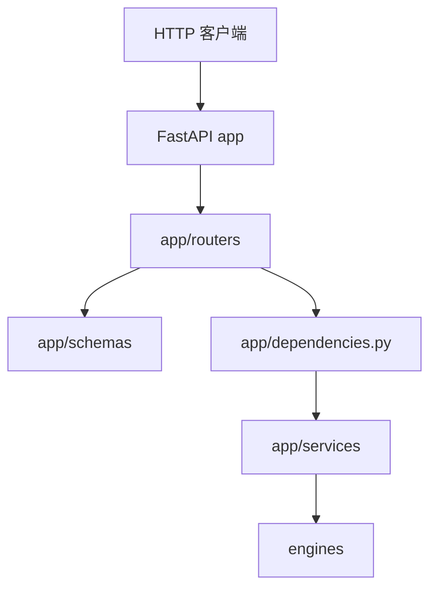
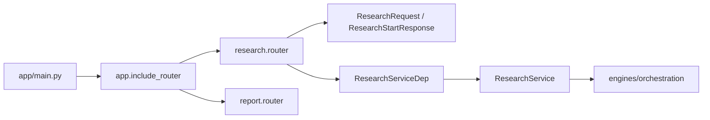
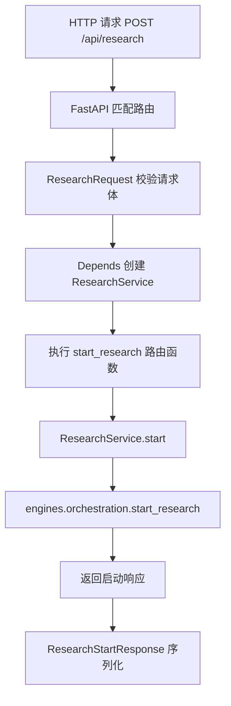
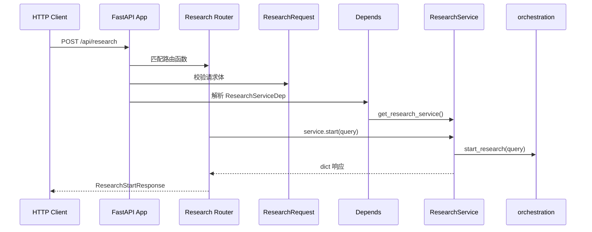
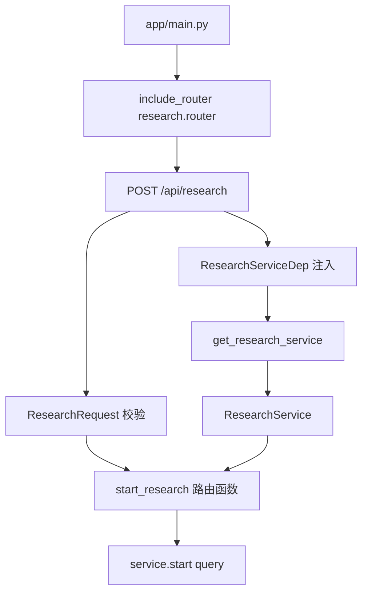

# Day02 上午：FastAPI 入口、路由注册、依赖注入

## 1. 本节讲解范围

### 1.1 本节涉及的模块

#### 1.1.1 相关目录

本节进入 `app` 应用层，重点讲 FastAPI 如何把一个 HTTP 请求转成后端业务调用。

相关目录如下：

```text
app/
app/routers/
app/routers/rest/
app/schemas/
app/services/
```

`app` 层是整个后端的 HTTP 门面。

它不负责复杂 Agent 算法，但它决定了外部请求如何进入系统。

#### 1.1.2 相关文件

本节重点讲解：

```text
app/main.py
app/dependencies.py
app/routers/rest/__init__.py
app/routers/rest/research.py
app/routers/rest/report.py
app/schemas/research.py
app/schemas/report.py
```

这几个文件正好覆盖 FastAPI 应用层的核心概念：

```text
应用入口
路由注册
请求模型
响应模型
依赖注入
Service 调用
异常转换
```

#### 1.1.3 本节范围边界

本节不深入 Agent 内部。

本节也不讲前端。

本节只关注：

```text
HTTP 请求进入 FastAPI 后，如何经过 router、schema、dependency、service，最后到达 engines。
```

换句话说，本节讲的是：

```text
外部世界和后端业务引擎之间的适配层。
```

### 1.2 本节要解决的问题

#### 1.2.1 本节需要掌握的核心问题

本节需要掌握五个问题：

```text
1. FastAPI 应用对象在哪里创建
2. 路由是如何注册到 app 上的
3. 请求参数是如何被 Pydantic schema 校验的
4. service 对象是如何通过 Depends 注入到 router 的
5. router 为什么不应该直接调用 engines
```

#### 1.2.2 本节的理解难点

FastAPI 应用层看起来代码不多，但它有几个隐含的执行过程。

例如：

```python
async def start_research(payload: ResearchRequest, service: ResearchServiceDep):
    return service.start(payload.query)
```

这一行表面上只是调用 `service.start()`。

但真实发生的是：

```text
FastAPI 读取 HTTP body
-> 按 ResearchRequest 校验
-> 执行 Depends 获取 ResearchService
-> 调用路由函数
-> 按 response_model 输出响应
```

这就是本节要讲清楚的“逻辑过渡”。

#### 1.2.3 本节和上一节的关系

Day01 上午讲了项目整体架构。

Day01 下午讲了项目如何启动。

Day02 上午开始进入：

```text
请求进来之后，FastAPI 应用层怎么处理。
```

也就是从“服务能启动”进入“请求能被处理”。

## 2. 本节在项目中的位置

### 2.1 全局架构定位

#### 2.1.1 当前模块属于哪一层

当前模块属于 HTTP 应用层。

它位于：

```text
外部 HTTP 请求
和
engines 核心业务引擎
之间
```

它不是业务引擎，但它是所有请求进入业务引擎的门。

#### 2.1.2 上游模块是谁

上游是 HTTP 客户端：

```text
浏览器
前端页面
Postman
curl
测试脚本
```

典型请求：

```text
POST /api/research
GET  /api/research/latest
POST /api/report/generate
GET  /api/report/status
```

#### 2.1.3 下游模块是谁

下游主要是：

```text
app/services/research/service.py
app/services/report/service.py
app/services/host/*
app/services/system/*
engines/orchestration/*
```

Router 不直接调用复杂 engine，而是先进入 service。

### 2.2 当前模块的职责边界

#### 2.2.1 它负责什么

FastAPI 应用层负责：

```text
创建 app
注册 router
注册 CORS
绑定 lifespan
声明请求模型
声明响应模型
执行依赖注入
把 HTTP 异常转换成标准响应
```

#### 2.2.2 它不负责什么

FastAPI 应用层不负责：

```text
私域数据库检索
Web 搜索
LangGraph 节点执行
LLM 生成
Host 裁决
最终报告聚合
```

这些都属于 `engines` 层或 service 委托的业务层。

#### 2.2.3 为什么这样分层

如果 router 直接写业务逻辑，会变成：

```text
HTTP 参数校验
业务编排
LLM 调用
文件读写
任务状态
异常处理
```

全都挤在一个函数里。

当前设计将职责拆开：

```text
router      负责 HTTP
schema      负责数据校验
dependency  负责对象注入
service     负责应用语义
engines     负责核心业务
```

这样每一层都更容易讲清楚，也更容易测试。

### 2.3 位置流程图

#### 2.3.1 全局位置图



#### 2.3.2 当前模块放大图



#### 2.3.3 图中每个节点的含义

`app/main.py` 是 FastAPI 应用定义入口。

`include_router` 把多个 router 注册到同一个 app 上。

`ResearchRequest` 是请求模型。

`ResearchServiceDep` 是依赖注入声明。

`ResearchService` 是应用服务。

`engines/orchestration` 是真正启动研究任务的下游。

## 3. 总体逻辑流程图

### 3.1 主流程说明

#### 3.1.1 输入从哪里来

输入来自 HTTP 请求。

以研究接口为例：

```http
POST /api/research
Content-Type: application/json

{
  "query": "高考"
}
```

请求进入 FastAPI 后，不是直接调用函数里的业务逻辑。

FastAPI 会先做模型解析和校验。

#### 3.1.2 中间经过哪些步骤

一次研究请求经过：

```text
1. FastAPI 匹配 URL 和 HTTP 方法
2. 找到 app/routers/rest/research.py 中的路由函数
3. 用 ResearchRequest 校验请求体
4. 用 ResearchServiceDep 注入 ResearchService
5. 执行 service.start(payload.query)
6. 返回 ResearchStartResponse
```

#### 3.1.3 输出到哪里去

输出是 HTTP JSON 响应。

研究启动接口返回：

```json
{
  "success": true,
  "message": "已启动所有研究角色",
  "query": "高考"
}
```

注意，它返回的是“启动成功”，不是“研究完成”。

### 3.2 主流程图

#### 3.2.1 Mermaid 流程图



#### 3.2.2 流程图逐节点解释

`FastAPI 匹配路由` 依靠 `APIRouter` 上声明的 `prefix` 和装饰器。

`ResearchRequest 校验请求体` 依靠 Pydantic 模型。

`Depends 创建 ResearchService` 依靠 `app/dependencies.py`。

`ResearchService.start` 是应用服务层。

`engines.orchestration.start_research` 才是研究任务编排入口。

#### 3.2.3 关键转折点

第一个转折点：

```text
HTTP JSON -> Pydantic 对象
```

第二个转折点：

```text
函数参数 service -> FastAPI Depends 注入对象
```

第三个转折点：

```text
HTTP 层 -> app service 层 -> engines 层
```

### 3.3 主流程中的核心判断

#### 3.3.1 正常路径

正常路径：

```text
请求体合法
依赖注入成功
service.start 成功调用
orchestration 创建后台任务
返回启动成功
```

#### 3.3.2 分支路径

常见分支：

```text
请求体 query 为空
报告输入未准备好
任务 ID 不存在
任务尚未完成
报告文件不存在
```

这些分支主要体现在 schema 校验和 router 异常处理里。

#### 3.3.3 失败路径

失败路径包括：

```text
Pydantic 校验失败 -> 422
主动抛 HTTPException -> 指定状态码
未知异常 -> 500
```

FastAPI 应用层的价值之一，就是把 Python 内部异常转换成 HTTP 语义。

## 4. 核心数据流图

### 4.1 输入数据结构

#### 4.1.1 请求参数或事件数据

研究请求输入：

```python
class ResearchRequest(BaseModel):
    query: str = Field(..., description="研究主题")
```

最终报告请求输入：

```python
class GenerateReportRequest(BaseModel):
    query: str = Field("智能舆情分析报告", description="报告主题")
    custom_template: str = Field("", description="自定义模板(可选)")
```

#### 4.1.2 关键字段含义

`query` 是业务主题。

它会一路传递到 Agent 和 ReportEngine。

`custom_template` 是最终报告生成阶段的可选模板。

它只用于 ReportEngine，不用于 Insight/Media 研究启动。

#### 4.1.3 字段为什么这样设计

研究任务必须有明确主题。

所以 `ResearchRequest.query` 是必填。

最终报告可以有默认主题。

所以 `GenerateReportRequest.query` 有默认值。

这两个模型看起来都有 `query`，但业务语义不同：

```text
ResearchRequest.query       启动研究
GenerateReportRequest.query 生成最终综合报告
```

### 4.2 中间状态变化

#### 4.2.1 初始状态

HTTP 请求刚进入时是原始 JSON。

例如：

```json
{
  "query": "高考"
}
```

#### 4.2.2 状态更新点

FastAPI 会将 JSON 转成：

```python
ResearchRequest(query="高考")
```

然后通过依赖注入提供：

```python
ResearchService()
```

最后调用：

```python
service.start("高考")
```

#### 4.2.3 状态如何传递

传递路径：

```text
HTTP JSON
-> Pydantic schema
-> Router 函数参数
-> Service 方法参数
-> Orchestration 参数
-> Agent 参数
```

### 4.3 输出数据结构

#### 4.3.1 返回值

研究启动响应：

```python
class ResearchStartResponse(BaseModel):
    success: bool = True
    message: str = ""
    query: str = ""
```

#### 4.3.2 文件产物

FastAPI router 本身不直接生成文件。

文件产物由下游 service 或 engines 产生。

#### 4.3.3 事件产物

FastAPI router 本身不发布事件。

事件由下游编排层或 Agent 产生。

## 5. 核心调用链图

### 5.1 调用入口

#### 5.1.1 入口函数

FastAPI 应用入口：

```text
app/main.py
```

研究接口入口：

```text
app/routers/rest/research.py
```

报告接口入口：

```text
app/routers/rest/report.py
```

#### 5.1.2 入口类

本节涉及的核心类：

```text
ResearchRequest
ResearchStartResponse
GenerateReportRequest
ReportStatusResponse
ResearchService
ReportService
```

#### 5.1.3 谁调用入口

入口由 FastAPI 框架调用。

开发者没有手动调用 router 函数。

框架根据 URL 和 method 自动匹配。

### 5.2 调用链展开

#### 5.2.1 第一层调用

第一层：

```text
app/main.py
```

注册：

```python
app.include_router(research.router)
app.include_router(report.router)
```

#### 5.2.2 第二层调用

第二层：

```text
app/routers/rest/research.py
```

调用：

```python
service.start(payload.query)
```

#### 5.2.3 第三层调用

第三层：

```text
app/dependencies.py
```

提供：

```python
ResearchServiceDep = Annotated[ResearchService, Depends(get_research_service)]
```

### 5.3 调用链图

#### 5.3.1 Mermaid 时序图



#### 5.3.2 每一步调用解释

客户端只知道 URL。

FastAPI 根据 URL 找到 router。

Router 通过类型注解触发 schema 校验和 dependency 注入。

Service 接收业务参数。

Engines 执行真实业务编排。

#### 5.3.3 调用链中的关键依赖

关键依赖包括：

```text
APIRouter
Pydantic BaseModel
Depends
Annotated
Service getter
response_model
HTTPException
```

## 6. 手写真实项目核心逻辑

### 6.1 为什么手写真实项目文件

#### 6.1.1 手写不是独立 Demo

本节手写真实项目文件。

不新建 demo。

因为本节重点就是 FastAPI 应用层真实结构。

#### 6.1.2 本节手写哪些真实文件

本节手写：

```text
app/main.py
app/dependencies.py
app/routers/rest/research.py
app/schemas/research.py
```

这四个文件对应：

```text
应用入口
依赖注入
研究路由
请求响应模型
```

#### 6.1.3 和项目主链路的对应关系

```text
app/main.py
-> include_router(research.router)
-> app/routers/rest/research.py
-> ResearchRequest
-> ResearchServiceDep
-> ResearchService
```

### 6.2 手写代码一：`app/main.py`

#### 6.2.1 要实现什么

手写 FastAPI 应用入口。

它负责：

```text
创建 app
注册 CORS
注册 router
绑定 lifespan
```

#### 6.2.2 代码实现

完整包路径与文件名：

```text
app/main.py
```

完整代码如下：

```python
"""FastAPI 应用入口与路由注册。"""

from contextlib import asynccontextmanager

from fastapi import FastAPI
from fastapi.middleware.cors import CORSMiddleware

from app.routers import sse
from app.routers.rest import config, dimensions, host, report, research
from app.services.system import get_lifecycle_service


@asynccontextmanager
async def lifespan(app: FastAPI):
    lifecycle_service = get_lifecycle_service()
    lifecycle_service.start()
    try:
        yield
    finally:
        lifecycle_service.shutdown()


app = FastAPI(title="尚舆分析平台 API", version="3.0.0", lifespan=lifespan)

app.add_middleware(
    CORSMiddleware,
    allow_origins=["*"],
    allow_methods=["*"],
    allow_headers=["*"],
)

app.include_router(config.router)
app.include_router(dimensions.router)
app.include_router(host.router)
app.include_router(research.router)
app.include_router(sse.router)
app.include_router(report.router)


@app.get("/")
async def root():
    return {"service": "尚舆分析平台 API", "version": "3.0.0", "status": "running"}
```

#### 6.2.3 逐块解释

`lifespan` 是应用启动和关闭钩子。

`FastAPI(...)` 创建应用。

`add_middleware` 注册跨域中间件。

`include_router` 注册不同业务接口。

`root()` 提供健康检查式根接口。

#### 6.2.4 为什么这样手写

`app/main.py` 是所有 router 的聚合点。

它只负责应用组装，不负责具体业务。

### 6.3 手写代码二：`app/dependencies.py`

#### 6.3.1 要实现什么

手写依赖注入集中定义。

它负责把 service 对象变成 FastAPI 可注入的类型别名。

#### 6.3.2 代码实现

完整包路径与文件名：

```text
app/dependencies.py
```

完整代码如下：

```python
"""FastAPI 依赖注入定义。"""

from typing import Annotated
from fastapi import Depends

from app.services.host import (
    HostCoordinatorService,
    HostDiscussionMessageStore,
    HostDiscussionService,
    get_host_coordinator_service,
    get_host_discussion_message_store,
    get_host_discussion_service,
)
from app.services.report import ReportInputService, ReportService, get_report_input_service, get_report_service
from app.services.research import ResearchService
from app.services.system import ConfigService, DimensionService, get_dimension_service


def get_config_service() -> ConfigService:
    """配置读写服务"""
    return ConfigService()

ConfigServiceDep = Annotated[ConfigService, Depends(get_config_service)]


DimensionServiceDep = Annotated[DimensionService, Depends(get_dimension_service)]


def get_research_service() -> ResearchService:
    """研究编排服务"""
    return ResearchService()

ResearchServiceDep = Annotated[ResearchService, Depends(get_research_service)]


HostDiscussionServiceDep = Annotated[HostDiscussionService, Depends(get_host_discussion_service)]


HostDiscussionMessageStoreDep = Annotated[
    HostDiscussionMessageStore,
    Depends(get_host_discussion_message_store),
]


HostCoordinatorServiceDep = Annotated[HostCoordinatorService, Depends(get_host_coordinator_service)]


ReportInputServiceDep = Annotated[ReportInputService, Depends(get_report_input_service)]


ReportServiceDep = Annotated[ReportService, Depends(get_report_service)]
```

#### 6.3.3 逐块解释

`Annotated[T, Depends(fn)]` 表示：

```text
路由函数需要 T 类型参数时，由 fn 提供对象
```

`get_research_service()` 每次返回一个 `ResearchService()`。

`get_report_service()` 返回进程内单例。

不同服务是否单例，取决于服务内部是否持有状态。

#### 6.3.4 为什么这样手写

依赖注入集中放在一个文件里，router 不需要知道对象如何创建。

这让 router 更干净。

### 6.4 手写代码三：`app/routers/rest/research.py`

#### 6.4.1 要实现什么

手写研究任务路由。

#### 6.4.2 代码实现

完整包路径与文件名：

```text
app/routers/rest/research.py
```

完整代码如下：

```python
"""研究任务路由。"""

from fastapi import APIRouter

from app.dependencies import ResearchServiceDep
from app.schemas.research import LatestResearchResultsResponse, ResearchRequest, ResearchStartResponse

router = APIRouter(prefix="/api/research", tags=["研究任务"])


@router.post("", response_model=ResearchStartResponse)
async def start_research(payload: ResearchRequest, service: ResearchServiceDep):
    return service.start(payload.query)


@router.get("/latest", response_model=LatestResearchResultsResponse)
async def latest_research_results(service: ResearchServiceDep):
    return service.latest_results()
```

#### 6.4.3 逐块解释

`payload: ResearchRequest` 触发请求体校验。

`service: ResearchServiceDep` 触发依赖注入。

`response_model=ResearchStartResponse` 约束输出结构。

#### 6.4.4 为什么这样手写

这个文件体现了 FastAPI 应用层的标准写法：

```text
router 声明 URL
schema 声明数据结构
dependency 注入 service
service 执行业务入口
```

## 7. 手写逻辑执行流程图

### 7.1 手写代码执行过程

#### 7.1.1 第一步执行什么

FastAPI 启动后，`app/main.py` 注册研究 router。

#### 7.1.2 第二步执行什么

收到 `POST /api/research` 后，FastAPI 找到：

```text
app/routers/rest/research.py
```

#### 7.1.3 最终得到什么

路由函数拿到：

```text
ResearchRequest
ResearchService
```

然后调用：

```python
service.start(payload.query)
```

### 7.2 手写流程图

#### 7.2.1 Mermaid 流程图



#### 7.2.2 流程图对应代码位置

`include_router` 对应：

```python
app.include_router(research.router)
```

`ResearchRequest 校验` 对应：

```python
payload: ResearchRequest
```

`ResearchServiceDep 注入` 对应：

```python
service: ResearchServiceDep
```

#### 7.2.3 需要抓住的核心点

核心点：

```text
FastAPI 根据类型注解决定校验和注入
Router 不创建 service
Router 不直接调用 engines
Service 是 HTTP 层和业务层之间的缓冲
```

## 8. 项目源码解读

### 8.1 文件一：`app/main.py`

#### 8.1.1 文件职责

FastAPI 应用入口。

#### 8.1.2 为什么需要这个文件

负责统一注册中间件、router 和生命周期。

#### 8.1.3 上游调用者

```text
main.py
uvicorn
```

#### 8.1.4 下游依赖

```text
app.routers
ApplicationLifecycleService
```

#### 8.1.5 完整源码

完整包路径与文件名：

```text
app/main.py
```

完整代码如下：

```python
"""FastAPI 应用入口与路由注册。"""

from contextlib import asynccontextmanager

from fastapi import FastAPI
from fastapi.middleware.cors import CORSMiddleware

from app.routers import sse
from app.routers.rest import config, dimensions, host, report, research
from app.services.system import get_lifecycle_service


@asynccontextmanager
async def lifespan(app: FastAPI):
    lifecycle_service = get_lifecycle_service()
    lifecycle_service.start()
    try:
        yield
    finally:
        lifecycle_service.shutdown()


app = FastAPI(title="尚舆分析平台 API", version="3.0.0", lifespan=lifespan)

app.add_middleware(
    CORSMiddleware,
    allow_origins=["*"],
    allow_methods=["*"],
    allow_headers=["*"],
)

app.include_router(config.router)
app.include_router(dimensions.router)
app.include_router(host.router)
app.include_router(research.router)
app.include_router(sse.router)
app.include_router(report.router)


@app.get("/")
async def root():
    return {"service": "尚舆分析平台 API", "version": "3.0.0", "status": "running"}
```

#### 8.1.6 代码逐块解释

`asynccontextmanager` 把 `lifespan` 写成启动/关闭上下文。

`yield` 之前是启动逻辑。

`yield` 之后是关闭逻辑。

`app.include_router(...)` 是把路由模块挂到应用上。

#### 8.1.7 关键设计意图

`app/main.py` 是组装点，不是业务点。

#### 8.1.8 如果不这样设计会怎样

如果这里写业务，应用入口会越来越重。

### 8.2 文件二：`app/dependencies.py`

#### 8.2.1 文件职责

集中定义 FastAPI 依赖注入。

#### 8.2.2 为什么需要这个文件

Router 不应该关心服务对象如何创建。

#### 8.2.3 上游调用者

各个 router 文件。

#### 8.2.4 下游依赖

各个 app service。

#### 8.2.5 完整源码

完整包路径与文件名：

```text
app/dependencies.py
```

完整代码如下：

```python
"""FastAPI 依赖注入定义。"""

from typing import Annotated
from fastapi import Depends

from app.services.host import (
    HostCoordinatorService,
    HostDiscussionMessageStore,
    HostDiscussionService,
    get_host_coordinator_service,
    get_host_discussion_message_store,
    get_host_discussion_service,
)
from app.services.report import ReportInputService, ReportService, get_report_input_service, get_report_service
from app.services.research import ResearchService
from app.services.system import ConfigService, DimensionService, get_dimension_service


def get_config_service() -> ConfigService:
    """配置读写服务"""
    return ConfigService()

ConfigServiceDep = Annotated[ConfigService, Depends(get_config_service)]


DimensionServiceDep = Annotated[DimensionService, Depends(get_dimension_service)]


def get_research_service() -> ResearchService:
    """研究编排服务"""
    return ResearchService()

ResearchServiceDep = Annotated[ResearchService, Depends(get_research_service)]


HostDiscussionServiceDep = Annotated[HostDiscussionService, Depends(get_host_discussion_service)]


HostDiscussionMessageStoreDep = Annotated[
    HostDiscussionMessageStore,
    Depends(get_host_discussion_message_store),
]


HostCoordinatorServiceDep = Annotated[HostCoordinatorService, Depends(get_host_coordinator_service)]


ReportInputServiceDep = Annotated[ReportInputService, Depends(get_report_input_service)]


ReportServiceDep = Annotated[ReportService, Depends(get_report_service)]
```

#### 8.2.6 代码逐块解释

`Depends` 是 FastAPI 的依赖系统。

`Annotated` 让依赖类型既能被类型检查器识别，也能被 FastAPI 使用。

`ResearchServiceDep` 可以直接写在 router 函数参数上。

#### 8.2.7 关键设计意图

依赖统一定义后，router 文件更简洁。

#### 8.2.8 如果不这样设计会怎样

每个 router 都要自己创建 service。

对象生命周期会变得混乱。

### 8.3 文件三：`app/routers/rest/research.py`

#### 8.3.1 文件职责

研究任务路由。

#### 8.3.2 为什么需要这个文件

把研究相关 HTTP 接口集中管理。

#### 8.3.3 上游调用者

HTTP 客户端。

#### 8.3.4 下游依赖

`ResearchServiceDep` 和 `app.schemas.research`。

#### 8.3.5 完整源码

完整包路径与文件名：

```text
app/routers/rest/research.py
```

完整代码如下：

```python
"""研究任务路由。"""

from fastapi import APIRouter

from app.dependencies import ResearchServiceDep
from app.schemas.research import LatestResearchResultsResponse, ResearchRequest, ResearchStartResponse

router = APIRouter(prefix="/api/research", tags=["研究任务"])


@router.post("", response_model=ResearchStartResponse)
async def start_research(payload: ResearchRequest, service: ResearchServiceDep):
    return service.start(payload.query)


@router.get("/latest", response_model=LatestResearchResultsResponse)
async def latest_research_results(service: ResearchServiceDep):
    return service.latest_results()
```

#### 8.3.6 代码逐块解释

`APIRouter(prefix="/api/research")` 统一路径前缀。

`ResearchRequest` 校验请求体。

`ResearchServiceDep` 注入 service。

`response_model` 约束响应。

#### 8.3.7 关键设计意图

Router 保持薄。

#### 8.3.8 如果不这样设计会怎样

请求入口会和业务逻辑耦合。

### 8.4 文件四：`app/schemas/research.py`

#### 8.4.1 文件职责

定义研究任务接口的请求和响应模型。

#### 8.4.2 为什么需要这个文件

HTTP 输入必须校验。

HTTP 输出也应该有固定结构。

#### 8.4.3 上游调用者

`app/routers/rest/research.py`

#### 8.4.4 下游依赖

FastAPI response_model 和 Pydantic 校验。

#### 8.4.5 完整源码

完整包路径与文件名：

```text
app/schemas/research.py
```

完整代码如下：

```python
"""API 数据模型：app/schemas/research.py。"""

from pydantic import BaseModel, Field, field_validator


class ResearchRequest(BaseModel):
    query: str = Field(..., description="研究主题")

    @field_validator("query")
    @classmethod
    def not_blank(cls, value: str) -> str:
        value = value.strip()
        if not value:
            raise ValueError("研究主题不能为空")
        return value


class ResearchStartResponse(BaseModel):
    success: bool = True
    message: str = ""
    query: str = ""


class ResearchRoleResult(BaseModel):
    role: str
    status: str
    final_report: str = ""
    report_file: str = ""
    state_file: str = ""
    updated_at: float = 0.0


class LatestResearchResultsResponse(BaseModel):
    success: bool = True
    results: dict[str, ResearchRoleResult] = Field(default_factory=dict)
```

#### 8.4.6 代码逐块解释

`ResearchRequest` 是请求体。

`not_blank` 防止空字符串。

`ResearchStartResponse` 是启动响应。

`ResearchRoleResult` 是每个角色的最新报告结果。

`LatestResearchResultsResponse` 是 `/latest` 的响应。

#### 8.4.7 关键设计意图

Schema 让接口输入输出可描述、可校验、可文档化。

#### 8.4.8 如果不这样设计会怎样

接口可能接收非法数据。

返回结构也容易不稳定。

### 8.5 文件五：`app/routers/rest/report.py`

#### 8.5.1 文件职责

报告引擎路由。

#### 8.5.2 为什么需要这个文件

最终报告生成、状态查询、结果获取、下载导出都集中在这里。

#### 8.5.3 上游调用者

HTTP 客户端。

#### 8.5.4 下游依赖

`ReportServiceDep`、`ReportTask`、`FileResponse`、`Response`。

#### 8.5.5 完整源码

完整包路径与文件名：

```text
app/routers/rest/report.py
```

完整代码如下：

```python
"""报告引擎路由。"""

import os

from fastapi import APIRouter, HTTPException
from fastapi.responses import FileResponse, Response
from loguru import logger

from app.dependencies import ReportServiceDep
from app.schemas.report import (
    GenerateReportRequest,
    GenerateReportResponse,
    ReportStatusResponse,
)
from app.services.report import ReportTask

router = APIRouter(prefix="/api/report", tags=["报告引擎"])


def _task_or_404(service: ReportServiceDep, task_id: str) -> ReportTask:
    task = service.get_task(task_id)
    if not task:
        raise HTTPException(status_code=404, detail="任务不存在")
    return task


@router.get("/status", response_model=ReportStatusResponse)
def get_status(service: ReportServiceDep):
    try:
        return ReportStatusResponse(**service.get_status_dict())
    except Exception as exc:
        logger.exception(f"获取报告引擎状态失败: {exc}")
        raise HTTPException(status_code=500, detail=str(exc))


@router.post("/generate", response_model=GenerateReportResponse)
async def generate_report(payload: GenerateReportRequest, service: ReportServiceDep):
    if not service.check_inputs_ready()["ready"]:
        raise HTTPException(status_code=400, detail="输入文件未准备就绪")
    try:
        task = service.create_task(payload.query, payload.custom_template)
        service.start_task(task, payload.query, payload.custom_template)
        return GenerateReportResponse(
            task_id=task.task_id, message="报告生成已启动", task=task.to_dict()
        )
    except RuntimeError as exc:
        raise HTTPException(status_code=400, detail=str(exc))
    except Exception as exc:
        logger.exception(f"启动报告生成失败: {exc}")
        raise HTTPException(status_code=500, detail=str(exc))


@router.get("/result/{task_id}")
def get_result(task_id: str, service: ReportServiceDep):
    task = _task_or_404(service, task_id)
    if task.status != "completed":
        raise HTTPException(status_code=400, detail="报告尚未完成")
    return Response(content=task.html_content, media_type="text/html")


@router.get("/download/{task_id}")
def download_report(task_id: str, service: ReportServiceDep):
    task = _task_or_404(service, task_id)
    if task.status != "completed" or not task.report_file_path:
        raise HTTPException(status_code=400, detail="报告尚未完成或尚未保存")
    if not os.path.exists(task.report_file_path):
        raise HTTPException(status_code=404, detail="报告文件不存在或已被删除")
    download_name = task.report_file_name or os.path.basename(task.report_file_path)
    return FileResponse(task.report_file_path, media_type="text/html", filename=download_name)


@router.get("/export/md/{task_id}")
def export_markdown(task_id: str, service: ReportServiceDep):
    try:
        info = service.export_markdown_for_task(task_id)
        return FileResponse(info["file_path"], media_type="text/markdown", filename=info["file_name"])
    except (LookupError, FileNotFoundError) as exc:
        raise HTTPException(status_code=404, detail=str(exc))
    except RuntimeError as exc:
        raise HTTPException(status_code=400, detail=str(exc))
    except Exception as exc:
        logger.exception(f"导出Markdown失败: {exc}")
        raise HTTPException(status_code=500, detail=str(exc))
```

#### 8.5.6 代码逐块解释

`_task_or_404` 是路由内部辅助函数。

它把“任务不存在”转换成 HTTP 404。

`get_status` 返回报告引擎状态。

`generate_report` 启动最终报告生成任务。

`get_result` 返回 HTML 内容。

`download_report` 下载 HTML 文件。

`export_markdown` 导出 Markdown 文件。

#### 8.5.7 关键设计意图

报告接口的状态分支比研究接口复杂。

所以这里使用了较多 `HTTPException`。

#### 8.5.8 如果不这样设计会怎样

如果不把业务错误转成 HTTP 状态码，前端很难区分：

```text
任务不存在
任务未完成
输入未准备好
服务内部错误
```

## 9. 关键对象与状态拆解

### 9.1 核心对象一：`APIRouter`

#### 9.1.1 对象定义

`APIRouter` 是 FastAPI 的路由分组对象。

#### 9.1.2 字段含义

核心配置：

```text
prefix
tags
response_model
```

#### 9.1.3 生命周期

Router 在模块导入时创建。

随后被 `app.include_router()` 注册。

### 9.2 核心对象二：`Depends`

#### 9.2.1 对象定义

`Depends` 表示一个参数不是由请求体提供，而是由依赖函数提供。

#### 9.2.2 字段含义

例如：

```python
ResearchServiceDep = Annotated[ResearchService, Depends(get_research_service)]
```

含义是：

```text
需要 ResearchService 时，调用 get_research_service()
```

#### 9.2.3 生命周期

依赖在请求处理时解析。

### 9.3 对象之间的关系

#### 9.3.1 组合关系

```text
FastAPI app
└─ APIRouter
   └─ route function
      ├─ schema 参数
      └─ dependency 参数
```

#### 9.3.2 调用关系

```text
HTTP request
-> route function
-> dependency provider
-> service method
```

#### 9.3.3 数据传递关系

```text
JSON body
-> Pydantic model
-> route function
-> service
-> engines
```

## 10. 边界情况与异常分支

### 10.1 空数据情况

#### 10.1.1 什么情况下为空

例如：

```text
query 为空字符串
task_id 不存在
报告输入未准备
```

#### 10.1.2 代码如何处理

`query` 空字符串由 schema validator 处理。

`task_id` 不存在由 `_task_or_404` 处理。

报告输入未准备由 `HTTPException(status_code=400)` 处理。

#### 10.1.3 为什么这样处理

这些都属于 HTTP 接口边界问题，应该在 app 层转换成清晰状态码。

### 10.2 重复调用情况

#### 10.2.1 什么情况下重复

用户可能重复点击生成报告。

#### 10.2.2 代码如何避免问题

`ReportService.create_task()` 内部会检查当前是否已有运行中的任务。

Router 捕获 `RuntimeError` 并返回 400。

#### 10.2.3 如果不处理会怎样

多个报告任务可能互相覆盖状态。

### 10.3 失败兜底情况

#### 10.3.1 哪些地方可能失败

可能失败：

```text
依赖注入失败
请求校验失败
service 抛异常
文件不存在
任务未完成
```

#### 10.3.2 失败后如何记录

部分路由使用 `logger.exception` 记录异常。

#### 10.3.3 失败是否影响主流程

单个请求失败不会影响整个服务。

但如果依赖创建或 service 单例状态异常，可能影响后续请求。

## 11. 本节代码在完整链路中的作用

### 11.1 本节之前发生了什么

#### 11.1.1 上一段链路输出

Day01 已经完成：

```text
后端服务启动
FastAPI app 创建
生命周期初始化
```

#### 11.1.2 本节接收的数据

本节接收 HTTP 请求。

#### 11.1.3 本节开始的条件

服务已经启动，router 已经注册。

### 11.2 本节推进了什么

#### 11.2.1 推进了哪一步业务

本节把外部 HTTP 请求推进到应用服务层。

#### 11.2.2 改变了哪些状态

研究接口会启动后台任务。

报告接口会创建报告任务状态。

#### 11.2.3 产出了哪些结果

产出 HTTP 响应：

```text
JSON 响应
HTML 响应
文件下载响应
错误响应
```

### 11.3 本节之后交给谁

#### 11.3.1 下游模块

下午继续讲：

```text
app/services 服务层
任务状态
应用生命周期
```

#### 11.3.2 下游输入

下游输入是经过 schema 校验后的业务参数。

#### 11.3.3 下一节课如何衔接

本节已经讲清楚 HTTP 如何进入 service。

下一节要讲 service 内部如何保持薄包装，以及如何把任务状态和 engines 编排隔离开。
