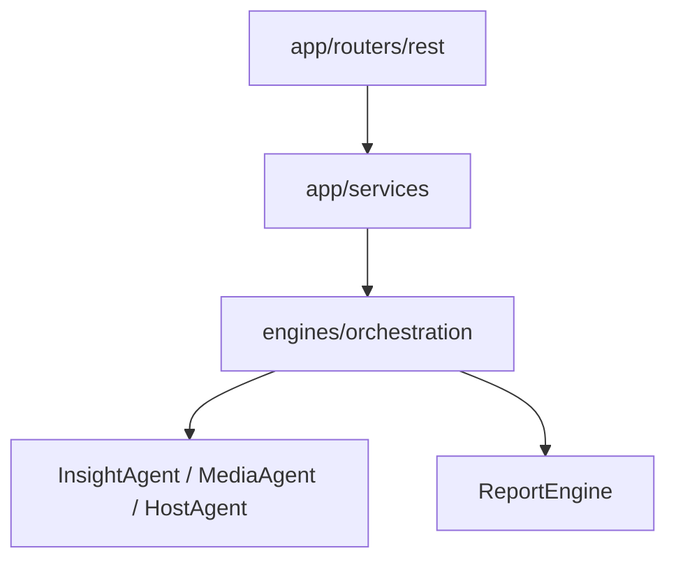
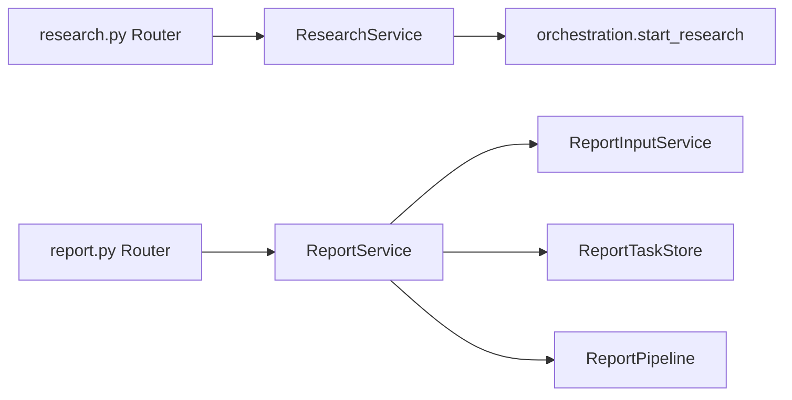
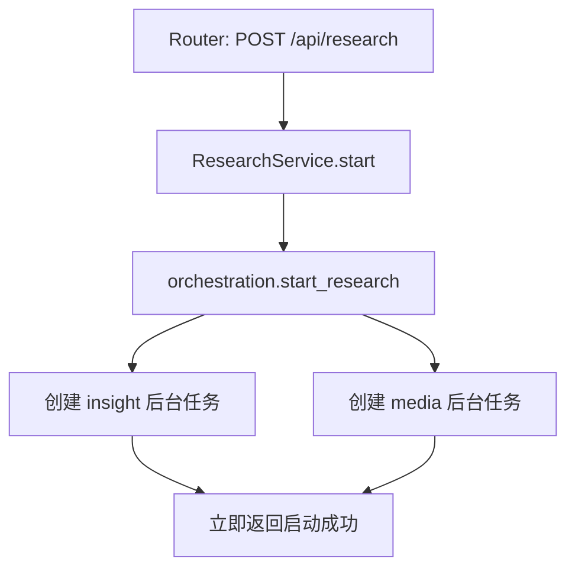
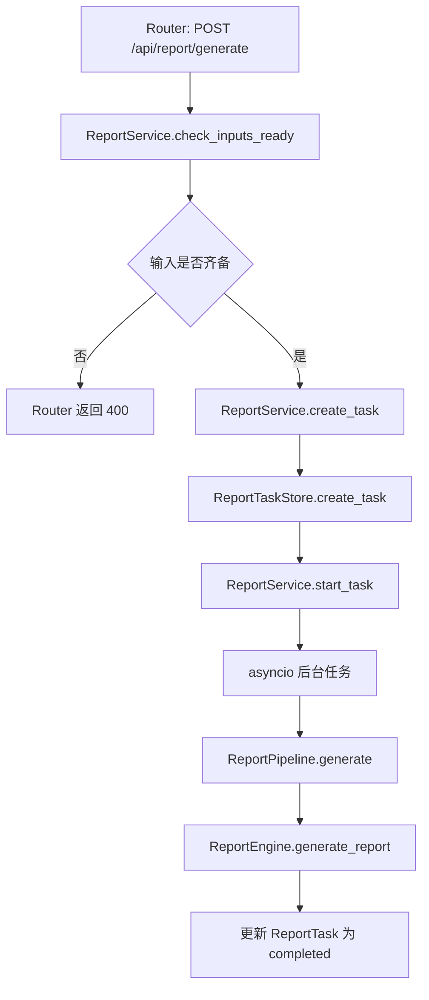
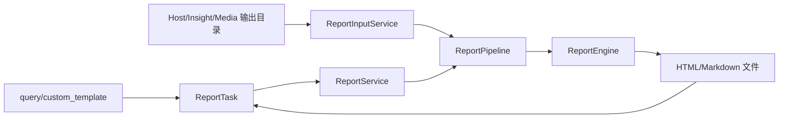
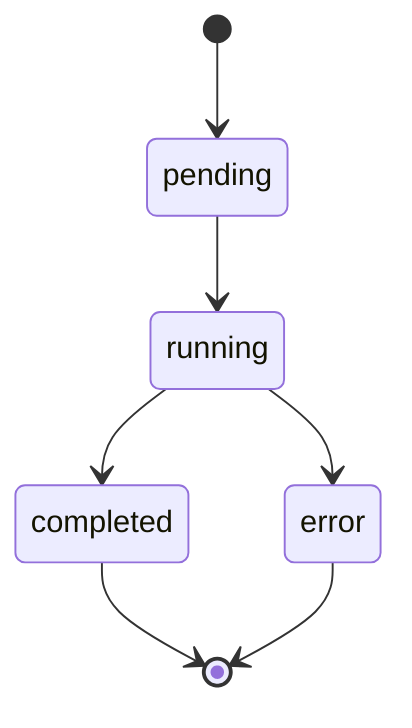
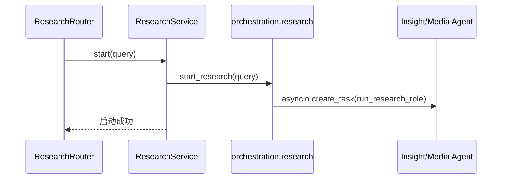
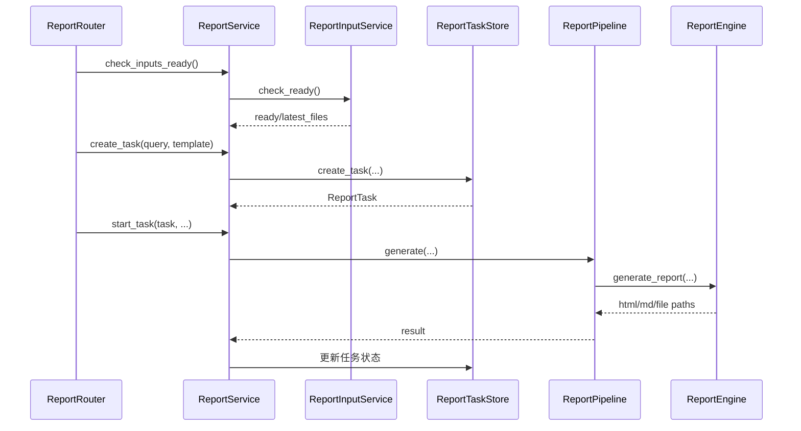
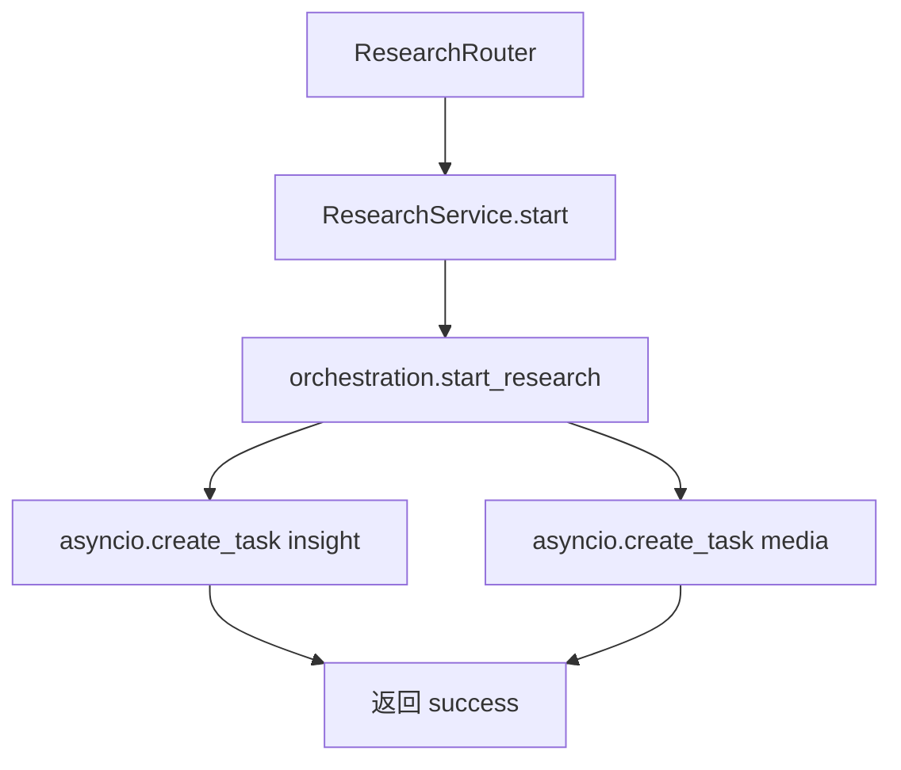
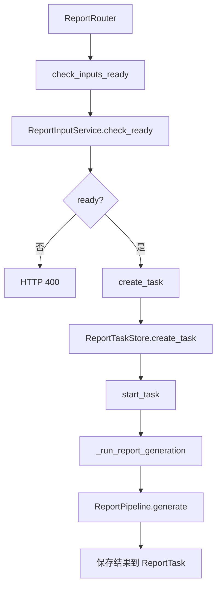

# Day02 下午：Service 服务层、任务状态、业务编排入口

## 1. 本节讲解范围

### 1.1 本节涉及的模块

#### 1.1.1 相关目录

上午已经讲完了 FastAPI 的入口、Router、Schema 和 Depends。

下午继续往下走：

```text
app/services/
engines/orchestration/
```

也就是：

```text
Router 接到请求以后，Service 如何承接业务调用。
```

#### 1.1.2 相关文件

本节重点讲解：

```text
app/services/research/service.py
app/services/report/service.py
app/services/report/input_service.py
app/services/report/task_store.py
app/services/report/__init__.py
engines/orchestration/research.py
engines/orchestration/report_pipeline.py
```

这些文件把上午的 HTTP 路由继续往下连接到业务编排层。

#### 1.1.3 本节范围边界

本节不深入讲 InsightAgent、MediaAgent、HostAgent 的节点内部逻辑。

本节重点是：

```text
app/services 如何做应用级承接
engines/orchestration 如何作为业务编排入口
报告任务状态如何保存
最终报告生成前如何检查输入是否齐备
```

### 1.2 本节要解决的问题

#### 1.2.1 本节需要掌握的核心问题

本节要解决五个问题：

```text
1. 为什么 Router 不直接调用 Agent
2. ResearchService 为什么很薄
3. ReportService 为什么比 ResearchService 复杂
4. ReportTaskStore 如何管理当前报告任务
5. ReportPipeline 如何把输入文件交给 ReportEngine
```

#### 1.2.2 本节的理解难点

Service 层容易被误解成“多余的一层”。

但在这个项目里，Service 层有非常明确的作用：

```text
Router 负责 HTTP
Service 负责应用语义
Orchestration 负责业务编排
Engine/Agent 负责核心生成逻辑
```

如果没有 Service 层，Router 就会直接知道太多业务细节。

#### 1.2.3 本节和上午的关系

上午讲到：

```python
return service.start(payload.query)
```

下午从这里继续：

```text
service.start(payload.query) 到底做了什么？
```

对于研究任务，它会启动两个研究角色。

对于最终报告任务，它会检查输入、创建任务、启动后台生成、更新进度、保存结果。

## 2. 本节在项目中的位置

### 2.1 全局架构定位

#### 2.1.1 当前模块属于哪一层

`app/services` 属于应用服务层。

它处于：

```text
Router
和
engines/orchestration
之间
```

这一层不是 HTTP 框架本身，也不是 Agent 内核。

它是业务动作的应用级门面。

#### 2.1.2 上游模块是谁

上游是上午讲过的 router：

```text
app/routers/rest/research.py
app/routers/rest/report.py
```

它们通过依赖注入拿到：

```text
ResearchService
ReportService
```

#### 2.1.3 下游模块是谁

下游是编排层：

```text
engines/orchestration/research.py
engines/orchestration/report_pipeline.py
```

再继续往下，才会进入：

```text
engines/insight_agent
engines/media_agent
engines/host_agent
engines/report_engine
```

### 2.2 当前模块的职责边界

#### 2.2.1 它负责什么

Service 层负责：

```text
把 Router 的参数转换成业务调用
管理应用级任务状态
判断输入是否准备好
封装后台任务启动
提供给 Router 查询结果
```

#### 2.2.2 它不负责什么

Service 层不负责：

```text
LangGraph 节点定义
Web 搜索细节
LLM 提示词生成
最终报告 Markdown/HTML 渲染细节
```

这些都应该放在 `engines`。

#### 2.2.3 为什么这样分层

如果把所有逻辑写进 Router，会出现：

```text
接口函数越来越长
HTTP 代码和业务状态混在一起
测试困难
复用困难
后续改 Agent 会影响接口代码
```

当前分层可以让 Router 保持薄，让 service 表达“这个接口背后的应用动作”。

### 2.3 位置流程图

#### 2.3.1 全局位置图



#### 2.3.2 Service 层放大图



#### 2.3.3 图中每个节点的含义

`ResearchService` 是研究任务的应用服务。

`ReportService` 是最终报告生成的应用服务。

`ReportInputService` 负责检查 Host、Insight、Media 三类输入报告。

`ReportTaskStore` 负责保存当前报告任务状态。

`ReportPipeline` 负责调用最终报告生成编排。

## 3. 总体逻辑流程图

### 3.1 研究任务主流程

#### 3.1.1 输入从哪里来

输入来自：

```text
POST /api/research
```

Router 已经把请求体校验为 `ResearchRequest`。

Service 接收到的已经不是原始 JSON，而是业务参数：

```text
query
```

#### 3.1.2 中间经过哪些步骤

研究任务从 Service 开始经过：

```text
ResearchService.start(query)
-> engines.orchestration.start_research(query)
-> 为 insight 创建后台任务
-> 为 media 创建后台任务
-> 立即返回启动成功
```

注意这里不是同步等待研究完成。

#### 3.1.3 输出到哪里去

输出返回给 Router：

```python
{"success": True, "message": "已启动所有研究角色", "query": query}
```

后续进度和结果由其他接口或 SSE 获取。

### 3.2 报告任务主流程

#### 3.2.1 输入从哪里来

输入来自：

```text
POST /api/report/generate
```

它包含：

```text
query
custom_template
```

#### 3.2.2 中间经过哪些步骤

最终报告任务比研究任务复杂。

因为它不是直接启动 LLM，而是必须先确认三类输入已经存在：

```text
Host 报告
Insight 报告
Media 报告
```

完整过程：

```text
ReportService.check_inputs_ready()
-> ReportService.create_task()
-> ReportTaskStore.create_task()
-> ReportService.start_task()
-> asyncio.create_task(_run_report_generation)
-> ReportPipeline.generate()
-> engines.report_engine.generate_report()
```

#### 3.2.3 输出到哪里去

Router 先返回“任务已启动”。

任务真正完成后，结果保存在 `ReportTask` 中：

```text
html_content
report_file_path
markdown_file_path
status
progress
```

### 3.3 主流程图

#### 3.3.1 研究任务流程图



#### 3.3.2 报告任务流程图



#### 3.3.3 两条流程的差异

研究任务是“并行启动多个角色”。

报告任务是“等待已有产物齐备后生成最终报告”。

所以：

```text
ResearchService 薄
ReportService 厚
```

## 4. 核心数据流图

### 4.1 研究任务数据流

#### 4.1.1 请求参数

输入只有一个核心字段：

```text
query
```

#### 4.1.2 状态变化

研究任务本身没有在 `ResearchService` 里维护复杂状态。

它把任务启动交给 `engines/orchestration/research.py`。

#### 4.1.3 输出结果

启动接口返回启动状态。

查询接口 `latest_results()` 会读取最新 Markdown 报告文件。

### 4.2 报告任务数据流

#### 4.2.1 请求参数

报告任务输入：

```text
query
custom_template
```

#### 4.2.2 状态更新点

`ReportTask` 的状态会经历：

```text
pending
running
completed
error
```

进度会经历：

```text
0 -> 5 -> 中间进度 -> 100
```

#### 4.2.3 输出结果

生成完成后，`ReportTask` 保存：

```text
html_content
report_file_path
report_file_name
markdown_file_path
markdown_file_name
```

### 4.3 数据流图

#### 4.3.1 报告生成数据流



#### 4.3.2 状态变化图



#### 4.3.3 数据传递关系

```text
Router payload
-> ReportService
-> ReportTaskStore
-> ReportPipeline
-> ReportEngine
-> ReportTask
-> Router 查询或下载
```

## 5. 核心调用链图

### 5.1 研究调用链

#### 5.1.1 入口函数

入口在：

```text
app/services/research/service.py
```

核心方法：

```text
ResearchService.start
ResearchService.latest_results
```

#### 5.1.2 下游函数

下游是：

```text
engines.orchestration.start_research
engines.common.io.latest_markdown_report
engines.common.io.matching_state_file
```

#### 5.1.3 调用链图



### 5.2 报告调用链

#### 5.2.1 入口函数

入口在：

```text
app/services/report/service.py
```

核心方法：

```text
check_inputs_ready
create_task
start_task
_run_report_generation
get_status_dict
export_markdown_for_task
```

#### 5.2.2 下游函数

下游是：

```text
ReportInputService.check_ready
ReportTaskStore.create_task
ReportPipeline.generate
engines.report_engine.generate_report
```

#### 5.2.3 调用链图



## 6. 手写真实项目核心逻辑

### 6.1 为什么手写真实项目文件

#### 6.1.1 手写不是独立 Demo

本节继续手写真实项目文件。

不使用独立 demo。

因为 Service 层最重要的是理解真实项目如何把 Router 和 Engines 连接起来。

#### 6.1.2 本节手写哪些真实文件

本节手写：

```text
app/services/research/service.py
app/services/report/task_store.py
app/services/report/input_service.py
app/services/report/service.py
engines/orchestration/report_pipeline.py
```

#### 6.1.3 和项目主链路的对应关系

```text
Router
-> Service
-> TaskStore/InputService
-> Orchestration
-> Engine
```

### 6.2 手写代码一：`app/services/research/service.py`

#### 6.2.1 要实现什么

实现研究任务服务。

它负责启动研究任务，以及读取最新研究结果。

#### 6.2.2 代码实现

完整包路径与文件名：

```text
app/services/research/service.py
```

完整代码如下：

```python
"""应用服务模块：app/services/research/service.py。"""

from typing import Any

from engines.common.io import latest_markdown_report, matching_state_file
from engines.orchestration import research_output_dirs, start_research


class ResearchService:
    def output_dirs(self) -> dict[str, str]:
        return research_output_dirs()

    def start(self, query: str) -> dict[str, Any]:
        start_research(query)
        return {"success": True, "message": "已启动所有研究角色", "query": query}

    def latest_results(self) -> dict[str, Any]:
        results: dict[str, Any] = {}
        for role, output_dir in self.output_dirs().items():
            latest_md = latest_markdown_report(output_dir)
            if not latest_md:
                continue

            state_file = matching_state_file(latest_md)

            results[role] = {
                "role": role,
                "status": "done",
                "final_report": latest_md.read_text(encoding="utf-8", errors="ignore"),
                "report_file": str(latest_md),
                "state_file": str(state_file) if state_file else "",
                "updated_at": latest_md.stat().st_mtime,
            }
        return {"success": True, "results": results}
```

#### 6.2.3 逐块解释

`output_dirs()` 从编排层获取研究角色对应的输出目录。

`start()` 调用编排层启动研究任务。

`latest_results()` 从输出目录读取最新 Markdown 报告。

#### 6.2.4 为什么这样手写

这个 service 很薄。

它没有自己实现 Agent 逻辑，只是把“研究任务”作为应用动作暴露给 Router。

### 6.3 手写代码二：`app/services/report/task_store.py`

#### 6.3.1 要实现什么

实现报告任务状态对象和任务注册表。

#### 6.3.2 代码实现

完整包路径与文件名：

```text
app/services/report/task_store.py
```

完整代码如下：

```python
"""应用服务模块：app/services/report/task_store.py。"""

from dataclasses import dataclass, field
from datetime import datetime
import time
from typing import Any, Optional


@dataclass
class ReportTask:
    """Track one report generation task: status, progress, and artifacts."""

    query: str
    task_id: str
    custom_template: str = ""
    status: str = "pending"
    progress: int = 0
    error_message: str = ""
    created_at: datetime = field(default_factory=datetime.now)
    updated_at: datetime = field(default_factory=datetime.now)
    html_content: str = ""
    report_file_path: str = ""
    report_file_name: str = ""
    markdown_file_path: str = ""
    markdown_file_name: str = ""

    def update_status(self, status: str, progress: Optional[int] = None, error_message: str = "") -> None:
        self.status = status
        if progress is not None:
            self.progress = progress
        if error_message:
            self.error_message = error_message
        self.updated_at = datetime.now()

    def to_dict(self) -> dict[str, Any]:
        return {
            "task_id": self.task_id,
            "query": self.query,
            "status": self.status,
            "progress": self.progress,
            "error_message": self.error_message,
            "created_at": self.created_at.isoformat(),
            "updated_at": self.updated_at.isoformat(),
            "has_result": bool(self.html_content),
            "report_file_ready": bool(self.report_file_path),
            "report_file_name": self.report_file_name,
            "report_file_path": self.report_file_path,
            "markdown_file_ready": bool(self.markdown_file_path),
            "markdown_file_name": self.markdown_file_name,
            "markdown_file_path": self.markdown_file_path,
        }


class ReportTaskStore:
    """Process-local report task registry."""

    def __init__(self, max_history: int = 5) -> None:
        self.max_history = max_history
        self.current_task: Optional[ReportTask] = None
        self.tasks_registry: dict[str, ReportTask] = {}

    def get_task(self, task_id: str) -> Optional[ReportTask]:
        if self.current_task and self.current_task.task_id == task_id:
            return self.current_task
        return self.tasks_registry.get(task_id)

    def create_task(self, query: str, custom_template: str = "") -> ReportTask:
        if self.current_task and self.current_task.status == "running":
            raise RuntimeError("已有报告生成任务在运行中")
        if self.current_task and self.current_task.status in ("completed", "error"):
            self.current_task = None

        task = ReportTask(query, f"report_{int(time.time())}", custom_template)
        self.current_task = task
        self.tasks_registry[task.task_id] = task
        self._prune_tasks()
        return task

    def _prune_tasks(self) -> None:
        if len(self.tasks_registry) <= self.max_history:
            return

        oldest = sorted(self.tasks_registry.values(), key=lambda task: task.created_at)
        for task in oldest[: -self.max_history]:
            self.tasks_registry.pop(task.task_id, None)
```

#### 6.3.3 逐块解释

`ReportTask` 表示一个报告任务。

`update_status()` 修改状态和进度。

`to_dict()` 把任务对象转成接口可返回的字典。

`ReportTaskStore` 保存当前任务和历史任务。

#### 6.3.4 为什么这样手写

最终报告生成是异步后台任务。

接口不能一直等待任务完成。

所以必须有一个任务状态对象保存进度和结果。

### 6.4 手写代码三：`app/services/report/input_service.py`

#### 6.4.1 要实现什么

实现最终报告生成前的输入检查和输入加载。

#### 6.4.2 代码实现

完整包路径与文件名：

```text
app/services/report/input_service.py
```

完整代码如下：

```python
"""应用服务模块：app/services/report/input_service.py。"""

from pathlib import Path
from typing import Any

from app import settings as config
from app.services.host import (
    HostDiscussionMessageStore,
    get_host_discussion_message_store,
)
from engines.common.io import markdown_reports


class ReportInputService:
    REQUIRED_ROLES = {"host", "insight", "media"}

    def __init__(self, discussion_store: HostDiscussionMessageStore | None = None) -> None:
        self.discussion_store = discussion_store or get_host_discussion_message_store()

    @staticmethod
    def role_input_dirs() -> dict[str, str]:
        return {
            "host": config.settings.HOST_REPORT_DIR,
            "insight": config.settings.INSIGHT_REPORT_DIR,
            "media": config.settings.MEDIA_REPORT_DIR,
        }

    def check_ready(self) -> dict[str, Any]:
        found, missing, latest = [], [], {}

        for role, dirpath in self.role_input_dirs().items():
            md_files = markdown_reports(dirpath)
            if md_files:
                found.append(f"{role}: {len(md_files)} 个文件")
                latest[role] = str(md_files[0])
            else:
                missing.append(f"{role}: 目录中没有 .md 文件")

        return {
            "ready": self.REQUIRED_ROLES.issubset(latest.keys()),
            "files_found": found,
            "missing_files": missing,
            "latest_files": latest,
        }

    def load_inputs(self, file_paths: dict[str, str]) -> dict[str, Any]:
        content: dict[str, Any] = {
            "host_report": "",
            "media_report": "",
            "insight_report": "",
            "host_discussion": self.discussion_store.format_for_report(),
        }
        for role in ("host", "media", "insight"):
            path = file_paths.get(role)
            try:
                content[f"{role}_report"] = Path(path).read_text(encoding="utf-8") if path else ""
            except Exception:
                content[f"{role}_report"] = ""
        return content


_report_input_service = ReportInputService()


def get_report_input_service() -> ReportInputService:
    return _report_input_service
```

#### 6.4.3 逐块解释

`REQUIRED_ROLES` 声明最终报告必须依赖三类输入。

`role_input_dirs()` 返回三类报告目录。

`check_ready()` 判断目录中是否存在 Markdown 报告。

`load_inputs()` 把最新 Markdown 文件内容读取出来。

#### 6.4.4 为什么这样手写

最终报告不是凭空生成。

它依赖三份上游产物：

```text
host_report
media_report
insight_report
```

所以生成前必须先检查输入是否齐备。

## 7. 手写逻辑执行流程图

### 7.1 研究服务执行过程

#### 7.1.1 第一步执行什么

Router 调用：

```python
service.start(payload.query)
```

#### 7.1.2 第二步执行什么

Service 调用：

```python
start_research(query)
```

#### 7.1.3 最终得到什么

得到一个立即返回的启动响应。

真正的 Agent 任务在后台执行。

### 7.2 报告服务执行过程

#### 7.2.1 第一步执行什么

Router 先检查输入：

```python
service.check_inputs_ready()
```

#### 7.2.2 第二步执行什么

输入齐备后创建任务：

```python
task = service.create_task(payload.query, payload.custom_template)
```

#### 7.2.3 最终得到什么

启动后台生成：

```python
service.start_task(task, payload.query, payload.custom_template)
```

然后立刻返回任务 ID。

### 7.3 手写流程图

#### 7.3.1 研究 Service 流程图



#### 7.3.2 报告 Service 流程图



#### 7.3.3 两个流程的共同点

共同点：

```text
Router 不直接碰 engines
Service 负责应用动作
耗时任务使用后台执行
结果通过状态或文件查询
```

## 8. 项目源码解读

### 8.1 文件一：`app/services/research/service.py`

#### 8.1.1 文件职责

研究任务应用服务。

#### 8.1.2 为什么需要这个文件

它把研究接口和研究编排隔离开。

#### 8.1.3 上游调用者

```text
app/routers/rest/research.py
```

#### 8.1.4 下游依赖

```text
engines.orchestration.start_research
engines.orchestration.research_output_dirs
engines.common.io
```

#### 8.1.5 完整源码

完整包路径与文件名：

```text
app/services/research/service.py
```

完整代码如下：

```python
"""应用服务模块：app/services/research/service.py。"""

from typing import Any

from engines.common.io import latest_markdown_report, matching_state_file
from engines.orchestration import research_output_dirs, start_research


class ResearchService:
    def output_dirs(self) -> dict[str, str]:
        return research_output_dirs()

    def start(self, query: str) -> dict[str, Any]:
        start_research(query)
        return {"success": True, "message": "已启动所有研究角色", "query": query}

    def latest_results(self) -> dict[str, Any]:
        results: dict[str, Any] = {}
        for role, output_dir in self.output_dirs().items():
            latest_md = latest_markdown_report(output_dir)
            if not latest_md:
                continue

            state_file = matching_state_file(latest_md)

            results[role] = {
                "role": role,
                "status": "done",
                "final_report": latest_md.read_text(encoding="utf-8", errors="ignore"),
                "report_file": str(latest_md),
                "state_file": str(state_file) if state_file else "",
                "updated_at": latest_md.stat().st_mtime,
            }
        return {"success": True, "results": results}
```

#### 8.1.6 代码逐块解释

这个文件只有一个类。

`start()` 是启动入口。

`latest_results()` 是查询入口。

它没有管理复杂内存状态，研究结果以文件形式存放。

#### 8.1.7 关键设计意图

研究任务的状态不在 Service 内存中维护，而是由下游 Agent 执行并写文件。

#### 8.1.8 如果不这样设计会怎样

如果研究 Service 直接维护所有状态，会和 Agent 文件产物产生重复状态。

### 8.2 文件二：`app/services/report/task_store.py`

#### 8.2.1 文件职责

报告任务状态存储。

#### 8.2.2 为什么需要这个文件

最终报告生成是后台任务，需要查询状态。

#### 8.2.3 上游调用者

```text
app/services/report/service.py
```

#### 8.2.4 下游依赖

无复杂下游。

它主要是内存状态管理。

#### 8.2.5 完整源码

完整包路径与文件名：

```text
app/services/report/task_store.py
```

完整代码如下：

```python
"""应用服务模块：app/services/report/task_store.py。"""

from dataclasses import dataclass, field
from datetime import datetime
import time
from typing import Any, Optional


@dataclass
class ReportTask:
    """Track one report generation task: status, progress, and artifacts."""

    query: str
    task_id: str
    custom_template: str = ""
    status: str = "pending"
    progress: int = 0
    error_message: str = ""
    created_at: datetime = field(default_factory=datetime.now)
    updated_at: datetime = field(default_factory=datetime.now)
    html_content: str = ""
    report_file_path: str = ""
    report_file_name: str = ""
    markdown_file_path: str = ""
    markdown_file_name: str = ""

    def update_status(self, status: str, progress: Optional[int] = None, error_message: str = "") -> None:
        self.status = status
        if progress is not None:
            self.progress = progress
        if error_message:
            self.error_message = error_message
        self.updated_at = datetime.now()

    def to_dict(self) -> dict[str, Any]:
        return {
            "task_id": self.task_id,
            "query": self.query,
            "status": self.status,
            "progress": self.progress,
            "error_message": self.error_message,
            "created_at": self.created_at.isoformat(),
            "updated_at": self.updated_at.isoformat(),
            "has_result": bool(self.html_content),
            "report_file_ready": bool(self.report_file_path),
            "report_file_name": self.report_file_name,
            "report_file_path": self.report_file_path,
            "markdown_file_ready": bool(self.markdown_file_path),
            "markdown_file_name": self.markdown_file_name,
            "markdown_file_path": self.markdown_file_path,
        }


class ReportTaskStore:
    """Process-local report task registry."""

    def __init__(self, max_history: int = 5) -> None:
        self.max_history = max_history
        self.current_task: Optional[ReportTask] = None
        self.tasks_registry: dict[str, ReportTask] = {}

    def get_task(self, task_id: str) -> Optional[ReportTask]:
        if self.current_task and self.current_task.task_id == task_id:
            return self.current_task
        return self.tasks_registry.get(task_id)

    def create_task(self, query: str, custom_template: str = "") -> ReportTask:
        if self.current_task and self.current_task.status == "running":
            raise RuntimeError("已有报告生成任务在运行中")
        if self.current_task and self.current_task.status in ("completed", "error"):
            self.current_task = None

        task = ReportTask(query, f"report_{int(time.time())}", custom_template)
        self.current_task = task
        self.tasks_registry[task.task_id] = task
        self._prune_tasks()
        return task

    def _prune_tasks(self) -> None:
        if len(self.tasks_registry) <= self.max_history:
            return

        oldest = sorted(self.tasks_registry.values(), key=lambda task: task.created_at)
        for task in oldest[: -self.max_history]:
            self.tasks_registry.pop(task.task_id, None)
```

#### 8.2.6 代码逐块解释

`ReportTask` 是任务数据对象。

`ReportTaskStore` 是任务仓库。

`create_task()` 会防止已有 running 任务时再启动新任务。

`_prune_tasks()` 限制历史任务数量，避免内存无限增长。

#### 8.2.7 关键设计意图

任务状态是进程内状态。

它适合当前单进程开发环境。

#### 8.2.8 如果不这样设计会怎样

如果没有任务注册表，前端拿到 task_id 后无法查询进度和结果。

### 8.3 文件三：`app/services/report/input_service.py`

#### 8.3.1 文件职责

检查并加载最终报告所需输入。

#### 8.3.2 为什么需要这个文件

最终报告依赖三个上游报告。

这部分逻辑不应该写在 Router 里。

#### 8.3.3 上游调用者

```text
app/services/report/service.py
engines/orchestration/report_pipeline.py
```

#### 8.3.4 下游依赖

```text
app.settings
app.services.host
engines.common.io.markdown_reports
```

#### 8.3.5 完整源码

完整包路径与文件名：

```text
app/services/report/input_service.py
```

完整代码如下：

```python
"""应用服务模块：app/services/report/input_service.py。"""

from pathlib import Path
from typing import Any

from app import settings as config
from app.services.host import (
    HostDiscussionMessageStore,
    get_host_discussion_message_store,
)
from engines.common.io import markdown_reports


class ReportInputService:
    REQUIRED_ROLES = {"host", "insight", "media"}

    def __init__(self, discussion_store: HostDiscussionMessageStore | None = None) -> None:
        self.discussion_store = discussion_store or get_host_discussion_message_store()

    @staticmethod
    def role_input_dirs() -> dict[str, str]:
        return {
            "host": config.settings.HOST_REPORT_DIR,
            "insight": config.settings.INSIGHT_REPORT_DIR,
            "media": config.settings.MEDIA_REPORT_DIR,
        }

    def check_ready(self) -> dict[str, Any]:
        found, missing, latest = [], [], {}

        for role, dirpath in self.role_input_dirs().items():
            md_files = markdown_reports(dirpath)
            if md_files:
                found.append(f"{role}: {len(md_files)} 个文件")
                latest[role] = str(md_files[0])
            else:
                missing.append(f"{role}: 目录中没有 .md 文件")

        return {
            "ready": self.REQUIRED_ROLES.issubset(latest.keys()),
            "files_found": found,
            "missing_files": missing,
            "latest_files": latest,
        }

    def load_inputs(self, file_paths: dict[str, str]) -> dict[str, Any]:
        content: dict[str, Any] = {
            "host_report": "",
            "media_report": "",
            "insight_report": "",
            "host_discussion": self.discussion_store.format_for_report(),
        }
        for role in ("host", "media", "insight"):
            path = file_paths.get(role)
            try:
                content[f"{role}_report"] = Path(path).read_text(encoding="utf-8") if path else ""
            except Exception:
                content[f"{role}_report"] = ""
        return content


_report_input_service = ReportInputService()


def get_report_input_service() -> ReportInputService:
    return _report_input_service
```

#### 8.3.6 代码逐块解释

`check_ready()` 负责“有没有”。

`load_inputs()` 负责“读出来”。

它们分开之后，Router 可以先判断是否能生成报告。

#### 8.3.7 关键设计意图

最终报告必须建立在已有研究结果之上。

#### 8.3.8 如果不这样设计会怎样

报告生成可能在输入缺失时才失败，用户体验更差。

### 8.4 文件四：`app/services/report/service.py`

#### 8.4.1 文件职责

最终报告应用服务。

#### 8.4.2 为什么需要这个文件

它统一管理输入检查、任务创建、后台生成、状态查询和 Markdown 导出。

#### 8.4.3 上游调用者

```text
app/routers/rest/report.py
```

#### 8.4.4 下游依赖

```text
ReportInputService
ReportTaskStore
ReportPipeline
```

#### 8.4.5 完整源码

完整包路径与文件名：

```text
app/services/report/service.py
```

完整代码如下：

```python
"""应用服务模块：app/services/report/service.py。"""

import asyncio
from pathlib import Path
from typing import Any, Optional

from loguru import logger

from app.services.report.input_service import ReportInputService, get_report_input_service
from app.services.report.task_store import ReportTask, ReportTaskStore
from engines.orchestration import ReportInputsNotReady, ReportPipeline


class ReportService:
    """报告引擎服务:输入就绪检查 + 后台生成编排 + 结果导出。

    任务状态委托给 ReportTaskStore,通过 dependencies.get_report_service 注入路由。
    """

    def __init__(
        self,
        input_service: ReportInputService | None = None,
        task_store: ReportTaskStore | None = None,
    ) -> None:
        self.input_service = input_service or get_report_input_service()
        self.task_store = task_store or ReportTaskStore()
        self.pipeline = ReportPipeline(
            input_status_provider=self.input_service.check_ready,
            input_loader=self.input_service.load_inputs,
        )


    def get_task(self, task_id: str) -> Optional[ReportTask]:
        return self.task_store.get_task(task_id)


    def check_inputs_ready(self) -> dict[str, Any]:
        """检查 Host/Insight/Media 报告输入是否就绪。"""
        return self.input_service.check_ready()


    async def _run_report_generation(self, task: ReportTask, query: str, custom_template: str = "") -> None:
        try:
            task.update_status("running", 5)

            def stream_handler(event_type: str, payload: dict[str, Any]) -> None:
                if event_type == "progress" and "progress" in payload:
                    task.update_status("running", int(payload["progress"]))

            result = await self.pipeline.generate(
                query=query,
                custom_template=custom_template,
                stream_handler=stream_handler,
                report_id=task.task_id,
            )

            task.html_content = result.get("html_content", "")
            task.report_file_path = result.get("report_filepath", "")
            task.report_file_name = result.get("report_filename", "")
            task.markdown_file_path = result.get("markdown_filepath", "")
            task.markdown_file_name = result.get("markdown_filename", "")

            task.update_status("completed", 100)

        except ReportInputsNotReady as exc:
            task.update_status("error", 0, str(exc))
        except Exception as exc:
            logger.exception(f"报告生成失败: {exc}")
            task.update_status("error", 0, str(exc))


    def create_task(self, query: str, custom_template: str = "") -> ReportTask:
        return self.task_store.create_task(query, custom_template)

    def start_task(self, task: ReportTask, query: str, custom_template: str = "") -> None:
        asyncio.create_task(self._run_report_generation(task, query, custom_template))

    def get_status_dict(self) -> dict[str, Any]:
        input_status = self.check_inputs_ready()
        current_task = self.task_store.current_task
        task_dict = current_task.to_dict() if current_task else None
        return {
            "initialized": True,
            "inputs_ready": input_status["ready"],
            "files_found": input_status.get("files_found", []),
            "missing_files": input_status.get("missing_files", []),
            "current_task": task_dict,
        }


    def export_markdown_for_task(self, task_id: str) -> dict[str, Any]:
        task = self.task_store.get_task(task_id)
        if not task:
            raise LookupError("任务不存在")
        if task.status != "completed":
            raise RuntimeError(f"任务未完成,当前状态: {task.status}")
        if not task.markdown_file_path or not Path(task.markdown_file_path).exists():
            raise FileNotFoundError("Markdown文件不存在,报告可能未保存")
        return {"file_path": task.markdown_file_path, "file_name": task.markdown_file_name}


# 进程内单例:任务注册表为可变状态,DI 必须复用同一实例
_report_service = ReportService()


def get_report_service() -> ReportService:
    return _report_service
```

#### 8.4.6 代码逐块解释

`__init__()` 组装输入服务、任务仓库和报告生成管线。

`check_inputs_ready()` 给 Router 判断输入是否齐备。

`create_task()` 创建任务对象。

`start_task()` 使用 `asyncio.create_task()` 启动后台任务。

`_run_report_generation()` 是真正后台执行的协程。

`get_status_dict()` 组装状态响应。

`export_markdown_for_task()` 给 Markdown 导出接口使用。

#### 8.4.7 关键设计意图

`ReportService` 必须是单例。

因为它内部持有 `ReportTaskStore`。

如果每次请求都创建一个新的 `ReportService`，任务状态就会丢失。

#### 8.4.8 如果不这样设计会怎样

前端调用 `/generate` 得到一个 task_id。

但下一次调用 `/status` 时，如果拿到的是另一个新的 service 实例，就查不到之前的任务。

所以文件末尾有：

```python
_report_service = ReportService()
```

### 8.5 文件五：`engines/orchestration/research.py`

#### 8.5.1 文件职责

研究 Agent 注册与运行编排。

#### 8.5.2 为什么需要这个文件

它把研究角色定义和运行逻辑集中起来。

#### 8.5.3 上游调用者

```text
app/services/research/service.py
```

#### 8.5.4 下游依赖

```text
engines.insight_agent.agent
engines.media_agent.agent
engines.llm.llm_client
engines.common.eventing
```

#### 8.5.5 完整源码

完整包路径与文件名：

```text
engines/orchestration/research.py
```

完整代码如下：

```python
"""研究 Agent 注册与运行编排。"""

from __future__ import annotations

import asyncio
import traceback
from dataclasses import dataclass
from typing import Awaitable, Callable

from loguru import logger

from engines.common.eventing import (
    publish_role_error,
    publish_role_progress,
    publish_role_result,
)
from engines.common.models import ProgressUpdate
from engines.common.runtime.role_log_stream import route_logs_by_role
from engines.contracts import config
from engines.contracts.config import Settings
from engines.contracts.events import RoleErrorEvent, RoleProgressEvent, RoleResultEvent
from engines.insight_agent.agent import invoke_insight_agent
from engines.llm.llm_client import LLMClient
from engines.media_agent.agent import invoke_media_agent

ProgressCallback = Callable[[ProgressUpdate], None]
AgentInvoker = Callable[[str, str, Settings, LLMClient, str, ProgressCallback | None, bool], Awaitable[None]]


@dataclass(frozen=True)
class ResearchAgentSpec:
    role: str
    output_dir: str
    invoker: AgentInvoker


def get_research_agent_specs() -> dict[str, ResearchAgentSpec]:
    return {
        "insight": ResearchAgentSpec(
            role="insight",
            output_dir=config.settings.INSIGHT_REPORT_DIR,
            invoker=invoke_insight_agent,
        ),
        "media": ResearchAgentSpec(
            role="media",
            output_dir=config.settings.MEDIA_REPORT_DIR,
            invoker=invoke_media_agent,
        ),
    }


def research_output_dirs() -> dict[str, str]:
    return {role: spec.output_dir for role, spec in get_research_agent_specs().items()}


def start_research(query: str) -> tuple[str, ...]:
    roles = tuple(research_output_dirs())
    for role in roles:
        asyncio.create_task(run_research_role(role, query))
    return roles


async def run_research_role(role: str, query: str) -> None:
    with route_logs_by_role(role):
        try:
            _publish_role_progress(role, ProgressUpdate("starting", "正在初始化研究角色...", 0))
            await _execute_research_flow(role, query)
            publish_role_result(RoleResultEvent(role=role, status="done"))
        except Exception as exc:
            logger.exception(f"[{role}] 研究角色执行失败: {exc}")
            publish_role_error(RoleErrorEvent(
                role=role,
                error=str(exc),
                traceback=traceback.format_exc(),
            ))


async def _execute_research_flow(role: str, query: str) -> None:
    agent_spec = get_research_agent_specs()[role]
    llm_client = LLMClient.from_role(agent_spec.role)

    await agent_spec.invoker(
        query,
        agent_spec.role,
        config.settings,
        llm_client,
        agent_spec.output_dir,
        lambda update: _publish_role_progress(role, update),
        True,
    )


def _publish_role_progress(role: str, update: ProgressUpdate) -> None:
    publish_role_progress(RoleProgressEvent(role=role, **update.to_dict()))
```

#### 8.5.6 代码逐块解释

`ResearchAgentSpec` 描述一个研究角色。

`get_research_agent_specs()` 注册 insight 和 media。

`start_research()` 为每个角色创建后台任务。

`run_research_role()` 负责单个角色的执行、日志路由、进度事件、错误事件。

`_execute_research_flow()` 创建对应 LLMClient，并调用角色 invoker。

#### 8.5.7 关键设计意图

研究任务是并行的。

Insight 和 Media 同时运行，最后由 HostAgent 监听它们的结果。

#### 8.5.8 如果不这样设计会怎样

如果串行执行，整体耗时会更长。

如果每个角色执行逻辑散落在多个 service 里，后续增加角色会更困难。

### 8.6 文件六：`engines/orchestration/report_pipeline.py`

#### 8.6.1 文件职责

最终报告生成编排。

#### 8.6.2 为什么需要这个文件

它把输入检查、输入加载和 ReportEngine 调用组合成一个管线。

#### 8.6.3 上游调用者

```text
app/services/report/service.py
```

#### 8.6.4 下游依赖

```text
engines.report_engine.generate_report
```

#### 8.6.5 完整源码

完整包路径与文件名：

```text
engines/orchestration/report_pipeline.py
```

完整代码如下：

```python
"""最终报告生成编排。"""

from collections.abc import Callable
from typing import Any, Optional

from engines.report_engine import generate_report

InputStatusProvider = Callable[[], dict[str, Any]]
InputLoader = Callable[[dict[str, str]], dict[str, Any]]
ProgressHandler = Callable[[str, dict[str, Any]], None]


class ReportInputsNotReady(RuntimeError):
    def __init__(self, missing_files: list[str]) -> None:
        self.missing_files = missing_files
        super().__init__(f"输入文件未准备就绪: {missing_files}")


class ReportPipeline:

    def __init__(
        self,
        input_status_provider: InputStatusProvider,
        input_loader: InputLoader,
    ) -> None:
        self.input_status_provider = input_status_provider
        self.input_loader = input_loader

    async def generate(
        self,
        query: str,
        custom_template: str = "",
        report_id: Optional[str] = None,
        stream_handler: Optional[ProgressHandler] = None,
    ) -> dict[str, Any]:
        input_status = self.input_status_provider()
        if not input_status.get("ready"):
            raise ReportInputsNotReady(input_status.get("missing_files", []))

        content = self.input_loader(input_status.get("latest_files", {}))
        return await generate_report(
            query=query,
            host_report=content.get("host_report", ""),
            media_report=content.get("media_report", ""),
            insight_report=content.get("insight_report", ""),
            host_discussion=content.get("host_discussion", ""),
            custom_template=custom_template,
            save_report=True,
            stream_handler=stream_handler,
            report_id=report_id,
        )
```

#### 8.6.6 代码逐块解释

`InputStatusProvider` 是输入状态提供函数。

`InputLoader` 是输入内容加载函数。

`ReportInputsNotReady` 表示输入未准备好。

`ReportPipeline.generate()` 是最终报告生成前的管线入口。

#### 8.6.7 关键设计意图

`ReportPipeline` 不直接依赖 `ReportInputService` 类型。

它依赖两个函数：

```text
input_status_provider
input_loader
```

这让编排层和应用服务层耦合更低。

#### 8.6.8 如果不这样设计会怎样

如果 `ReportPipeline` 直接 import `ReportInputService`，`engines` 层会反向依赖 `app` 层。

当前写法避免了这种反向依赖。

## 9. 关键对象与状态拆解

### 9.1 核心对象一：`ResearchService`

#### 9.1.1 对象定义

研究任务应用服务。

#### 9.1.2 字段含义

它没有实例字段。

#### 9.1.3 生命周期

每次请求可以创建新实例。

因为它不持有可变任务状态。

### 9.2 核心对象二：`ReportTask`

#### 9.2.1 对象定义

报告任务状态对象。

#### 9.2.2 字段含义

核心字段：

```text
task_id       任务 ID
query         报告主题
status        当前状态
progress      当前进度
html_content  生成后的 HTML 内容
report_file_path HTML 文件路径
markdown_file_path Markdown 文件路径
```

#### 9.2.3 生命周期

创建于：

```text
ReportTaskStore.create_task
```

更新于：

```text
ReportService._run_report_generation
```

查询于：

```text
ReportService.get_task
ReportService.get_status_dict
```

### 9.3 核心对象三：`ReportService`

#### 9.3.1 对象定义

最终报告应用服务。

#### 9.3.2 字段含义

核心字段：

```text
input_service
task_store
pipeline
```

#### 9.3.3 生命周期

进程内单例。

因为它内部的 `task_store` 是可变状态。

## 10. 边界情况与异常分支

### 10.1 输入未准备好

#### 10.1.1 什么情况下发生

最终报告需要三类输入：

```text
host
insight
media
```

只要缺一个，就不能生成最终报告。

#### 10.1.2 代码如何处理

Router 会先调用：

```python
service.check_inputs_ready()
```

如果不 ready，返回 400。

Pipeline 内部也会再次检查。

#### 10.1.3 为什么要两次检查

Router 层检查是为了尽早给用户反馈。

Pipeline 层检查是为了保护真正生成流程。

### 10.2 重复生成报告

#### 10.2.1 什么情况下发生

用户连续点击“生成报告”。

#### 10.2.2 代码如何处理

`ReportTaskStore.create_task()` 会判断：

```python
if self.current_task and self.current_task.status == "running":
    raise RuntimeError("已有报告生成任务在运行中")
```

#### 10.2.3 如果不处理会怎样

多个任务同时写结果，前端状态会混乱。

### 10.3 后台生成失败

#### 10.3.1 哪些地方可能失败

可能失败：

```text
输入文件读取失败
LLM 调用失败
ReportEngine 生成失败
文件保存失败
```

#### 10.3.2 失败后如何记录

`_run_report_generation()` 捕获异常。

然后：

```python
task.update_status("error", 0, str(exc))
```

#### 10.3.3 失败是否影响主流程

单个报告任务失败不会让 FastAPI 服务崩溃。

前端可以通过状态接口看到 error。

## 11. 本节代码在完整链路中的作用

### 11.1 本节之前发生了什么

#### 11.1.1 上一段链路输出

上午已经完成：

```text
HTTP 请求
-> Router
-> Schema 校验
-> Depends 注入 Service
```

#### 11.1.2 本节接收的数据

本节接收的是已经校验过的业务参数。

例如：

```text
query
custom_template
```

#### 11.1.3 本节开始的条件

Service 已经由 Depends 注入到 Router。

### 11.2 本节推进了什么

#### 11.2.1 推进了哪一步业务

本节把 HTTP 请求推进到业务编排层。

研究任务推进到：

```text
engines/orchestration/research.py
```

报告任务推进到：

```text
engines/orchestration/report_pipeline.py
```

#### 11.2.2 改变了哪些状态

研究任务创建后台执行任务。

报告任务创建 `ReportTask`，并持续更新状态。

#### 11.2.3 产出了哪些结果

研究任务产出研究报告文件。

报告任务产出最终 HTML 和 Markdown 报告。

### 11.3 本节之后交给谁

#### 11.3.1 下游模块

下一天可以进入真正的研究编排和 Agent 执行逻辑。

重点会从 `app/services` 转向：

```text
engines/orchestration/research.py
engines/insight_agent
engines/media_agent
```

#### 11.3.2 下游输入

下游输入主要是：

```text
query
role
settings
llm_client
output_dir
progress_callback
```

#### 11.3.3 下一节课如何衔接

本节最后要让学员形成一个清晰认识：

```text
FastAPI 应用层不做 Agent 算法。
它负责把请求变成稳定、可追踪、可查询的业务任务。
```

下一节就可以自然进入 Agent 编排：

```text
任务创建以后，Insight 和 Media 到底如何执行？
```
