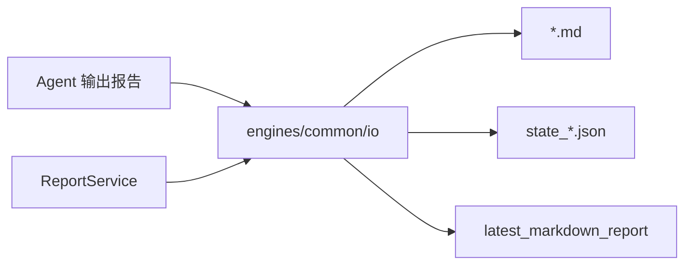
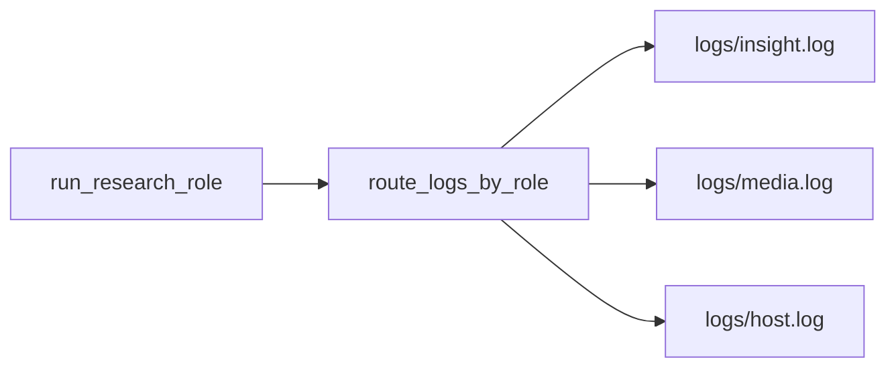
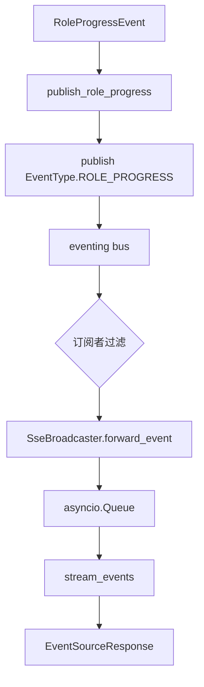
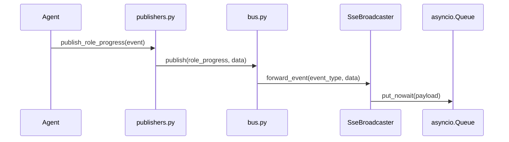
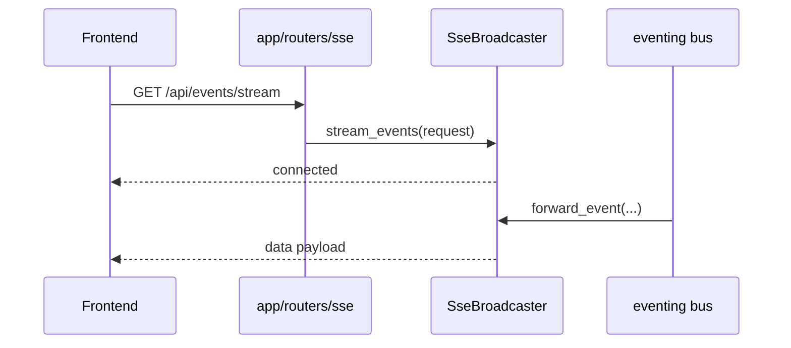
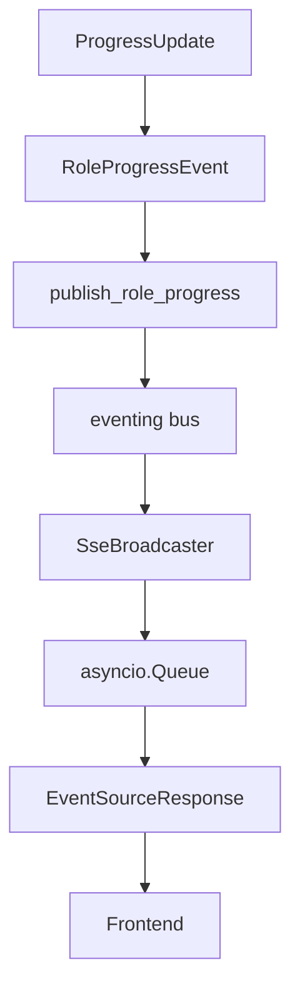
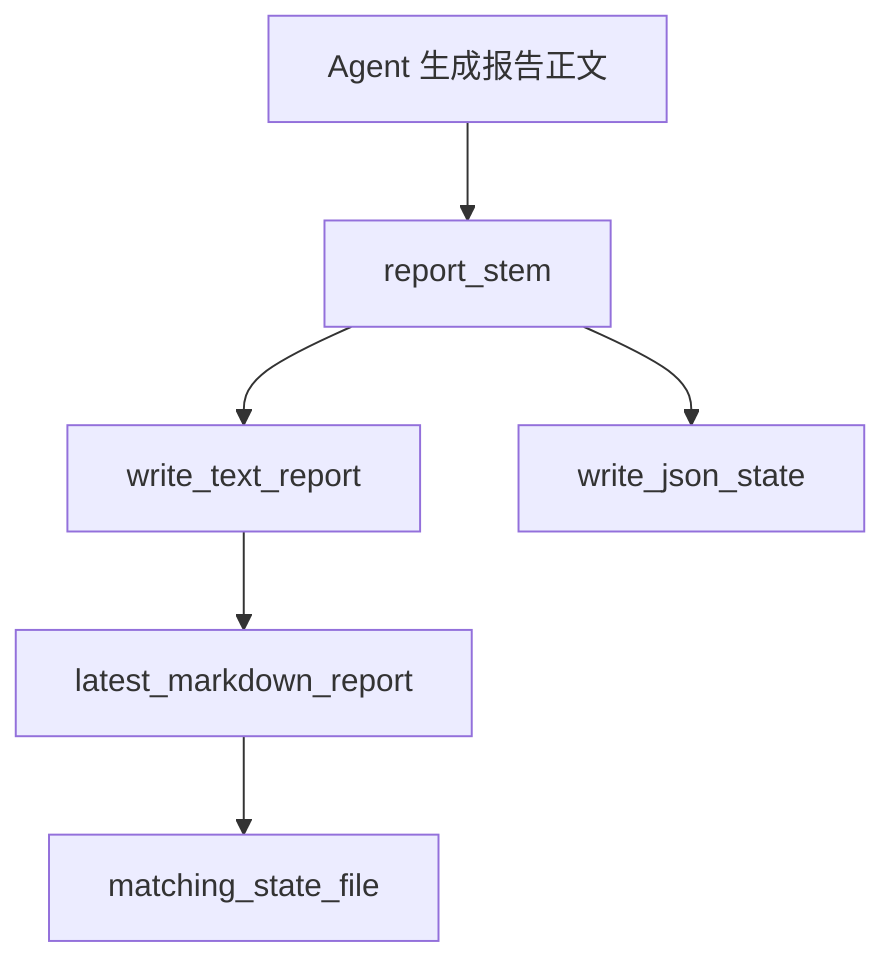
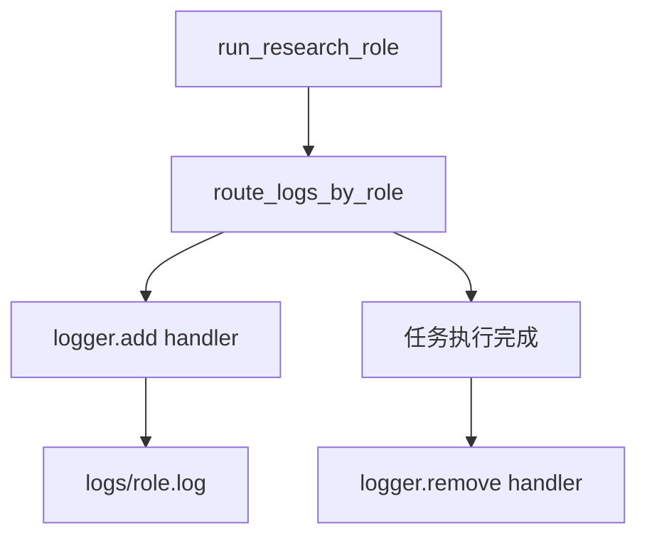

# Day03 补充：common 事件总线、IO 工具、SSE 与日志流

## 1. 本节讲解范围

### 1.1 本节涉及的模块

#### 1.1.1 相关目录

这一节补充 Day03 的公共基础设施。

前面已经讲了证据契约和 InsightAgent 证据池，但 Agent 在后台运行时还需要解决四个问题：

```text
进度如何发布
事件如何分发
结果如何落盘
前端如何实时看到进度
日志如何按角色分流
```

相关目录：

```text
engines/common/
engines/common/eventing/
engines/common/io/
engines/common/runtime/
app/services/realtime/
app/routers/sse/
app/services/system/
```

#### 1.1.2 相关文件

本节重点讲：

```text
engines/common/eventing/bus.py
engines/common/eventing/publishers.py
engines/common/eventing/__init__.py
engines/common/io/reports.py
engines/common/io/__init__.py
engines/common/runtime/role_log_stream.py
engines/common/models/progress.py
app/services/realtime/broadcaster.py
app/services/realtime/sse.py
app/routers/sse/stream.py
app/services/system/lifecycle.py
```

#### 1.1.3 本节范围边界

本节不讲某个 Agent 的算法。

本节讲公共基础设施：

```text
Agent 如何把状态告诉外部
后端如何把事件转成 SSE
报告文件如何统一命名和保存
日志如何按角色落到独立文件
```

### 1.2 本节要解决的问题

#### 1.2.1 核心问题

本节要解决：

```text
1. 为什么需要一个进程内事件总线
2. publish / subscribe / unsubscribe 如何工作
3. 为什么 publishers 要对事件发布再封装一层
4. SSE Broadcaster 如何把内部事件推给前端
5. IO 工具如何统一报告文件命名、保存和读取
6. role_log_stream 如何按 insight/media/host 分流日志
```

#### 1.2.2 难点说明

这部分代码看起来不复杂，但它是项目可观测性的核心。

如果没有它，后台 Agent 虽然能跑，但前端不知道：

```text
跑到哪一步了
哪个角色完成了
哪个角色失败了
最新报告在哪里
日志应该看哪个文件
```

#### 1.2.3 和 Day03 主线的关系

Day03 上午讲证据如何通过 `SectionReadyEvent` 交给 HostAgent。

Day03 下午讲 InsightAgent 如何构建证据池。

本节补充：

```text
这些事件和进度，如何在后端内部流动，并最终送到前端。
```

## 2. 本节在项目中的位置

### 2.1 全局架构定位

#### 2.1.1 当前模块属于哪一层

`engines/common` 是引擎公共基础设施层。

它不属于 InsightAgent、MediaAgent 或 HostAgent 中的任何一个。

它被多个 Agent 共享。

#### 2.1.2 上游模块是谁

上游是所有会发布事件和写文件的模块：

```text
engines/orchestration/research.py
InsightAgent 节点
MediaAgent 节点
HostAgent 协调器
ReportEngine
```

#### 2.1.3 下游模块是谁

下游包括：

```text
SseBroadcaster
HostEventCoordinator
HostDiscussionService
前端 EventSource
ReportService
```

### 2.2 当前模块的职责边界

#### 2.2.1 它负责什么

公共基础设施负责：

```text
事件发布与订阅
进度事件封装
报告文件命名
报告文件读写
状态文件匹配
SSE 转发
角色日志分流
```

#### 2.2.2 它不负责什么

它不负责：

```text
LLM 生成
证据排序
Host 裁决
前端页面展示
数据库检索
```

#### 2.2.3 为什么这样分层

如果每个 Agent 都自己实现进度推送和文件写入，会造成重复和不一致。

公共层统一后：

```text
事件格式稳定
文件命名稳定
SSE 入口稳定
日志位置稳定
```

### 2.3 位置流程图

#### 2.3.1 事件到前端流程

```mermaid
flowchart LR
    Agent[Agent / Orchestration] --> Publisher[publishers.py]
    Publisher --> Bus[eventing bus]
    Bus --> SseBroadcaster[SseBroadcaster]
    SseBroadcaster --> Router[/api/events/stream]
    Router --> Frontend[前端 EventSource]
```

#### 2.3.2 IO 与报告流程



#### 2.3.3 日志流流程



## 3. 总体逻辑流程图

### 3.1 事件主流程

#### 3.1.1 输入从哪里来

输入来自 Agent 执行过程中的状态变化。

例如：

```text
角色开始
角色进度变化
角色完成
角色失败
章节完成
Host 讨论消息
```

#### 3.1.2 中间经过哪些步骤

事件流转过程：

```text
业务模块创建事件对象
-> publishers.py 发布事件
-> bus.py 遍历订阅者
-> SseBroadcaster.forward_event 接收
-> 写入每个 SSE 客户端队列
-> EventSourceResponse 输出
```

#### 3.1.3 输出到哪里去

输出到：

```text
前端 SSE 连接
HostAgent 事件协调器
讨论消息存储
```

### 3.2 主流程图

#### 3.2.1 Mermaid 流程图



#### 3.2.2 流程图逐节点解释

`RoleProgressEvent` 是结构化事件数据。

`publish_role_progress()` 是类型化发布函数。

`bus.publish()` 是真正的分发中心。

`SseBroadcaster` 是内部事件到 SSE 的桥。

`EventSourceResponse` 是 HTTP SSE 响应。

#### 3.2.3 关键转折点

关键转折点：

```text
Python 内部事件 -> JSON 字符串
JSON 字符串 -> SSE 数据流
SSE 数据流 -> 前端实时进度
```

### 3.3 IO 主流程

#### 3.3.1 报告写入流程

```text
生成 stem
-> ensure_dir
-> write_text_report
-> write_json_state
```

#### 3.3.2 报告读取流程

```text
markdown_reports
-> latest_markdown_report
-> matching_state_file
```

#### 3.3.3 文件命名价值

统一命名让其他服务可以根据目录找到最新报告。

例如 `ReportInputService` 和 `ResearchService.latest_results()` 都依赖这些 IO 工具。

## 4. 核心数据流图

### 4.1 输入数据结构

#### 4.1.1 ProgressUpdate

进度对象包含：

```text
status
message
progress_pct
```

它会被转换成 `RoleProgressEvent`。

#### 4.1.2 事件数据

事件发布时统一是：

```text
event_type: str
data: dict
```

#### 4.1.3 SSE payload

SSE Broadcaster 会包装成：

```json
{
  "event": "role_progress",
  "data": {
    "role": "insight",
    "status": "retrieving",
    "message": "正在构建全局证据池...",
    "progress_pct": 8
  }
}
```

### 4.2 中间状态变化

#### 4.2.1 EventBus 内部状态

事件总线内部维护：

```text
_subscribers
```

每个订阅者包含：

```text
callback
event_types filter
```

#### 4.2.2 SseBroadcaster 内部状态

SSE 广播器维护：

```text
_subscribers: list[asyncio.Queue]
_latest_events: dict[str, dict[str, str]]
```

`_latest_events` 用于新连接客户端的事件回放。

#### 4.2.3 IO 工具状态

IO 工具本身不维护内存状态。

它通过文件系统保存状态：

```text
*.md
state_*.json
```

### 4.3 输出数据结构

#### 4.3.1 SSE 输出

SSE 输出有两类：

```text
connected 连接确认
data      业务事件
```

#### 4.3.2 文件输出

文件输出：

```text
Markdown 报告
JSON 状态文件
角色日志文件
```

#### 4.3.3 日志输出

日志按角色进入：

```text
engines/logs/insight.log
engines/logs/media.log
engines/logs/host.log
```

## 5. 核心调用链图

### 5.1 事件总线调用链

#### 5.1.1 调用链展开

```text
publish_role_progress
-> publish
-> callback(event_value, data)
-> SseBroadcaster.forward_event
```

#### 5.1.2 时序图



#### 5.1.3 逻辑过渡

发布者不需要知道谁在监听。

订阅者也不需要知道事件由谁发布。

这就是事件总线的解耦价值。

### 5.2 SSE 调用链

#### 5.2.1 调用链展开

```text
GET /api/events/stream
-> event_stream
-> get_sse_broadcaster().stream_events(request)
-> EventSourceResponse
```

#### 5.2.2 时序图



#### 5.2.3 逻辑过渡

SSE 是长连接。

连接建立后，后端不需要前端轮询。

只要事件总线有进度事件，广播器就能推给前端。

### 5.3 生命周期调用链

#### 5.3.1 调用链展开

```text
FastAPI lifespan.start
-> ApplicationLifecycleService.start
-> sse_broadcaster.start
-> subscribe(forward_event)
```

#### 5.3.2 关闭流程

```text
FastAPI shutdown
-> ApplicationLifecycleService.shutdown
-> sse_broadcaster.stop
-> unsubscribe(forward_event)
```

#### 5.3.3 逻辑过渡

SSE 广播器必须在应用启动时订阅事件。

否则 Agent 发布了事件，前端也收不到。

## 6. 手写真实项目核心逻辑

### 6.1 为什么手写真实项目文件

#### 6.1.1 手写不是独立 Demo

这一节是公共基础设施，如果写 demo，学生很难和项目实际链路对应。

#### 6.1.2 本节手写哪些文件

本节手写：

```text
engines/common/eventing/bus.py
engines/common/eventing/publishers.py
app/services/realtime/broadcaster.py
app/routers/sse/stream.py
engines/common/io/reports.py
engines/common/runtime/role_log_stream.py
```

#### 6.1.3 和项目主链路的对应关系

```text
Agent 进度
-> EventBus
-> SseBroadcaster
-> SSE Router
-> 前端
```

### 6.2 手写代码一：`engines/common/eventing/bus.py`

#### 6.2.1 要实现什么

实现进程内事件总线。

#### 6.2.2 完整代码

完整包路径与文件名：

```text
engines/common/eventing/bus.py
```

完整代码如下：

```python
"""公共基础设施模块：engines/common/eventing/bus.py。"""

from typing import Any, Callable, Iterable

from engines.contracts.events import EventType

EventCallback = Callable[[str, dict[str, Any]], None]

_subscribers: list[tuple[EventCallback, frozenset[str] | None]] = []


def _event_value(event_type: str | EventType) -> str:
    return event_type.value if isinstance(event_type, EventType) else str(event_type)


def publish(event_type: str | EventType, data: dict[str, Any]) -> None:
    event_value = _event_value(event_type)
    for callback, types in list(_subscribers):
        if types is not None and event_value not in types:
            continue
        try:
            callback(event_value, data)
        except Exception:
            pass


def subscribe(callback: EventCallback, event_types: Iterable[str | EventType] | None = None) -> None:
    types = frozenset(_event_value(event_type) for event_type in event_types) if event_types is not None else None
    for existing, _ in _subscribers:
        if existing == callback:
            return
    _subscribers.append((callback, types))


def unsubscribe(callback: EventCallback) -> None:
    _subscribers[:] = [(cb, types) for cb, types in _subscribers if cb != callback]


def clear() -> None:
    _subscribers.clear()
```

#### 6.2.3 逐块解释

`_subscribers` 保存所有订阅者。

`publish()` 发布事件并按事件类型过滤。

`subscribe()` 注册订阅者。

`unsubscribe()` 移除订阅者。

#### 6.2.4 关键设计意图

事件总线是进程内的轻量实现。

它适合当前单进程后端，不引入 Redis、Kafka 这类外部依赖。

### 6.3 手写代码二：`engines/common/eventing/publishers.py`

#### 6.3.1 要实现什么

实现类型化事件发布函数。

#### 6.3.2 完整代码

完整包路径与文件名：

```text
engines/common/eventing/publishers.py
```

完整代码如下：

```python
"""公共基础设施模块：engines/common/eventing/publishers.py。"""

from engines.common.eventing.bus import publish
from engines.contracts.events import (
    EventType,
    HostDiscussionMessageEvent,
    RoleErrorEvent,
    RoleProgressEvent,
    RoleResultEvent,
    SectionReadyEvent,
)


def publish_role_progress(event: RoleProgressEvent) -> None:
    publish(EventType.ROLE_PROGRESS, event.model_dump())


def publish_role_result(event: RoleResultEvent) -> None:
    publish(EventType.ROLE_RESULT, event.model_dump())


def publish_role_error(event: RoleErrorEvent) -> None:
    publish(EventType.ROLE_ERROR, event.model_dump())


def publish_section_ready(event: SectionReadyEvent) -> None:
    publish(EventType.SECTION_READY, event.model_dump())


def publish_host_discussion_message(event: HostDiscussionMessageEvent) -> None:
    publish(EventType.HOST_DISCUSSION_MESSAGE, event.model_dump())
```

#### 6.3.3 逐块解释

这些函数把 Pydantic 事件对象转成 dict。

业务模块不需要直接调用底层 `publish()`。

#### 6.3.4 关键设计意图

封装一层可以减少事件类型写错，也让事件发布点更可读。

### 6.4 手写代码三：`app/services/realtime/broadcaster.py`

#### 6.4.1 要实现什么

实现内部事件到 SSE 客户端的广播。

#### 6.4.2 完整代码

完整包路径与文件名：

```text
app/services/realtime/broadcaster.py
```

完整代码如下：

```python
"""应用服务模块：app/services/realtime/broadcaster.py。"""

import asyncio
import json

from loguru import logger

from engines.common.eventing import subscribe, unsubscribe
from engines.contracts.events import EventType


class SseBroadcaster:
    FORWARDED_EVENT_TYPES = (
        EventType.ROLE_PROGRESS,
        EventType.ROLE_RESULT,
        EventType.ROLE_ERROR,
    )
    REPLAY_EVENT_TYPES = {
        EventType.ROLE_PROGRESS.value,
        EventType.ROLE_RESULT.value,
        EventType.ROLE_ERROR.value,
    }
    REPLAY_ROLES = ("insight", "media")

    def __init__(self) -> None:
        self._subscribers: list[asyncio.Queue] = []
        self._latest_events: dict[str, dict[str, str]] = {
            event_type.value: {} for event_type in self.FORWARDED_EVENT_TYPES
        }

    def start(self) -> None:
        subscribe(self.forward_event, self.FORWARDED_EVENT_TYPES)

    def stop(self) -> None:
        unsubscribe(self.forward_event)
        self._subscribers.clear()
        self._latest_events.clear()

    def forward_event(self, event_type: str, data: dict) -> None:
        payload = json.dumps({"event": event_type, "data": data}, ensure_ascii=False)
        self._remember_latest_event(event_type, data, payload)

        for queue in list(self._subscribers):
            try:
                queue.put_nowait(payload)
            except Exception:
                pass

    def _remember_latest_event(self, event_type: str, data: dict, payload: str) -> None:
        if event_type not in self.REPLAY_EVENT_TYPES:
            return

        role = data.get("role", "")
        if not role:
            return

        if event_type == EventType.ROLE_PROGRESS.value and data.get("status") == "starting":
            self._latest_events[EventType.ROLE_RESULT.value].pop(role, None)
            self._latest_events[EventType.ROLE_ERROR.value].pop(role, None)
        elif event_type == EventType.ROLE_RESULT.value:
            self._latest_events[EventType.ROLE_ERROR.value].pop(role, None)
        elif event_type == EventType.ROLE_ERROR.value:
            self._latest_events[EventType.ROLE_RESULT.value].pop(role, None)

        self._latest_events.setdefault(event_type, {})[role] = payload

    def get_replay_events(self) -> list[str]:
        events: list[str] = []
        for event_type in self.FORWARDED_EVENT_TYPES:
            by_role = self._latest_events.get(event_type.value, {})
            for role in self.REPLAY_ROLES:
                if role in by_role:
                    events.append(by_role[role])
        return events

    async def stream_events(self, request):
        queue: asyncio.Queue = asyncio.Queue()
        self._subscribers.append(queue)
        logger.debug("SSE client connected")

        try:
            yield {"event": "connected", "data": json.dumps({"status": "connected"})}

            replay = self.get_replay_events()
            if replay:
                logger.debug(f"SSE replaying {len(replay)} latest events")
                for payload in replay:
                    yield {"data": payload}

            while True:
                if await request.is_disconnected():
                    break
                payload = await queue.get()
                yield {"data": payload}
        finally:
            if queue in self._subscribers:
                self._subscribers.remove(queue)
            logger.debug("SSE client disconnected")
```

#### 6.4.3 逐块解释

`start()` 订阅事件总线。

`forward_event()` 把事件转成 JSON 字符串并推入所有客户端队列。

`get_replay_events()` 给新连接客户端回放最新状态。

`stream_events()` 是 SSE 长连接的异步生成器。

#### 6.4.4 关键设计意图

前端刷新页面后，也能马上拿到 insight/media 的最新状态。

所以这里维护了 `_latest_events`。

### 6.5 手写代码四：`app/routers/sse/stream.py`

#### 6.5.1 要实现什么

实现 SSE 路由。

#### 6.5.2 完整代码

完整包路径与文件名：

```text
app/routers/sse/stream.py
```

完整代码如下：

```python
"""SSE 实时事件流路由。"""

from fastapi import APIRouter, Request
from sse_starlette.sse import EventSourceResponse

from app.services.realtime import get_sse_broadcaster

router = APIRouter(tags=["events"])


@router.get("/api/events/stream")
async def event_stream(request: Request):
    return EventSourceResponse(
        get_sse_broadcaster().stream_events(request),
        ping=15,
        headers={"X-Accel-Buffering": "no"},
    )
```

#### 6.5.3 逐块解释

`EventSourceResponse` 是 SSE 响应对象。

`ping=15` 用于保持连接活跃。

`X-Accel-Buffering: no` 避免代理缓冲事件流。

#### 6.5.4 关键设计意图

前端只需要连接一个地址：

```text
/api/events/stream
```

就能持续收到后端进度事件。

### 6.6 手写代码五：`engines/common/io/reports.py`

#### 6.6.1 要实现什么

实现报告文件读写工具。

#### 6.6.2 完整代码

完整包路径与文件名：

```text
engines/common/io/reports.py
```

完整代码如下：

```python
"""公共基础设施模块：engines/common/io/reports.py。"""

from __future__ import annotations

import json
import re
from datetime import datetime
from pathlib import Path
from typing import Any


def timestamp() -> str:
    return datetime.now().strftime("%Y%m%d_%H%M%S")


def slugify(text: str, default: str = "report", max_length: int = 50) -> str:
    slug = re.sub(r"[^0-9A-Za-z\u4e00-\u9fff]+", "_", text or default).strip("_")
    return (slug or default)[:max_length]


def report_stem(prefix: str, query: str, ts: str | None = None) -> str:
    return f"{prefix}_{slugify(query)}_{ts or timestamp()}"


def ensure_dir(output_dir: str | Path) -> Path:
    path = Path(output_dir)
    path.mkdir(parents=True, exist_ok=True)
    return path


def write_text_report(output_dir: str | Path, stem: str, content: str, suffix: str = ".md") -> Path:
    path = ensure_dir(output_dir) / f"{stem}{suffix}"
    path.write_text(content, encoding="utf-8")
    return path


def write_json_state(output_dir: str | Path, stem: str, data: dict[str, Any]) -> Path:
    path = ensure_dir(output_dir) / f"{stem}.json"
    path.write_text(json.dumps(data, ensure_ascii=False, indent=2, default=str), encoding="utf-8")
    return path


def markdown_reports(output_dir: str | Path) -> list[Path]:
    path = Path(output_dir)
    if not path.is_dir():
        return []
    return sorted(path.glob("*.md"), key=lambda item: item.stat().st_mtime, reverse=True)


def latest_markdown_report(output_dir: str | Path) -> Path | None:
    reports = markdown_reports(output_dir)
    return reports[0] if reports else None


def matching_state_file(report_file: str | Path) -> Path | None:
    report_path = Path(report_file)
    role_dir = report_path.parent
    candidate = role_dir / f"state_{report_path.stem}.json"
    if candidate.is_file():
        return candidate
    state_files = sorted(
        role_dir.glob("state_*.json"),
        key=lambda item: item.stat().st_mtime,
        reverse=True,
    )
    return state_files[0] if state_files else None
```

#### 6.6.3 逐块解释

`timestamp()` 生成时间戳。

`slugify()` 清洗文件名。

`report_stem()` 生成统一文件名前缀。

`write_text_report()` 写 Markdown 或 HTML 文本报告。

`write_json_state()` 写运行状态。

`latest_markdown_report()` 找最新报告。

#### 6.6.4 关键设计意图

统一 IO 工具能让不同 Agent 的报告文件命名和查询方式保持一致。

### 6.7 手写代码六：`engines/common/runtime/role_log_stream.py`

#### 6.7.1 要实现什么

实现按角色分流日志。

#### 6.7.2 完整代码

完整包路径与文件名：

```text
engines/common/runtime/role_log_stream.py
```

完整代码如下：

```python
"""公共基础设施模块：engines/common/runtime/role_log_stream.py。"""

from contextlib import contextmanager
from pathlib import Path
from typing import Iterator
from loguru import logger

from engines.contracts import config

_LOG_DIR = Path(__file__).resolve().parents[2] / "logs"


@contextmanager
def route_logs_by_role(role: str) -> Iterator[None]:
    """按角色分流日志到 logs/{role}.log。
    """
    handler_id = None
    try:
        _LOG_DIR.mkdir(parents=True, exist_ok=True)
        handler_id = logger.add(
            str(_LOG_DIR / f"{role}.log"),
            format="{time:YYYY-MM-DD HH:mm:ss} | {level} | {name} - {message}",
            level=config.settings.LOG_LEVEL,
            encoding="utf-8",
            rotation="1 MB",  # 日志轮转存档阈值
            filter=lambda record, _r=role: (
                # record: 日志包名 内部日志结构大概如下: {"message": "打印内容...","level": {"name": "INFO"}，"name": "app.engines.insight" # 打印这行日志所在的模块名, ... }  # _r:默认参数,防止闭包坑
                    _r in record["name"].lower()
                    or "common" in record["name"].lower()
                    or _r in str(record["message"])[:30]
            ),
        )
    except Exception as exc:
        logger.warning(f"[{role}] 日志注册失败: {exc}")
    try:
        yield
    finally:
        if handler_id is not None:
            logger.remove(handler_id)
```

#### 6.7.3 逐块解释

`route_logs_by_role()` 是上下文管理器。

进入上下文时注册 loguru handler。

离开上下文时移除 handler。

#### 6.7.4 关键设计意图

不同研究角色并发运行时，日志容易混在一起。

按角色分流后，排查问题更容易。

## 7. 手写逻辑执行流程图

### 7.1 事件发布流程

#### 7.1.1 第一步执行什么

Agent 创建事件对象。

#### 7.1.2 第二步执行什么

调用 publishers 中的发布函数。

#### 7.1.3 最终得到什么

事件进入所有匹配订阅者。

### 7.2 SSE 推送流程

#### 7.2.1 第一步执行什么

FastAPI 启动时注册 SSE Broadcaster。

#### 7.2.2 第二步执行什么

前端连接 `/api/events/stream`。

#### 7.2.3 最终得到什么

前端实时收到角色进度、完成和错误事件。

### 7.3 IO 文件流程

#### 7.3.1 第一步执行什么

生成统一文件名。

#### 7.3.2 第二步执行什么

写入 Markdown 和 JSON 状态。

#### 7.3.3 最终得到什么

后续服务可以读取最新报告和匹配状态文件。

### 7.4 手写流程图

#### 7.4.1 进度到前端



#### 7.4.2 文件产物读取



#### 7.4.3 日志分流



## 8. 项目源码解读

### 8.1 文件一：`engines/common/models/progress.py`

#### 8.1.1 文件职责

定义统一进度对象。

#### 8.1.2 为什么需要这个文件

Agent 节点需要用统一格式报告进度。

#### 8.1.3 上游调用者

```text
engines/orchestration/research.py
Agent context
```

#### 8.1.4 下游依赖

```text
RoleProgressEvent
SseBroadcaster
```

#### 8.1.5 完整源码

完整包路径与文件名：

```text
engines/common/models/progress.py
```

完整代码如下：

```python
"""公共基础设施模块：engines/common/models/progress.py。"""

from dataclasses import dataclass
from typing import Any


@dataclass(frozen=True)
class ProgressUpdate:
    status: str
    message: str
    progress_pct: int

    def to_dict(self) -> dict[str, Any]:
        return {
            "status": self.status,
            "message": self.message,
            "progress_pct": self.progress_pct,
        }
```

#### 8.1.6 代码逐块解释

`ProgressUpdate` 是不可变 dataclass。

`to_dict()` 用于转成事件载荷。

#### 8.1.7 关键设计意图

进度格式统一后，前端不需要适配不同 Agent 的进度字段。

#### 8.1.8 如果不这样设计会怎样

不同节点可能返回不同字段，SSE 展示会变复杂。

### 8.2 文件二：`app/services/system/lifecycle.py`

#### 8.2.1 文件职责

统一启动和关闭共享服务。

#### 8.2.2 为什么需要这个文件

SSE、Host 事件监听、讨论消息订阅都需要随 FastAPI 生命周期启动和清理。

#### 8.2.3 上游调用者

```text
app/main.py lifespan
```

#### 8.2.4 下游依赖

```text
SseBroadcaster
HostDiscussionService
HostCoordinatorService
```

#### 8.2.5 完整源码

完整包路径与文件名：

```text
app/services/system/lifecycle.py
```

完整代码如下：

```python
"""应用服务模块：app/services/system/lifecycle.py。"""

from loguru import logger

from app.services.host import get_host_coordinator_service, get_host_discussion_service
from app.services.realtime import get_sse_broadcaster


class ApplicationLifecycleService:
    """进程生命周期协调器,统一初始化和清理共享服务。"""

    def __init__(self) -> None:
        self.host_discussion_service = get_host_discussion_service()
        self.host_coordinator_service = get_host_coordinator_service()
        self.sse_broadcaster = get_sse_broadcaster()

    def start(self) -> None:
        self.sse_broadcaster.start()
        self.host_discussion_service.subscribe_discussion_messages()
        self.host_coordinator_service.start()
        logger.info("FastAPI 服务器已启动,共享服务已初始化")

    def shutdown(self) -> None:
        self.host_coordinator_service.stop()
        self.host_discussion_service.shutdown()
        self.sse_broadcaster.stop()
        logger.info("FastAPI 服务器已关闭,共享服务已清理")


_lifecycle_service = ApplicationLifecycleService()


def get_lifecycle_service() -> ApplicationLifecycleService:
    return _lifecycle_service
```

#### 8.2.6 代码逐块解释

`start()` 启动 SSE 广播器和 Host 相关订阅。

`shutdown()` 按相反方向清理。

#### 8.2.7 关键设计意图

共享服务必须随应用生命周期管理。

#### 8.2.8 如果不这样设计会怎样

事件订阅可能重复注册，或关闭时残留订阅者。

## 9. 关键对象与状态拆解

### 9.1 核心对象一：事件总线订阅者

#### 9.1.1 对象定义

订阅者是：

```text
callback + event_types
```

#### 9.1.2 字段含义

`callback` 是事件处理函数。

`event_types` 是过滤器。

#### 9.1.3 生命周期

应用启动时注册。

应用关闭时注销。

### 9.2 核心对象二：SSE Queue

#### 9.2.1 对象定义

每个 SSE 客户端一个 `asyncio.Queue`。

#### 9.2.2 字段含义

队列里存放 JSON 字符串 payload。

#### 9.2.3 生命周期

客户端连接时创建。

客户端断开时移除。

### 9.3 核心对象三：报告文件

#### 9.3.1 对象定义

报告文件是落盘产物。

#### 9.3.2 字段含义

文件名包含：

```text
role/query/timestamp
```

#### 9.3.3 生命周期

Agent 完成后写入。

ReportService 或 ResearchService 后续读取。

## 10. 边界情况与异常分支

### 10.1 订阅者异常

#### 10.1.1 什么情况下发生

某个 callback 内部抛异常。

#### 10.1.2 代码如何处理

`bus.publish()` 捕获异常并忽略。

#### 10.1.3 为什么这样处理

一个订阅者失败不能阻塞其他订阅者。

### 10.2 SSE 客户端断开

#### 10.2.1 什么情况下发生

浏览器关闭页面或网络中断。

#### 10.2.2 代码如何处理

`stream_events()` 检查：

```python
await request.is_disconnected()
```

断开后移除 queue。

#### 10.2.3 为什么这样处理

避免内存中残留无效客户端队列。

### 10.3 日志 handler 注册失败

#### 10.3.1 什么情况下发生

日志目录权限不足，或者文件写入失败。

#### 10.3.2 代码如何处理

记录 warning，不影响主任务执行。

#### 10.3.3 为什么这样处理

日志是观测能力，不应该让 Agent 主流程失败。

## 11. 本节代码在完整链路中的作用

### 11.1 本节之前发生了什么

#### 11.1.1 上一段链路输出

Agent 开始运行，并在节点中产生进度和报告产物。

#### 11.1.2 本节接收的数据

本节接收：

```text
ProgressUpdate
RoleProgressEvent
RoleResultEvent
RoleErrorEvent
报告正文
运行状态
日志消息
```

#### 11.1.3 本节开始的条件

FastAPI 生命周期已经启动共享服务。

### 11.2 本节推进了什么

#### 11.2.1 推进了哪一步业务

本节把后台不可见的 Agent 执行过程变成可观察过程。

#### 11.2.2 改变了哪些状态

改变：

```text
event bus subscribers
SSE client queues
latest replay events
报告文件
角色日志文件
```

#### 11.2.3 产出了哪些结果

产出：

```text
实时 SSE 事件
Markdown 报告
JSON 状态文件
角色日志
```

### 11.3 本节之后交给谁

#### 11.3.1 下游模块

下游是：

```text
前端 EventSource
ReportService
ResearchService.latest_results
运维排查日志
```

#### 11.3.2 下游输入

下游输入是事件、文件和日志。

#### 11.3.3 后续课程如何衔接

讲完这节后，学生能理解：

```text
Agent 后台运行不是黑盒。
它通过事件总线、SSE、IO 和日志，把运行状态暴露出来。
```

后续讲 MediaAgent、HostAgent、ReportEngine 时，可以反复回到这条公共基础设施链路。
