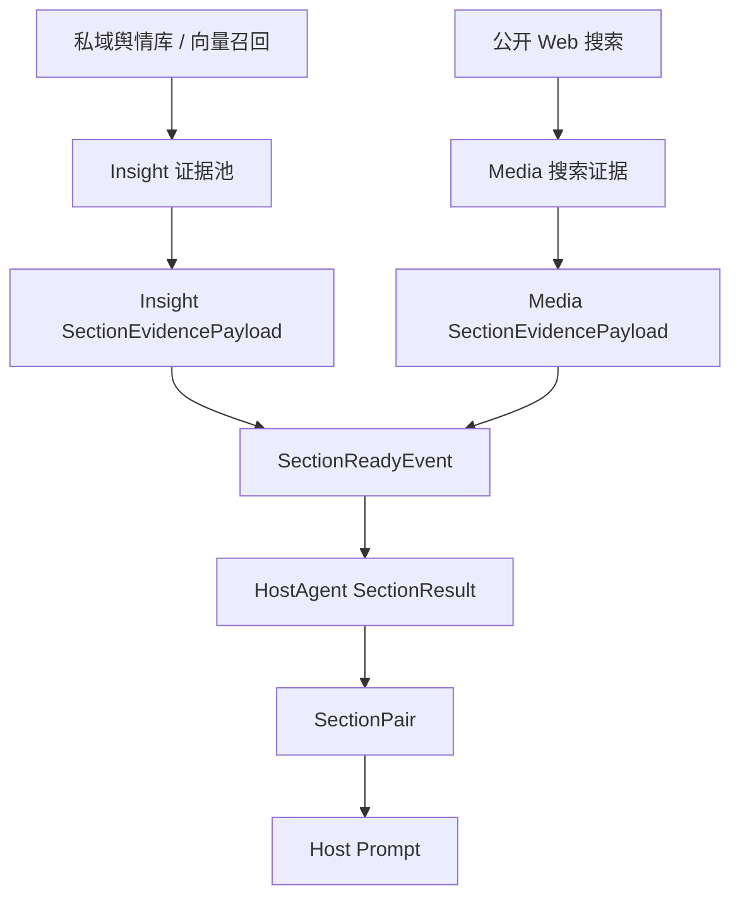
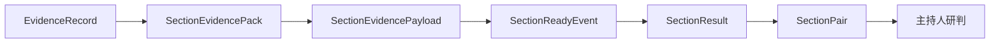
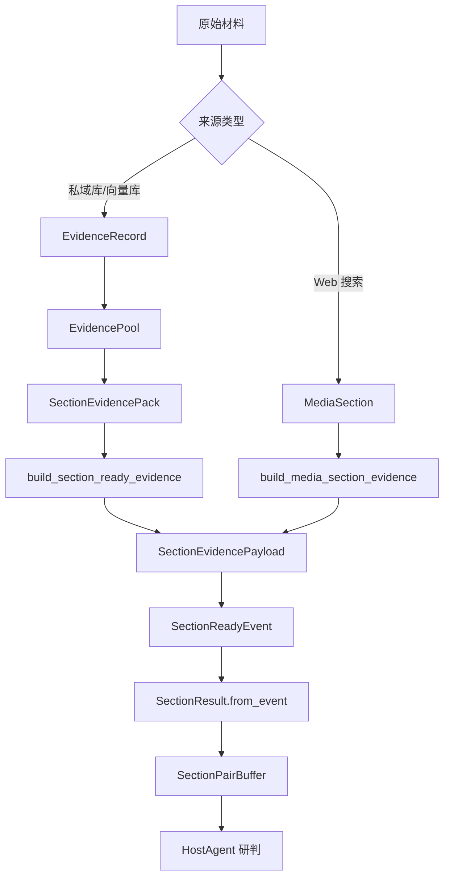
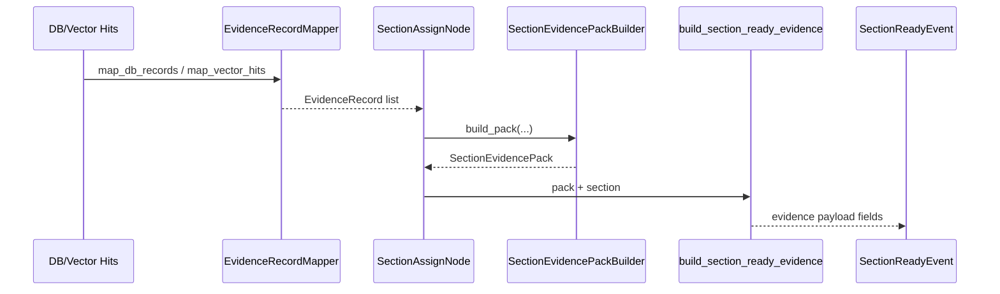
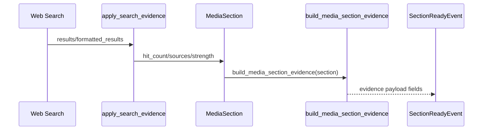
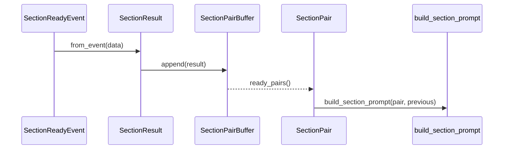
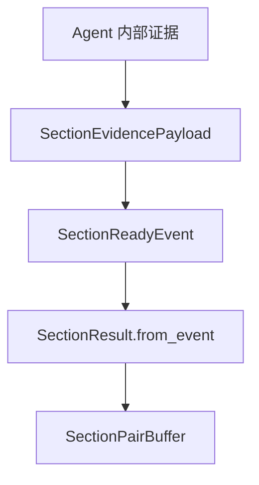
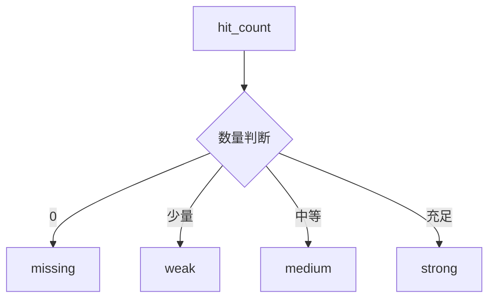
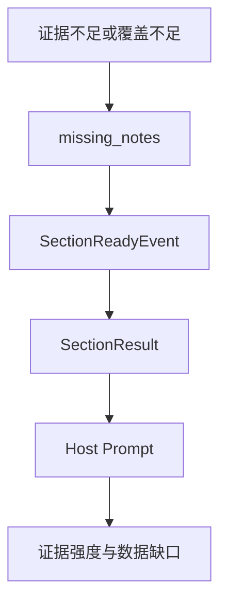

# Day03 上午：证据契约、证据包、章节事件

## 1. 本节讲解范围

### 1.1 本节涉及的模块

#### 1.1.1 相关目录

Day03 开始进入 `engines` 核心业务层。本节的核心不是某一个 Agent 如何调用大模型，而是先讲清楚项目里最重要的底层约束：

```text
证据契约
```

相关目录：

```text
engines/contracts/
engines/insight_agent/evidence/
engines/insight_agent/retrieval/
engines/media_agent/
engines/host_agent/
```

#### 1.1.2 相关文件

本节重点文件：

```text
engines/contracts/evidence.py
engines/contracts/events.py
engines/insight_agent/evidence/models.py
engines/insight_agent/evidence/section_event_payload.py
engines/media_agent/evidence.py
engines/media_agent/evidence_pack.py
engines/host_agent/schemas.py
engines/host_agent/pairing.py
engines/host_agent/prompt_builder.py
```

#### 1.1.3 本节范围边界

本节只讲证据如何被统一表达、传递和消费。

暂不展开完整的 InsightAgent 检索链路，也不展开 MediaAgent 搜索节点细节。

### 1.2 本节要解决的问题

#### 1.2.1 核心问题

本节要解决：

```text
1. 为什么项目必须有证据契约
2. Insight 和 Media 的证据来源不同，为什么出口必须一致
3. evidence_strength 如何影响 HostAgent 配对和裁决
4. missing_notes 为什么比“有无正文”更重要
5. SectionReadyEvent 为什么必须携带证据字段
```

#### 1.2.2 难点说明

证据契约不是单个类型定义，而是一条跨 Agent 的数据链。

InsightAgent 用私域舆情库和向量召回。

MediaAgent 用公开 Web 搜索。

两边产生的原始证据完全不同，但 HostAgent 要在同一个维度下比较二者，所以最终必须统一成：

```text
hit_count
used_query
sources
evidence_pack
evidence_strength
missing_notes
```

#### 1.2.3 和前两天的关系

Day01 讲项目全局。

Day02 讲 HTTP 请求如何进入 service 和 orchestration。

Day03 上午开始回答一个更核心的问题：

```text
Agent 写出来的章节，凭什么可信？
```

答案是：

```text
每个章节都必须带证据、证据强度和数据缺口。
```

## 2. 本节在项目中的位置

### 2.1 全局架构定位

#### 2.1.1 当前模块属于哪一层

`engines/contracts/evidence.py` 属于公共契约层。

它不是 InsightAgent 私有文件，也不是 MediaAgent 私有文件。

它规定所有研究角色向 HostAgent 交付章节结果时必须携带的证据信息。

#### 2.1.2 上游模块是谁

上游是证据生产者：

```text
MySQL 私域数据召回
Milvus 向量召回
公开 Web 搜索
章节证据分配节点
```

#### 2.1.3 下游模块是谁

下游是证据消费者：

```text
InsightAgent 章节写作
MediaAgent 章节写作
HostAgent 阶段性研判
最终报告生成
```

### 2.2 当前模块的职责边界

#### 2.2.1 它负责什么

证据契约负责统一：

```text
证据数量
证据来源
证据强度
代表性证据
来源覆盖说明
数据缺口说明
章节事件载荷
```

#### 2.2.2 它不负责什么

证据契约不负责：

```text
如何搜索
如何聚类
如何调用 LLM
如何写 Markdown
如何保存报告文件
```

#### 2.2.3 为什么这样分层

如果没有证据契约，InsightAgent 和 MediaAgent 会各自返回不同结构。

HostAgent 就要同时理解私域数据结构、Web 搜索结构、聚类结构、网页来源结构。

这会让主持人研判逻辑严重耦合。

现在的设计是：

```text
两个研究角色内部可以不同
但对外交付必须一致
```

### 2.3 位置流程图

#### 2.3.1 全局位置图



#### 2.3.2 证据链路放大图



#### 2.3.3 关键节点解释

`EvidenceRecord` 是 InsightAgent 内部的单条私域证据。

`SectionEvidencePack` 是某个章节分配到的证据包。

`SectionEvidencePayload` 是跨 Agent 统一证据载荷。

`SectionReadyEvent` 是章节完成事件。

`SectionResult` 是 HostAgent 接收到事件后的内部模型。

`SectionPair` 是同一维度下 Insight 和 Media 的配对结果。

## 3. 总体逻辑流程图

### 3.1 主流程说明

#### 3.1.1 输入从哪里来

证据来源有两条主线。

InsightAgent：

```text
数据库记录
向量召回结果
热度数据
评论数据
聚类结果
```

MediaAgent：

```text
网页标题
网页链接
发布时间
正文摘要
来源域名
```

#### 3.1.2 中间经过哪些步骤

InsightAgent 的证据链：

```text
召回结果
-> EvidenceRecord
-> EvidencePool
-> SectionEvidencePack
-> SectionEvidencePayload
-> SectionReadyEvent
```

MediaAgent 的证据链：

```text
Web 搜索结果
-> MediaSection
-> build_media_section_evidence
-> SectionEvidencePayload
-> SectionReadyEvent
```

HostAgent 的消费链：

```text
SectionReadyEvent
-> SectionResult.from_event
-> SectionPairBuffer
-> SectionPair
-> build_section_prompt
```

#### 3.1.3 输出到哪里去

输出进入 HostAgent。

HostAgent 在 prompt 中看到的不只是正文，还包括：

```text
命中数量
实际查询词
证据强度
数据缺口
来源数量
证据包摘要
```

### 3.2 主流程图

#### 3.2.1 Mermaid 流程图



#### 3.2.2 流程图逐节点解释

两类原始材料不同。

Insight 更关注私域内容、互动热度、平台、聚类。

Media 更关注网页来源、域名覆盖、搜索命中数量。

但两者都必须在章节完成时发布 `SectionReadyEvent`。

#### 3.2.3 关键转折点

关键转折点有四个：

```text
原始材料 -> 统一证据记录
Agent 内部证据 -> 统一章节证据载荷
章节正文 -> 带证据的章节事件
单方结果 -> 双方配对研判
```

### 3.3 证据强度和数据缺口

#### 3.3.1 evidence_strength 的意义

`evidence_strength` 不是装饰字段。

它决定 HostAgent 判断某一方输出时是否更有支撑。

取值：

```text
missing  没有可用证据
weak     有少量证据
medium   有一定证据
strong   证据较充足
```

#### 3.3.2 missing_notes 的意义

`missing_notes` 用来解释“为什么证据不足”。

它比单纯的 `hit_count=0` 更有教学意义，也更有业务价值。

例如：

```text
媒体侧未检索到可用结果
评论型证据偏少，情绪和深层分析需保留谨慎
讨论簇覆盖有限，本章节可能偏向少数高频话题
```

#### 3.3.3 为什么不能只看正文

正文是 LLM 写出来的。

证据字段是程序整理出来的结构化信息。

HostAgent 不能只看正文，因为正文可能语气很强，但证据很弱。

所以项目把正文和证据一起传给 HostAgent。

## 4. 核心数据流图

### 4.1 输入数据结构

#### 4.1.1 Insight 输入结构

Insight 的基本证据单位是 `EvidenceRecord`。

它包含内容、平台、作者、发布时间、互动数据、热度分、最终分、召回信息和聚类 ID。

#### 4.1.2 Media 输入结构

Media 的证据先写在 `MediaSection`。

核心字段：

```text
sources
hit_count
used_query
formatted_results
evidence_strength
missing_notes
```

#### 4.1.3 统一输出结构

统一输出结构是 `SectionEvidencePayload`：

```text
hit_count
used_query
evidence_strength
sources
missing_notes
evidence_pack
```

### 4.2 中间状态变化

#### 4.2.1 Insight 的状态变化

```text
raw rows / vector hits
-> EvidenceRecord
-> EvidencePool.records
-> section_evidence_packs
-> SectionReadyEvent
```

#### 4.2.2 Media 的状态变化

```text
search results
-> formatted_results
-> MediaSection evidence fields
-> SectionReadyEvent
```

#### 4.2.3 Host 的状态变化

```text
event dict
-> SectionResult
-> SectionPairBuffer
-> SectionPair
-> Host moderation result
```

### 4.3 输出数据结构

#### 4.3.1 SectionReadyEvent

这是章节交付事件。

它是正文和证据的合体。

#### 4.3.2 SectionResult

这是 HostAgent 内部接收模型。

它保留了事件里的证据字段。

#### 4.3.3 SectionPair

这是同一维度下的双 Agent 配对。

没有配对，HostAgent 就不能做同维研判。

## 5. 核心调用链图

### 5.1 Insight 证据调用链

#### 5.1.1 调用链

```text
EvidenceRecordMapper
-> EvidencePool
-> SectionAssignNode
-> SectionEvidencePackBuilder
-> build_section_ready_evidence
-> SectionReadyEvent
```

#### 5.1.2 时序图



#### 5.1.3 逻辑过渡

InsightAgent 的难点是数据先进入全局证据池，然后再分配给不同章节。

也就是说，它不是“搜一次写一章”，而是：

```text
先形成证据池
再按章节主题挑证据
再基于章节证据包写作
```

### 5.2 Media 证据调用链

#### 5.2.1 调用链

```text
Web 搜索结果
-> apply_search_evidence
-> MediaSection
-> build_media_section_evidence
-> SectionReadyEvent
```

#### 5.2.2 时序图



#### 5.2.3 逻辑过渡

MediaAgent 的证据更加直接。

每个章节有自己的搜索词和搜索结果。

所以它更像：

```text
按章节搜索
按章节整理证据
按章节写作
```

### 5.3 Host 证据消费调用链

#### 5.3.1 调用链

```text
SectionReadyEvent
-> SectionResult.from_event
-> SectionPairBuffer.append
-> SectionPairBuffer.ready_pairs
-> build_section_prompt
```

#### 5.3.2 时序图



#### 5.3.3 逻辑过渡

HostAgent 不急着收到一个章节就判断。

它要等同一个 `section_key` 下：

```text
insight 有结果
media 有结果
```

两个都到齐，才形成 `SectionPair`。

## 6. 手写真实项目核心逻辑

### 6.1 为什么手写真实项目文件

#### 6.1.1 手写不是独立 Demo

证据字段一旦写错，后续 HostAgent 就无法判断证据强弱。

所以本节必须手写真实项目文件。

#### 6.1.2 本节手写哪些文件

手写重点：

```text
engines/contracts/evidence.py
engines/contracts/events.py
engines/host_agent/schemas.py
```

这三个文件分别对应：

```text
证据载荷契约
章节事件契约
Host 接收模型
```

#### 6.1.3 和项目主链路的对应关系

```text
SectionEvidencePayload
-> SectionReadyEvent
-> SectionResult
```

### 6.2 手写代码一：`engines/contracts/evidence.py`

#### 6.2.1 要实现什么

实现跨 Agent 的证据载荷契约。

#### 6.2.2 完整代码

完整包路径与文件名：

```text
engines/contracts/evidence.py
```

完整代码如下：

```python
"""Shared evidence-pack contract helpers."""

from __future__ import annotations

from typing import Any, Literal

from typing_extensions import TypedDict

EvidenceStrength = Literal["missing", "weak", "medium", "strong"]


class EvidencePackPayload(TypedDict, total=False):
    # 章节分析目标
    analysis_goal: list[str]

    # 证据统计与代表内容
    stats: dict[str, Any]
    representative_quotes: list[dict[str, Any]]

    # 来源摘要信息
    source_titles: list[str]
    source_domains: list[str]
    representative_sources: list[dict[str, str]]

    # 覆盖情况说明
    coverage_notes: list[str]


class SectionEvidencePayload(TypedDict):
    # 证据命中摘要
    hit_count: int
    used_query: str
    evidence_strength: EvidenceStrength

    # 证据来源与缺口
    sources: list[dict[str, Any]]
    missing_notes: list[str]

    # 详细证据包摘要
    evidence_pack: EvidencePackPayload


def evidence_strength_from_hit_count(hit_count: int) -> EvidenceStrength:
    if hit_count >= 20:
        return "strong"
    if hit_count >= 8:
        return "medium"
    if hit_count > 0:
        return "weak"
    return "missing"


def build_section_evidence_payload(
    *,
    hit_count: int,
    used_query: str,
    sources: list[dict[str, Any]],
    missing_notes: list[str],
    evidence_pack: EvidencePackPayload,
    evidence_strength: EvidenceStrength | None = None,
) -> SectionEvidencePayload:
    return {
        "hit_count": hit_count,
        "used_query": used_query,
        "sources": sources,
        "evidence_strength": evidence_strength or evidence_strength_from_hit_count(hit_count),
        "missing_notes": missing_notes,
        "evidence_pack": evidence_pack,
    }
```

#### 6.2.3 逐块解释

`EvidenceStrength` 是证据强度枚举。

`EvidencePackPayload` 用 `total=False`，说明它是一个可扩展摘要包。

`SectionEvidencePayload` 是更严格的章节证据载荷。

`build_section_evidence_payload()` 是统一构建函数。

#### 6.2.4 关键设计意图

统一构建函数避免各个 Agent 手写字段时出现遗漏。

### 6.3 手写代码二：`engines/contracts/events.py`

#### 6.3.1 要实现什么

实现章节事件契约。

#### 6.3.2 完整代码

完整包路径与文件名：

```text
engines/contracts/events.py
```

完整代码如下：

```python
"""领域事件载荷契约。"""

from enum import Enum
from typing import Any, Literal

from pydantic import BaseModel, Field

from engines.contracts.evidence import EvidencePackPayload


class EventType(str, Enum):
    SECTION_READY = "section_ready"
    ROLE_PROGRESS = "role_progress"
    HOST_DISCUSSION_MESSAGE = "host_discussion_message"
    ROLE_ERROR = "role_error"
    ROLE_RESULT = "role_result"


class RoleProgressEvent(BaseModel):
    role: str
    status: str
    message: str = ""
    progress_pct: int = 0


class RoleResultEvent(BaseModel):
    role: str
    status: str = "done"


class RoleErrorEvent(BaseModel):
    role: str
    error: str
    traceback: str = ""


class SectionReadyEvent(BaseModel):
    source: Literal["insight", "media"]
    agent: str
    section_key: str
    section_index: int
    title: str = ""
    query: str = ""
    body: str = ""
    hit_count: int = 0
    used_query: str = ""
    sources: list[dict[str, Any]] = Field(default_factory=list)
    evidence_pack: EvidencePackPayload = Field(default_factory=dict)
    evidence_strength: str = ""
    missing_notes: list[str] = Field(default_factory=list)


class HostDiscussionMessageEvent(BaseModel):
    type: Literal["agent", "host", "system"] = "agent"
    sender: str
    content: str
    timestamp: str = ""
    source: str = ""
    section_key: str = ""
```

#### 6.3.3 逐块解释

`SectionReadyEvent` 是本节最重要事件。

它不只传 `body`，还传完整证据字段。

#### 6.3.4 关键设计意图

章节事件是 Agent 和 HostAgent 之间的边界。

边界必须稳定。

### 6.4 手写代码三：`engines/host_agent/schemas.py`

#### 6.4.1 要实现什么

实现 HostAgent 接收章节事件后的内部模型。

#### 6.4.2 完整代码

完整包路径与文件名：

```text
engines/host_agent/schemas.py
```

完整代码如下：

```python
"""HostAgent 配对裁决模块：engines/host_agent/schemas.py。"""

from dataclasses import dataclass
from datetime import datetime
from typing import Any

from engines.contracts.evidence import EvidencePackPayload


@dataclass(frozen=True)
class HostSpeech:
    content: str


@dataclass(frozen=True)
class SectionResult:
    source: str
    agent: str
    section_key: str
    section_index: int
    title: str
    body: str
    query: str = ""
    hit_count: int = 0
    used_query: str = ""
    sources: tuple[dict[str, Any], ...] = ()
    evidence_pack: EvidencePackPayload | None = None
    evidence_strength: str = ""
    missing_notes: tuple[str, ...] = ()
    received_at: str = ""

    @classmethod
    def from_event(cls, data: dict[str, Any]) -> "SectionResult":
        return cls(
            source=str(data.get("source", "")).strip().lower(),
            agent=str(data.get("agent", "")).strip(),
            section_key=str(data.get("section_key", "")).strip(),
            section_index=int(data.get("section_index", 0) or 0),
            title=str(data.get("title", "")).strip(),
            body=str(data.get("body", "")).strip(),
            query=str(data.get("query", "")).strip(),
            hit_count=int(data.get("hit_count", 0) or 0),
            used_query=str(data.get("used_query", "")).strip(),
            sources=tuple(data.get("sources") or ()),
            evidence_pack=data.get("evidence_pack") or {},
            evidence_strength=str(data.get("evidence_strength", "")).strip(),
            missing_notes=tuple(data.get("missing_notes") or ()),
            received_at=str(data.get("received_at") or datetime.now().isoformat(timespec="seconds")),
        )


@dataclass(frozen=True)
class SectionPair:
    section_key: str
    title: str
    insight: SectionResult
    media: SectionResult


@dataclass(frozen=True)
class SectionModerationResult:
    section_key: str
    title: str
    content: str
    consensus: tuple[str, ...] = ()
    conflicts: tuple[str, ...] = ()
    conflict_explanations: tuple[str, ...] = ()
    evidence_judgement: str = ""
    stronger_side: str = ""
    data_gaps: tuple[str, ...] = ()
    risks: tuple[str, ...] = ()
    follow_up_questions: tuple[str, ...] = ()

    def to_dict(self) -> dict[str, Any]:
        return {
            "section_key": self.section_key,
            "section_title": self.title,
            "content": self.content,
            "consensus": list(self.consensus),
            "conflicts": list(self.conflicts),
            "conflict_explanations": list(self.conflict_explanations),
            "evidence_judgement": self.evidence_judgement,
            "stronger_side": self.stronger_side,
            "data_gaps": list(self.data_gaps),
            "risks": list(self.risks),
            "follow_up_questions": list(self.follow_up_questions),
        }
```

#### 6.4.3 逐块解释

`SectionResult.from_event()` 是事件到 Host 内部对象的转换点。

它保留：

```text
hit_count
used_query
sources
evidence_pack
evidence_strength
missing_notes
```

#### 6.4.4 关键设计意图

HostAgent 不能只接收正文。

它必须接收证据上下文。

## 7. 手写逻辑执行流程图

### 7.1 证据载荷构建过程

#### 7.1.1 第一步执行什么

Agent 内部先拿到证据。

#### 7.1.2 第二步执行什么

把内部证据整理成 `SectionEvidencePayload`。

#### 7.1.3 最终得到什么

把证据字段填入 `SectionReadyEvent`。

### 7.2 Host 接收过程

#### 7.2.1 第一步执行什么

收到 `section_ready` 事件。

#### 7.2.2 第二步执行什么

调用 `SectionResult.from_event()`。

#### 7.2.3 最终得到什么

进入 `SectionPairBuffer` 等待配对。

### 7.3 手写流程图

#### 7.3.1 证据到事件



#### 7.3.2 证据强度判断



#### 7.3.3 数据缺口传递



## 8. 项目源码解读

### 8.1 文件一：`engines/insight_agent/evidence/models.py`

#### 8.1.1 文件职责

定义 InsightAgent 内部证据模型。

#### 8.1.2 为什么需要这个文件

Insight 的证据来自私域库和向量召回，需要先形成统一内部结构，再进入章节分配。

#### 8.1.3 上游调用者

```text
EvidenceRecordMapper
SectionAssignNode
SectionEvidencePackBuilder
```

#### 8.1.4 下游依赖

```text
build_section_ready_evidence
Insight SummarizeNode
```

#### 8.1.5 完整源码

完整包路径与文件名：

```text
engines/insight_agent/evidence/models.py
```

完整代码如下：

```python
"""InsightAgent evidence data models."""

from __future__ import annotations

from typing import Any

from typing_extensions import TypedDict


class EvidenceRecord(TypedDict):
    # 证据身份与内容
    id: str
    platform: str
    content: str
    author: str
    published_at: str
    url: str
    record_type: str
    source_keyword: str
    source_table: str

    # 业务评分与状态
    hotness_score: float    # 热度值得分
    final_score: float      # 最终得分 通道检索得分60% + 热度 30% + 新鲜度 10%
    engagement: dict[str, Any]
    cluster_id: str

    # 召回过程信息
    retrieval: dict[str, Any]


class EvidenceCluster(TypedDict, total=False):
    # 聚类身份与说明
    id: str
    label: str
    summary: str

    # 聚类成员关系
    member_record_ids: list[str]
    representative_ids: list[str]
    size: int


class EvidencePool(TypedDict):
    # 全局研究主题
    query: str

    # 全局证据池
    records: list[EvidenceRecord]

    # 全局讨论簇
    clusters: list[EvidenceCluster]


class SectionEvidencePack(TypedDict):
    # 章节身份与查询来源
    section_key: str
    used_query: str

    # 章节证据集合
    evidence_ids: list[str]
    evidence_count: int
    evidence_sources: list[dict[str, Any]]
    evidence_source_blocks: list[str]

    # 章节证据统计与代表内容
    stats: dict
    representative_quotes: list[dict[str, Any]]
    missing_notes: list[str]
```

#### 8.1.6 代码逐块解释

`EvidenceRecord` 表示单条证据。

`EvidenceCluster` 表示讨论簇。

`EvidencePool` 表示全局证据池。

`SectionEvidencePack` 表示章节证据包。

#### 8.1.7 关键设计意图

InsightAgent 先组织证据，再写章节。

#### 8.1.8 如果不这样设计会怎样

章节写作会缺少明确证据边界，LLM 更容易自由发挥。

### 8.2 文件二：`engines/insight_agent/evidence/section_event_payload.py`

#### 8.2.1 文件职责

把 Insight 内部章节证据包转换成公共证据载荷。

#### 8.2.2 为什么需要这个文件

Insight 内部的 `SectionEvidencePack` 和公共的 `SectionEvidencePayload` 不完全一样。

所以需要一个转换层。

#### 8.2.3 上游调用者

```text
Insight SummarizeNode
```

#### 8.2.4 下游依赖

```text
SectionReadyEvent
```

#### 8.2.5 完整源码

完整包路径与文件名：

```text
engines/insight_agent/evidence/section_event_payload.py
```

完整代码如下：

```python
"""Build SectionReadyEvent evidence payloads for InsightAgent."""

from __future__ import annotations

from typing import Any, Mapping

from engines.contracts.evidence import SectionEvidencePayload, build_section_evidence_payload
from engines.insight_agent.evidence.models import SectionEvidencePack


def build_section_ready_evidence(
    pack: SectionEvidencePack,
    section: Mapping[str, Any] | None = None,
) -> SectionEvidencePayload:
    section = section or {}
    representative_quotes = list(pack.get("representative_quotes", []))
    evidence_pack = {
        "analysis_goal": section.get("goal", []),
        "stats": pack.get("stats", {}),
        "representative_quotes": [dict(record) for record in representative_quotes[:8]],
    }
    return build_section_evidence_payload(
        hit_count=int(pack.get("evidence_count", 0) or 0),
        used_query=pack.get("used_query", ""),
        sources=list(pack.get("evidence_sources", [])),
        missing_notes=list(pack.get("missing_notes", [])),
        evidence_pack=evidence_pack,
    )
```

#### 8.2.6 代码逐块解释

这里把 Insight 内部字段改造成公共字段。

`evidence_count` 变成 `hit_count`。

`evidence_sources` 变成 `sources`。

`representative_quotes` 被放进 `evidence_pack`。

#### 8.2.7 关键设计意图

转换层让 Insight 内部结构可以继续保持丰富，而对外契约保持稳定。

#### 8.2.8 如果不这样设计会怎样

HostAgent 会直接依赖 Insight 内部字段，耦合过高。

### 8.3 文件三：`engines/media_agent/evidence_pack.py`

#### 8.3.1 文件职责

把 Media 章节中的搜索证据转换成公共证据载荷。

#### 8.3.2 为什么需要这个文件

Media 的证据来自网页，需要补充标题、域名、代表来源和覆盖说明。

#### 8.3.3 上游调用者

```text
Media SummarizeNode
```

#### 8.3.4 下游依赖

```text
SectionReadyEvent
```

#### 8.3.5 完整源码

完整包路径与文件名：

```text
engines/media_agent/evidence_pack.py
```

完整代码如下：

```python
"""MediaAgent 全网媒体研究模块：engines/media_agent/evidence_pack.py。"""

from __future__ import annotations

from typing import Any
from urllib.parse import urlparse

from engines.contracts.evidence import SectionEvidencePayload, build_section_evidence_payload
from engines.media_agent.evidence import media_evidence_strength_from_hit_count
from engines.media_agent.state import MediaSection


def build_media_section_evidence(section: MediaSection) -> SectionEvidencePayload:
    sources = list(section.get("sources", []))
    source_domains = _source_domains(sources)
    source_titles = _source_titles(sources)
    evidence_pack = {
        "analysis_goal": section.get("goal", []),
        "source_titles": source_titles,
        "source_domains": source_domains,
        "representative_sources": _representative_sources(sources),
        "coverage_notes": _coverage_notes(section, source_domains),
    }
    return build_section_evidence_payload(
        hit_count=int(section.get("hit_count", 0) or 0),
        used_query=section.get("used_query", ""),
        sources=sources,
        missing_notes=list(section.get("missing_notes", [])),
        evidence_pack=evidence_pack,
        evidence_strength=media_evidence_strength_from_hit_count(int(section.get("hit_count", 0) or 0)),
    )


def _source_titles(sources: list[dict[str, Any]], limit: int = 8) -> list[str]:
    return [
        title for title in (str(source.get("title", "")).strip() for source in sources)
        if title
    ][:limit]


def _source_domains(sources: list[dict[str, Any]], limit: int = 8) -> list[str]:
    domains = []
    for source in sources:
        url = str(source.get("url", "")).strip()
        domain = urlparse(url).netloc.lower().removeprefix("www.")
        if domain and domain not in domains:
            domains.append(domain)
    return domains[:limit]


def _representative_sources(sources: list[dict[str, Any]], limit: int = 5) -> list[dict[str, str]]:
    representatives = []
    for source in sources[:limit]:
        representatives.append({
            "title": str(source.get("title", "")).strip(),
            "url": str(source.get("url", "")).strip(),
            "published_date": str(source.get("published_date", "")).strip(),
        })
    return representatives


def _coverage_notes(section: MediaSection, domains: list[str]) -> list[str]:
    notes: list[str] = []
    hit_count = int(section.get("hit_count", 0) or 0)
    if hit_count and len(domains) <= 1:
        notes.append("媒体来源域名集中,需谨慎判断跨媒体共识")
    if hit_count >= 3 and len(domains) >= 3:
        notes.append("媒体来源覆盖多个域名,具备一定横向参照价值")
    return notes
```

#### 8.3.6 代码逐块解释

`_source_domains()` 从 URL 中提取域名。

`_coverage_notes()` 判断媒体来源是否集中。

这让 HostAgent 不只看网页数量，还能看来源覆盖。

#### 8.3.7 关键设计意图

媒体侧的可信度很依赖来源分布。

只有多个域名、多类来源同时出现，才更适合判断公开媒体共识。

#### 8.3.8 如果不这样设计会怎样

一个来源重复出现多条结果，可能被误判为“强证据”。

### 8.4 文件四：`engines/host_agent/pairing.py`

#### 8.4.1 文件职责

缓存并配对 Insight 和 Media 的章节结果。

#### 8.4.2 为什么需要这个文件

两个 Agent 是并行运行的。

HostAgent 可能先收到 Insight，也可能先收到 Media。

必须有缓冲区等双方到齐。

#### 8.4.3 上游调用者

```text
HostEventCoordinator
```

#### 8.4.4 下游依赖

```text
SectionPair
HostAgent prompt_builder
```

#### 8.4.5 完整源码

完整包路径与文件名：

```text
engines/host_agent/pairing.py
```

完整代码如下：

```python
"""HostAgent section pairing buffer."""

from collections import OrderedDict

from engines.contracts.dimensions import DIMENSION_BY_KEY, DIMENSION_KEYS
from engines.host_agent.schemas import SectionPair, SectionResult


class SectionPairBuffer:
    def __init__(self) -> None:
        self._results: dict[str, dict[str, SectionResult]] = OrderedDict()
        self._moderated: set[str] = set()

    def clear(self) -> None:
        self._results.clear()
        self._moderated.clear()

    def append(self, result: SectionResult) -> bool:
        if result.section_key in self._moderated:
            return False
        bucket = self._results.setdefault(result.section_key, {})
        existing = bucket.get(result.source)
        if existing and _quality_score(existing) >= _quality_score(result):
            return False
        bucket[result.source] = result
        return True

    def ready_pairs(self) -> list[SectionPair]:
        return [
            self._build_pair(key) for key in DIMENSION_KEYS
            if key in self._results
            and key not in self._moderated
            and "insight" in self._results[key]
            and "media" in self._results[key]
        ]

    def mark_moderated(self, section_key: str) -> None:
        self._moderated.add(section_key)

    def all_sections_moderated(self) -> bool:
        return all(key in self._moderated for key in DIMENSION_KEYS)

    def _build_pair(self, section_key: str) -> SectionPair:
        bucket = self._results[section_key]
        title = DIMENSION_BY_KEY[section_key].title
        return SectionPair(
            section_key=section_key,
            title=title,
            insight=bucket["insight"],
            media=bucket["media"],
        )


def _quality_score(result: SectionResult) -> tuple[int, int, int, int]:
    strength_rank = {"missing": 0, "weak": 1, "medium": 2, "strong": 3}
    return (
        strength_rank.get(result.evidence_strength, 0),
        result.hit_count,
        len(result.sources),
        len(result.body),
    )
```

#### 8.4.6 代码逐块解释

`append()` 会保留质量更高的同源结果。

`ready_pairs()` 只有在 insight 和 media 都到齐时才返回配对。

`_quality_score()` 把证据强度放在第一优先级。

#### 8.4.7 关键设计意图

如果同一个来源重复提交章节结果，系统优先保留证据更强的版本。

#### 8.4.8 如果不这样设计会怎样

后到的低质量结果可能覆盖高质量结果。

## 9. 关键对象与状态拆解

### 9.1 核心对象一：`SectionEvidencePayload`

#### 9.1.1 对象定义

统一章节证据载荷。

#### 9.1.2 字段含义

```text
hit_count          有效证据数量
used_query         实际命中的查询词
evidence_strength 证据强度
sources            来源列表
missing_notes      数据缺口
evidence_pack      证据摘要包
```

#### 9.1.3 生命周期

创建于 Agent 章节完成前。

消费于 `SectionReadyEvent` 和 HostAgent。

### 9.2 核心对象二：`SectionReadyEvent`

#### 9.2.1 对象定义

章节完成事件。

#### 9.2.2 字段含义

它包含章节身份、正文和证据。

#### 9.2.3 生命周期

Insight 和 Media 的 SummarizeNode 发布。

HostAgent 订阅消费。

### 9.3 核心对象三：`SectionPair`

#### 9.3.1 对象定义

同一维度下 Insight 和 Media 的配对结果。

#### 9.3.2 字段含义

```text
section_key
title
insight
media
```

#### 9.3.3 生命周期

由 `SectionPairBuffer.ready_pairs()` 产生。

交给 HostAgent 做阶段性研判。

## 10. 边界情况与异常分支

### 10.1 没有证据

#### 10.1.1 什么情况下发生

搜索没有命中，或者命中了但没有可用正文摘要。

#### 10.1.2 代码如何处理

`hit_count=0`。

`evidence_strength="missing"`。

`missing_notes` 写入原因。

#### 10.1.3 为什么这样处理

无证据不是程序异常。

它是业务事实。

### 10.2 证据较弱

#### 10.2.1 什么情况下发生

命中数量较少、来源集中、评论证据不足、讨论簇覆盖不足。

#### 10.2.2 代码如何处理

写入：

```text
weak
missing_notes
coverage_notes
```

#### 10.2.3 为什么这样处理

报告不是不能写，而是要谨慎写。

### 10.3 重复事件

#### 10.3.1 什么情况下发生

同一个 `section_key` 和同一个 `source` 可能重复发布结果。

#### 10.3.2 代码如何处理

`SectionPairBuffer.append()` 使用 `_quality_score()` 判断是否替换。

#### 10.3.3 为什么这样处理

避免低质量结果覆盖高质量结果。

## 11. 本节代码在完整链路中的作用

### 11.1 本节之前发生了什么

#### 11.1.1 上一段链路输出

Day02 已经把请求推进到研究编排。

#### 11.1.2 本节接收的数据

本节接收 Agent 检索和搜索产生的原始证据。

#### 11.1.3 本节开始的条件

Agent 已经开始执行，并且进入证据整理阶段。

### 11.2 本节推进了什么

#### 11.2.1 推进了哪一步业务

本节把“原始材料”推进成“可被 HostAgent 裁决的章节证据”。

#### 11.2.2 改变了哪些状态

改变：

```text
EvidencePool
SectionEvidencePack
MediaSection
SectionReadyEvent
SectionPairBuffer
```

#### 11.2.3 产出了哪些结果

产出：

```text
带证据字段的章节事件
同维度双 Agent 配对
HostAgent prompt 输入材料
```

### 11.3 本节之后交给谁

#### 11.3.1 下游模块

下游是 HostAgent。

#### 11.3.2 下游输入

HostAgent 接收：

```text
Insight SectionResult
Media SectionResult
previous_host_judgements
```

#### 11.3.3 下一节课如何衔接

Day03 下午可以继续讲：

```text
InsightAgent 如何从私域数据构建 EvidencePool
如何召回、映射、评分、聚类
如何给章节分配证据包
```

本节先把证据契约讲透，后面讲具体 Agent 时才不会迷路。
