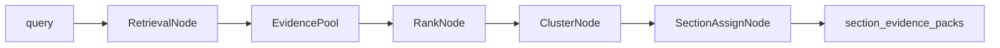
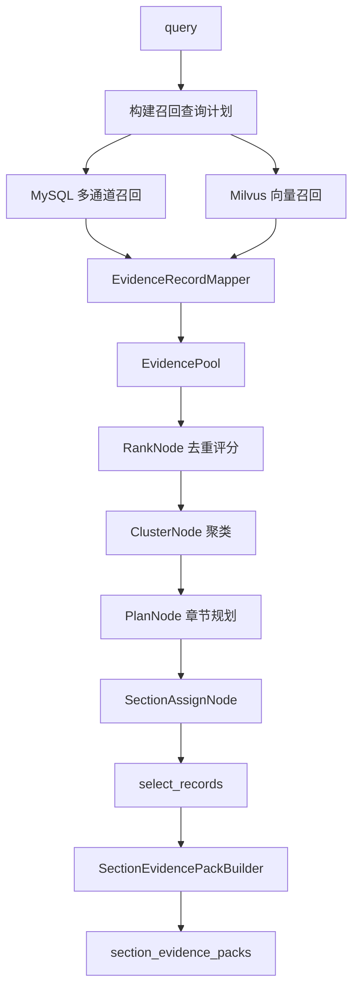
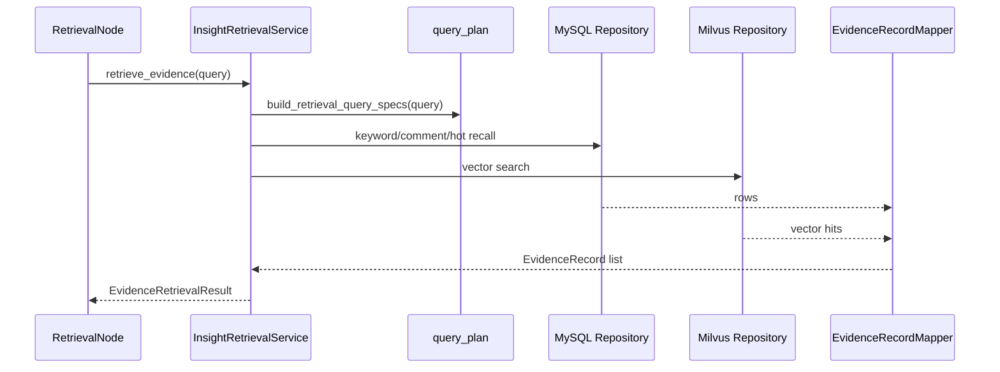
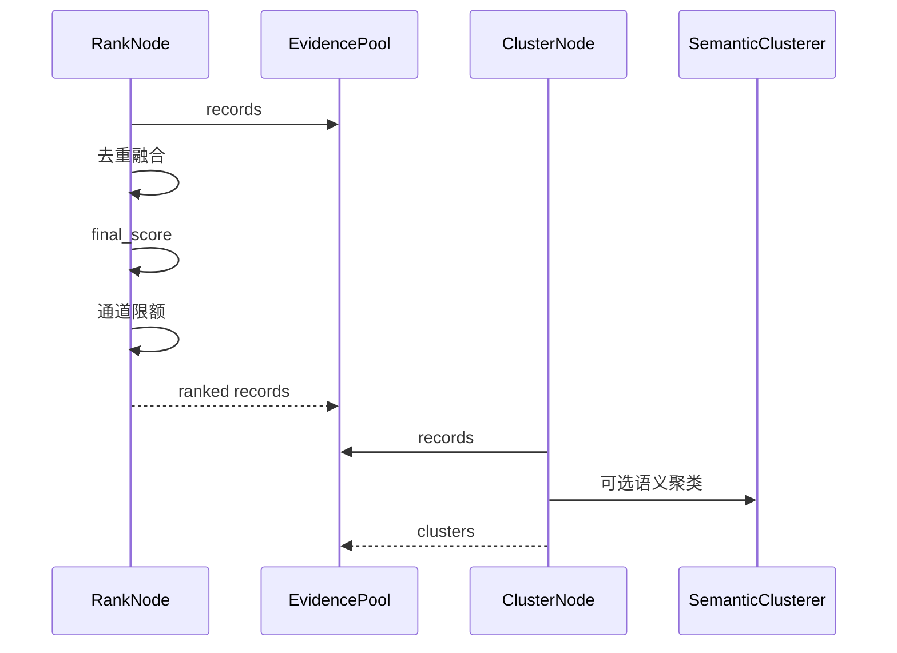
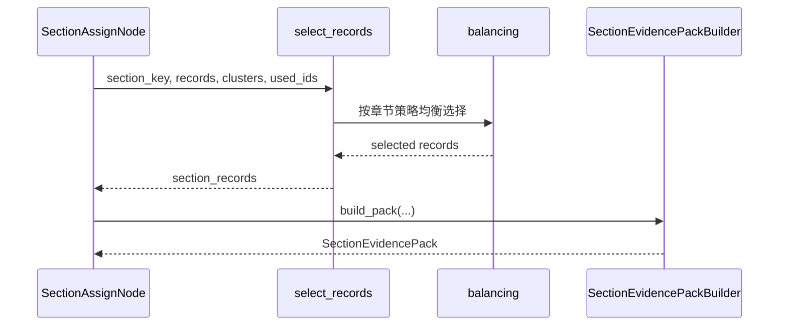
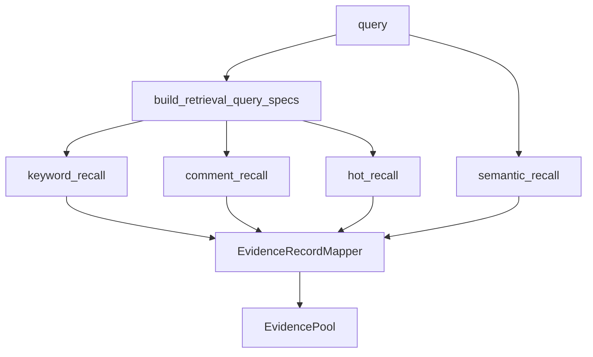
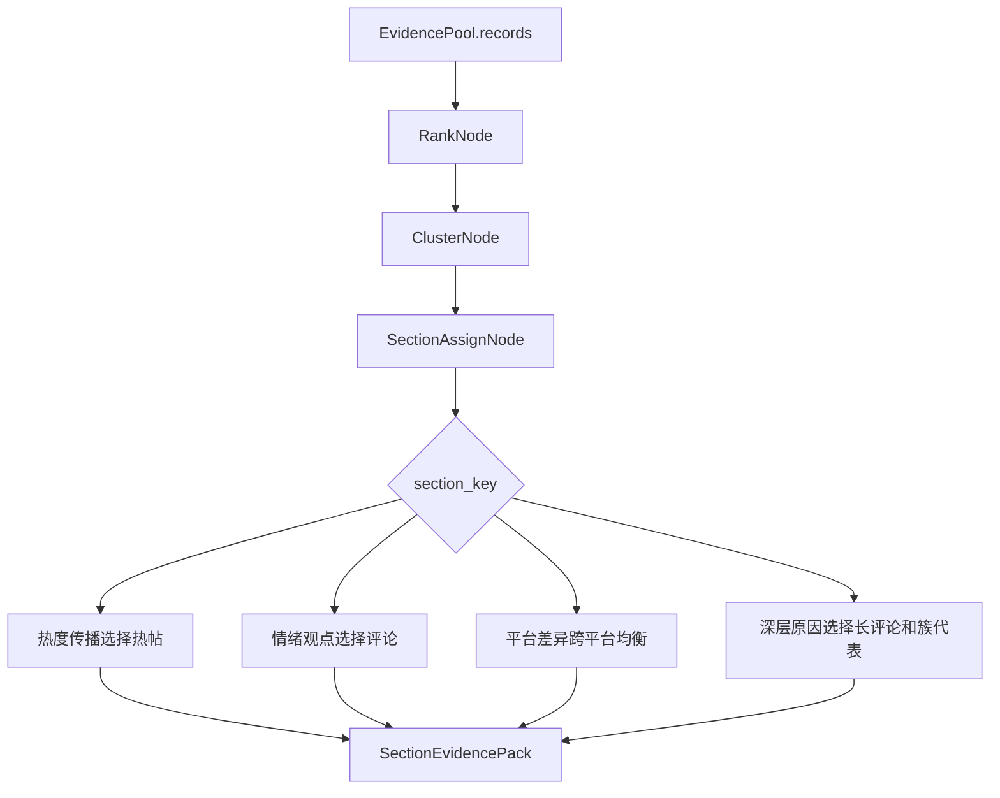
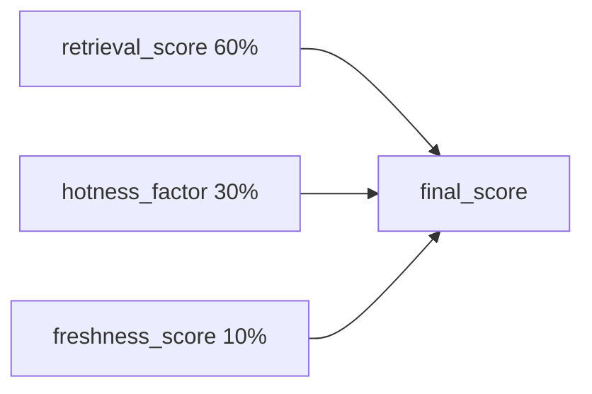

# Day03 下午：InsightAgent 证据池、召回评分、章节分配

## 1. 本节讲解范围

### 1.1 本节涉及的模块

#### 1.1.1 相关目录

上午讲了证据契约，也就是 Agent 对外交付证据时必须遵守的统一结构。

下午进入 InsightAgent 内部，讲私域舆情证据是如何被生产出来的。

相关目录：

```text
engines/insight_agent/
engines/insight_agent/retrieval/
engines/insight_agent/evidence/
engines/insight_agent/evidence/section/
engines/insight_agent/nodes/
```

#### 1.1.2 相关文件

本节重点讲：

```text
engines/insight_agent/agent.py
engines/insight_agent/graph.py
engines/insight_agent/retrieval/query_plan.py
engines/insight_agent/retrieval/retrieval_service.py
engines/insight_agent/retrieval/evidence_record_mapper.py
engines/insight_agent/nodes/retrieval_node.py
engines/insight_agent/nodes/rank_node.py
engines/insight_agent/nodes/cluster_node.py
engines/insight_agent/nodes/section_assign_node.py
engines/insight_agent/evidence/section/selectors.py
engines/insight_agent/evidence/section/balancing.py
engines/insight_agent/evidence/section/scoring.py
engines/insight_agent/evidence/section/builder.py
```

#### 1.1.3 本节范围边界

本节重点讲 InsightAgent 的证据链路。

不展开数据库 SQL 适配器细节，也不展开 Milvus 底层 schema。

本节要把这条主线讲透：

```text
用户 query
-> 多路召回
-> EvidenceRecord
-> EvidencePool
-> 去重评分
-> 聚类
-> 章节证据选择
-> SectionEvidencePack
```

### 1.2 本节要解决的问题

#### 1.2.1 核心问题

本节要解决：

```text
1. InsightAgent 为什么要先构建全局证据池
2. 为什么召回要分 keyword_recall、comment_recall、hot_recall、semantic_recall
3. 为什么召回后还要排序、去重、限额
4. 为什么要聚类
5. 为什么不同章节使用不同证据选择策略
6. SectionEvidencePack 如何为后续章节写作和 Host 研判服务
```

#### 1.2.2 理解难点

InsightAgent 不是“每个章节搜一次，然后直接写”。

它的逻辑更像研究员工作流：

```text
先把材料尽可能收集全
再清洗、去重、评分
再识别主要讨论簇
再按章节主题分配材料
最后才进入章节写作
```

这个顺序很重要。

如果一开始就让 LLM 写，模型很容易根据少量材料做过度判断。

#### 1.2.3 和上午的关系

上午讲：

```text
SectionEvidencePayload 是对外交付契约。
```

下午讲：

```text
SectionEvidencePayload 之前的 Insight 内部证据是怎么来的。
```

## 2. 本节在项目中的位置

### 2.1 全局架构定位

#### 2.1.1 当前模块属于哪一层

当前模块属于 InsightAgent 内部研究层。

它位于：

```text
engines/orchestration/research.py
-> invoke_insight_agent
-> Insight LangGraph
```

#### 2.1.2 上游模块是谁

上游是 Day02 下午讲过的研究编排层：

```text
engines/orchestration/research.py
```

它调用：

```text
invoke_insight_agent(...)
```

#### 2.1.3 下游模块是谁

下游是章节写作节点：

```text
engines/insight_agent/nodes/summarize_node.py
```

章节写作节点使用本节产出的：

```text
section_evidence_packs
```

### 2.2 当前模块的职责边界

#### 2.2.1 它负责什么

InsightAgent 证据链路负责：

```text
构建查询计划
并发召回 MySQL 和 Milvus
把原始结果映射为 EvidenceRecord
按通道去重限流
统一排序评分
构建讨论簇
按章节分配证据包
```

#### 2.2.2 它不负责什么

它不负责：

```text
MediaAgent 的 Web 搜索
HostAgent 的主持裁决
最终报告生成
前端展示
```

#### 2.2.3 为什么这样分层

InsightAgent 内部的证据处理较复杂。

如果把召回、评分、聚类、章节分配都写在一个节点里，会导致节点过大，难以讲解、测试和维护。

当前拆分方式是：

```text
RetrievalNode 负责召回
RankNode 负责去重评分
ClusterNode 负责讨论簇
SectionAssignNode 负责章节证据分配
```

### 2.3 位置流程图

#### 2.3.1 InsightAgent 图结构


#### 2.3.2 本节关注范围



#### 2.3.3 图中节点含义

`RetrievalNode` 建立全局证据池。

`RankNode` 对证据去重、融合、评分、限额。

`ClusterNode` 识别主要讨论簇。

`SectionAssignNode` 给每个章节分配不同证据。

## 3. 总体逻辑流程图

### 3.1 主流程说明

#### 3.1.1 输入从哪里来

输入来自用户研究主题：

```text
query
```

例如：

```text
高考舆情
```

它先被传入 `invoke_insight_agent()`，然后作为 LangGraph 初始状态进入 `RetrievalNode`。

#### 3.1.2 中间经过哪些步骤

完整过程：

```text
invoke_insight_agent
-> build_graph
-> RetrievalNode
-> InsightRetrievalService.retrieve_evidence
-> RankNode
-> ClusterNode
-> PlanNode
-> SectionAssignNode
-> SectionEvidencePackBuilder
```

#### 3.1.3 输出到哪里去

本节最终输出：

```text
section_evidence_packs
```

它会交给 `SummarizeNode` 写章节正文。

### 3.2 主流程图

#### 3.2.1 Mermaid 流程图



#### 3.2.2 流程图逐节点解释

查询计划负责决定搜哪些词、走哪些通道。

MySQL 召回负责拿业务主数据。

Milvus 召回负责语义相似数据。

`EvidenceRecordMapper` 把不同来源的结果统一成 `EvidenceRecord`。

`RankNode` 让证据池变干净。

`ClusterNode` 让证据具备话题结构。

`SectionAssignNode` 让每个章节拿到更适合自己的材料。

#### 3.2.3 关键转折点

第一个转折点：

```text
query -> 多路召回计划
```

第二个转折点：

```text
原始召回结果 -> EvidenceRecord
```

第三个转折点：

```text
EvidencePool.records -> 排序后的高质量证据池
```

第四个转折点：

```text
全局证据池 -> 分章节证据包
```

### 3.3 主流程中的核心判断

#### 3.3.1 正常路径

正常路径：

```text
召回成功
证据映射成功
去重评分成功
聚类成功或规则聚类兜底
章节证据分配成功
```

#### 3.3.2 分支路径

分支路径：

```text
Milvus 不启用 -> 只走 MySQL
语义聚类失败 -> 降级规则聚类
某章节证据不足 -> missing_notes 写入缺口
```

#### 3.3.3 失败路径

失败路径中，最重要的是不要让一个辅助能力拖垮主流程。

例如 Milvus 失败时：

```text
记录异常
跳过向量通道
继续使用 MySQL 证据
```

## 4. 核心数据流图

### 4.1 输入数据结构

#### 4.1.1 查询计划输入

输入是：

```text
query: str
```

查询计划会抽取关键词，并构造多个 `RetrievalQuerySpec`。

#### 4.1.2 召回结果输入

MySQL 返回数据库行。

Milvus 返回 `VectorSearchHit`。

这两类结果不能直接混用。

#### 4.1.3 统一证据输入

统一后的结构是：

```text
EvidenceRecord
```

### 4.2 中间状态变化

#### 4.2.1 RetrievalNode 后

状态写入：

```text
evidence_pool.records
evidence_pool.clusters = []
```

#### 4.2.2 RankNode 后

状态变化：

```text
records 去重
records 合并召回通道
records 写入 final_score
records 截断为最多 50 条
```

#### 4.2.3 ClusterNode 后

状态变化：

```text
records 写入 cluster_id
evidence_pool.clusters 写入讨论簇
```

#### 4.2.4 SectionAssignNode 后

状态写入：

```text
section_evidence_packs
cursor = 0
```

### 4.3 输出数据结构

#### 4.3.1 EvidencePool

`EvidencePool` 是全局证据池。

它包含：

```text
query
records
clusters
```

#### 4.3.2 EvidenceCluster

`EvidenceCluster` 是讨论簇。

它包含：

```text
id
label
summary
member_record_ids
representative_ids
size
```

#### 4.3.3 SectionEvidencePack

`SectionEvidencePack` 是章节证据包。

它包含：

```text
section_key
used_query
evidence_ids
evidence_count
evidence_sources
evidence_source_blocks
stats
representative_quotes
missing_notes
```

## 5. 核心调用链图

### 5.1 召回调用链

#### 5.1.1 调用链展开

```text
RetrievalNode.__call__
-> InsightRetrievalService.retrieve_evidence
-> build_retrieval_query_specs
-> _collect_db_evidence
-> _collect_vector_evidence
-> EvidenceRecordMapper
-> EvidenceRetrievalResult
```

#### 5.1.2 时序图



#### 5.1.3 逻辑过渡

召回阶段的目标不是写报告。

它只负责尽可能全面、可控地收集候选证据。

### 5.2 排序聚类调用链

#### 5.2.1 调用链展开

```text
RankNode
-> _dedupe_and_merge
-> _score_records
-> _select_with_source_quotas
-> ClusterNode
-> SemanticClusterer 或规则聚类
```

#### 5.2.2 时序图



#### 5.2.3 逻辑过渡

召回得到的是“候选材料”。

排序聚类后，才更接近“研究材料”。

### 5.3 章节分配调用链

#### 5.3.1 调用链展开

```text
SectionAssignNode
-> select_records
-> SECTION_SELECTORS
-> balancing helpers
-> SectionEvidencePackBuilder.build_pack
```

#### 5.3.2 时序图



#### 5.3.3 逻辑过渡

不同章节需要不同证据。

热度传播章节需要高热度主帖。

情绪观点章节需要评论。

平台差异章节需要跨平台均衡。

深层原因章节需要长评论和讨论簇代表。

## 6. 手写真实项目核心逻辑

### 6.1 为什么手写真实项目文件

#### 6.1.1 手写不是独立 Demo

InsightAgent 的价值主要体现在真实工程链路。

所以本节手写真实项目文件，不写简化 demo。

#### 6.1.2 本节手写哪些文件

本节手写：

```text
engines/insight_agent/graph.py
engines/insight_agent/retrieval/query_plan.py
engines/insight_agent/nodes/retrieval_node.py
engines/insight_agent/nodes/rank_node.py
engines/insight_agent/nodes/section_assign_node.py
```

#### 6.1.3 和项目主链路的对应关系

```text
图结构
-> 召回计划
-> 全局证据池
-> 排序评分
-> 章节证据包
```

### 6.2 手写代码一：`engines/insight_agent/graph.py`

#### 6.2.1 要实现什么

实现 InsightAgent 的 LangGraph 节点顺序。

#### 6.2.2 完整代码

完整包路径与文件名：

```text
engines/insight_agent/graph.py
```

完整代码如下：

```python
"""InsightAgent 私有舆情库研究模块：engines/insight_agent/graph.py。"""

from typing import Any

from langgraph.graph import END, START, StateGraph

from engines.insight_agent.context import InsightContext
from engines.insight_agent.nodes import (
    ClusterNode,
    FormatReportNode,
    PlanNode,
    RankNode,
    RetrievalNode,
    SaveReportNode,
    SectionAssignNode,
    SummarizeNode,
)
from engines.insight_agent.state import InsightState


def _route_after_summarize(state: InsightState) -> str:
    cursor = state.get("cursor", 0)
    return "next_section" if cursor < len(state.get("sections", [])) else "all_done"


def build_graph(ctx: InsightContext) -> Any:
    graph = StateGraph(InsightState)  # type:ignore

    graph.add_node("retrieval", RetrievalNode(ctx))  # type:ignore
    graph.add_node("rank", RankNode(ctx))  # type:ignore
    graph.add_node("cluster", ClusterNode(ctx))  # type:ignore
    graph.add_node("plan", PlanNode(ctx))  # type:ignore
    graph.add_node("section_assign", SectionAssignNode(ctx))  # type:ignore
    graph.add_node("summarize", SummarizeNode(ctx))  # type:ignore
    graph.add_node("format_report", FormatReportNode(ctx))  # type:ignore
    graph.add_node("persist_report", SaveReportNode(ctx))  # type:ignore

    graph.add_edge(START, "retrieval")
    graph.add_edge("retrieval", "rank")
    graph.add_edge("rank", "cluster")
    graph.add_edge("cluster", "plan")
    graph.add_edge("plan", "section_assign")
    graph.add_edge("section_assign", "summarize")
    graph.add_conditional_edges(
        "summarize", _route_after_summarize,
        {"next_section": "summarize", "all_done": "format_report"},
    )
    graph.add_edge("format_report", "persist_report")
    graph.add_edge("persist_report", END)

    return graph.compile()
```

#### 6.2.3 逐块解释

`retrieval -> rank -> cluster -> plan -> section_assign` 是证据准备链路。

`summarize` 是循环节点，每次写一个章节。

`_route_after_summarize()` 根据 cursor 决定继续写下一章，还是进入最终格式化。

#### 6.2.4 关键设计意图

证据准备在写作之前完成。

这是 InsightAgent 的核心结构。

### 6.3 手写代码二：`engines/insight_agent/retrieval/query_plan.py`

#### 6.3.1 要实现什么

实现多路召回查询计划。

#### 6.3.2 完整代码

完整包路径与文件名：

```text
engines/insight_agent/retrieval/query_plan.py
```

完整代码如下：

```python
"""InsightAgent 多路召回查询计划构造。"""

from __future__ import annotations

import re
from dataclasses import dataclass
from typing import Literal

RetrievalChannel = Literal["keyword_recall", "comment_recall", "hot_recall"]
MAX_RECALL_KEYWORDS = 3
KEYWORD_EXTRACT_TOP_K = 2
KEYWORD_LIMIT = 20      # 关键字 （440）
COMMENT_LIMIT = 200     # 最多评论数
HOT_CONTENT_LIMIT = 20  # 最多主贴数
HOT_RECALL_PERIOD: Literal["24h", "week", "year"] = "24h"
RAW_RECORD_LIMIT = 800


@dataclass(frozen=True)
class RetrievalQuerySpec:
    channel: RetrievalChannel
    query: str
    limit: int


def build_retrieval_query_specs(query: str) -> list[RetrievalQuerySpec]:
    # 1. 将 "原始查询" 放入召回关键字
    recall_keywords = [query]

    # 2. jieba分词
    for keyword in extract_recall_keywords(query, top_k=KEYWORD_EXTRACT_TOP_K):
        if keyword not in recall_keywords:
            recall_keywords.append(keyword)

    recall_keywords = recall_keywords[:MAX_RECALL_KEYWORDS]

    specs: list[RetrievalQuerySpec] = []

    # 3. 构建查询规格
    for keyword in recall_keywords:
        specs.append(RetrievalQuerySpec("keyword_recall", keyword, KEYWORD_LIMIT))
        specs.append(RetrievalQuerySpec("comment_recall", keyword, COMMENT_LIMIT))

    specs.append(RetrievalQuerySpec(
        "hot_recall",
        query,
        HOT_CONTENT_LIMIT,
    ))
    return specs


def extract_recall_keywords(query: str, top_k: int = 2) -> list[str]:
    try:
        import jieba.analyse

        keywords = jieba.analyse.extract_tags(query, topK=top_k)
    except ImportError:
        keywords = re.findall(r"[\u4e00-\u9fffA-Za-z0-9]{2,12}", query)[:top_k]

    cleaned_keywords: list[str] = []
    for keyword in keywords:
        keyword = keyword.strip()
        if 2 <= len(keyword) <= 12 and keyword not in cleaned_keywords:
            cleaned_keywords.append(keyword)
    return cleaned_keywords
```

#### 6.3.3 逐块解释

查询计划会把原始 query 和抽取关键词都加入召回。

每个关键词会走：

```text
keyword_recall
comment_recall
```

另外再加一条：

```text
hot_recall
```

#### 6.3.4 关键设计意图

不同通道解决不同问题。

关键字召回解决相关主题。

评论召回解决观点情绪。

热度召回解决当前高传播内容。

### 6.4 手写代码三：`engines/insight_agent/nodes/retrieval_node.py`

#### 6.4.1 要实现什么

实现全局证据池构建节点。

#### 6.4.2 完整代码

完整包路径与文件名：

```text
engines/insight_agent/nodes/retrieval_node.py
```

完整代码如下：

```python
"""InsightAgent 图节点模块。"""

from __future__ import annotations

from typing import Any

from engines.common.nodes import BaseNode
from engines.insight_agent.evidence import EvidencePool
from engines.insight_agent.retrieval import InsightRetrievalService
from engines.insight_agent.state import InsightState


class RetrievalNode(BaseNode):
    """
    全局召回节点：负责整合多渠道（向量库、传统数据库）的检索能力，
    为下游的分析研判构建统一的全局证据池（EvidencePool）。
    """
    def __init__(self, ctx) -> None:
        super().__init__(ctx)
        self.retrieval_service = InsightRetrievalService(ctx.config)

    async def __call__(self, state: InsightState) -> dict[str, Any]:
        query = state["query"]
        self.ctx.report_progress("retrieving", "正在构建全局证据池...", 8)

        result = await self.retrieval_service.retrieve_evidence(query)

        evidence_pool = EvidencePool(
            query=query,
            records=result.records,
            clusters=[],
        )

        self.ctx.report_progress("retrieving", f"全局召回完成: {len(result.records)} 条候选证据", 18)

        return {"evidence_pool": evidence_pool}
```

#### 6.4.3 逐块解释

`RetrievalNode` 不直接写 MySQL 或 Milvus 查询细节。

它把复杂召回委托给 `InsightRetrievalService`。

返回的结果写入 `EvidencePool`。

#### 6.4.4 关键设计意图

图节点保持流程清晰，复杂检索细节放到 service。

### 6.5 手写代码四：`engines/insight_agent/nodes/section_assign_node.py`

#### 6.5.1 要实现什么

实现章节证据包分配节点。

#### 6.5.2 完整代码

完整包路径与文件名：

```text
engines/insight_agent/nodes/section_assign_node.py
```

完整代码如下：

```python
"""InsightAgent 图节点模块。"""

from __future__ import annotations

from typing import Any

from engines.common.nodes import BaseNode
from engines.insight_agent.evidence.section import (
    SectionEvidencePackBuilder,
    select_records,
)
from engines.insight_agent.evidence import EvidencePool, SectionEvidencePack
from engines.insight_agent.state import (
    InsightState,
)


class SectionAssignNode(BaseNode):
    MAX_SECTION_EVIDENCE = 35

    async def __call__(self, state: InsightState) -> dict[str, Any]:
        self.ctx.report_progress("assigning", "正在为章节分配证据包...", 42)

        pool = EvidencePool(state.get("evidence_pool") or {})
        records = list(pool.get("records", []))
        clusters = list(pool.get("clusters", []))
        sections = list(state.get("sections", []))
        used_query = pool.get("query", "")
        used_ids: set[str] = set()
        builder = SectionEvidencePackBuilder(self.ctx.config.SEARCH_CONTENT_MAX_LENGTH)

        packs: list[SectionEvidencePack] = []

        for index, section in enumerate(sections):
            section_key = section["section_key"]
            section_records = select_records(section_key, records, clusters, used_ids)[: self.MAX_SECTION_EVIDENCE]
            used_ids.update(record.get("id", "") for record in section_records if record.get("id"))

            packs.append(builder.build_pack(section_key, section_records, records, clusters, used_query))

        self.ctx.report_progress("assigning", "章节证据包分配完成", 48)
        return {"sections": sections, "section_evidence_packs": packs, "cursor": 0}
```

#### 6.5.3 逐块解释

`used_ids` 用来减少不同章节之间的证据重复。

`select_records()` 按章节类型选择证据。

`SectionEvidencePackBuilder` 把选中的证据构造成章节证据包。

#### 6.5.4 关键设计意图

每个章节都应该有自己的证据重点。

不是所有章节共享同一批高分证据。

## 7. 手写逻辑执行流程图

### 7.1 多路召回流程

#### 7.1.1 第一步执行什么

根据 query 构造召回计划。

#### 7.1.2 第二步执行什么

并发执行 MySQL 和 Milvus 召回。

#### 7.1.3 最终得到什么

得到 `EvidenceRecord` 列表。

### 7.2 证据池整理流程

#### 7.2.1 第一步执行什么

RankNode 去重融合。

#### 7.2.2 第二步执行什么

计算 `final_score`。

#### 7.2.3 最终得到什么

得到最多 50 条高质量证据。

### 7.3 章节分配流程

#### 7.3.1 第一步执行什么

根据章节 `section_key` 选择策略。

#### 7.3.2 第二步执行什么

按平台、类型、簇进行均衡。

#### 7.3.3 最终得到什么

得到每个章节自己的 `SectionEvidencePack`。

### 7.4 手写流程图

#### 7.4.1 检索到证据池



#### 7.4.2 证据池到章节包



#### 7.4.3 评分组成



## 8. 项目源码解读

### 8.1 文件一：`engines/insight_agent/retrieval/retrieval_service.py`

#### 8.1.1 文件职责

编排 MySQL 和 Milvus 多路召回。

#### 8.1.2 为什么需要这个文件

检索逻辑很复杂，不适合直接写在 LangGraph 节点里。

#### 8.1.3 上游调用者

```text
RetrievalNode
```

#### 8.1.4 下游依赖

```text
InsightSearchRepository
InsightVectorRepository
EvidenceRecordMapper
```

#### 8.1.5 完整源码

完整包路径与文件名：

```text
engines/insight_agent/retrieval/retrieval_service.py
```

完整代码如下：

```python
"""InsightAgent 多路召回编排服务。"""

from __future__ import annotations

import asyncio
import logging
from dataclasses import dataclass

from engines.contracts.config import Settings
from engines.insight_agent.evidence import EvidenceRecord
from engines.insight_agent.retrieval.evidence_record_mapper import EvidenceRecordMapper
from engines.insight_agent.retrieval.query_plan import (
    HOT_RECALL_PERIOD,
    RAW_RECORD_LIMIT,
    RetrievalQuerySpec,
    build_retrieval_query_specs,
)
from engines.insight_agent.tools.db_search.models import InsightSearchResponse
from engines.insight_agent.tools.db_search.repository import InsightSearchRepository
from engines.insight_agent.tools.vector_search import InsightVectorRepository
from engines.insight_agent.tools.vector_search.models import VectorSearchHit
from engines.insight_agent.tools.vector_search.search_filters import build_published_after_expr

logger = logging.getLogger(__name__)


@dataclass
class EvidenceRetrievalResult:
    """统一承载多路召回后的证据与诊断统计。"""

    records: list[EvidenceRecord]


class InsightRetrievalService:
    """编排 MySQL 与 Milvus 多路召回，避免图节点承担过多检索细节。"""

    def __init__(self, config: Settings) -> None:
        self.config = config
        self.insight_search_repository = InsightSearchRepository()
        self.insight_vector_repository = InsightVectorRepository(config)
        self.evidence_record_mapper = EvidenceRecordMapper()

    async def retrieve_evidence(self, query: str) -> EvidenceRetrievalResult:

        # 1. 构建查询规格
        query_specs = build_retrieval_query_specs(query)

        # 2. 从MySQL收集证据
        db_task = asyncio.create_task(self._collect_db_evidence(query_specs))

        # 3. 从Milvus收集证据
        vector_task = asyncio.create_task(self._collect_vector_evidence(query))

        # 4. 等二路任务收集完成
        db_records, vector_records = await asyncio.gather(db_task, vector_task)

        # 5. MySQL 是业务主召回，重复证据限流时优先保留 MySQL 结果
        all_records = [*db_records, *vector_records]
        limited_records = _limit_records_by_channel(all_records, RAW_RECORD_LIMIT)

        return EvidenceRetrievalResult(
            records=limited_records,
        )

    async def _collect_db_evidence(
            self,
            query_specs: list[RetrievalQuerySpec],
    ) -> list[EvidenceRecord]:

        # 1. 初始化信号量(防止MySQL连接不可用)
        semaphore = asyncio.Semaphore(3)


        # 2. 三通道检索
        tasks = [self._run_db_search_with_limit(spec, semaphore) for spec in query_specs]

        results = await asyncio.gather(*tasks)

        # 3. 封装证据结果
        records: list[EvidenceRecord] = []
        for spec, response in results:
            rows = response.search_results or []
            records.extend(self.evidence_record_mapper.map_db_records(rows, spec.channel, spec.query))

        return records

    async def _collect_vector_evidence(
            self,
            query: str,
    ) -> list[EvidenceRecord]:
        if not self.config.INSIGHT_VECTOR_ENABLED:
            return []
        try:
            vector_hits = await asyncio.to_thread(self._run_vector_search, query)
        except Exception:
            logger.exception("[insight] Milvus 向量召回失败，跳过向量通道")
            return []

        return self.evidence_record_mapper.map_vector_hits(vector_hits, query)

    async def _run_db_search_with_limit(
            self,
            spec: RetrievalQuerySpec,
            semaphore: asyncio.Semaphore,
    ) -> tuple[RetrievalQuerySpec, InsightSearchResponse]:
        """
        限速执行 MySQL查询
        """
        async with semaphore:
            return spec, await self._run_db_search(spec)

    async def _run_db_search(self, spec: RetrievalQuerySpec) -> InsightSearchResponse:
        db = self.insight_search_repository

        match spec.channel:
            case "keyword_recall":
                response = await db.keyword_recall(spec.query, limit=spec.limit)
            case "comment_recall":
                response = await db.comment_recall(spec.query, limit=spec.limit)
            case "hot_recall":
                response = await db.hot_recall(
                    time_period=HOT_RECALL_PERIOD,
                    limit=spec.limit,
                )
            case _:
                raise ValueError(f"不支持检索通道: {spec.channel}")

        return response

    def _run_vector_search(self, query: str) -> list[VectorSearchHit]:

        return self.insight_vector_repository.search(
            query,
            limit=self.config.INSIGHT_VECTOR_TOP_K,
            filter_expr=self._build_vector_filter_expr(),
        )

    def _build_vector_filter_expr(self) -> str | None:
        return build_published_after_expr(self.config.INSIGHT_VECTOR_FILTER_DAYS)


def _limit_records_by_channel(records: list[EvidenceRecord], limit: int) -> list[EvidenceRecord]:
    """按证据 ID 去重后，再按召回通道均衡截断。"""
    if limit <= 0:
        return []

    buckets: dict[str, list[EvidenceRecord]] = {}
    channel_order: list[str] = []
    seen_ids: set[str] = set()
    for record in records:
        record_id = record["id"]
        if record_id in seen_ids:
            continue
        seen_ids.add(record_id)

        channel = _record_channel(record)
        if channel not in buckets:
            buckets[channel] = []
            channel_order.append(channel)
        buckets[channel].append(record)

    if sum(len(bucket) for bucket in buckets.values()) <= limit:
        return [record for bucket in buckets.values() for record in bucket]

    order_index = {channel: index for index, channel in enumerate(channel_order)}
    channel_order = sorted(
        channel_order,
        key=lambda channel: (_channel_priority(channel), order_index[channel]),
    )

    selected: list[EvidenceRecord] = []

    max_bucket_size = max(len(bucket) for bucket in buckets.values())
    for index in range(max_bucket_size):
        for channel in channel_order:
            bucket = buckets[channel]
            if index >= len(bucket):
                continue
            selected.append(bucket[index])
            if len(selected) >= limit:
                return selected

    return selected


def _record_channel(record: EvidenceRecord) -> str:
    retrieval = record.get("retrieval", {}) or {}
    channels = list(retrieval.get("channels", []) or [])
    return channels[0] if channels else "unknown"


def _channel_priority(channel: str) -> int:
    priorities = {
        "keyword_recall": 0,
        "comment_recall": 1,
        "hot_recall": 2,
        "semantic_recall": 3,
    }
    return priorities.get(channel, len(priorities))
```

#### 8.1.6 代码逐块解释

`retrieve_evidence()` 同时启动数据库召回和向量召回。

`_collect_db_evidence()` 内部又对多个查询规格并发执行，但用信号量限制并发数。

`_collect_vector_evidence()` 把同步向量搜索放到线程里执行。

`_limit_records_by_channel()` 保证多通道结果不要被单一通道挤满。

#### 8.1.7 关键设计意图

召回阶段追求“覆盖”，但要可控。

既不能只依赖单一来源，也不能无限制拉取。

#### 8.1.8 如果不这样设计会怎样

如果不分通道，证据池可能被热度内容占满。

如果不限制召回数量，后续排序、聚类和 prompt 都会变重。

### 8.2 文件二：`engines/insight_agent/nodes/rank_node.py`

#### 8.2.1 文件职责

对证据池去重、融合、评分、限额。

#### 8.2.2 为什么需要这个文件

多路召回会产生重复内容，也会产生质量差异。

排序节点把候选证据变成更可靠的研究材料。

#### 8.2.3 上游调用者

```text
Insight graph: retrieval -> rank
```

#### 8.2.4 下游依赖

```text
ClusterNode
SectionAssignNode
```

#### 8.2.5 完整源码

完整包路径与文件名：

```text
engines/insight_agent/nodes/rank_node.py
```

完整代码如下：

```python
"""InsightAgent 图节点模块。"""

from __future__ import annotations

from datetime import datetime
from typing import Any

from engines.common.nodes import BaseNode
from engines.insight_agent.evidence import EvidencePool, EvidenceRecord
from engines.insight_agent.state import InsightState


class RankNode(BaseNode):
    MAX_EVIDENCE_RECORDS = 50  # 总计返回50条
    SOURCE_QUOTAS = {
        "keyword_recall": 22,  # 关键字通道 最少找22
        "comment_recall": 14,  # 评论通道  最少找14
        "semantic_recall": 10,  # 语义通道  最少找10
        "hot_recall": 4,  # 热度值通道  最少找4
    }

    async def __call__(self, state: InsightState) -> dict[str, Any]:
        self.ctx.report_progress("ranking", "正在去重并统一证据排序...", 20)

        pool = EvidencePool(state["evidence_pool"])
        records = pool["records"]

        merged = self._dedupe_and_merge(records)
        scored = self._score_records(merged)

        ranked = self._select_with_source_quotas(scored)

        pool["records"] = ranked

        self.ctx.report_progress("ranking", f"证据池排序完成: {len(ranked)} 条有效证据", 28)
        return {"evidence_pool": pool}

    @staticmethod
    def _dedupe_and_merge(records: list[EvidenceRecord]) -> list[EvidenceRecord]:
        merged: dict[str, EvidenceRecord] = {}
        content_index: dict[str, str] = {}

        for record in records:
            content_key = _content_key(record)
            record_id = record["id"]

            # 查索引：如果指纹出现过，拿老ID；没出现过，用当前ID
            existing_id = content_index.get(content_key, record_id)

            # 新记录：直接存入并更新索引
            if existing_id not in merged:
                merged[existing_id] = EvidenceRecord(record)
                content_index[content_key] = existing_id
                continue

            # 重复记录：核心融合逻辑（求并集、取最高分）
            existing = merged[existing_id]

            existing["retrieval"] = _merge_retrieval_meta(existing, record)
            existing["hotness_score"] = max(_hotness_score(existing), _hotness_score(record))

        return list(merged.values())

    @staticmethod
    def _score_records(records: list[EvidenceRecord]) -> list[EvidenceRecord]:
        if not records:
            return []

        max_hotness = max([_hotness_score(r) for r in records]) or 1.0
        latest_ts = max([_parse_timestamp(r["published_at"]) for r in records]) or 0.0

        for record in records:
            # 1. 相关性得分
            retrieval_score = _retrieval_score(record)

            # 2. 热度值得分(归一化)
            hotness_score = _hotness_score(record)
            hotness_factor = hotness_score / max_hotness

            # 3. 新鲜度得分
            freshness_score = _freshness_score(record["published_at"], latest_ts)

            record["hotness_score"] = hotness_score

            # 最终权重：相关性 60% + 热度 30% + 新鲜度 10%
            record["final_score"] = retrieval_score * 0.60 + hotness_factor * 0.30 + freshness_score * 0.10

        return records

    def _select_with_source_quotas(self, records: list[EvidenceRecord]) -> list[EvidenceRecord]:

        # 1. 根据final_score降序
        ranked = sorted(records, key=lambda item: item["final_score"], reverse=True)
        selected: list[EvidenceRecord] = []
        selected_ids: set[str] = set()

        # 2.  先获取各个通道的记录
        for bucket, quota in self.SOURCE_QUOTAS.items():
            bucket_records = [record for record in ranked if _source_bucket(record) == bucket]
            for record in bucket_records[:quota]:
                selected.append(record)
                selected_ids.add(record["id"])

        # 3. 如果没有达到最低记录 其它通道的高质量数据填充
        if len(selected) < self.MAX_EVIDENCE_RECORDS:
            for record in ranked:
                if record["id"] in selected_ids:
                    continue
                selected.append(record)
                selected_ids.add(record["id"])
                if len(selected) >= self.MAX_EVIDENCE_RECORDS:
                    break

         # 4. 重新排名
        return sorted(selected, key=lambda item: item["final_score"], reverse=True)[:self.MAX_EVIDENCE_RECORDS]


def _content_key(record: EvidenceRecord) -> str:
    return f"content:{record['platform']}:{record['content'].strip()[:200]}"


def _hotness_score(record: EvidenceRecord) -> float:
    return float(record.get("hotness_score", 0.0) or 0.0)


def _merge_retrieval_meta(left: EvidenceRecord, right: EvidenceRecord) -> dict[str, Any]:
    left_meta = _retrieval_meta(left)
    right_meta = _retrieval_meta(right)
    scores = dict(left_meta["scores"])
    for key, value in right_meta["scores"].items():
        scores[key] = max(float(value or 0.0), float(scores.get(key, 0.0) or 0.0))

    return {
        "matched_queries": sorted(set(left_meta["matched_queries"] + right_meta["matched_queries"])),
        "channels": sorted(set(left_meta["channels"] + right_meta["channels"])),
        "scores": scores,
    }


def _retrieval_meta(record: EvidenceRecord) -> dict[str, Any]:
    meta = record.get("retrieval", {}) or {}
    scores = meta.get("scores", {}) or {}
    return {
        "matched_queries": list(meta.get("matched_queries", []) or []),
        "channels": list(meta.get("channels", []) or []),
        "scores": {str(key): float(value or 0.0) for key, value in scores.items()},
    }


def _retrieval_score(record: EvidenceRecord) -> float:
    # 同一条证据在各个渠道（通道）的最高分
    retrieval = _retrieval_meta(record)
    scores = retrieval["scores"]
    channels = set(retrieval["channels"])
    score = 0.0

    # 纯净的打分逻辑，假设向量分数本身已经归一化（0~1）
    if "semantic_recall" in channels:
        score += 0.55 * scores.get("semantic_recall", 0)
    if "keyword_recall" in channels:
        score += 0.45 * scores.get("keyword_recall", 1.0)
    if "comment_recall" in channels:
        score += 0.40 * scores.get("comment_recall", 1.0)
    if "hot_recall" in channels:
        score += 0.20 * scores.get("hot_recall", 1.0)

    return min(score or _best_retrieval_score(scores), 1.0)


def _best_retrieval_score(scores: dict[str, float]) -> float:
    return max(scores.values(), default=0.0)


def _source_bucket(record: EvidenceRecord) -> str:
    channels = set(_retrieval_meta(record)["channels"])
    if "keyword_recall" in channels:
        return "keyword_recall"
    if "comment_recall" in channels:
        return "comment_recall"
    if "semantic_recall" in channels:
        return "semantic_recall"
    if "hot_recall" in channels:
        return "hot_recall"
    return "other"


def _freshness_score(value: str, latest_ts: float) -> float:
    ts = _parse_timestamp(value)
    age_days = (latest_ts - ts) / 86400

    # 30天内线性衰减
    return max(0.0, 1.0 - (age_days / 30))


def _parse_timestamp(value: str) -> float:
    # 标准的年、月、日、时、分、秒格式 "YYYY-MM-DD HH:MM:SS" 加起来（包含横杠、空格和冒号）刚好是 19 个字符
    try:
        return datetime.strptime(value[:19], "%Y-%m-%d %H:%M:%S").timestamp()
    except (TypeError, ValueError):
        return 0.0
```

#### 8.2.6 代码逐块解释

`_dedupe_and_merge()` 解决重复证据。

`_score_records()` 计算最终分。

`_select_with_source_quotas()` 保证不同召回通道都有代表。

#### 8.2.7 关键设计意图

证据排序不是只看热度。

它综合：

```text
相关性 60%
热度 30%
新鲜度 10%
```

#### 8.2.8 如果不这样设计会怎样

只看热度会偏向爆款内容。

只看相关性可能忽略传播影响。

只看新鲜度可能忽略真正重要的旧内容。

### 8.3 文件三：`engines/insight_agent/evidence/section/selectors.py`

#### 8.3.1 文件职责

按章节维度选择证据记录。

#### 8.3.2 为什么需要这个文件

不同章节的问题不一样，不能共用同一种证据选择规则。

#### 8.3.3 上游调用者

```text
SectionAssignNode
```

#### 8.3.4 下游依赖

```text
SectionEvidencePackBuilder
```

#### 8.3.5 完整源码

完整包路径与文件名：

```text
engines/insight_agent/evidence/section/selectors.py
```

完整代码如下：

```python
"""InsightAgent 按章节维度选择证据记录。"""

from __future__ import annotations

from typing import Callable

from engines.insight_agent.evidence import EvidenceCluster, EvidenceRecord
from engines.insight_agent.evidence.section.scoring import (
    comment_quality,
    deep_signal_score,
    final_score,
    heat_score,
)
from engines.insight_agent.evidence.section.balancing import (
    balanced_by_cluster,
    balanced_by_platform,
    balanced_by_platform_and_type,
    cluster_representatives,
    prefer_unused,
)

SectionSelector = Callable[[list[EvidenceRecord], list[EvidenceCluster]], list[EvidenceRecord]]


def select_records(
    section_key: str,
    records: list[EvidenceRecord],
    clusters: list[EvidenceCluster],
    used_ids: set[str],
) -> list[EvidenceRecord]:
    if not records:
        return []

    selector = SECTION_SELECTORS.get(section_key, select_background)
    candidates = selector(records, clusters)

    return prefer_unused(candidates, used_ids)


def select_heat(records: list[EvidenceRecord], clusters: list[EvidenceCluster]) -> list[EvidenceRecord]:
    posts = [record for record in records if record.get("record_type") == "post"]
    base = posts or records
    by_platform = balanced_by_platform(
        base,
        per_platform=8,
        sort_key=heat_score,
    )
    hot_ranked = sorted(base, key=heat_score, reverse=True)
    return by_platform + hot_ranked


def select_sentiment(
    records: list[EvidenceRecord],
    clusters: list[EvidenceCluster],
) -> list[EvidenceRecord]:
    comments = [record for record in records if record.get("record_type") == "comment"]
    base = comments or records
    cluster_balanced = balanced_by_cluster(base, clusters, per_cluster=6, sort_key=comment_quality)
    quote_ranked = sorted(base, key=comment_quality, reverse=True)
    return cluster_balanced + quote_ranked


def select_platform_diff(
    records: list[EvidenceRecord], clusters: list[EvidenceCluster]
) -> list[EvidenceRecord]:
    platform_balanced = balanced_by_platform_and_type(records, per_bucket=6, sort_key=final_score)
    platform_top = balanced_by_platform(records, per_platform=10, sort_key=final_score)
    return platform_balanced + platform_top


def select_deep_causes(
    records: list[EvidenceRecord],
    clusters: list[EvidenceCluster],
) -> list[EvidenceRecord]:
    comments = [record for record in records if record.get("record_type") == "comment"]
    base = comments or records
    cluster_reps = cluster_representatives(base, clusters, per_cluster=4)
    long_comments = sorted(base, key=deep_signal_score, reverse=True)
    return cluster_reps + long_comments


def select_background(
    records: list[EvidenceRecord],
    clusters: list[EvidenceCluster],
) -> list[EvidenceRecord]:
    posts = [record for record in records if record.get("record_type") == "post"]
    early = sorted(records, key=lambda r: r.get("published_at", ""))[:8]
    cluster_reps = cluster_representatives(records, clusters, per_cluster=2)
    ranked_posts = sorted(posts or records, key=final_score, reverse=True)
    return cluster_reps + early + ranked_posts


SECTION_SELECTORS: dict[str, SectionSelector] = {
    "heat_and_spread": select_heat,
    "sentiment_and_opinion": select_sentiment,
    "platform_and_group_diff": select_platform_diff,
    "deep_causes_and_impact": select_deep_causes,
}
```

#### 8.3.6 代码逐块解释

`heat_and_spread` 优先热度内容。

`sentiment_and_opinion` 优先评论。

`platform_and_group_diff` 强调平台和类型均衡。

`deep_causes_and_impact` 优先簇代表和深度评论。

#### 8.3.7 关键设计意图

章节证据选择要服务章节目标。

不是所有章节都拿最高分内容。

#### 8.3.8 如果不这样设计会怎样

所有章节会使用相似证据，报告会重复，维度区分也会变弱。

### 8.4 文件四：`engines/insight_agent/evidence/section/builder.py`

#### 8.4.1 文件职责

把选中的证据构造成章节证据包。

#### 8.4.2 为什么需要这个文件

章节写作和 Host 研判都需要结构化证据摘要，而不是原始记录列表。

#### 8.4.3 上游调用者

```text
SectionAssignNode
```

#### 8.4.4 下游依赖

```text
SummarizeNode
build_section_ready_evidence
```

#### 8.4.5 完整源码

完整包路径与文件名：

```text
engines/insight_agent/evidence/section/builder.py
```

完整代码如下：

```python
"""InsightAgent 章节证据包构建。"""

from __future__ import annotations

from collections import Counter
from typing import Any

from engines.insight_agent.evidence import EvidenceCluster, EvidenceRecord, SectionEvidencePack
from engines.insight_agent.evidence.section.sources import (
    build_evidence_source_blocks,
    build_evidence_sources,
    build_representative_quotes,
)


class SectionEvidencePackBuilder:
    def __init__(self, search_content_max_length: int) -> None:
        self.search_content_max_length = search_content_max_length

    def build_pack(
        self,
        section_key: str,
        selected: list[EvidenceRecord],
        all_records: list[EvidenceRecord],
        clusters: list[EvidenceCluster],
        used_query: str,
    ) -> SectionEvidencePack:
        evidence_source_blocks = build_evidence_source_blocks(selected, self.search_content_max_length)
        return SectionEvidencePack(
            section_key=section_key,
            used_query=used_query,
            evidence_ids=[record.get("id", "") for record in selected if record.get("id")],
            evidence_count=len(selected),
            evidence_sources=build_evidence_sources(selected),
            evidence_source_blocks=evidence_source_blocks,
            stats=build_section_pack_stats(selected, clusters),
            representative_quotes=build_representative_quotes(section_key, selected),
            missing_notes=build_missing_notes(section_key, selected, all_records, clusters),
        )


def build_section_pack_stats(
    records: list[EvidenceRecord],
    clusters: list[EvidenceCluster],
) -> dict[str, Any]:
    cluster_counts = Counter(r.get("cluster_id", "") for r in records if r.get("cluster_id"))
    cluster_labels = {cluster.get("id", ""): cluster.get("label", "") for cluster in clusters}
    top_clusters = [
        {"cluster_id": cluster_id, "label": cluster_labels.get(cluster_id, cluster_id), "count": count}
        for cluster_id, count in cluster_counts.most_common(8)
    ]
    return {
        "platform_counts": dict(Counter(record.get("platform", "") for record in records if record.get("platform"))),
        "record_type_counts": dict(Counter(
            record.get("record_type", "") for record in records if record.get("record_type")
        )),
        "top_clusters": top_clusters,
    }


def build_missing_notes(
    section_key: str,
    selected: list[EvidenceRecord],
    all_records: list[EvidenceRecord],
    clusters: list[EvidenceCluster],
) -> list[str]:
    notes: list[str] = []
    if not selected:
        return ["该章节没有可用证据。"]

    selected_platforms = {record.get("platform", "") for record in selected if record.get("platform")}
    all_platforms = {record.get("platform", "") for record in all_records if record.get("platform")}
    if section_key == "platform_and_group_diff" and len(selected_platforms) < len(all_platforms):
        notes.append("部分平台在本章节证据中覆盖不足。")

    if section_key in {"sentiment_and_opinion", "deep_causes_and_impact"}:
        comment_count = sum(1 for record in selected if record.get("record_type") == "comment")
        if comment_count < max(3, len(selected) // 3):
            notes.append("评论型证据偏少，情绪和深层分析需保留谨慎。")

    if clusters and len({record.get("cluster_id", "") for record in selected if record.get("cluster_id")}) < min(3, len(clusters)):
        notes.append("讨论簇覆盖有限，本章节可能偏向少数高频话题。")
    return notes
```

#### 8.4.6 代码逐块解释

`build_pack()` 输出章节证据包。

`build_section_pack_stats()` 统计平台、类型和讨论簇。

`build_missing_notes()` 判断章节证据缺口。

#### 8.4.7 关键设计意图

章节证据包既给 LLM 写作使用，也给后续 Host 研判提供结构化依据。

#### 8.4.8 如果不这样设计会怎样

后续只能把原始材料直接塞给 LLM，缺少可解释的证据摘要。

## 9. 关键对象与状态拆解

### 9.1 核心对象一：`RetrievalQuerySpec`

#### 9.1.1 对象定义

单个召回任务规格。

#### 9.1.2 字段含义

```text
channel  召回通道
query    召回关键词
limit    返回数量
```

#### 9.1.3 生命周期

由 `build_retrieval_query_specs()` 创建。

由 `InsightRetrievalService` 消费。

### 9.2 核心对象二：`EvidencePool`

#### 9.2.1 对象定义

InsightAgent 的全局证据池。

#### 9.2.2 字段含义

```text
query
records
clusters
```

#### 9.2.3 生命周期

创建于 `RetrievalNode`。

更新于 `RankNode` 和 `ClusterNode`。

消费于 `SectionAssignNode`。

### 9.3 核心对象三：`SectionEvidencePack`

#### 9.3.1 对象定义

章节证据包。

#### 9.3.2 字段含义

```text
evidence_ids
evidence_count
evidence_sources
evidence_source_blocks
stats
representative_quotes
missing_notes
```

#### 9.3.3 生命周期

创建于 `SectionAssignNode`。

消费于 `SummarizeNode`。

最终转换成上午讲过的 `SectionEvidencePayload`。

## 10. 边界情况与异常分支

### 10.1 Milvus 不可用

#### 10.1.1 什么情况下发生

向量库未启用、连接失败、检索失败。

#### 10.1.2 代码如何处理

`_collect_vector_evidence()` 捕获异常并返回空列表。

#### 10.1.3 为什么这样处理

向量召回是增强能力，不应阻塞 MySQL 主召回。

### 10.2 召回结果重复

#### 10.2.1 什么情况下发生

同一内容可能同时被关键字召回、评论召回、语义召回命中。

#### 10.2.2 代码如何处理

`RankNode._dedupe_and_merge()` 根据内容指纹去重，并合并 retrieval 元信息。

#### 10.2.3 为什么这样处理

重复命中不是坏事。

它说明证据在多个通道都有相关性。

所以不是简单删除，而是合并召回信息。

### 10.3 某章节证据不足

#### 10.3.1 什么情况下发生

某一维度没有足够评论、平台覆盖不足、讨论簇覆盖不足。

#### 10.3.2 代码如何处理

`build_missing_notes()` 生成缺口说明。

#### 10.3.3 为什么这样处理

证据不足也要显式进入后续报告。

这会影响 HostAgent 的“证据强度与数据缺口”判断。

## 11. 本节代码在完整链路中的作用

### 11.1 本节之前发生了什么

#### 11.1.1 上一段链路输出

Day03 上午已经定义了对外交付的证据契约。

#### 11.1.2 本节接收的数据

本节接收用户 query 和私域数据源。

#### 11.1.3 本节开始的条件

InsightAgent 已经被 `engines/orchestration/research.py` 启动。

### 11.2 本节推进了什么

#### 11.2.1 推进了哪一步业务

本节把原始私域数据推进成章节证据包。

#### 11.2.2 改变了哪些状态

改变：

```text
evidence_pool.records
evidence_pool.clusters
section_evidence_packs
cursor
```

#### 11.2.3 产出了哪些结果

产出：

```text
排序后的 EvidenceRecord
讨论簇 EvidenceCluster
章节证据包 SectionEvidencePack
```

### 11.3 本节之后交给谁

#### 11.3.1 下游模块

下游是：

```text
engines/insight_agent/nodes/summarize_node.py
```

#### 11.3.2 下游输入

下游输入：

```text
sections
section_evidence_packs
cursor
```

#### 11.3.3 下一节课如何衔接

下一节可以继续讲：

```text
InsightAgent 如何基于 SectionEvidencePack 写章节
如何发布 SectionReadyEvent
如何把结果交给 HostAgent
```

也可以转向 MediaAgent，讲公开媒体侧如何用搜索结果构建证据。
