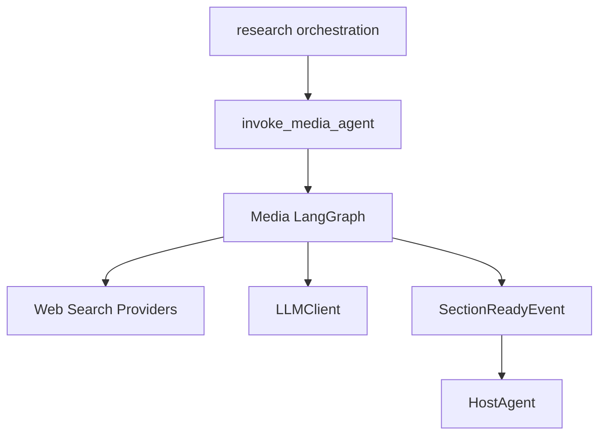
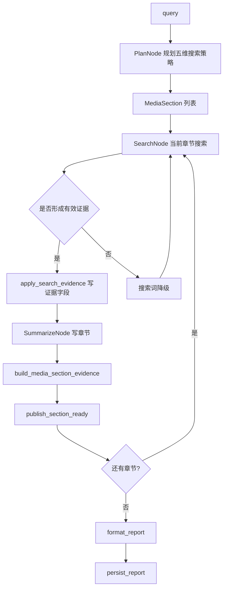
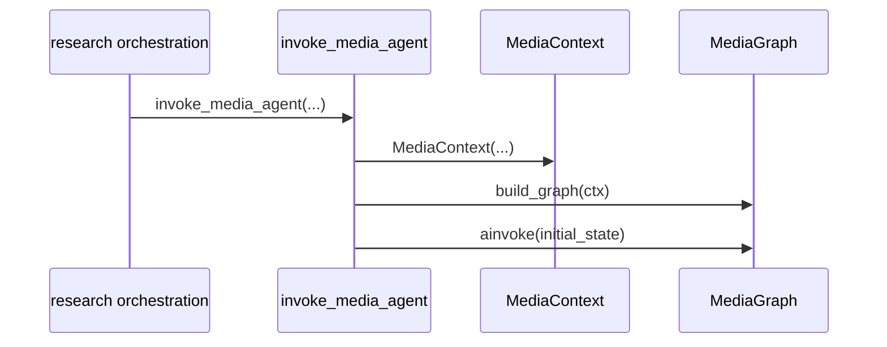
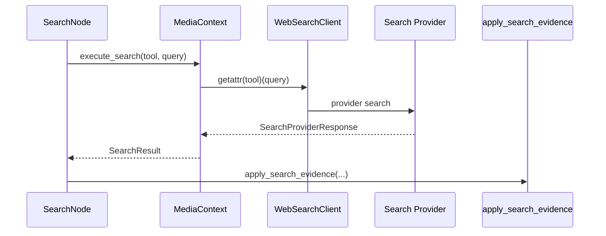
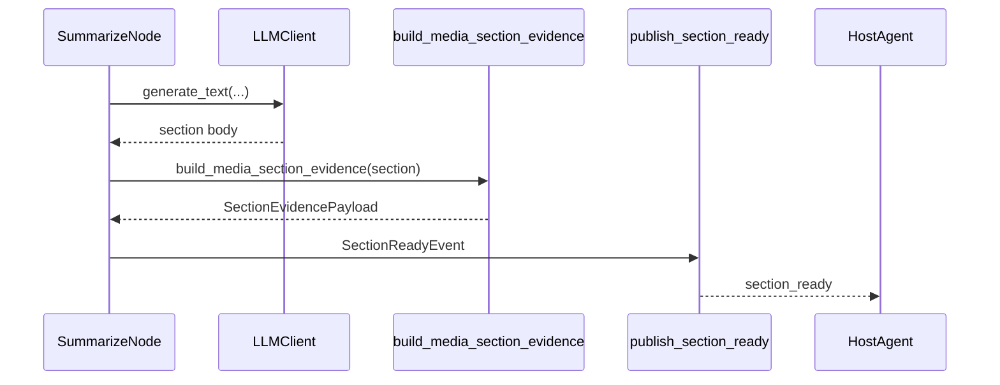
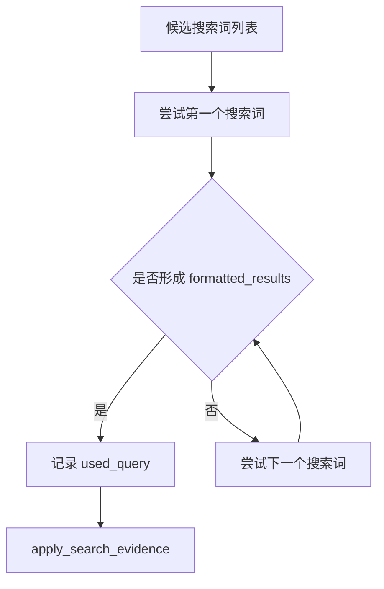
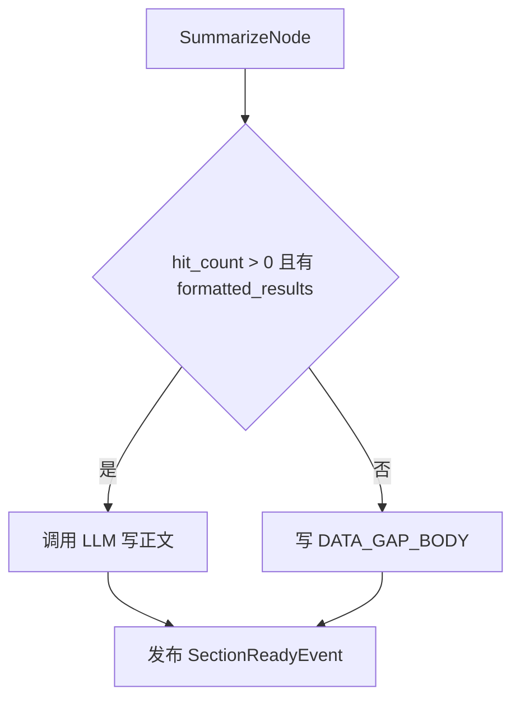
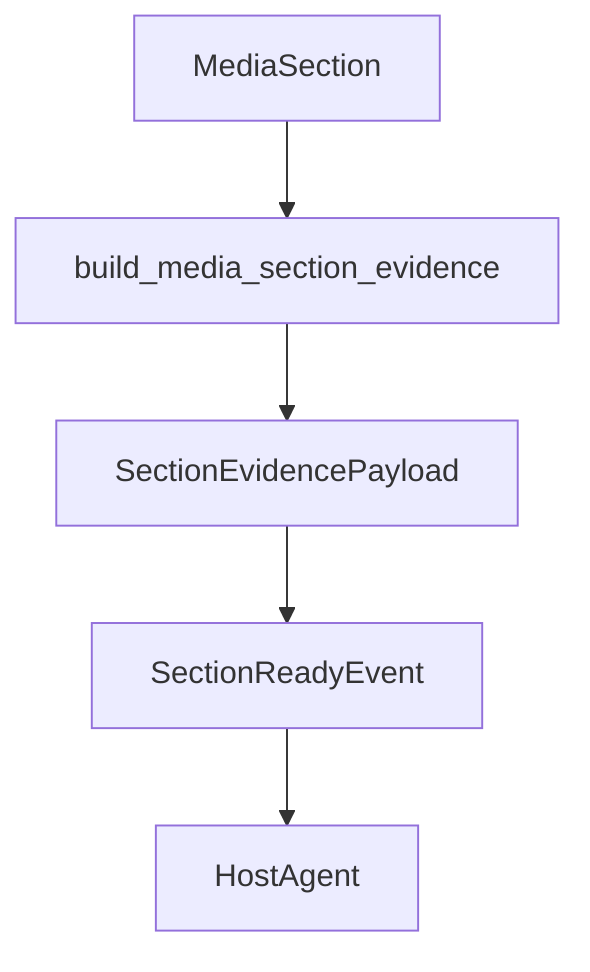

# Day04 上午：MediaAgent 搜索规划、搜索降级、证据写作

## 1. 本节讲解范围

### 1.1 本节涉及的模块

#### 1.1.1 相关目录

Day03 已经讲完证据契约、InsightAgent 证据池，以及 common 事件/SSE/IO 基础设施。

Day04 开始讲第二个研究角色：

```text
MediaAgent
```

它负责公开媒体侧研究，核心数据来源不是私域数据库，而是全网搜索。

相关目录：

```text
engines/media_agent/
engines/media_agent/nodes/
engines/media_agent/tools/web_search/
engines/common/llm_text/
```

#### 1.1.2 相关文件

本节重点讲：

```text
engines/media_agent/agent.py
engines/media_agent/graph.py
engines/media_agent/state.py
engines/media_agent/context.py
engines/media_agent/nodes/plan_node.py
engines/media_agent/nodes/search_node.py
engines/media_agent/nodes/summarize_node.py
engines/media_agent/evidence.py
engines/media_agent/evidence_pack.py
engines/media_agent/tools/web_search/factory.py
engines/media_agent/tools/web_search/base.py
engines/media_agent/tools/web_search/schemas.py
engines/media_agent/prompts.py
```

#### 1.1.3 本节范围边界

本节讲 MediaAgent 的主流程：

```text
规划搜索策略
执行公开搜索
搜索词降级
证据字段写入
章节写作
发布 section_ready 事件
```

本节暂不逐个展开 Tavily、Bocha、Anspire 具体 API 细节。

### 1.2 本节要解决的问题

#### 1.2.1 核心问题

本节要解决：

```text
1. MediaAgent 为什么比 InsightAgent 更轻
2. PlanNode 如何固定五维结构，但让 LLM 选择搜索工具
3. SearchNode 如何进行搜索词降级
4. apply_search_evidence 如何把搜索结果写入 MediaSection
5. SummarizeNode 为什么在无证据时不调用 LLM
6. MediaAgent 如何把公开搜索证据交给 HostAgent
```

#### 1.2.2 理解难点

MediaAgent 不构建全局证据池。

它的工作方式是：

```text
按章节规划
按章节搜索
按章节写作
按章节发布事件
```

这和 Day03 下午的 InsightAgent 不一样。

InsightAgent 是：

```text
先构建全局证据池
再分配给各章节
```

MediaAgent 是：

```text
每个章节自己搜索公开媒体材料
```

#### 1.2.3 和 Day03 的关系

Day03 上午讲了：

```text
SectionEvidencePayload
SectionReadyEvent
```

本节要看 MediaAgent 如何把公开搜索结果转换成同样的证据契约。

## 2. 本节在项目中的位置

### 2.1 全局架构定位

#### 2.1.1 当前模块属于哪一层

MediaAgent 属于 `engines` 下的研究角色层。

它由：

```text
engines/orchestration/research.py
```

并行启动。

#### 2.1.2 上游模块是谁

上游是研究编排层：

```text
invoke_media_agent(query, role, config, llm_client, output_dir, progress_callback)
```

#### 2.1.3 下游模块是谁

下游包括：

```text
WebSearchClient
LLMClient
common eventing
HostAgent
common IO
```

### 2.2 当前模块的职责边界

#### 2.2.1 它负责什么

MediaAgent 负责：

```text
规划媒体侧五维搜索策略
选择搜索工具
执行公开 Web 搜索
处理搜索失败和降级
生成媒体侧章节正文
整理媒体侧证据包
发布 section_ready 事件
保存媒体侧报告
```

#### 2.2.2 它不负责什么

MediaAgent 不负责：

```text
私域数据库检索
向量召回
Host 裁决
最终综合报告生成
前端展示
```

#### 2.2.3 为什么这样分层

公开媒体研究和私域舆情研究的数据来源完全不同。

所以项目拆成两个并行研究角色：

```text
InsightAgent 负责私域侧
MediaAgent 负责公开媒体侧
```

HostAgent 再对两边结果做研判。

### 2.3 位置流程图

#### 2.3.1 全局位置图



#### 2.3.2 MediaAgent 图结构


#### 2.3.3 图中每个节点的含义

`PlanNode` 规划搜索工具和章节目标。

`SearchNode` 执行公开搜索，并写入证据字段。

`SummarizeNode` 基于搜索证据写章节，并发布事件。

`FormatReportNode` 汇总媒体侧最终报告。

`SaveReportNode` 保存报告和状态。

## 3. 总体逻辑流程图

### 3.1 主流程说明

#### 3.1.1 输入从哪里来

输入是用户研究主题：

```text
query
```

由研究编排层传入 `invoke_media_agent()`。

#### 3.1.2 中间经过哪些步骤

完整流程：

```text
invoke_media_agent
-> build_graph
-> PlanNode
-> SearchNode
-> SummarizeNode
-> SearchNode / SummarizeNode 循环处理下一章节
-> FormatReportNode
-> SaveReportNode
```

#### 3.1.3 输出到哪里去

MediaAgent 产出三类结果：

```text
章节 section_ready 事件
媒体侧最终 Markdown 报告
媒体侧 state JSON 文件
```

### 3.2 主流程图

#### 3.2.1 Mermaid 流程图



#### 3.2.2 流程图逐节点解释

MediaAgent 先规划，再逐章搜索。

每章会有 1 到 3 个候选搜索词。

如果第一个搜索词没有形成可用证据，SearchNode 会尝试下一个搜索词。

当搜索结果能形成 `formatted_results`，才进入章节写作。

#### 3.2.3 关键转折点

关键转折点：

```text
固定五维框架 -> LLM 选择搜索工具
搜索结果 -> 格式化证据块
无有效证据 -> 数据缺口路径
章节正文 -> section_ready 事件
```

### 3.3 MediaAgent 和 InsightAgent 的差异

#### 3.3.1 InsightAgent 的特点

InsightAgent：

```text
先全局召回
再排序聚类
再分配章节证据包
```

#### 3.3.2 MediaAgent 的特点

MediaAgent：

```text
先规划章节搜索策略
每章独立搜索
每章独立写作
每章独立发布事件
```

#### 3.3.3 为什么两者不同

私域库适合先形成全局证据池。

公开 Web 搜索更适合按章节搜索，因为不同维度需要不同搜索词。

## 4. 核心数据流图

### 4.1 输入数据结构

#### 4.1.1 MediaState

MediaAgent 的全局状态是 `MediaState`。

它包含：

```text
query
role
sections
cursor
final_report
report_title
save_report
is_completed
```

#### 4.1.2 MediaSection

每个章节是 `MediaSection`。

规划字段：

```text
title
section_key
goal
search_queries
search_tool
```

研究字段：

```text
body
sources
hit_count
used_query
formatted_results
evidence_strength
missing_notes
```

#### 4.1.3 Web 搜索结果

搜索供应商统一响应为：

```text
SearchProviderResponse
WebpageResult
```

然后在 `MediaContext` 中转换为：

```text
SearchDocument
SearchResult
```

### 4.2 中间状态变化

#### 4.2.1 PlanNode 后

状态写入：

```text
sections
cursor = 0
```

#### 4.2.2 SearchNode 后

当前章节写入：

```text
hit_count
used_query
sources
formatted_results
evidence_strength
missing_notes
```

#### 4.2.3 SummarizeNode 后

当前章节写入：

```text
body
```

同时发布：

```text
SectionReadyEvent
```

### 4.3 输出数据结构

#### 4.3.1 章节正文

`body` 是媒体侧章节分析正文。

#### 4.3.2 章节证据包

`build_media_section_evidence()` 生成统一的 `SectionEvidencePayload`。

#### 4.3.3 章节事件

`SummarizeNode` 发布 `SectionReadyEvent` 给 HostAgent。

## 5. 核心调用链图

### 5.1 Agent 启动调用链

#### 5.1.1 调用链展开

```text
invoke_media_agent
-> MediaContext
-> build_graph
-> graph.ainvoke
```

#### 5.1.2 时序图



#### 5.1.3 逻辑过渡

MediaAgent 的依赖都放在 `MediaContext`。

图节点不直接创建 LLMClient 或搜索客户端。

### 5.2 搜索调用链

#### 5.2.1 调用链展开

```text
SearchNode
-> MediaContext.execute_search
-> WebSearchClient
-> provider.comprehensive_search / web_search_only / recent_search
-> SearchResult
-> build_search_evidence_blocks
-> apply_search_evidence
```

#### 5.2.2 时序图



#### 5.2.3 逻辑过渡

SearchNode 不关心底层使用 Tavily、Bocha 还是 Anspire。

它只关心统一后的 `SearchResult`。

### 5.3 写作与事件调用链

#### 5.3.1 调用链展开

```text
SummarizeNode
-> _write
-> LLMClient.generate_text
-> build_media_section_evidence
-> publish_section_ready
```

#### 5.3.2 时序图



#### 5.3.3 逻辑过渡

章节写完不是终点。

必须同时发布证据事件，HostAgent 才能和 InsightAgent 的同维度结果配对。

## 6. 手写真实项目核心逻辑

### 6.1 为什么手写真实项目文件

#### 6.1.1 手写不是独立 Demo

MediaAgent 的核心不是单个搜索 API，而是规划、搜索、证据、写作和事件的组合。

所以必须用真实项目文件讲。

#### 6.1.2 本节手写哪些文件

本节手写：

```text
engines/media_agent/graph.py
engines/media_agent/state.py
engines/media_agent/nodes/plan_node.py
engines/media_agent/nodes/search_node.py
engines/media_agent/nodes/summarize_node.py
```

#### 6.1.3 和项目主链路的对应关系

```text
MediaState
-> PlanNode
-> SearchNode
-> SummarizeNode
-> SectionReadyEvent
```

### 6.2 手写代码一：`engines/media_agent/graph.py`

#### 6.2.1 要实现什么

实现 MediaAgent 的 LangGraph 图结构。

#### 6.2.2 完整代码

完整包路径与文件名：

```text
engines/media_agent/graph.py
```

完整代码如下：

```python
"""MediaAgent 全网媒体研究模块：engines/media_agent/graph.py。"""

from typing import Any

from langgraph.graph import END, START, StateGraph

from engines.media_agent.context import MediaContext
from engines.media_agent.nodes import (
    FormatReportNode,
    PlanNode,
    SaveReportNode,
    SearchNode,
    SummarizeNode,
)
from engines.media_agent.state import MediaState


def _route_after_summarize(state: MediaState) -> str:
    cursor = state.get("cursor", 0)
    return "next_section" if cursor < len(state.get("sections", [])) else "all_done"


def build_graph(ctx: MediaContext) -> Any:
    graph = StateGraph(MediaState)  # type:ignore

    graph.add_node("plan", PlanNode(ctx))  # type:ignore
    graph.add_node("search", SearchNode(ctx))  # type:ignore
    graph.add_node("summarize", SummarizeNode(ctx))  # type:ignore
    graph.add_node("format_report", FormatReportNode(ctx))  # type:ignore
    graph.add_node("persist_report", SaveReportNode(ctx))  # type:ignore

    graph.add_edge(START, "plan")
    graph.add_edge("plan", "search")
    graph.add_edge("search", "summarize")
    graph.add_conditional_edges(
        "summarize", _route_after_summarize,
        {"next_section": "search", "all_done": "format_report"},
    )
    graph.add_edge("format_report", "persist_report")
    graph.add_edge("persist_report", END)

    return graph.compile()
```

#### 6.2.3 逐块解释

`plan` 只执行一次。

`search` 和 `summarize` 会按章节循环。

`_route_after_summarize()` 判断是否还有下一章节。

#### 6.2.4 关键设计意图

公开媒体研究适合逐章节搜索和写作。

### 6.3 手写代码二：`engines/media_agent/state.py`

#### 6.3.1 要实现什么

定义 MediaAgent 的状态结构。

#### 6.3.2 完整代码

完整包路径与文件名：

```text
engines/media_agent/state.py
```

完整代码如下：

```python
"""MediaAgent 全网媒体研究模块：engines/media_agent/state.py。"""

from typing import TypedDict


class MediaSection(TypedDict, total=False):
    """一个报告章节:规划字段(plan 产出)+ 研究字段(search/summarize 产出)。"""

    # ── 规划字段(PlanNode 写入)──
    title: str                  # 章节标题
    section_key: str            # 与全局五维框架对齐的章节键
    goal: list[str]             # 本章预期分析点(1~3 个,写作验收标准)
    search_queries: list[str]   # 1~3 个候选搜索词,精准→宽泛降序(降级链载体)
    search_tool: str            # Web 工具白名单内的工具名

    # ── 研究字段(SearchNode / SummarizeNode 写入)──
    body: str                   # 章节正文
    sources: list[dict]         # 命中的网页结果(前端「本章来源」展示)
    hit_count: int              # 有效证据条数;0 = 走了数据缺口防护
    used_query: str             # 实际命中的搜索词(可观测性)
    formatted_results: str      # 喂给 LLM 的格式化搜索结果文本
    evidence_strength: str      # strong / medium / weak / missing
    missing_notes: list[str]    # 媒体侧证据缺口


class MediaState(TypedDict, total=False):
    query: str                  # 用户研究话题
    role: str                   # 恒为 "media"(落盘文件名前缀 / 论坛来源标识)
    sections: list[MediaSection]
    cursor: int                 # 当前章节索引
    final_report: str
    report_title: str
    save_report: bool
    is_completed: bool
```

#### 6.3.3 逐块解释

`MediaSection` 同时承载规划结果和研究结果。

`cursor` 表示当前处理第几个章节。

#### 6.3.4 关键设计意图

一个章节从规划、搜索到写作，会逐步补齐字段。

### 6.4 手写代码三：`engines/media_agent/nodes/search_node.py`

#### 6.4.1 要实现什么

实现逐章节搜索和搜索词降级。

#### 6.4.2 完整代码

完整包路径与文件名：

```text
engines/media_agent/nodes/search_node.py
```

完整代码如下：

```python
"""MediaAgent 图节点模块。"""

from typing import Any
from loguru import logger

from engines.common.llm_text.evidence import build_search_evidence_blocks
from engines.common.nodes import BaseNode, section_progress_base
from engines.media_agent.evidence import apply_search_evidence
from engines.media_agent.state import MediaState


class SearchNode(BaseNode):
    MAX_SOURCES = 10  # 写回 state 的来源条数上限(前端「本章来源」展示)

    async def __call__(self, state: MediaState) -> dict[str, Any]:
        cursor = state.get("cursor", 0)
        sections = list(state.get("sections", []))
        section = sections[cursor]
        base = section_progress_base(cursor, len(sections))

        self.ctx.report_progress("searching", f"正在搜索: {section.get('title', '')}", base)

        tool = section.get("search_tool") or self.ctx.DEFAULT_TOOL
        results: list[dict] = []
        formatted: list[str] = []
        used_query = ""

        for q in section.get("search_queries") or [state["query"]]:
            sr = await self.ctx.execute_search(tool, q)
            candidate_results = sr.to_dicts()
            candidate_formatted = build_search_evidence_blocks(
                candidate_results,
                max_length=self.ctx.config.SEARCH_CONTENT_MAX_LENGTH,
            )[:30]
            if candidate_formatted:
                results, formatted, used_query = candidate_results, candidate_formatted, q
                break
            logger.info(f"[media] 搜索词 {q!r} 未形成有效证据,降级下一候选")

        apply_search_evidence(section, results, used_query, formatted, self.MAX_SOURCES)
        sections[cursor] = section

        self.ctx.report_progress("searching", f"搜索完成: {len(formatted)} 条有效证据", base + 3)
        return {"sections": sections}
```

#### 6.4.3 逐块解释

循环搜索 `search_queries`。

如果当前搜索词没有形成 `candidate_formatted`，就继续尝试下一个搜索词。

这就是搜索降级。

#### 6.4.4 关键设计意图

公开搜索不稳定。

搜索词越具体越精准，但也可能没有结果。

所以需要：

```text
精准搜索词 -> 维度提示词 -> 原始 query
```

逐级降级。

### 6.5 手写代码四：`engines/media_agent/nodes/summarize_node.py`

#### 6.5.1 要实现什么

实现章节写作和事件发布。

#### 6.5.2 完整代码

完整包路径与文件名：

```text
engines/media_agent/nodes/summarize_node.py
```

完整代码如下：

```python
"""MediaAgent 图节点模块。"""

import json
from typing import Any

from loguru import logger

from engines.common.eventing.publishers import publish_section_ready
from engines.common.llm_text.output import strip_markdown_fence
from engines.common.nodes import BaseNode, section_progress_base
from engines.contracts.events import SectionReadyEvent
from engines.contracts.roles import MEDIA_ROLE, ROLE_INFOS
from engines.media_agent.evidence_pack import build_media_section_evidence
from engines.media_agent.prompts import SYSTEM_PROMPT_SUMMARY
from engines.media_agent.state import MediaSection, MediaState

DATA_GAP_BODY = "【数据缺口】该维度未在可用数据源中检索到相关内容,本章节暂无分析结论。"


def _goal_points(goal: Any) -> list[str]:
    return [item.strip() for item in (goal or []) if isinstance(item, str) and item.strip()]


class SummarizeNode(BaseNode):
    async def __call__(self, state: MediaState) -> dict[str, Any]:
        cursor = state.get("cursor", 0)
        sections = list(state.get("sections", []))
        section = sections[cursor]
        title = section.get("title", "")
        base = section_progress_base(cursor, len(sections))
        search_results = str(section.get("formatted_results", "")).strip()

        # 数据缺口短路(程序规则):不调 LLM,仍发事件,保证双研究角色轮次完整
        if not section.get("hit_count") or not search_results:
            logger.info(f"[media] 章节 {title!r} 无有效搜索证据,走数据缺口路径")
            section["body"] = DATA_GAP_BODY
            self._publish_section_ready(state, cursor, section)
            self.ctx.report_progress("writing", f"章节跳过(数据缺口): {title}", base + 10)
        else:
            self.ctx.report_progress("writing", f"正在撰写: {title}", base + 5)
            section["body"] = await self._write(section)
            self._publish_section_ready(state, cursor, section)
            self.ctx.report_progress("writing", f"章节完成: {title}", base + 10)

        sections[cursor] = section
        return {"sections": sections, "cursor": cursor + 1}

    async def _write(self, section: MediaSection) -> str:
        user_input = {
            "title": section.get("title", ""),
            "expected_analysis_points": _goal_points(section.get("goal")),
            "used_query": section.get("used_query", ""),
            "search_results": section.get("formatted_results", ""),
        }
        user_prompt = json.dumps(user_input, ensure_ascii=False)

        try:
            body = await self.ctx.llm_client.generate_text(
                SYSTEM_PROMPT_SUMMARY, user_prompt, temperature=0.5
            )
            return strip_markdown_fence(body).strip()
        except Exception as exc:
            logger.error(f"[media] 章节写作 LLM 调用失败: {exc}")
            return (
                f"【生成失败】本章节基于 {section.get('hit_count', 0)} 条搜索结果,"
                "但内容生成过程出错,请参考引用来源。"
            )

    def _publish_section_ready(self, state: MediaState, cursor: int, section: MediaSection) -> None:
        """HostAgent 研判入口:章节摘要发布为 section_ready 事件。"""
        try:
            evidence = build_media_section_evidence(section)
            publish_section_ready(SectionReadyEvent(
                source=MEDIA_ROLE,
                agent=ROLE_INFOS[MEDIA_ROLE].display_name,
                section_key=section.get("section_key", ""),
                section_index=cursor,
                title=section.get("title", ""),
                query=state.get("query", ""),
                body=section.get("body", ""),
                hit_count=evidence["hit_count"],
                used_query=evidence["used_query"],
                sources=evidence["sources"],
                evidence_pack=evidence["evidence_pack"],
                evidence_strength=evidence["evidence_strength"],
                missing_notes=evidence["missing_notes"],
            ))
        except Exception as exc:
            logger.warning(f"[media] section_ready 事件发布失败(不影响主流程): {exc}")
```

#### 6.5.3 逐块解释

无证据时直接走数据缺口路径。

有证据时才调用 LLM 写章节。

无论哪条路径，都会发布 `SectionReadyEvent`。

#### 6.5.4 关键设计意图

即使媒体侧没有证据，也要通知 HostAgent。

否则 HostAgent 会一直等待同维度配对。

## 7. 手写逻辑执行流程图

### 7.1 规划流程

#### 7.1.1 第一步执行什么

读取固定五维框架。

#### 7.1.2 第二步执行什么

LLM 只选择分析目标和搜索工具。

#### 7.1.3 最终得到什么

得到 `MediaSection` 列表。

### 7.2 搜索流程

#### 7.2.1 第一步执行什么

取当前章节的搜索工具和候选搜索词。

#### 7.2.2 第二步执行什么

按顺序尝试搜索词。

#### 7.2.3 最终得到什么

写入证据字段和实际命中的 `used_query`。

### 7.3 写作流程

#### 7.3.1 第一步执行什么

判断是否有有效证据。

#### 7.3.2 第二步执行什么

有证据调用 LLM，无证据写数据缺口正文。

#### 7.3.3 最终得到什么

发布 `SectionReadyEvent`。

### 7.4 手写流程图

#### 7.4.1 搜索降级



#### 7.4.2 数据缺口短路



#### 7.4.3 证据到 Host



## 8. 项目源码解读

### 8.1 文件一：`engines/media_agent/context.py`

#### 8.1.1 文件职责

MediaAgent 的依赖容器。

#### 8.1.2 为什么需要这个文件

图节点需要访问 LLM、搜索工具、配置、输出目录和进度回调。

#### 8.1.3 上游调用者

```text
invoke_media_agent
```

#### 8.1.4 下游依赖

```text
SearchNode
PlanNode
SummarizeNode
SaveReportNode
```

#### 8.1.5 完整源码

完整包路径与文件名：

```text
engines/media_agent/context.py
```

完整代码如下：

```python
"""MediaAgent 全网媒体研究模块：engines/media_agent/context.py。"""

from typing import Any, Callable

from loguru import logger

from engines.common.models import ProgressUpdate
from engines.contracts.config import Settings
from engines.llm.llm_client import LLMClient
from engines.media_agent.models import SearchDocument, SearchResult
from engines.media_agent.tools.web_search import SearchProviderResponse


class MediaContext:
    """media 研究角色实例的依赖容器(Web 搜索)。"""

    TOOL_NAMES = (
        "comprehensive_search",
        "web_search_only",
        "recent_search",
    )
    DEFAULT_TOOL = "comprehensive_search"

    def __init__(
            self,
            role: str,
            llm_client: LLMClient,
            config: Settings,
            output_dir: str,
            progress_callback: Callable[[ProgressUpdate], None],
    ) -> None:
        self.role = role
        self.llm_client = llm_client
        self.config = config
        self.output_dir = output_dir
        self.progress_callback = progress_callback

        self._web_search_client = None

    def report_progress(self, status: str, message: str, pct: int) -> None:
        self.progress_callback(ProgressUpdate(status, message, pct))

    async def execute_search(self, tool_name: str, query: str) -> SearchResult:
        if tool_name not in self.TOOL_NAMES:
            logger.warning(
                f"[{self.role}] 工具 {tool_name!r} 不在白名单,回退 {self.DEFAULT_TOOL}"
            )
            tool_name = self.DEFAULT_TOOL
        try:
            return await self._search_web(tool_name, query)
        except Exception as exc:
            logger.error(f"[{self.role}] 搜索失败 tool={tool_name} query={query!r}: {exc}")
            return SearchResult(query=query, tool_used=tool_name)

    def _get_web_search_client(self):
        if self._web_search_client is None:
            from engines.media_agent.tools.web_search import WebSearchClient
            self._web_search_client = WebSearchClient(self.role)
        return self._web_search_client

    async def _search_web(self, tool_name: str, query: str) -> SearchResult:
        client = self._get_web_search_client()
        response = await getattr(client, tool_name)(query)
        results = self._webpages_to_documents(response)
        return SearchResult(query=query, documents=results, tool_used=tool_name)


    @staticmethod
    def _webpages_to_documents(response: SearchProviderResponse | None) -> list[SearchDocument]:
        if response is None:
            return []
        return [
            SearchDocument(
                title=page.name or "",
                url=page.url or "",
                content=page.snippet or "",
                published_date=page.date_last_crawled or "",
            )
            for page in response.webpages
        ]


    def state_for_persistence(self, state: dict[str, Any]) -> dict[str, Any]:
        return {
            "query": state.get("query", ""),
            "role": state.get("role", self.role),
            "sections": [
                _persistent_section(section)
                for section in state.get("sections", [])
            ],
            "final_report": state.get("final_report", ""),
            "report_title": state.get("report_title", ""),
            "is_completed": state.get("is_completed", False),
        }


def _persistent_section(section: dict[str, Any]) -> dict[str, Any]:
    return {
        "title": section.get("title", ""),
        "section_key": section.get("section_key", ""),
        "goal": section.get("goal", []),
        "search_queries": section.get("search_queries", []),
        "search_tool": section.get("search_tool", ""),
        "used_query": section.get("used_query", ""),
        "hit_count": int(section.get("hit_count", 0) or 0),
        "evidence_strength": section.get("evidence_strength", ""),
        "missing_notes": list(section.get("missing_notes", [])),
        "sources": list(section.get("sources", []))[:10],
        "body": section.get("body", ""),
    }
```

#### 8.1.6 代码逐块解释

`execute_search()` 先校验工具白名单。

搜索失败不会抛出到主流程，而是返回空 `SearchResult`。

`state_for_persistence()` 控制落盘时保留哪些字段。

#### 8.1.7 关键设计意图

搜索失败不能让整个 Agent 崩溃。

失败要变成数据缺口。

#### 8.1.8 如果不这样设计会怎样

一次外部搜索 API 异常就可能中断整份媒体侧报告。

### 8.2 文件二：`engines/media_agent/nodes/plan_node.py`

#### 8.2.1 文件职责

规划五维搜索策略。

#### 8.2.2 为什么需要这个文件

不同章节适合不同搜索工具和不同分析目标。

#### 8.2.3 上游调用者

```text
Media graph START -> plan
```

#### 8.2.4 下游依赖

```text
SearchNode
```

#### 8.2.5 完整源码

完整包路径与文件名：

```text
engines/media_agent/nodes/plan_node.py
```

完整代码如下：

```python
"""MediaAgent 图节点模块。"""

import json
from typing import Any

from loguru import logger

from engines.common.nodes import BaseNode
from engines.contracts.dimensions import DIMENSIONS
from engines.media_agent.prompts import SYSTEM_PROMPT_PLAN
from engines.media_agent.schemas import MediaResearchPlan
from engines.media_agent.state import MediaSection, MediaState


MEDIA_SEARCH_HINTS = {
    "background_overview": "基本情况 最新进展",
    "heat_and_spread": "舆情热度 传播 热搜",
    "sentiment_and_opinion": "网友评论 公众观点 争议",
    "platform_and_group_diff": "微博 抖音 平台差异",
    "deep_causes_and_impact": "原因 影响 风险",
}


class PlanNode(BaseNode):

    async def __call__(self, state: MediaState) -> dict[str, Any]:
        self.ctx.report_progress("planning", "正在规划媒体侧五维搜索策略...", 40)
        query = state["query"]
        user_prompt = self._build_user_prompt(query)
        try:
            plan: MediaResearchPlan = await self.ctx.llm_client.generate_object(
                SYSTEM_PROMPT_PLAN, user_prompt, MediaResearchPlan, temperature=0.6
            )
            sections = [
                self._normalize(s.model_dump(), query, index)
                for index, s in enumerate(plan.sections)
            ]
            if not sections:
                raise ValueError("规划返回空章节列表")
        except Exception as exc:
            logger.warning(f"[media] 规划失败,使用默认结构: {exc}")
            sections = self._default_sections(query)

        sections = sections[: self.ctx.config.MAX_SECTIONS]
        return {"sections": sections, "cursor": 0}

    def _build_user_prompt(self, query: str) -> str:
        payload = {
            "research_topic": query,
            "fixed_dimensions": [
                {
                    "section_key": dimension.key,
                    "title": dimension.title,
                    "analysis_goal": dimension.media_goal,
                }
                for dimension in DIMENSIONS
            ],
            "available_tools": [
                {
                    "name": "comprehensive_search",
                    "description": "综合搜索,适合全面理解事件、原因、影响和多来源报道。",
                },
                {
                    "name": "web_search_only",
                    "description": "纯网页搜索,适合获取可核查网页来源、媒体标题和原始报道。",
                },
                {
                    "name": "recent_search",
                    "description": "近期搜索,适合获取最新进展、热度变化和传播动态。",
                },
            ],
        }
        return json.dumps(payload, ensure_ascii=False)

    def _normalize(self, raw: dict, query: str, index: int) -> MediaSection:
        dimension = DIMENSIONS[index] if index < len(DIMENSIONS) else None
        tool = raw.get("search_tool", "")
        if tool not in self.ctx.TOOL_NAMES:
            tool = self.ctx.DEFAULT_TOOL
        goals = self._normalize_goal(raw)
        title = dimension.title if dimension else raw.get("title") or "未命名章节"
        return MediaSection(
            title=title,
            goal=goals or ([dimension.media_goal] if dimension else []),
            search_queries=_build_search_queries(query, dimension.key if dimension else "", title),
            search_tool=tool,
            section_key=dimension.key if dimension else "",
        )

    @staticmethod
    def _normalize_goal(raw: dict) -> list[str]:
        """goal_analysis_points → 非空字符串列表(本章预期分析点)。"""
        items = raw.get("goal_analysis_points")
        return [s.strip() for s in (items or []) if isinstance(s, str) and s.strip()][:3]

    def _default_sections(self, query: str) -> list[MediaSection]:
        return [
            MediaSection(
                title=dimension.title,
                goal=[dimension.media_goal],
                search_queries=_build_search_queries(query, dimension.key, dimension.title),
                search_tool=self.ctx.DEFAULT_TOOL,
                section_key=dimension.key,
            )
            for dimension in DIMENSIONS
        ]


def _build_search_queries(query: str, section_key: str, section_title: str) -> list[str]:
    candidates = [
        f"{query} {section_title}",
        f"{query} {MEDIA_SEARCH_HINTS.get(section_key, section_title)}",
        query,
    ]
    return _dedupe_queries(candidates)


def _dedupe_queries(candidates: list[str]) -> list[str]:
    queries: list[str] = []
    for candidate in candidates:
        value = " ".join(str(candidate or "").split())
        if value and value not in queries:
            queries.append(value)
    return queries[:3]
```

#### 8.2.6 代码逐块解释

LLM 不能改变五维结构。

程序固定 `DIMENSIONS`，LLM 只负责选工具和分析点。

如果规划失败，使用默认五维结构。

#### 8.2.7 关键设计意图

结构由程序保证，策略由 LLM 辅助。

#### 8.2.8 如果不这样设计会怎样

LLM 可能增删章节，导致 Media 和 Insight 维度无法和 HostAgent 配对。

### 8.3 文件三：`engines/media_agent/evidence.py`

#### 8.3.1 文件职责

把搜索结果应用到 MediaSection。

#### 8.3.2 为什么需要这个文件

搜索结果必须变成结构化证据字段。

#### 8.3.3 上游调用者

```text
SearchNode
```

#### 8.3.4 下游依赖

```text
SummarizeNode
evidence_pack.py
```

#### 8.3.5 完整源码

完整包路径与文件名：

```text
engines/media_agent/evidence.py
```

完整代码如下：

```python
"""MediaAgent search evidence helpers."""

from __future__ import annotations

from typing import Any

from engines.contracts.evidence import EvidenceStrength
from engines.media_agent.state import MediaSection


def media_evidence_strength_from_hit_count(hit_count: int) -> EvidenceStrength:
    if hit_count >= 6:
        return "strong"
    if hit_count >= 3:
        return "medium"
    if hit_count > 0:
        return "weak"
    return "missing"


def apply_search_evidence(
    section: MediaSection,
    results: list[dict[str, Any]],
    used_query: str,
    formatted_results: list[str],
    max_sources: int,
) -> None:
    usable_sources = [result for result in results if _has_content(result)]
    hit_count = len(formatted_results)
    section["hit_count"] = hit_count
    section["used_query"] = used_query
    section["sources"] = usable_sources[:max_sources]
    section["formatted_results"] = "\n\n".join(formatted_results)
    section["evidence_strength"] = media_evidence_strength_from_hit_count(hit_count)
    section["missing_notes"] = _missing_notes(hit_count, len(results), used_query)


def _has_content(result: dict[str, Any]) -> bool:
    return bool(str(result.get("content") or result.get("snippet") or "").strip())


def _missing_notes(hit_count: int, raw_hit_count: int, used_query: str) -> list[str]:
    if hit_count == 0:
        if raw_hit_count > 0:
            return ["媒体侧搜索有结果,但缺少可用于写作的正文摘要"]
        return ["媒体侧未检索到可用结果"]
    if hit_count < 3:
        return [f"媒体侧结果较少,实际命中查询词: {used_query or '无'}"]
    return []
```

#### 8.3.6 代码逐块解释

`hit_count` 使用格式化后可写作证据数量。

不是原始搜索结果数量。

`missing_notes` 解释媒体侧证据缺口。

#### 8.3.7 关键设计意图

有搜索结果不代表有可用证据。

必须有内容摘要，才适合给 LLM 写作。

#### 8.3.8 如果不这样设计会怎样

搜索命中但没有正文摘要时，LLM 可能根据标题过度推断。

## 9. 关键对象与状态拆解

### 9.1 核心对象一：`MediaSection`

#### 9.1.1 对象定义

媒体侧章节状态。

#### 9.1.2 字段含义

它包含规划字段和研究字段。

#### 9.1.3 生命周期

创建于 `PlanNode`。

更新于 `SearchNode` 和 `SummarizeNode`。

### 9.2 核心对象二：`SearchResult`

#### 9.2.1 对象定义

统一后的搜索结果。

#### 9.2.2 字段含义

包含查询词、工具名和网页文档列表。

#### 9.2.3 生命周期

由 `MediaContext.execute_search()` 返回。

由 `SearchNode` 消费。

### 9.3 核心对象三：`SectionReadyEvent`

#### 9.3.1 对象定义

章节完成事件。

#### 9.3.2 字段含义

包含正文和媒体侧证据字段。

#### 9.3.3 生命周期

由 `SummarizeNode` 发布。

由 HostAgent 消费。

## 10. 边界情况与异常分支

### 10.1 规划失败

#### 10.1.1 什么情况下发生

LLM 结构化输出失败，或者返回空章节。

#### 10.1.2 代码如何处理

`PlanNode` 使用 `_default_sections()`。

#### 10.1.3 为什么这样处理

五维结构必须稳定。

规划失败不能阻塞后续搜索。

### 10.2 搜索失败

#### 10.2.1 什么情况下发生

外部搜索 API 异常、网络失败、key 配置错误。

#### 10.2.2 代码如何处理

`MediaContext.execute_search()` 捕获异常，返回空 `SearchResult`。

#### 10.2.3 为什么这样处理

搜索失败应转成数据缺口，而不是让 Agent 崩溃。

### 10.3 无有效证据

#### 10.3.1 什么情况下发生

原始结果为空，或结果没有正文摘要。

#### 10.3.2 代码如何处理

`SummarizeNode` 写入 `DATA_GAP_BODY`，不调用 LLM。

#### 10.3.3 为什么这样处理

没有证据就不应该让 LLM 编内容。

但仍然要发布事件，保证 HostAgent 配对完整。

## 11. 本节代码在完整链路中的作用

### 11.1 本节之前发生了什么

#### 11.1.1 上一段链路输出

研究编排层已经启动 MediaAgent。

#### 11.1.2 本节接收的数据

本节接收：

```text
query
settings
llm_client
output_dir
progress_callback
```

#### 11.1.3 本节开始的条件

MediaAgent 图已经被构建并开始执行。

### 11.2 本节推进了什么

#### 11.2.1 推进了哪一步业务

本节把公开媒体搜索结果推进成媒体侧章节报告。

#### 11.2.2 改变了哪些状态

改变：

```text
sections
cursor
MediaSection evidence fields
body
```

#### 11.2.3 产出了哪些结果

产出：

```text
媒体侧章节正文
媒体侧证据包
section_ready 事件
媒体侧最终报告
```

### 11.3 本节之后交给谁

#### 11.3.1 下游模块

下游是：

```text
HostAgent
ReportEngine
前端状态展示
```

#### 11.3.2 下游输入

HostAgent 接收 `SectionReadyEvent`。

ReportEngine 后续读取媒体侧 Markdown 报告。

#### 11.3.3 下一节课如何衔接

下一节可以继续讲 MediaAgent 的搜索提供商适配：

```text
WebSearchClient
BaseSearchClient
Tavily / Bocha / Anspire provider
SearchProviderResponse 标准化
```

也可以进入 HostAgent，讲 Insight 和 Media 的章节事件如何配对裁决。
