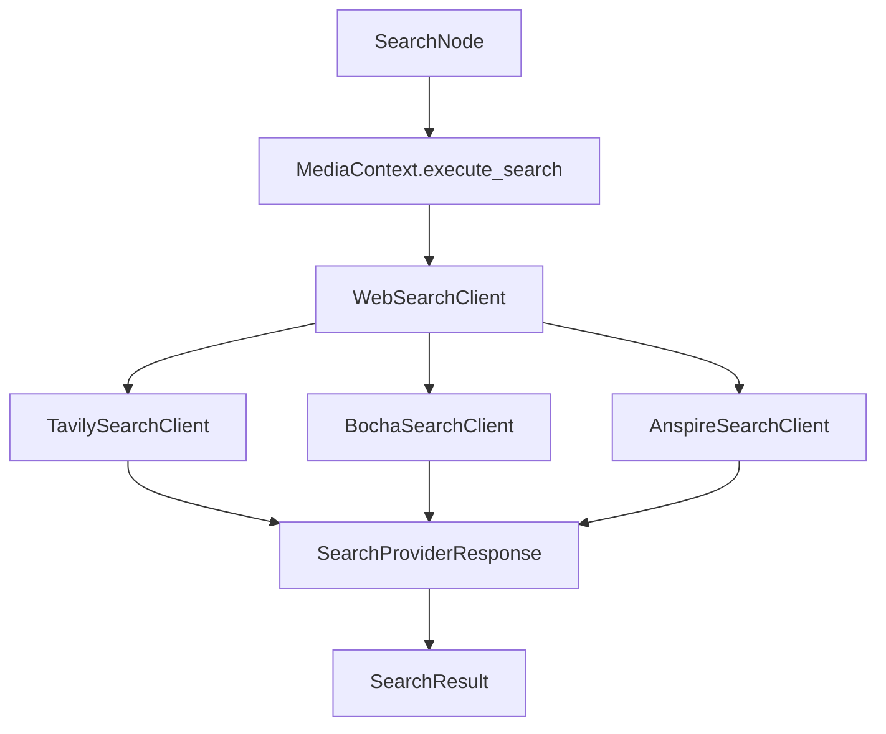
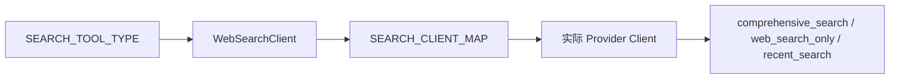
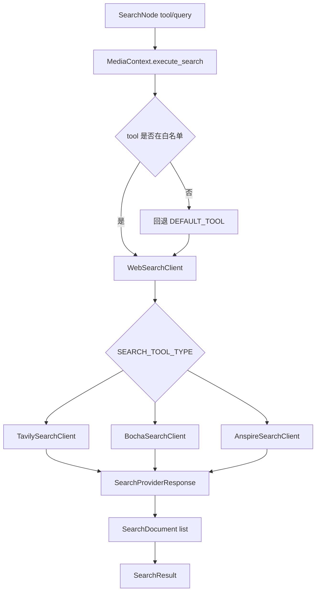
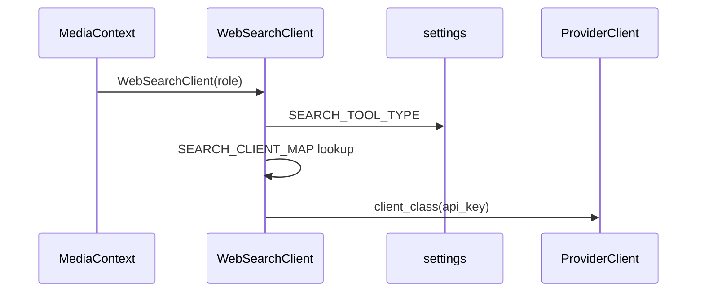
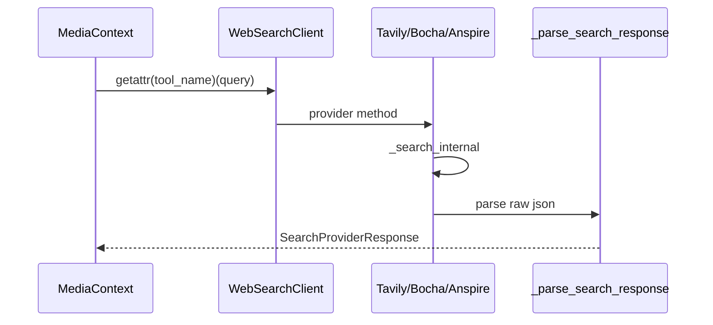
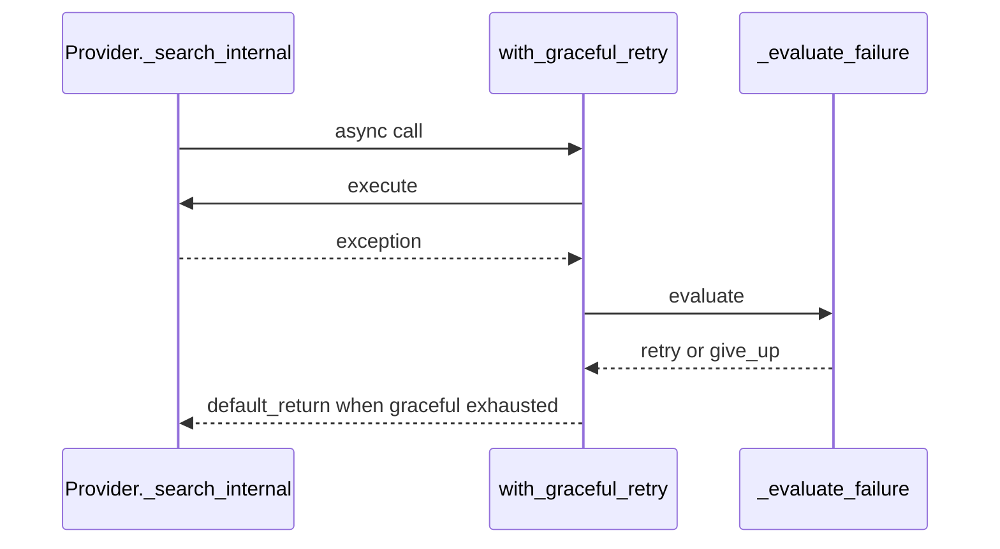
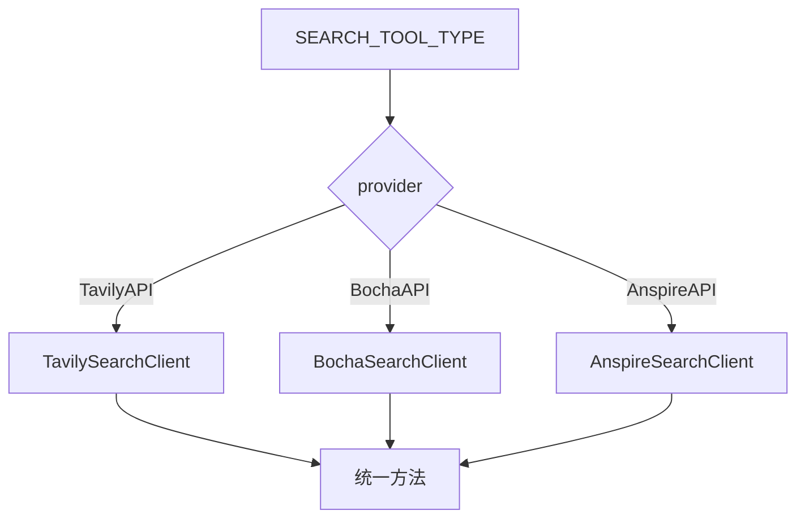
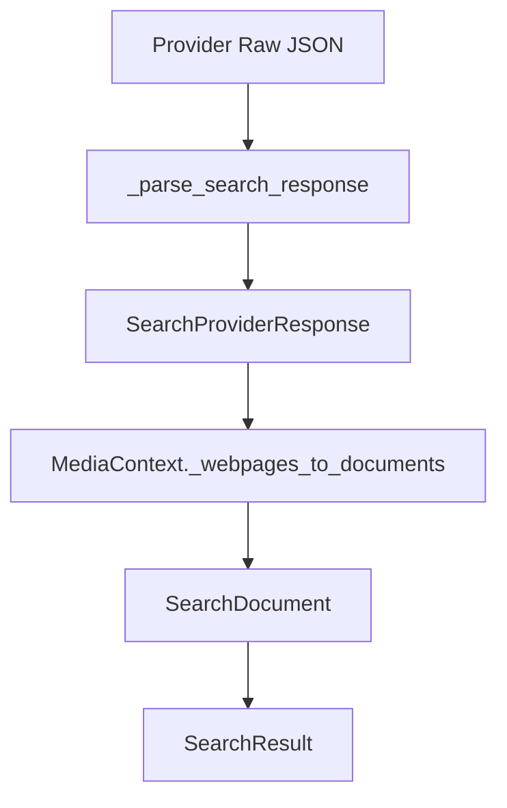

# Day04 下午：Web 搜索提供商适配、统一响应、重试兜底

## 1. 本节讲解范围

### 1.1 本节涉及的模块

#### 1.1.1 相关目录

上午讲了 MediaAgent 的主流程：

```text
plan -> search -> summarize
```

下午继续深入 `SearchNode` 背后的搜索适配层。

相关目录：

```text
engines/media_agent/tools/web_search/
engines/media_agent/tools/web_search/providers/
engines/common/runtime/
engines/contracts/
```

#### 1.1.2 相关文件

本节重点讲：

```text
engines/media_agent/tools/web_search/base.py
engines/media_agent/tools/web_search/factory.py
engines/media_agent/tools/web_search/schemas.py
engines/media_agent/tools/web_search/providers/tavily_client.py
engines/media_agent/tools/web_search/providers/bocha_client.py
engines/media_agent/tools/web_search/providers/anspire_client.py
engines/media_agent/models.py
engines/common/runtime/call_retry.py
engines/contracts/config.py
```

#### 1.1.3 本节范围边界

本节不讲搜索 API 的商业背景。

本节只讲工程问题：

```text
多个搜索供应商如何统一接口
不同响应格式如何统一成 SearchProviderResponse
配置如何决定实际 provider
搜索失败如何柔性重试并返回默认值
```

### 1.2 本节要解决的问题

#### 1.2.1 核心问题

本节要解决：

```text
1. 为什么需要 BaseSearchClient 抽象接口
2. WebSearchClient 如何根据 SEARCH_TOOL_TYPE 选择 provider
3. Tavily、Bocha、Anspire 的响应结构为什么需要统一
4. SearchProviderResponse 和 SearchResult 有什么区别
5. with_graceful_retry 为什么适合搜索 API
6. 搜索失败如何变成 MediaAgent 的数据缺口
```

#### 1.2.2 理解难点

搜索适配层的难点不在于发送 HTTP 请求。

难点在于不同 provider 的接口差异：

```text
请求方法不同
请求参数不同
返回字段不同
时间过滤参数不同
AI answer 字段不同
网页列表字段不同
```

上层 `SearchNode` 不应该知道这些差异。

#### 1.2.3 和上午的关系

上午的 `SearchNode` 只写：

```python
sr = await self.ctx.execute_search(tool, q)
```

下午要讲清楚这行代码背后：

```text
如何找到 provider
如何调用 provider
如何解析 provider 响应
如何兜底失败结果
```

## 2. 本节在项目中的位置

### 2.1 全局架构定位

#### 2.1.1 当前模块属于哪一层

Web 搜索适配层属于 MediaAgent 的工具层。

它在：

```text
MediaContext
和
外部搜索 API
之间
```

#### 2.1.2 上游模块是谁

上游是：

```text
SearchNode
MediaContext
```

`SearchNode` 不直接调用 provider。

它通过 `MediaContext.execute_search()` 间接调用。

#### 2.1.3 下游模块是谁

下游是外部搜索 API：

```text
TavilyAPI
BochaAPI
AnspireAPI
```

### 2.2 当前模块的职责边界

#### 2.2.1 它负责什么

搜索适配层负责：

```text
定义统一搜索接口
按配置选择 provider
封装 provider API Key
发送 HTTP 请求
解析 provider 响应
返回统一响应对象
失败时重试和兜底
```

#### 2.2.2 它不负责什么

它不负责：

```text
搜索词生成
章节规划
搜索结果格式化给 LLM
证据强度判断
Host 研判
```

#### 2.2.3 为什么这样分层

如果 `SearchNode` 直接判断 Tavily、Bocha、Anspire，会导致节点膨胀。

当前设计是：

```text
SearchNode 只关心统一 SearchResult
MediaContext 只关心统一 WebSearchClient
WebSearchClient 负责 provider 切换
provider client 负责具体 API
```

### 2.3 位置流程图

#### 2.3.1 搜索适配位置图



#### 2.3.2 Provider 切换图



#### 2.3.3 图中节点含义

`BaseSearchClient` 定义统一方法。

`WebSearchClient` 是 provider 工厂和代理。

各 provider client 负责具体 API 请求和响应解析。

`SearchProviderResponse` 是 provider 层统一响应。

`SearchResult` 是 MediaAgent 内部使用的搜索结果。

## 3. 总体逻辑流程图

### 3.1 主流程说明

#### 3.1.1 输入从哪里来

输入来自 `SearchNode`：

```text
tool_name
query
```

例如：

```text
tool_name = "recent_search"
query = "高考 舆情热度 传播 热搜"
```

#### 3.1.2 中间经过哪些步骤

完整流程：

```text
MediaContext.execute_search
-> _get_web_search_client
-> WebSearchClient
-> 读取 SEARCH_TOOL_TYPE
-> 创建 Tavily/Bocha/Anspire client
-> getattr(client, tool_name)(query)
-> provider._search_internal
-> _parse_search_response
-> SearchProviderResponse
-> SearchResult
```

#### 3.1.3 输出到哪里去

输出返回给 `SearchNode`。

`SearchNode` 再调用：

```text
SearchResult.to_dicts()
build_search_evidence_blocks()
apply_search_evidence()
```

### 3.2 主流程图

#### 3.2.1 Mermaid 流程图



#### 3.2.2 流程图逐节点解释

工具白名单防止 LLM 规划出不存在的工具。

`SEARCH_TOOL_TYPE` 决定使用哪个外部供应商。

不同供应商返回不同 JSON。

每个 provider 自己解析为 `SearchProviderResponse`。

`MediaContext` 再把网页结果转为 `SearchDocument`。

#### 3.2.3 关键转折点

关键转折点：

```text
LLM 选择的工具名 -> 白名单工具
配置中的 provider 名 -> 具体 client
外部 JSON -> SearchProviderResponse
provider response -> SearchResult
```

### 3.3 失败兜底流程

#### 3.3.1 正常路径

正常路径：

```text
HTTP 请求成功
解析 response
返回网页列表
SearchNode 形成 formatted_results
```

#### 3.3.2 重试路径

搜索 API 失败时：

```text
with_graceful_retry
-> 判断是否可重试
-> 等待 delay
-> 再次调用
```

#### 3.3.3 兜底路径

重试耗尽或不可重试：

```text
返回默认 SearchProviderResponse
-> MediaContext 得到空 documents
-> SearchNode 降级搜索词
-> 仍无结果则数据缺口
```

## 4. 核心数据流图

### 4.1 输入数据结构

#### 4.1.1 Search tool

MediaAgent 支持三个工具名：

```text
comprehensive_search
web_search_only
recent_search
```

这些不是 provider 名。

它们是搜索意图。

#### 4.1.2 Provider type

配置项：

```text
SEARCH_TOOL_TYPE
```

可选：

```text
TavilyAPI
AnspireAPI
BochaAPI
```

这是实际供应商。

#### 4.1.3 Query

query 是搜索词。

它来自 `PlanNode` 生成的候选搜索词列表。

### 4.2 中间状态变化

#### 4.2.1 Provider response

三家 provider 都会被解析成：

```text
SearchProviderResponse
```

包含：

```text
query
provider
conversation_id
answer
webpages
```

#### 4.2.2 WebpageResult

每个网页统一成：

```text
name
url
snippet
display_url
date_last_crawled
```

#### 4.2.3 SearchDocument

MediaAgent 内部再转换为：

```text
title
content
url
published_date
```

### 4.3 输出数据结构

#### 4.3.1 SearchProviderResponse

这是 provider 适配层输出。

#### 4.3.2 SearchResult

这是 MediaAgent 内部搜索结果。

#### 4.3.3 dict 列表

`SearchResult.to_dicts()` 输出给证据格式化工具。

## 5. 核心调用链图

### 5.1 Provider 工厂调用链

#### 5.1.1 调用链展开

```text
MediaContext._get_web_search_client
-> WebSearchClient(role)
-> settings.SEARCH_TOOL_TYPE
-> SEARCH_CLIENT_MAP
-> client_class(api_key)
```

#### 5.1.2 时序图



#### 5.1.3 逻辑过渡

切换 provider 不需要改 `SearchNode`。

只需要改配置：

```text
SEARCH_TOOL_TYPE=TavilyAPI
```

### 5.2 搜索方法调用链

#### 5.2.1 调用链展开

```text
execute_search(tool_name, query)
-> getattr(client, tool_name)
-> provider method
-> _search_internal
-> _parse_search_response
```

#### 5.2.2 时序图



#### 5.2.3 逻辑过渡

每个 provider 都实现同名方法。

所以 `MediaContext` 可以通过统一工具名调用不同 provider。

### 5.3 重试调用链

#### 5.3.1 调用链展开

```text
@with_graceful_retry
-> _run_async
-> _evaluate_failure
-> asyncio.sleep
-> default_return
```

#### 5.3.2 时序图



#### 5.3.3 逻辑过渡

搜索 API 是外部依赖。

外部依赖失败是常态，所以这里使用柔性重试，而不是让异常直接中断业务。

## 6. 手写真实项目核心逻辑

### 6.1 为什么手写真实项目文件

#### 6.1.1 手写不是独立 Demo

搜索适配层的价值就在于真实 provider 的差异。

用 demo 看不出为什么要抽象。

#### 6.1.2 本节手写哪些文件

本节手写：

```text
engines/media_agent/tools/web_search/base.py
engines/media_agent/tools/web_search/schemas.py
engines/media_agent/tools/web_search/factory.py
engines/media_agent/tools/web_search/providers/tavily_client.py
engines/media_agent/models.py
engines/common/runtime/call_retry.py
```

#### 6.1.3 和项目主链路的对应关系

```text
BaseSearchClient
-> ProviderClient
-> SearchProviderResponse
-> SearchDocument
-> SearchResult
```

### 6.2 手写代码一：`engines/media_agent/tools/web_search/base.py`

#### 6.2.1 要实现什么

定义搜索 provider 必须实现的统一接口。

#### 6.2.2 完整代码

完整包路径与文件名：

```text
engines/media_agent/tools/web_search/base.py
```

完整代码如下：

```python
"""MediaAgent 全网媒体研究模块：engines/media_agent/tools/web_search/base.py。"""

from abc import ABC, abstractmethod
from typing import Any


class BaseSearchClient(ABC):
    @abstractmethod
    async def comprehensive_search(self, query: str, max_results: int = 10) -> Any:
        """综合搜索:获取关于某个主题的全面信息。"""

    @abstractmethod
    async def web_search_only(self, query: str, max_results: int = 10) -> Any:
        """纯网页搜索:只获取可核查网页结果。"""

    @abstractmethod
    async def recent_search(self, query: str, max_results: int = 10) -> Any:
        """近期搜索:获取最新报道与传播动态。"""
```

#### 6.2.3 逐块解释

三个方法对应三类搜索意图。

它们不是三家供应商，而是统一工具能力。

#### 6.2.4 关键设计意图

只要 provider 实现这三个方法，上层就不用关心具体供应商。

### 6.3 手写代码二：`engines/media_agent/tools/web_search/schemas.py`

#### 6.3.1 要实现什么

定义搜索 provider 的统一响应结构。

#### 6.3.2 完整代码

完整包路径与文件名：

```text
engines/media_agent/tools/web_search/schemas.py
```

完整代码如下：

```python
"""MediaAgent 全网媒体研究模块：engines/media_agent/tools/web_search/schemas.py。"""

from dataclasses import dataclass, field
from typing import Optional


@dataclass
class WebpageResult:
    """网页搜索结果"""
    name: str
    url: str
    snippet: str
    display_url: Optional[str] = None
    date_last_crawled: Optional[str] = None


@dataclass
class SearchProviderResponse:
    """统一后的搜索供应商响应,供 MediaContext 消费。"""
    query: str
    provider: str = ""
    conversation_id: Optional[str] = None
    answer: Optional[str] = None  # AI生成的总结答案
    webpages: list[WebpageResult] = field(default_factory=list)
```

#### 6.3.3 逐块解释

`WebpageResult` 是统一网页结果。

`SearchProviderResponse` 是 provider 层统一响应。

#### 6.3.4 关键设计意图

无论 Tavily、Bocha、Anspire 原始返回是什么，都必须转换成这个结构。

### 6.4 手写代码三：`engines/media_agent/tools/web_search/factory.py`

#### 6.4.1 要实现什么

根据配置选择实际搜索 provider。

#### 6.4.2 完整代码

完整包路径与文件名：

```text
engines/media_agent/tools/web_search/factory.py
```

完整代码如下：

```python
"""MediaAgent 全网媒体研究模块：engines/media_agent/tools/web_search/factory.py。"""

from typing import Any

from engines.contracts import config

from engines.media_agent.tools.web_search.providers.anspire_client import AnspireSearchClient
from engines.media_agent.tools.web_search.providers.bocha_client import BochaSearchClient
from engines.media_agent.tools.web_search.providers.tavily_client import TavilySearchClient


class WebSearchClient:

    SEARCH_CLIENT_MAP = {
        "AnspireAPI": AnspireSearchClient,
        "BochaAPI": BochaSearchClient,
        "TavilyAPI": TavilySearchClient,
    }

    def __init__(self, role: str):
        self.role = role

        search_type = config.settings.SEARCH_TOOL_TYPE or "TavilyAPI"
        client_class = self.SEARCH_CLIENT_MAP.get(search_type, TavilySearchClient)

        api_key_name = f"{search_type.replace('API', '').upper()}_API_KEY"
        api_key = getattr(config.settings, api_key_name, config.settings.TAVILY_API_KEY)

        self._client = client_class(api_key=api_key)

    def __getattr__(self, name: str) -> Any:
        return getattr(self._client, name)
```

#### 6.4.3 逐块解释

`SEARCH_CLIENT_MAP` 是 provider 注册表。

`SEARCH_TOOL_TYPE` 决定使用哪家供应商。

`__getattr__` 把方法调用代理给实际 client。

#### 6.4.4 关键设计意图

上层拿到的是 `WebSearchClient`，但实际调用会转发给具体 provider。

### 6.5 手写代码四：`engines/media_agent/tools/web_search/providers/tavily_client.py`

#### 6.5.1 要实现什么

实现 Tavily provider。

#### 6.5.2 完整代码

完整包路径与文件名：

```text
engines/media_agent/tools/web_search/providers/tavily_client.py
```

完整代码如下：

```python
"""MediaAgent 全网媒体研究模块：engines/media_agent/tools/web_search/providers/tavily_client.py。"""

from typing import Optional

import httpx
from loguru import logger

from engines.contracts import config
from engines.common.runtime.call_retry import SEARCH_API_RETRY_CONFIG, with_graceful_retry
from engines.media_agent.tools.web_search.base import BaseSearchClient
from engines.media_agent.tools.web_search.schemas import SearchProviderResponse, WebpageResult


class TavilySearchClient(BaseSearchClient):
    TAVILY_BASE_URL = "https://api.tavily.com/search"
    REQUEST_TIMEOUT = 30

    def __init__(self, api_key: Optional[str] = None):
        self._api_key = api_key or config.settings.TAVILY_API_KEY or ""
        self._headers = {
            "Authorization": f"Bearer {self._api_key}",
            "Content-Type": "application/json",
            "Accept": "application/json",
        }

    async def comprehensive_search(self, query: str, max_results: int = 10) -> SearchProviderResponse:
        return await self._search_internal(query=query, max_results=max_results, search_depth="basic",
                                           include_answer=True)

    async def web_search_only(self, query: str, max_results: int = 15) -> SearchProviderResponse:
        return await self._search_internal(query=query, max_results=max_results, search_depth="basic",
                                           include_answer=False)

    async def recent_search(self, query: str, max_results: int = 10) -> SearchProviderResponse:
        return await self._search_internal(query=query, max_results=max_results, time_range="week")

    @with_graceful_retry(config=SEARCH_API_RETRY_CONFIG, default_return=SearchProviderResponse(query="搜索失败", provider="tavily"))
    async def _search_internal(self, **kwargs) -> SearchProviderResponse:
        query = kwargs.get("query", "Unknown Query")
        kwargs.setdefault('topic', 'general')
        payload = {key: value for key, value in kwargs.items() if value is not None}

        async with httpx.AsyncClient(timeout=self.REQUEST_TIMEOUT) as client:
            response = await client.post(self.TAVILY_BASE_URL, headers=self._headers, json=payload)
            response.raise_for_status()

        return self._parse_search_response(response.json(), query)

    def _parse_search_response(self, response_dict: dict, query: str) -> SearchProviderResponse:
        final_response = SearchProviderResponse(
            query=response_dict.get('query') or query,
            provider="tavily",
            answer=response_dict.get('answer') or '',
        )

        messages = response_dict.get("results", [])
        for msg in messages:
            final_response.webpages.append(WebpageResult(
                name=msg.get("title", ""),
                url=msg.get("url", ""),
                snippet=msg.get("content", ""),
                date_last_crawled=msg.get("published_date", None),
            ))

        return final_response
```

#### 6.5.3 逐块解释

Tavily 用 POST 请求。

`include_answer` 控制是否返回总结答案。

`time_range="week"` 用于近期搜索。

#### 6.5.4 关键设计意图

Tavily 原始字段 `results/title/content/published_date` 被统一成 `WebpageResult`。

### 6.6 手写代码五：`engines/media_agent/models.py`

#### 6.6.1 要实现什么

定义 MediaAgent 内部搜索文档和搜索结果。

#### 6.6.2 完整代码

完整包路径与文件名：

```text
engines/media_agent/models.py
```

完整代码如下：

```python
"""MediaAgent 全网媒体研究模块：engines/media_agent/models.py。"""

from dataclasses import dataclass, field
from typing import Any


@dataclass(frozen=True)
class SearchDocument:
    title: str = ""
    content: str = ""
    url: str = ""
    published_date: str = ""

    def to_dict(self) -> dict[str, Any]:
        return {
            "title": self.title,
            "content": self.content,
            "url": self.url,
            "published_date": self.published_date,
        }


@dataclass(frozen=True)
class SearchResult:
    query: str
    documents: list[SearchDocument] = field(default_factory=list)
    tool_used: str = ""

    def to_dicts(self) -> list[dict[str, Any]]:
        return [document.to_dict() for document in self.documents]
```

#### 6.6.3 逐块解释

`SearchProviderResponse` 是 provider 层结果。

`SearchResult` 是 MediaAgent 内部结果。

这两个对象分开，是为了隔离外部 API 和内部业务。

#### 6.6.4 关键设计意图

MediaAgent 后续只处理 `SearchResult`，不处理 provider 原始响应。

## 7. 手写逻辑执行流程图

### 7.1 Provider 选择流程

#### 7.1.1 第一步执行什么

读取 `SEARCH_TOOL_TYPE`。

#### 7.1.2 第二步执行什么

从 `SEARCH_CLIENT_MAP` 中找到对应 provider class。

#### 7.1.3 最终得到什么

创建实际 provider client。

### 7.2 响应统一流程

#### 7.2.1 第一步执行什么

provider 发起 HTTP 请求。

#### 7.2.2 第二步执行什么

provider 解析自己的原始响应。

#### 7.2.3 最终得到什么

统一返回 `SearchProviderResponse`。

### 7.3 兜底流程

#### 7.3.1 第一步执行什么

HTTP 请求或解析失败。

#### 7.3.2 第二步执行什么

`with_graceful_retry` 判断是否重试。

#### 7.3.3 最终得到什么

返回默认空响应，MediaAgent 继续向下执行。

### 7.4 手写流程图

#### 7.4.1 Provider 切换



#### 7.4.2 响应标准化



#### 7.4.3 搜索失败兜底

```mermaid
flowchart TD
    A[_search_internal] --> B{是否成功}
    B -- 是 --> C[SearchProviderResponse]
    B -- 否 --> D[with_graceful_retry]
    D --> E{可重试?}
    E -- 是 --> A
    E -- 否 --> F[default_return 空响应]
    F --> G[SearchResult documents=[]]
    G --> H[SearchNode 尝试下一个搜索词或数据缺口]
```

## 8. 项目源码解读

### 8.1 文件一：`engines/media_agent/tools/web_search/providers/bocha_client.py`

#### 8.1.1 文件职责

实现 Bocha 搜索 provider。

#### 8.1.2 为什么需要这个文件

Bocha 的返回结构和 Tavily 不一样，需要单独解析。

#### 8.1.3 上游调用者

```text
WebSearchClient
```

#### 8.1.4 下游依赖

```text
Bocha API
SearchProviderResponse
```

#### 8.1.5 完整源码

完整包路径与文件名：

```text
engines/media_agent/tools/web_search/providers/bocha_client.py
```

完整代码如下：

```python
"""MediaAgent 全网媒体研究模块：engines/media_agent/tools/web_search/providers/bocha_client.py。"""

import json
from typing import Any, Dict, Optional

import httpx
from loguru import logger

from engines.contracts import config
from engines.common.runtime.call_retry import SEARCH_API_RETRY_CONFIG, with_graceful_retry
from engines.media_agent.tools.web_search.base import BaseSearchClient
from engines.media_agent.tools.web_search.schemas import (
    SearchProviderResponse,
    WebpageResult,
)


class BochaSearchClient(BaseSearchClient):
    BOCHA_BASE_URL = config.settings.BOCHA_BASE_URL or "https://api.bocha.cn/v1/ai-search"

    def __init__(self, api_key: Optional[str] = None):
        api_key = api_key or config.settings.BOCHA_API_KEY or ""
        self._headers = {
            'Authorization': f'Bearer {api_key}',
            'Content-Type': 'application/json',
            'Accept': '*/*'
        }

    async def comprehensive_search(self, query: str, max_results: int = 10) -> SearchProviderResponse:
        return await self._search_internal(
            query=query,
            count=max_results,
            answer=True  # 开启AI总结
        )

    async def web_search_only(self, query: str, max_results: int = 15) -> SearchProviderResponse:
        return await self._search_internal(
            query=query,
            count=max_results,
            answer=False  # 关闭AI总结
        )

    async def recent_search(self, query: str, max_results: int = 10) -> SearchProviderResponse:
        return await self._search_internal(query=query, count=max_results, freshness='oneWeek', answer=True)

    @with_graceful_retry(config=SEARCH_API_RETRY_CONFIG,
                         default_return=SearchProviderResponse(query="搜索失败", provider="bocha"))
    async def _search_internal(self, **kwargs) -> SearchProviderResponse:
        query = kwargs.get("query", "Unknown Query")
        payload = {
            "stream": False
        }
        payload.update(kwargs)
        try:
            async with httpx.AsyncClient(timeout=30) as client:
                response = await client.post(self.BOCHA_BASE_URL, headers=self._headers, json=payload)
                response.raise_for_status()
            response_dict = response.json()
            if response_dict.get("code") != 200:
                logger.error(f"API返回错误: {response_dict.get('msg', '未知错误')}")
                return SearchProviderResponse(query=query, provider="bocha")
            return self._parse_search_response(response_dict, query)

        except httpx.HTTPError as e:
            logger.exception(f"搜索时发生网络错误: {str(e)}")
            raise e
        except Exception as e:
            logger.exception(f"处理响应时发生未知错误: {str(e)}")
            raise e

    def _parse_search_response(self, response_dict: Dict[str, Any], query: str) -> SearchProviderResponse:
        final_response = SearchProviderResponse(query=query, provider="bocha")
        final_response.conversation_id = response_dict.get('conversation_id')

        messages = response_dict.get('messages', [])
        for msg in messages:
            role = msg.get('role')
            if role != 'assistant':
                continue

            msg_type = msg.get('type')
            content_type = msg.get('content_type')
            content_str = msg.get('content', '{}')

            try:
                content_data = json.loads(content_str)
            except json.JSONDecodeError:
                content_data = content_str

            if msg_type == 'answer' and content_type == 'text':
                final_response.answer = content_data

            elif msg_type == 'source':
                if content_type == 'webpage':
                    web_results = content_data.get('value', [])
                    for item in web_results:
                        final_response.webpages.append(WebpageResult(
                            name=item.get('name'),
                            url=item.get('url'),
                            snippet=item.get('snippet'),
                            display_url=item.get('displayUrl'),
                            date_last_crawled=item.get('dateLastCrawled')
                        ))

        return final_response
```

#### 8.1.6 代码逐块解释

Bocha 的结果在 `messages` 中。

`answer` 和 `source` 通过 `msg_type` 区分。

网页结果藏在 `source/webpage` 的 JSON 字符串中。

#### 8.1.7 关键设计意图

复杂 provider 响应在 provider 内部解析，上层不感知。

#### 8.1.8 如果不这样设计会怎样

MediaContext 和 SearchNode 会被 provider 细节污染。

### 8.2 文件二：`engines/media_agent/tools/web_search/providers/anspire_client.py`

#### 8.2.1 文件职责

实现 Anspire 搜索 provider。

#### 8.2.2 为什么需要这个文件

Anspire 使用 GET 请求和时间范围参数。

#### 8.2.3 上游调用者

```text
WebSearchClient
```

#### 8.2.4 下游依赖

```text
Anspire API
SearchProviderResponse
```

#### 8.2.5 完整源码

完整包路径与文件名：

```text
engines/media_agent/tools/web_search/providers/anspire_client.py
```

完整代码如下：

```python
"""MediaAgent 全网媒体研究模块：engines/media_agent/tools/web_search/providers/anspire_client.py。"""

import datetime
from typing import Any, Dict, Optional

import httpx
from loguru import logger

from engines.contracts import config
from engines.common.runtime.call_retry import SEARCH_API_RETRY_CONFIG, with_graceful_retry
from engines.media_agent.tools.web_search.base import BaseSearchClient
from engines.media_agent.tools.web_search.schemas import SearchProviderResponse, WebpageResult


class AnspireSearchClient(BaseSearchClient):
    ANSPIRE_BASE_URL = config.settings.ANSPIRE_BASE_URL or "https://plugin.anspire.cn/api/ntsearch/search"
    REQUEST_TIMEOUT = 30

    def __init__(self, api_key: Optional[str] = None):
        api_key = api_key or config.settings.ANSPIRE_API_KEY or ""
        self._headers = {
            'Authorization': f'Bearer {api_key}',
            'Content-Type': 'application/json',
            'Connection': 'keep-alive',
            'Accept': '*/*'
        }


    async def comprehensive_search(self, query: str, max_results: int = 10) -> SearchProviderResponse:
        return await self._search_internal(
            query=query,
            top_k=max_results
        )

    async def web_search_only(self, query: str, max_results: int = 10) -> SearchProviderResponse:

        return await self._search_internal(
            query=query,
            top_k=max_results,
        )

    async def recent_search(self, query: str, max_results: int = 10) -> SearchProviderResponse:
        to_time = datetime.datetime.now()
        from_time = to_time - datetime.timedelta(weeks=1)
        return await self._search_internal(query=query,
                                           top_k=max_results,
                                           FromTime=from_time.strftime("%Y-%m-%d %H:%M:%S"),
                                           ToTime=to_time.strftime("%Y-%m-%d %H:%M:%S"))


    @with_graceful_retry(config=SEARCH_API_RETRY_CONFIG, default_return=SearchProviderResponse(query="搜索失败", provider="anspire"))
    async def _search_internal(self, **kwargs) -> SearchProviderResponse:
        query = kwargs.get("query", "Unknown Query")
        payload = {
            "query": query,
            "top_k": kwargs.get("top_k", 10),
            "Insite": kwargs.get("Insite", ""),
            "FromTime": kwargs.get("FromTime", ""),
            "ToTime": kwargs.get("ToTime", "")
        }
        try:
            async with httpx.AsyncClient(timeout=self.REQUEST_TIMEOUT) as client:
                response = await client.get(self.ANSPIRE_BASE_URL, headers=self._headers, params=payload)
                response.raise_for_status()
            response_dict = response.json()
            return self._parse_search_response(response_dict, query)
        except httpx.HTTPError as e:
            logger.exception(f"搜索时发生网络错误: {str(e)}")
            raise e
        except Exception as e:
            logger.exception(f"处理响应时发生未知错误: {str(e)}")
            raise e


    def _parse_search_response(self, response_dict: Dict[str, Any], query: str) -> SearchProviderResponse:
        final_response = SearchProviderResponse(query=query, provider="anspire")
        final_response.conversation_id = response_dict.get('Uuid')
        messages = response_dict.get("results", [])
        for msg in messages:
            final_response.webpages.append(WebpageResult(
                name=msg.get("title", ""),
                url=msg.get("url", ""),
                snippet=msg.get("content", ""),
                date_last_crawled=msg.get("date", None)
            ))

        return final_response
```

#### 8.2.6 代码逐块解释

Anspire 用 GET 请求。

`recent_search()` 自己计算最近一周的开始和结束时间。

响应中的 `results` 转为 `WebpageResult`。

#### 8.2.7 关键设计意图

不同 provider 的时间参数差异被封装在 provider 内部。

#### 8.2.8 如果不这样设计会怎样

上层必须知道每家 provider 如何表达“近期搜索”。

### 8.3 文件三：`engines/common/runtime/call_retry.py`

#### 8.3.1 文件职责

提供统一重试和柔性重试装饰器。

#### 8.3.2 为什么需要这个文件

搜索 API、LLM、数据库都是外部依赖，都可能失败。

#### 8.3.3 上游调用者

```text
TavilySearchClient
BochaSearchClient
AnspireSearchClient
LLMClient
DB 调用
```

#### 8.3.4 下游依赖

无外部下游。

它是公共运行时工具。

#### 8.3.5 完整源码

完整包路径与文件名：

```text
engines/common/runtime/call_retry.py
```

完整代码如下：

```python
"""公共基础设施模块：engines/common/runtime/call_retry.py。"""

import asyncio
import time
from pydantic.dataclasses import dataclass
from functools import wraps
from typing import Any, Awaitable, Callable, Optional, Union
from loguru import logger

__all__ = [
    "RetryConfig",
    "with_retry",
    "with_graceful_retry",
    "DEFAULT_RETRY_CONFIG",
    "LLM_RETRY_CONFIG",
    "SEARCH_API_RETRY_CONFIG",
    "DB_RETRY_CONFIG",
]


@dataclass(frozen=True)
class RetryConfig:
    max_retries: int = 3
    initial_delay: float = 1.0
    backoff_factor: float = 2.0
    max_delay: float = 60.0

    def delay_for(self, attempt: int) -> float:
        return min(self.initial_delay * (self.backoff_factor ** attempt), self.max_delay)


@dataclass(frozen=True)
class _Decision:
    """单次失败后的处置:要么继续重试(give_up=False, delay=等待秒数),
    要么放弃(give_up=True)——放弃后由引擎决定抛异常还是返回默认值。"""

    give_up: bool
    delay: float = 0.0


def _is_non_retryable(exc: Exception) -> bool:
    """4xx 客户端错误(限流 429 除外)重试无意义,立即失败。"""
    status = getattr(exc, "status_code", None)
    if status is None:
        response = getattr(exc, "response", None)
        status = getattr(response, "status_code", None)
    return isinstance(status, int) and 400 <= status < 500 and status != 429


def _evaluate_failure(
        name: str,
        attempt: int,
        exc: Exception,
        config: RetryConfig,
        graceful: bool,
) -> _Decision:
    """中心化决策:分析错误、判断是否还能重试、打印日志,返回处置动作"""
    exhausted = attempt >= config.max_retries
    non_retryable = _is_non_retryable(exc)

    if non_retryable or exhausted:
        if graceful:  # 如果是柔性重试
            logger.warning(f"非关键调用 {name} 失败,返回默认值: {exc}")
        elif non_retryable:  # 如果是刚性重试且是绝症错误
            logger.error(f"函数 {name} 遇到不可重试的错误: {exc}")
        else:  # 如果是刚性重试且重试次数用光了
            logger.error(f"函数 {name} 在 {attempt + 1} 次尝试后仍然失败: {exc}")
        return _Decision(give_up=True)

    delay = config.delay_for(attempt)
    logger.warning(f"函数 {name} 第 {attempt + 1} 次尝试失败: {exc}")
    logger.info(f"将在 {delay:.1f} 秒后进行第 {attempt + 2} 次尝试...")
    return _Decision(give_up=False, delay=delay)


def _resolve_config(fallback: RetryConfig, args: tuple) -> RetryConfig:
    """运行时解析实际生效的配置:优先读取被装饰方法所属实例的 config.retry_config"""
    if args:
        instance_config = getattr(args[0], "config", None)
        candidate = getattr(instance_config, "retry_config", None)
        if isinstance(candidate, RetryConfig):
            return candidate
    return fallback


def _run_sync(
        func: Callable[..., Any],
        fallback: RetryConfig,
        graceful: bool,
        default_return: Any,
        args: tuple,
        kwargs: dict,
) -> Any:
    config = _resolve_config(fallback, args)
    for attempt in range(config.max_retries + 1):
        try:
            return func(*args, **kwargs)
        except Exception as e:
            decision = _evaluate_failure(func.__name__, attempt, e, config, graceful)
            if decision.give_up:
                if graceful:
                    return default_return
                raise
            time.sleep(decision.delay)
    return default_return


async def _run_async(
        func: Callable[..., Awaitable[Any]],
        fallback: RetryConfig,
        graceful: bool,
        default_return: Any,
        args: tuple,
        kwargs: dict,
) -> Any:
    config = _resolve_config(fallback, args)
    for attempt in range(config.max_retries + 1):
        try:
            return await func(*args, **kwargs)
        except Exception as e:
            decision = _evaluate_failure(func.__name__, attempt, e, config, graceful)
            if decision.give_up:
                if graceful:
                    return default_return
                raise
            await asyncio.sleep(decision.delay)
    return default_return


def _build_decorator(fallback: RetryConfig, graceful: bool, default_return: Any) -> Callable:
    """装饰器工厂接收兜底配置参数在内部产出一个真正的装饰器并return出去"""

    def decorator(func: Callable) -> Callable:
        """真正的装饰器捕捉目标函数"""
        if asyncio.iscoroutinefunction(func):
            # 如果原函数是 async def 定义
            @wraps(func)  # 保留装饰函数的元数据
            async def async_wrapper(*args, **kwargs) -> Any:
                return await _run_async(func, fallback, graceful, default_return, args, kwargs)

            return async_wrapper

        # 如果原函数是普通的 def 定义
        @wraps(func)
        def sync_wrapper(*args, **kwargs) -> Any:
            return _run_sync(func, fallback, graceful, default_return, args, kwargs)

        return sync_wrapper

    return decorator


def with_retry(
        _func: Optional[Callable] = None,
        *,
        config: Optional[RetryConfig] = None,
) -> Union[Callable, Any]:
    """刚性重试：重试失败或遇到致命错误时向上抛异常。同步/异步均可"""
    actual_decorator = _build_decorator(config or DEFAULT_RETRY_CONFIG, graceful=False, default_return=None)
    if _func is None:
        return actual_decorator
    return actual_decorator(_func)


def with_graceful_retry(
        _func: Optional[Callable] = None,
        *,
        config: Optional[RetryConfig] = None,
        default_return: Any = None,
) -> Union[Callable, Any]:
    """柔性重试：失败时不抛异常,返回兜底默认值,调用方安全向下执行。同步/异步均可"""
    actual_decorator = _build_decorator(config or DEFAULT_RETRY_CONFIG, graceful=True, default_return=default_return)
    if _func is None:
        return actual_decorator
    return actual_decorator(_func)


DEFAULT_RETRY_CONFIG = RetryConfig()

LLM_RETRY_CONFIG = RetryConfig(
    max_retries=4,
    initial_delay=15.0,
    backoff_factor=2.0,
    max_delay=120.0,
)

SEARCH_API_RETRY_CONFIG = RetryConfig(
    max_retries=5,
    initial_delay=2.0,
    backoff_factor=1.6,
    max_delay=25.0,
)

DB_RETRY_CONFIG = RetryConfig(
    max_retries=5,
    initial_delay=1.0,
    backoff_factor=1.5,
    max_delay=10.0,
)
```

#### 8.3.6 代码逐块解释

`RetryConfig` 定义重试次数和退避参数。

`with_retry` 是刚性重试，最终失败会抛异常。

`with_graceful_retry` 是柔性重试，最终失败返回默认值。

搜索 provider 使用柔性重试。

#### 8.3.7 关键设计意图

搜索失败不应该中断 MediaAgent。

它应该变成空搜索结果，再由 SearchNode 降级或数据缺口处理。

#### 8.3.8 如果不这样设计会怎样

外部 API 抖动会导致整个研究任务失败。

## 9. 关键对象与状态拆解

### 9.1 核心对象一：`BaseSearchClient`

#### 9.1.1 对象定义

搜索 provider 抽象基类。

#### 9.1.2 字段含义

它没有字段，只定义方法契约。

#### 9.1.3 生命周期

具体 provider 继承它。

### 9.2 核心对象二：`WebSearchClient`

#### 9.2.1 对象定义

搜索 provider 工厂和代理。

#### 9.2.2 字段含义

核心字段：

```text
role
_client
SEARCH_CLIENT_MAP
```

#### 9.2.3 生命周期

由 `MediaContext` 懒加载创建。

### 9.3 核心对象三：`SearchProviderResponse`

#### 9.3.1 对象定义

provider 层统一响应。

#### 9.3.2 字段含义

```text
query
provider
conversation_id
answer
webpages
```

#### 9.3.3 生命周期

由 provider 解析原始 JSON 后生成。

被 `MediaContext` 转换成 `SearchResult`。

## 10. 边界情况与异常分支

### 10.1 配置 provider 不存在

#### 10.1.1 什么情况下发生

`SEARCH_TOOL_TYPE` 配置值不在 `SEARCH_CLIENT_MAP`。

#### 10.1.2 代码如何处理

默认回退到 `TavilySearchClient`。

#### 10.1.3 为什么这样处理

避免配置错误导致服务直接无法启动。

### 10.2 API Key 缺失

#### 10.2.1 什么情况下发生

对应 provider 的 API Key 没有配置。

#### 10.2.2 代码如何处理

client 仍然会创建，但请求可能失败。

失败后进入重试和默认空响应。

#### 10.2.3 为什么这样处理

错误转移到运行时搜索结果，而不是初始化阶段直接崩溃。

### 10.3 Provider 返回结构变化

#### 10.3.1 什么情况下发生

外部 API 升级，字段结构变化。

#### 10.3.2 代码如何处理

解析异常会触发重试和兜底。

#### 10.3.3 为什么这样处理

外部接口不可控，必须隔离风险。

## 11. 本节代码在完整链路中的作用

### 11.1 本节之前发生了什么

#### 11.1.1 上一段链路输出

上午的 `SearchNode` 已经拿到：

```text
tool_name
query
```

#### 11.1.2 本节接收的数据

本节接收搜索工具名和搜索词。

#### 11.1.3 本节开始的条件

MediaContext 已经存在，并且可以懒加载 WebSearchClient。

### 11.2 本节推进了什么

#### 11.2.1 推进了哪一步业务

本节把搜索意图推进成统一搜索结果。

#### 11.2.2 改变了哪些状态

改变：

```text
WebSearchClient._client
SearchProviderResponse.webpages
SearchResult.documents
```

#### 11.2.3 产出了哪些结果

产出：

```text
统一网页结果
可格式化证据
可写入 MediaSection 的搜索证据
```

### 11.3 本节之后交给谁

#### 11.3.1 下游模块

下游回到：

```text
SearchNode
apply_search_evidence
SummarizeNode
HostAgent
```

#### 11.3.2 下游输入

下游输入是：

```text
SearchResult.to_dicts()
```

#### 11.3.3 下一节课如何衔接

Day04 已经讲完 MediaAgent 主流程和搜索适配层。

下一节可以进入 HostAgent：

```text
Insight 和 Media 的 section_ready 事件如何被监听、缓存、配对、裁决。
```
