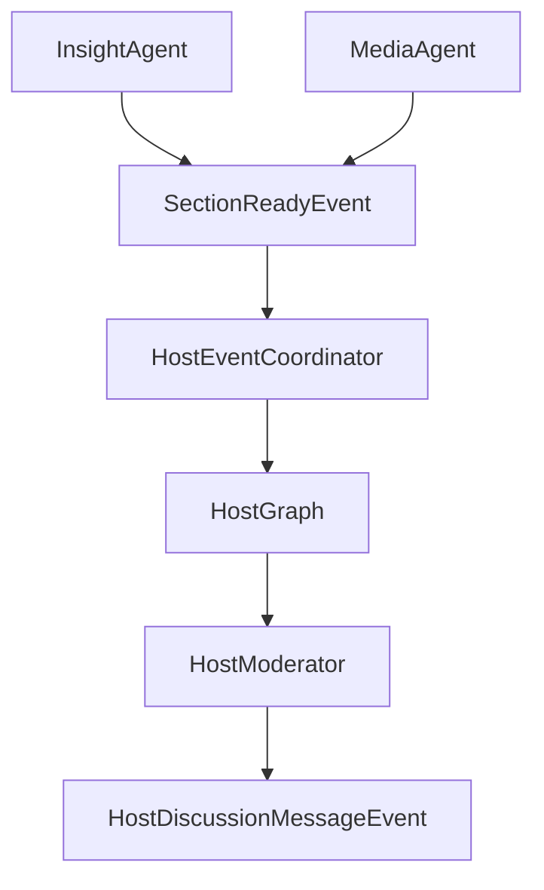
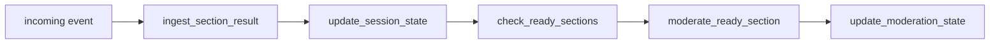
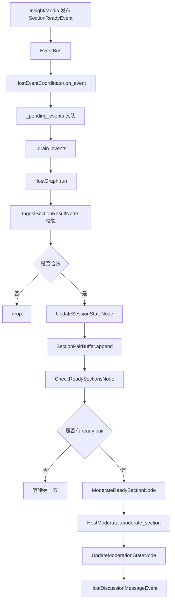
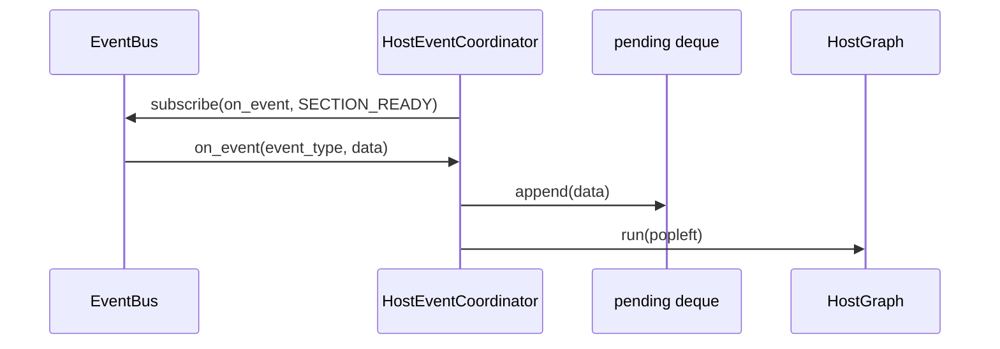
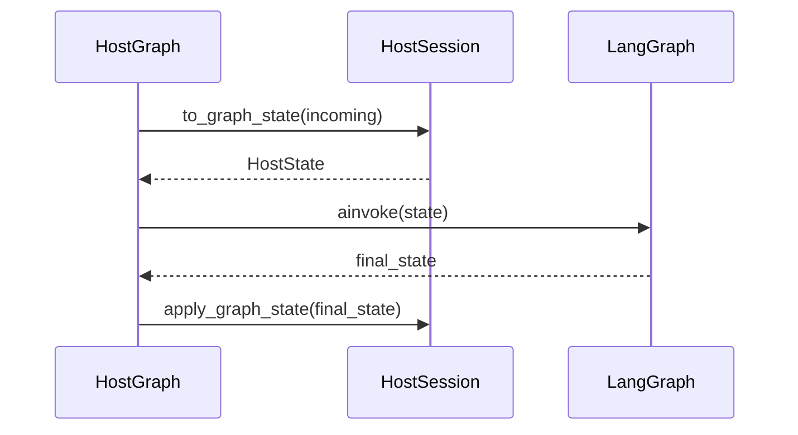
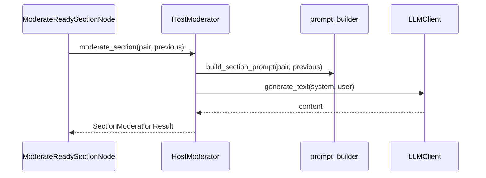
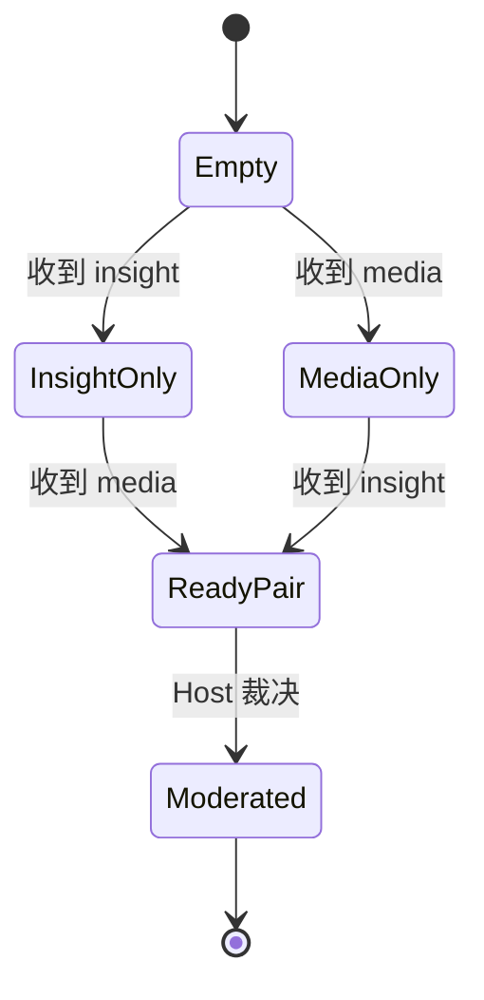
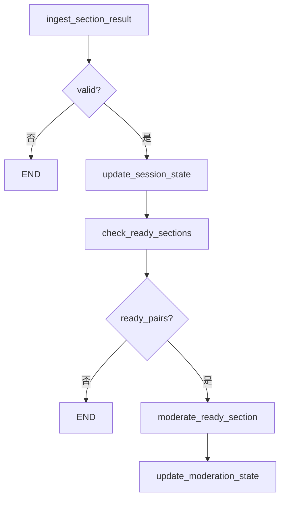
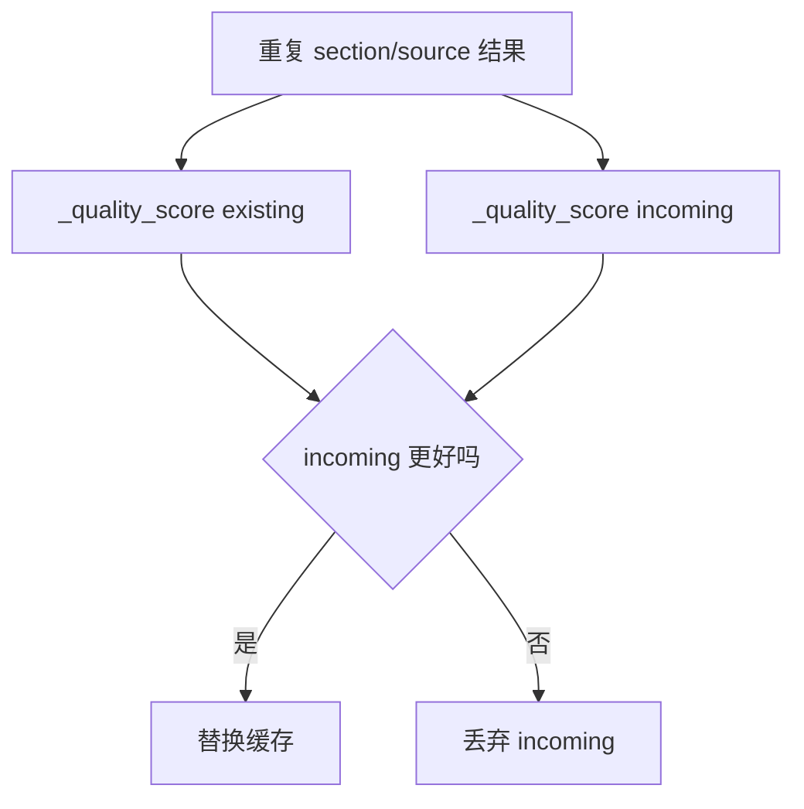

# Day05 上午：HostAgent 事件监听、章节配对、阶段裁决

## 1. 本节讲解范围

### 1.1 本节涉及的模块

#### 1.1.1 相关目录

Day03 和 Day04 已经讲完两个研究角色：

```text
InsightAgent  私域舆情研究员
MediaAgent    公开媒体研究员
```

Day05 进入第三个核心角色：

```text
HostAgent 主持人研判 Agent
```

相关目录：

```text
engines/host_agent/
engines/common/eventing/
engines/contracts/
```

#### 1.1.2 相关文件

本节重点讲：

```text
engines/host_agent/coordinator.py
engines/host_agent/graph.py
engines/host_agent/state.py
engines/host_agent/context.py
engines/host_agent/schemas.py
engines/host_agent/pairing.py
engines/host_agent/prompt_builder.py
engines/host_agent/moderator.py
engines/host_agent/nodes/ingest_node.py
engines/host_agent/nodes/session_node.py
engines/host_agent/nodes/moderation_node.py
```

#### 1.1.3 本节范围边界

本节重点讲 HostAgent 的阶段性研判：

```text
监听 section_ready 事件
接收 Insight/Media 章节结果
校验事件合法性
缓存章节结果
等待同一维度双方到齐
调用 HostModerator 生成阶段性裁决
发布主持人讨论消息
```

最终裁判报告和落盘细节放到 Day05 下午讲。

### 1.2 本节要解决的问题

#### 1.2.1 核心问题

本节要解决：

```text
1. HostAgent 为什么不是由 HTTP 接口直接触发
2. HostEventCoordinator 如何监听 section_ready
3. SectionResult 如何从事件载荷转换而来
4. SectionPairBuffer 如何等待 Insight 和 Media 到齐
5. HostGraph 如何处理一次 incoming 事件
6. HostModerator 如何把双方输出变成阶段性研判
```

#### 1.2.2 理解难点

HostAgent 的难点在于它是事件驱动的。

InsightAgent 和 MediaAgent 是主动执行图。

HostAgent 则是被动等待：

```text
谁完成一个章节
谁发布 section_ready
HostAgent 就接收一个事件
```

但 HostAgent 不能收到一个事件就立刻研判。

它必须等同一个 `section_key` 下：

```text
insight 结果到达
media 结果到达
```

两边都到齐后，才进行主持人裁决。

#### 1.2.3 和前面课程的关系

Day03 上午讲过证据契约。

Day03 下午讲 Insight 证据如何产出。

Day04 讲 Media 搜索证据如何产出。

本节讲：

```text
两边的章节证据如何在 HostAgent 汇合。
```

## 2. 本节在项目中的位置

### 2.1 全局架构定位

#### 2.1.1 当前模块属于哪一层

HostAgent 属于三 Agent 编排中的裁决层。

它不负责原始检索。

它负责对齐同一维度下两个研究角色的输出，做：

```text
共识提取
分歧识别
证据强度判断
数据缺口识别
阶段性主持人判断
```

#### 2.1.2 上游模块是谁

上游是：

```text
InsightAgent SummarizeNode
MediaAgent SummarizeNode
```

它们都会发布：

```text
SectionReadyEvent
```

#### 2.1.3 下游模块是谁

下游是：

```text
HostDiscussionMessageEvent
HostDiscussionService
ReportEngine
前端讨论流
```

阶段性研判既会进入讨论消息，也会成为最终 Host 报告的基础。

### 2.2 当前模块的职责边界

#### 2.2.1 它负责什么

HostAgent 负责：

```text
监听 section_ready
校验 source 和 section_key
缓存章节结果
配对同维度 Insight/Media 结果
调用 Host LLM 进行研判
维护全局共识/分歧/风险
输出主持人消息
```

#### 2.2.2 它不负责什么

HostAgent 不负责：

```text
私域召回
公开搜索
章节正文原始写作
最终综合报告 HTML 渲染
前端展示
```

#### 2.2.3 为什么这样分层

如果没有 HostAgent，最终报告只能把 Insight 和 Media 拼在一起。

但项目需要的是：

```text
主持人研判
```

也就是根据证据强弱和数据源差异，判断双方哪里一致、哪里冲突、谁更可信。

### 2.3 位置流程图

#### 2.3.1 全局位置图



#### 2.3.2 HostGraph 放大图



#### 2.3.3 图中每个节点的含义

`HostEventCoordinator` 是事件监听入口。

`HostGraph` 是单次事件处理状态机。

`SectionPairBuffer` 是跨事件长期缓存。

`HostModerator` 是调用 LLM 做研判的对象。

`HostDiscussionMessageEvent` 是给前端讨论流的消息。

## 3. 总体逻辑流程图

### 3.1 主流程说明

#### 3.1.1 输入从哪里来

输入来自事件总线：

```text
EventType.SECTION_READY
```

事件载荷来自 Insight/Media 的章节写作节点。

#### 3.1.2 中间经过哪些步骤

完整过程：

```text
HostEventCoordinator.start
-> subscribe(on_event, SECTION_READY)
-> on_event
-> record_section_result
-> _pending_events 入队
-> _drain_events
-> HostGraph.run
-> IngestSectionResultNode
-> UpdateSessionStateNode
-> CheckReadySectionsNode
-> ModerateReadySectionNode
-> UpdateModerationStateNode
-> 发布 outbox 消息
```

#### 3.1.3 输出到哪里去

输出是：

```text
HostDiscussionMessageEvent
```

它会通过事件总线发布，后续被讨论消息服务和前端消费。

### 3.2 主流程图

#### 3.2.1 Mermaid 流程图



#### 3.2.2 流程图逐节点解释

HostAgent 每次处理一个 incoming event。

如果事件不是 insight/media，直接丢弃。

如果 section_key 不在固定五维中，也丢弃。

合法事件进入 `SectionPairBuffer`。

只有同一维度下双方结果都到齐时，才触发 LLM 裁决。

#### 3.2.3 关键转折点

关键转折点：

```text
事件载荷 -> SectionResult
单方结果 -> SectionPairBuffer 缓存
双方到齐 -> SectionPair
SectionPair -> HostModerator 研判
研判结果 -> HostDiscussionMessageEvent
```

### 3.3 主流程中的核心判断

#### 3.3.1 事件合法性判断

HostAgent 只接受：

```text
source in {"insight", "media"}
section_key in DIMENSION_KEYS
```

#### 3.3.2 配对就绪判断

同一 `section_key` 必须同时存在：

```text
insight
media
```

#### 3.3.3 质量覆盖判断

如果同一 source 重复提交同一 section_key，`SectionPairBuffer` 会用 `_quality_score()` 判断是否替换。

优先级：

```text
evidence_strength
hit_count
sources 数量
body 长度
```

## 4. 核心数据流图

### 4.1 输入数据结构

#### 4.1.1 SectionReadyEvent

输入字段包括：

```text
source
agent
section_key
section_index
title
query
body
hit_count
used_query
sources
evidence_pack
evidence_strength
missing_notes
```

#### 4.1.2 SectionResult

HostAgent 内部会转成：

```text
SectionResult
```

它是不可变 dataclass。

#### 4.1.3 SectionPair

同维度下，Insight 和 Media 到齐后形成：

```text
SectionPair
```

### 4.2 中间状态变化

#### 4.2.1 HostEventCoordinator 状态

核心状态：

```text
_pending_events
_drain_task
is_generating
```

它保证事件排队顺序处理。

#### 4.2.2 HostSession 状态

核心状态：

```text
section_pairs
moderations
global_consensus
global_conflicts
global_risks
follow_up_questions
query
final_report_path
```

#### 4.2.3 SectionPairBuffer 状态

核心状态：

```text
_results
_moderated
```

`_results` 保存已收到的章节结果。

`_moderated` 保存已经裁决过的章节。

### 4.3 输出数据结构

#### 4.3.1 SectionModerationResult

阶段性研判结果包含：

```text
consensus
conflicts
conflict_explanations
evidence_judgement
data_gaps
risks
follow_up_questions
```

#### 4.3.2 HostDiscussionMessageEvent

对外讨论消息包含：

```text
type
sender
content
timestamp
source
section_key
```

#### 4.3.3 outbox

HostGraph 单次运行后，会返回 `outbox`。

Coordinator 再把 outbox 里的消息发布出去。

## 5. 核心调用链图

### 5.1 事件监听调用链

#### 5.1.1 调用链展开

```text
start
-> subscribe(on_event, SECTION_READY)
-> on_event
-> record_section_result
-> asyncio.create_task(_drain_events)
```

#### 5.1.2 时序图



#### 5.1.3 逻辑过渡

事件可能密集到来。

Coordinator 用队列削峰，保证 HostGraph 一次处理一个事件。

### 5.2 图节点调用链

#### 5.2.1 调用链展开

```text
HostGraph.run
-> session.to_graph_state
-> graph.ainvoke
-> session.apply_graph_state
-> HostGraphResult
```

#### 5.2.2 时序图



#### 5.2.3 逻辑过渡

HostGraph 单次运行是短生命周期。

HostSession 是长生命周期。

这样每个事件都可以独立进入图，但历史状态不会丢。

### 5.3 裁决调用链

#### 5.3.1 调用链展开

```text
ModerateReadySectionNode
-> HostModerator.moderate_section
-> prompt_builder.build_section_prompt
-> LLMClient.generate_text
-> _extract_structured_fields
-> SectionModerationResult
```

#### 5.3.2 时序图



#### 5.3.3 逻辑过渡

HostModerator 的输入不是简单正文。

prompt 中包含：

```text
body
hit_count
used_query
evidence_strength
missing_notes
sources_count
evidence_pack
previous_host_judgements
```

## 6. 手写真实项目核心逻辑

### 6.1 为什么手写真实项目文件

#### 6.1.1 手写不是独立 Demo

HostAgent 是项目三 Agent 协作的中枢。

如果用 demo，会看不清事件驱动、状态缓存和配对裁决的真实关系。

#### 6.1.2 本节手写哪些文件

本节手写：

```text
engines/host_agent/coordinator.py
engines/host_agent/graph.py
engines/host_agent/pairing.py
engines/host_agent/nodes/ingest_node.py
engines/host_agent/nodes/session_node.py
engines/host_agent/nodes/moderation_node.py
```

#### 6.1.3 和项目主链路的对应关系

```text
EventBus
-> HostEventCoordinator
-> HostGraph
-> SectionPairBuffer
-> HostModerator
-> HostDiscussionMessageEvent
```

### 6.2 手写代码一：`engines/host_agent/coordinator.py`

#### 6.2.1 要实现什么

实现 HostAgent 的事件监听入口。

#### 6.2.2 完整代码

完整包路径与文件名：

```text
engines/host_agent/coordinator.py
```

完整代码如下：

```python
"""HostAgent 配对裁决模块：engines/host_agent/coordinator.py。"""

import asyncio
from collections import deque
from typing import Any

from loguru import logger

from engines.common.eventing import publish_host_discussion_message, subscribe, unsubscribe
from engines.contracts.events import EventType, HostDiscussionMessageEvent
from engines.host_agent.context import HostContext
from engines.host_agent.graph import build_host_graph


class HostEventCoordinator:
    def __init__(self, context: HostContext | None = None) -> None:
        self.context = context or HostContext()
        self.graph = build_host_graph(self.context)
        self._pending_events: deque[dict[str, Any]] = deque()
        self._drain_task: asyncio.Task | None = None
        self.is_generating = False

    def start(self) -> None:
        subscribe(self.on_event, [EventType.SECTION_READY])
        logger.info("HostAgent: 已启动, 按 section_key 进行主持人研判")

    def stop(self) -> None:
        unsubscribe(self.on_event)
        self._pending_events.clear()
        self._drain_task = None
        self.graph.clear()
        self.is_generating = False
        logger.info("HostAgent: 已停止")

    def on_event(self, _event_type: str, data: dict) -> None:
        self.record_section_result(data)

    def record_section_result(self, data: dict) -> None:
        self._pending_events.append(dict(data))
        if self.is_generating:
            return
        self.is_generating = True
        self._drain_task = asyncio.create_task(self._drain_events())

    async def drain(self) -> None:
        """Wait until all queued section events have passed through HostGraph."""
        while self._drain_task is not None:
            task = self._drain_task
            await task
            if self._drain_task is task:
                break

    async def _drain_events(self) -> None:
        try:
            while self._pending_events:
                result = await self.graph.run(self._pending_events.popleft())
                for message in result.outbox:
                    self._publish_message(message)
        except Exception as exc:
            logger.exception(f"HostAgent: 主持人研判生成失败 - {exc}")
        finally:
            self.is_generating = False
            self._drain_task = None

    @staticmethod
    def _publish_message(message: HostDiscussionMessageEvent) -> None:
        publish_host_discussion_message(message)
```

#### 6.2.3 逐块解释

`start()` 订阅 `SECTION_READY`。

`record_section_result()` 把事件放入队列。

`_drain_events()` 按顺序交给 HostGraph。

`_publish_message()` 发布主持人讨论消息。

#### 6.2.4 关键设计意图

Coordinator 把事件监听和 HostGraph 执行隔离开。

### 6.3 手写代码二：`engines/host_agent/graph.py`

#### 6.3.1 要实现什么

实现 HostAgent 单次事件处理图。

#### 6.3.2 完整代码

完整包路径与文件名：

```text
engines/host_agent/graph.py
```

完整代码如下：

```python
"""HostAgent 配对裁决模块：engines/host_agent/graph.py。"""

from __future__ import annotations

from dataclasses import dataclass
from pathlib import Path
from typing import Any

from langgraph.graph import END, START, StateGraph

from engines.contracts.events import HostDiscussionMessageEvent
from engines.host_agent.context import HostContext
from engines.host_agent.nodes import (
    CheckAllSectionsDoneNode,
    CheckReadySectionsNode,
    FinalJudgementNode,
    IngestSectionResultNode,
    ModerateReadySectionNode,
    PersistHostReportNode,
    UpdateModerationStateNode,
    UpdateSessionStateNode,
)
from engines.host_agent.state import HostSession, HostState


@dataclass(frozen=True)
class HostGraphResult:
    outbox: list[HostDiscussionMessageEvent]
    final_report_path: Path | None = None
    valid: bool = True
    rejection_reason: str = ""


class HostGraph:
    def __init__(self, ctx: HostContext) -> None:
        self.ctx = ctx
        self.session = HostSession(ctx.section_pairs)
        self._app = build_graph(ctx)

    def clear(self) -> None:
        self.session.clear()

    async def run(self, data: dict[str, Any]) -> HostGraphResult:
        state = self.session.to_graph_state(data)
        final_state = await self._app.ainvoke(state)

        self.session.apply_graph_state(final_state)
        return HostGraphResult(
            outbox=list(final_state.get("outbox", [])),
            final_report_path=self.session.final_report_path,
            valid=bool(final_state.get("valid", False)),
            rejection_reason=final_state.get("rejection_reason", ""),
        )


def build_graph(ctx: HostContext) -> Any:
    graph = StateGraph(HostState)  # type: ignore[type-var]

    graph.add_node("ingest_section_result", IngestSectionResultNode(ctx))  # type: ignore[arg-type]
    graph.add_node("update_session_state", UpdateSessionStateNode(ctx))  # type: ignore[arg-type]
    graph.add_node("check_ready_sections", CheckReadySectionsNode(ctx))  # type: ignore[arg-type]
    graph.add_node("moderate_ready_section", ModerateReadySectionNode(ctx))  # type: ignore[arg-type]
    graph.add_node("update_moderation_state", UpdateModerationStateNode(ctx))  # type: ignore[arg-type]
    graph.add_node("check_all_sections_done", CheckAllSectionsDoneNode(ctx))  # type: ignore[arg-type]
    graph.add_node("final_judgement", FinalJudgementNode(ctx))  # type: ignore[arg-type]
    graph.add_node("persist_host_report", PersistHostReportNode(ctx))  # type: ignore[arg-type]

    graph.add_edge(START, "ingest_section_result")
    graph.add_conditional_edges(
        "ingest_section_result",
        _route_after_ingest,
        {"valid": "update_session_state", "drop": END},
    )
    graph.add_edge("update_session_state", "check_ready_sections")
    graph.add_conditional_edges(
        "check_ready_sections",
        _route_after_ready_check,
        {"moderate": "moderate_ready_section", "done": END},
    )
    graph.add_edge("moderate_ready_section", "update_moderation_state")
    graph.add_edge("update_moderation_state", "check_all_sections_done")
    graph.add_conditional_edges(
        "check_all_sections_done",
        _route_after_done_check,
        {"final": "final_judgement", "next": "check_ready_sections", "done": END},
    )
    graph.add_edge("final_judgement", "persist_host_report")
    graph.add_edge("persist_host_report", END)

    return graph.compile()


def build_host_graph(ctx: HostContext | None = None) -> HostGraph:
    context = ctx or HostContext()
    return HostGraph(context)


def _route_after_ingest(state: HostState) -> str:
    return "valid" if state.get("valid") else "drop"


def _route_after_ready_check(state: HostState) -> str:
    return "moderate" if state.get("ready_pairs") else "done"


def _route_after_done_check(state: HostState) -> str:
    if state.get("all_sections_done") and state.get("final_report_path") is None:
        return "final"
    if state.get("ready_pairs"):
        return "next"
    return "done"
```

#### 6.3.3 逐块解释

`HostGraph` 持有长期 `HostSession`。

`build_graph()` 定义事件处理节点。

`_route_after_ingest()` 控制非法事件丢弃。

`_route_after_ready_check()` 控制是否进入裁决。

#### 6.3.4 关键设计意图

每次事件进图，但历史状态留在 session。

### 6.4 手写代码三：`engines/host_agent/pairing.py`

#### 6.4.1 要实现什么

实现章节结果配对缓存。

#### 6.4.2 完整代码

完整包路径与文件名：

```text
engines/host_agent/pairing.py
```

完整代码如下：

```python
"""HostAgent section pairing buffer."""

from collections import OrderedDict

from engines.contracts.dimensions import DIMENSION_BY_KEY, DIMENSION_KEYS
from engines.host_agent.schemas import SectionPair, SectionResult


class SectionPairBuffer:
    def __init__(self) -> None:
        self._results: dict[str, dict[str, SectionResult]] = OrderedDict()
        self._moderated: set[str] = set()

    def clear(self) -> None:
        self._results.clear()
        self._moderated.clear()

    def append(self, result: SectionResult) -> bool:
        if result.section_key in self._moderated:
            return False
        bucket = self._results.setdefault(result.section_key, {})
        existing = bucket.get(result.source)
        if existing and _quality_score(existing) >= _quality_score(result):
            return False
        bucket[result.source] = result
        return True

    def ready_pairs(self) -> list[SectionPair]:
        return [
            self._build_pair(key) for key in DIMENSION_KEYS
            if key in self._results
            and key not in self._moderated
            and "insight" in self._results[key]
            and "media" in self._results[key]
        ]

    def mark_moderated(self, section_key: str) -> None:
        self._moderated.add(section_key)

    def all_sections_moderated(self) -> bool:
        return all(key in self._moderated for key in DIMENSION_KEYS)

    def _build_pair(self, section_key: str) -> SectionPair:
        bucket = self._results[section_key]
        title = DIMENSION_BY_KEY[section_key].title
        return SectionPair(
            section_key=section_key,
            title=title,
            insight=bucket["insight"],
            media=bucket["media"],
        )


def _quality_score(result: SectionResult) -> tuple[int, int, int, int]:
    strength_rank = {"missing": 0, "weak": 1, "medium": 2, "strong": 3}
    return (
        strength_rank.get(result.evidence_strength, 0),
        result.hit_count,
        len(result.sources),
        len(result.body),
    )
```

#### 6.4.3 逐块解释

`append()` 保存单方结果。

`ready_pairs()` 找出双方都到齐的章节。

`mark_moderated()` 标记章节已裁决。

`_quality_score()` 防止低质量重复结果覆盖高质量结果。

#### 6.4.4 关键设计意图

HostAgent 的裁决必须按维度配对。

同维度双方到齐是裁决前提。

### 6.5 手写代码四：`engines/host_agent/nodes/ingest_node.py`

#### 6.5.1 要实现什么

实现 incoming 事件校验。

#### 6.5.2 完整代码

完整包路径与文件名：

```text
engines/host_agent/nodes/ingest_node.py
```

完整代码如下：

```python
"""HostAgent 图节点模块。"""

from loguru import logger

from engines.contracts.dimensions import DIMENSION_KEYS
from engines.host_agent.context import HostContext
from engines.host_agent.schemas import SectionResult
from engines.host_agent.state import HostState


class IngestSectionResultNode:
    def __init__(self, _ctx: HostContext) -> None:
        pass

    def __call__(self, state: HostState) -> HostState:
        result = SectionResult.from_event(state.get("incoming", {}))
        if result.source not in {"insight", "media"}:
            reason = f"unknown source: {result.source!r}"
            logger.warning(f"HostAgent: dropped SECTION_READY, {reason}")
            return {"section_result": result, "valid": False, "rejection_reason": reason}
        if result.section_key not in DIMENSION_KEYS:
            reason = f"unknown section_key: {result.section_key!r}"
            logger.warning(f"HostAgent: dropped SECTION_READY, {reason}")
            return {"section_result": result, "valid": False, "rejection_reason": reason}
        return {"section_result": result, "valid": True, "rejection_reason": ""}
```

#### 6.5.3 逐块解释

它把事件 dict 转成 `SectionResult`。

然后校验来源和维度。

#### 6.5.4 关键设计意图

HostAgent 只能裁决固定研究角色和固定维度。

### 6.6 手写代码五：`engines/host_agent/nodes/session_node.py`

#### 6.6.1 要实现什么

实现 session 更新、就绪检查和完成检查。

#### 6.6.2 完整代码

完整包路径与文件名：

```text
engines/host_agent/nodes/session_node.py
```

完整代码如下：

```python
"""HostAgent 图节点模块。"""

from engines.host_agent.context import HostContext
from engines.host_agent.discussion_messages import agent_message, append_message
from engines.host_agent.state import HostState


class UpdateSessionStateNode:
    def __init__(self, _ctx: HostContext) -> None:
        pass

    def __call__(self, state: HostState) -> HostState:
        result = state["section_result"]
        section_pairs = state["section_pairs"]
        accepted = section_pairs.append(result)
        query = result.query or state.get("query", "")
        if not accepted:
            return {"section_pairs": section_pairs, "query": query}
        outbox = append_message(state, agent_message(result))
        return {"section_pairs": section_pairs, "query": query, "outbox": outbox}


class CheckReadySectionsNode:
    def __init__(self, _ctx: HostContext) -> None:
        pass

    def __call__(self, state: HostState) -> HostState:
        return {"ready_pairs": state["section_pairs"].ready_pairs()}


class CheckAllSectionsDoneNode:
    def __init__(self, _ctx: HostContext) -> None:
        pass

    def __call__(self, state: HostState) -> HostState:
        return {"all_sections_done": state["section_pairs"].all_sections_moderated()}
```

#### 6.6.3 逐块解释

`UpdateSessionStateNode` 把章节结果放进配对缓存。

`CheckReadySectionsNode` 找出已经可以裁决的配对。

`CheckAllSectionsDoneNode` 判断五个维度是否全部裁决。

#### 6.6.4 关键设计意图

状态更新和裁决调用分开，图结构更清晰。

## 7. 手写逻辑执行流程图

### 7.1 事件监听流程

#### 7.1.1 第一步执行什么

HostAgent 启动时订阅 `SECTION_READY`。

#### 7.1.2 第二步执行什么

收到事件后进入 pending 队列。

#### 7.1.3 最终得到什么

事件按顺序交给 HostGraph。

### 7.2 章节配对流程

#### 7.2.1 第一步执行什么

把事件转换为 `SectionResult`。

#### 7.2.2 第二步执行什么

按 `section_key` 和 `source` 写入 `SectionPairBuffer`。

#### 7.2.3 最终得到什么

同一维度双方到齐时形成 `SectionPair`。

### 7.3 阶段裁决流程

#### 7.3.1 第一步执行什么

取出一个 ready pair。

#### 7.3.2 第二步执行什么

调用 HostModerator 生成研判。

#### 7.3.3 最终得到什么

保存 `SectionModerationResult`，发布主持人消息。

### 7.4 手写流程图

#### 7.4.1 配对状态图



#### 7.4.2 HostGraph 路由图



#### 7.4.3 质量替换图



## 8. 项目源码解读

### 8.1 文件一：`engines/host_agent/state.py`

#### 8.1.1 文件职责

定义 HostGraph 状态和长期 HostSession。

#### 8.1.2 为什么需要这个文件

HostGraph 每次处理一个事件，但 HostAgent 必须保留跨事件状态。

#### 8.1.3 上游调用者

```text
HostGraph
Host nodes
```

#### 8.1.4 下游依赖

```text
SectionPairBuffer
HostReportWriter
```

#### 8.1.5 完整源码

完整包路径与文件名：

```text
engines/host_agent/state.py
```

完整代码如下：

```python
"""HostAgent 配对裁决模块：engines/host_agent/state.py。"""

from __future__ import annotations

from dataclasses import dataclass, field
from pathlib import Path
from typing import Any, TypedDict

from engines.contracts.events import HostDiscussionMessageEvent
from engines.host_agent.pairing import SectionPairBuffer
from engines.host_agent.schemas import HostSpeech, SectionModerationResult, SectionPair, SectionResult


class HostState(TypedDict, total=False):
    incoming: dict[str, Any]
    section_result: SectionResult
    valid: bool
    rejection_reason: str
    query: str
    section_pairs: SectionPairBuffer
    ready_pairs: list[SectionPair]
    current_pair: SectionPair
    current_moderation: SectionModerationResult | None
    moderations: list[SectionModerationResult]
    global_consensus: list[str]
    global_conflicts: list[str]
    global_risks: list[str]
    follow_up_questions: list[str]
    all_sections_done: bool
    final_report: HostSpeech | None
    final_report_path: Path | None
    outbox: list[HostDiscussionMessageEvent]


@dataclass
class HostSession:
    """Long-lived HostAgent session state between SectionReady events."""

    section_pairs: SectionPairBuffer
    moderations: list[SectionModerationResult] = field(default_factory=list)
    global_consensus: list[str] = field(default_factory=list)
    global_conflicts: list[str] = field(default_factory=list)
    global_risks: list[str] = field(default_factory=list)
    follow_up_questions: list[str] = field(default_factory=list)
    query: str = ""
    final_report_path: Path | None = None

    def clear(self) -> None:
        self.section_pairs.clear()
        self.moderations.clear()
        self.global_consensus.clear()
        self.global_conflicts.clear()
        self.global_risks.clear()
        self.follow_up_questions.clear()
        self.query = ""
        self.final_report_path = None

    def to_graph_state(self, incoming: dict[str, Any]) -> HostState:
        return {
            "incoming": incoming,
            "section_pairs": self.section_pairs,
            "moderations": list(self.moderations),
            "global_consensus": list(self.global_consensus),
            "global_conflicts": list(self.global_conflicts),
            "global_risks": list(self.global_risks),
            "follow_up_questions": list(self.follow_up_questions),
            "query": self.query,
            "final_report_path": self.final_report_path,
            "outbox": [],
        }

    def apply_graph_state(self, state: HostState) -> None:
        self.moderations = list(state.get("moderations", []))
        self.global_consensus = list(state.get("global_consensus", []))
        self.global_conflicts = list(state.get("global_conflicts", []))
        self.global_risks = list(state.get("global_risks", []))
        self.follow_up_questions = list(state.get("follow_up_questions", []))
        self.query = state.get("query", "")
        self.final_report_path = state.get("final_report_path")
```

#### 8.1.6 代码逐块解释

`HostState` 是图运行时状态。

`HostSession` 是跨事件长期状态。

`to_graph_state()` 把长期状态注入单次图运行。

`apply_graph_state()` 把图运行结果写回长期状态。

#### 8.1.7 关键设计意图

事件是离散的，但裁决上下文是连续的。

#### 8.1.8 如果不这样设计会怎样

每次事件都会丢失之前收到的章节结果，无法完成配对。

### 8.2 文件二：`engines/host_agent/moderator.py`

#### 8.2.1 文件职责

调用 Host LLM 生成阶段性研判。

#### 8.2.2 为什么需要这个文件

HostGraph 节点不应该直接拼 prompt、调 LLM、解析字段。

#### 8.2.3 上游调用者

```text
ModerateReadySectionNode
FinalJudgementNode
```

#### 8.2.4 下游依赖

```text
LLMClient
prompt_builder
prompts
```

#### 8.2.5 完整源码

完整包路径与文件名：

```text
engines/host_agent/moderator.py
```

完整代码如下：

```python
"""HostAgent 配对裁决模块：engines/host_agent/moderator.py。"""

import re
from typing import Any

from loguru import logger

from engines.common.runtime.call_retry import SEARCH_API_RETRY_CONFIG, with_graceful_retry
from engines.contracts.roles import HOST_LLM_ROLE
from engines.host_agent import prompt_builder
from engines.host_agent import prompts
from engines.host_agent.schemas import HostSpeech, SectionModerationResult, SectionPair
from engines.llm.llm_client import LLMClient


class HostModerator:
    def __init__(self, llm_client: LLMClient | None = None) -> None:
        self.llm_client = llm_client or LLMClient.from_role(HOST_LLM_ROLE)

    async def moderate_section(
        self,
        pair: SectionPair,
        previous: list[SectionModerationResult],
    ) -> SectionModerationResult | None:
        try:
            response = await self._call_llm(
                prompts.SYSTEM_PROMPT,
                prompt_builder.build_section_prompt(pair, previous),
                temperature=0.5,
            )
            if not response["success"]:
                logger.warning(f"HostModerator: API 调用失败 - {response.get('error', '未知错误')}")
                return None
            content = self._format_reply(response["content"])
            fields = self._extract_structured_fields(content)
            return SectionModerationResult(
                section_key=pair.section_key,
                title=pair.title,
                content=content,
                consensus=fields["consensus"],
                conflicts=fields["conflicts"],
                conflict_explanations=fields["conflict_explanations"],
                evidence_judgement=fields["evidence_judgement"],
                data_gaps=fields["data_gaps"],
                risks=fields["risks"],
                follow_up_questions=fields["follow_up_questions"],
            )
        except Exception as exc:
            logger.exception(f"HostModerator: 章节研判生成失败 - {exc}")
            return None

    async def generate_final_report(
        self,
        results: list[SectionModerationResult],
    ) -> HostSpeech | None:
        try:
            response = await self._call_llm(
                prompts.FINAL_SYSTEM_PROMPT,
                prompt_builder.build_final_prompt(results),
                temperature=0.4,
            )
            if not response["success"]:
                logger.warning(f"HostModerator: 最终报告 API 调用失败 - {response.get('error', '未知错误')}")
                return None
            return HostSpeech(content=self._format_reply(response["content"]))
        except Exception as exc:
            logger.exception(f"HostModerator: 最终裁判报告生成失败 - {exc}")
            return None

    @with_graceful_retry(config=SEARCH_API_RETRY_CONFIG, default_return={"success": False, "error": "API服务暂时不可用"})
    async def _call_llm(
        self,
        system_prompt: str,
        user_prompt: str,
        temperature: float,
    ) -> dict[str, Any]:
        try:
            content = await self.llm_client.generate_text(
                system_prompt,
                user_prompt,
                temperature=temperature,
                top_p=0.9,
            )
            if content:
                return {"success": True, "content": content}
            return {"success": False, "error": "API返回格式异常"}
        except Exception as exc:
            return {"success": False, "error": f"API调用异常: {exc}"}

    @staticmethod
    def _format_reply(speech: str) -> str:
        speech = re.sub(r"\n{3,}", "\n\n", speech)
        speech = speech.strip('"\'""‘’')
        return speech.strip()

    @staticmethod
    def _extract_structured_fields(content: str) -> dict[str, tuple[str, ...] | str]:
        sections = HostModerator._split_markdown_sections(content)
        consensus = _items_from_sections(sections, ("共识", "双方共识"))
        conflicts = _items_from_sections(sections, ("分歧", "关键分歧"))
        evidence_items = _items_from_sections(sections, ("证据", "证据强度"))
        gaps = _items_from_sections(sections, ("缺口", "数据缺口"))
        risks = _items_from_sections(sections, ("风险", "风险提示"))
        questions = _items_from_sections(sections, ("待补充", "后续"))
        return {
            "consensus": consensus,
            "conflicts": conflicts,
            "conflict_explanations": _items_from_sections(sections, ("原因", "解释")),
            "evidence_judgement": "\n".join(evidence_items[:3]),
            "data_gaps": gaps,
            "risks": risks,
            "follow_up_questions": questions,
        }

    @staticmethod
    def _split_markdown_sections(content: str) -> dict[str, str]:
        headings = list(re.finditer(r"(?m)^\s*(?:#{1,6}\s*)?(?:[一二三四五六七八九十]+、|\d+[.、])?\s*([^:\n：]{2,30})(?:[:：])?\s*$", content))
        sections: dict[str, str] = {}
        for index, match in enumerate(headings):
            start = match.end()
            end = headings[index + 1].start() if index + 1 < len(headings) else len(content)
            title = match.group(1).strip()
            body = content[start:end].strip()
            if body:
                sections[title] = body
        if not sections:
            sections["全文"] = content
        return sections


def _items_from_sections(sections: dict[str, str], title_tokens: tuple[str, ...]) -> tuple[str, ...]:
    items: list[str] = []
    for title, body in sections.items():
        if any(token in title for token in title_tokens):
            items.extend(_extract_list_items(body))
    return tuple(items)


def _extract_list_items(text: str, limit: int = 8) -> list[str]:
    items = []
    for line in text.splitlines():
        item = re.sub(r"^\s*(?:[-*•]|\d+[.、]|\([一二三四五六七八九十]\))\s*", "", line).strip()
        if item:
            items.append(item)
    if not items and text.strip():
        items = [text.strip()]
    return items[:limit]
```

#### 8.2.6 代码逐块解释

`moderate_section()` 生成单章节裁决。

`generate_final_report()` 生成最终报告，下午会继续讲。

`_extract_structured_fields()` 从 LLM 文本中提取共识、分歧、证据、缺口等结构化字段。

#### 8.2.7 关键设计意图

LLM 输出是文本，但系统仍需要把关键项沉淀为结构化状态。

#### 8.2.8 如果不这样设计会怎样

最终报告无法稳定汇总全局共识、风险和待补充问题。

## 9. 关键对象与状态拆解

### 9.1 核心对象一：`HostEventCoordinator`

#### 9.1.1 对象定义

HostAgent 的事件入口和队列协调器。

#### 9.1.2 字段含义

```text
context
graph
_pending_events
_drain_task
is_generating
```

#### 9.1.3 生命周期

由应用生命周期服务启动和停止。

### 9.2 核心对象二：`SectionPairBuffer`

#### 9.2.1 对象定义

章节配对缓存。

#### 9.2.2 字段含义

```text
_results
_moderated
```

#### 9.2.3 生命周期

贯穿一次研究任务的 HostAgent 会话。

### 9.3 核心对象三：`SectionModerationResult`

#### 9.3.1 对象定义

主持人阶段性研判结果。

#### 9.3.2 字段含义

```text
consensus
conflicts
evidence_judgement
data_gaps
risks
follow_up_questions
```

#### 9.3.3 生命周期

由 HostModerator 生成。

保存进 HostSession。

## 10. 边界情况与异常分支

### 10.1 非法 source

#### 10.1.1 什么情况下发生

事件来源不是：

```text
insight
media
```

#### 10.1.2 代码如何处理

`IngestSectionResultNode` 返回 `valid=False`。

#### 10.1.3 为什么这样处理

HostAgent 只裁决两个研究角色。

### 10.2 非法 section_key

#### 10.2.1 什么情况下发生

章节维度不在固定五维中。

#### 10.2.2 代码如何处理

事件被丢弃。

#### 10.2.3 为什么这样处理

如果维度不固定，就无法配对。

### 10.3 一方迟迟不到

#### 10.3.1 什么情况下发生

Insight 或 Media 某个章节尚未发布。

#### 10.3.2 代码如何处理

`ready_pairs()` 返回空，HostGraph 结束本次运行。

#### 10.3.3 为什么这样处理

HostAgent 等下一次事件触发，不阻塞当前流程。

### 10.4 LLM 裁决失败

#### 10.4.1 什么情况下发生

Host LLM 调用失败或返回空内容。

#### 10.4.2 代码如何处理

`HostModerator` 返回 `None`。

#### 10.4.3 为什么这样处理

单次裁决失败不应让 HostAgent 进程崩溃。

## 11. 本节代码在完整链路中的作用

### 11.1 本节之前发生了什么

#### 11.1.1 上一段链路输出

InsightAgent 和 MediaAgent 已经发布章节事件。

#### 11.1.2 本节接收的数据

本节接收：

```text
SectionReadyEvent
```

#### 11.1.3 本节开始的条件

HostAgent 已经在应用生命周期中启动并订阅事件。

### 11.2 本节推进了什么

#### 11.2.1 推进了哪一步业务

本节把两个研究角色的章节结果推进成主持人阶段性研判。

#### 11.2.2 改变了哪些状态

改变：

```text
SectionPairBuffer
HostSession.moderations
global_consensus
global_conflicts
global_risks
follow_up_questions
```

#### 11.2.3 产出了哪些结果

产出：

```text
SectionModerationResult
HostDiscussionMessageEvent
主持人阶段性裁决内容
```

### 11.3 本节之后交给谁

#### 11.3.1 下游模块

下游是：

```text
Host final judgement
Host report persistence
ReportEngine
前端讨论消息展示
```

#### 11.3.2 下游输入

下游输入是：

```text
五个 SectionModerationResult
```

#### 11.3.3 下一节课如何衔接

Day05 下午继续讲：

```text
HostAgent 最终裁判报告如何生成
主持人讨论消息如何构造
Host 报告如何落盘
app/services/host 如何提供讨论消息和运行时服务
```
