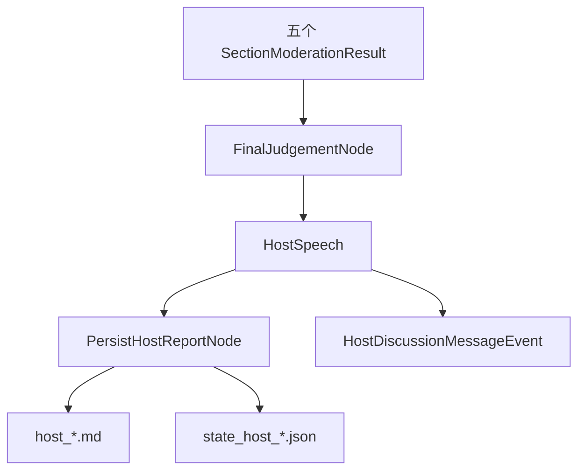
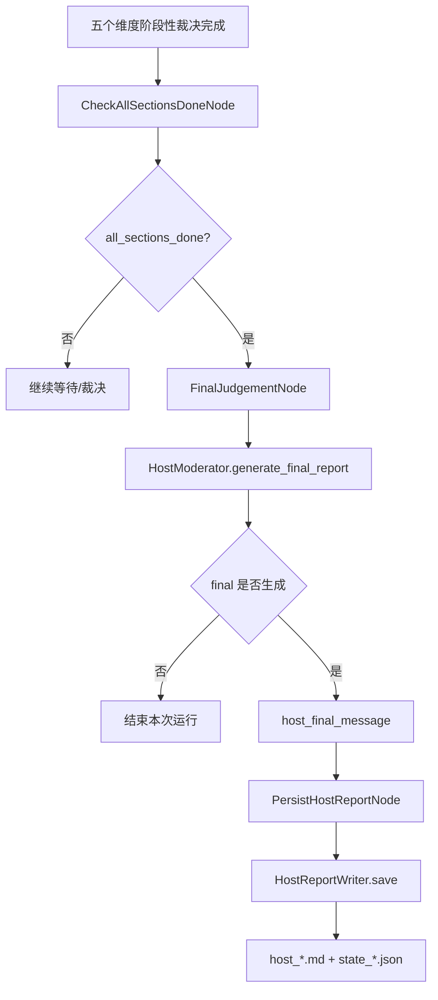
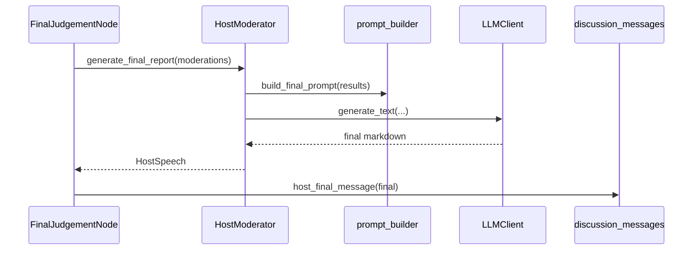
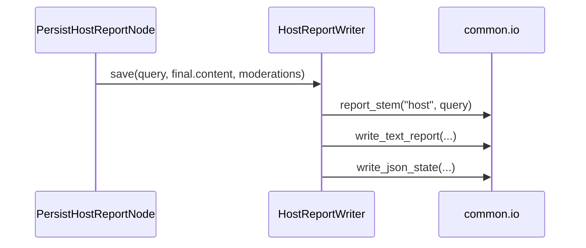
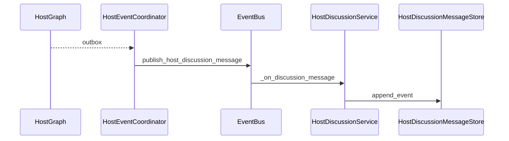
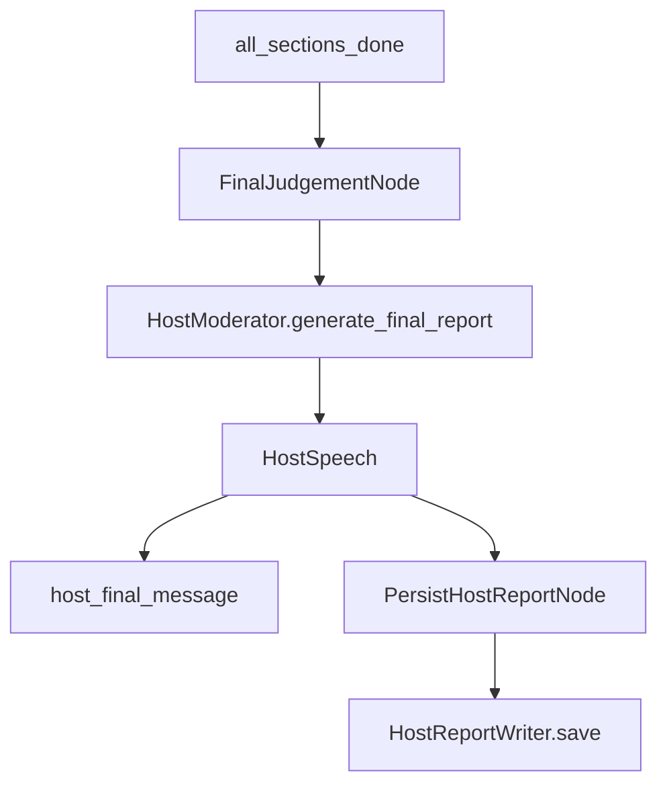

# Day05 下午：最终裁判报告、讨论消息、应用层接口

## 1. 本节讲解范围

### 1.1 本节涉及的模块

#### 1.1.1 相关目录

上午已经讲了 HostAgent 如何监听事件、配对章节、生成阶段性裁决。

下午继续讲 HostAgent 的后半段：

```text
五个维度全部裁决完成后，如何生成最终裁判报告；
HostAgent 的讨论消息如何保存；
app/services/host 如何把 HostAgent 能力暴露给 API。
```

相关目录：

```text
engines/host_agent/
engines/orchestration/
app/services/host/
app/routers/rest/
app/schemas/
```

#### 1.1.2 相关文件

本节重点讲：

```text
engines/host_agent/nodes/final_judgement_node.py
engines/host_agent/nodes/persist_node.py
engines/host_agent/discussion_messages.py
engines/host_agent/persistence.py
engines/host_agent/moderator.py
engines/orchestration/host_runtime.py
app/services/host/coordinator_service.py
app/services/host/discussion.py
app/services/host/discussion_store.py
app/routers/rest/host.py
app/schemas/host.py
```

#### 1.1.3 本节范围边界

本节不再展开 Insight/Media 的证据来源。

本节关注 HostAgent 的最终产物：

```text
最终裁判报告
讨论消息流
Host 报告文件
Host 应用服务
Host REST 接口
```

### 1.2 本节要解决的问题

#### 1.2.1 核心问题

本节要解决：

```text
1. HostAgent 什么时候生成最终裁判报告
2. FinalJudgementNode 如何调用 HostModerator
3. PersistHostReportNode 如何把报告落盘
4. HostDiscussionMessageEvent 如何进入内存消息列表
5. HostCoordinatorService 为什么只是 runtime facade
6. /api/host/start、/api/host/stop、/api/host/discussion 分别做什么
```

#### 1.2.2 理解难点

HostAgent 的最终报告不是独立生成的。

它依赖五个阶段性裁决：

```text
background_overview
heat_and_spread
sentiment_and_opinion
platform_and_group_diff
deep_causes_and_impact
```

只有五个维度都裁决完成后，才进入最终裁判报告生成。

#### 1.2.3 和上午的关系

上午讲到：

```text
SectionPair -> SectionModerationResult
```

下午继续：

```text
list[SectionModerationResult] -> HostSpeech -> Host Report File
```

## 2. 本节在项目中的位置

### 2.1 全局架构定位

#### 2.1.1 当前模块属于哪一层

本节横跨两层：

```text
engines/host_agent    HostAgent 内核层
app/services/host     应用服务层
```

内核层负责最终裁判报告和消息事件。

应用服务层负责启动/停止 runtime，以及提供讨论日志查询。

#### 2.1.2 上游模块是谁

上游是上午讲的：

```text
UpdateModerationStateNode
CheckAllSectionsDoneNode
HostSession
```

当 `all_sections_done=True` 时，才进入最终报告生成。

#### 2.1.3 下游模块是谁

下游包括：

```text
HostReportWriter
HostDiscussionService
HostDiscussionMessageStore
ReportInputService
Final ReportEngine
前端讨论日志
```

### 2.2 当前模块的职责边界

#### 2.2.1 它负责什么

HostAgent 最终阶段负责：

```text
基于阶段性研判生成最终裁判报告
把最终报告写入 data/report/host
把 Host 消息发布到事件总线
把讨论消息保存在内存
提供 HostAgent 启停接口
提供讨论日志查询接口
```

#### 2.2.2 它不负责什么

它不负责：

```text
最终综合报告 HTML 渲染
ReportEngine 的 Markdown 生成
前端页面展示
Insight/Media 重新执行
```

#### 2.2.3 为什么这样分层

HostAgent 的最终报告是三 Agent 协作中的“主持人裁判意见”。

最终综合报告还会由 ReportEngine 继续整合：

```text
host_report
insight_report
media_report
host_discussion
```

所以 HostAgent 只负责主持人侧产物，不直接做最终 HTML 报告。

### 2.3 位置流程图

#### 2.3.1 Host 最终阶段位置图



#### 2.3.2 应用层位置图

```mermaid
flowchart LR
    Router[/api/host/*] --> Service[app/services/host]
    Service --> Runtime[HostAgentRuntime]
    Runtime --> Coordinator[HostEventCoordinator]
    Coordinator --> EventBus[EventBus]
```

#### 2.3.3 讨论消息位置图

```mermaid
flowchart LR
    HostAgent[HostAgent outbox] --> Event[HOST_DISCUSSION_MESSAGE]
    Event --> DiscussionService[HostDiscussionService]
    DiscussionService --> Store[HostDiscussionMessageStore]
    Store --> API[/api/host/discussion]
```

## 3. 总体逻辑流程图

### 3.1 最终报告主流程

#### 3.1.1 输入从哪里来

输入来自 HostSession 中积累的：

```text
moderations: list[SectionModerationResult]
```

每个 moderation 都是一个维度的主持人阶段性研判。

#### 3.1.2 中间经过哪些步骤

最终报告流程：

```text
CheckAllSectionsDoneNode
-> _route_after_done_check
-> FinalJudgementNode
-> HostModerator.generate_final_report
-> host_final_message
-> PersistHostReportNode
-> HostReportWriter.save
```

#### 3.1.3 输出到哪里去

输出有三类：

```text
HostSpeech final_report
HostDiscussionMessageEvent
host Markdown 报告文件和 state JSON
```

### 3.2 主流程图

#### 3.2.1 Mermaid 流程图



#### 3.2.2 流程图逐节点解释

`FinalJudgementNode` 只负责生成最终报告内容。

`PersistHostReportNode` 只负责落盘。

`HostReportWriter` 只负责文件命名和写入。

`HostDiscussionMessageEvent` 让前端讨论流看到最终主持人发言。

#### 3.2.3 关键转折点

关键转折点：

```text
阶段性研判列表 -> 最终裁判报告
HostSpeech -> HostDiscussionMessageEvent
HostSpeech -> Markdown 文件
```

### 3.3 应用层主流程

#### 3.3.1 启动流程

```text
GET /api/host/start
-> HostCoordinatorService.start
-> HostAgentRuntime.start
-> HostEventCoordinator.start
-> subscribe SECTION_READY
```

#### 3.3.2 停止流程

```text
GET /api/host/stop
-> HostCoordinatorService.stop
-> HostAgentRuntime.stop
-> HostEventCoordinator.stop
-> unsubscribe SECTION_READY
```

#### 3.3.3 讨论查询流程

```text
GET /api/host/discussion
-> HostDiscussionService.get_log
-> HostDiscussionMessageStore.get_log
```

## 4. 核心数据流图

### 4.1 输入数据结构

#### 4.1.1 SectionModerationResult

最终报告输入是多个阶段性裁决。

每个裁决包含：

```text
section_key
title
content
consensus
conflicts
evidence_judgement
data_gaps
risks
follow_up_questions
```

#### 4.1.2 HostSpeech

最终报告生成后封装成：

```text
HostSpeech(content=...)
```

#### 4.1.3 HostDiscussionMessageEvent

讨论流使用统一消息事件：

```text
type
sender
content
timestamp
source
section_key
```

### 4.2 中间状态变化

#### 4.2.1 HostState

最终阶段新增或更新：

```text
final_report
final_report_path
outbox
```

#### 4.2.2 HostDiscussionMessageStore

讨论消息存储维护：

```text
_messages
```

最多保留 2000 条。

#### 4.2.3 HostAgentRuntime

运行时维护：

```text
_coordinator
```

用于幂等启动和停止。

### 4.3 输出数据结构

#### 4.3.1 Host Markdown 报告

保存路径类似：

```text
data/report/host/host_主题_时间戳.md
```

#### 4.3.2 Host state JSON

保存：

```text
query
moderations
global_consensus
global_conflicts
global_risks
follow_up_questions
final_report
is_completed
```

#### 4.3.3 API 响应

Host 接口响应：

```text
HostActionResponse
HostDiscussionLogResponse
```

## 5. 核心调用链图

### 5.1 最终报告调用链

#### 5.1.1 调用链展开

```text
FinalJudgementNode
-> HostModerator.generate_final_report
-> prompt_builder.build_final_prompt
-> LLMClient.generate_text
-> HostSpeech
-> host_final_message
```

#### 5.1.2 时序图



#### 5.1.3 逻辑过渡

最终报告不是重新读取 Insight/Media 原始报告。

它基于 Host 已经产生的五个阶段性研判。

### 5.2 落盘调用链

#### 5.2.1 调用链展开

```text
PersistHostReportNode
-> HostReportWriter.save
-> report_stem
-> write_text_report
-> write_json_state
```

#### 5.2.2 时序图



#### 5.2.3 逻辑过渡

Host 报告和 Host state 同时保存。

Markdown 给后续 ReportEngine 读取。

JSON 给排查和状态追踪使用。

### 5.3 讨论消息调用链

#### 5.3.1 调用链展开

```text
HostGraph outbox
-> HostEventCoordinator._publish_message
-> publish_host_discussion_message
-> HostDiscussionService._on_discussion_message
-> HostDiscussionMessageStore.append_event
```

#### 5.3.2 时序图



#### 5.3.3 逻辑过渡

HostAgent 不直接写前端状态。

它只发布事件。

讨论服务订阅事件，再维护内存消息列表。

## 6. 手写真实项目核心逻辑

### 6.1 为什么手写真实项目文件

#### 6.1.1 手写不是独立 Demo

最终裁判报告和讨论消息贯穿 engines 层和 app 层。

必须用真实项目文件讲清楚层次。

#### 6.1.2 本节手写哪些文件

本节手写：

```text
engines/host_agent/nodes/final_judgement_node.py
engines/host_agent/nodes/persist_node.py
engines/host_agent/discussion_messages.py
engines/host_agent/persistence.py
engines/orchestration/host_runtime.py
app/services/host/coordinator_service.py
app/services/host/discussion.py
app/services/host/discussion_store.py
app/routers/rest/host.py
```

#### 6.1.3 和项目主链路的对应关系

```text
FinalJudgementNode
-> PersistHostReportNode
-> HostReportWriter
-> HostDiscussionService
-> REST API
```

### 6.2 手写代码一：`engines/host_agent/nodes/final_judgement_node.py`

#### 6.2.1 要实现什么

实现最终裁判报告生成节点。

#### 6.2.2 完整代码

完整包路径与文件名：

```text
engines/host_agent/nodes/final_judgement_node.py
```

完整代码如下：

```python
"""HostAgent 图节点模块。"""

from engines.host_agent.context import HostContext
from engines.host_agent.discussion_messages import append_message, host_final_message
from engines.host_agent.state import HostState


class FinalJudgementNode:
    def __init__(self, ctx: HostContext) -> None:
        self.ctx = ctx

    async def __call__(self, state: HostState) -> HostState:
        if state.get("final_report_path") is not None:
            return {"final_report": None}
        final = await self.ctx.moderator.generate_final_report(list(state.get("moderations", [])))
        if not final:
            return {"final_report": None}
        outbox = append_message(state, host_final_message(final))
        return {"final_report": final, "outbox": outbox}
```

#### 6.2.3 逐块解释

如果已经有 `final_report_path`，说明最终报告已生成，不重复生成。

`generate_final_report()` 基于阶段性研判列表生成最终报告。

`host_final_message()` 把最终报告变成主持人讨论消息。

#### 6.2.4 关键设计意图

最终报告生成要幂等，避免重复落盘和重复消息。

### 6.3 手写代码二：`engines/host_agent/nodes/persist_node.py`

#### 6.3.1 要实现什么

实现 Host 最终报告落盘节点。

#### 6.3.2 完整代码

完整包路径与文件名：

```text
engines/host_agent/nodes/persist_node.py
```

完整代码如下：

```python
"""HostAgent 图节点模块。"""

from engines.host_agent.context import HostContext
from engines.host_agent.state import HostState


class PersistHostReportNode:
    def __init__(self, ctx: HostContext) -> None:
        self.ctx = ctx

    def __call__(self, state: HostState) -> HostState:
        final = state.get("final_report")
        if not final or state.get("final_report_path") is not None:
            return {}
        path = self.ctx.writer.save(
            state.get("query", ""),
            final.content,
            list(state.get("moderations", [])),
        )
        return {"final_report_path": path}
```

#### 6.3.3 逐块解释

只有存在 `final_report` 且还没落盘时才写文件。

写入完成后返回 `final_report_path`。

#### 6.3.4 关键设计意图

生成和落盘分成两个节点，职责更清晰。

### 6.4 手写代码三：`engines/host_agent/discussion_messages.py`

#### 6.4.1 要实现什么

实现 HostAgent 讨论消息构造。

#### 6.4.2 完整代码

完整包路径与文件名：

```text
engines/host_agent/discussion_messages.py
```

完整代码如下：

```python
"""HostAgent discussion message builders."""

from datetime import datetime

from engines.contracts.events import HostDiscussionMessageEvent
from engines.contracts.roles import HOST_ROLE, ROLE_INFOS, role_display_name
from engines.host_agent.schemas import HostSpeech, SectionModerationResult, SectionResult
from engines.host_agent.state import HostState


def append_message(state: HostState, message: HostDiscussionMessageEvent) -> list[HostDiscussionMessageEvent]:
    return [*state.get("outbox", []), message]


def agent_message(result: SectionResult) -> HostDiscussionMessageEvent:
    return HostDiscussionMessageEvent(
        type="agent",
        sender=role_display_name(result.source),
        content=result.body[:2000],
        source=result.source,
        section_key=result.section_key,
        timestamp=_now_time(),
    )


def host_section_message(moderation: SectionModerationResult) -> HostDiscussionMessageEvent:
    return HostDiscussionMessageEvent(
        type="host",
        sender=ROLE_INFOS[HOST_ROLE].display_name,
        content=moderation.content,
        source="host",
        section_key=moderation.section_key,
        timestamp=_now_time(),
    )


def host_final_message(final: HostSpeech) -> HostDiscussionMessageEvent:
    return HostDiscussionMessageEvent(
        sender=ROLE_INFOS[HOST_ROLE].display_name,
        type="host",
        content=final.content,
        source="host",
        timestamp=_now_time(),
    )


def _now_time() -> str:
    return datetime.now().strftime("%H:%M:%S")
```

#### 6.4.3 逐块解释

`agent_message()` 用于展示研究员输出。

`host_section_message()` 用于展示主持人阶段性裁决。

`host_final_message()` 用于展示最终主持人报告。

#### 6.4.4 关键设计意图

讨论流不是前端拼出来的，而是后端用统一事件对象构造。

### 6.5 手写代码四：`engines/host_agent/persistence.py`

#### 6.5.1 要实现什么

实现 Host 报告文件保存。

#### 6.5.2 完整代码

完整包路径与文件名：

```text
engines/host_agent/persistence.py
```

完整代码如下：

```python
"""HostAgent report persistence."""

from pathlib import Path
from typing import Iterable

from loguru import logger

from engines.common.io import report_stem, write_json_state, write_text_report
from engines.host_agent.schemas import SectionModerationResult


class HostReportWriter:
    def __init__(self, output_dir: str) -> None:
        self.output_dir = Path(output_dir)

    def save(
        self,
        query: str,
        content: str,
        moderations: list[SectionModerationResult],
    ) -> Path:
        stem = report_stem("host", query or "report")
        report_path = write_text_report(self.output_dir, stem, content)

        write_json_state(
            self.output_dir,
            f"state_{stem}",
            {
                "query": query,
                "moderations": [item.to_dict() for item in moderations],
                "global_consensus": _flatten_unique(item.consensus for item in moderations),
                "global_conflicts": _flatten_unique(item.conflicts for item in moderations),
                "global_risks": _flatten_unique(item.risks for item in moderations),
                "follow_up_questions": _flatten_unique(item.follow_up_questions for item in moderations),
                "final_report": str(report_path),
                "is_completed": True,
            },
        )
        logger.info(f"HostAgent: 最终报告已落盘 {report_path}")
        return report_path


def _flatten_unique(groups: Iterable[tuple[str, ...]]) -> list[str]:
    items: list[str] = []
    seen: set[str] = set()
    for group in groups:
        for item in group:
            if item and item not in seen:
                items.append(item)
                seen.add(item)
    return items
```

#### 6.5.3 逐块解释

`save()` 同时写 Markdown 和 JSON state。

`_flatten_unique()` 汇总共识、分歧、风险和待补充问题。

#### 6.5.4 关键设计意图

Host 报告不仅要有最终文本，还要保留结构化裁决状态。

### 6.6 手写代码五：`app/services/host/discussion_store.py`

#### 6.6.1 要实现什么

实现 Host 讨论消息内存存储。

#### 6.6.2 完整代码

完整包路径与文件名：

```text
app/services/host/discussion_store.py
```

完整代码如下：

```python
"""应用服务模块：app/services/host/discussion_store.py。"""

from datetime import datetime
from typing import Any

from engines.contracts.roles import HOST_DISCUSSION_SENDERS


class HostDiscussionMessageStore:
    MAX_MESSAGES = 2000
    KNOWN_SENDERS = HOST_DISCUSSION_SENDERS

    def __init__(self) -> None:
        self._messages: list[dict[str, Any]] = []

    def append_event(self, data: dict[str, Any]) -> None:
        sender = data.get("sender", "")
        if sender not in self.KNOWN_SENDERS:
            return
        self._messages.append({
            "type": data.get("type", "agent"),
            "sender": sender,
            "content": data.get("content", ""),
            "timestamp": datetime.now().strftime("%H:%M:%S"),
            "source": data.get("source", ""),
            "section_key": data.get("section_key", ""),
        })
        if len(self._messages) > self.MAX_MESSAGES:
            self._messages[:] = self._messages[-self.MAX_MESSAGES:]

    def get_log(self) -> dict[str, Any]:
        return {"parsed_messages": list(self._messages)}

    def format_for_report(self) -> str:
        lines = []
        for message in self._messages:
            sender = message.get("sender", "")
            section_key = message.get("section_key", "")
            timestamp = message.get("timestamp", "")
            content = str(message.get("content", "")).strip()
            if not sender or not content:
                continue
            section = f" [{section_key}]" if section_key else ""
            time_label = f"{timestamp} " if timestamp else ""
            lines.append(f"- {time_label}{sender}{section}: {content}")
        return "\n".join(lines)


_host_discussion_message_store = HostDiscussionMessageStore()


def get_host_discussion_message_store() -> HostDiscussionMessageStore:
    return _host_discussion_message_store
```

#### 6.6.3 逐块解释

`append_event()` 只接收已知 sender 的消息。

`get_log()` 给接口返回。

`format_for_report()` 给最终 ReportEngine 使用。

#### 6.6.4 关键设计意图

讨论消息既用于前端展示，也用于最终综合报告输入。

## 7. 手写逻辑执行流程图

### 7.1 最终报告生成流程

#### 7.1.1 第一步执行什么

确认五个维度都已裁决。

#### 7.1.2 第二步执行什么

调用 HostModerator 生成最终报告。

#### 7.1.3 最终得到什么

得到 `HostSpeech`。

### 7.2 最终报告落盘流程

#### 7.2.1 第一步执行什么

生成 Host 报告文件名。

#### 7.2.2 第二步执行什么

写 Markdown 和 JSON 状态。

#### 7.2.3 最终得到什么

得到 Host 报告路径。

### 7.3 讨论消息流程

#### 7.3.1 第一步执行什么

HostGraph 生成 outbox。

#### 7.3.2 第二步执行什么

Coordinator 发布 `HOST_DISCUSSION_MESSAGE`。

#### 7.3.3 最终得到什么

DiscussionStore 保存消息，接口可查询。

### 7.4 手写流程图

#### 7.4.1 最终报告流程



#### 7.4.2 讨论消息流

```mermaid
flowchart TD
    A[HostGraph outbox] --> B[publish_host_discussion_message]
    B --> C[EventBus]
    C --> D[HostDiscussionService]
    D --> E[HostDiscussionMessageStore]
    E --> F[/api/host/discussion]
```

#### 7.4.3 应用层启动流程

```mermaid
flowchart TD
    A[/api/host/start] --> B[HostCoordinatorService.start]
    B --> C[HostAgentRuntime.start]
    C --> D[HostEventCoordinator.start]
    D --> E[subscribe SECTION_READY]
```

## 8. 项目源码解读

### 8.1 文件一：`engines/orchestration/host_runtime.py`

#### 8.1.1 文件职责

封装 HostAgent 的进程级运行时。

#### 8.1.2 为什么需要这个文件

应用层不应该直接管理 `HostEventCoordinator`。

#### 8.1.3 上游调用者

```text
HostCoordinatorService
ApplicationLifecycleService
```

#### 8.1.4 下游依赖

```text
HostEventCoordinator
HostContext
```

#### 8.1.5 完整源码

完整包路径与文件名：

```text
engines/orchestration/host_runtime.py
```

完整代码如下：

```python
"""HostAgent 运行时编排。"""

from typing import Optional

from loguru import logger

from engines.host_agent.context import HostContext
from engines.host_agent.coordinator import HostEventCoordinator


class HostAgentRuntime:

    def __init__(self, output_dir: str) -> None:
        self.output_dir = output_dir
        self._coordinator: Optional[HostEventCoordinator] = None

    def start(self) -> bool:
        try:
            if self._coordinator is not None:
                return True
            self._coordinator = HostEventCoordinator(
                context=HostContext(output_dir=self.output_dir)
            )
            self._coordinator.start()
            logger.info("HostAgentRuntime: HostAgent 事件处理器已启动")
            return True
        except Exception as exc:
            logger.exception(f"HostAgentRuntime: 启动 HostAgent 事件处理器失败: {exc}")
            self._coordinator = None
            return False

    def stop(self) -> None:
        try:
            if self._coordinator is not None:
                self._coordinator.stop()
                self._coordinator = None
                logger.info("HostAgentRuntime: HostAgent 事件处理器已停止")
        except Exception as exc:
            logger.exception(f"HostAgentRuntime: 停止 HostAgent 事件处理器失败: {exc}")
```

#### 8.1.6 代码逐块解释

`start()` 幂等启动 HostEventCoordinator。

`stop()` 停止并清空 coordinator。

#### 8.1.7 关键设计意图

运行时层隔离 engines 内核和 app service。

#### 8.1.8 如果不这样设计会怎样

应用层会直接依赖 HostAgent 内部实现。

### 8.2 文件二：`app/services/host/coordinator_service.py`

#### 8.2.1 文件职责

Host 协调器应用服务。

#### 8.2.2 为什么需要这个文件

Router 需要通过 service 调用 HostAgentRuntime。

#### 8.2.3 上游调用者

```text
app/routers/rest/host.py
```

#### 8.2.4 下游依赖

```text
HostAgentRuntime
```

#### 8.2.5 完整源码

完整包路径与文件名：

```text
app/services/host/coordinator_service.py
```

完整代码如下：

```python
"""Host 协调器应用服务。"""

from app import settings as config
from engines.orchestration import HostAgentRuntime


class HostCoordinatorService:
    """Application service facade for the HostAgent runtime."""

    def __init__(self) -> None:
        self._runtime = HostAgentRuntime(output_dir=config.settings.HOST_REPORT_DIR)

    def start(self) -> bool:
        """幂等启动:已启动直接返回 True。"""
        return self._runtime.start()

    def stop(self) -> None:
        self._runtime.stop()


_host_coordinator_service = HostCoordinatorService()


def get_host_coordinator_service() -> HostCoordinatorService:
    return _host_coordinator_service
```

#### 8.2.6 代码逐块解释

这是一个很薄的应用服务。

它只封装 HostAgentRuntime 的 start/stop。

#### 8.2.7 关键设计意图

Router 不直接依赖 `engines.host_agent`。

#### 8.2.8 如果不这样设计会怎样

HTTP 层会和 HostAgent 内核耦合。

### 8.3 文件三：`app/services/host/discussion.py`

#### 8.3.1 文件职责

订阅 Host 讨论消息事件并写入消息存储。

#### 8.3.2 为什么需要这个文件

HostAgent 发布的是事件。

API 查询需要的是当前消息列表。

#### 8.3.3 上游调用者

```text
ApplicationLifecycleService
app/routers/rest/host.py
```

#### 8.3.4 下游依赖

```text
HostDiscussionMessageStore
EventBus
```

#### 8.3.5 完整源码

完整包路径与文件名：

```text
app/services/host/discussion.py
```

完整代码如下：

```python
"""应用服务模块：app/services/host/discussion.py。"""

from typing import Any

from loguru import logger

from app.services.host.discussion_store import (
    HostDiscussionMessageStore,
    get_host_discussion_message_store,
)
from engines.common.eventing import subscribe, unsubscribe
from engines.contracts.events import EventType


class HostDiscussionService:
    """Subscribe to HostAgent discussion messages and keep them in memory."""

    def __init__(self, message_store: HostDiscussionMessageStore | None = None) -> None:
        self.message_store = message_store or get_host_discussion_message_store()
        self._is_subscribed = False

    def subscribe_discussion_messages(self) -> None:
        if self._is_subscribed:
            return
        subscribe(self._on_discussion_message, [EventType.HOST_DISCUSSION_MESSAGE])
        self._is_subscribed = True
        logger.info("HostDiscussionService: EventBus 消息订阅已注册")

    def shutdown(self) -> None:
        if self._is_subscribed:
            unsubscribe(self._on_discussion_message)
            self._is_subscribed = False

    def get_log(self) -> dict[str, Any]:
        return self.message_store.get_log()

    def _on_discussion_message(self, event_type: str, data: dict[str, Any]) -> None:
        self.message_store.append_event(data)


_host_discussion_service = HostDiscussionService()


def get_host_discussion_service() -> HostDiscussionService:
    return _host_discussion_service
```

#### 8.3.6 代码逐块解释

`subscribe_discussion_messages()` 注册事件订阅。

`_on_discussion_message()` 把事件写入 store。

`get_log()` 给 API 返回消息列表。

#### 8.3.7 关键设计意图

事件流和查询接口之间需要一个内存存储做桥。

#### 8.3.8 如果不这样设计会怎样

前端只能实时看事件，刷新后无法通过接口拿到已有讨论记录。

## 9. 关键对象与状态拆解

### 9.1 核心对象一：`HostSpeech`

#### 9.1.1 对象定义

HostAgent 的最终发言对象。

#### 9.1.2 字段含义

只有一个核心字段：

```text
content
```

#### 9.1.3 生命周期

由 `HostModerator.generate_final_report()` 生成。

被 `FinalJudgementNode` 写入 `final_report`。

### 9.2 核心对象二：`HostReportWriter`

#### 9.2.1 对象定义

Host 报告写入器。

#### 9.2.2 字段含义

```text
output_dir
```

#### 9.2.3 生命周期

由 `HostContext` 创建。

在最终报告落盘时调用。

### 9.3 核心对象三：`HostDiscussionMessageStore`

#### 9.3.1 对象定义

Host 讨论消息内存存储。

#### 9.3.2 字段含义

```text
_messages
MAX_MESSAGES
KNOWN_SENDERS
```

#### 9.3.3 生命周期

进程内单例。

随应用运行存在。

## 10. 边界情况与异常分支

### 10.1 最终报告已存在

#### 10.1.1 什么情况下发生

HostGraph 再次运行时，`final_report_path` 已经存在。

#### 10.1.2 代码如何处理

`FinalJudgementNode` 返回 `{"final_report": None}`。

#### 10.1.3 为什么这样处理

避免重复生成和重复落盘。

### 10.2 最终报告生成失败

#### 10.2.1 什么情况下发生

Host LLM 调用失败或返回空结果。

#### 10.2.2 代码如何处理

`FinalJudgementNode` 不产生 final_report。

#### 10.2.3 为什么这样处理

避免保存空报告。

### 10.3 未知 sender 消息

#### 10.3.1 什么情况下发生

事件里的 sender 不在 `HOST_DISCUSSION_SENDERS`。

#### 10.3.2 代码如何处理

`HostDiscussionMessageStore.append_event()` 直接忽略。

#### 10.3.3 为什么这样处理

防止无关事件污染主持人讨论流。

## 11. 本节代码在完整链路中的作用

### 11.1 本节之前发生了什么

#### 11.1.1 上一段链路输出

上午已经完成五个维度的阶段性裁决。

#### 11.1.2 本节接收的数据

本节接收：

```text
moderations
outbox
query
```

#### 11.1.3 本节开始的条件

`SectionPairBuffer.all_sections_moderated()` 返回 True。

### 11.2 本节推进了什么

#### 11.2.1 推进了哪一步业务

本节把阶段性研判推进成最终主持人裁判报告。

#### 11.2.2 改变了哪些状态

改变：

```text
final_report
final_report_path
discussion message store
Host report files
```

#### 11.2.3 产出了哪些结果

产出：

```text
Host 最终 Markdown 报告
Host state JSON
Host 最终讨论消息
/api/host/discussion 可查询消息
```

### 11.3 本节之后交给谁

#### 11.3.1 下游模块

下游是：

```text
ReportInputService
ReportPipeline
ReportEngine
```

#### 11.3.2 下游输入

最终报告生成阶段会读取：

```text
host_report
host_discussion
insight_report
media_report
```

#### 11.3.3 下一节课如何衔接

Day06 可以进入 ReportEngine：

```text
最终报告如何检查输入、加载三方报告、调用 ReportEngine 生成 HTML/Markdown。
```
