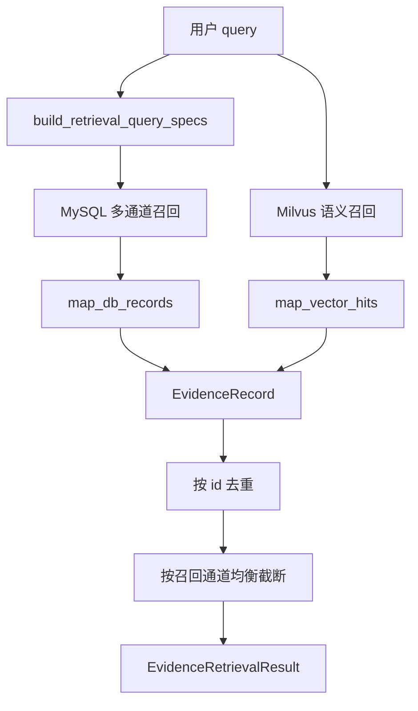
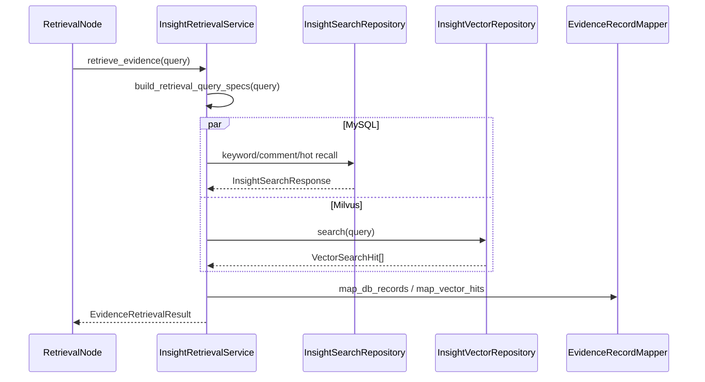
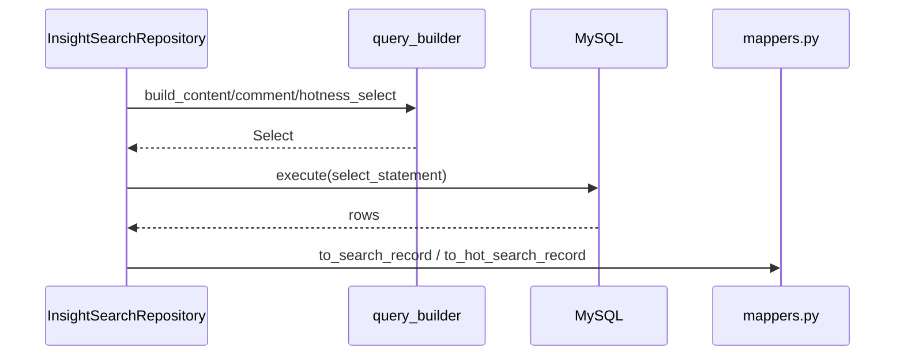
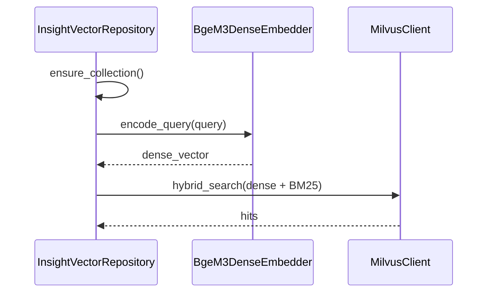
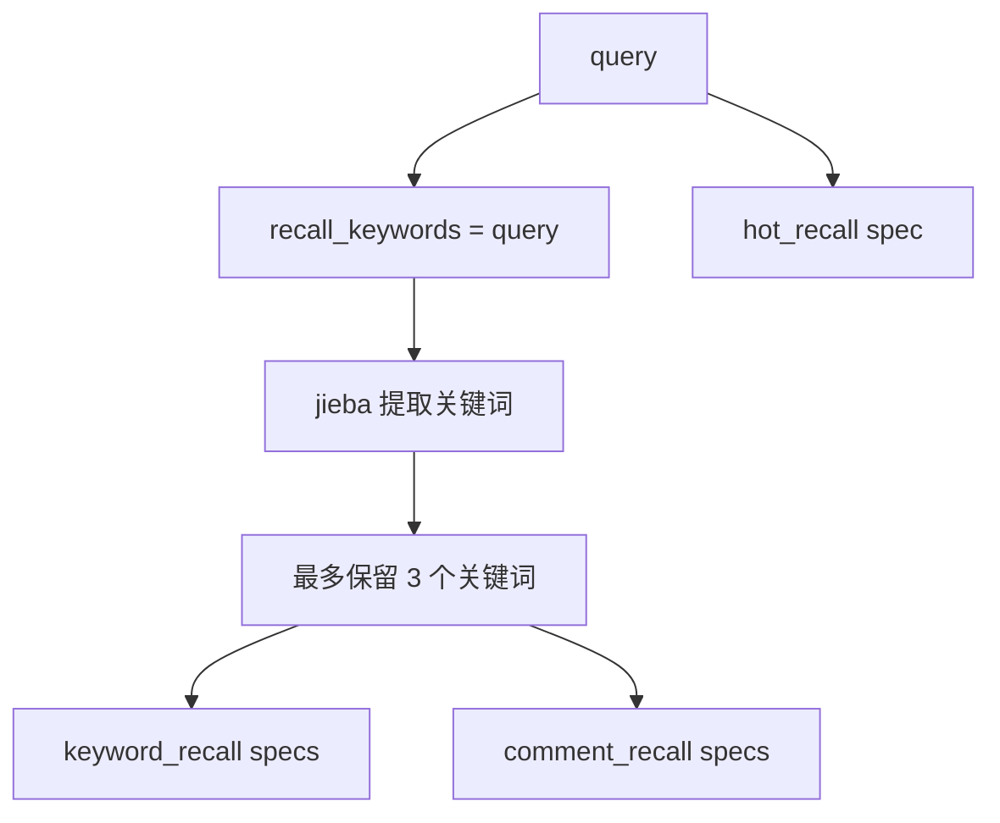
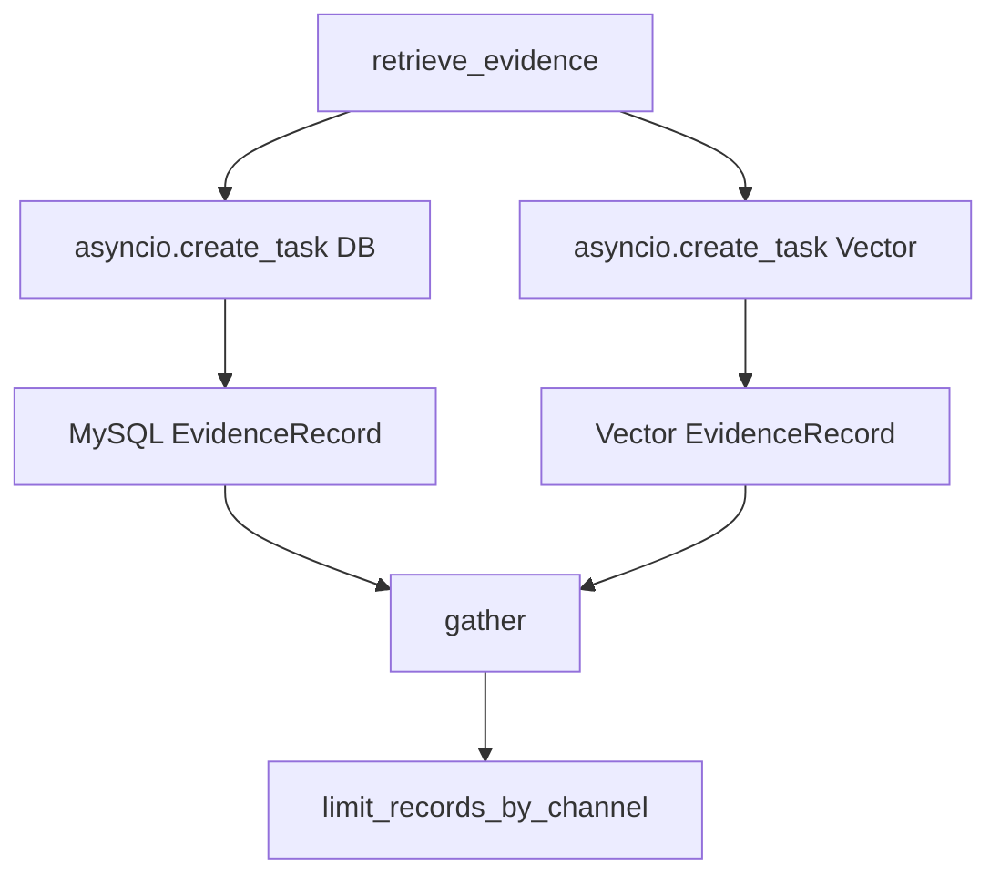
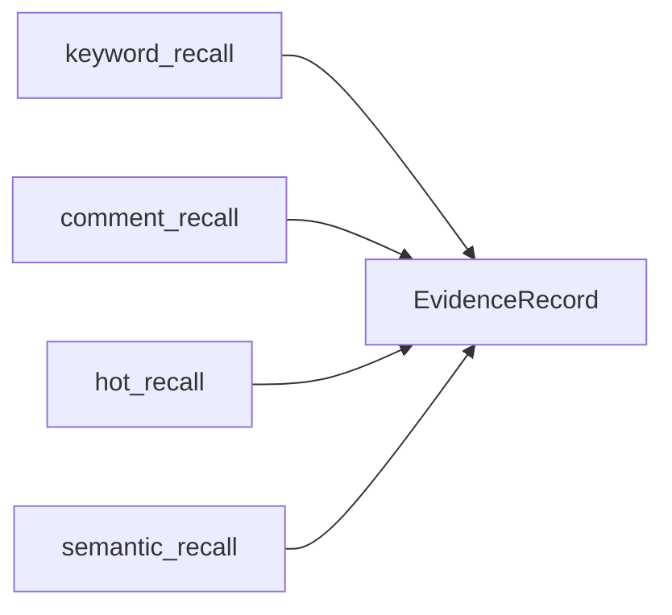

# Day06 上午：InsightAgent 私域多路召回、MySQL 平台适配、Milvus 向量检索

## 1. 本节讲解范围

### 1.1 本节涉及的模块

#### 1.1.1 相关目录

Day03 下午已经讲过 InsightAgent 的证据池、召回评分、章节分配。

Day06 要把 InsightAgent 私域舆情研究讲深。

上午重点进入私域召回底座：

```text
engines/insight_agent/retrieval/
engines/insight_agent/tools/db_search/
engines/insight_agent/tools/vector_search/
```

#### 1.1.2 相关文件

本节重点讲：

```text
engines/insight_agent/retrieval/query_plan.py
engines/insight_agent/retrieval/retrieval_service.py
engines/insight_agent/retrieval/evidence_record_mapper.py
engines/insight_agent/tools/db_search/repository.py
engines/insight_agent/tools/db_search/sql/query_builder.py
engines/insight_agent/tools/platform_registry.py
engines/insight_agent/tools/db_search/platforms/registry.py
engines/insight_agent/tools/vector_search/repository.py
engines/insight_agent/tools/vector_search/dense_embedder.py
```

#### 1.1.3 本节范围边界

本节只讲“证据从私域库里怎么被召回”。

下午再讲：

```text
InsightAgent LangGraph 节点流转
章节规划
章节写作
section_ready 事件发布
最终报告保存
```

### 1.2 本节要解决的问题

#### 1.2.1 核心问题

本节要解决：

```text
1. InsightAgent 为什么需要多路召回
2. query 如何拆成多个 RetrievalQuerySpec
3. MySQL 如何同时查主贴、评论和热度内容
4. 抖音、微博表结构不同，为什么还能 union_all 查询
5. Milvus 向量检索如何补足关键词检索不足
6. MySQL 行和向量命中如何统一成 EvidenceRecord
```

#### 1.2.2 理解难点

私域舆情研究不是调用一个搜索接口就结束。

它面对的是结构不同的数据表：

```text
douyin_aweme
douyin_aweme_comment
weibo_note
weibo_note_comment
```

还要同时处理：

```text
关键词匹配
评论观点召回
热度内容召回
语义向量召回
```

#### 1.2.3 和 Day03 的关系

Day03 讲的是“召回后如何变成证据池并分配章节”。

Day06 上午补齐前置细节：

```text
EvidenceRecord 到底从哪里来
```

## 2. 本节在项目中的位置

### 2.1 全局架构定位

#### 2.1.1 当前模块属于哪一层

当前模块属于 InsightAgent 内部的数据访问与召回编排层。

它处在：

```text
RetrievalNode
和
EvidencePool
之间
```

#### 2.1.2 上游模块是谁

上游是：

```text
engines/insight_agent/nodes/retrieval_node.py
```

`RetrievalNode` 调用 `InsightRetrievalService.retrieve_evidence(query)`。

#### 2.1.3 下游模块是谁

下游是：

```text
RankNode
ClusterNode
SectionAssignNode
SummarizeNode
```

它们消费统一后的 `EvidenceRecord`。

### 2.2 当前模块的职责边界

#### 2.2.1 它负责什么

本节模块负责：

```text
构造召回计划
并发执行 MySQL 与 Milvus 召回
限制 MySQL 并发
跨平台 SQL 适配
向量库混合检索
把原始行映射为 EvidenceRecord
按通道均衡截断原始候选
```

#### 2.2.2 它不负责什么

本节模块不负责：

```text
证据最终评分
聚类
章节分配
LLM 章节写作
报告格式化
```

#### 2.2.3 为什么这样分层

如果检索细节全部写在 `RetrievalNode` 中，节点会非常臃肿。

项目把复杂度拆成：

```text
RetrievalNode             只负责图节点入口
InsightRetrievalService   负责多路召回编排
InsightSearchRepository   负责 MySQL 查询
InsightVectorRepository   负责 Milvus 查询
EvidenceRecordMapper      负责统一证据结构
```

## 3. 总体逻辑流程图

### 3.1 主流程说明

#### 3.1.1 输入从哪里来

输入是用户研究主题：

```text
query
```

#### 3.1.2 中间经过哪些步骤

完整流程：

```text
query
-> build_retrieval_query_specs
-> _collect_db_evidence
-> _collect_vector_evidence
-> EvidenceRecordMapper
-> _limit_records_by_channel
-> EvidenceRetrievalResult
```

#### 3.1.3 输出到哪里去

输出是：

```text
EvidenceRetrievalResult(records=[EvidenceRecord...])
```

`RetrievalNode` 会把它放进 `EvidencePool`。

### 3.2 主流程图

#### 3.2.1 Mermaid 流程图



#### 3.2.2 流程图逐节点解释

`build_retrieval_query_specs` 把一个 query 拆成多个检索规格。

MySQL 通道负责业务主召回。

Milvus 通道负责语义补充召回。

最终所有结果统一成 `EvidenceRecord`。

#### 3.2.3 关键转折点

关键转折点：

```text
自然语言 query -> 多个 RetrievalQuerySpec
平台原始表行 -> InsightSearchRecord
InsightSearchRecord/VectorSearchHit -> EvidenceRecord
海量候选 -> 通道均衡后的候选证据
```

## 4. 核心数据流图

### 4.1 输入数据结构

#### 4.1.1 RetrievalQuerySpec

召回规格包含：

```text
channel
query
limit
```

#### 4.1.2 InsightSearchRecord

MySQL 查询统一输出：

```text
platform
source_table
mysql_pk
title_or_content
author_nickname
published_at
source_keyword
hotness_score
engagement
```

#### 4.1.3 VectorSearchHit

Milvus 命中统一输出：

```text
doc_id
score
channel
entity
```

### 4.2 中间状态变化

#### 4.2.1 MySQL 召回通道

MySQL 有三个通道：

```text
keyword_recall
comment_recall
hot_recall
```

#### 4.2.2 Milvus 召回通道

Milvus 使用：

```text
semantic_recall
```

#### 4.2.3 候选截断

原始候选经过：

```text
id 去重
通道分桶
按通道优先级轮询选择
```

### 4.3 输出数据结构

#### 4.3.1 EvidenceRecord

统一证据记录包含：

```text
id
platform
source_table
content
author
published_at
url
record_type
hotness_score
retrieval.channels
retrieval.scores
```

#### 4.3.2 EvidenceRetrievalResult

最终返回：

```text
records
```

#### 4.3.3 EvidencePool

下一层会构造：

```text
EvidencePool(query=query, records=result.records, clusters=[])
```

## 5. 核心调用链图

### 5.1 召回编排调用链

#### 5.1.1 调用链展开

```text
RetrievalNode.__call__
-> InsightRetrievalService.retrieve_evidence
-> build_retrieval_query_specs
-> _collect_db_evidence
-> _collect_vector_evidence
-> _limit_records_by_channel
```

#### 5.1.2 时序图



#### 5.1.3 逻辑过渡

多路召回不是为了多拿数据。

它是为了避免单一通道偏见：

```text
关键词通道容易漏掉同义表达
评论通道更能体现情绪和观点
热度通道保证高传播内容被覆盖
语义通道补足非字面匹配
```

### 5.2 MySQL 调用链

#### 5.2.1 调用链展开

```text
keyword_recall/comment_recall/hot_recall
-> build_*_select
-> union_all
-> _execute_search
-> _fetch_rows
-> _map_rows
```

#### 5.2.2 时序图



#### 5.2.3 逻辑过渡

平台表结构不同，但查询输出列必须统一。

所以项目先用平台 registry 描述字段，再由 SQL builder 投影成统一列。

### 5.3 Milvus 调用链

#### 5.3.1 调用链展开

```text
InsightVectorRepository.search
-> ensure_collection
-> encode_query
-> _hybrid_search
-> Milvus hybrid_search
-> map_milvus_hits
```

#### 5.3.2 时序图



#### 5.3.3 逻辑过渡

向量召回与 MySQL 召回并发执行。

Milvus 失败不会中断 InsightAgent 主流程。

## 6. 手写真实项目核心逻辑

### 6.1 为什么手写真实项目文件

#### 6.1.1 手写不是独立 Demo

这一节要让学员真正理解私域库如何接入。

所以手写部分直接使用真实包路径和真实文件。

#### 6.1.2 本节手写哪些文件

本节手写：

```text
engines/insight_agent/retrieval/query_plan.py
engines/insight_agent/retrieval/retrieval_service.py
engines/insight_agent/tools/db_search/repository.py
engines/insight_agent/tools/vector_search/repository.py
```

#### 6.1.3 和项目主链路的对应关系

这些文件共同完成：

```text
query -> 私域候选证据 -> EvidenceRecord
```

### 6.2 手写代码一：`engines/insight_agent/retrieval/query_plan.py`

#### 6.2.1 要实现什么

把用户 query 拆成多个召回规格。

#### 6.2.2 完整代码

完整包路径与文件名：

```text
engines/insight_agent/retrieval/query_plan.py
```

完整代码如下：

```python
"""InsightAgent 多路召回查询计划构造。"""

from __future__ import annotations

import re
from dataclasses import dataclass
from typing import Literal

RetrievalChannel = Literal["keyword_recall", "comment_recall", "hot_recall"]
MAX_RECALL_KEYWORDS = 3
KEYWORD_EXTRACT_TOP_K = 2
KEYWORD_LIMIT = 20      # 关键字 （440）
COMMENT_LIMIT = 200     # 最多评论数
HOT_CONTENT_LIMIT = 20  # 最多主贴数
HOT_RECALL_PERIOD: Literal["24h", "week", "year"] = "24h"
RAW_RECORD_LIMIT = 800


@dataclass(frozen=True)
class RetrievalQuerySpec:
    channel: RetrievalChannel
    query: str
    limit: int


def build_retrieval_query_specs(query: str) -> list[RetrievalQuerySpec]:
    # 1. 将 "原始查询" 放入召回关键字
    recall_keywords = [query]

    # 2. jieba分词
    for keyword in extract_recall_keywords(query, top_k=KEYWORD_EXTRACT_TOP_K):
        if keyword not in recall_keywords:
            recall_keywords.append(keyword)

    recall_keywords = recall_keywords[:MAX_RECALL_KEYWORDS]

    specs: list[RetrievalQuerySpec] = []

    # 3. 构建查询规格
    for keyword in recall_keywords:
        specs.append(RetrievalQuerySpec("keyword_recall", keyword, KEYWORD_LIMIT))
        specs.append(RetrievalQuerySpec("comment_recall", keyword, COMMENT_LIMIT))

    specs.append(RetrievalQuerySpec(
        "hot_recall",
        query,
        HOT_CONTENT_LIMIT,
    ))
    return specs


def extract_recall_keywords(query: str, top_k: int = 2) -> list[str]:
    try:
        import jieba.analyse

        keywords = jieba.analyse.extract_tags(query, topK=top_k)
    except ImportError:
        keywords = re.findall(r"[\u4e00-\u9fffA-Za-z0-9]{2,12}", query)[:top_k]

    cleaned_keywords: list[str] = []
    for keyword in keywords:
        keyword = keyword.strip()
        if 2 <= len(keyword) <= 12 and keyword not in cleaned_keywords:
            cleaned_keywords.append(keyword)
    return cleaned_keywords
```

#### 6.2.3 逐块解释

原始 query 一定保留。

`jieba.analyse.extract_tags` 用于补充关键词。

每个关键词都会生成：

```text
keyword_recall
comment_recall
```

最后额外加入：

```text
hot_recall
```

#### 6.2.4 关键设计意图

私域召回不能只靠一个关键词。

但也不能无限扩展关键词，所以限制 `MAX_RECALL_KEYWORDS = 3`。

### 6.3 手写代码二：`engines/insight_agent/retrieval/retrieval_service.py`

#### 6.3.1 要实现什么

编排 MySQL 与 Milvus 多路召回。

#### 6.3.2 完整代码

完整包路径与文件名：

```text
engines/insight_agent/retrieval/retrieval_service.py
```

完整代码如下：

```python
"""InsightAgent 多路召回编排服务。"""

from __future__ import annotations

import asyncio
import logging
from dataclasses import dataclass

from engines.contracts.config import Settings
from engines.insight_agent.evidence import EvidenceRecord
from engines.insight_agent.retrieval.evidence_record_mapper import EvidenceRecordMapper
from engines.insight_agent.retrieval.query_plan import (
    HOT_RECALL_PERIOD,
    RAW_RECORD_LIMIT,
    RetrievalQuerySpec,
    build_retrieval_query_specs,
)
from engines.insight_agent.tools.db_search.models import InsightSearchResponse
from engines.insight_agent.tools.db_search.repository import InsightSearchRepository
from engines.insight_agent.tools.vector_search import InsightVectorRepository
from engines.insight_agent.tools.vector_search.models import VectorSearchHit
from engines.insight_agent.tools.vector_search.search_filters import build_published_after_expr

logger = logging.getLogger(__name__)


@dataclass
class EvidenceRetrievalResult:
    """统一承载多路召回后的证据与诊断统计。"""

    records: list[EvidenceRecord]


class InsightRetrievalService:
    """编排 MySQL 与 Milvus 多路召回，避免图节点承担过多检索细节。"""

    def __init__(self, config: Settings) -> None:
        self.config = config
        self.insight_search_repository = InsightSearchRepository()
        self.insight_vector_repository = InsightVectorRepository(config)
        self.evidence_record_mapper = EvidenceRecordMapper()

    async def retrieve_evidence(self, query: str) -> EvidenceRetrievalResult:

        # 1. 构建查询规格
        query_specs = build_retrieval_query_specs(query)

        # 2. 从MySQL收集证据
        db_task = asyncio.create_task(self._collect_db_evidence(query_specs))

        # 3. 从Milvus收集证据
        vector_task = asyncio.create_task(self._collect_vector_evidence(query))

        # 4. 等二路任务收集完成
        db_records, vector_records = await asyncio.gather(db_task, vector_task)

        # 5. MySQL 是业务主召回，重复证据限流时优先保留 MySQL 结果
        all_records = [*db_records, *vector_records]
        limited_records = _limit_records_by_channel(all_records, RAW_RECORD_LIMIT)

        return EvidenceRetrievalResult(
            records=limited_records,
        )

    async def _collect_db_evidence(
            self,
            query_specs: list[RetrievalQuerySpec],
    ) -> list[EvidenceRecord]:

        # 1. 初始化信号量(防止MySQL连接不可用)
        semaphore = asyncio.Semaphore(3)


        # 2. 三通道检索
        tasks = [self._run_db_search_with_limit(spec, semaphore) for spec in query_specs]

        results = await asyncio.gather(*tasks)

        # 3. 封装证据结果
        records: list[EvidenceRecord] = []
        for spec, response in results:
            rows = response.search_results or []
            records.extend(self.evidence_record_mapper.map_db_records(rows, spec.channel, spec.query))

        return records

    async def _collect_vector_evidence(
            self,
            query: str,
    ) -> list[EvidenceRecord]:
        if not self.config.INSIGHT_VECTOR_ENABLED:
            return []
        try:
            vector_hits = await asyncio.to_thread(self._run_vector_search, query)
        except Exception:
            logger.exception("[insight] Milvus 向量召回失败，跳过向量通道")
            return []

        return self.evidence_record_mapper.map_vector_hits(vector_hits, query)

    async def _run_db_search_with_limit(
            self,
            spec: RetrievalQuerySpec,
            semaphore: asyncio.Semaphore,
    ) -> tuple[RetrievalQuerySpec, InsightSearchResponse]:
        """
        限速执行 MySQL查询
        """
        async with semaphore:
            return spec, await self._run_db_search(spec)

    async def _run_db_search(self, spec: RetrievalQuerySpec) -> InsightSearchResponse:
        db = self.insight_search_repository

        match spec.channel:
            case "keyword_recall":
                response = await db.keyword_recall(spec.query, limit=spec.limit)
            case "comment_recall":
                response = await db.comment_recall(spec.query, limit=spec.limit)
            case "hot_recall":
                response = await db.hot_recall(
                    time_period=HOT_RECALL_PERIOD,
                    limit=spec.limit,
                )
            case _:
                raise ValueError(f"不支持检索通道: {spec.channel}")

        return response

    def _run_vector_search(self, query: str) -> list[VectorSearchHit]:

        return self.insight_vector_repository.search(
            query,
            limit=self.config.INSIGHT_VECTOR_TOP_K,
            filter_expr=self._build_vector_filter_expr(),
        )

    def _build_vector_filter_expr(self) -> str | None:
        return build_published_after_expr(self.config.INSIGHT_VECTOR_FILTER_DAYS)


def _limit_records_by_channel(records: list[EvidenceRecord], limit: int) -> list[EvidenceRecord]:
    """按证据 ID 去重后，再按召回通道均衡截断。"""
    if limit <= 0:
        return []

    buckets: dict[str, list[EvidenceRecord]] = {}
    channel_order: list[str] = []
    seen_ids: set[str] = set()
    for record in records:
        record_id = record["id"]
        if record_id in seen_ids:
            continue
        seen_ids.add(record_id)

        channel = _record_channel(record)
        if channel not in buckets:
            buckets[channel] = []
            channel_order.append(channel)
        buckets[channel].append(record)

    if sum(len(bucket) for bucket in buckets.values()) <= limit:
        return [record for bucket in buckets.values() for record in bucket]

    order_index = {channel: index for index, channel in enumerate(channel_order)}
    channel_order = sorted(
        channel_order,
        key=lambda channel: (_channel_priority(channel), order_index[channel]),
    )

    selected: list[EvidenceRecord] = []

    max_bucket_size = max(len(bucket) for bucket in buckets.values())
    for index in range(max_bucket_size):
        for channel in channel_order:
            bucket = buckets[channel]
            if index >= len(bucket):
                continue
            selected.append(bucket[index])
            if len(selected) >= limit:
                return selected

    return selected


def _record_channel(record: EvidenceRecord) -> str:
    retrieval = record.get("retrieval", {}) or {}
    channels = list(retrieval.get("channels", []) or [])
    return channels[0] if channels else "unknown"


def _channel_priority(channel: str) -> int:
    priorities = {
        "keyword_recall": 0,
        "comment_recall": 1,
        "hot_recall": 2,
        "semantic_recall": 3,
    }
    return priorities.get(channel, len(priorities))
```

#### 6.3.3 逐块解释

`retrieve_evidence()` 是总入口。

MySQL 与 Milvus 并发执行。

MySQL 内部再根据 query specs 并发执行多个通道，但用 `Semaphore(3)` 限流。

Milvus 失败时跳过，不中断主流程。

#### 6.3.4 关键设计意图

私域研究要追求覆盖面，但不能让单个外部系统失败拖垮整个 Agent。

## 7. 手写逻辑执行流程图

### 7.1 查询计划流程

#### 7.1.1 第一步执行什么

保留用户原始 query。

#### 7.1.2 第二步执行什么

提取最多两个关键词。

#### 7.1.3 最终得到什么

得到 keyword/comment/hot 三类检索规格。

### 7.2 私域多路召回流程

#### 7.2.1 第一步执行什么

并发创建 MySQL 和 Milvus 任务。

#### 7.2.2 第二步执行什么

MySQL 执行多通道 SQL，Milvus 执行混合检索。

#### 7.2.3 最终得到什么

统一 EvidenceRecord 列表。

### 7.3 通道均衡流程

#### 7.3.1 第一步执行什么

按 evidence id 去重。

#### 7.3.2 第二步执行什么

按召回通道分桶。

#### 7.3.3 最终得到什么

得到不超过 `RAW_RECORD_LIMIT` 的均衡候选证据。

### 7.4 手写流程图

#### 7.4.1 QuerySpec 构造



#### 7.4.2 并发召回



#### 7.4.3 召回通道关系



## 8. 项目源码解读

### 8.1 文件一：`engines/insight_agent/tools/platform_registry.py`

#### 8.1.1 文件职责

描述不同平台的主贴表、评论表和字段映射。

#### 8.1.2 为什么需要这个文件

抖音和微博表字段不同。

没有 registry，SQL builder 就必须写死大量平台 if else。

#### 8.1.3 上游调用者

```text
db_search/platforms/*
sql/query_builder.py
```

#### 8.1.4 下游产物

统一 SQL 投影字段。

#### 8.1.5 完整源码

完整包路径与文件名：

```text
engines/insight_agent/tools/platform_registry.py
```

完整代码如下：

```python
"""InsightAgent 私有舆情库平台表字段注册表。"""

from __future__ import annotations

from dataclasses import dataclass
from typing import Mapping


@dataclass(frozen=True)
class PlatformContentSchema:
    """
    桥接在 SQLAlchemy 和不同表结构之间，用于 union 的桥梁
     1. 原始平台表字段映射 schema
     2. SQL 投影适配器配置
     3. union_all 统一列结构的桥接配置
    """
    table_name: str
    text_col: str
    author_col: str
    url_col: str
    published_at_col: str
    published_ts_col: str
    parent_id_col: str
    source_keyword_col: str
    search_fields: tuple[str, ...]  # 类型str  长度不限
    engagement_cols: Mapping[str, str]


@dataclass(frozen=True)
class PlatformCommentSchema:
    """
    桥接在 SQLAlchemy 和不同表结构之间，用于 union 的桥梁
    1. 原始平台表字段映射 schema
    2. SQL 投影适配器配置
    3. union_all 统一列结构的桥接配置
    """
    table_name: str
    text_col: str
    author_col: str
    published_at_col: str
    published_ts_col: str
    parent_id_col: str
    search_fields: tuple[str, ...]  # 类型str  长度不限
    engagement_cols: Mapping[str, str]


@dataclass(frozen=True)
class PlatformSchema:
    platform_name: str
    content: PlatformContentSchema
    comment: PlatformCommentSchema


PLATFORM_REGISTRY: dict[str, PlatformSchema] = {
    "douyin": PlatformSchema(
        platform_name="douyin",
        content=PlatformContentSchema(
            table_name="douyin_aweme",
            text_col="title",
            author_col="nickname",
            url_col="aweme_url",
            published_at_col="create_time",  # 时间戳(bigint) -> 日期时间
            published_ts_col="create_time",  # 时间戳(bigint)
            parent_id_col="aweme_id",
            source_keyword_col="source_keyword",
            search_fields=("title", "source_keyword"),
            engagement_cols={
                "likes": "liked_count",  # 点赞数
                "comments": "comment_count",  # 评论数
                "shares": "share_count",  # 分享数
                "collects": "collected_count",  # 收藏数
            },
        ),
        comment=PlatformCommentSchema(
            table_name="douyin_aweme_comment",
            text_col="content",
            author_col="nickname",
            published_at_col="create_time",  # 时间戳(bigint) -> 日期时间
            published_ts_col="create_time",  # 时间戳(bigint)
            parent_id_col="aweme_id",
            search_fields=("content",),
            engagement_cols={
                "likes": "like_count",  # 点赞数
                "replies": "sub_comment_count",  # 子评论数
            },
        ),
    ),
    "weibo": PlatformSchema(
        platform_name="weibo",
        content=PlatformContentSchema(
            table_name="weibo_note",
            text_col="content",  # 笔记内容
            author_col="nickname",
            url_col="note_url",
            published_at_col="create_date_time",  # 日期时间   (varchar)
            published_ts_col="create_time",  # 时间戳     (bigint)
            parent_id_col="note_id",
            source_keyword_col="source_keyword",
            search_fields=("content", "source_keyword"),
            engagement_cols={
                "likes": "liked_count",  # 点赞数
                "comments": "comments_count",  # 评论数
                "shares": "shared_count",  # 分享数
            },
        ),
        comment=PlatformCommentSchema(
            table_name="weibo_note_comment",
            text_col="content",  # 评论内容
            author_col="nickname",
            published_at_col="create_date_time",  # 日期时间
            published_ts_col="create_time",  # 时间戳
            parent_id_col="note_id",
            search_fields=("content",),
            engagement_cols={
                "likes": "comment_like_count",  # 评论点赞数
                "replies": "sub_comment_count",  # 子评论数
            },
        ),
    ),
}

__all__ = [
    "PLATFORM_REGISTRY",
    "PlatformCommentSchema",
    "PlatformContentSchema",
    "PlatformSchema",
]
```

#### 8.1.6 代码逐块解释

`PlatformContentSchema` 描述主贴表。

`PlatformCommentSchema` 描述评论表。

`PLATFORM_REGISTRY` 当前注册抖音和微博。

#### 8.1.7 关键设计意图

把平台差异收敛到配置对象里，让 SQL builder 面向统一 schema 编程。

#### 8.1.8 如果不这样设计会怎样

每新增一个平台都要改大量 SQL 查询逻辑。

### 8.2 文件二：`engines/insight_agent/tools/db_search/sql/query_builder.py`

#### 8.2.1 文件职责

基于平台适配器构造 SQLAlchemy Select。

#### 8.2.2 为什么需要这个文件

SQL 构造属于基础能力，不应该散落在 repository 中。

#### 8.2.3 上游调用者

```text
InsightSearchRepository
```

#### 8.2.4 下游产物

```text
Select
```

#### 8.2.5 完整源码

完整包路径与文件名：

```text
engines/insight_agent/tools/db_search/sql/query_builder.py
```

完整代码如下：

```python
"""InsightAgent 私有舆情库研究模块：engines/insight_agent/tools/db_search/sql/query_builder.py。"""

from __future__ import annotations

from datetime import datetime

from sqlalchemy import Select, bindparam, column, desc, or_, select, table

from engines.insight_agent.tools.db_search.models import HotnessWeights
from engines.insight_agent.tools.db_search.platforms.base import PlatformSearchAdapter
from engines.insight_agent.tools.db_search.sql.projections import comment_columns, content_columns, engagement_columns


def build_content_search_select(adapter: PlatformSearchAdapter, search_term: str, limit: int=20) -> Select:
    """
    适配不同平台的"主贴"查询
    """

    content = adapter.config.content
    where_clauses = [
        column(field).like(bindparam(f"term_{content.table_name}_{i}", search_term))
        for i, field in enumerate(content.search_fields)
    ]
    return (
        select(*content_columns(adapter.config), *engagement_columns(content.engagement_cols))
        .select_from(table(content.table_name))
        .where(or_(*where_clauses))
        .order_by(desc(column("id")))
        .limit(limit)
    )


def build_comment_search_select(adapter: PlatformSearchAdapter, search_term: str, limit: int=200) -> Select:
    """
    适配不同平台的"评论"查询
    """

    # 1. 获取评论Schema
    comment = adapter.config.comment

    # 2. 拼接where条件列  (参数绑定防止SQL注入: key: 生成了一个全局唯一的变量名 将 search_term 绑定到这个变量名上)
    where_clauses = [
        column(field).like(bindparam(f"term_{comment.table_name}_{i}", search_term))
        for i, field in enumerate(comment.search_fields)
    ]

    # 3. 构建查询语句
    return (
        select(*comment_columns(adapter.config), *engagement_columns(comment.engagement_cols))
        .select_from(table(comment.table_name))
        .where(or_(*where_clauses))
        .order_by(desc(column("id")))
        .limit(limit)
    )


def build_hotness_select(
        adapter: PlatformSearchAdapter, start_time: datetime, weights: HotnessWeights, limit: int
) -> Select:
    """
    构建热度值
    """

    hotness_expr = adapter.build_hotness_score_expr(weights).label("hotness_score")
    time_filter = adapter.build_content_time_filter(start_time)

    inner = (
        select(
            *content_columns(adapter.config),
            *engagement_columns(adapter.config.content.engagement_cols),
            hotness_expr,
        )
        .select_from(table(adapter.config.content.table_name))
        .where(time_filter)
        .order_by(desc(hotness_expr))
        .limit(limit)
    )
    return select("*").select_from(inner.subquery())
```

#### 8.2.6 代码逐块解释

`build_content_search_select` 查主贴。

`build_comment_search_select` 查评论。

`build_hotness_select` 查高热内容。

#### 8.2.7 关键设计意图

SQL 只拼结构，平台字段由 adapter 提供。

#### 8.2.8 如果不这样设计会怎样

跨平台 union 查询会变得难维护。

### 8.3 文件三：`engines/insight_agent/tools/vector_search/repository.py`

#### 8.3.1 文件职责

封装 Milvus 集合初始化、向量写入、混合检索。

#### 8.3.2 为什么需要这个文件

向量检索涉及集合 schema、index、embedding、hybrid_search，不适合放在 graph node 中。

#### 8.3.3 上游调用者

```text
InsightRetrievalService
```

#### 8.3.4 下游依赖

```text
MilvusClient
BgeM3DenseEmbedder
map_milvus_hits
```

#### 8.3.5 完整源码

完整包路径与文件名：

```text
engines/insight_agent/tools/vector_search/repository.py
```

完整代码如下：

```python
"""InsightAgent 私有舆情库研究模块：engines/insight_agent/tools/vector_search/repository.py。"""

from __future__ import annotations

from typing import Any

from loguru import logger
from pymilvus import AnnSearchRequest, RRFRanker

from engines.contracts.config import Settings
from engines.insight_agent.tools.vector_search.collection_schema import (
    MILVUS_OUTPUT_FIELDS,
    build_milvus_collection_schema,
    build_milvus_index_params,
)
from engines.insight_agent.tools.vector_search.dense_embedder import BgeM3DenseEmbedder
from engines.insight_agent.tools.vector_search.hit_mapper import map_milvus_hits
from engines.insight_agent.tools.vector_search.models import InsightVectorDocument, VectorSearchHit
from engines.insight_agent.tools.vector_search.search_filters import build_published_after_expr


class InsightVectorRepository:
    """Milvus 向量库交互核心仓储类"""

    def __init__(self, config: Settings) -> None:
        self.config = config
        self.collection_name = config.MILVUS_INSIGHT_COLLECTION
        self.embedder = BgeM3DenseEmbedder(
            model_name=config.INSIGHT_EMBEDDING_MODEL,
            device=config.INSIGHT_EMBEDDING_DEVICE,
        )
        self._client = None

    @property
    def client(self):
        """懒加载 MilvusClient，避免启动时强制连接"""
        if self._client is None:
            from pymilvus import MilvusClient
            kwargs: dict[str, Any] = {"uri": self.config.MILVUS_URI}
            if self.config.MILVUS_TOKEN:
                kwargs["token"] = self.config.MILVUS_TOKEN
            if self.config.MILVUS_DB_NAME:
                kwargs["db_name"] = self.config.MILVUS_DB_NAME
            self._client = MilvusClient(**kwargs)
        return self._client

    def ensure_collection(self, drop_existing: bool = False) -> None:
        """确保集合存在，封装底层的 schema 与 index 初始化逻辑"""
        if drop_existing and self.client.has_collection(self.collection_name):
            self.client.drop_collection(self.collection_name)

        if self.client.has_collection(self.collection_name):
            return

        schema = build_milvus_collection_schema(self.client, self.config.INSIGHT_DENSE_DIM)
        index_params = build_milvus_index_params(self.client)

        self.client.create_collection(
            collection_name=self.collection_name,
            schema=schema,
            index_params=index_params,
        )
        logger.info(f"[insight] 创建Milvus集合 {self.collection_name}")

    def upsert_documents(self, documents: list[InsightVectorDocument]) -> int:
        """批量将文档向量化并 upsert 到 Milvus"""
        if not documents:
            return 0

        self.ensure_collection()
        vectors = self.embedder.encode_documents([doc.content for doc in documents])

        entities = [
            doc.to_milvus_record(vector)
            for doc, vector in zip(documents, vectors)
            if vector
        ]
        if not entities:
            return 0

        self.client.upsert(collection_name=self.collection_name, data=entities)
        return len(entities)

    def search(self, query: str, limit: int, filter_expr: str ) -> list[VectorSearchHit]:
        """执行 Milvus 稠密向量与 BM25 稀疏向量混合检索。"""
        self.ensure_collection()


        dense_vector = self.embedder.encode_query(query)
        if not dense_vector:
            return []

        return self._hybrid_search(query, dense_vector, limit, filter_expr)

    def _hybrid_search(
        self,
        query: str,
        dense_vector: list[float],
        limit: int,
        filter_expr: str | None = None,
    ) -> list[VectorSearchHit]:
        """混合检索 (稠密 COSINE + 稀疏 BM25)"""
        request_filter = {"expr": filter_expr} if filter_expr else {}
        dense_request = AnnSearchRequest(
            data=[dense_vector],
            anns_field="dense_vector",
            param={"metric_type": "COSINE"},
            limit=limit,
            **request_filter,
        )
        sparse_request = AnnSearchRequest(
            data=[query],
            anns_field="sparse_vector",
            param={"metric_type": "BM25"},
            limit=limit,
            **request_filter,
        )
        result = self.client.hybrid_search(
            collection_name=self.collection_name,
            reqs=[dense_request, sparse_request],
            ranker=RRFRanker(),
            limit=limit,
            output_fields=MILVUS_OUTPUT_FIELDS,
        )


        return map_milvus_hits(result, "semantic_recall")
```

#### 8.3.6 代码逐块解释

`client` 使用懒加载。

`ensure_collection()` 保证集合存在。

`upsert_documents()` 负责向量化写入。

`search()` 使用稠密向量加 BM25 稀疏向量混合检索。

#### 8.3.7 关键设计意图

Milvus 是可选增强能力，不应该影响 MySQL 主链路。

#### 8.3.8 如果不这样设计会怎样

向量库连接失败会导致整个 InsightAgent 不能运行。

## 9. 关键对象与状态拆解

### 9.1 核心对象一：`RetrievalQuerySpec`

#### 9.1.1 对象定义

单个召回通道的查询规格。

#### 9.1.2 字段含义

```text
channel  召回通道
query    通道使用的查询词
limit    通道最大召回数量
```

#### 9.1.3 生命周期

只存在于一次 `retrieve_evidence()` 调用中。

### 9.2 核心对象二：`InsightRetrievalService`

#### 9.2.1 对象定义

InsightAgent 多路召回编排服务。

#### 9.2.2 字段含义

```text
config
insight_search_repository
insight_vector_repository
evidence_record_mapper
```

#### 9.2.3 生命周期

由 `RetrievalNode` 初始化并持有。

### 9.3 核心对象三：`InsightVectorRepository`

#### 9.3.1 对象定义

Milvus 向量检索仓储。

#### 9.3.2 字段含义

```text
collection_name
embedder
_client
```

#### 9.3.3 生命周期

随 `InsightRetrievalService` 创建。

Milvus client 懒加载。

## 10. 边界情况与异常分支

### 10.1 jieba 未安装

#### 10.1.1 什么情况下发生

环境没有安装 jieba。

#### 10.1.2 代码如何处理

回退正则提取中文、英文、数字片段。

#### 10.1.3 为什么这样处理

保证查询计划至少可用。

### 10.2 MySQL 查询失败

#### 10.2.1 什么情况下发生

数据库不可用或 SQL 执行异常。

#### 10.2.2 代码如何处理

`_fetch_rows()` 返回空 rows 和错误信息。

#### 10.2.3 为什么这样处理

召回通道失败不应该直接抛穿所有流程。

### 10.3 Milvus 查询失败

#### 10.3.1 什么情况下发生

向量库不可用、集合不存在、embedding 模型异常。

#### 10.3.2 代码如何处理

捕获异常，记录日志，返回空列表。

#### 10.3.3 为什么这样处理

向量检索是增强通道，不是主链路唯一依赖。

## 11. 本节代码在完整链路中的作用

### 11.1 本节之前发生了什么

#### 11.1.1 上一段链路输出

研究编排层启动 InsightAgent。

#### 11.1.2 本节接收的数据

接收用户 query。

#### 11.1.3 本节开始的条件

InsightAgent 图进入 `retrieval` 节点。

### 11.2 本节推进了什么

#### 11.2.1 推进了哪一步业务

从私域库召回候选舆情证据。

#### 11.2.2 改变了哪些状态

构造：

```text
EvidenceRetrievalResult.records
```

#### 11.2.3 产出了哪些结果

产出统一的 EvidenceRecord 列表。

### 11.3 本节之后交给谁

#### 11.3.1 下游模块

下游是：

```text
RankNode
ClusterNode
PlanNode
SectionAssignNode
SummarizeNode
```

#### 11.3.2 下游输入

下游输入：

```text
EvidencePool.records
```

#### 11.3.3 下一节课如何衔接

下午继续讲：

```text
这些 EvidenceRecord 如何进入 LangGraph 节点流转，最终形成 InsightAgent 的章节报告和 section_ready 事件。
```
