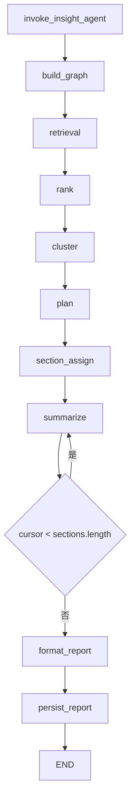
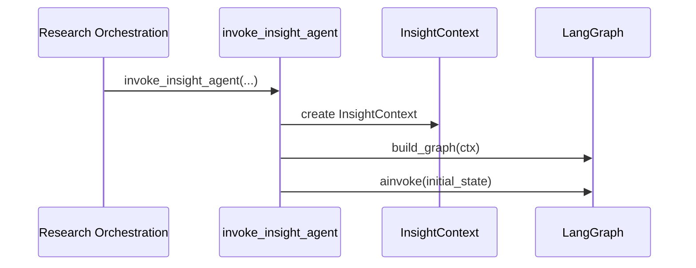
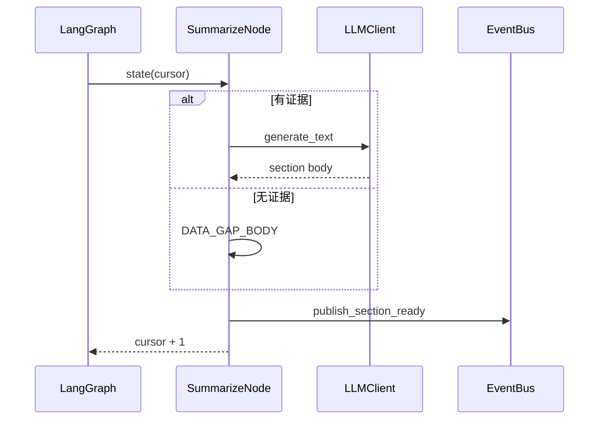
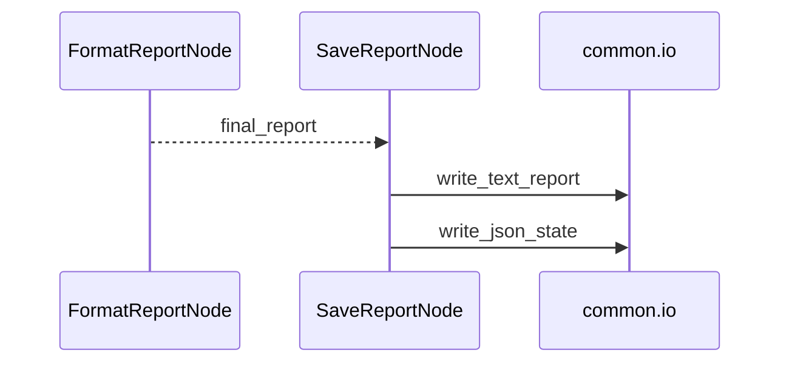
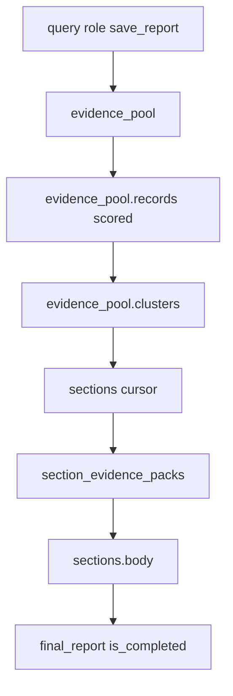
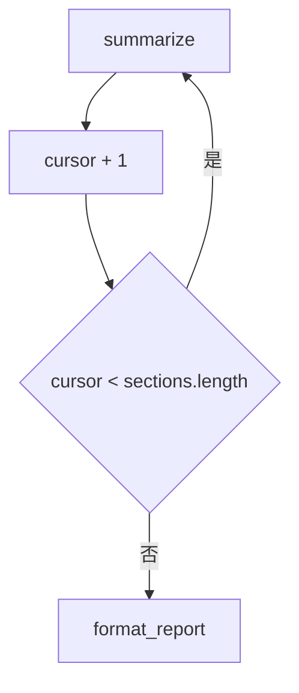
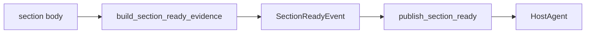

# Day06 下午：InsightAgent LangGraph 节点流转、章节写作、报告保存

## 1. 本节讲解范围

### 1.1 本节涉及的模块

#### 1.1.1 相关目录

上午讲了 InsightAgent 私域多路召回。

下午进入 InsightAgent 的图执行主链路：

```text
engines/insight_agent/
engines/insight_agent/nodes/
engines/common/nodes/
```

#### 1.1.2 相关文件

本节重点讲：

```text
engines/insight_agent/agent.py
engines/insight_agent/context.py
engines/insight_agent/state.py
engines/insight_agent/graph.py
engines/insight_agent/nodes/retrieval_node.py
engines/insight_agent/nodes/rank_node.py
engines/insight_agent/nodes/cluster_node.py
engines/insight_agent/nodes/plan_node.py
engines/insight_agent/nodes/section_assign_node.py
engines/insight_agent/nodes/summarize_node.py
engines/insight_agent/nodes/format_report_node.py
engines/common/nodes/save_report.py
```

#### 1.1.3 本节范围边界

本节不再展开 SQL 和 Milvus 细节。

本节重点讲：

```text
InsightAgent 如何从 EvidencePool 生成完整 Markdown 报告
每个章节如何发布 section_ready 事件给 HostAgent
```

### 1.2 本节要解决的问题

#### 1.2.1 核心问题

本节要解决：

```text
1. InsightAgent LangGraph 为什么要拆多个节点
2. EvidencePool 如何被排序、聚类、规划、分配
3. SummarizeNode 为什么逐章节循环
4. 章节证据为空时为什么不调用 LLM
5. section_ready 事件什么时候发布
6. 最终报告如何格式化和保存
```

#### 1.2.2 理解难点

InsightAgent 不是一次 LLM 调用。

它是：

```text
先程序化处理证据
再让 LLM 做规划和写作
最后把章节结果逐个交给 HostAgent
```

#### 1.2.3 和上午的关系

上午产出：

```text
EvidenceRecord[]
```

下午开始：

```text
EvidenceRecord[] -> EvidencePool -> sections -> final_report
```

## 2. 本节在项目中的位置

### 2.1 全局架构定位

#### 2.1.1 当前模块属于哪一层

当前模块属于 InsightAgent 的核心智能体执行层。

它位于：

```text
研究编排层
和
证据契约事件层
之间
```

#### 2.1.2 上游模块是谁

上游是：

```text
engines/orchestration/research.py
```

它调用 `invoke_insight_agent(...)`。

#### 2.1.3 下游模块是谁

下游是：

```text
HostAgent
文件系统
SSE 进度流
```

### 2.2 当前模块的职责边界

#### 2.2.1 它负责什么

InsightAgent 图负责：

```text
构建证据池
证据去重评分
讨论簇识别
报告章节规划
章节证据包分配
逐章节写作
逐章节发布 section_ready
格式化最终报告
保存报告和状态
```

#### 2.2.2 它不负责什么

它不负责：

```text
HostAgent 主持人裁判
MediaAgent 公开媒体搜索
最终综合报告 ReportEngine
前端渲染
```

#### 2.2.3 为什么这样分层

InsightAgent 的核心价值是私域证据分析。

所以它只把自己负责的私域发现交付出去。

综合裁判交给 HostAgent。

## 3. 总体逻辑流程图

### 3.1 主流程说明

#### 3.1.1 输入从哪里来

入口函数接收：

```text
query
role
config
llm_client
output_dir
progress_callback
save_report
```

#### 3.1.2 中间经过哪些步骤

完整节点链：

```text
retrieval
-> rank
-> cluster
-> plan
-> section_assign
-> summarize
-> summarize 循环
-> format_report
-> persist_report
```

#### 3.1.3 输出到哪里去

输出包括：

```text
Insight Markdown 报告
Insight state JSON
section_ready 事件
ProgressUpdate
```

### 3.2 主流程图

#### 3.2.1 Mermaid 流程图



#### 3.2.2 流程图逐节点解释

`retrieval` 召回私域证据。

`rank` 去重、评分、通道配额选择。

`cluster` 识别讨论簇。

`plan` 让 LLM 在固定五维内规划章节标题和分析目标。

`section_assign` 为章节分配证据包。

`summarize` 按 cursor 逐章节写作。

`format_report` 整合最终报告。

`persist_report` 保存结果。

#### 3.2.3 关键转折点

关键转折点：

```text
候选证据 -> 高质量证据池
证据池 -> 章节计划
章节计划 -> 章节证据包
章节证据包 -> section_ready 事件
章节正文 -> 最终报告
```

## 4. 核心数据流图

### 4.1 输入数据结构

#### 4.1.1 InsightState 初始状态

初始 state：

```text
query
role
save_report
```

#### 4.1.2 EvidencePool

召回后新增：

```text
evidence_pool.records
evidence_pool.clusters
```

#### 4.1.3 InsightSection

规划后新增：

```text
title
goal
section_key
body
```

### 4.2 中间状态变化

#### 4.2.1 cursor 状态

`cursor` 表示当前正在写第几个章节。

每完成一章：

```text
cursor + 1
```

#### 4.2.2 section_evidence_packs

`SectionAssignNode` 为每个章节生成一个证据包。

#### 4.2.3 final_report

`FormatReportNode` 最终写入：

```text
final_report
report_title
is_completed
```

### 4.3 输出数据结构

#### 4.3.1 SectionReadyEvent

每个章节完成后发布：

```text
source
agent
section_key
section_index
title
query
body
hit_count
evidence_pack
evidence_strength
missing_notes
```

#### 4.3.2 Markdown 报告

保存为 InsightAgent 的 Markdown。

#### 4.3.3 JSON 状态

保存 compact state，避免把完整证据池全部写入状态文件。

## 5. 核心调用链图

### 5.1 Agent 入口调用链

#### 5.1.1 调用链展开

```text
invoke_insight_agent
-> InsightContext
-> build_graph
-> graph.ainvoke
```

#### 5.1.2 时序图



#### 5.1.3 逻辑过渡

Context 负责依赖，State 负责数据。

这两个概念要分开讲。

### 5.2 summarize 循环调用链

#### 5.2.1 调用链展开

```text
SummarizeNode.__call__
-> 取 cursor 对应章节
-> 取 cursor 对应证据包
-> 有证据则 LLM 写作
-> 无证据则数据缺口正文
-> publish_section_ready
-> cursor + 1
```

#### 5.2.2 时序图



#### 5.2.3 逻辑过渡

SummarizeNode 是 InsightAgent 和 HostAgent 的关键连接点。

每写完一章，不等最终报告完成，就先把章节事件发出去。

### 5.3 保存调用链

#### 5.3.1 调用链展开

```text
FormatReportNode
-> final_report
-> SaveReportNode
-> write_text_report
-> write_json_state
```

#### 5.3.2 时序图



#### 5.3.3 逻辑过渡

最终报告保存只是 InsightAgent 自己的归档。

HostAgent 真正消费的是每章 `section_ready` 事件。

## 6. 手写真实项目核心逻辑

### 6.1 为什么手写真实项目文件

#### 6.1.1 手写不是独立 Demo

InsightAgent 的复杂度在图节点之间的状态传递。

所以必须手写真实图和真实节点。

#### 6.1.2 本节手写哪些文件

本节手写：

```text
engines/insight_agent/agent.py
engines/insight_agent/state.py
engines/insight_agent/graph.py
engines/insight_agent/nodes/summarize_node.py
```

#### 6.1.3 和项目主链路的对应关系

这些文件共同完成：

```text
启动 Agent -> 执行图 -> 逐章写作 -> 发布事件 -> 保存报告
```

### 6.2 手写代码一：`engines/insight_agent/agent.py`

#### 6.2.1 要实现什么

实现 InsightAgent 的外部启动入口。

#### 6.2.2 完整代码

完整包路径与文件名：

```text
engines/insight_agent/agent.py
```

完整代码如下：

```python
"""InsightAgent 私有舆情库研究模块：engines/insight_agent/agent.py。"""

from typing import Callable

from loguru import logger

from engines.common.models import ProgressUpdate
from engines.contracts.config import Settings
from engines.contracts.roles import INSIGHT_ROLE, ROLE_INFOS
from engines.llm.llm_client import LLMClient
from engines.insight_agent.context import InsightContext
from engines.insight_agent.graph import build_graph


async def invoke_insight_agent(
        query: str,
        role: str,
        config: Settings,
        llm_client: LLMClient,
        output_dir: str,
        progress_callback: Callable[[ProgressUpdate], None] | None = None,
        save_report: bool = True,
) -> None:

    display_name = ROLE_INFOS[INSIGHT_ROLE].display_name
    logger.info(f"\n{'=' * 60}\n[{display_name}] 开始研究: {query}\n{'=' * 60}")

    ctx = InsightContext(
        role=role,
        llm_client=llm_client,
        config=config,
        output_dir=output_dir,
        progress_callback=progress_callback or (lambda data: None),
    )

    graph = build_graph(ctx)
    initial_state = {"query": query, "role": role, "save_report": save_report}

    await graph.ainvoke(initial_state, {"recursion_limit": 30})

    logger.info(f"[{display_name}] 研究完成")
```

#### 6.2.3 逐块解释

入口函数不直接写业务逻辑。

它只创建 Context、Graph、initial_state。

#### 6.2.4 关键设计意图

外部调用者不需要知道 InsightAgent 内部节点。

### 6.3 手写代码二：`engines/insight_agent/state.py`

#### 6.3.1 要实现什么

定义 LangGraph 运行中的状态结构。

#### 6.3.2 完整代码

完整包路径与文件名：

```text
engines/insight_agent/state.py
```

完整代码如下：

```python
"""InsightAgent 私有舆情库研究模块：engines/insight_agent/state.py。"""

from typing import TypedDict

from engines.insight_agent.evidence import EvidencePool, SectionEvidencePack


class InsightSection(TypedDict, total=False):
    """章节交付物：单次大模型调用后生成的最终章节成品"""

    # 章节规划信息
    title: str
    goal: list[str]
    section_key: str

    # 章节写作结果
    body: str


class InsightState(TypedDict, total=False):
    """全局状态机：LangGraph 运行时的顶层 Context，管控整个智能体生命周期"""

    # 入口参数
    query: str
    role: str

    # 全局证据数据
    evidence_pool: EvidencePool

    # 章节规划与证据包
    section_evidence_packs: list[SectionEvidencePack]
    sections: list[InsightSection]
    cursor: int

    # 最终报告结果
    final_report: str
    report_title: str

    # 生命周期控制
    save_report: bool
    is_completed: bool
```

#### 6.3.3 逐块解释

`InsightSection` 表示一个章节。

`InsightState` 是图执行过程中的共享状态。

`cursor` 用于控制 summarize 循环。

#### 6.3.4 关键设计意图

LangGraph 节点不共享成员变量，而是通过 state 传递数据。

### 6.4 手写代码三：`engines/insight_agent/graph.py`

#### 6.4.1 要实现什么

定义 InsightAgent 的 LangGraph 节点和边。

#### 6.4.2 完整代码

完整包路径与文件名：

```text
engines/insight_agent/graph.py
```

完整代码如下：

```python
"""InsightAgent 私有舆情库研究模块：engines/insight_agent/graph.py。"""

from typing import Any

from langgraph.graph import END, START, StateGraph

from engines.insight_agent.context import InsightContext
from engines.insight_agent.nodes import (
    ClusterNode,
    FormatReportNode,
    PlanNode,
    RankNode,
    RetrievalNode,
    SaveReportNode,
    SectionAssignNode,
    SummarizeNode,
)
from engines.insight_agent.state import InsightState


def _route_after_summarize(state: InsightState) -> str:
    cursor = state.get("cursor", 0)
    return "next_section" if cursor < len(state.get("sections", [])) else "all_done"


def build_graph(ctx: InsightContext) -> Any:
    graph = StateGraph(InsightState)  # type:ignore

    graph.add_node("retrieval", RetrievalNode(ctx))  # type:ignore
    graph.add_node("rank", RankNode(ctx))  # type:ignore
    graph.add_node("cluster", ClusterNode(ctx))  # type:ignore
    graph.add_node("plan", PlanNode(ctx))  # type:ignore
    graph.add_node("section_assign", SectionAssignNode(ctx))  # type:ignore
    graph.add_node("summarize", SummarizeNode(ctx))  # type:ignore
    graph.add_node("format_report", FormatReportNode(ctx))  # type:ignore
    graph.add_node("persist_report", SaveReportNode(ctx))  # type:ignore

    graph.add_edge(START, "retrieval")
    graph.add_edge("retrieval", "rank")
    graph.add_edge("rank", "cluster")
    graph.add_edge("cluster", "plan")
    graph.add_edge("plan", "section_assign")
    graph.add_edge("section_assign", "summarize")
    graph.add_conditional_edges(
        "summarize", _route_after_summarize,
        {"next_section": "summarize", "all_done": "format_report"},
    )
    graph.add_edge("format_report", "persist_report")
    graph.add_edge("persist_report", END)

    return graph.compile()
```

#### 6.4.3 逐块解释

节点按业务顺序注册。

`summarize` 之后有条件边。

当 `cursor` 没到末尾时继续写下一章。

全部章节完成后进入 `format_report`。

#### 6.4.4 关键设计意图

章节写作天然是循环结构。

LangGraph 条件边让这个循环显式化。

### 6.5 手写代码四：`engines/insight_agent/nodes/summarize_node.py`

#### 6.5.1 要实现什么

实现逐章节写作和 section_ready 事件发布。

#### 6.5.2 完整代码

完整包路径与文件名：

```text
engines/insight_agent/nodes/summarize_node.py
```

完整代码如下：

```python
"""InsightAgent 图节点模块。"""

from __future__ import annotations

import json
from typing import Any

from loguru import logger

from engines.common.eventing.publishers import publish_section_ready
from engines.common.llm_text.output import extract_structured_output
from engines.common.nodes import BaseNode, section_progress_base
from engines.contracts.events import SectionReadyEvent
from engines.contracts.roles import INSIGHT_ROLE, ROLE_INFOS
from engines.insight_agent.evidence import (
    SectionEvidencePack,
    build_section_ready_evidence,
)
from engines.insight_agent.prompts import SYSTEM_PROMPT_SUMMARY
from engines.insight_agent.state import InsightSection, InsightState

DATA_GAP_BODY = "【数据缺口】该维度未在可用数据源中检索到足够相关内容，本章节暂不做延展判断。"


class SummarizeNode(BaseNode):
    async def __call__(self, state: InsightState) -> dict[str, Any]:
        cursor = state.get("cursor", 0)
        sections = list(state.get("sections", []))
        packs = list(state.get("section_evidence_packs", []))
        section = sections[cursor]
        pack = packs[cursor] if cursor < len(packs) else _empty_section_evidence_pack(section)
        evidence_count = _section_pack_evidence_count(pack)
        title = section.get("title", "")
        base = section_progress_base(cursor, len(sections))

        if evidence_count <= 0:
            logger.info(f"[insight] 章节 {title!r} 证据包为空,走数据缺口路径")
            section["body"] = DATA_GAP_BODY
            self._publish_section_ready(state, cursor, section, pack)
            self.ctx.report_progress("writing", f"章节跳过(数据缺口): {title}", base + 10)
        else:
            self.ctx.report_progress("writing", f"正在撰写: {title}", base + 5)
            section["body"] = await self._write(section, pack, evidence_count)
            self._publish_section_ready(state, cursor, section, pack)
            self.ctx.report_progress("writing", f"章节完成: {title}", base + 10)

        sections[cursor] = section
        return {"sections": sections, "cursor": cursor + 1}

    async def _write(
        self,
        section: InsightSection,
        pack: SectionEvidencePack,
        evidence_count: int,
    ) -> str:
        user_input = {
            "title": section.get("title", ""),
            "section_key": section.get("section_key", ""),
            "expected_analysis_points": section.get("goal", []),
            "used_query": pack.get("used_query", ""),
            "section_stats": pack.get("stats", {}),
            "representative_quotes": [
                {
                    "platform": item.get("platform", ""),
                    "content": item.get("content", ""),
                    "author": item.get("author", ""),
                    "published_at": item.get("published_at", ""),
                }
                for item in pack.get("representative_quotes", [])[:8]
            ],
            "missing_notes": pack.get("missing_notes", []),
            "search_results": "\n\n".join(pack.get("evidence_source_blocks", [])),
        }
        user_prompt = json.dumps(user_input, ensure_ascii=False)

        try:
            body = await self.ctx.llm_client.generate_text(
                SYSTEM_PROMPT_SUMMARY, user_prompt, temperature=0.5
            )
            return extract_structured_output(body).strip()
        except Exception as exc:
            logger.error(f"[insight] 章节写作 LLM 调用失败: {exc}")
            return (
                f"【生成失败】本章节基于 {evidence_count} 条证据，"
                "但内容生成过程出错，请参考本章节来源数据。"
            )

    def _publish_section_ready(
        self,
        state: InsightState,
        cursor: int,
        section: InsightSection,
        pack: SectionEvidencePack,
    ) -> None:
        try:
            evidence = build_section_ready_evidence(pack, section)
            publish_section_ready(SectionReadyEvent(
                source=INSIGHT_ROLE,
                agent=ROLE_INFOS[INSIGHT_ROLE].display_name,
                section_key=section.get("section_key", ""),
                section_index=cursor,
                title=section.get("title", ""),
                query=state.get("query", ""),
                body=section.get("body", ""),
                hit_count=evidence["hit_count"],
                used_query=evidence["used_query"],
                sources=evidence["sources"],
                evidence_pack=evidence["evidence_pack"],
                evidence_strength=evidence["evidence_strength"],
                missing_notes=evidence["missing_notes"],
            ))
        except Exception as exc:
            logger.warning(f"[insight] section_ready 事件发布失败(不影响主流程): {exc}")


def _section_pack_evidence_count(pack: SectionEvidencePack) -> int:
    return int(pack.get("evidence_count", 0) or 0)


def _empty_section_evidence_pack(section: InsightSection) -> SectionEvidencePack:
    return SectionEvidencePack(
        section_key=section.get("section_key", ""),
        used_query="",
        evidence_ids=[],
        evidence_count=0,
        evidence_sources=[],
        evidence_source_blocks=[],
        stats={},
        representative_quotes=[],
        missing_notes=["该章节没有可用证据。"],
    )
```

#### 6.5.3 逐块解释

先根据 `cursor` 取当前章节。

再取同下标的证据包。

证据为空时直接走数据缺口路径。

证据存在时调用 LLM 写正文。

无论哪种路径，都尝试发布 `section_ready`。

#### 6.5.4 关键设计意图

HostAgent 要等 Insight 和 Media 同一维度结果配对。

所以章节完成事件必须尽早发布。

## 7. 手写逻辑执行流程图

### 7.1 State 流转流程

#### 7.1.1 第一步执行什么

initial_state 只有 query、role、save_report。

#### 7.1.2 第二步执行什么

每个节点往 state 写入新字段。

#### 7.1.3 最终得到什么

得到 final_report 和 is_completed。

### 7.2 章节循环流程

#### 7.2.1 第一步执行什么

`SummarizeNode` 读取 `cursor`。

#### 7.2.2 第二步执行什么

写当前章节并发布事件。

#### 7.2.3 最终得到什么

`cursor + 1`，直到所有章节完成。

### 7.3 保存流程

#### 7.3.1 第一步执行什么

`FormatReportNode` 生成 final_report。

#### 7.3.2 第二步执行什么

`SaveReportNode` 写 Markdown 和 state JSON。

#### 7.3.3 最终得到什么

InsightAgent 私域分析报告文件。

### 7.4 手写流程图

#### 7.4.1 State 字段增长



#### 7.4.2 summarize 条件边



#### 7.4.3 section_ready 发布



## 8. 项目源码解读

### 8.1 文件一：`engines/insight_agent/nodes/rank_node.py`

#### 8.1.1 文件职责

对候选证据去重、融合、评分和按通道配额筛选。

#### 8.1.2 为什么需要这个文件

召回结果质量参差不齐，必须先排序再进入后续聚类和写作。

#### 8.1.3 上游调用者

```text
InsightAgent graph: retrieval -> rank
```

#### 8.1.4 下游产物

排序后的 `EvidencePool.records`。

#### 8.1.5 完整源码

完整包路径与文件名：

```text
engines/insight_agent/nodes/rank_node.py
```

完整代码如下：

```python
"""InsightAgent 图节点模块。"""

from __future__ import annotations

from datetime import datetime
from typing import Any

from engines.common.nodes import BaseNode
from engines.insight_agent.evidence import EvidencePool, EvidenceRecord
from engines.insight_agent.state import InsightState


class RankNode(BaseNode):
    MAX_EVIDENCE_RECORDS = 50  # 总计返回50条
    SOURCE_QUOTAS = {
        "keyword_recall": 22,  # 关键字通道 最少找22
        "comment_recall": 14,  # 评论通道  最少找14
        "semantic_recall": 10,  # 语义通道  最少找10
        "hot_recall": 4,  # 热度值通道  最少找4
    }

    async def __call__(self, state: InsightState) -> dict[str, Any]:
        self.ctx.report_progress("ranking", "正在去重并统一证据排序...", 20)

        pool = EvidencePool(state["evidence_pool"])
        records = pool["records"]

        merged = self._dedupe_and_merge(records)
        scored = self._score_records(merged)

        ranked = self._select_with_source_quotas(scored)

        pool["records"] = ranked

        self.ctx.report_progress("ranking", f"证据池排序完成: {len(ranked)} 条有效证据", 28)
        return {"evidence_pool": pool}

    @staticmethod
    def _dedupe_and_merge(records: list[EvidenceRecord]) -> list[EvidenceRecord]:
        merged: dict[str, EvidenceRecord] = {}
        content_index: dict[str, str] = {}

        for record in records:
            content_key = _content_key(record)
            record_id = record["id"]

            # 查索引：如果指纹出现过，拿老ID；没出现过，用当前ID
            existing_id = content_index.get(content_key, record_id)

            # 新记录：直接存入并更新索引
            if existing_id not in merged:
                merged[existing_id] = EvidenceRecord(record)
                content_index[content_key] = existing_id
                continue

            # 重复记录：核心融合逻辑（求并集、取最高分）
            existing = merged[existing_id]

            existing["retrieval"] = _merge_retrieval_meta(existing, record)
            existing["hotness_score"] = max(_hotness_score(existing), _hotness_score(record))

        return list(merged.values())

    @staticmethod
    def _score_records(records: list[EvidenceRecord]) -> list[EvidenceRecord]:
        if not records:
            return []

        max_hotness = max([_hotness_score(r) for r in records]) or 1.0
        latest_ts = max([_parse_timestamp(r["published_at"]) for r in records]) or 0.0

        for record in records:
            # 1. 相关性得分
            retrieval_score = _retrieval_score(record)

            # 2. 热度值得分(归一化)
            hotness_score = _hotness_score(record)
            hotness_factor = hotness_score / max_hotness

            # 3. 新鲜度得分
            freshness_score = _freshness_score(record["published_at"], latest_ts)

            record["hotness_score"] = hotness_score

            # 最终权重：相关性 60% + 热度 30% + 新鲜度 10%
            record["final_score"] = retrieval_score * 0.60 + hotness_factor * 0.30 + freshness_score * 0.10

        return records

    def _select_with_source_quotas(self, records: list[EvidenceRecord]) -> list[EvidenceRecord]:

        # 1. 根据final_score降序
        ranked = sorted(records, key=lambda item: item["final_score"], reverse=True)
        selected: list[EvidenceRecord] = []
        selected_ids: set[str] = set()

        # 2.  先获取各个通道的记录
        for bucket, quota in self.SOURCE_QUOTAS.items():
            bucket_records = [record for record in ranked if _source_bucket(record) == bucket]
            for record in bucket_records[:quota]:
                selected.append(record)
                selected_ids.add(record["id"])

        # 3. 如果没有达到最低记录 其它通道的高质量数据填充
        if len(selected) < self.MAX_EVIDENCE_RECORDS:
            for record in ranked:
                if record["id"] in selected_ids:
                    continue
                selected.append(record)
                selected_ids.add(record["id"])
                if len(selected) >= self.MAX_EVIDENCE_RECORDS:
                    break

         # 4. 重新排名
        return sorted(selected, key=lambda item: item["final_score"], reverse=True)[:self.MAX_EVIDENCE_RECORDS]


def _content_key(record: EvidenceRecord) -> str:
    return f"content:{record['platform']}:{record['content'].strip()[:200]}"


def _hotness_score(record: EvidenceRecord) -> float:
    return float(record.get("hotness_score", 0.0) or 0.0)


def _merge_retrieval_meta(left: EvidenceRecord, right: EvidenceRecord) -> dict[str, Any]:
    left_meta = _retrieval_meta(left)
    right_meta = _retrieval_meta(right)
    scores = dict(left_meta["scores"])
    for key, value in right_meta["scores"].items():
        scores[key] = max(float(value or 0.0), float(scores.get(key, 0.0) or 0.0))

    return {
        "matched_queries": sorted(set(left_meta["matched_queries"] + right_meta["matched_queries"])),
        "channels": sorted(set(left_meta["channels"] + right_meta["channels"])),
        "scores": scores,
    }


def _retrieval_meta(record: EvidenceRecord) -> dict[str, Any]:
    meta = record.get("retrieval", {}) or {}
    scores = meta.get("scores", {}) or {}
    return {
        "matched_queries": list(meta.get("matched_queries", []) or []),
        "channels": list(meta.get("channels", []) or []),
        "scores": {str(key): float(value or 0.0) for key, value in scores.items()},
    }


def _retrieval_score(record: EvidenceRecord) -> float:
    # 同一条证据在各个渠道（通道）的最高分
    retrieval = _retrieval_meta(record)
    scores = retrieval["scores"]
    channels = set(retrieval["channels"])
    score = 0.0

    # 纯净的打分逻辑，假设向量分数本身已经归一化（0~1）
    if "semantic_recall" in channels:
        score += 0.55 * scores.get("semantic_recall", 0)
    if "keyword_recall" in channels:
        score += 0.45 * scores.get("keyword_recall", 1.0)
    if "comment_recall" in channels:
        score += 0.40 * scores.get("comment_recall", 1.0)
    if "hot_recall" in channels:
        score += 0.20 * scores.get("hot_recall", 1.0)

    return min(score or _best_retrieval_score(scores), 1.0)


def _best_retrieval_score(scores: dict[str, float]) -> float:
    return max(scores.values(), default=0.0)


def _source_bucket(record: EvidenceRecord) -> str:
    channels = set(_retrieval_meta(record)["channels"])
    if "keyword_recall" in channels:
        return "keyword_recall"
    if "comment_recall" in channels:
        return "comment_recall"
    if "semantic_recall" in channels:
        return "semantic_recall"
    if "hot_recall" in channels:
        return "hot_recall"
    return "other"


def _freshness_score(value: str, latest_ts: float) -> float:
    ts = _parse_timestamp(value)
    age_days = (latest_ts - ts) / 86400

    # 30天内线性衰减
    return max(0.0, 1.0 - (age_days / 30))


def _parse_timestamp(value: str) -> float:
    # 标准的年、月、日、时、分、秒格式 "YYYY-MM-DD HH:MM:SS" 加起来（包含横杠、空格和冒号）刚好是 19 个字符
    try:
        return datetime.strptime(value[:19], "%Y-%m-%d %H:%M:%S").timestamp()
    except (TypeError, ValueError):
        return 0.0
```

#### 8.1.6 代码逐块解释

`_dedupe_and_merge` 处理重复内容。

`_score_records` 计算最终分。

`_select_with_source_quotas` 防止单一通道霸占结果。

#### 8.1.7 关键设计意图

私域分析既要质量，也要覆盖面。

#### 8.1.8 如果不这样设计会怎样

证据池可能全是高热主贴，缺少评论观点和语义补充。

### 8.2 文件二：`engines/insight_agent/nodes/plan_node.py`

#### 8.2.1 文件职责

基于证据概览和讨论簇规划五个固定章节。

#### 8.2.2 为什么需要这个文件

章节标题和分析目标需要贴合当前 query，但章节维度不能由 LLM 随意改变。

#### 8.2.3 上游调用者

```text
cluster -> plan
```

#### 8.2.4 下游产物

```text
sections
cursor = 0
```

#### 8.2.5 完整源码

完整包路径与文件名：

```text
engines/insight_agent/nodes/plan_node.py
```

完整代码如下：

```python
"""InsightAgent 图节点模块。"""

from __future__ import annotations

import json
from collections import Counter
from typing import Any

from engines.common.nodes import BaseNode
from engines.contracts.dimensions import DIMENSIONS
from engines.insight_agent.prompts import SYSTEM_PROMPT_PLAN
from engines.insight_agent.schemas import InsightResearchPlan
from engines.insight_agent.evidence import EvidencePool
from engines.insight_agent.state import InsightSection, InsightState


class PlanNode(BaseNode):
    async def __call__(self, state: InsightState) -> dict[str, Any]:
        self.ctx.report_progress("planning", "正在规划报告章节...", 40)

        # 1. 组装发给大模型的 Prompt
        user_prompt = self._build_user_prompt(state)

        # 2. 调用LLM 按 InsightResearchPlan 格式返回
        plan: InsightResearchPlan = await self.ctx.llm_client.generate_object(
            SYSTEM_PROMPT_PLAN, user_prompt, InsightResearchPlan, temperature=0.5
        )

        # 3. 固定维度由程序绑定,LLM 只负责标题和分析点
        sections = []
        for index, section in enumerate(plan.sections):
            if index >= len(DIMENSIONS):
                break
            sections.append(self._normalize(section.model_dump(), index))

        return {"sections": sections, "cursor": 0}

    def _build_user_prompt(self, state: InsightState) -> str:
        pool = EvidencePool(state["evidence_pool"])

        payload = {
            "research_topic": state["query"],
            "fixed_dimensions": [
                {
                    "section_key": dimension.key,
                    "title": dimension.title,
                    "analysis_goal": dimension.insight_goal,
                }
                for dimension in DIMENSIONS
            ],
            "evidence_overview": _evidence_overview(pool),
            "cluster_summary": [
                {
                    "id": cluster["id"],
                    "label": cluster["label"],
                    "size": cluster["size"],
                    "summary": cluster["summary"],
                }
                for cluster in pool["clusters"][:12]  # 最多送 12 个聚类给大模型参考
            ],
            "planning_note": "检索、排序和聚类已由系统完成。请只规划报告章节和分析目标。",
        }
        return json.dumps(payload, ensure_ascii=False)

    def _normalize(self, raw: dict, index: int) -> InsightSection:
        dimension = DIMENSIONS[index]
        goals = [str(item).strip() for item in raw.get("goal_analysis_points", []) if str(item).strip()]
        return InsightSection(
            title=(raw.get("title") or dimension.title).strip(),
            goal=(goals or [dimension.insight_goal])[:3],  # 强制限制最多3个分析目标
            section_key=dimension.key,
        )


def _evidence_overview(pool: EvidencePool) -> dict[str, Any]:
    records = pool["records"]
    clusters = pool["clusters"]
    return {
        "record_count": len(records),
        "cluster_count": len(clusters),
        "platform_counts": dict(Counter(record["platform"] for record in records)),
        "record_type_counts": dict(Counter(record["record_type"] for record in records)),
    }
```

#### 8.2.6 代码逐块解释

LLM 只负责标题和分析点。

固定五维由程序绑定。

这样避免 LLM 改章节结构。

#### 8.2.7 关键设计意图

用 LLM 增强表达，但不用 LLM 决定系统边界。

#### 8.2.8 如果不这样设计会怎样

Insight 和 Media 的章节维度可能对不齐，HostAgent 无法稳定配对。

### 8.3 文件三：`engines/common/nodes/save_report.py`

#### 8.3.1 文件职责

公共报告保存节点。

#### 8.3.2 为什么需要这个文件

InsightAgent、MediaAgent 等研究角色都需要保存 Markdown 和状态。

#### 8.3.3 上游调用者

```text
persist_report node
```

#### 8.3.4 下游依赖

```text
engines.common.io.reports
```

#### 8.3.5 完整源码

完整包路径与文件名：

```text
engines/common/nodes/save_report.py
```

完整代码如下：

```python
"""公共基础设施模块：engines/common/nodes/save_report.py。"""

from typing import Any

from loguru import logger

from engines.common.io.reports import report_stem, write_json_state, write_text_report
from engines.common.nodes.base import BaseNode


class SaveReportNode(BaseNode):
    async def __call__(self, state: dict[str, Any]) -> dict[str, Any]:
        if not state.get("save_report", True) or not state.get("final_report"):
            return {}

        role = state.get("role", "research")
        stem = report_stem(role, state.get("query", "report"))

        md_path = write_text_report(self.ctx.output_dir, stem, state["final_report"])
        logger.info(f"[{role}] 报告已保存: {md_path}")

        try:
            state_for_persistence = getattr(self.ctx, "state_for_persistence", None)
            payload = state_for_persistence(state) if callable(state_for_persistence) else dict(state)
            write_json_state(self.ctx.output_dir, f"state_{stem}", payload)
        except Exception as exc:
            logger.warning(f"[{role}] 状态落盘失败: {exc}")

        self.ctx.report_progress("completed", "研究完成", 100)
        return {}
```

#### 8.3.6 代码逐块解释

如果 `save_report=False`，直接跳过保存。

如果没有 `final_report`，也不保存。

保存 Markdown 后，再尝试保存 state JSON。

#### 8.3.7 关键设计意图

报告保存失败不应该影响已生成的主要内容。

#### 8.3.8 如果不这样设计会怎样

每个 Agent 都要重复写一套保存节点。

## 9. 关键对象与状态拆解

### 9.1 核心对象一：`InsightContext`

#### 9.1.1 对象定义

运行时依赖容器。

#### 9.1.2 字段含义

```text
role
llm_client
config
output_dir
progress_callback
```

#### 9.1.3 生命周期

每次调用 InsightAgent 时创建。

### 9.2 核心对象二：`InsightState`

#### 9.2.1 对象定义

LangGraph 图状态。

#### 9.2.2 字段含义

包含 query、证据池、章节、证据包、最终报告。

#### 9.2.3 生命周期

贯穿整次图执行。

### 9.3 核心对象三：`SectionReadyEvent`

#### 9.3.1 对象定义

章节完成事件。

#### 9.3.2 字段含义

包含章节正文和证据包摘要。

#### 9.3.3 生命周期

每个章节完成时发布一次。

## 10. 边界情况与异常分支

### 10.1 章节证据为空

#### 10.1.1 什么情况下发生

某个固定维度没有匹配到证据。

#### 10.1.2 代码如何处理

写入 `DATA_GAP_BODY`，不调用 LLM。

#### 10.1.3 为什么这样处理

没有证据时让 LLM 写作容易产生编造。

### 10.2 LLM 章节写作失败

#### 10.2.1 什么情况下发生

LLM API 异常、返回异常、网络失败。

#### 10.2.2 代码如何处理

返回生成失败提示，但保留章节流程。

#### 10.2.3 为什么这样处理

单章节失败不应让整个 InsightAgent 崩溃。

### 10.3 section_ready 发布失败

#### 10.3.1 什么情况下发生

事件总线异常或订阅侧异常。

#### 10.3.2 代码如何处理

捕获异常并记录 warning。

#### 10.3.3 为什么这样处理

事件发布失败不影响 InsightAgent 自身报告生成。

## 11. 本节代码在完整链路中的作用

### 11.1 本节之前发生了什么

#### 11.1.1 上一段链路输出

上午完成私域证据召回。

#### 11.1.2 本节接收的数据

接收：

```text
EvidencePool.records
```

#### 11.1.3 本节开始的条件

InsightAgent 图进入 rank 节点。

### 11.2 本节推进了什么

#### 11.2.1 推进了哪一步业务

把私域证据变成可读分析报告。

#### 11.2.2 改变了哪些状态

改变：

```text
evidence_pool.records
evidence_pool.clusters
sections
section_evidence_packs
final_report
is_completed
```

#### 11.2.3 产出了哪些结果

产出：

```text
InsightAgent 私域分析报告
五个 section_ready 事件
compact state JSON
```

### 11.3 本节之后交给谁

#### 11.3.1 下游模块

下游是：

```text
HostAgent
```

#### 11.3.2 下游输入

HostAgent 接收：

```text
InsightAgent 发布的 SectionReadyEvent
```

#### 11.3.3 下一节课如何衔接

Day07 可以继续讲复杂底层能力：

```text
LLMClient、配置体系、模型角色、向量同步、数据库连接、运行时兜底与可观测性。
```
