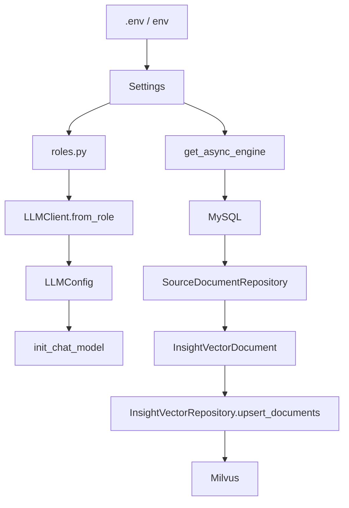
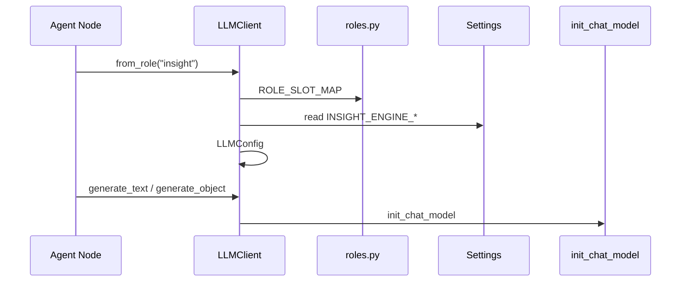
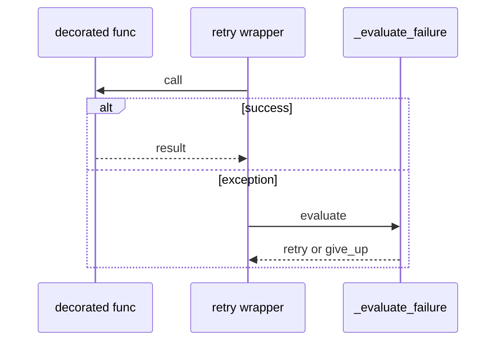
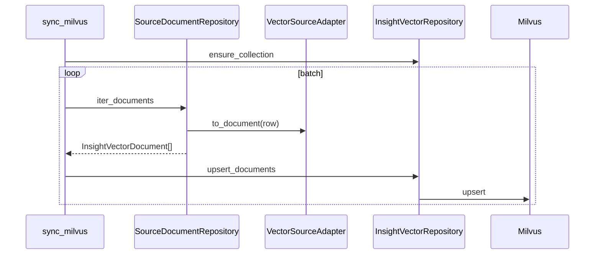
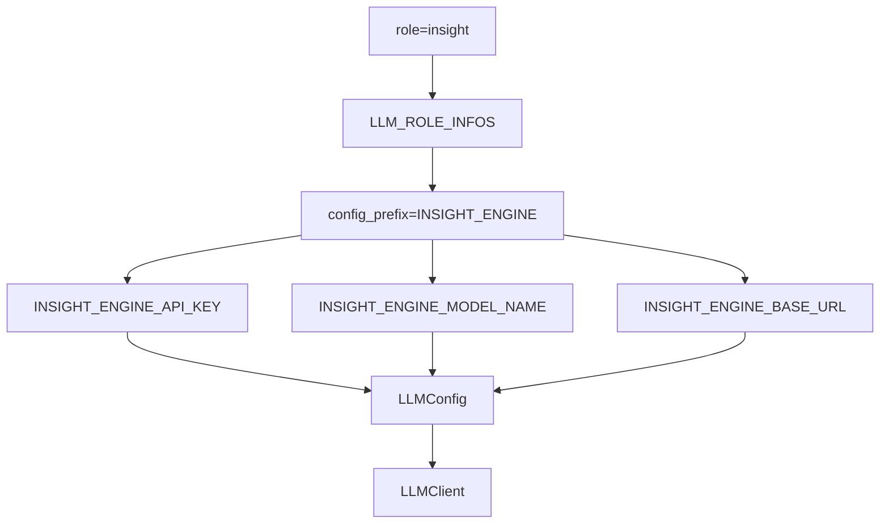
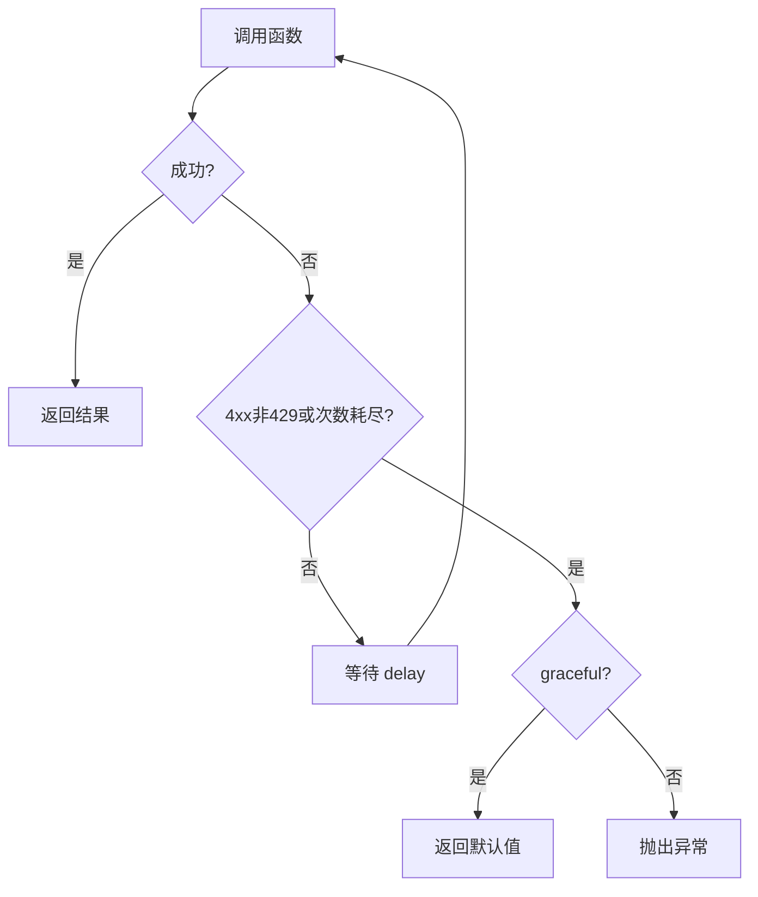
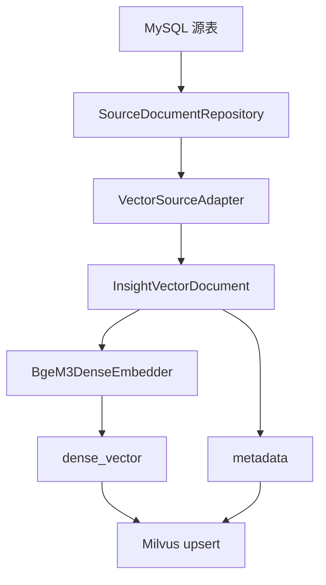

# Day07 上午：配置体系、LLMClient、数据库连接、向量同步

## 1. 本节讲解范围

### 1.1 本节涉及的模块

#### 1.1.1 相关目录

Day06 已经讲完 InsightAgent 私域舆情研究主链路。

Day07 上午进入支撑这些 Agent 能运行起来的底层能力：

```text
engines/contracts/
engines/llm/
engines/common/runtime/
engines/insight_agent/tools/db_search/
engines/insight_agent/tools/vector_search/sync/
```

#### 1.1.2 相关文件

本节重点讲：

```text
engines/contracts/config.py
app/settings.py
engines/contracts/roles.py
engines/llm/llm_client.py
engines/common/runtime/call_retry.py
engines/insight_agent/tools/db_search/connection.py
engines/insight_agent/tools/vector_search/sync/sync_milvus.py
engines/insight_agent/tools/vector_search/sync/source_repository.py
```

#### 1.1.3 本节范围边界

本节不讲业务报告怎么写。

本节讲：

```text
配置如何加载
角色如何映射模型配置
LLMClient 如何统一文本生成与结构化生成
重试机制如何托底 LLM 和外部调用
MySQL 连接如何被复用
MySQL 数据如何同步到 Milvus
```

### 1.2 本节要解决的问题

#### 1.2.1 核心问题

本节要解决：

```text
1. Settings 为什么放在 engines/contracts/config.py
2. app/settings.py 为什么只是转发导出
3. roles.py 如何把 insight/media/host/report 映射到不同模型配置
4. LLMClient.from_role 如何根据角色读配置
5. generate_text 和 generate_object 有什么区别
6. with_retry 与 with_graceful_retry 的差异
7. MySQL AsyncEngine 为什么要全局复用
8. Milvus 同步为什么要先从 MySQL 源表转换成 InsightVectorDocument
```

#### 1.2.2 理解难点

这里的复杂度不在业务逻辑，而在“所有业务都依赖它”。

如果配置、模型、数据库连接、重试机制不稳定，前面所有 Agent 都会受影响。

#### 1.2.3 和 Day06 的关系

Day06 的 InsightAgent 使用了：

```text
ctx.config
ctx.llm_client
get_async_engine()
InsightVectorRepository
with_retry
```

Day07 上午就是把这些底层支撑讲清楚。

## 2. 本节在项目中的位置

### 2.1 全局架构定位

#### 2.1.1 当前模块属于哪一层

本节属于运行时基础设施层。

它支撑：

```text
InsightAgent
MediaAgent
HostAgent
ReportEngine
FastAPI app/services
```

#### 2.1.2 上游模块是谁

上游是所有业务模块。

例如：

```text
LLMClient.from_role("insight")
config.settings.DB_HOST
get_async_engine()
sync_milvus.py
```

#### 2.1.3 下游模块是谁

下游是外部系统：

```text
.env / 环境变量
大模型 API
MySQL
Milvus
Embedding 模型
```

### 2.2 当前模块的职责边界

#### 2.2.1 它负责什么

本节模块负责：

```text
配置加载
配置热重载
角色与模型配置映射
LLM 调用统一封装
供应商参数适配
重试与退避
MySQL 连接创建
Milvus 向量同步
```

#### 2.2.2 它不负责什么

本节模块不负责：

```text
具体报告内容
章节证据选择
HostAgent 研判
MediaAgent 搜索规划
前端展示
```

#### 2.2.3 为什么这样分层

配置和运行时能力必须足够独立。

业务层只应该说：

```text
我要 insight 角色的模型
我要数据库连接
我要同步向量库
```

不应该到处拼 API Key、BaseURL、连接字符串和重试逻辑。

## 3. 总体逻辑流程图

### 3.1 主流程说明

#### 3.1.1 配置从哪里来

配置来源：

```text
项目根目录 .env
系统环境变量
Settings 默认值
```

#### 3.1.2 模型如何创建

模型创建流程：

```text
role
-> LLM_ROLE_INFOS
-> config_prefix
-> settings.<PREFIX>_API_KEY / MODEL_NAME / BASE_URL
-> LLMConfig
-> LLMClient
-> init_chat_model
```

#### 3.1.3 数据如何进入向量库

向量同步流程：

```text
MySQL 源表
-> SourceDocumentRepository
-> VectorSourceAdapter
-> InsightVectorDocument
-> BgeM3DenseEmbedder
-> Milvus upsert
```

### 3.2 主流程图

#### 3.2.1 Mermaid 流程图



#### 3.2.2 流程图逐节点解释

`Settings` 是统一配置对象。

`roles.py` 决定角色使用哪个配置前缀。

`LLMClient` 根据角色构造模型客户端。

`get_async_engine` 根据数据库配置创建连接池。

`sync_milvus.py` 把 MySQL 文档同步到 Milvus。

#### 3.2.3 关键转折点

关键转折点：

```text
环境变量 -> 强类型 Settings
业务 role -> LLM 配置前缀
LLM 配置前缀 -> LLMClient
MySQL row -> InsightVectorDocument
文本内容 -> dense_vector
dense_vector + metadata -> Milvus record
```

## 4. 核心数据流图

### 4.1 配置数据结构

#### 4.1.1 Settings

`Settings` 包含：

```text
服务器配置
数据库配置
四类 LLM 角色配置
Web 搜索配置
报告目录配置
Insight 向量检索配置
Insight 聚类配置
```

#### 4.1.2 RoleInfo

`RoleInfo` 包含：

```text
key
display_name
llm_role
config_prefix
```

#### 4.1.3 LLMConfig

`LLMConfig` 包含：

```text
api_key
model_name
base_url
engine_name
model_provider
retry_config
```

### 4.2 模型调用数据流

#### 4.2.1 文本生成

文本生成：

```text
system_prompt + user_prompt
-> _format_messages
-> stream_text
-> generate_text
-> str
```

#### 4.2.2 结构化生成

结构化生成：

```text
system_prompt + user_prompt + output_model
-> with_structured_output
-> Pydantic model
```

#### 4.2.3 当前时间注入

每次 user prompt 前面会注入：

```text
今天的实际时间是...
```

这是为了避免模型受训练截止日期影响。

### 4.3 向量同步数据流

#### 4.3.1 源表 ORM

源表包括：

```text
DouyinAweme
DouyinAwemeComment
WeiboNote
WeiboNoteComment
```

#### 4.3.2 VectorSourceAdapter

适配器负责把不同源表字段统一读成：

```text
content
author
published_at
published_ts
engagement
```

#### 4.3.3 InsightVectorDocument

最终写入 Milvus 前的统一文档结构。

## 5. 核心调用链图

### 5.1 LLMClient 调用链

#### 5.1.1 调用链展开

```text
LLMClient.from_role("insight")
-> ROLE_SLOT_MAP
-> settings.INSIGHT_ENGINE_*
-> LLMConfig
-> generate_text / generate_object
-> _build_chat_model
-> init_chat_model
```

#### 5.1.2 时序图



#### 5.1.3 逻辑过渡

业务节点不直接知道 API Key。

它只知道自己是哪个 role。

### 5.2 重试调用链

#### 5.2.1 调用链展开

```text
@with_retry
-> _build_decorator
-> _run_async / _run_sync
-> _evaluate_failure
-> delay_for
```

#### 5.2.2 时序图



#### 5.2.3 逻辑过渡

刚性重试失败后抛异常。

柔性重试失败后返回默认值。

### 5.3 Milvus 同步调用链

#### 5.3.1 调用链展开

```text
sync()
-> InsightVectorRepository.ensure_collection
-> SourceDocumentRepository.iter_documents
-> adapter.to_document
-> upsert_documents
-> embedder.encode_documents
-> Milvus upsert
```

#### 5.3.2 时序图



#### 5.3.3 逻辑过渡

向量同步是离线准备步骤。

同步完成后，Day06 的 `semantic_recall` 才有可查数据。

## 6. 手写真实项目核心逻辑

### 6.1 为什么手写真实项目文件

#### 6.1.1 手写不是独立 Demo

Day07 上午讲运行时底座。

如果用独立 Demo，学员很难理解这些底层文件如何支撑前面所有 Agent。

#### 6.1.2 本节手写哪些文件

本节手写：

```text
engines/contracts/config.py
engines/contracts/roles.py
engines/llm/llm_client.py
engines/common/runtime/call_retry.py
```

#### 6.1.3 和项目主链路的对应关系

这些文件共同完成：

```text
环境配置 -> 角色配置 -> 模型客户端 -> 稳定调用
```

### 6.2 手写代码一：`engines/contracts/roles.py`

#### 6.2.1 要实现什么

定义研究角色、展示名、LLM 角色和配置前缀。

#### 6.2.2 完整代码

完整包路径与文件名：

```text
engines/contracts/roles.py
```

完整代码如下：

```python
"""研究角色标识与展示名契约。"""

from __future__ import annotations

from dataclasses import dataclass
from typing import Literal

RoleKey = Literal["insight", "media", "host", "report"]
LLMRoleKey = Literal["insight", "media", "host", "report"]

INSIGHT_ROLE: RoleKey = "insight"
MEDIA_ROLE: RoleKey = "media"
HOST_ROLE: RoleKey = "host"
REPORT_ROLE: RoleKey = "report"
HOST_LLM_ROLE: LLMRoleKey = "host"


@dataclass(frozen=True)
class RoleInfo:
    key: RoleKey
    display_name: str
    llm_role: LLMRoleKey
    config_prefix: str


ROLE_INFOS: dict[RoleKey, RoleInfo] = {
    INSIGHT_ROLE: RoleInfo(
        key=INSIGHT_ROLE,
        display_name="Insight Engine",
        llm_role="insight",
        config_prefix="INSIGHT_ENGINE",
    ),
    MEDIA_ROLE: RoleInfo(
        key=MEDIA_ROLE,
        display_name="Media Engine",
        llm_role="media",
        config_prefix="MEDIA_ENGINE",
    ),
    HOST_ROLE: RoleInfo(
        key=HOST_ROLE,
        display_name="Host Agent",
        llm_role=HOST_LLM_ROLE,
        config_prefix="HOST",
    ),
    REPORT_ROLE: RoleInfo(
        key=REPORT_ROLE,
        display_name="Report Engine",
        llm_role="report",
        config_prefix="REPORT_ENGINE",
    ),
}

LLM_ROLE_INFOS: dict[LLMRoleKey, RoleInfo] = {
    info.llm_role: info for info in ROLE_INFOS.values()
}

RESEARCH_ROLE_KEYS: tuple[RoleKey, RoleKey] = (INSIGHT_ROLE, MEDIA_ROLE)
HOST_DISCUSSION_SENDERS: frozenset[str] = frozenset(
    ROLE_INFOS[role].display_name for role in (INSIGHT_ROLE, MEDIA_ROLE, HOST_ROLE)
)


def role_display_name(role: str) -> str:
    info = ROLE_INFOS.get(role)  # type: ignore[arg-type]
    if info:
        return info.display_name
    return f"{role.title()} Engine"
```

#### 6.2.3 逐块解释

`RoleKey` 是业务角色。

`LLMRoleKey` 是模型角色。

`config_prefix` 决定读取哪组配置。

#### 6.2.4 关键设计意图

业务代码只传 role，不直接拼环境变量名。

### 6.3 手写代码二：`engines/llm/llm_client.py`

#### 6.3.1 要实现什么

实现统一 LLM 客户端。

#### 6.3.2 完整代码

完整包路径与文件名：

```text
engines/llm/llm_client.py
```

完整代码如下：

```python
"""统一 LLM 客户端工厂与适配器。"""

import os
from datetime import datetime
from typing import Any, AsyncGenerator, Optional, TypeVar

from loguru import logger
from pydantic import BaseModel, Field

from langchain.chat_models import init_chat_model
from langchain_core.language_models.chat_models import BaseChatModel

from engines.common.runtime.call_retry import LLM_RETRY_CONFIG, RetryConfig, with_retry
from engines.contracts.roles import LLM_ROLE_INFOS

T = TypeVar("T", bound=BaseModel)


def _prepend_time_context(user_prompt: str) -> str:
    """为用户的 prompt 注入当前真实时间上下文，防止大模型受限于训练截止日期。"""
    current_time = datetime.now().strftime("%Y年%m月%d日%H时%M分")
    time_prefix = f"今天的实际时间是{current_time}"
    if user_prompt:
        return f"{time_prefix}\n{user_prompt}"
    return time_prefix


def _format_messages(system_prompt: str, user_prompt: str) -> list[dict]:
    """将 prompt 格式化为标准的大模型消息列表。"""
    return [
        {"role": "system", "content": system_prompt},
        {"role": "user", "content": _prepend_time_context(user_prompt)},
    ]


class LLMConfig(BaseModel):
    """LLM 客户端的底层配置模型"""

    api_key: str = Field(..., min_length=1)
    model_name: str = Field(..., min_length=1)
    base_url: Optional[str] = None
    engine_name: str = "Engine"
    model_provider: str = "openai"

    # 重试策略作为实例配置的一部分, 运行时由装饰器动态读取
    retry_config: RetryConfig = Field(default_factory=lambda: LLM_RETRY_CONFIG)

    @property
    def timeout(self) -> float:
        """动态读取环境变量中的超时配置，带默认 fallback"""
        prefix = self.engine_name.upper().replace(" ", "_")
        fallback = os.getenv(f"{prefix}_REQUEST_TIMEOUT", "1800")
        return float(fallback)


class LLMClient:
    """
    大模型统一调度门面
    封装了网络容错、厂商特性抹平、流式/结构化输出的复杂底层逻辑。
    """

    ROLE_SLOT_MAP = {
        role: (info.config_prefix, info.display_name)
        for role, info in LLM_ROLE_INFOS.items()
    }

    def __init__(self, config: LLMConfig):
        self.config = config

    @classmethod
    def from_role(cls, role: str) -> "LLMClient":

        from engines.contracts import config

        if role not in cls.ROLE_SLOT_MAP:
            raise ValueError(f"未知 LLM 角色: {role!r}, 可选 {list(cls.ROLE_SLOT_MAP)}")

        prefix, engine_name = cls.ROLE_SLOT_MAP[role]

        return cls(LLMConfig(
            api_key=getattr(config.settings, f"{prefix}_API_KEY") or "",
            model_name=getattr(config.settings, f"{prefix}_MODEL_NAME") or "",
            base_url=getattr(config.settings, f"{prefix}_BASE_URL", None),
            engine_name=engine_name,
            model_provider=getattr(config.settings, f"{prefix}_MODEL_PROVIDER", None) or "openai",
        ))

    async def stream_text(self, system_prompt: str, user_prompt: str, **kwargs) -> AsyncGenerator[str, None]:
        """流式生成文本"""
        llm = self._build_chat_model(**kwargs)
        try:
            async for chunk in llm.astream(_format_messages(system_prompt, user_prompt)):
                text = chunk.text
                if text:
                    yield text
        except Exception as e:
            logger.error(f"[{self.config.engine_name}] 流式请求失败: {str(e)} (模型 {self.config.model_name})")
            raise e

    @with_retry
    async def generate_text(self, system_prompt: str, user_prompt: str, **kwargs) -> str:
        """完整文本生成：底层采用流式规避网关超时，外层重试防御网络闪断。"""
        text_chunks = []
        async for text_chunk in self.stream_text(system_prompt, user_prompt, **kwargs):
            text_chunks.append(text_chunk)

        return "".join(text_chunks)

    @with_retry
    async def generate_object(self,
                              system_prompt: str,
                              user_prompt: str,
                              output_model: type[T],
                              **kwargs) -> T:
        """结构化对象生成：返回指定的 Pydantic 模型实例。"""
        llm = self._build_chat_model(is_structured=True, **kwargs)
        structured = llm.with_structured_output(output_model, method="function_calling")

        try:
            result = await structured.ainvoke(_format_messages(system_prompt, user_prompt))
            if result is None:
                raise ValueError(f"[{self.config.engine_name}] 返回 None")
            return result

        except Exception as e:
            # 向上抛出交由重试引擎处理
            logger.error(f"[{self.config.engine_name}] 结构化调用失败: {str(e)} (模型 {self.config.model_name})")
            raise e

    def _build_chat_model(self, is_structured: bool = False, **kwargs) -> BaseChatModel:
        """模型装配工厂：统一底层重试权，注入适配器逻辑。"""

        params = {k: v for k, v in kwargs.items() if v is not None}

        # 剥离非底层模型参数 应用厂商适配
        params = self._adapt_provider_params(params, is_structured)
        timeout = params.pop("timeout", self.config.timeout)

        return init_chat_model(
            model=self.config.model_name,
            model_provider=self.config.model_provider,
            api_key=self.config.api_key,
            base_url=self.config.base_url,
            timeout=timeout,
            max_retries=0,  # 强制关闭底层 SDK 重试权，交由统一的 @with_retry 重试器引擎接管
            **params,
        )

    def _adapt_provider_params(self, params: dict[str, Any], is_structured: bool) -> dict[str, Any]:
        """厂商适配器 抹平各家大模型非标参数的差异。"""
        model = self.config.model_name.lower()

        # Kimi / Moonshot 专属
        if "kimi" in model or "moonshot" in model:
            if is_structured:
                # 结构化输出必须禁用思考模型 (私有参数)，且温度锁定为 0.6
                params["extra_body"] = {"thinking": {"type": "disabled"}}
                params["temperature"] = 0.6
            else:
                params["temperature"] = 1.0

        return params
```

#### 6.3.3 逐块解释

`from_role()` 是业务最常用入口。

`generate_text()` 返回纯文本。

`generate_object()` 返回 Pydantic 对象。

`_adapt_provider_params()` 处理供应商差异。

#### 6.3.4 关键设计意图

所有 Agent 不直接调用某个具体厂商 SDK。

它们只调用统一门面 `LLMClient`。

### 6.4 手写代码三：`engines/common/runtime/call_retry.py`

#### 6.4.1 要实现什么

实现同步/异步通用重试装饰器。

#### 6.4.2 完整代码

完整包路径与文件名：

```text
engines/common/runtime/call_retry.py
```

完整代码如下：

```python
"""公共基础设施模块：engines/common/runtime/call_retry.py。"""

import asyncio
import time
from pydantic.dataclasses import dataclass
from functools import wraps
from typing import Any, Awaitable, Callable, Optional, Union
from loguru import logger

__all__ = [
    "RetryConfig",
    "with_retry",
    "with_graceful_retry",
    "DEFAULT_RETRY_CONFIG",
    "LLM_RETRY_CONFIG",
    "SEARCH_API_RETRY_CONFIG",
    "DB_RETRY_CONFIG",
]


@dataclass(frozen=True)
class RetryConfig:
    max_retries: int = 3
    initial_delay: float = 1.0
    backoff_factor: float = 2.0
    max_delay: float = 60.0

    def delay_for(self, attempt: int) -> float:
        return min(self.initial_delay * (self.backoff_factor ** attempt), self.max_delay)


@dataclass(frozen=True)
class _Decision:
    """单次失败后的处置:要么继续重试(give_up=False, delay=等待秒数),
    要么放弃(give_up=True)——放弃后由引擎决定抛异常还是返回默认值。"""

    give_up: bool
    delay: float = 0.0


def _is_non_retryable(exc: Exception) -> bool:
    """4xx 客户端错误(限流 429 除外)重试无意义,立即失败。"""
    status = getattr(exc, "status_code", None)
    if status is None:
        response = getattr(exc, "response", None)
        status = getattr(response, "status_code", None)
    return isinstance(status, int) and 400 <= status < 500 and status != 429


def _evaluate_failure(
        name: str,
        attempt: int,
        exc: Exception,
        config: RetryConfig,
        graceful: bool,
) -> _Decision:
    """中心化决策:分析错误、判断是否还能重试、打印日志,返回处置动作"""
    exhausted = attempt >= config.max_retries
    non_retryable = _is_non_retryable(exc)

    if non_retryable or exhausted:
        if graceful:  # 如果是柔性重试
            logger.warning(f"非关键调用 {name} 失败,返回默认值: {exc}")
        elif non_retryable:  # 如果是刚性重试且是绝症错误
            logger.error(f"函数 {name} 遇到不可重试的错误: {exc}")
        else:  # 如果是刚性重试且重试次数用光了
            logger.error(f"函数 {name} 在 {attempt + 1} 次尝试后仍然失败: {exc}")
        return _Decision(give_up=True)

    delay = config.delay_for(attempt)
    logger.warning(f"函数 {name} 第 {attempt + 1} 次尝试失败: {exc}")
    logger.info(f"将在 {delay:.1f} 秒后进行第 {attempt + 2} 次尝试...")
    return _Decision(give_up=False, delay=delay)


def _resolve_config(fallback: RetryConfig, args: tuple) -> RetryConfig:
    """运行时解析实际生效的配置:优先读取被装饰方法所属实例的 config.retry_config"""
    if args:
        instance_config = getattr(args[0], "config", None)
        candidate = getattr(instance_config, "retry_config", None)
        if isinstance(candidate, RetryConfig):
            return candidate
    return fallback


def _run_sync(
        func: Callable[..., Any],
        fallback: RetryConfig,
        graceful: bool,
        default_return: Any,
        args: tuple,
        kwargs: dict,
) -> Any:
    config = _resolve_config(fallback, args)
    for attempt in range(config.max_retries + 1):
        try:
            return func(*args, **kwargs)
        except Exception as e:
            decision = _evaluate_failure(func.__name__, attempt, e, config, graceful)
            if decision.give_up:
                if graceful:
                    return default_return
                raise
            time.sleep(decision.delay)
    return default_return


async def _run_async(
        func: Callable[..., Awaitable[Any]],
        fallback: RetryConfig,
        graceful: bool,
        default_return: Any,
        args: tuple,
        kwargs: dict,
) -> Any:
    config = _resolve_config(fallback, args)
    for attempt in range(config.max_retries + 1):
        try:
            return await func(*args, **kwargs)
        except Exception as e:
            decision = _evaluate_failure(func.__name__, attempt, e, config, graceful)
            if decision.give_up:
                if graceful:
                    return default_return
                raise
            await asyncio.sleep(decision.delay)
    return default_return


def _build_decorator(fallback: RetryConfig, graceful: bool, default_return: Any) -> Callable:
    """装饰器工厂接收兜底配置参数在内部产出一个真正的装饰器并return出去"""

    def decorator(func: Callable) -> Callable:
        """真正的装饰器捕捉目标函数"""
        if asyncio.iscoroutinefunction(func):
            # 如果原函数是 async def 定义
            @wraps(func)  # 保留装饰函数的元数据
            async def async_wrapper(*args, **kwargs) -> Any:
                return await _run_async(func, fallback, graceful, default_return, args, kwargs)

            return async_wrapper

        # 如果原函数是普通的 def 定义
        @wraps(func)
        def sync_wrapper(*args, **kwargs) -> Any:
            return _run_sync(func, fallback, graceful, default_return, args, kwargs)

        return sync_wrapper

    return decorator


def with_retry(
        _func: Optional[Callable] = None,
        *,
        config: Optional[RetryConfig] = None,
) -> Union[Callable, Any]:
    """刚性重试：重试失败或遇到致命错误时向上抛异常。同步/异步均可"""
    actual_decorator = _build_decorator(config or DEFAULT_RETRY_CONFIG, graceful=False, default_return=None)
    if _func is None:
        return actual_decorator
    return actual_decorator(_func)


def with_graceful_retry(
        _func: Optional[Callable] = None,
        *,
        config: Optional[RetryConfig] = None,
        default_return: Any = None,
) -> Union[Callable, Any]:
    """柔性重试：失败时不抛异常,返回兜底默认值,调用方安全向下执行。同步/异步均可"""
    actual_decorator = _build_decorator(config or DEFAULT_RETRY_CONFIG, graceful=True, default_return=default_return)
    if _func is None:
        return actual_decorator
    return actual_decorator(_func)


DEFAULT_RETRY_CONFIG = RetryConfig()

LLM_RETRY_CONFIG = RetryConfig(
    max_retries=4,
    initial_delay=15.0,
    backoff_factor=2.0,
    max_delay=120.0,
)

SEARCH_API_RETRY_CONFIG = RetryConfig(
    max_retries=5,
    initial_delay=2.0,
    backoff_factor=1.6,
    max_delay=25.0,
)

DB_RETRY_CONFIG = RetryConfig(
    max_retries=5,
    initial_delay=1.0,
    backoff_factor=1.5,
    max_delay=10.0,
)
```

#### 6.4.3 逐块解释

`RetryConfig` 描述重试次数和退避时间。

`_evaluate_failure` 决定继续还是放弃。

`with_retry` 是刚性重试。

`with_graceful_retry` 是柔性重试。

#### 6.4.4 关键设计意图

把“失败后怎么处理”从业务代码中抽出来。

## 7. 手写逻辑执行流程图

### 7.1 配置加载流程

#### 7.1.1 第一步执行什么

定位项目根目录 `.env`。

#### 7.1.2 第二步执行什么

`Settings` 读取默认值、`.env`、环境变量。

#### 7.1.3 最终得到什么

得到进程内 `settings` 单例。

### 7.2 LLM 调用流程

#### 7.2.1 第一步执行什么

业务节点调用 `LLMClient.from_role(role)`。

#### 7.2.2 第二步执行什么

根据 `config_prefix` 读取对应模型配置。

#### 7.2.3 最终得到什么

得到可执行 `generate_text` 或 `generate_object` 的客户端。

### 7.3 向量同步流程

#### 7.3.1 第一步执行什么

读取 MySQL 源表数据。

#### 7.3.2 第二步执行什么

转成统一 `InsightVectorDocument`。

#### 7.3.3 最终得到什么

写入 Milvus 集合。

### 7.4 手写流程图

#### 7.4.1 角色到模型配置



#### 7.4.2 重试决策



#### 7.4.3 MySQL 到 Milvus



## 8. 项目源码解读

### 8.1 文件一：`engines/contracts/config.py`

#### 8.1.1 文件职责

定义全局运行配置契约。

#### 8.1.2 为什么需要这个文件

所有层都需要统一读取配置。

配置契约放在 `engines/contracts`，可以被 app 层和 engines 层共同引用。

#### 8.1.3 上游调用者

```text
app/settings.py
LLMClient.from_role
InsightRetrievalService
InsightVectorRepository
ReportInputService
```

#### 8.1.4 下游依赖

```text
pydantic_settings.BaseSettings
.env
环境变量
```

#### 8.1.5 完整源码

完整包路径与文件名：

```text
engines/contracts/config.py
```

完整代码如下：

```python
"""全局运行配置契约。"""

import threading
from pathlib import Path
from typing import Literal, Optional

from pydantic import ConfigDict, Field
from pydantic_settings import BaseSettings

# .env 固定在项目根目录,不依赖运行时 cwd
PROJECT_ROOT: Path = Path(__file__).resolve().parents[2]
ENV_FILE: str = str(PROJECT_ROOT / ".env")


class Settings(BaseSettings):
    """全局配置;支持 .env 与环境变量自动加载。"""

    # ================== 服务器 ==================
    HOST: str = Field("0.0.0.0", description="监听地址")
    PORT: int = Field(5000, description="监听端口")
    LOG_LEVEL: str = Field("INFO", description="日志等级")

    # ================== 舆情库(只读) ==================
    DB_DIALECT: str = Field("mysql", description="数据库类型:mysql 或 postgresql")
    DB_HOST: str = Field("localhost", description="数据库主机")
    DB_PORT: int = Field(3306, description="数据库端口")
    DB_USER: str = Field("root", description="数据库用户名")
    DB_PASSWORD: str = Field("", description="数据库密码")
    DB_NAME: str = Field("media_crawler", description="数据库名称")
    DB_CHARSET: str = Field("utf8mb4", description="字符集")

    # ================== LLM 位:insight 研究角色 ==================
    INSIGHT_ENGINE_API_KEY: Optional[str] = Field(None, description="Insight 角色 API 密钥")
    INSIGHT_ENGINE_BASE_URL: Optional[str] = Field("https://api.moonshot.cn/v1", description="Insight 角色 BaseUrl")
    INSIGHT_ENGINE_MODEL_NAME: str = Field("kimi-k2-0711-preview", description="Insight 角色模型名")
    INSIGHT_ENGINE_MODEL_PROVIDER: str = Field("openai", description="Insight 角色厂商(langchain provider)")

    # ================== LLM 位:media 研究角色 ==================
    MEDIA_ENGINE_API_KEY: Optional[str] = Field(None, description="Media 角色 API 密钥")
    MEDIA_ENGINE_BASE_URL: Optional[str] = Field("https://aihubmix.com/v1", description="Media 角色 BaseUrl")
    MEDIA_ENGINE_MODEL_NAME: str = Field("gemini-2.5-pro", description="Media 角色模型名")
    MEDIA_ENGINE_MODEL_PROVIDER: str = Field("openai", description="Media 角色厂商(langchain provider)")

    # ================== LLM 位:报告引擎 ==================
    REPORT_ENGINE_API_KEY: Optional[str] = Field(None, description="报告引擎 API 密钥")
    REPORT_ENGINE_BASE_URL: Optional[str] = Field("https://aihubmix.com/v1", description="报告引擎 BaseUrl")
    REPORT_ENGINE_MODEL_NAME: str = Field("gemini-2.5-pro", description="报告引擎模型名")
    REPORT_ENGINE_MODEL_PROVIDER: str = Field("openai", description="报告引擎厂商(langchain provider)")

    # ================== LLM 位:HostAgent ==================
    HOST_API_KEY: Optional[str] = Field(None, description="HostAgent API 密钥")
    HOST_BASE_URL: Optional[str] = Field(None, description="HostAgent BaseUrl")
    HOST_MODEL_NAME: Optional[str] = Field(None, description="HostAgent 模型名")
    HOST_MODEL_PROVIDER: str = Field("openai", description="HostAgent 厂商(langchain provider)")

    # ================== Web 搜索 ==================
    SEARCH_TOOL_TYPE: Literal["TavilyAPI", "AnspireAPI", "BochaAPI"] = Field(
        "TavilyAPI", description="Web 搜索提供方"
    )
    TAVILY_API_KEY: Optional[str] = Field(None, description="Tavily API 密钥")
    BOCHA_BASE_URL: Optional[str] = Field("https://api.bocha.cn/v1/ai-search", description="Bocha BaseUrl")
    BOCHA_API_KEY: Optional[str] = Field(None, description="Bocha API 密钥")
    ANSPIRE_BASE_URL: Optional[str] = Field(
        "https://plugin.anspire.cn/api/ntsearch/search", description="Anspire BaseUrl"
    )
    ANSPIRE_API_KEY: Optional[str] = Field(None, description="Anspire API 密钥")

    # ================== 研究引擎 ==================
    MAX_SECTIONS: int = Field(5, description="报告最大章节数")
    SEARCH_TIMEOUT: int = Field(240, description="单次搜索请求超时(秒)")
    SEARCH_CONTENT_MAX_LENGTH: int = Field(20000, description="供 LLM 的搜索结果最大长度")
    MAX_CONTENT_LENGTH: int = Field(500000, description="搜索最大内容长度")
    OUTPUT_DIR: str = Field("data/report", description="报告输出目录(运行时按角色覆盖)")
    HOST_REPORT_DIR: str = Field("data/report/host", description="Host 研判报告输出目录")
    INSIGHT_REPORT_DIR: str = Field("data/report/insight", description="Insight 研究报告输出目录")
    MEDIA_REPORT_DIR: str = Field("data/report/media", description="Media 研究报告输出目录")

    # ================== Insight vector retrieval ==================
    INSIGHT_VECTOR_ENABLED: bool = Field(False, description="Enable Milvus vector retrieval for InsightAgent")
    MILVUS_URI: str = Field("http://localhost:19530", description="Milvus server URI")
    MILVUS_TOKEN: Optional[str] = Field(None, description="Milvus auth token")
    MILVUS_DB_NAME: str = Field("default", description="Milvus database name")
    MILVUS_INSIGHT_COLLECTION: str = Field("insight_evidence", description="Insight evidence collection")
    INSIGHT_EMBEDDING_MODEL: str = Field("BAAI/bge-m3", description="Embedding model for insight retrieval")
    INSIGHT_EMBEDDING_DEVICE: Optional[str] = Field(None, description="Embedding runtime device, e.g. cuda or cpu")
    INSIGHT_DENSE_DIM: int = Field(1024, description="BGE-M3 dense vector dimension")
    INSIGHT_VECTOR_TOP_K: int = Field(80, description="Milvus recall size per channel")
    INSIGHT_VECTOR_FILTER_DAYS: int = Field(365, description="Milvus retrieval time window in days; <=0 disables filter")
    INSIGHT_SYNC_BATCH_SIZE: int = Field(64, description="Milvus sync embedding/upsert batch size")
    INSIGHT_CLUSTERING_ENABLED: bool = Field(True, description="Enable semantic clustering for InsightAgent")
    INSIGHT_CLUSTER_MODEL: Optional[str] = Field(None, description="SentenceTransformer model path/name for clustering")
    INSIGHT_CLUSTER_MAX_RECORDS: int = Field(300, description="Max evidence records used for semantic clustering")
    INSIGHT_CLUSTER_MAX_CLUSTERS: int = Field(12, description="Max semantic clusters")
    INSIGHT_CLUSTER_MIN_CLUSTER_SIZE: int = Field(3, description="Min preferred semantic cluster size")

    model_config = ConfigDict(
        env_file=ENV_FILE,
        env_prefix="",
        case_sensitive=False,
        extra="allow",
    )


settings = Settings()

_reload_lock = threading.Lock()


def reload_settings() -> Settings:
    """Reload settings from .env and environment variables."""
    global settings
    fresh = Settings(_env_file=ENV_FILE)
    with _reload_lock:
        settings = fresh
    return settings
```

#### 8.1.6 代码逐块解释

`PROJECT_ROOT` 固定项目根目录。

`Settings` 用 `BaseSettings` 加载配置。

`settings` 是进程内配置单例。

`reload_settings()` 支持运行时重新加载配置。

#### 8.1.7 关键设计意图

配置不依赖当前启动目录。

不管从哪里启动进程，都固定读取项目根目录 `.env`。

#### 8.1.8 如果不这样设计会怎样

不同启动方式下可能读到不同 `.env`，导致配置漂移。

### 8.2 文件二：`engines/insight_agent/tools/db_search/connection.py`

#### 8.2.1 文件职责

创建并复用 InsightAgent 私域库异步数据库连接引擎。

#### 8.2.2 为什么需要这个文件

数据库连接池不能在每次查询时重复创建。

#### 8.2.3 上游调用者

```text
InsightSearchRepository
SourceDocumentRepository
```

#### 8.2.4 下游依赖

```text
SQLAlchemy AsyncEngine
aiomysql
config.settings
```

#### 8.2.5 完整源码

完整包路径与文件名：

```text
engines/insight_agent/tools/db_search/connection.py
```

完整代码如下：

```python
"""InsightAgent 私有舆情库数据库连接模块。"""

from __future__ import annotations

from typing import Optional

from sqlalchemy.engine import URL
from sqlalchemy.ext.asyncio import AsyncEngine, create_async_engine

from engines.contracts import config


_engine: Optional[AsyncEngine] = None


def _build_database_url() -> URL:
    return URL.create(
        drivername="mysql+aiomysql",
        username=config.settings.DB_USER or "",
        password=config.settings.DB_PASSWORD or "",
        host=config.settings.DB_HOST or "",
        port=config.settings.DB_PORT,
        database=config.settings.DB_NAME or "",
    )


def get_async_engine() -> AsyncEngine:
    global _engine
    if _engine is None:
        database_url: URL = _build_database_url()
        _engine = create_async_engine(
            database_url,
            pool_pre_ping=True,
            pool_recycle=1800,
        )
    return _engine
```

#### 8.2.6 代码逐块解释

`_build_database_url()` 使用配置拼接数据库 URL。

`get_async_engine()` 懒加载全局 `_engine`。

`pool_pre_ping=True` 用于检测连接是否仍有效。

`pool_recycle=1800` 避免长期连接被 MySQL 主动断开。

#### 8.2.7 关键设计意图

数据库连接池应该进程内复用。

#### 8.2.8 如果不这样设计会怎样

频繁创建连接池会浪费资源，也容易触发数据库连接数问题。

### 8.3 文件三：`engines/insight_agent/tools/vector_search/sync/sync_milvus.py`

#### 8.3.1 文件职责

提供 MySQL 到 Milvus 的向量同步入口。

#### 8.3.2 为什么需要这个文件

语义召回依赖 Milvus 中已有向量数据。

这些数据需要从 MySQL 源表批量同步。

#### 8.3.3 上游调用者

```text
命令行脚本
开发者手动执行
定时任务
```

#### 8.3.4 下游依赖

```text
InsightVectorRepository
SourceDocumentRepository
BgeM3DenseEmbedder
Milvus
```

#### 8.3.5 完整源码

完整包路径与文件名：

```text
engines/insight_agent/tools/vector_search/sync/sync_milvus.py
```

完整代码如下：

```python
"""InsightAgent 私有舆情库研究模块：engines/insight_agent/tools/vector_search/sync/sync_milvus.py。"""

from __future__ import annotations

import argparse
import asyncio

from loguru import logger

from engines.contracts import config
from engines.insight_agent.tools.vector_search.repository import InsightVectorRepository
from engines.insight_agent.tools.vector_search.sync.source_repository import SourceDocumentRepository


async def sync(drop_existing: bool = False, batch_size: int | None = None) -> int:
    settings = config.settings
    milvus_repository = InsightVectorRepository(settings)
    source_repository = SourceDocumentRepository()
    batch_size = batch_size or settings.INSIGHT_SYNC_BATCH_SIZE

    milvus_repository.ensure_collection(drop_existing=drop_existing)

    total = 0
    async for documents in source_repository.iter_documents(batch_size=batch_size):
        count = milvus_repository.upsert_documents(documents)
        total += count
        logger.info(f"[insight] 同步Milvus 批次={count} 总计={total}")

    logger.info(f"[insight] Milvus 同步完成 总计={total}")
    return total


def main() -> None:
    parser = argparse.ArgumentParser(description="同步MySQL数据到Milvus")
    parser.add_argument("--drop-existing", action="store_true", help="删除重建集合.")
    parser.add_argument("--batch-size", type=int, default=None, help="嵌入/插入批次大小.")
    args = parser.parse_args()
    asyncio.run(sync(drop_existing=args.drop_existing, batch_size=args.batch_size))


if __name__ == "__main__":
    main()
```

#### 8.3.6 代码逐块解释

`sync()` 是异步同步主函数。

`ensure_collection()` 保证 Milvus 集合存在。

`iter_documents()` 按批读取 MySQL 文档。

`upsert_documents()` 生成向量并写入 Milvus。

#### 8.3.7 关键设计意图

向量同步与在线查询解耦。

在线查询只负责查 Milvus，不负责临时同步全量数据。

#### 8.3.8 如果不这样设计会怎样

InsightAgent 每次运行都要临时向量化，性能不可接受。

## 9. 关键对象与状态拆解

### 9.1 核心对象一：`Settings`

#### 9.1.1 对象定义

全局运行配置模型。

#### 9.1.2 字段含义

字段覆盖：

```text
服务端口
数据库
LLM 角色
搜索工具
输出目录
Milvus
Embedding
聚类
```

#### 9.1.3 生命周期

进程启动时创建。

调用 `reload_settings()` 时替换。

### 9.2 核心对象二：`LLMClient`

#### 9.2.1 对象定义

统一模型调用门面。

#### 9.2.2 字段含义

```text
config: LLMConfig
```

#### 9.2.3 生命周期

通常由 Agent Context 创建并持有。

### 9.3 核心对象三：`RetryConfig`

#### 9.3.1 对象定义

重试策略配置。

#### 9.3.2 字段含义

```text
max_retries
initial_delay
backoff_factor
max_delay
```

#### 9.3.3 生命周期

作为装饰器默认配置或实例配置使用。

## 10. 边界情况与异常分支

### 10.1 未知 LLM role

#### 10.1.1 什么情况下发生

调用：

```python
LLMClient.from_role("unknown")
```

#### 10.1.2 代码如何处理

抛出 `ValueError`。

#### 10.1.3 为什么这样处理

角色配置错误属于开发错误，应尽早失败。

### 10.2 LLM 4xx 错误

#### 10.2.1 什么情况下发生

API Key 错误、参数错误、模型名错误。

#### 10.2.2 代码如何处理

除 429 外，4xx 被认为不可重试。

#### 10.2.3 为什么这样处理

参数错误重复请求没有意义。

### 10.3 MySQL 连接失效

#### 10.3.1 什么情况下发生

连接空闲太久或被 MySQL 主动断开。

#### 10.3.2 代码如何处理

`pool_pre_ping=True` 检查连接。

`pool_recycle=1800` 定期回收连接。

#### 10.3.3 为什么这样处理

减少长时间运行服务中的偶发连接错误。

## 11. 本节代码在完整链路中的作用

### 11.1 本节之前发生了什么

#### 11.1.1 上一段链路输出

Day06 已经把 InsightAgent 业务流程讲完。

#### 11.1.2 本节接收的数据

本节接收的不是业务数据，而是运行时配置：

```text
.env
环境变量
MySQL 连接参数
LLM API 参数
Milvus 参数
```

#### 11.1.3 本节开始的条件

项目启动或执行向量同步脚本。

### 11.2 本节推进了什么

#### 11.2.1 推进了哪一步业务

本节支撑所有 Agent 的稳定运行。

#### 11.2.2 改变了哪些状态

改变：

```text
settings
LLMClient config
MySQL connection pool
Milvus collection data
```

#### 11.2.3 产出了哪些结果

产出：

```text
统一配置对象
统一 LLM 客户端
可复用数据库连接
可检索向量库
```

### 11.3 本节之后交给谁

#### 11.3.1 下游模块

下游是：

```text
InsightAgent
MediaAgent
HostAgent
ReportEngine
ReportService
```

#### 11.3.2 下游输入

下游使用：

```text
settings
LLMClient
get_async_engine()
Milvus collection
```

#### 11.3.3 下午如何衔接

Day07 下午可以继续讲：

```text
公共运行时与可观测性：SSE、事件总线、role 日志流、进度模型、报告 IO、错误兜底如何串起三 Agent。
```
