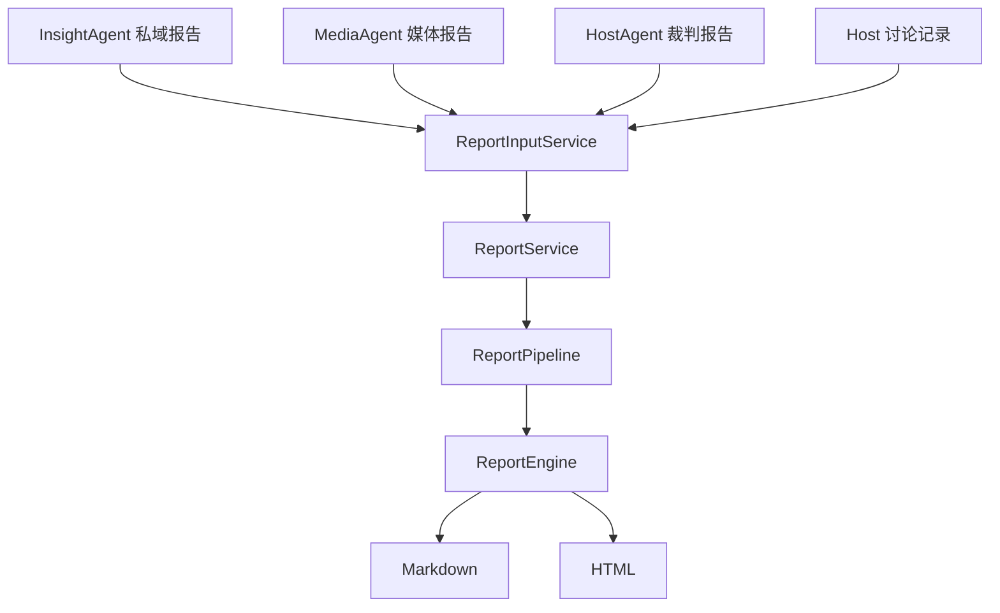
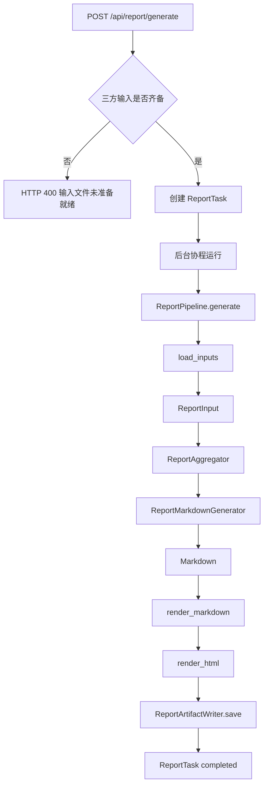
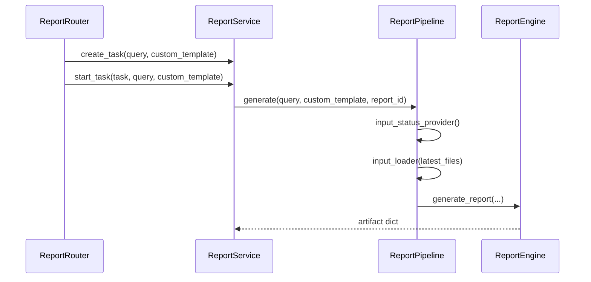
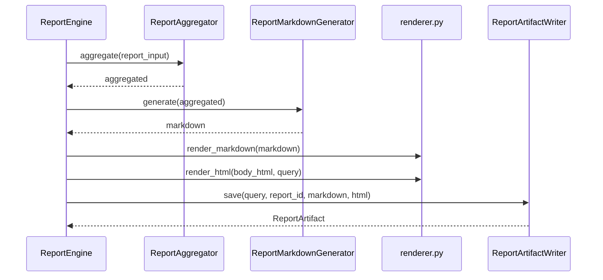
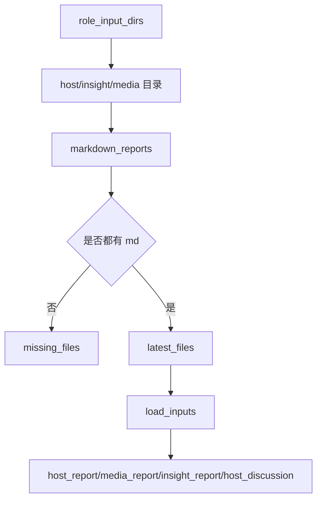
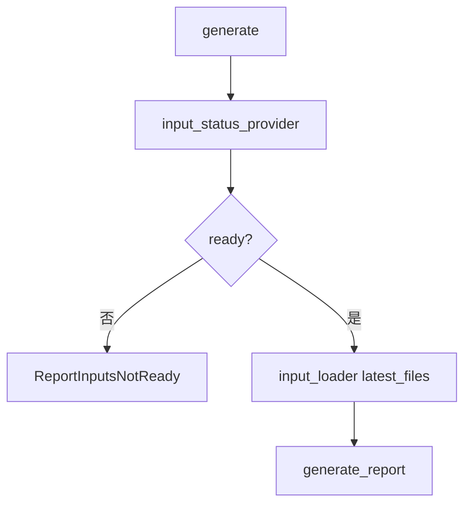
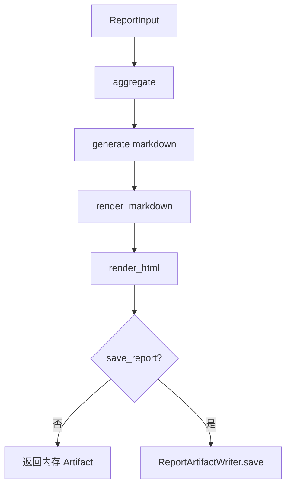
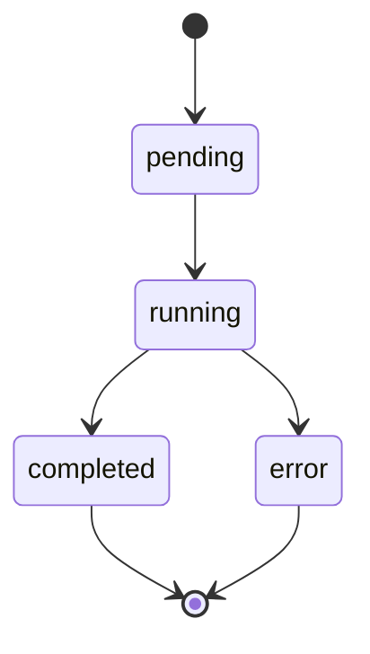
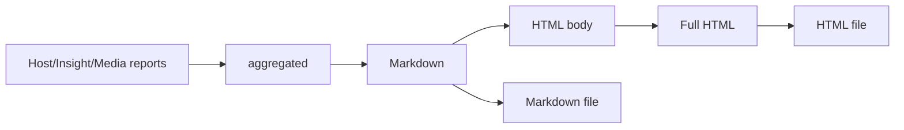

# Day08 上午：ReportEngine 聚合生成、渲染保存、导出下载

## 1. 本节讲解范围

### 1.1 本节涉及的模块

#### 1.1.1 相关目录

Day08 不讲前端，上午聚焦后端最终报告生成闭环。

本节涉及：

```text
app/routers/rest/
app/services/report/
engines/orchestration/
engines/report_engine/
engines/common/io/
```

#### 1.1.2 相关文件

本节重点讲：

```text
app/routers/rest/report.py
app/schemas/report.py
app/services/report/input_service.py
app/services/report/task_store.py
app/services/report/service.py
engines/orchestration/report_pipeline.py
engines/report_engine/schemas.py
engines/report_engine/aggregator.py
engines/report_engine/generator.py
engines/report_engine/prompts.py
engines/report_engine/engine.py
engines/report_engine/renderer.py
engines/report_engine/writer.py
engines/common/io/reports.py
```

#### 1.1.3 本节范围边界

本节只讲后端最终报告链路：

```text
检查输入
创建任务
后台生成
聚合三方报告
LLM 生成 Markdown
渲染 HTML
保存 Markdown / HTML
查询结果
下载导出
```

不讲前端页面如何展示，也不讲前端 SSE 交互。

### 1.2 本节要解决的问题

#### 1.2.1 本节需要掌握的核心问题

本节需要掌握：

```text
1. 最终报告为什么必须等待 Host / Insight / Media 三方报告
2. ReportService 为什么要做后台任务，而不是同步生成
3. ReportPipeline 为什么放在 orchestration 层
4. ReportEngine 为什么以 Host 裁判报告为主线
5. Markdown 和 HTML 为什么都要保存
6. /result、/download、/export/md 三个接口有什么区别
```

#### 1.2.2 本节的理解难点

最终报告不是第四个研究 Agent。

它不负责检索、不负责公开媒体搜索、不负责主持人裁决。

它是一个“最终成稿引擎”：

```text
拿三方已经完成的报告
按照主持人裁判结论重新组织
输出一份可交付的完整研究报告
```

#### 1.2.3 本节和上一节的关系

Day05 已经讲过 HostAgent 如何产出主持人最终裁判报告。

Day06 已经讲过 InsightAgent 如何产出私域舆情报告。

Day04 已经讲过 MediaAgent 如何产出公开媒体报告。

Day08 上午把这三份报告合并为最终交付物。

## 2. 本节在项目中的位置

### 2.1 全局架构定位

#### 2.1.1 当前模块属于哪一层

当前模块横跨三层：

```text
app/routers/rest/report.py        HTTP 接口层
app/services/report/              应用服务层
engines/report_engine/            最终报告生成引擎层
```

#### 2.1.2 上游模块是谁

上游是三类报告产物：

```text
data/report/host/*.md
data/report/insight/*.md
data/report/media/*.md
```

以及 Host 研判讨论记录：

```text
HostDiscussionMessageStore
```

#### 2.1.3 下游模块是谁

下游是：

```text
ReportTask
最终 HTML 内容
最终 HTML 文件
最终 Markdown 文件
下载 / 导出接口
```

### 2.2 当前模块的职责边界

#### 2.2.1 它负责什么

它负责：

```text
判断三方报告是否准备好
读取最新三方 Markdown
读取 Host 讨论记录
创建并维护报告任务状态
把最终报告生成放入后台协程
调用 ReportEngine 生成 Markdown 和 HTML
保存最终报告产物
对外提供结果、下载、导出接口
```

#### 2.2.2 它不负责什么

它不负责：

```text
重新检索私域数据
重新搜索公开媒体
重新进行 Host 裁判
前端页面渲染
前端实时进度展示
```

#### 2.2.3 为什么这样分层

如果把所有逻辑写在路由里，会出现三个问题：

```text
接口阻塞时间长
任务状态无法复用
ReportEngine 无法独立测试
```

所以项目拆成：

```text
ReportRouter
-> ReportService
-> ReportPipeline
-> ReportEngine
-> Writer / Renderer
```

### 2.3 位置流程图

#### 2.3.1 全局位置图



#### 2.3.2 当前模块放大图

```mermaid
flowchart TD
    A[/api/report/generate] --> B[ReportService.create_task]
    B --> C[ReportService.start_task]
    C --> D[ReportPipeline.generate]
    D --> E[ReportInputService.load_inputs]
    E --> F[generate_report]
    F --> G[ReportEngine.generate]
    G --> H[ReportArtifactWriter.save]
```

#### 2.3.3 图中每个节点的含义

`ReportInputService` 负责把文件系统里的 Markdown 变成字符串输入。

`ReportService` 负责应用层任务状态。

`ReportPipeline` 负责把输入检查与 ReportEngine 调用串起来。

`ReportEngine` 负责最终内容生成。

`ReportArtifactWriter` 负责文件产物保存。

## 3. 总体逻辑流程图

### 3.1 主流程说明

#### 3.1.1 输入从哪里来

输入有两类。

第一类来自用户请求：

```text
query
custom_template
```

第二类来自前面 Agent 已经生成的报告文件：

```text
host_report
insight_report
media_report
host_discussion
```

#### 3.1.2 中间经过哪些步骤

完整步骤：

```text
1. 前端或调用方请求 /api/report/generate
2. ReportRouter 检查输入是否齐备
3. ReportService 创建 ReportTask
4. ReportService 启动后台协程
5. ReportPipeline 二次检查输入并加载三方报告
6. ReportEngine 聚合材料
7. ReportMarkdownGenerator 调用报告模型生成 Markdown
8. renderer.py 转成 HTML
9. writer.py 保存 .md 和 .html
10. ReportTask 更新为 completed
```

#### 3.1.3 输出到哪里去

输出到三个地方：

```text
ReportTask.html_content
data/report/*.html
data/report/*.md
```

### 3.2 主流程图

#### 3.2.1 Mermaid 流程图



#### 3.2.2 流程图逐节点解释

`/generate` 只负责启动任务，不等待完整报告生成。

`ReportTask` 保存进度和产物路径。

`ReportPipeline` 是 app 服务层与 engine 层之间的编排桥梁。

`ReportEngine` 才是真正生成最终报告的模块。

#### 3.2.3 关键转折点

关键转折点：

```text
HTTP 请求 -> 后台任务
文件路径 -> 文件内容
三方报告 -> 聚合材料
聚合材料 -> Markdown
Markdown -> HTML
HTML / Markdown -> 可下载文件
```

### 3.3 主流程中的核心判断

#### 3.3.1 正常路径

三方报告都存在，任务创建成功，ReportEngine 正常返回 `ReportArtifact`。

#### 3.3.2 分支路径

如果 `save_report=False`，ReportEngine 只返回内存 HTML，不保存文件。

当前应用层调用时固定传入：

```python
save_report=True
```

#### 3.3.3 失败路径

失败路径包括：

```text
输入未准备好
已有任务运行中
LLM 调用失败
Markdown 文件不存在
HTML 文件被删除
```

## 4. 核心数据流图

### 4.1 输入数据结构

#### 4.1.1 请求参数或事件数据

接口请求模型：

```text
GenerateReportRequest
```

包含：

```text
query
custom_template
```

#### 4.1.2 关键字段含义

`query` 是最终报告主题。

`custom_template` 是用户额外提供的模板要求。

`latest_files` 是三方最新 Markdown 文件路径。

#### 4.1.3 字段为什么这样设计

最终报告生成不应该由用户手动上传三份文件。

系统会自动从固定报告目录中取最新产物：

```text
HOST_REPORT_DIR
INSIGHT_REPORT_DIR
MEDIA_REPORT_DIR
```

### 4.2 中间状态变化

#### 4.2.1 初始状态

任务初始状态：

```text
pending
progress = 0
```

#### 4.2.2 状态更新点

状态更新点：

```text
running 5
aggregating 10
generating 30
rendering 70
saving 90
completed 100
```

#### 4.2.3 状态如何传递

ReportEngine 通过 `stream_handler` 把进度回传给 ReportService。

ReportService 再更新 `ReportTask.progress`。

### 4.3 输出数据结构

#### 4.3.1 输出对象

ReportEngine 输出：

```text
ReportArtifact
```

#### 4.3.2 输出字段

包含：

```text
html_content
report_id
report_filepath
report_filename
markdown_filepath
markdown_filename
```

#### 4.3.3 输出如何被下游使用

`html_content` 给 `/result/{task_id}`。

`report_filepath` 给 `/download/{task_id}`。

`markdown_filepath` 给 `/export/md/{task_id}`。

## 5. 核心调用链图

### 5.1 接口到服务调用链

#### 5.1.1 从哪个入口开始

入口是：

```text
app/routers/rest/report.py
POST /api/report/generate
```

#### 5.1.2 依次调用哪些函数

调用链：

```text
generate_report router
-> service.check_inputs_ready()
-> service.create_task()
-> service.start_task()
-> asyncio.create_task(_run_report_generation)
```

#### 5.1.3 每一步传递什么数据

传递：

```text
payload.query
payload.custom_template
task.task_id
```

### 5.2 服务到引擎调用链

#### 5.2.1 调用链图



#### 5.2.2 为什么这样调用

Router 不等待长时间生成。

ReportService 管任务。

ReportPipeline 管编排。

ReportEngine 管内容。

#### 5.2.3 调用链中的关键对象

关键对象：

```text
ReportTask
ReportPipeline
ReportInput
ReportArtifact
```

### 5.3 ReportEngine 内部调用链

#### 5.3.1 调用链图



#### 5.3.2 为什么这样调用

ReportEngine 不是一个大函数，而是组合了多个职责清晰的小对象。

#### 5.3.3 调用链中的关键对象

关键对象：

```text
ReportAggregator
ReportMarkdownGenerator
render_markdown
render_html
ReportArtifactWriter
```

## 6. 手写真实项目核心逻辑

### 6.1 手写目标

#### 6.1.1 为什么要手写这一段

最终报告链路最容易被误解成：

```text
一个接口直接调用 LLM
```

真实项目中，它是一个可查询、可下载、可导出的后台任务闭环。

#### 6.1.2 手写哪些真实文件

本节手写：

```text
app/services/report/input_service.py
app/services/report/task_store.py
app/services/report/service.py
engines/orchestration/report_pipeline.py
engines/report_engine/engine.py
```

#### 6.1.3 手写后能理解什么

能理解：

```text
输入检查
任务状态
后台执行
进度回调
最终产物保存
```

### 6.2 手写代码一：`app/services/report/input_service.py`

#### 6.2.1 要实现什么

检查三方 Markdown 是否齐备，并加载成最终报告输入内容。

#### 6.2.2 完整代码

完整包路径与文件名：

```text
app/services/report/input_service.py
```

完整代码如下：

```python
"""应用服务模块：app/services/report/input_service.py。"""

from pathlib import Path
from typing import Any

from app import settings as config
from app.services.host import (
    HostDiscussionMessageStore,
    get_host_discussion_message_store,
)
from engines.common.io import markdown_reports


class ReportInputService:
    REQUIRED_ROLES = {"host", "insight", "media"}

    def __init__(self, discussion_store: HostDiscussionMessageStore | None = None) -> None:
        self.discussion_store = discussion_store or get_host_discussion_message_store()

    @staticmethod
    def role_input_dirs() -> dict[str, str]:
        return {
            "host": config.settings.HOST_REPORT_DIR,
            "insight": config.settings.INSIGHT_REPORT_DIR,
            "media": config.settings.MEDIA_REPORT_DIR,
        }

    def check_ready(self) -> dict[str, Any]:
        found, missing, latest = [], [], {}

        for role, dirpath in self.role_input_dirs().items():
            md_files = markdown_reports(dirpath)
            if md_files:
                found.append(f"{role}: {len(md_files)} 个文件")
                latest[role] = str(md_files[0])
            else:
                missing.append(f"{role}: 目录中没有 .md 文件")

        return {
            "ready": self.REQUIRED_ROLES.issubset(latest.keys()),
            "files_found": found,
            "missing_files": missing,
            "latest_files": latest,
        }

    def load_inputs(self, file_paths: dict[str, str]) -> dict[str, Any]:
        content: dict[str, Any] = {
            "host_report": "",
            "media_report": "",
            "insight_report": "",
            "host_discussion": self.discussion_store.format_for_report(),
        }
        for role in ("host", "media", "insight"):
            path = file_paths.get(role)
            try:
                content[f"{role}_report"] = Path(path).read_text(encoding="utf-8") if path else ""
            except Exception:
                content[f"{role}_report"] = ""
        return content


_report_input_service = ReportInputService()


def get_report_input_service() -> ReportInputService:
    return _report_input_service
```

#### 6.2.3 代码执行流程



#### 6.2.4 关键设计说明

这里没有让用户手动选择报告文件，而是默认取各目录最新 Markdown。

这适合“先跑三 Agent，再生成最终报告”的业务流程。

### 6.3 手写代码二：`engines/orchestration/report_pipeline.py`

#### 6.3.1 要实现什么

把输入检查、输入加载和 ReportEngine 调用编排在一起。

#### 6.3.2 完整代码

完整包路径与文件名：

```text
engines/orchestration/report_pipeline.py
```

完整代码如下：

```python
"""最终报告生成编排。"""

from collections.abc import Callable
from typing import Any, Optional

from engines.report_engine import generate_report

InputStatusProvider = Callable[[], dict[str, Any]]
InputLoader = Callable[[dict[str, str]], dict[str, Any]]
ProgressHandler = Callable[[str, dict[str, Any]], None]


class ReportInputsNotReady(RuntimeError):
    def __init__(self, missing_files: list[str]) -> None:
        self.missing_files = missing_files
        super().__init__(f"输入文件未准备就绪: {missing_files}")


class ReportPipeline:

    def __init__(
        self,
        input_status_provider: InputStatusProvider,
        input_loader: InputLoader,
    ) -> None:
        self.input_status_provider = input_status_provider
        self.input_loader = input_loader

    async def generate(
        self,
        query: str,
        custom_template: str = "",
        report_id: Optional[str] = None,
        stream_handler: Optional[ProgressHandler] = None,
    ) -> dict[str, Any]:
        input_status = self.input_status_provider()
        if not input_status.get("ready"):
            raise ReportInputsNotReady(input_status.get("missing_files", []))

        content = self.input_loader(input_status.get("latest_files", {}))
        return await generate_report(
            query=query,
            host_report=content.get("host_report", ""),
            media_report=content.get("media_report", ""),
            insight_report=content.get("insight_report", ""),
            host_discussion=content.get("host_discussion", ""),
            custom_template=custom_template,
            save_report=True,
            stream_handler=stream_handler,
            report_id=report_id,
        )
```

#### 6.3.3 代码执行流程



#### 6.3.4 关键设计说明

`ReportPipeline` 不直接 import `ReportInputService`。

它只接收函数：

```text
input_status_provider
input_loader
```

这样可以避免 engines 层反向依赖 app 层。

### 6.4 手写代码三：`engines/report_engine/engine.py`

#### 6.4.1 要实现什么

实现最终报告引擎统一入口。

#### 6.4.2 完整代码

完整包路径与文件名：

```text
engines/report_engine/engine.py
```

完整代码如下：

```python
"""报告引擎统一入口。"""

from typing import Any, Callable, Optional
from uuid import uuid4

from engines.contracts.config import Settings, settings as runtime_settings
from engines.llm.llm_client import LLMClient
from engines.report_engine.aggregator import ReportAggregator
from engines.report_engine.generator import ReportMarkdownGenerator
from engines.report_engine.renderer import render_html, render_markdown
from engines.report_engine.schemas import ReportArtifact, ReportInput
from engines.report_engine.writer import ReportArtifactWriter


class ReportEngine:
    def __init__(self, config: Settings, llm_client: LLMClient | None = None) -> None:
        self.config = config
        self.aggregator = ReportAggregator()
        self.generator = ReportMarkdownGenerator(llm_client)

    async def generate(
        self,
        report_input: ReportInput,
        save_report: bool = True,
        stream_handler: Optional[Callable] = None,
        report_id: Optional[str] = None,
    ) -> ReportArtifact:
        report_id = report_id or f"report-{uuid4().hex[:8]}"
        self._emit_progress(stream_handler, 10, "aggregating")
        aggregated = self.aggregator.aggregate(report_input)

        self._emit_progress(stream_handler, 30, "generating")
        markdown = await self.generator.generate(aggregated)

        self._emit_progress(stream_handler, 70, "rendering")
        html = render_html(render_markdown(markdown), report_input.query)

        if not save_report:
            self._emit_progress(stream_handler, 100, "complete")
            return ReportArtifact(html_content=html, report_id=report_id)

        self._emit_progress(stream_handler, 90, "saving")
        artifact = ReportArtifactWriter(self.config.OUTPUT_DIR).save(
            report_input.query,
            report_id,
            markdown,
            html,
        )
        self._emit_progress(stream_handler, 100, "complete")
        return artifact

    @staticmethod
    def _emit_progress(stream_handler: Optional[Callable], progress: int, stage: str) -> None:
        if stream_handler:
            stream_handler("progress", {"progress": progress, "stage": stage})


async def generate_report(
    query: str,
    host_report: str = "",
    media_report: str = "",
    insight_report: str = "",
    host_discussion: str = "",
    custom_template: str = "",
    save_report: bool = True,
    stream_handler: Optional[Callable] = None,
    report_id: Optional[str] = None,
    config: Optional[Settings] = None,
) -> dict[str, Any]:
    cfg = config or runtime_settings
    report_input = ReportInput(
        query=query,
        host_report=host_report,
        media_report=media_report,
        insight_report=insight_report,
        host_discussion=host_discussion,
        custom_template=custom_template,
    )
    artifact = await ReportEngine(cfg).generate(
        report_input=report_input,
        save_report=save_report,
        stream_handler=stream_handler,
        report_id=report_id,
    )
    return artifact.to_dict()
```

#### 6.4.3 代码执行流程



#### 6.4.4 关键设计说明

`ReportEngine.generate()` 是完整内容生成链。

`generate_report()` 是面向外部调用的函数式入口。

## 7. 手写逻辑执行流程图

### 7.1 输入检查流程

#### 7.1.1 第一步执行什么

读取三个角色目录。

#### 7.1.2 第二步执行什么

检查每个目录是否存在 Markdown。

#### 7.1.3 最终得到什么

得到 `ready` 和 `latest_files`。

### 7.2 后台任务流程

#### 7.2.1 第一步执行什么

创建 `ReportTask`。

#### 7.2.2 第二步执行什么

用 `asyncio.create_task` 后台执行。

#### 7.2.3 最终得到什么

任务最终变成 `completed` 或 `error`。

### 7.3 报告产物流程

#### 7.3.1 第一步执行什么

生成 Markdown。

#### 7.3.2 第二步执行什么

渲染 HTML。

#### 7.3.3 最终得到什么

保存 `.md` 和 `.html`。

### 7.4 手写流程图

#### 7.4.1 任务状态图



#### 7.4.2 内容转换图



#### 7.4.3 结果接口图

```mermaid
flowchart TD
    A[ReportTask] --> B[html_content]
    A --> C[report_file_path]
    A --> D[markdown_file_path]
    B --> E[/api/report/result/task_id]
    C --> F[/api/report/download/task_id]
    D --> G[/api/report/export/md/task_id]
```

## 8. 项目源码解读

### 8.1 文件一：`app/routers/rest/report.py`

#### 8.1.1 文件职责

定义最终报告相关 HTTP 接口。

#### 8.1.2 为什么需要这个文件

最终报告不是只生成一次，还要支持：

```text
状态查询
启动生成
查看 HTML 结果
下载 HTML
导出 Markdown
```

#### 8.1.3 它接收什么输入

接收：

```text
GenerateReportRequest
task_id path parameter
```

#### 8.1.4 它输出什么结果

输出：

```text
ReportStatusResponse
GenerateReportResponse
HTML Response
FileResponse
```

#### 8.1.5 完整源码

完整包路径与文件名：

```text
app/routers/rest/report.py
```

完整代码如下：

```python
"""报告引擎路由。"""

import os

from fastapi import APIRouter, HTTPException
from fastapi.responses import FileResponse, Response
from loguru import logger

from app.dependencies import ReportServiceDep
from app.schemas.report import (
    GenerateReportRequest,
    GenerateReportResponse,
    ReportStatusResponse,
)
from app.services.report import ReportTask

router = APIRouter(prefix="/api/report", tags=["报告引擎"])


def _task_or_404(service: ReportServiceDep, task_id: str) -> ReportTask:
    task = service.get_task(task_id)
    if not task:
        raise HTTPException(status_code=404, detail="任务不存在")
    return task


@router.get("/status", response_model=ReportStatusResponse)
def get_status(service: ReportServiceDep):
    try:
        return ReportStatusResponse(**service.get_status_dict())
    except Exception as exc:
        logger.exception(f"获取报告引擎状态失败: {exc}")
        raise HTTPException(status_code=500, detail=str(exc))


@router.post("/generate", response_model=GenerateReportResponse)
async def generate_report(payload: GenerateReportRequest, service: ReportServiceDep):
    if not service.check_inputs_ready()["ready"]:
        raise HTTPException(status_code=400, detail="输入文件未准备就绪")
    try:
        task = service.create_task(payload.query, payload.custom_template)
        service.start_task(task, payload.query, payload.custom_template)
        return GenerateReportResponse(
            task_id=task.task_id, message="报告生成已启动", task=task.to_dict()
        )
    except RuntimeError as exc:
        raise HTTPException(status_code=400, detail=str(exc))
    except Exception as exc:
        logger.exception(f"启动报告生成失败: {exc}")
        raise HTTPException(status_code=500, detail=str(exc))


@router.get("/result/{task_id}")
def get_result(task_id: str, service: ReportServiceDep):
    task = _task_or_404(service, task_id)
    if task.status != "completed":
        raise HTTPException(status_code=400, detail="报告尚未完成")
    return Response(content=task.html_content, media_type="text/html")


@router.get("/download/{task_id}")
def download_report(task_id: str, service: ReportServiceDep):
    task = _task_or_404(service, task_id)
    if task.status != "completed" or not task.report_file_path:
        raise HTTPException(status_code=400, detail="报告尚未完成或尚未保存")
    if not os.path.exists(task.report_file_path):
        raise HTTPException(status_code=404, detail="报告文件不存在或已被删除")
    download_name = task.report_file_name or os.path.basename(task.report_file_path)
    return FileResponse(task.report_file_path, media_type="text/html", filename=download_name)


@router.get("/export/md/{task_id}")
def export_markdown(task_id: str, service: ReportServiceDep):
    try:
        info = service.export_markdown_for_task(task_id)
        return FileResponse(info["file_path"], media_type="text/markdown", filename=info["file_name"])
    except (LookupError, FileNotFoundError) as exc:
        raise HTTPException(status_code=404, detail=str(exc))
    except RuntimeError as exc:
        raise HTTPException(status_code=400, detail=str(exc))
    except Exception as exc:
        logger.exception(f"导出Markdown失败: {exc}")
        raise HTTPException(status_code=500, detail=str(exc))
```

#### 8.1.6 逐行/逐块解释

`_task_or_404` 是复用的任务查询逻辑。

`/status` 用于查询输入是否齐备和当前任务状态。

`/generate` 启动后台任务。

`/result/{task_id}` 返回内存中的 HTML 内容。

`/download/{task_id}` 返回已保存的 HTML 文件。

`/export/md/{task_id}` 返回已保存的 Markdown 文件。

#### 8.1.7 这个设计解决了什么问题

它把“生成”和“获取结果”拆成多个接口。

长耗时 LLM 生成不会阻塞用户等待一个同步响应。

#### 8.1.8 如果不这样写会有什么问题

如果 `/generate` 直接同步返回 HTML，用户请求容易超时，前端也无法查询中间状态。

### 8.2 文件二：`app/services/report/service.py`

#### 8.2.1 文件职责

应用服务层，负责任务状态、后台生成、结果导出。

#### 8.2.2 为什么需要这个文件

路由层不应该直接管理任务状态，也不应该直接调用 ReportEngine。

#### 8.2.3 它接收什么输入

接收：

```text
query
custom_template
ReportTask
```

#### 8.2.4 它输出什么结果

输出：

```text
ReportTask
status dict
markdown export file info
```

#### 8.2.5 完整源码

完整包路径与文件名：

```text
app/services/report/service.py
```

完整代码如下：

```python
"""应用服务模块：app/services/report/service.py。"""

import asyncio
from pathlib import Path
from typing import Any, Optional

from loguru import logger

from app.services.report.input_service import ReportInputService, get_report_input_service
from app.services.report.task_store import ReportTask, ReportTaskStore
from engines.orchestration import ReportInputsNotReady, ReportPipeline


class ReportService:
    """报告引擎服务:输入就绪检查 + 后台生成编排 + 结果导出。

    任务状态委托给 ReportTaskStore,通过 dependencies.get_report_service 注入路由。
    """

    def __init__(
        self,
        input_service: ReportInputService | None = None,
        task_store: ReportTaskStore | None = None,
    ) -> None:
        self.input_service = input_service or get_report_input_service()
        self.task_store = task_store or ReportTaskStore()
        self.pipeline = ReportPipeline(
            input_status_provider=self.input_service.check_ready,
            input_loader=self.input_service.load_inputs,
        )


    def get_task(self, task_id: str) -> Optional[ReportTask]:
        return self.task_store.get_task(task_id)


    def check_inputs_ready(self) -> dict[str, Any]:
        """检查 Host/Insight/Media 报告输入是否就绪。"""
        return self.input_service.check_ready()


    async def _run_report_generation(self, task: ReportTask, query: str, custom_template: str = "") -> None:
        try:
            task.update_status("running", 5)

            def stream_handler(event_type: str, payload: dict[str, Any]) -> None:
                if event_type == "progress" and "progress" in payload:
                    task.update_status("running", int(payload["progress"]))

            result = await self.pipeline.generate(
                query=query,
                custom_template=custom_template,
                stream_handler=stream_handler,
                report_id=task.task_id,
            )

            task.html_content = result.get("html_content", "")
            task.report_file_path = result.get("report_filepath", "")
            task.report_file_name = result.get("report_filename", "")
            task.markdown_file_path = result.get("markdown_filepath", "")
            task.markdown_file_name = result.get("markdown_filename", "")

            task.update_status("completed", 100)

        except ReportInputsNotReady as exc:
            task.update_status("error", 0, str(exc))
        except Exception as exc:
            logger.exception(f"报告生成失败: {exc}")
            task.update_status("error", 0, str(exc))


    def create_task(self, query: str, custom_template: str = "") -> ReportTask:
        return self.task_store.create_task(query, custom_template)

    def start_task(self, task: ReportTask, query: str, custom_template: str = "") -> None:
        asyncio.create_task(self._run_report_generation(task, query, custom_template))

    def get_status_dict(self) -> dict[str, Any]:
        input_status = self.check_inputs_ready()
        current_task = self.task_store.current_task
        task_dict = current_task.to_dict() if current_task else None
        return {
            "initialized": True,
            "inputs_ready": input_status["ready"],
            "files_found": input_status.get("files_found", []),
            "missing_files": input_status.get("missing_files", []),
            "current_task": task_dict,
        }


    def export_markdown_for_task(self, task_id: str) -> dict[str, Any]:
        task = self.task_store.get_task(task_id)
        if not task:
            raise LookupError("任务不存在")
        if task.status != "completed":
            raise RuntimeError(f"任务未完成,当前状态: {task.status}")
        if not task.markdown_file_path or not Path(task.markdown_file_path).exists():
            raise FileNotFoundError("Markdown文件不存在,报告可能未保存")
        return {"file_path": task.markdown_file_path, "file_name": task.markdown_file_name}


# 进程内单例:任务注册表为可变状态,DI 必须复用同一实例
_report_service = ReportService()


def get_report_service() -> ReportService:
    return _report_service
```

#### 8.2.6 逐行/逐块解释

构造函数里把 `ReportInputService` 和 `ReportTaskStore` 组合起来。

`_run_report_generation` 是真正后台生成方法。

`stream_handler` 把 ReportEngine 的进度同步到 `ReportTask`。

异常会把任务标记成 `error`。

#### 8.2.7 这个设计解决了什么问题

它让报告生成成为“可观察任务”，而不是一次黑盒调用。

#### 8.2.8 如果不这样写会有什么问题

没有 task store，用户无法查看任务进度和下载历史结果。

### 8.3 文件三：`engines/report_engine/aggregator.py`

#### 8.3.1 文件职责

把结构化输入聚合成 LLM 可读材料。

#### 8.3.2 为什么需要这个文件

最终报告不是简单拼接，需要明确告诉 LLM：

```text
Host 是主线
Insight / Media 是证据支撑
冲突时优先围绕 Host 裁判组织
```

#### 8.3.3 它接收什么输入

接收：

```text
ReportInput
```

#### 8.3.4 它输出什么结果

输出：

```text
aggregated: str
```

#### 8.3.5 完整源码

完整包路径与文件名：

```text
engines/report_engine/aggregator.py
```

完整代码如下：

```python
"""ReportEngine 报告生成模块：engines/report_engine/aggregator.py。"""

from engines.report_engine.schemas import ReportInput


class ReportAggregator:
    def aggregate(self, report_input: ReportInput) -> str:
        parts = [f"# 研究主题\n\n{report_input.query}\n"]

        if report_input.host_report:
            parts.append(
                "\n## 综合报告组织要求\n\n"
                "主持人裁判 (Host) 报告是最终综合报告的主线。"
                "Insight 与 Media 报告只作为证据来源、细节补充和附录支撑；"
                "如材料之间存在冲突,优先围绕主持人的证据裁判、风险判断和最终结论组织正文。\n"
            )

        for label, report in self._ordered_reports(report_input):
            parts.append(f"\n## {label} 报告\n\n{report if report else '(无数据)'}\n")

        if report_input.host_discussion:
            parts.append(f"\n## Host 研判讨论记录\n\n{report_input.host_discussion}\n")

        if report_input.custom_template:
            parts.append(f"\n## 自定义模板\n\n{report_input.custom_template}\n")

        return "\n".join(parts)

    @staticmethod
    def _ordered_reports(report_input: ReportInput) -> tuple[tuple[str, str], ...]:
        return (
            ("主持人裁判 (Host)", report_input.host_report),
            ("数据挖掘 (Insight)", report_input.insight_report),
            ("媒体传播 (Media)", report_input.media_report),
        )
```

#### 8.3.6 逐行/逐块解释

第一段写入研究主题。

如果存在 Host 报告，就加入综合组织要求。

`_ordered_reports` 固定顺序：Host、Insight、Media。

最后补充 Host 讨论记录和自定义模板。

#### 8.3.7 这个设计解决了什么问题

它避免最终报告变成三份材料的机械拼贴。

#### 8.3.8 如果不这样写会有什么问题

LLM 可能平均对待三份报告，弱化 HostAgent 已经完成的裁判结论。

### 8.4 文件四：`engines/report_engine/renderer.py`

#### 8.4.1 文件职责

把 Markdown 转成 HTML，并包装成完整 HTML 页面。

#### 8.4.2 为什么需要这个文件

后端需要提供可下载、可直接展示的 HTML 文件。

#### 8.4.3 它接收什么输入

接收：

```text
markdown text
body_html
title
```

#### 8.4.4 它输出什么结果

输出：

```text
HTML body
Full HTML document
```

#### 8.4.5 完整源码

完整包路径与文件名：

```text
engines/report_engine/renderer.py
```

完整代码如下：

```python
"""ReportEngine Markdown and HTML rendering helpers."""

import re

_HTML_CSS = """
body { font-family: 'Segoe UI', system-ui, sans-serif; max-width: 900px; margin: 0 auto; padding: 2em; line-height: 1.8; color: #333; }
h1 { color: #1a1a2e; border-bottom: 3px solid #e94560; padding-bottom: 0.3em; }
h2 { color: #16213e; border-bottom: 1px solid #ddd; padding-bottom: 0.2em; margin-top: 1.5em; }
h3 { color: #0f3460; }
table { border-collapse: collapse; width: 100%; margin: 1em 0; }
th, td { border: 1px solid #ddd; padding: 0.6em 1em; text-align: left; }
th { background: #16213e; color: #fff; }
blockquote { border-left: 4px solid #e94560; padding-left: 1em; color: #555; margin-left: 0; }
code { background: #f4f4f4; padding: 0.2em 0.4em; border-radius: 3px; }
pre { background: #1a1a2e; color: #eee; padding: 1em; border-radius: 6px; overflow-x: auto; }
"""

_HTML_TEMPLATE = """<!DOCTYPE html>
<html lang="zh-CN">
<head>
<meta charset="utf-8">
<meta name="viewport" content="width=device-width, initial-scale=1.0">
<title>{title}</title>
<style>{style}</style>
</head>
<body>
{body}
</body>
</html>"""


def render_markdown(text: str) -> str:
    """Convert Markdown to HTML. Uses mistune if available, otherwise falls back to built-in parser."""
    try:
        import mistune
        return mistune.html(text)
    except ImportError:
        return _simple_md_to_html(text)


def render_html(body_html: str, title: str = "研究报告") -> str:
    """Wrap HTML body content in a complete styled page."""
    return _HTML_TEMPLATE.format(title=title, body=body_html, style=_HTML_CSS)


def _simple_md_to_html(text: str) -> str:
    """Minimal Markdown-to-HTML fallback when mistune is unavailable."""
    # Headers
    text = re.sub(r'^#### (.+)$', r'<h4>\1</h4>', text, flags=re.MULTILINE)
    text = re.sub(r'^### (.+)$', r'<h3>\1</h3>', text, flags=re.MULTILINE)
    text = re.sub(r'^## (.+)$', r'<h2>\1</h2>', text, flags=re.MULTILINE)
    text = re.sub(r'^# (.+)$', r'<h1>\1</h1>', text, flags=re.MULTILINE)
    # Bold / italic
    text = re.sub(r'\*\*\*(.+?)\*\*\*', r'<strong><em>\1</em></strong>', text)
    text = re.sub(r'\*\*(.+?)\*\*', r'<strong>\1</strong>', text)
    text = re.sub(r'\*(.+?)\*', r'<em>\1</em>', text)
    # Lists
    text = re.sub(r'^- (.+)$', r'<li>\1</li>', text, flags=re.MULTILINE)
    text = re.sub(r'(<li>.*</li>\n?)+', r'<ul>\n\g<0></ul>', text)
    # Paragraphs
    paragraphs = text.split('\n\n')
    out = []
    for p in paragraphs:
        p = p.strip()
        if p and not p.startswith('<'):
            out.append(f'<p>{p}</p>')
        elif p:
            out.append(p)
    return '\n'.join(out)
```

#### 8.4.6 逐行/逐块解释

优先使用 `mistune` 转换 Markdown。

如果 `mistune` 不存在，使用内置简易转换逻辑。

`render_html` 把 body 包装成完整 HTML 文档。

#### 8.4.7 这个设计解决了什么问题

HTML 下载文件不依赖前端运行环境。

#### 8.4.8 如果不这样写会有什么问题

前端每次展示和下载都要重新处理 Markdown，样式一致性也更难保证。

### 8.5 文件五：`engines/report_engine/writer.py`

#### 8.5.1 文件职责

保存最终报告产物。

#### 8.5.2 为什么需要这个文件

保存逻辑涉及目录创建、文件命名、Markdown / HTML 双格式写入。

这些不应该写在 ReportEngine 主流程里。

#### 8.5.3 它接收什么输入

接收：

```text
query
report_id
markdown
html
```

#### 8.5.4 它输出什么结果

输出：

```text
ReportArtifact
```

#### 8.5.5 完整源码

完整包路径与文件名：

```text
engines/report_engine/writer.py
```

完整代码如下：

```python
"""ReportEngine 报告生成模块：engines/report_engine/writer.py。"""

from pathlib import Path

from loguru import logger

from engines.common.io import report_stem, write_text_report
from engines.report_engine.schemas import ReportArtifact


class ReportArtifactWriter:
    def __init__(self, output_dir: str) -> None:
        self.output_dir = Path(output_dir)
        self.output_dir.mkdir(parents=True, exist_ok=True)

    def save(self, query: str, report_id: str, markdown: str, html: str) -> ReportArtifact:
        filename = report_stem("report", query)
        markdown_path = write_text_report(self.output_dir, filename, markdown, ".md")
        logger.info(f"Markdown saved: {markdown_path}")

        html_path = write_text_report(self.output_dir, filename, html, ".html")
        logger.info(f"HTML saved: {html_path}")

        return ReportArtifact(
            html_content=html,
            report_id=report_id,
            report_filepath=str(html_path),
            report_filename=html_path.name,
            markdown_filepath=str(markdown_path),
            markdown_filename=markdown_path.name,
        )
```

#### 8.5.6 逐行/逐块解释

构造函数确保输出目录存在。

`report_stem` 生成标准文件名。

`write_text_report` 分别写 Markdown 和 HTML。

最后返回 `ReportArtifact`。

#### 8.5.7 这个设计解决了什么问题

它把“报告生成”和“产物保存”解耦。

#### 8.5.8 如果不这样写会有什么问题

ReportEngine 会混杂内容生成、文件命名和 IO 细节。

## 9. 关键对象与状态拆解

### 9.1 核心对象一：`ReportTask`

#### 9.1.1 对象定义

报告生成任务状态对象。

#### 9.1.2 字段含义

```text
task_id              任务 ID
query                报告主题
status               pending/running/completed/error
progress             进度
error_message         错误信息
html_content          内存 HTML
report_file_path      HTML 文件路径
markdown_file_path    Markdown 文件路径
```

#### 9.1.3 生命周期

创建于 `/generate`。

更新于后台协程。

读取于 `/status`、`/result`、`/download`、`/export/md`。

### 9.2 核心对象二：`ReportInput`

#### 9.2.1 对象定义

ReportEngine 的输入模型。

#### 9.2.2 字段含义

```text
query
host_report
media_report
insight_report
host_discussion
custom_template
```

#### 9.2.3 生命周期

由 `generate_report()` 函数临时创建。

### 9.3 核心对象三：`ReportArtifact`

#### 9.3.1 对象定义

ReportEngine 的输出产物模型。

#### 9.3.2 字段含义

```text
html_content
report_id
report_filepath
report_filename
markdown_filepath
markdown_filename
```

#### 9.3.3 生命周期

由 `ReportArtifactWriter.save()` 创建。

返回给 ReportService。

## 10. 边界情况与异常分支

### 10.1 三方输入不齐

#### 10.1.1 什么情况下发生

Host、Insight、Media 任意一类报告目录没有 Markdown 文件。

#### 10.1.2 代码如何处理

Router 先返回 400。

Pipeline 内部也会再次抛出 `ReportInputsNotReady`。

#### 10.1.3 为什么这样处理

接口层检查是为了尽早给用户反馈。

Pipeline 二次检查是为了保证后台生成时输入仍然有效。

### 10.2 重复生成

#### 10.2.1 什么情况下发生

已有 `running` 任务时再次请求 `/generate`。

#### 10.2.2 代码如何处理

`ReportTaskStore.create_task()` 抛出：

```text
已有报告生成任务在运行中
```

#### 10.2.3 为什么这样处理

当前任务状态是进程内单例，不适合同时运行多个最终报告任务。

### 10.3 HTML 文件不存在

#### 10.3.1 什么情况下发生

任务完成后，文件被手动删除。

#### 10.3.2 代码如何处理

`/download/{task_id}` 返回 404。

#### 10.3.3 为什么这样处理

内存任务仍存在，不代表磁盘文件一定还存在。

### 10.4 Markdown 导出失败

#### 10.4.1 什么情况下发生

任务未完成，或 Markdown 文件不存在。

#### 10.4.2 代码如何处理

任务未完成返回 400。

文件不存在返回 404。

#### 10.4.3 为什么这样处理

这是两类不同错误：

```text
状态错误
资源不存在
```

## 11. 本节代码在完整链路中的作用

### 11.1 本节之前发生了什么

#### 11.1.1 上一段链路输出

三 Agent 已经分别产出：

```text
Insight 私域分析报告
Media 公开媒体报告
Host 主持人裁判报告
```

#### 11.1.2 本节接收的数据

接收：

```text
三份 Markdown 文件
Host 讨论记录
用户最终报告主题
可选自定义模板
```

#### 11.1.3 本节开始的条件

三方报告目录都已经有 Markdown 文件。

### 11.2 本节推进了什么

#### 11.2.1 推进了哪一步业务

把多 Agent 研究产物变成最终可交付报告。

#### 11.2.2 改变了哪些状态

改变：

```text
ReportTask.status
ReportTask.progress
ReportTask.html_content
ReportTask.report_file_path
ReportTask.markdown_file_path
```

#### 11.2.3 产出了哪些结果

产出：

```text
最终 Markdown 报告
最终 HTML 报告
任务结果
下载路径
导出路径
```

### 11.3 本节之后交给谁

#### 11.3.1 下游模块

下游是：

```text
后端下载接口
后端导出接口
课程 Day08 下午的后端全链路复盘
```

#### 11.3.2 下游输入

下游使用：

```text
ReportTask
ReportArtifact
最终报告文件路径
```

#### 11.3.3 下午如何衔接

Day08 下午可以做后端全链路复盘：

```text
从 /api/research/start 到三 Agent 并发研究
从 section_ready 到 Host 配对裁决
从三方报告落盘到 ReportEngine 终稿生成
再到调试方法、扩展点和项目交付建议
```
