# Day08 下午：后端全链路复盘、调试方法、扩展方向

## 1. 本节讲解范围

### 1.1 本节涉及的模块

#### 1.1.1 相关目录

Day08 上午已经讲完最终报告引擎。

下午不再展开单个 Agent 的内部算法，而是把整个后端链路重新串起来：

```text
app/routers/rest/
app/services/
app/services/system/
engines/orchestration/
engines/common/eventing/
engines/common/runtime/
engines/report_engine/
```

#### 1.1.2 相关文件

本节重点讲：

```text
app/routers/rest/research.py
app/services/research/service.py
engines/orchestration/research.py
app/services/system/lifecycle.py
engines/orchestration/host_runtime.py
engines/common/eventing/bus.py
engines/common/eventing/publishers.py
engines/common/runtime/role_log_stream.py
engines/orchestration/report_pipeline.py
```

#### 1.1.3 本节范围边界

本节不讲前端。

本节也不重新讲每个 Agent 的节点细节。

本节讲后端系统如何首尾闭环：

```text
研究任务启动
Insight / Media 并发执行
section_ready 发布
HostAgent 监听与裁决
三方报告落盘
ReportEngine 生成最终报告
调试与扩展
```

### 1.2 本节要解决的问题

#### 1.2.1 本节需要掌握的核心问题

本节要解决：

```text
1. 一次完整研究任务从哪个接口开始
2. Insight / Media 为什么是并发后台任务
3. HostAgent 为什么要在应用启动时提前监听事件
4. EventBus 在后端链路中承担什么角色
5. role_progress、section_ready、host_discussion_message 的区别
6. 最终报告生成与研究任务启动为什么是两个阶段
7. 调试时应该沿哪些文件、日志和报告产物排查
8. 后续扩展新 Agent、新搜索源、新报告格式应该改哪里
```

#### 1.2.2 本节的理解难点

这个项目不是单次同步请求链路。

它是：

```text
HTTP 启动
后台 Agent 并发
进程内事件总线通信
HostAgent 事件驱动裁决
文件系统保存报告
最终报告引擎二次聚合
```

所以调试时不能只看一个接口返回。

要同时看：

```text
任务入口
事件发布
Host 监听
角色日志
报告文件
最终报告任务状态
```

#### 1.2.3 本节和上一节的关系

上午只讲最终报告生成。

下午回到全局，把最终报告放回完整后端链路中：

```text
研究任务先产出三方报告
ReportEngine 再基于三方报告生成终稿
```

## 2. 本节在项目中的位置

### 2.1 全局架构定位

#### 2.1.1 当前模块属于哪一层

本节不是一个单独模块。

它是对项目后端分层的一次总复盘：

```text
HTTP 路由层
应用服务层
编排层
Agent 引擎层
公共基础设施层
文件产物层
```

#### 2.1.2 上游模块是谁

上游是用户发起的后端请求：

```text
POST /api/research
GET  /api/research/latest
POST /api/report/generate
GET  /api/report/status
```

#### 2.1.3 下游模块是谁

下游包括：

```text
InsightAgent
MediaAgent
HostAgent
ReportEngine
EventBus
data/report/*
engines/logs/*
```

### 2.2 当前模块的职责边界

#### 2.2.1 它负责什么

本节负责帮助学生建立完整后端心智：

```text
每层负责什么
每个事件什么时候产生
每份报告从哪里来
出了问题先看哪里
扩展功能应该改哪里
```

#### 2.2.2 它不负责什么

本节不负责：

```text
重新讲 InsightAgent 排序公式
重新讲 MediaAgent 搜索降级
重新讲 HostAgent prompt 细节
前端页面代码
```

#### 2.2.3 为什么这样分层

课程最后一天必须从源码细节回到系统架构。

学生需要知道：

```text
改一个小功能会影响哪几层
看一个 bug 应该从哪条链路切入
增加一个新角色要补哪些契约和服务
```

### 2.3 位置流程图

#### 2.3.1 全局位置图

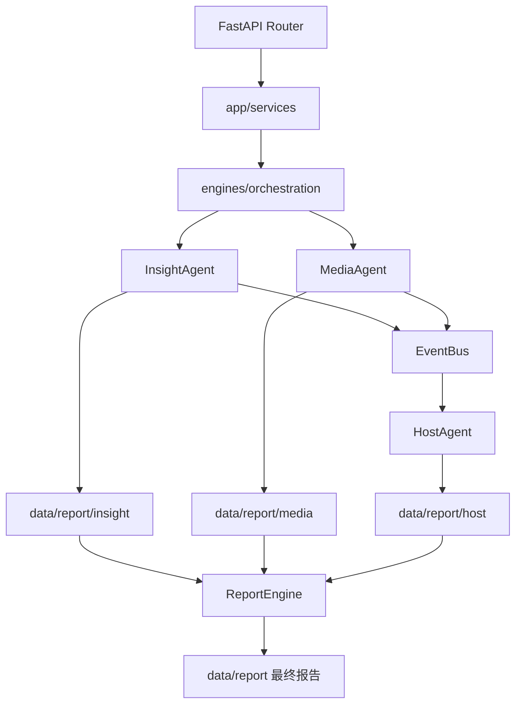

#### 2.3.2 当前模块放大图

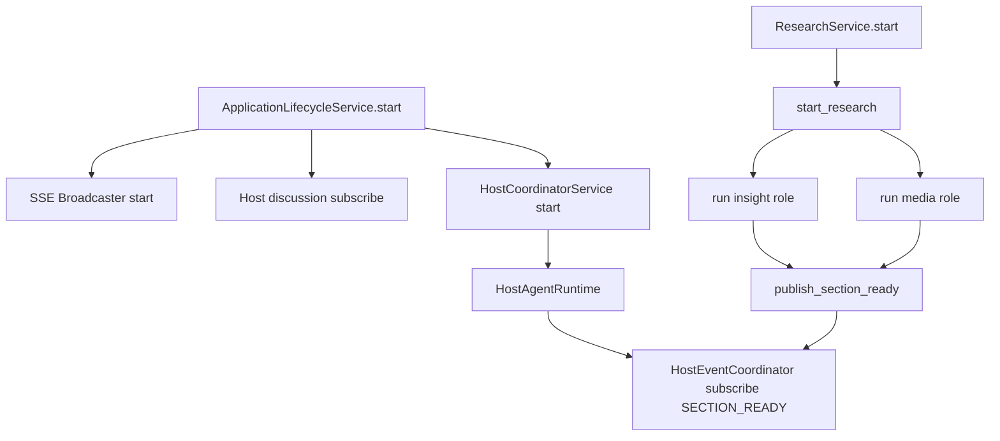

#### 2.3.3 图中每个节点的含义

`ApplicationLifecycleService` 负责进程启动时初始化共享服务。

`start_research` 只负责启动 Insight 和 Media 两个研究角色。

`HostAgentRuntime` 必须提前启动，否则可能错过 `section_ready`。

`EventBus` 是 Agent 之间的进程内消息通道。

## 3. 总体逻辑流程图

### 3.1 主流程说明

#### 3.1.1 输入从哪里来

输入来自两类请求。

第一类是研究启动：

```text
POST /api/research
```

第二类是最终报告生成：

```text
POST /api/report/generate
```

#### 3.1.2 中间经过哪些步骤

完整后端路径：

```text
1. FastAPI 启动生命周期服务
2. HostAgent 订阅 section_ready
3. 用户请求 /api/research
4. ResearchService 调用 start_research
5. orchestration 并发启动 Insight / Media
6. 两个 Agent 分章节发布 section_ready
7. HostAgent 接收并配对同一维度章节
8. HostAgent 生成阶段裁决和最终裁判报告
9. 三方 Markdown 报告落盘
10. 用户请求 /api/report/generate
11. ReportEngine 聚合三方报告生成最终报告
```

#### 3.1.3 输出到哪里去

输出包括：

```text
角色进度事件
章节完成事件
Host 讨论消息
三方 Markdown 报告
Host state JSON
最终 Markdown / HTML 报告
角色日志文件
```

### 3.2 主流程图

#### 3.2.1 Mermaid 流程图

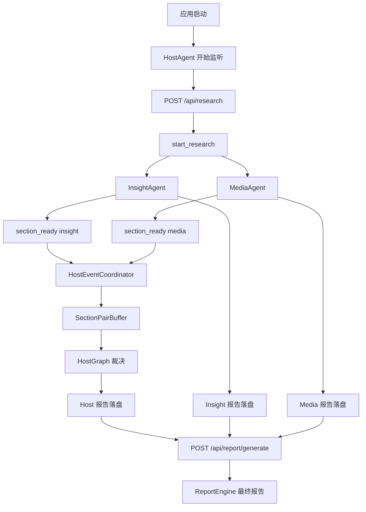

#### 3.2.2 流程图逐节点解释

应用启动时 HostAgent 已经在监听事件。

研究任务启动后，Insight 和 Media 独立运行。

两个研究角色每完成一个章节就发布 `section_ready`。

HostAgent 收到同一 `section_key` 的两份结果后做裁决。

最终报告引擎等待三方报告都落盘后再生成终稿。

#### 3.2.3 关键转折点

关键转折点：

```text
同步 HTTP 请求 -> 后台任务
Agent 内部章节 -> section_ready 事件
两个 Agent 输出 -> Host 章节配对
三方报告文件 -> ReportEngine 输入
Markdown 草稿 -> HTML / Markdown 交付物
```

### 3.3 主流程中的核心判断

#### 3.3.1 正常路径

正常路径：

```text
Insight 和 Media 都完成五个维度
HostAgent 完成五个维度裁决
三方报告都落盘
ReportEngine 生成最终报告
```

#### 3.3.2 分支路径

分支路径：

```text
某个章节证据为空 -> Agent 发布带 missing_notes 的 section_ready
某个 LLM 写作失败 -> 单章节写入失败提示
某个搜索源失败 -> 走降级或空证据路径
```

#### 3.3.3 失败路径

失败路径：

```text
研究角色异常 -> publish_role_error
Host 事件处理失败 -> Host 日志记录
最终报告输入不齐 -> ReportInputsNotReady
最终报告任务失败 -> ReportTask.status=error
```

## 4. 核心数据流图

### 4.1 输入数据结构

#### 4.1.1 请求参数或事件数据

研究请求：

```text
ResearchRequest.query
```

章节事件：

```text
SectionReadyEvent
```

最终报告请求：

```text
GenerateReportRequest.query
GenerateReportRequest.custom_template
```

#### 4.1.2 关键字段含义

`query` 是全链路主题。

`role` 标识当前研究角色。

`section_key` 用于 HostAgent 配对同一维度。

`evidence_pack` 是 HostAgent 研判证据强弱的依据。

#### 4.1.3 字段为什么这样设计

核心设计是维度对齐。

Insight、Media、Host、ReportEngine 都围绕同一套五维框架工作。

所以 `section_key` 是跨 Agent 协作的主键。

### 4.2 中间状态变化

#### 4.2.1 初始状态

应用启动后：

```text
HostAgentRuntime started
SseBroadcaster started
EventBus subscribers ready
```

#### 4.2.2 状态更新点

状态更新点包括：

```text
ProgressUpdate
SectionReadyEvent
SectionPairBuffer
HostSession
ReportTask
```

#### 4.2.3 状态如何传递

状态传递不是单一函数返回。

项目使用三种方式传递状态：

```text
函数参数
进程内 EventBus
文件系统报告产物
```

### 4.3 输出数据结构

#### 4.3.1 输出对象

关键输出对象：

```text
RoleProgressEvent
RoleErrorEvent
SectionReadyEvent
HostDiscussionMessageEvent
ReportArtifact
```

#### 4.3.2 输出字段

最重要字段：

```text
role
status
progress
section_key
body
evidence_strength
missing_notes
report_filepath
markdown_filepath
```

#### 4.3.3 输出如何被下游使用

事件给实时展示和 HostAgent。

Markdown 文件给最终报告引擎。

HTML / Markdown 文件给下载导出。

## 5. 核心调用链图

### 5.1 研究启动调用链

#### 5.1.1 从哪个入口开始

入口：

```text
POST /api/research
```

#### 5.1.2 依次调用哪些函数

调用链：

```text
start_research router
-> ResearchService.start
-> engines.orchestration.start_research
-> run_research_role
-> _execute_research_flow
-> invoke_insight_agent / invoke_media_agent
```

#### 5.1.3 每一步传递什么数据

核心传递：

```text
query
role
settings
llm_client
output_dir
progress_callback
```

### 5.2 事件通信调用链

#### 5.2.1 调用链图

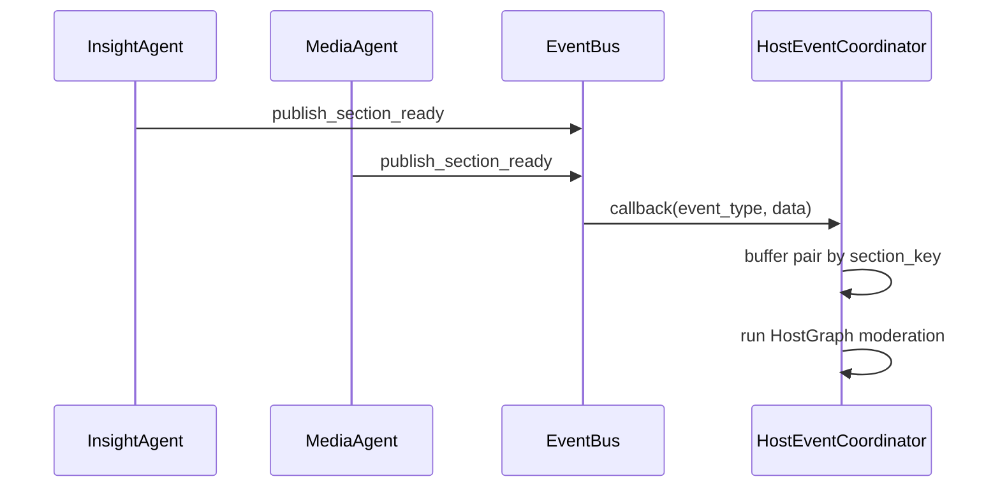

#### 5.2.2 为什么这样调用

Insight 和 Media 不需要直接 import HostAgent。

它们只发布事件。

HostAgent 自己订阅并处理。

#### 5.2.3 调用链中的关键对象

关键对象：

```text
EventBus
SectionReadyEvent
HostEventCoordinator
SectionPairBuffer
```

### 5.3 最终报告调用链

#### 5.3.1 调用链图

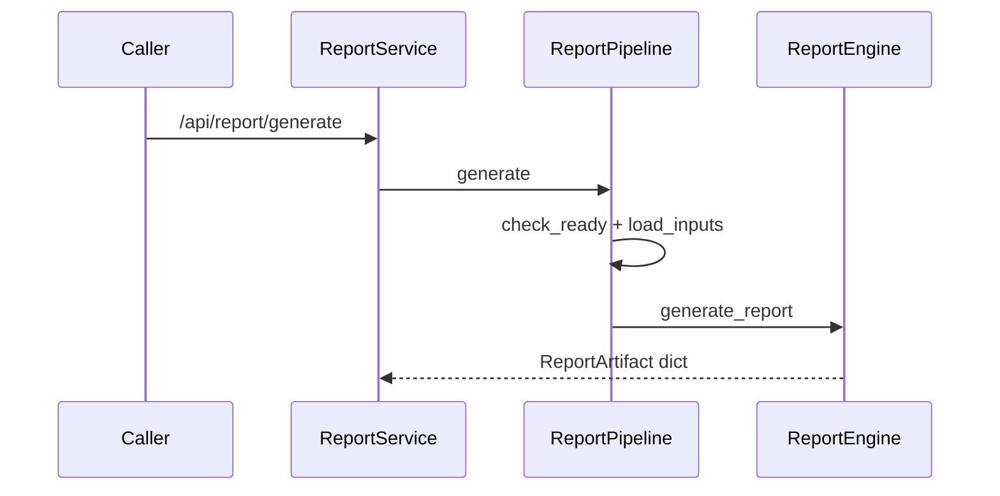

#### 5.3.2 为什么这样调用

最终报告生成是第二阶段。

它依赖第一阶段三方报告产物。

#### 5.3.3 调用链中的关键对象

关键对象：

```text
ReportInputService
ReportPipeline
ReportEngine
ReportTask
```

## 6. 手写真实项目核心逻辑

### 6.1 手写目标

#### 6.1.1 为什么要手写这一段

最后一节要把项目的“运行骨架”写出来。

学生需要知道业务从哪里启动，事件在哪里分发，HostAgent 何时监听。

#### 6.1.2 手写哪些真实文件

本节手写：

```text
app/services/research/service.py
engines/orchestration/research.py
app/services/system/lifecycle.py
engines/common/eventing/bus.py
```

#### 6.1.3 手写后能理解什么

能理解：

```text
研究启动不是同步等待
事件总线是进程内通信核心
HostAgent 要在应用启动阶段开始监听
角色日志和进度事件是调试入口
```

### 6.2 手写代码一：`app/services/research/service.py`

#### 6.2.1 要实现什么

实现研究任务应用服务。

#### 6.2.2 完整代码

完整包路径与文件名：

```text
app/services/research/service.py
```

完整代码如下：

```python
"""应用服务模块：app/services/research/service.py。"""

from typing import Any

from engines.common.io import latest_markdown_report, matching_state_file
from engines.orchestration import research_output_dirs, start_research


class ResearchService:
    def output_dirs(self) -> dict[str, str]:
        return research_output_dirs()

    def start(self, query: str) -> dict[str, Any]:
        start_research(query)
        return {"success": True, "message": "已启动所有研究角色", "query": query}

    def latest_results(self) -> dict[str, Any]:
        results: dict[str, Any] = {}
        for role, output_dir in self.output_dirs().items():
            latest_md = latest_markdown_report(output_dir)
            if not latest_md:
                continue

            state_file = matching_state_file(latest_md)

            results[role] = {
                "role": role,
                "status": "done",
                "final_report": latest_md.read_text(encoding="utf-8", errors="ignore"),
                "report_file": str(latest_md),
                "state_file": str(state_file) if state_file else "",
                "updated_at": latest_md.stat().st_mtime,
            }
        return {"success": True, "results": results}
```

#### 6.2.3 代码执行流程

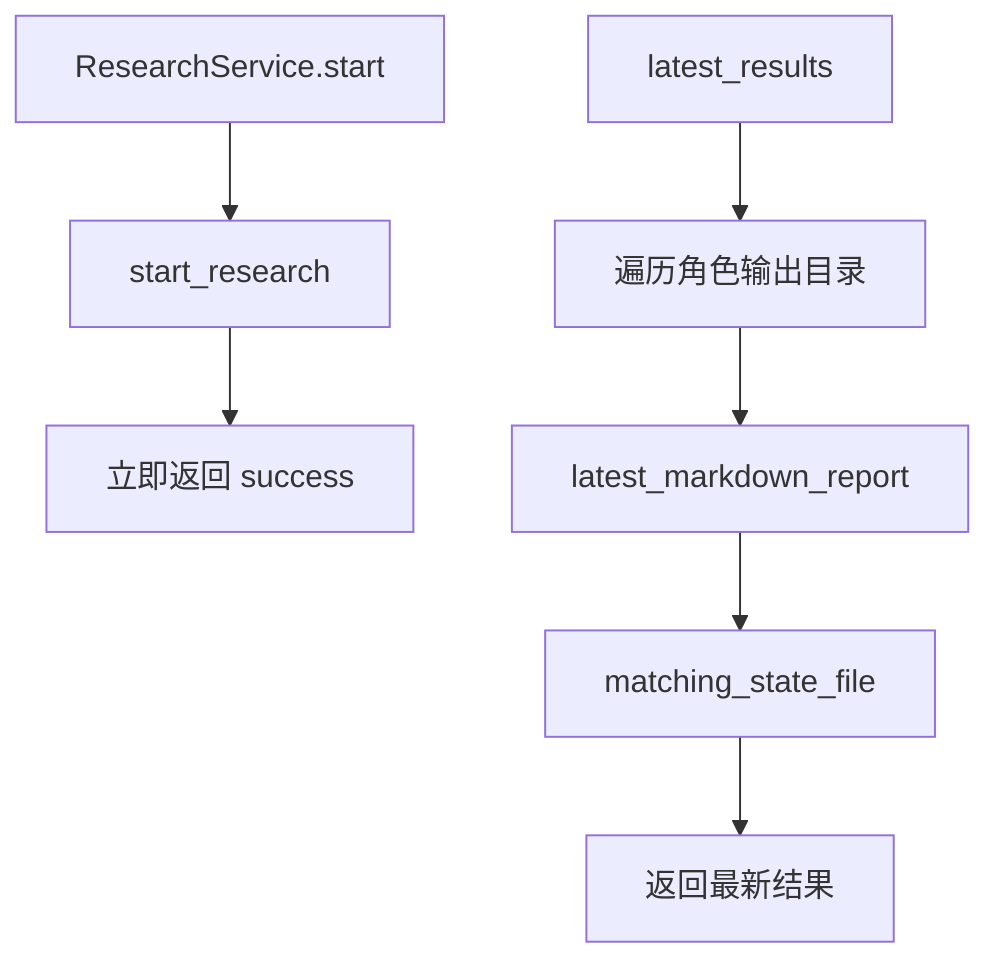

#### 6.2.4 关键设计说明

`start()` 不等待 Agent 完成。

它只启动后台任务，然后立即返回。

### 6.3 手写代码二：`engines/orchestration/research.py`

#### 6.3.1 要实现什么

实现研究角色注册和运行编排。

#### 6.3.2 完整代码

完整包路径与文件名：

```text
engines/orchestration/research.py
```

完整代码如下：

```python
"""研究 Agent 注册与运行编排。"""

from __future__ import annotations

import asyncio
import traceback
from dataclasses import dataclass
from typing import Awaitable, Callable

from loguru import logger

from engines.common.eventing import (
    publish_role_error,
    publish_role_progress,
    publish_role_result,
)
from engines.common.models import ProgressUpdate
from engines.common.runtime.role_log_stream import route_logs_by_role
from engines.contracts import config
from engines.contracts.config import Settings
from engines.contracts.events import RoleErrorEvent, RoleProgressEvent, RoleResultEvent
from engines.insight_agent.agent import invoke_insight_agent
from engines.llm.llm_client import LLMClient
from engines.media_agent.agent import invoke_media_agent

ProgressCallback = Callable[[ProgressUpdate], None]
AgentInvoker = Callable[[str, str, Settings, LLMClient, str, ProgressCallback | None, bool], Awaitable[None]]


@dataclass(frozen=True)
class ResearchAgentSpec:
    role: str
    output_dir: str
    invoker: AgentInvoker


def get_research_agent_specs() -> dict[str, ResearchAgentSpec]:
    return {
        "insight": ResearchAgentSpec(
            role="insight",
            output_dir=config.settings.INSIGHT_REPORT_DIR,
            invoker=invoke_insight_agent,
        ),
        "media": ResearchAgentSpec(
            role="media",
            output_dir=config.settings.MEDIA_REPORT_DIR,
            invoker=invoke_media_agent,
        ),
    }


def research_output_dirs() -> dict[str, str]:
    return {role: spec.output_dir for role, spec in get_research_agent_specs().items()}


def start_research(query: str) -> tuple[str, ...]:
    roles = tuple(research_output_dirs())
    for role in roles:
        asyncio.create_task(run_research_role(role, query))
    return roles


async def run_research_role(role: str, query: str) -> None:
    with route_logs_by_role(role):
        try:
            _publish_role_progress(role, ProgressUpdate("starting", "正在初始化研究角色...", 0))
            await _execute_research_flow(role, query)
            publish_role_result(RoleResultEvent(role=role, status="done"))
        except Exception as exc:
            logger.exception(f"[{role}] 研究角色执行失败: {exc}")
            publish_role_error(RoleErrorEvent(
                role=role,
                error=str(exc),
                traceback=traceback.format_exc(),
            ))


async def _execute_research_flow(role: str, query: str) -> None:
    agent_spec = get_research_agent_specs()[role]
    llm_client = LLMClient.from_role(agent_spec.role)

    await agent_spec.invoker(
        query,
        agent_spec.role,
        config.settings,
        llm_client,
        agent_spec.output_dir,
        lambda update: _publish_role_progress(role, update),
        True,
    )


def _publish_role_progress(role: str, update: ProgressUpdate) -> None:
    publish_role_progress(RoleProgressEvent(role=role, **update.to_dict()))
```

#### 6.3.3 代码执行流程

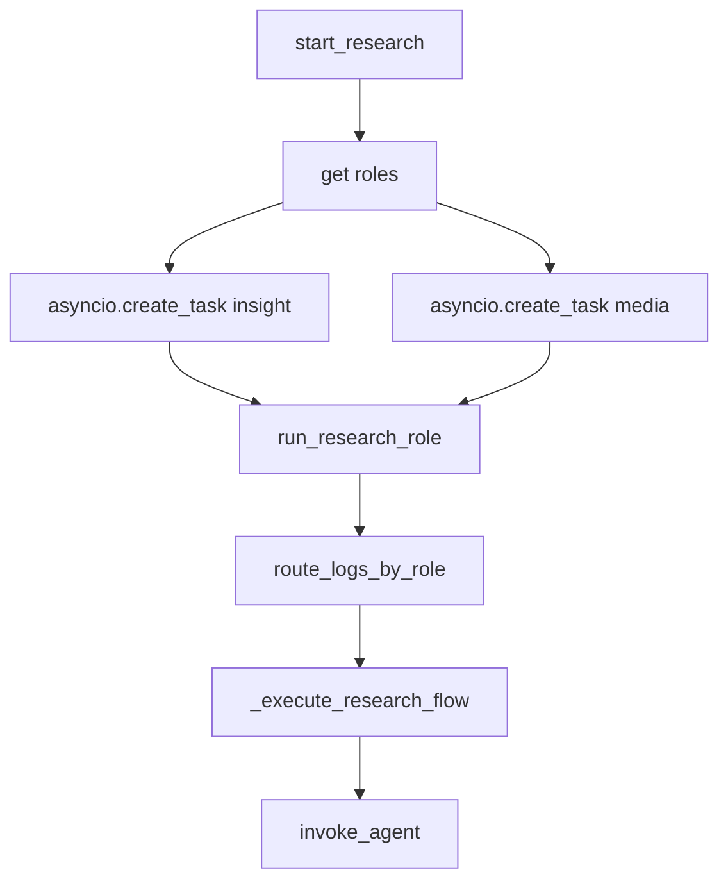

#### 6.3.4 关键设计说明

`ResearchAgentSpec` 把角色、输出目录、执行函数绑定在一起。

新增研究角色时，理论上需要在这里新增一个 spec。

### 6.4 手写代码三：`engines/common/eventing/bus.py`

#### 6.4.1 要实现什么

实现进程内事件总线。

#### 6.4.2 完整代码

完整包路径与文件名：

```text
engines/common/eventing/bus.py
```

完整代码如下：

```python
"""公共基础设施模块：engines/common/eventing/bus.py。"""

from typing import Any, Callable, Iterable

from engines.contracts.events import EventType

EventCallback = Callable[[str, dict[str, Any]], None]

_subscribers: list[tuple[EventCallback, frozenset[str] | None]] = []


def _event_value(event_type: str | EventType) -> str:
    return event_type.value if isinstance(event_type, EventType) else str(event_type)


def publish(event_type: str | EventType, data: dict[str, Any]) -> None:
    event_value = _event_value(event_type)
    for callback, types in list(_subscribers):
        if types is not None and event_value not in types:
            continue
        try:
            callback(event_value, data)
        except Exception:
            pass


def subscribe(callback: EventCallback, event_types: Iterable[str | EventType] | None = None) -> None:
    types = frozenset(_event_value(event_type) for event_type in event_types) if event_types is not None else None
    for existing, _ in _subscribers:
        if existing == callback:
            return
    _subscribers.append((callback, types))


def unsubscribe(callback: EventCallback) -> None:
    _subscribers[:] = [(cb, types) for cb, types in _subscribers if cb != callback]


def clear() -> None:
    _subscribers.clear()
```

#### 6.4.3 代码执行流程

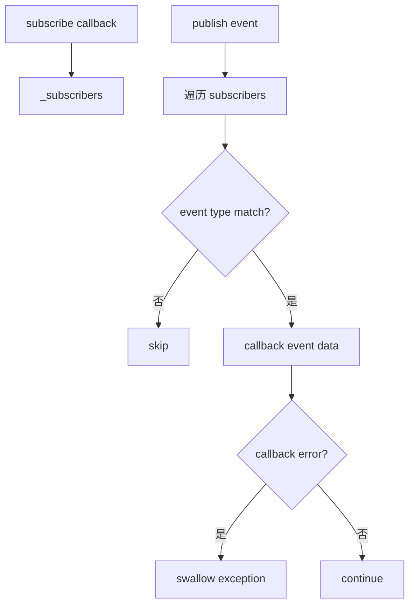

#### 6.4.4 关键设计说明

EventBus 是轻量进程内总线。

它不保证持久化，也不跨进程。

它适合当前单进程后端内的 Agent 协作。

## 7. 手写逻辑执行流程图

### 7.1 研究启动流程

#### 7.1.1 第一步执行什么

用户提交研究主题。

#### 7.1.2 第二步执行什么

后端创建 Insight 和 Media 两个后台任务。

#### 7.1.3 最终得到什么

两个研究角色开始并发执行。

### 7.2 事件处理流程

#### 7.2.1 第一步执行什么

Agent 发布事件。

#### 7.2.2 第二步执行什么

EventBus 分发给订阅者。

#### 7.2.3 最终得到什么

HostAgent 和 SSE 广播器都可以消费事件。

### 7.3 调试定位流程

#### 7.3.1 第一步执行什么

先看接口是否启动任务成功。

#### 7.3.2 第二步执行什么

再看角色日志和事件流。

#### 7.3.3 最终得到什么

定位是路由问题、Agent 问题、事件问题、报告文件问题还是最终报告问题。

### 7.4 手写流程图

#### 7.4.1 后端调试入口图

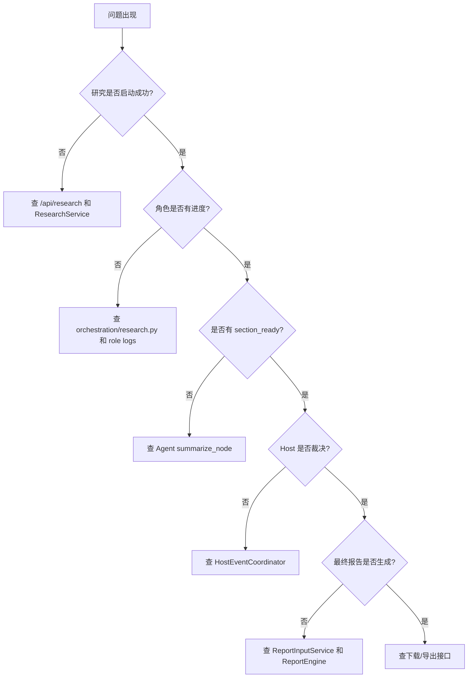

#### 7.4.2 扩展新搜索源图

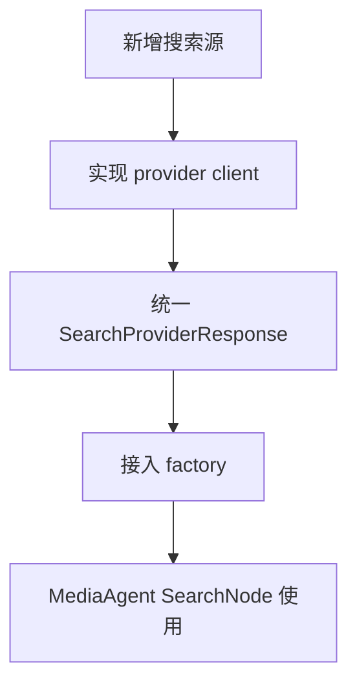

#### 7.4.3 扩展新研究角色图

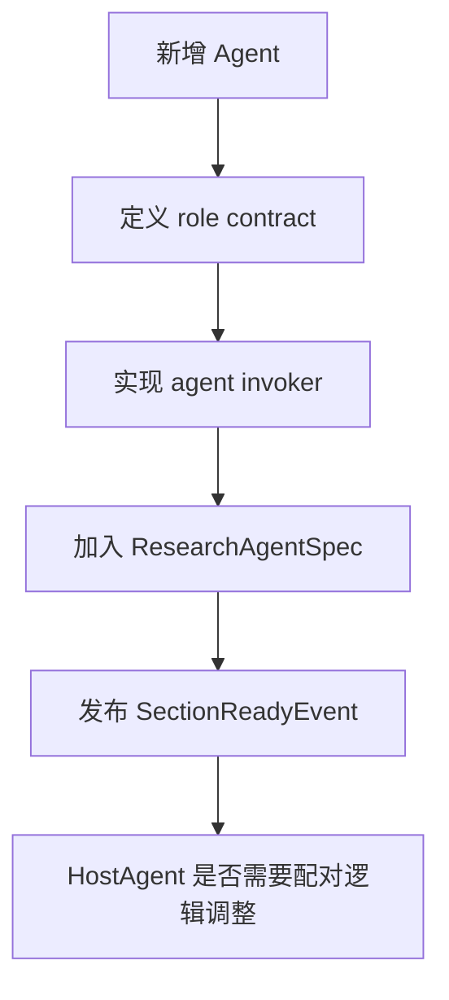

## 8. 项目源码解读

### 8.1 文件一：`app/services/system/lifecycle.py`

#### 8.1.1 文件职责

统一管理应用启动和关闭时的共享服务。

#### 8.1.2 为什么需要这个文件

HostAgent、SSE 广播、Host 讨论消息订阅都不是某个请求内临时创建的对象。

它们需要随应用生命周期启动和停止。

#### 8.1.3 它接收什么输入

无业务输入。

它从单例工厂获取共享服务。

#### 8.1.4 它输出什么结果

启动或关闭共享服务。

#### 8.1.5 完整源码

完整包路径与文件名：

```text
app/services/system/lifecycle.py
```

完整代码如下：

```python
"""应用服务模块：app/services/system/lifecycle.py。"""

from loguru import logger

from app.services.host import get_host_coordinator_service, get_host_discussion_service
from app.services.realtime import get_sse_broadcaster


class ApplicationLifecycleService:
    """进程生命周期协调器,统一初始化和清理共享服务。"""

    def __init__(self) -> None:
        self.host_discussion_service = get_host_discussion_service()
        self.host_coordinator_service = get_host_coordinator_service()
        self.sse_broadcaster = get_sse_broadcaster()

    def start(self) -> None:
        self.sse_broadcaster.start()
        self.host_discussion_service.subscribe_discussion_messages()
        self.host_coordinator_service.start()
        logger.info("FastAPI 服务器已启动,共享服务已初始化")

    def shutdown(self) -> None:
        self.host_coordinator_service.stop()
        self.host_discussion_service.shutdown()
        self.sse_broadcaster.stop()
        logger.info("FastAPI 服务器已关闭,共享服务已清理")


_lifecycle_service = ApplicationLifecycleService()


def get_lifecycle_service() -> ApplicationLifecycleService:
    return _lifecycle_service
```

#### 8.1.6 逐行/逐块解释

构造函数获取三个共享服务。

`start()` 按顺序启动 SSE、Host 讨论订阅、Host 事件协调器。

`shutdown()` 按相反方向清理。

#### 8.1.7 这个设计解决了什么问题

它保证 HostAgent 在研究任务开始前已经开始监听 `section_ready`。

#### 8.1.8 如果不这样写会有什么问题

如果 HostAgent 只在用户点击某个接口时才启动，可能错过已经发布的章节事件。

### 8.2 文件二：`engines/orchestration/host_runtime.py`

#### 8.2.1 文件职责

封装 HostAgent 事件监听运行时。

#### 8.2.2 为什么需要这个文件

应用服务层不应该直接操作 `HostEventCoordinator` 的构造细节。

#### 8.2.3 它接收什么输入

接收：

```text
output_dir
```

#### 8.2.4 它输出什么结果

启动或停止 HostAgent 事件处理器。

#### 8.2.5 完整源码

完整包路径与文件名：

```text
engines/orchestration/host_runtime.py
```

完整代码如下：

```python
"""HostAgent 运行时编排。"""

from typing import Optional

from loguru import logger

from engines.host_agent.context import HostContext
from engines.host_agent.coordinator import HostEventCoordinator


class HostAgentRuntime:

    def __init__(self, output_dir: str) -> None:
        self.output_dir = output_dir
        self._coordinator: Optional[HostEventCoordinator] = None

    def start(self) -> bool:
        try:
            if self._coordinator is not None:
                return True
            self._coordinator = HostEventCoordinator(
                context=HostContext(output_dir=self.output_dir)
            )
            self._coordinator.start()
            logger.info("HostAgentRuntime: HostAgent 事件处理器已启动")
            return True
        except Exception as exc:
            logger.exception(f"HostAgentRuntime: 启动 HostAgent 事件处理器失败: {exc}")
            self._coordinator = None
            return False

    def stop(self) -> None:
        try:
            if self._coordinator is not None:
                self._coordinator.stop()
                self._coordinator = None
                logger.info("HostAgentRuntime: HostAgent 事件处理器已停止")
        except Exception as exc:
            logger.exception(f"HostAgentRuntime: 停止 HostAgent 事件处理器失败: {exc}")
```

#### 8.2.6 逐行/逐块解释

`_coordinator` 为 None 时才创建。

重复 start 会直接返回 True。

stop 时调用 coordinator 的 stop，再清空引用。

#### 8.2.7 这个设计解决了什么问题

防止重复启动多个 Host 事件处理器。

#### 8.2.8 如果不这样写会有什么问题

如果重复订阅事件，同一个 `section_ready` 可能被处理多次。

### 8.3 文件三：`engines/common/eventing/publishers.py`

#### 8.3.1 文件职责

提供类型明确的事件发布函数。

#### 8.3.2 为什么需要这个文件

业务代码不应该到处手写事件类型字符串。

#### 8.3.3 它接收什么输入

接收各种事件模型：

```text
RoleProgressEvent
RoleResultEvent
RoleErrorEvent
SectionReadyEvent
HostDiscussionMessageEvent
```

#### 8.3.4 它输出什么结果

调用底层 `publish()` 分发事件。

#### 8.3.5 完整源码

完整包路径与文件名：

```text
engines/common/eventing/publishers.py
```

完整代码如下：

```python
"""公共基础设施模块：engines/common/eventing/publishers.py。"""

from engines.common.eventing.bus import publish
from engines.contracts.events import (
    EventType,
    HostDiscussionMessageEvent,
    RoleErrorEvent,
    RoleProgressEvent,
    RoleResultEvent,
    SectionReadyEvent,
)


def publish_role_progress(event: RoleProgressEvent) -> None:
    publish(EventType.ROLE_PROGRESS, event.model_dump())


def publish_role_result(event: RoleResultEvent) -> None:
    publish(EventType.ROLE_RESULT, event.model_dump())


def publish_role_error(event: RoleErrorEvent) -> None:
    publish(EventType.ROLE_ERROR, event.model_dump())


def publish_section_ready(event: SectionReadyEvent) -> None:
    publish(EventType.SECTION_READY, event.model_dump())


def publish_host_discussion_message(event: HostDiscussionMessageEvent) -> None:
    publish(EventType.HOST_DISCUSSION_MESSAGE, event.model_dump())
```

#### 8.3.6 逐行/逐块解释

每个函数对应一个事件类型。

`event.model_dump()` 把 Pydantic 事件模型转成 dict。

底层统一调用 `publish()`。

#### 8.3.7 这个设计解决了什么问题

避免业务层散落字符串事件名。

#### 8.3.8 如果不这样写会有什么问题

事件名拼错时很难排查，订阅者收不到事件。

### 8.4 文件四：`engines/common/runtime/role_log_stream.py`

#### 8.4.1 文件职责

按研究角色分流日志。

#### 8.4.2 为什么需要这个文件

Insight 和 Media 并发运行时，日志会混在一起。

按角色分流后更方便调试。

#### 8.4.3 它接收什么输入

接收：

```text
role
```

#### 8.4.4 它输出什么结果

在上下文内注册临时 loguru handler。

#### 8.4.5 完整源码

完整包路径与文件名：

```text
engines/common/runtime/role_log_stream.py
```

完整代码如下：

```python
"""公共基础设施模块：engines/common/runtime/role_log_stream.py。"""

from contextlib import contextmanager
from pathlib import Path
from typing import Iterator
from loguru import logger

from engines.contracts import config

_LOG_DIR = Path(__file__).resolve().parents[2] / "logs"


@contextmanager
def route_logs_by_role(role: str) -> Iterator[None]:
    """按角色分流日志到 logs/{role}.log。
    """
    handler_id = None
    try:
        _LOG_DIR.mkdir(parents=True, exist_ok=True)
        handler_id = logger.add(
            str(_LOG_DIR / f"{role}.log"),
            format="{time:YYYY-MM-DD HH:mm:ss} | {level} | {name} - {message}",
            level=config.settings.LOG_LEVEL,
            encoding="utf-8",
            rotation="1 MB",  # 日志轮转存档阈值
            filter=lambda record, _r=role: (
                # record: 日志包名 内部日志结构大概如下: {"message": "打印内容...","level": {"name": "INFO"}，"name": "app.engines.insight" # 打印这行日志所在的模块名, ... }  # _r:默认参数,防止闭包坑
                    _r in record["name"].lower()
                    or "common" in record["name"].lower()
                    or _r in str(record["message"])[:30]
            ),
        )
    except Exception as exc:
        logger.warning(f"[{role}] 日志注册失败: {exc}")
    try:
        yield
    finally:
        if handler_id is not None:
            logger.remove(handler_id)
```

#### 8.4.6 逐行/逐块解释

上下文进入时添加日志 handler。

上下文退出时移除 handler。

`filter` 只保留当前 role 相关日志和 common 日志。

#### 8.4.7 这个设计解决了什么问题

并发 Agent 的日志可以分文件查看。

#### 8.4.8 如果不这样写会有什么问题

调试时难以区分错误来自 Insight 还是 Media。

## 9. 关键对象与状态拆解

### 9.1 核心对象一：`ResearchAgentSpec`

#### 9.1.1 对象定义

研究角色注册信息。

#### 9.1.2 字段含义

```text
role        角色名
output_dir  报告输出目录
invoker     Agent 启动函数
```

#### 9.1.3 生命周期

每次调用 `get_research_agent_specs()` 时构造。

### 9.2 核心对象二：`EventBus`

#### 9.2.1 对象定义

进程内发布订阅工具。

#### 9.2.2 字段含义

内部核心状态：

```text
_subscribers
```

每个元素包含：

```text
callback
event_types
```

#### 9.2.3 生命周期

跟随 Python 进程存在。

### 9.3 核心对象三：`ApplicationLifecycleService`

#### 9.3.1 对象定义

应用生命周期协调器。

#### 9.3.2 字段含义

```text
host_discussion_service
host_coordinator_service
sse_broadcaster
```

#### 9.3.3 生命周期

进程内单例。

FastAPI 启动时 start，关闭时 shutdown。

## 10. 边界情况与异常分支

### 10.1 Agent 执行失败

#### 10.1.1 什么情况下发生

LLM 调用失败、数据库异常、搜索工具异常、节点逻辑异常。

#### 10.1.2 代码如何处理

`run_research_role()` 捕获异常，发布 `RoleErrorEvent`。

#### 10.1.3 为什么这样处理

单个角色失败要可观察，不能静默消失。

### 10.2 EventBus 回调失败

#### 10.2.1 什么情况下发生

某个订阅者处理事件时报错。

#### 10.2.2 代码如何处理

`publish()` 捕获异常并忽略。

#### 10.2.3 为什么这样处理

一个订阅者失败不应阻断其他订阅者。

但这也意味着调试时要看订阅者自己的日志。

### 10.3 HostAgent 未启动

#### 10.3.1 什么情况下发生

生命周期服务未正常 start，或 HostCoordinatorService 启动失败。

#### 10.3.2 代码如何处理

`HostAgentRuntime.start()` 返回 False 并记录异常。

#### 10.3.3 为什么这样处理

HostAgent 是后台监听器，启动失败不能伪装成正常。

### 10.4 最终报告输入不齐

#### 10.4.1 什么情况下发生

三方报告任意一个未落盘。

#### 10.4.2 代码如何处理

ReportService / ReportPipeline 报输入未准备。

#### 10.4.3 为什么这样处理

最终报告必须依赖三方完整产物，否则结论链不完整。

## 11. 本节代码在完整链路中的作用

### 11.1 本节之前发生了什么

#### 11.1.1 上一段链路输出

前面七天已经讲完：

```text
FastAPI 应用层
服务层
证据契约
MediaAgent
InsightAgent
HostAgent
ReportEngine
配置和运行时底座
```

#### 11.1.2 本节接收的数据

本节接收的是完整项目上下文。

不是新增业务输入，而是把所有已有输入、事件和报告产物串起来。

#### 11.1.3 本节开始的条件

学生已经知道每个模块内部怎么工作。

现在需要知道它们怎么组成完整后端系统。

### 11.2 本节推进了什么

#### 11.2.1 推进了哪一步业务

本节完成从局部源码理解到系统级维护能力的过渡。

#### 11.2.2 改变了哪些状态

本节不新增运行时状态。

它总结已有状态：

```text
Agent state
EventBus subscribers
Host session
ReportTask
文件产物
角色日志
```

#### 11.2.3 产出了哪些结果

产出的是完整后端调试和扩展地图。

### 11.3 本节之后交给谁

#### 11.3.1 下游模块

课程结束后，学生可以接手：

```text
新增搜索 Provider
新增报告维度
调整 Host 裁决逻辑
接入新的私域数据平台
优化最终报告格式
增加部署和监控能力
```

#### 11.3.2 下游输入

下游维护工作依赖：

```text
本节全链路图
关键源码入口
调试路径
边界情况清单
```

#### 11.3.3 项目后续扩展建议

后续扩展可以按优先级推进：

```text
1. 把 EventBus 替换成可持久化队列，提高跨进程可靠性
2. 给 ReportTaskStore 增加持久化，避免进程重启丢任务
3. 增加 HostAgent 单事件错误隔离和更细粒度状态观测
4. 为 Milvus 同步增加增量同步策略
5. 为 ReportEngine 增加模板版本管理
6. 为所有 Agent 增加统一 trace_id，串联日志、事件和报告文件
```
