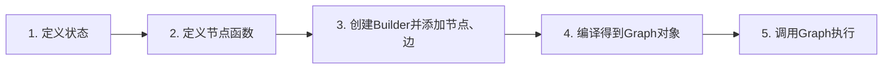

# 第 1 章 LangGraph概述

## 1. 核心定位

- **本质**：低级编排框架 + 运行时环境，用于构建、管理和部署**长期运行的有状态智能体**。
- **核心理念**：将智能体工作流建模为**图**。

## 2. 三大核心构件

- **节点**：计算单元（如 LLM 调用、工具执行、自定义逻辑）。
- **边**：定义节点间的转换逻辑，控制执行流向。
- **状态**：图执行过程中共享和传递的数据。

## 3. 关键能力

- **持久化执行**：支持故障恢复与长时运行。
- **人机协作**：可随时检查和修改智能体状态。
- **记忆管理**：兼顾短期工作记忆与跨会话长期记忆。
- **流式处理**：原生适配流式工作流。
- **生产级部署**：为有状态、长时工作流提供可扩展基础设施。

## 4. 与 LangChain 的区别

- **一句话概括**：需要 **有状态、可循环、可分支的多步骤控制流**时，LangChain 难以胜任，必须用 LangGraph。

| 特性     | LangGraph           | LangChain      |
| :------- | :------------------ | :------------- |
| 抽象级别 | 低级，细粒度控制    | 高级，开箱即用 |
| 状态管理 | 内置状态机 + 检查点 | 需自行管理     |
| 执行模型 | 基于图的并行执行    | 线性链式执行   |
| 持久化   | 原生支持            | 需额外实现     |
| 适用场景 | 复杂、有状态智能体  | 简单链式调用   |

#### 5. 适用场景

- 复杂多智能体系统
- 需长期记忆的应用
- 含人工审核的工作流
- 后台处理与实时交互
- 需精细控制的定制化智能体编排

#### 6. 资源链接

- **GitHub**：https://github.com/langchain-ai/langgraph
- **官方文档**：https://docs.langchain.com/oss/python/langgraph/overview

> 后续将通过快速入门示例，具体演示如何用 LangGraph 构建应用

-------

```python
获取Mermaid代码

mermaid_code = app.get_graph().draw_mermaid()
print(mermaid_code)
```

# 第2章.快速入门

> 使用LangGraph构建一个应用，可以分为如下步骤(图示)：



```python
# 此脚本用来演示LangGraph的基本搭建流程
# 模拟搭建一个搜索系统
from typing import TypedDict

from langgraph.constants import START, END
from langgraph.graph import StateGraph

# 1.定义状态
class MyState(TypedDict):
    query:str
    rag_result:str
    web_result:str
    final_answer:str

# 2.定义节点
def rag_search_node(state:MyState):
    # 从状态中获取查询内容
    query = state['query']
    # 模拟构建一个rag搜索结果
    rag_result = f'这是基于{query}的RAG搜索结果OvO'
    # 将处理后的值返回到相应的状态的值里面
    return {"rag_result":rag_result}

def web_search_node(state:MyState):
    # 从状态中获取数据
    query = state['query']
    # 模拟构建一个web搜索结果（函数中的具体业务逻辑）
    web_result = f'这是基于{query}的web搜索结果TAT'
    # 将处理后的结果返回到状态中
    return {'web_result':web_result}

def final_answer_node(state:MyState):
    # 从状态中获取数据
    query = state['query']
    rag_result = state['rag_result']
    web_result = state['web_result']
    # 模拟结果的构建
    final_answer = f'基于{query}，RAG检索到了：{rag_result}，网络搜索到了：{web_result}'
    # 将处理后的结果返回到状态中
    return {'final_answer':final_answer}

# 创建一个构造器对象，开始构造图结构
# 在创建的时候，首先传入状态的定义
builder = StateGraph(state_schema=MyState)
# 将构造好的节点放入构造器里面
builder.add_node("rag_search_node",rag_search_node)
builder.add_node(web_search_node)
builder.add_node(final_answer_node)
# 将注册进的节点通过边实现连接
builder.add_edge(START,"rag_search_node")
builder.add_edge("rag_search_node","web_search_node")
builder.add_edge("web_search_node","final_answer_node")
builder.add_edge("final_answer_node",END)
# 将构造器对象进行编译，得到一个可运行的图对象
graph = builder.compile()
# 调用图对象，通过invoke的方式传入一个初始的状态值
result = graph.invoke({'query':"哈哈，这是一个测试"})
print(result)

graph_structure = graph.get_graph()
res = graph_structure.draw_ascii()
print(res)
```

# 第3章.状态

## 1.状态隔离

### 1. 状态的作用

- 状态（State）是构建 LangGraph 应用的第一步，代表整个图的**结果目标**，也是节点需要**修改的数据目标**。
- 状态定义了图的内部数据结构和流转方式。

------

### 2. 定义状态类（State Schema）

有三种主流定义方式，**推荐使用 `TypedDict`**。

#### 2.1 使用 `TypedDict`（推荐）

>Python提供的类型提示工具，用于为字典（Dict）的键和值指定精确的类型信息。状态类继承TypedDict，定义键的类型和reducer函数

```python
from typing import TypedDict

class MyStateFull(TypedDict):
    rag_result: str
    web_search_result: str
    final_answer: str
    query: str
    a_new_key: str
```

#### 2.2 使用 Pydantic `BaseModel`

>Pydantic BaseModel：Pydantic 提供运行时数据校验，并支持静态类型检查工具进行类型推导。状态类通过继承Pydantic的BaseModel，定义键的类型和reducer函数；

```python
from pydantic import BaseModel

class MyStateFull(BaseModel):
    rag_result: str
    web_search_result: str
    final_answer: str
    query: str
    a_new_key: str
```

#### 2.3 使用 `dataclass`

>Dataclass: dataclass是Python标准库中的一个装饰器，用于自动生成常见特殊方法（如__init__、__repr__、__eq__等），从而简化主要用作数据容器的类的定义。状态类通过dataclass装饰器装饰后，定义键的类型和reducer函数即可

```python
from dataclasses import dataclass

@dataclass
class MyStateFullTwo():
    rag_result: str
    web_search_result: str
    final_answer: str
    query: str
    a_new_key: str   # 注意：原代码缩进有误，实际应放在类内
```

> **说明**：三种方式均需定义键的类型，并可配合 reducer 函数（后续章节介绍）处理状态合并逻辑。

------

### 3. 输入/输出数据隔离

通过 `StateGraph` 构造参数精细控制图接收的输入和返回的输出：

| 参数            | 作用                                           | 是否必填 | 默认值              |
| :-------------- | :--------------------------------------------- | :------- | :------------------ |
| `state_schema`  | 图的完整内部状态，所有节点可读写               | **必填** | 无                  |
| `input_schema`  | 限制外部传入的字段，须为 `state_schema` 的子集 | 可选     | 等于 `state_schema` |
| `output_schema` | 限制图输出的字段，须为 `state_schema` 的子集   | 可选     | 等于 `state_schema` |

```python
# 此脚本用于演示状态的输入输出隔离
# 目的是规范什么状态可以作为输出，什么状态可以作为输出
from typing import TypedDict

from langgraph.constants import START
from langgraph.graph import StateGraph


# 1.定义出主状态
class MyState(TypedDict):
    query:str
    rag_result:str
    web_result:str
    final_answer:str
    extra_input:str
# 定义输入状态类
class InputSchema(TypedDict):
    query:str
# 定义输出状态类
class OutputSchema(TypedDict):
    final_answer:str
    extra_input: str
# 2.构建节点函数
def rag_search_node(state:MyState):
    query = state['query']
    rag_result = f"这是基于{query}构造的RAG模拟结果......QAQ"
    return {'rag_result':rag_result}

def web_search_node(state:MyState):
    query = state['query']
    web_result = f'这是基于{query}构造的web模拟结果......^_^'
    return {'web_result':web_result}

def final_answer_node(state:MyState):
    query = state['query']
    rag_result = state['rag_result']
    web_result = state['web_result']
    final_answer = f'基于{query}，RAG检索到了：{rag_result}，网络搜索到了：{web_result}'
    return {'final_answer':final_answer}

# 3.创建一个图的构造器对象
builder = StateGraph(state_schema = MyState,
                     input_schema = InputSchema,
                     output_schema = OutputSchema)
builder.add_node(rag_search_node)
builder.add_node(web_search_node)
builder.add_node(final_answer_node)

builder.add_edge(START,"rag_search_node")
builder.add_edge("rag_search_node","web_search_node")
builder.add_edge("web_search_node","final_answer_node")
# 最终到END的可写可不写
graph = builder.compile()
result = graph.invoke({"query":"atguigu","extra_input":"这是额外输入"})
print(result)
```

>输入和输出不写，默认MyState

------

### 4. 节点间数据隔离（私有状态）

- 可以为特定节点指定**非全局的私有状态**，用于内部数据传递，**不参与初始输入和最终输出**。
- 方法：在节点函数参数中，使用不同于主状态的 `TypedDict` 类型注解。

```python
# 此脚本用于展示私有状态的设置，私有状态只是用于内部信息的传递，不参与初始的输入和最终的输出
from typing import TypedDict

from langgraph.constants import START, END
from langgraph.graph import StateGraph


# 主状态
class MyState(TypedDict):
    query:str
    final_answer:str

# 扩展部分，综合了一下输入输出隔离
class InputSchema(TypedDict):
    query:str
class OutputSchema(TypedDict):
    final_answer:str

# 私有状态,用于中间过程的数据传递，不参与最终的输出和初始的输入
class PrivateState(TypedDict):
    rag_result:str
    web_result:str

def rag_search_node(state:MyState):
    query = state['query']
    rag_result = f'这是基于{query}构造的RAG模拟结果......QAQ'
    return {'rag_result':rag_result}

def web_search_node(state:MyState):
    query = state['query']
    web_result = f'这是基于{query}构造的web模拟结果......^_^'
    return {'web_result':web_result}

# 这个最终汇总节点需要接收rag_result,一个web_result
def final_answer_node(state:PrivateState):
    rag_result = state['rag_result']
    web_result = state['web_result']
    final_answer = f'RAG检索到了：{rag_result}，网络搜索到了：{web_result}'
    return {"final_answer":final_answer}

# 创建构造器
builder = StateGraph(state_schema = MyState,
                     input_schema = InputSchema,
                     output_schema = OutputSchema)
builder.add_node(rag_search_node)
builder.add_node(web_search_node)
builder.add_node(final_answer_node)

builder.add_edge(START,'rag_search_node')
builder.add_edge('rag_search_node','web_search_node')
builder.add_edge('web_search_node','final_answer_node')
builder.add_edge('final_answer_node',END)

# 编译
graph = builder.compile()
result = graph.invoke({"query":"Atguigu123"})
print(result)
```

> START,END映射字符串
>
> 上述代码有扩展在StateGrapth中加OutputSchema,输出数据隔离

## 2. Reducer 函数

Reducer用于进行`当前增量状态（节点输出的状态）和全局状态的合并`

- 每个键可以指定独立的 reducer 函数
- 节点返回值中的每个 key 会与全局 `state_schema` 中对应的 key 进行合并
- 合并逻辑由每个 key 指定的 reducer 函数决定

------

### 2.1 默认行为：覆盖更新

如果未指定 reducer，默认采用 **直接覆盖**。

python

```python
class MyState(TypedDict):
    data: str          # 无 reducer，覆盖更新
```

------

### 2.2 常用内置 Reducer

通过 `Annotated[类型, reducer函数]` 来为键指定 reducer：

```python
from typing import Annotated, List
import operator

class MyState(TypedDict):
    str_data: Annotated[str, operator.add]           # 字符串拼接
    list_data: Annotated[List[str], operator.add]    # 列表追加（合并）
    int_data: Annotated[int, operator.add]           # 数值累加
```

**运行效果**：

- 第一次返回 `"A"`，第二次返回 `"B"` → 最终 `"AB"`
- 第一次返回 `[1]`，第二次返回 `[2]` → 最终 `[1, 2]`
- 数值同理累加

> ⚠️ **注意**：`operator.mul` 在初始值为 0 的情况下，后续所有值都会乘以 0，结果为 0，不适合作为数值累计 reducer。

------

```python
# 完整版
# 此脚本用于展示LangGraph中状态的更新方式设置
import operator
from typing import TypedDict, Annotated, List

from langgraph.constants import START, END
from langgraph.graph import StateGraph


class MyState(TypedDict):
    # str_data:str
    # int_data:int
    # list_data:list[str]
    str_data :Annotated[str,operator.add]
    int_data:Annotated[int,operator.add]
    list_data:Annotated[List[str],operator.add]
    # test_data:Annotated[int,operator.mul]

# 定义一个更新节点，目的是将值返回到状态中
def update_node_1(state:MyState):
    print(f"节点1当前的状态为：{state}")
    return {
        "str_data":"这是node_1返回的结果",
        "int_data":1,
        "list_data":["这是node_1返回的结果"]
    }

def update_node_2(state:MyState):
    print(f"节点2当前的状态为：{state}")
    return {
        "str_data":"这是node_2返回的结果",
        "int_data":2,
        "list_data":["这是node_2返回的结果"]
    }

builder = StateGraph(state_schema = MyState)
builder.add_node(update_node_1)
builder.add_node(update_node_2)
builder.add_edge(START,"update_node_1")
builder.add_edge("update_node_1","update_node_2")
builder.add_edge("update_node_2",END)

graph = builder.compile()
result = graph.invoke({})
print(result)
```

### 2.3 自定义 Reducer

自定义 reducer 函数接收两个参数：**当前全局值** 和 **节点返回的新值**，返回合并后的结果。

```python
# 此脚本用于展示LangGraph中的自定义reducer函数
import operator
from typing import TypedDict, Annotated, List

from langgraph.constants import START, END
from langgraph.graph import StateGraph

# 其中会传入两个参数，第一个参数作为当前的状态值，第二个参数作为新接收的值
def custom_reducer(origin_value:int,new_value:int):
    return origin_value*3 + new_value*2

class MyState(TypedDict):
    # str_data:str
    # int_data:int
    # list_data:list[str]
    str_data :Annotated[str,operator.add]
    int_data:Annotated[int,custom_reducer]
    list_data:Annotated[List[str],operator.add]
    # test_data:Annotated[int,operator.mul]

# 定义一个更新节点，目的是将值返回到状态中
def update_node_1(state:MyState):
    print(f"节点1当前的状态为：{state}")
    return {
        "str_data":"这是node_1返回的结果",
        "int_data":1,
        "list_data":["这是node_1返回的结果"]
    }

def update_node_2(state:MyState):
    print(f"节点2当前的状态为：{state}")
    return {
        "str_data":"这是node_2返回的结果",
        "int_data":2,
        "list_data":["这是node_2返回的结果"]
    }

builder = StateGraph(state_schema = MyState)
builder.add_node(update_node_1)
builder.add_node(update_node_2)
builder.add_edge(START,"update_node_1")
builder.add_edge("update_node_1","update_node_2")
builder.add_edge("update_node_2",END)

graph = builder.compile()
result = graph.invoke({})
print(result)
```

**示例完整流程**：

>该脚本演示自定义 reducer：int_data 按 旧值×3 + 新值×2 更新。节点1返回1（0→2），节点2返回2（2→10）。字符串和列表用 operator.add 拼接合并。最终状态即为累加后的结果。

------

### 2.4自定义 Reducer 用于消息列表

在实际 Agent 开发中，常用来**累积对话消息历史**：

```python
from langchain_core.messages import BaseMessage, HumanMessage, AIMessage, ToolMessage
from typing import Annotated, List, TypedDict

def add_message(left: list, right: list) -> list:
    print("合并消息...")
    return left + right

class MyAgent(TypedDict):
    messages: Annotated[List[BaseMessage], add_message]
```

这样每次节点返回新消息时，都会**追加**到历史消息列表中，而不是覆盖。

------

## 3.状态的存储（Checkpointer）

### 3.2.1 为什么需要状态存储

| 场景                | 问题                                     |
| :------------------ | :--------------------------------------- |
| 多次调用保持上下文  | 每次 invoke 都初始化空状态，丢失历史消息 |
| 断点续传 / 故障恢复 | 节点执行中途报错，已执行节点的状态丢失   |

### 3.2.2 解决方案：Checkpointer + thread_id

**三步实现状态持久化**：

1. **创建 Checkpointer**（内存 / 数据库）
2. **编译图时传入** `checkpointer`
3. **调用时传入** `thread_id`（会话隔离标识）

```python
# 此案例用于演示agent中的检查点机制，体现LangGraph中状态持久化的意义
from dotenv import load_dotenv
from langchain.agents import create_agent
from langchain_core.tools import tool
from langchain_openai import ChatOpenAI
from langgraph.checkpoint.memory import InMemorySaver

# from langchain_community.chat_models import ChatOpenAI

load_dotenv()
llm = ChatOpenAI(model = "qwen3.7-plus")


@tool
def weather_tool(city: str, date: str) -> str:
    """查天气的工具"""
    return f'{city}在{date}的天气是雷鸣电闪，还刮大风'

checkpointer = InMemorySaver()

agent = create_agent(
    model=llm,
    tools=[weather_tool],
    checkpointer=checkpointer
)

config = {
    "configurable":{
        "thread_id":"atguigu"
    }
}
response_1 = agent.invoke(
    {"messages":"深圳在2026年7月3日的天气怎么样？"},
    config =config
)
print('第一次调用',response_1['messages'][-1],end="\n\n==============\n\n")

response_2 = agent.invoke(
    {"messages":"这个天气适合出门野餐吗"},
    config = config
)
print('第二次调用',response_2['messages'][-1],end="\n\n==============\n\n")
```

> **关键点**：
>
> - 相同 `thread_id` = 同一个会话，状态可累积
> - 不同 `thread_id` = 新会话，状态隔离

------

### 3.2.3 从故障中恢复执行（断点续传）

**使用内存存储的问题**：进程退出后状态丢失，无法恢复。

**生产方案**：使用数据库持久化（如 SQLite、PostgreSQL）。

#### 使用 SQLite 持久化

```python
# 此脚本展示如何在LangGraph中上次运行断掉的地方恢复运行
import sqlite3
from typing import TypedDict

from langgraph.checkpoint.sqlite import SqliteSaver
from langgraph.constants import START
from langgraph.graph import StateGraph

# 创建sqlite的检查点 -> 不是放在内存中，而是放在了数据库中
conn = sqlite3.connect(
    database="./sqlite_data/langgraph_sqlite",
    check_same_thread=False
)
memory = SqliteSaver(conn=conn)


class MyState(TypedDict):
    key_1:str
    key_2:str
    key_3:str

def node_1(state:MyState):
    print(f"node_1的初始状态是：{state}")
    return {"key_1":"value_1"}

def node_2(state:MyState):
    print(f"node_2的初始状态是：{state}")
    raise Exception("节点2报错啦！！！！！")
    return {"key_2":"value_2"}

def node_3(state:MyState):
    print(f"node_3的初始状态是：{state}")
    return {"key_3":"value_3"}

builder = StateGraph(MyState)
builder.add_node(node_1)
builder.add_node(node_2)
builder.add_node(node_3)
builder.add_edge(START,"node_1")
builder.add_edge("node_1","node_2")
builder.add_edge("node_1","node_3")

graph = builder.compile(checkpointer=memory)
config = {
    "configurable":{
        'thread_id':"upguigu"
    }
}
result = graph.invoke({},config=config)
```

#### 故障恢复步骤

假设 `node_2` 执行报错，修复后继续执行：

```python
# 此脚本展示如何在LangGraph中上次运行断掉的地方恢复运行
import sqlite3
from typing import TypedDict

from langgraph.checkpoint.sqlite import SqliteSaver
from langgraph.constants import START
from langgraph.graph import StateGraph

# 创建sqlite的检查点 -> 不是放在内存中，而是放在了数据库中
conn = sqlite3.connect(
    database="./sqlite_data/langgraph_sqlite",
    check_same_thread=False
)
memory = SqliteSaver(conn=conn)


class MyState(TypedDict):
    key_1:str
    key_2:str
    key_3:str

def node_1(state:MyState):
    print(f"node_1的初始状态是：{state}")
    return {"key_1":"value_1"}

def node_2(state:MyState):
    print(f"node_2的初始状态是：{state}")
    # raise Exception("节点2报错啦！！！！！")
    return {"key_2":"value_2"}

def node_3(state:MyState):
    print(f"node_3的初始状态是：{state}")
    return {"key_3":"value_3"}

builder = StateGraph(MyState)
builder.add_node(node_1)
builder.add_node(node_2)
builder.add_node(node_3)
builder.add_edge(START,"node_1")
builder.add_edge("node_1","node_2")
builder.add_edge("node_1","node_3")

graph = builder.compile(checkpointer=memory)
config = {
    "configurable":{
        'thread_id':"upguigu"
    }
}
result = graph.invoke(None,config=config)
```

> **恢复条件**：
>
> 1. `invoke` 传入 `None`（非初始状态）
> 2. 传入**相同的 `thread_id`**

------

## 4 获取历史状态

#### 3.3.1 LangGraph 底层：Pregel 算法

> LangGraph 的运行时由 **Pregel** 类控制，其核心采用**超步（SuperStep）**机制迭代执行，而非传统 DAG 的拓扑排序。

**两大核心组件**

- **Actors（节点/PregelNode）**：实现 Runnable 接口，订阅并读写 Channels 进行数据交互。
- **Channels（通道）**：负责 Actors 间的通信，包含值类型、更新类型及合并更新的函数

#### 3.3.2 超步（SuperStep）执行流程

LangGraph 的执行由多个 **超步** 组成，每个超步分三阶段：

| 阶段                | 动作                                                      |
| :------------------ | :-------------------------------------------------------- |
| **Plan（计划）**    | 确定本轮要执行哪些节点（订阅了已更新通道的节点）          |
| **Execute（执行）** | 并行执行所有选中的节点,直至全部完成、出现失败或达到超时。 |
| **Update（更新）**  | 将节点输出写入通道，更新全局状态                          |

- 超步**循环执行**，直到没有节点可执行或达到最大步数
- **不是传统 DAG**：执行顺序不只看边连接，更依赖于通道订阅关系

------

##### 核心总结

| 概念             | 关键点                                                       |
| :--------------- | :----------------------------------------------------------- |
| **Reducer**      | 指定每个状态键的合并逻辑（默认覆盖；支持 `operator.add` 和自定义函数） |
| **Checkpointer** | 状态持久化工具，支持内存 / SQLite / PostgreSQL 等            |
| **thread_id**    | 会话隔离标识，复用即共享上下文，新 ID 即新会话               |
| **断点续传**     | 使用数据库 + 传入 `None` + 相同 `thread_id` 从故障点恢复     |
| **Pregel 模型**  | 基于超步（Plan→Execute→Update）循环执行，非传统 DAG          |
| **消息累积**     | 使用自定义 reducer 拼接消息列表，实现 Agent 短期记忆         |

> 💡 **实践建议**：
>
> - 开发测试用 `InMemorySaver`
> - 生产环境使用 `SqliteSaver` 或 `PostgresSaver`
> - 为每个用户/会话分配唯一的 `thread_id`
> - 消息列表建议使用 `add_messages`（LangGraph 内置）或自定义 `add_message` 避免覆盖历史

```python
# 此脚本通过构建一个较为复杂的例子，展示LangGraph底层运行的原理
import operator
from typing import TypedDict, Annotated, List

from langgraph.constants import START
from langgraph.graph import StateGraph


class MyState(TypedDict):
    data_list:Annotated[List[str],operator.add]

def a(state:MyState):
    return {"data_list":["a"]}
def b_1(state:MyState):
    return {"data_list":["b_1"]}
def b_2(state:MyState):
    return {"data_list":["b_2"]}
def c(state:MyState):
    return {"data_list":["c"]}
def d(state:MyState):
    return {"data_list":["d"]}

builder = StateGraph(MyState)
builder.add_node(a)
builder.add_node(b_1)
builder.add_node(b_2)
builder.add_node(c)
builder.add_node(d)

builder.add_edge(START,"a")
builder.add_edge("a","b_1")
builder.add_edge("b_1","b_2")
builder.add_edge("a","c")
builder.add_edge("c","d")
builder.add_edge("b_2","d")

graph = builder.compile()
result = graph.invoke({})
print(result)

# A :[a,b_1,b_2,c,d]
# B :[a,c,b_1,b_2,d]
# C :[a,b_1,c,b_2,d]
# D :我觉得都不对，我的答案是：[]
```

#### 3.3.3获取历史状态的方法(扩展)

构建好的 `graph` 实例提供两个方法：

| 方法                        | 说明                                                         |
| :-------------------------- | :----------------------------------------------------------- |
| `get_state(config)`         | 获取**最近一个时间步**（最后一个超步）的状态快照。           |
| `get_state_history(config)` | 获取**所有历史时间步**的状态快照，返回一个**迭代器**，按时间**倒序**排列（最新的在前）。 |

**入参**：均需传入包含 `thread_id` 的配置字典，用于标识执行线程。

```python
# 最近状态
last_state = graph.get_state(config={'configurable': {'thread_id': '1'}})

# 全部历史状态（迭代器，倒序）
all_states = graph.get_state_history(config={'configurable': {'thread_id': '1'}})
```


------

##### 3. 状态快照（StateSnapshot）的结构

每个历史状态以 `StateSnapshot` 实例表示，包含以下关键字段：

| 字段            | 类型                    | 描述                                                         |
| :-------------- | :---------------------- | :----------------------------------------------------------- |
| `values`        | `dict[str, Any]`        | 当前超步结束时的状态数据（即节点返回值聚合后的结果）。       |
| `next`          | `tuple[str, ...]`       | **下一个超步中待执行的节点名称列表**（用于故障恢复时确定恢复起点）。 |
| `config`        | `RunnableConfig`        | 获取该快照时使用的配置。                                     |
| `metadata`      | `CheckpointMetadata`    | 关联的元数据（如时间戳、步骤号等）。                         |
| `parent_config` | `RunnableConfig`        | 父快照的配置（若存在），用于追溯前一个状态。                 |
| `interrupts`    | `tuple[Interrupt, ...]` | 当前超步中发生且尚未解决的中断信息（用于人机交互场景）。     |

**重点关注**：`values` 存储当前聚合状态；`next` 指明后续执行路径，是实现断点续传的关键依据。

------

##### 4. 示例代码解析

##### 4.1 环境准备

python

```python
import operator
from typing import Annotated, Any
from typing_extensions import TypedDict
from langgraph.graph import StateGraph, START, END
from langgraph.checkpoint.sqlite import SqliteSaver
import sqlite3

connection = sqlite3.connect('checkpointer.db', check_same_thread=False)
checkpointer = SqliteSaver(connection)
```

- 使用 SQLite 作为检查点存储，用于持久化每个超步的状态。

##### 4.2 定义状态与节点

python

```python
class State(TypedDict):
    aggregate: Annotated[list, operator.add]   # 列表聚合（追加）

def a(state: State, config):
    print(f'Adding "A" to {state["aggregate"]}')
    return {"aggregate": ["A"]}

def b(state: State, config):
    print(f'Adding "B" to {state["aggregate"]}')
    return {"aggregate": ["B"]}

# ... 类似定义 b_2, c, d
```


- 每个节点返回一个字典，键为 `"aggregate"`，值为包含单个字母的列表。
- 因为使用 `operator.add` 作为 reducer，状态中的 `aggregate` 会不断追加新列表元素。

##### 4.3 构建图

```python
builder = StateGraph(State)
builder.add_node("a", a)
builder.add_node("b", b)
builder.add_node("b_2", b_2)
builder.add_node("c", c)
builder.add_node("d", d)

builder.add_edge(START, "a")
builder.add_edge("a", "b")
builder.add_edge("a", "c")
builder.add_edge("b", "b_2")
builder.add_edge("b_2", "d")
builder.add_edge("c", "d")
builder.add_edge("d", END)

graph = builder.compile(checkpointer=checkpointer)
```


- 图结构：`START → a → (b → b_2 → d) 和 (c → d)` 并行分支，最终汇聚到 `d`。

##### 4.4 执行并获取状态

python

```python
res = graph.invoke({}, config={'configurable': {'thread_id': '1'}})
print(res)  # 最终聚合结果，应为 ['A','B','B_2','D'] 或 ['A','C','D']？实际取决于调度顺序，但因为是并行边，a 后 b 和 c 并行，顺序不确定，但聚合是追加。

# 获取全部历史
all_states = graph.get_state_history(config={'configurable': {'thread_id': '1'}})
for state in all_states:
    print(state)   # 打印每个 StateSnapshot 对象
```


##### 4.5 输出解读（预期）

- **最终状态**：`{'aggregate': ['A','B','B_2','D']}`（假设 b 分支先完成）或 `['A','C','D']`（取决于执行顺序，但 b 和 c 并行，最终 d 会等待两者都完成？注意图中 `b_2→d` 和 `c→d`，d 需要两个前驱都完成才会执行，所以实际上 aggregate 会包含 `A`、`B`、`B_2`、`C`、`D`？）
  需要重新分析图：

  - a 执行，返回 ["A"]
  - a 后同时触发 b 和 c（并行）
  - b 返回 ["B"]，b 后触发 b_2，b_2 返回 ["B_2"]
  - c 返回 ["C"]
  - d 等待 b_2 和 c 都完成才执行，d 返回 ["D"]
    因此最终 aggregate 为 `['A','B','B_2','C','D']`（顺序由执行和聚合决定，但 aggregate 是列表追加，最终包含所有这些元素）。

- ###### **历史快照**：每个超步结束都会保存一个快照，例如：

  - 超步1：a 执行后，values = {"aggregate": ["A"]}, next = ("b","c")
  - 超步2：b 和 c 并行执行后，values = {"aggregate": ["A","B","C"]}, next = ("b_2",)（因为 c 已完成，但 b 的后续 b_2 待执行；实际上 b 和 c 在同一超步完成，b_2 需要等待 b 完成，所以下一超步执行 b_2）
  - 超步3：b_2 执行后，values = {"aggregate": ["A","B","C","B_2"]}, next = ("d",)
  - 超步4：d 执行后，values = {"aggregate": ["A","B","C","B_2","D"]}, next = ()

------

##### 5. 关键应用场景

- **故障恢复**：通过 `state.next` 可获知中断位置，从该节点恢复执行。
- **调试与审计**：查看每一步的中间状态，便于追踪数据流向和逻辑错误。
- **人机交互**：`interrupts` 字段可用于处理需要人工输入的中断点。

------

##### 6. 注意事项

- `get_state_history()` 返回迭代器，按**倒序**（最新→最旧）排列，遍历时注意顺序。
- 检查点（Checkpoint）需在编译图时传入 `checkpointer` 对象，否则状态不会被持久化。
- 状态快照中包含 `config` 和 `parent_config`，可用于重建上下文或回溯父状态。
