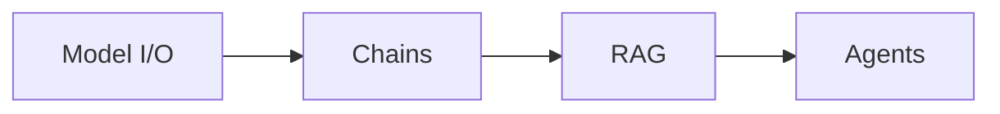
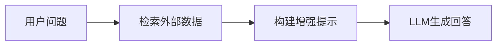
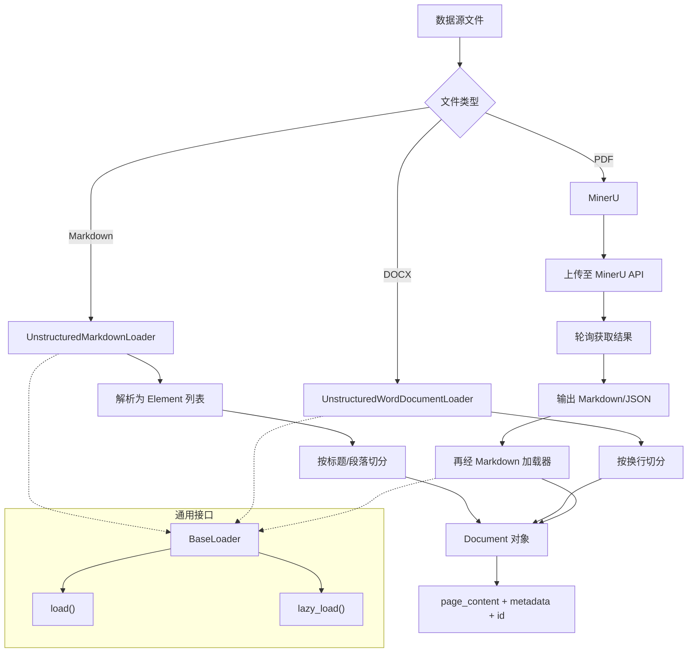
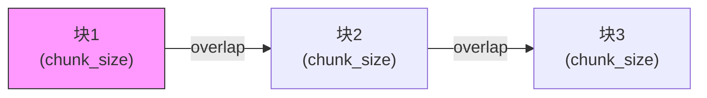
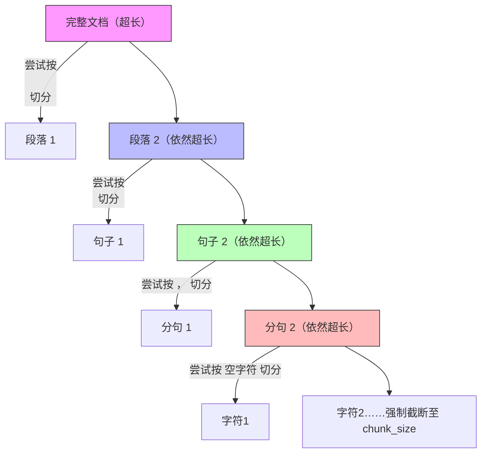

# 第 1 章 LangChain 概述

## 1.1 什么是 LangChain

LangChain 是一个开源框架，由哈佛大学的 **Harrison Chase（哈里森·蔡斯）** 于 **2022 年 10 月** 发起研发，用于开发由大语言模型（LLMs）驱动的应用程序。

### 相关链接

| 类型     | 地址                                                     |
| :------- | :------------------------------------------------------- |
| GitHub   | https://github.com/langchain-ai/langchain                |
| 官网     | https://www.langchain.com/langchain                      |
| 官方文档 | https://docs.langchain.com/oss/python/langchain/overview |
| API 文档 | https://reference.langchain.com/python/langchain/        |

### 应用场景

- 搭建 **Agent**（智能代理）
- **问答系统**（QA，Question Answering）
- **文档搜索系统**
- 更多 LLM 驱动的应用场景

### 发展背景

LangChain 的发布比 **ChatGPT 问世还要早一个月**，从这一时间点可以看出创始人的前瞻性眼光。凭借先发优势，LangChain 迅速获得了广泛关注与支持，在 GitHub 上的热度持续攀升。

## 为什么需要 LangChain？	类似jdbc的作用

### 问题 1：LLMs 用得好好的，为什么还需要 LangChain？

在大语言模型（如 ChatGPT、Claude、DeepSeek 等）快速发展的今天，开发者不仅希望“使用”模型，还希望将其灵活集成到应用中，实现更强大的功能：

- 对话能力
- 检索增强生成（RAG，Retrieval-Augmented Generation）
- 工具调用（Tool Calling）
- 多轮推理

### 问题 2：已有模型 API，为何还需要 LangChain？

不使用 LangChain，确实可以直接调用 GPT 或 GLM4 等模型的 API 进行开发。但使用 LangChain 具有以下优势：

| 优势                      | 说明                                                         |
| :------------------------ | :----------------------------------------------------------- |
| **简化开发难度**          | 开发更简单、更高效、效果更好                                 |
| **专注业务逻辑**          | 开发人员可专注于业务，无需耗费大量精力处理底层技术细节       |
| **学习成本更低**          | 不同模型的 API 和调用方式各异，LangChain 提供统一规范的调用方式，移植性更好 |
| **现成的 Agent 构建方法** | 提供结构化的 Agent 构建方式，使复杂逻辑变得易组合、易扩展    |

## 1.2 LangChain 包及核心模块划分

### 1.2.1 LangChain 所包含的包

| 包名                            | 描述                                                         |
| :------------------------------ | :----------------------------------------------------------- |
| **langchain**                   | 主入口点，包含构建 LLM 应用所需的所有实现                    |
| **langchain-core**              | LangChain 生态系统中的核心接口和抽象                         |
| **langchain-openai / deepseek** | 与 OpenAI / DeepSeek 的集成包；此外还包含一系列集成包，涵盖文本生成模型、工具、文档加载、向量存储等多个方面 |
| **langchain-mcp-adapters**      | 在 LangChain 和 LangGraph 应用中提供 MCP 工具                |
| **langchain-text-splitters**    | 用于文档处理的文本分割工具                                   |
| **langchain-tests**             | 用于验证 LangChain 集成包实现的标准化测试套件                |
| **langchain-classic**           | 遗留的 LangChain 实现和组件（主要为 1.0.0 版本之前的内容）   |

### 1.2.2 LangChain 核心模块划分

LangChain 的核心组件从逻辑上划分为以下 **四大部分**：



#### 1）Model I/O —— 标准化模型的输入与输出


| 环节                 | 功能                                                         |
| :------------------- | :----------------------------------------------------------- |
| **Format（格式化）** | 通过模板管理 LLM 输入，将原始数据格式化为模型可处理的形式（如插入提示模板） |
| **Predict（预测）**  | 调用 LLM 接收输入，进行预测或生成回答                        |
| **Parse（解析）**    | 规范化模型输出（如格式化为 JSON）                            |

#### 2）Chains（链条）

将多个组件组合成一个完整的流程，方便链式调用，实现多步骤任务的串联执行。

#### 3）Retrieval —— RAG（检索增强生成）



检索外部数据作为参考信息输入 LLM，辅助生成更准确、可靠的答案。

#### 4）Agents（智能代理）

Agent 自主规划执行步骤，决策并调用合适的工具来完成任务，实现更高级的自主推理与行动能力。

## 总结

LangChain 是一个功能强大且生态完善的 LLM 应用开发框架，其核心价值在于：

1. **降低开发门槛**，让开发者专注于业务逻辑
2. **提供统一抽象**，屏蔽不同模型和工具的实现差异
3. **模块化设计**，覆盖 Model I/O、Chains、RAG、Agents 四大核心能力
4. **活跃的开源生态**，持续演进，支持快速构建复杂的 LLM 应用

------

# 第2章 环境准备

本课程需要新建虚拟环境，python版本为3.12。课程当中所有环境依赖，可以使用课程资料当中的requirements.txt统一进行安装。另外，在每个示例代码演示时，如果需要新的包，也会在前面标注清楚，也可以在学习到相关章节时，再进行安装。

Conda 的常用命令可以按功能分为**环境管理**、**包管理**和**自身管理**三大类。

### 🌿 环境管理

这是 Conda 最核心的功能，用于创建相互隔离的开发环境。

| 功能               | 命令                                          | 示例                                         |
| :----------------- | :-------------------------------------------- | :------------------------------------------- |
| **创建新环境**     | `conda create -n <env_name> python=<version>` | `conda create -n myenv python=3.9`           |
| **激活环境**       | `conda activate <env_name>`                   | `conda activate myenv`                       |
| **退出当前环境**   | `conda deactivate`                            | `conda deactivate`                           |
| **列出所有环境**   | `conda env list` 或 `conda info --envs`       | `conda env list`                             |
| **删除环境**       | `conda remove -n <env_name> --all`            | `conda remove -n myenv --all`                |
| **克隆环境**       | `conda create --clone <old_env> -n <new_env>` | `conda create --clone myenv -n myenv_backup` |
| **重命名环境**     | `conda rename -n <old_name> <new_name>`       | `conda rename -n myenv mynewenv`             |
| **导出环境**       | `conda env export > environment.yml`          | `conda env export > environment.yml`         |
| **从文件创建环境** | `conda env create -f environment.yml`         | `conda env create -f environment.yml`        |

### 📦 包管理

用于在**当前激活的环境**中安装、更新和管理软件包。

| 功能               | 命令                                     | 示例                                    |
| :----------------- | :--------------------------------------- | :-------------------------------------- |
| **搜索包**         | `conda search <package_name>`            | `conda search numpy`                    |
| **安装包**         | `conda install <package_name>`           | `conda install numpy`                   |
| **安装特定版本**   | `conda install <package_name>=<version>` | `conda install numpy=1.19.5`            |
| **从特定频道安装** | `conda install -c <channel> <package>`   | `conda install -c conda-forge scipy`    |
| **批量安装**       | `conda install --file requirements.txt`  | `conda install --file requirements.txt` |
| **列出已安装的包** | `conda list`                             | `conda list`                            |
| **更新指定包**     | `conda update <package_name>`            | `conda update numpy`                    |
| **更新所有包**     | `conda update --all`                     | `conda update --all`                    |
| **卸载包**         | `conda remove <package_name>`            | `conda remove numpy`                    |

### ⚙️ Conda 自身管理

用于管理和配置 Conda 工具本身。

| 功能           | 命令                     | 示例                   |
| :------------- | :----------------------- | :--------------------- |
| **查看版本**   | `conda --version`        | `conda --version`      |
| **查看信息**   | `conda info`             | `conda info`           |
| **更新 Conda** | `conda update conda`     | `conda update conda`   |
| **查看帮助**   | `conda <command> --help` | `conda install --help` |

### 🔧 配置与频道管理

用于管理软件包的下载源（频道）。

| 功能             | 命令                                           | 示例                                                         |
| :--------------- | :--------------------------------------------- | :----------------------------------------------------------- |
| **查看当前频道** | `conda config --show channels`                 | `conda config --show channels`                               |
| **添加频道**     | `conda config --add channels <channel_url>`    | `conda config --add channels https://mirrors.tuna.tsinghua.edu.cn/anaconda/pkgs/free/` |
| **移除频道**     | `conda config --remove channels <channel_url>` | `conda config --remove channels https://mirrors.tuna.tsinghua.edu.cn/anaconda/pkgs/free/` |
| **恢复默认源**   | `conda config --remove-key channels`           | `conda config --remove-key channels`                         |

### 🧹 清理与维护

用于清理缓存和无用文件，释放磁盘空间。

| 功能             | 命令                             | 示例                |
| :--------------- | :------------------------------- | :------------------ |
| **清理所有缓存** | `conda clean --all`              | `conda clean --all` |
| **仅清理包缓存** | `conda clean -p` 或 `--packages` | `conda clean -p`    |
| **仅清理tar包**  | `conda clean -t` 或 `--tarballs` | `conda clean -t`    |

> **提示**：`-n` 是 `--name` 的缩写，`-e` 是 `--envs` 的缩写，在不引起歧义的情况下可以混用。

掌握这些命令，你就能高效地利用 Conda 进行 Python 项目开发了。如果想深入了解某个特定命令，可以随时再问我。

>conda env list			#查看已有的conda环境
>
>conda activate langchain  #进入指定conda环境
>
>pip install grandalf		#安装所需依赖

-------

# 第3章 Model I/O与Chains

------

## 1. Model I/O 介绍

**核心三要素**：输入（Prompt） → 处理（Model） → 输出（Parser）。

- **输入**：构造提示（Prompt Template）
- **处理**：调用模型（Model）
- **输出**：解析结果（Output Parser）

> ⭐ 这是与语言模型交互的基础流程，LangChain 的所有高级组件都建立在此之上。

------

## 2. 调用在线模型

### 2.1 常用大模型服务平台

- **CloseAI**（代理）、**OpenRouter**、**阿里云百炼**、**百度千帆**、**硅基流动**
- 使用方式：注册 → 充值 → 创建 API‑Key → 获取 `BASE_URL`

⚠️ **API_KEY 为敏感信息，严禁硬编码**。必须通过环境变量管理。

### 2.2 配置环境变量（两种方式）

#### 方式一：`.env` 文件（项目级）

```bash
# .env 文件内容
OPENAI_API_KEY=sk-xxx
OPENAI_BASE_URL=https://api.openai-proxy.org/v1
```

```python
from dotenv import load_dotenv
import os
load_dotenv()#加载.env文件
api_key = os.getenv("OPENAI_API_KEY")#通过os模块读取环境变量
```

⚠️ **切记**：`.env` **不要**提交到 Git 仓库（加入 `.gitignore`）。

#### 方式二：系统全局环境变量（Windows/Linux）

适合学习环境，避免反复 `load_dotenv()`。

------

### 2.3 OpenAI SDK 调用模型

#### ChatCompletion API（经典）

```python
from openai import OpenAI
client = OpenAI(base_url=..., api_key=...)
completion = client.chat.completions.create(
    model="gpt-4o-mini",# 调用创建的这个client进行聊天的创建
    messages=[{"role": "user", "content": "翻译"}])
print(completion.choices[0].message.content)	
```

#### Responses API（2025 年新推出，支持内置工具调用和服务端状态维护）

```python
response = client.responses.create(
    model="gpt-4o-mini",
    input="..查询天气.",
    tools=[{"type": "web_search"}]
)
print(response.output_text)
```

⭐ **大部分国内模型（Qwen、DeepSeek）兼容 OpenAI 接口规范**，可用上述方式调用。

------

### 2.4 Google SDK 调用 Gemini（了解）

python

```python
from google import genai
client = genai.Client(api_key=..., http_options={"base_url": ...})
response = client.models.generate_content(model="gemini-2.5-flash-lite", contents="..hello.")
```

------

### 2.5 LangChain API 调用模型（重点）

LangChain 封装了不同厂商的 SDK，提供**统一接口**(尤其是结构化输出等复杂场景)

```bash
#安装对应包
pip install langchain-openai   # OpenAI
pip install langchain-deepseek # DeepSeek
```

#### 两种构造 LLM 实例的方式

使用LangChainAPI进行调用的步骤如下：

1）构造LLM ChatModel实例

2）传递Message对象列表或普通字符串对象，调用LLM实例

3）解析调用结果

1. **统一工厂方法 `init_chat_model`**

```python
from langchain.chat_models import init_chat_model
# 定义出一个大模型对象
llm = init_chat_model(
    model_provider="openai",
    model="gpt-4o-mini",
    base_url = os.getenv("OPENAI_BASE_URL"),
    api_key = os.getenv("OPENAI_API_KEY")
    temperature=0.0,   # 控制随机性
    max_tokens=100,    # 限制输出长度
    timeout=30,
    max_retries=2)
response = llm.invoke("你好")# 调用大模型对象
```

2. **特定包下的类**（如 `ChatOpenAI`）

```python
from langchain_openai import ChatOpenAI
llm = ChatOpenAI(model="gpt-4o-mini", ...)
```

⭐ 两者本质相同，`init_chat_model` 底层调用特定类。

| `model`          | 模型名称或标识符，例如gpt-4o-mini               |
| ---------------- | ----------------------------------------------- |
| `model_provider` | 模型提供厂商,例如：openai                       |
| `base_url`       | 发送请求的 API 端点的 URL。常由模型的提供商提供 |
| `api_key`        | 与模型提供商进行身份验证所需的 API 密钥         |
| `temperature`    | 越高越随机，越低越确定                          |
| `max_tokens`     | 限制输出 token 数（1 个中文 ≈ 1~1.8 个 token）  |
| `timeout`        | 请求超时秒数                                    |
| `max_retries`    | 失败重试次数                                    |

**Token 可视化工具**：[OpenAI Tokenizer](https://platform.openai.com/tokenizer) 或 [百度智能云](https://console.bce.baidu.com/support/#/tokenizer) 

------

#### 调用 LLM 实例的方式

##### 输入类型(`四种重点`)

- **字符串**：简单任务
- **消息列表**（推荐用于对话历史）：

```python
from langchain_core.messages import SystemMessage, HumanMessage, AIMessage
messages = [
    SystemMessage(content="你是一个小狗，只会汪汪叫，被踹了会逃跑"),
    HumanMessage(content="（吹了个口哨）"),
    AIMessage(content="汪汪！"),
    HumanMessage(content="哪来的狗？（踹了你一脚）")]
resp = llm.invoke(messages)
```

- **元组/字典**形式也支持：

```python
[("system", "指令"), ("user", "问题")]
[{"role": "system", "content":"给llm指令"}, {"role": "user", "content": "问题"}]
```

| 消息类型        | 用途                     |
| :-------------- | :----------------------- |
| `SystemMessage` | 设定角色、语气、规则     |
| `HumanMessage`  | 用户输入                 |
| `AIMessage`     | 模型回复（含元数据）     |
| `ToolMessage`   | 工具调用结果（特殊场景） |

##### 调用方式

- **同步**：`.invoke(input)`
- **异步**：`.ainvoke(input)` – 提升响应性能
- **流式**：`.stream(input)` – 实现打字机效果
- **批量**：`.batch([inputs])` – 并行处理多个请求

```python
# 异步示例
async def async_invoke():
    llm = ChatOpenAI(model = "gpt-4o-mini")
    response = await llm.ainvoke("你好")
    print(response.content)
# 流式示例
response = llm.stream(
    "写一个1000字的短片小说，要求感人且荒诞中带有意思人性的光辉"
)
for chunk in response:
    print(chunk.content,end="")
#批量调用（了解）
```

------

## 3. 调用本地模型（Ollama）

### Ollama 简介

- 本地运行大模型的集成框架（支持 Qwen、DeepSeek 等）
- 适用于**原型开发**，生产环境建议用 vLLM

### 安装与模型下载

- 官网：[https://ollama.com](https://ollama.com/)⚠️ 生产环境通常使用 vLLM 等专业部署框架。
- 下载后通过 `ollama pull qwen3:8b` 拉取模型

### LangChain 调用

```python
from langchain_ollama import ChatOllama
ollama_llm = ChatOllama(model="qwen3:8b")
resp = ollama_llm.invoke([HumanMessage("你好")])
print(resp.content)
```

------

## 4. 模型调用结果解析（重点）

### 4.1 获取 JSON 结构化输出(高频)*

#### 方式一：通过 Prompt 约束（通用）

使用 `JsonOutputParser` + Pydantic 定义 Schema

```python
#导包（略）
load_dotenv()# 加载环境变量
llm = ChatOpenAI(model = "gpt-4o-mini")# 注册一个大模型对象
# 规定输出的数据类型
class Prime(BaseModel):
    prime: list[int] = Field(description="素数")
    count: list[int] = Field(description="个数")
# 构造一个解析器对象    
parser = JsonOutputParser(pydantic_object=Prime)
#生成一段用于“提示词（Prompt）”的文本指令，告诉大模型（LLM）应该以什么具体的格式返回内容，以便解析器能够成功解析
system_prompt = parser.get_format_instructions()
# 通过大模型进行调用
response = llm.invoke([# 将 system_prompt 放入 system 消息
       	("system",system_prompt),
        ("user","任意生成5个1000-100000之间素数，并标出小于该素数的素数个数")])
print(response.content)#大模型原始响应文本
print("============================================================")
json_output = parser.invoke(response)
print(json_output)#解析后的结构化对象
```

> **加载环境** → 2. **创建 LLM 实例** → 3. **定义 Pydantic 模型** → 4. **创建解析器** → 5. **生成系统提示** → 6. **发送请求** → 7. **获得原始文本** → 8. **解析并校验** → 9. **得到结构化字典**

#### 方式二：利用厂商原生能力（推荐）

- OpenAI：`client.chat.completions.parse(..., response_format=CalendarEvent)`

  ```python
  load_dotenv()  # 从 .env 文件加载环境变量（如 OPENAI_API_KEY）
  
  def openai_json_output_demo():
      import os                     # 导入 os 模块（虽然此处未直接使用，但通常用于读取环境变量）
      from openai import OpenAI     # 导入 OpenAI 官方 SDK 的客户端类
      from pydantic import BaseModel  # 导入 Pydantic 基类，用于定义数据模型
  
      client = OpenAI()             # 实例化 OpenAI 客户端（会自动从环境变量中读取 API Key）
  
      # 使用 Pydantic 定义希望模型输出的数据结构
      class CalendarEvent(BaseModel):
          name: str                 # 事件名称
          date: str                 # 事件日期
          participants: list[str]   # 参与者列表
  
      # 调用 OpenAI 的聊天补全接口，并使用 .parse() 方法
      response = client.chat.completions.parse(
          model="gpt-4o-mini",      # 使用轻量级模型
          messages=[                # 用户消息
              { "role": "user",
                 "content": "Alice and Bob are going to a science fair on Friday.",}],
          response_format=CalendarEvent  # 关键：强制模型输出符合 CalendarEvent 结构的 JSON
      )
  
      # 从响应中直接获取解析后的 Pydantic 对象（已自动校验和转换）
      print(response.choices[0].message.parsed)
      # 输出类似：name='Science Fair' date='Friday' participants=['Alice', 'Bob']
  
      print(type(response.choices[0].message.parsed))  # <class '__main__.CalendarEvent'>
  ```

  

- Gemini：`config={"response_mime_type":"application/json", "response_json_schema": schema}`

  ```python
  def gemini_json_output_demo():
      import os
      from google import genai                      # Google 官方 GenAI SDK（支持 Gemini）
      from pydantic import BaseModel, Field        # Pydantic 用于定义数据模型和字段描述
      from typing import List, Optional            # 类型提示（本示例未使用，但可保留）
  
      # 1、定义一个 Pydantic 模型，表示日历事件的结构
      class CalendarEvent(BaseModel):
          name: str                                # 事件名称
          date: str                                # 事件日期
          participants: list[str]                  # 参与者名单（字符串列表）
  
      # 2、初始化 Gemini 客户端
      client = genai.Client(
          api_key=os.getenv("OPENAI_API_KEY"),     # ⚠️ 注意：这里从环境变量取的是 OPENAI_API_KEY
          # 但实际上应该使用 GOOGLE_API_KEY 或 GEMINI_API_KEY，除非代理服务统一使用 OpenAI 格式的密钥。
          vertexai=True,                           # 启用 Vertex AI 协议（Google Cloud 的托管服务），可提高稳定性
          http_options={
              "base_url": 'https://api.openai-proxy.org/google',  # 自定义代理地址，用于转发请求到 Gemini
          },
      )
  
      # 3、定义用户提示（简单描述一个场景）
      prompt = """
      Alice and Bob are going to a science fair on Friday.
      """
  
      # 4、调用 Gemini 模型生成内容，并强制输出 JSON 格式
      response = client.models.generate_content(
          model="gemini-2.5-flash-lite",           # 使用轻量级快速模型
          contents=prompt,                         # 输入文本
          config={
              "response_mime_type": "application/json",        # 要求模型返回 MIME 类型为 JSON 的数据
              "response_json_schema": CalendarEvent.model_json_schema(),  # 提供 JSON Schema 约束输出结构
          },
      )
  
      # 打印原始响应文本（应为合法的 JSON 字符串）
      print(response.text)
  
      # 5、解析 Gemini 返回的 JSON 字符串，转换为 CalendarEvent 对象
      event = CalendarEvent.model_validate_json(response.text)   # Pydantic 内置方法，直接从 JSON 字符串解析并验证
      print(event)          # 打印对象，显示字段值
      print(type(event))    # 输出 <class '__main__.CalendarEvent'>
  ```

⭐ **LangChain 统一封装 `with_structured_output`**（最推荐）

```python
# 此脚本用于尝试使用LangChain封装模型厂商提供的输出解析功能
# 需要在调用的时候，将输出的数据类型作为参数一起上传过去
llm = ChatOpenAI(model ="gpt-4o-mini")

# 定义返回的数据类型
class CalendarEvent(BaseModel):
    name: str
    date: str
    participants: list[str]
# 将返回类型的这个类，注册到大模型对象中
new_llm = llm.with_structured_output(schema = CalendarEvent)

response = new_llm.invoke("Alice and Bob are going to a science fair on Friday.")
```

**优势**：无论底层是 OpenAI、Gemini 或其他，调用方式完全一致，换模型只需修改实例化代码。

### 4.2 其他解析器

LangChain 提供多种解析器（XML、逗号分隔列表等），但 **JSON 是主流**，大部分场景够用。

- `StrOutputParser`（最常用，返回字符串）
- `CommaSeparatedListOutputParser`
- `XMLOutputParser`
- `PydanticOutputParser`（旧版，现多用 `JsonOutputParser`）

------

## 5. 提示词模板

作用：将变量插入模板，动态生成提示，避免硬编码。

### 常用模板

- `PromptTemplate`：字符串模板
- `ChatPromptTemplate`：聊天消息模板（推荐）

```python
from langchain_core.prompts import ChatPromptTemplate
# 使用构造方法实例化提示词模板
template = ChatPromptTemplate.from_messages(
    messages=[("system", "你是一个专业的评论员"),
    ("human", "请评价{product}的优缺点，包括{aspect1}和{aspect2}。")
])
prompt_value = template.invoke({"product": "iPhone 15", "aspect1": "性能", "aspect2": "外观"})
# 可直接传给 llm.invoke()	
llm = ChatOpenAI(model = "gpt-5.5")
response = llm.invoke(prompt)
```

------

## 6. Chains 与 LCEL（核心概念 ，重点）

### 6.1 Runnable 接口

LangChain 所有核心组件（模型、解析器、提示模板等）都实现 **`Runnable`** 接口，统一了：

- `invoke` / `ainvoke`
- `batch` / `abatch`
- `stream` / `astream`

**为什么要统一？** 否则每个组件调用方法不同（`.format()`, `.generate()`, `.parse()`），组合困难。

### 6.2 LCEL（LangChain 表达式语言）

用 **管道符 `|`** 将多个 Runnable 串联成链：

```python
# 此脚本演示使用LangChain中的链式处理
# 搭建了一个Runnable的链，链里面有几个组件，首尾相连。
# 前者的输出，作为后者的一个输入
from dotenv import load_dotenv
from langchain_core.output_parsers import StrOutputParser
from langchain_core.prompts import PromptTemplate
from langchain_openai import ChatOpenAI

load_dotenv()
# 构建第一个组件 -> 提示词模板
prompt_template = PromptTemplate(
    template="讲一个关于{topic}的冷笑话",
    input_variables=["topic"]
)
# 构建第二个组件 -> 大模型对象
llm = ChatOpenAI(model = "gpt-5.5")

# 构建第三个组件 -> 输出解析器
parser = StrOutputParser()

# 构建链，实现三个组件的连接操作
chain = prompt_template | llm | parser

response = chain.invoke({"topic":"鼠标"})

print(response)
```

链本身也是 Runnable，可继续组合。

### 6.3 RunnableSequence（顺序执行）

按顺序传递输出→输入：

```python
chain = prompt_template | llm | StrOutputParser()
```

### 6.4 RunnableParallel（并行执行）

同时运行多个 Runnable，输入相同，输出合并为字典。

python

```python
# 此脚本用于展示链的并行运行（同时运行多条链）
load_dotenv()

# 英文翻译链的提示词模板组件
english_prompt_template = PromptTemplate.from_template("把这句话翻译成英文：{topic}")
# 韩文翻译链的提示词模板组件
korean_prompt_template = PromptTemplate.from_template("把下面这句话翻译成韩文：{topic}")

# 定义大模型对象的组件
llm = ChatOpenAI(model = "gpt-4o-mini")
# 定义字符串的解析器
parser =  StrOutputParser()

# 定义两条链
english_chain = english_prompt_template | llm | parser
korean_chain = korean_prompt_template | llm | parser

map_chain = RunnableParallel(
    english = english_chain,
    korean = korean_chain
)

response = map_chain.invoke({"topic":"我爱尚硅谷"})
print(response)
```

在 LCEL 中，用字典字面量即可：

```python
map_chain = {
    "para1": chain1,
    "para2": chain2
} | summary_chain   # 并行执行后再汇总
```

提升

```python
# 定义出大模型对象，作为组件添加到链中
llm = ChatOpenAI(model = "gpt-5.5")
# 定义出解析器对象，作为组件添加到链中
parser = StrOutputParser()

prompt_template_1 = PromptTemplate.from_template("正面评价一下{topic}这个问题")
prompt_template_2 = PromptTemplate.from_template("负面评价一下{topic}这个问题")

prompt_template_sum = PromptTemplate.from_template("根据这两个分析：{view_1},和{view_2},给出一个汇总的结果")

chain_1 = prompt_template_1 | llm | parser
chain_2 = prompt_template_2 | llm | parser
chain_sum = prompt_template_sum | llm |parser
# 构建第四个链 -> 映射链
map_chain = {
    "view_1":chain_1,
    "view_2":chain_2
} | chain_sum

response = map_chain.invoke({"topic":"加班"})
print(response)
```


#### 6.5 其他 Runnable 组件（了解）

| 组件                    | 用途                      |
| :---------------------- | :------------------------ |
| `RunnableLambda`        | 将普通函数包装成 Runnable |
| `RunnableBranch`        | 条件分支路由              |
| `RunnablePassthrough`   | 透传输入，保留上下文      |
| `RunnableWithFallbacks` | 失败时回退到备用链        |

------

## 7. 补充说明与趋势

- **Chain 的地位**：随着 Agent 的火热，LangChain 核心正从链式结构转向 **LangGraph**（支持循环、状态管理）。但 Chain 概念在源码和简单流程中仍然常见，理解 LCEL 有助于阅读底层实现。
- **生产建议**：
  - 环境变量务必安全隔离
  - 优先使用 `with_structured_output` 获取类型安全的 JSON
  - 使用异步/流式提升用户体验
  - 本地原型用 Ollama，生产部署用 vLLM 等专业框架

------

`标注` ⭐ 和 ⚠️ 处为高频考点或易错点，需特别留意。

----------------

1. **活跃的开源生态**，持续演进，支持快速构建复杂的 LLM 应用

------

# 第4章RAG 检索

> 向量搜索的5大步骤：输入重写，嵌入，相似性搜索，重排序，增强生成
>
> 向量化的四大步骤分别是什么
> 加载，切割，嵌入，存储

> 内容整理，涵盖 RAG 核心概念、文档加载、切分、嵌入、向量存储与检索及生成落地。

------

## 1. RAG 概述

### 1.1 大模型的局限

- **知识滞后**：训练成本高、周期长，更新不及时。
- **知识缺失**：专有领域细节不足(无法通过公开训练数据掌握所有专业细节)，回答不准确。
- **幻觉**：编造事实、推理错误、理解不足。原因包括训练偏差、过度泛化、缺乏领域知识、深层理解不够。在金融/医疗等场景尤为致命。

### 1.2 什么是 RAG

- **Retrieval-Augmented Generation**：检索增强生成。
- `核心思想`：生成模型 + 实时信息检索，借助外部知识库补充上下文，类似“给模型一本参考书”。
- 适用场景：私有领域问答，知识库足够大且不想微调模型时，RAG 是高效方案。

### 1.3 RAG 优缺点

| 优点                           | 缺点                         |
| :----------------------------- | :--------------------------- |
| 上下文丰富，无需过多提示工程   | 响应时延较高（依赖外部检索） |
| 比微调时效性、可靠性更好       | 消耗更多 Token 资源          |
| 保护业务数据隐私（数据不外传） |                              |

### 1.4 RAG 流程

1. **索引阶段**：

   ```mermaid
   flowchart LR
       A[数据源] --> B[加载文档] --> C[文本切分] --> D[向量嵌入] --> E[向量存储]
   ```

   

2. **检索生成阶段**：

   ```mermaid
   flowchart LR
       F[用户查询] --> G[检索器] --> H[相关文本块] --> I[提示模板<br>（问题+上下文）] --> J[大模型] --> K[最终回答]
   ```

   

------

## 2. 文档加载

LangChain 提供统一的 `BaseLoader` 接口（`load` / `lazy_load`），返回 `Document` 对象（含 `page_content`、`metadata`、`id`）。



- **`single`（默认）**：将整个Markdown文件作为单个文档加载，不保留结构信息
- **`elements`**：将Markdown解析为结构化的元素（标题、段落、列表等），每个元素都带有元数据（如类型、层级关系等）

### 2.1 加载 Markdown

- 使用 `UnstructuredMarkdownLoader`（需安装 `markdown`, `unstructured[md]`）。
- 模式 `mode="elements"` 可将标题、段落等拆分为独立元素。

```python
from langchain_community.document_loaders import UnstructuredMarkdownLoader
loader = UnstructuredMarkdownLoader("./sample.md", encoding="utf-8", mode="elements")
docs = loader.load()
for doc in docs:#流式加载
    print(doc.page_content)
    print(doc.metadata, end="\n============\n")
```

### 2.2 加载 Docx

- 使用 `UnstructuredWordDocumentLoader`（需 `unstructured[docx]`）。
- Word文档的层级定义比Markdown更加灵活，用户可以自定义不同层级标题的样式，这给解析带来了挑战
- 默认仅按换行切分，不识别标题层级，适合对层级不敏感的场景。

```python
from langchain_community.document_loaders import UnstructuredWordDocumentLoader
loader = UnstructuredWordDocumentLoader("sample.docx", mode="elements")
docs = loader.load()
```

- 若需要保留标题层级，可改用 **MinerU** 处理（先转 Markdown 再解析）。

### 2.3 加载 PDF（推荐 MinerU）

- **MinerU** 开源工具，支持 PDF → Markdown/JSON，支持 OCR、表格、公式识别。
- 可本地 Docker 部署或调用官方 API,有桌面端
- 流程：上传文件 → 获取解析结果（返回 Markdown 等格式），再使用 Markdown 加载器进一步处理。
- 示例（API 方式）：代码忽略
  - 获取 `batch_id` 上传文件，轮询结果直至 `state == 'done'`，拿到 `full_zip_url` 下载解析产物。


------

## 3. 文档切分（Chunking）

### 1.3 文档切分（Chunking）



> overlap是块之间的重叠部分

#### 1.3.1 为什么需要切分？

将完整的 `Document` 切分为较小的 `Chunk`，主要基于两大原因：

1. **减少噪声干扰，提升检索效果**
   若直接将整个 `Document` 放入 Prompt，其中大量无关信息会干扰大模型生成答案。研究表明，大模型在处理长上下文时，对中间位置的信息利用能力较弱，尤其在多文档问答和键值检索任务中表现明显。
2. **规避最大输入 Token 限制**
   长文档可能超过模型输入上限，导致超出的部分被截断，造成信息丢失。

以 `Chunk` 作为存储和检索的基本单元，可有效解决上述问题。

------

#### 1.3.2 切分策略（三种主流方案）

| 策略                 | 做法                                                         | 优点                       | 缺点 / 适用场景                                      |
| :------------------- | :----------------------------------------------------------- | :------------------------- | :--------------------------------------------------- |
| **固定长度切分**     | 按固定字符数或 Token 数切割                                  | 简单、快速                 | 可能切断句子，破坏语义连贯性                         |
| **递归多分隔符切分** | 使用多个分隔符（如段落、句子、词）递归切分，尽量使块不超过大小限制 | 保证句子完整，语义相对连贯 | 适合多数场景，是折中方案                             |
| **语义切分**         | 对相邻句子组进行嵌入，计算向量距离，在语义变化剧烈处切分     | 高度保持语义完整性         | 速度慢，块长度可能极不均衡；适合对语义要求极高的场景 |

------

#### 1.3.3 推荐实践：RecursiveCharacterTextSplitter

`RecursiveCharacterTextSplitter` 是 LangChain 提供的常用切分器，采用 **递归多分隔符** 策略。

- 默认分隔符列表：`["\n\n", "\n", " ", ""]`，依次尝试切分，直到块大小符合要求。
- 支持设置 **重叠长度（chunk_overlap）**，以保持相邻块间的语义衔接。

**代码示例**（加载 Word 文档并切分）：

```python
# 此脚本用于演示LangChain中封装的文本切分功能，这里采用了递归分隔符列表的方式进行切分
# 1、加载文档
# 2、定义一个切分器对象
# 3、调用切分器，进行切分
from langchain_community.document_loaders import UnstructuredMarkdownLoader
from langchain_text_splitters import RecursiveCharacterTextSplitter

# 加载文档
loader = UnstructuredMarkdownLoader(
    "./assets/sample.md",
    encoding = "utf-8",
    mode ="single"
)
docs = loader.load()
# 文档切分
splitter = RecursiveCharacterTextSplitter(
    separators = ["\n\n", "\n", "。", "！", "？", "……", "，", ""],
    chunk_size = 400,
    chunk_overlap = 50
)
chunks = splitter.split_documents(docs)

print(chunks)
```



**切分流程**：按分隔符优先级依次尝试，直到所有块长度 ≤ `chunk_size`；若仍超过，则从最后一级分隔符（如空字符串）逐字符切分。

------

**小结**：实际应用中，`RecursiveCharacterTextSplitter` 在语义保持与效率间取得了良好平衡，是多数场景的首选。若业务对语义连贯性有极致要求，可考虑语义切分，但需评估处理速度和块长度均匀性。

------

## 4. 文档嵌入

### 4.1 嵌入模型简介

- **Sentence-BERT** 优化了句子级嵌入，支持余弦相似度计算。
- 常用模型：
  - BAAI 系列：`bge-large-zh`、`bge-base-zh`、`bge-small-zh`、`bge-m3`（多语言，支持稠密+稀疏向量）。
  - OpenAI：`text-embedding-3-small/large`。

### 4.2 LangChain 嵌入使用

- LangChain设计了一个Embedding抽象类，在该类当中定义了多个抽象方法：
- 该Embedding的具体实现类有：HuggingFaceEmbeddings，OpenAIEmbeddings
- 通过 `HuggingFaceEmbeddings` 加载本地模型。

```python
from langchain_huggingface import HuggingFaceEmbeddings
embed_model = HuggingFaceEmbeddings(model_name="./models/bge-base-zh-v1.5")
query_vec = embed_model.embed_query("你好，世界")
docs_vec = embed_model.embed_documents(["文本1", "文本2"])
```

```python
# 此脚本用于将一段文本解析为稠密向量和稀疏向量，
# 目的是看一下这两种向量的表现形式
from FlagEmbedding import BGEM3FlagModel
# 加载模型
model = BGEM3FlagModel(
    model_name_or_path="../assets/models/bge-m3")
query = "LangChain 是一个用于构建基于大语言模型（LLM）应用的开发框架，旨在帮助开发者更高效地集成、管理和增强大语言模型的能力，构建端到端的应用程序。它提供了模块化工具和接口，支持从简单的文本生成到复杂的多步骤推理任务。"
response = model.encode([query],
    return_dense = True,
    return_sparse = True)
# print(response,end="\n\n")
# 展示一下稀疏向量的子词的比重的直观效果
lexical_weights = response['lexical_weights']
dense_vecs = response['dense_vecs']
# sparse_vecs = model.convert_id_to_token(lexical_weights)
# print('稀疏向量转换为token后的结果为：',sparse_vecs,end='\n\n')
```


------

## 5. 向量存储与检索（以 Milvus 为例）

### 5.1 向量数据库理解

- 将非结构化数据（文本/图像等）映射为高维向量，存储于向量空间，检索时计算相似度（模糊匹配），实现“以文搜文”“以图搜图”等。

- | **存储方式**                              | **处理对象**                                                 | **查询能力**                                                 |
  | :---------------------------------------- | :----------------------------------------------------------- | :----------------------------------------------------------- |
  | **传统关系型数据库**（MySQL、PostgreSQL） | 存储照片的**元数据**（拍摄时间、地点、相机型号、光圈等）     | 仅支持**精确匹配**（如“2026年拍摄的照片”），无法根据照片的**视觉内容**（颜色、纹理、物体）进行搜索。 |
  | **向量数据库**                            | 将照片的**特征**（颜色、纹理、物体等）转化为**多维空间中的向量** | 支持**模糊的相似性搜索**（如“找和这张图风格相似的图片”）。   |

### 核心原理

1. **构建多维空间**：为照片提取特征（时间、地点、颜色、纹理等），每个特征作为一个维度，照片信息成为一个多维空间中的**点**。
2. **向量化**：将该点与空间坐标轴的原点相连，形成一条**向量**。
3. **数据积累**：海量数据在空间中形成无数向量点。
4. **相似检索**：当需要检索时，将目标（查询）转化为向量，在空间中计算与所有向量点的**距离**（如余弦相似度、欧氏距离），返回距离最近的若干个结果。

> **核心特性**：向量数据库的检索结果**不是唯一匹配**，而是**模糊的“最相似”** 结果。这一点与传统 SQL 的 `WHERE` 精确查询有本质区别。

### 5.2 常用向量数据库

- 后三者主要业务不在向量数据库,LangChain 提供统一接口，可切换多种向量库：

- | 向量数据库        | 描述                                                 |
  | :---------------- | :--------------------------------------------------- |
  | **FAISS**         | 高效相似性搜索和密集向量聚类的库                     |
  | **Chroma**        | 开源轻量级，极简API                                  |
  | **Milvus**        | 云原生，支持亿级向量，覆盖原型到生产                 |
  | **Pgvector**      | PostgreSQL扩展，增加向量数据类型和相似性搜索         |
  | **Redis**         | 内存数据结构存储，原生支持向量搜索                   |
  | **Elasticsearch** | 分布式搜索分析引擎，统一管理结构化/非结构化/向量数据 |

### 5.3 Milvus 部署

- **Milvus Lite**：本地轻量（仅 FLAT 索引，仅 Mac/Linux）。
- **Milvus Standalone**：单机 Docker 部署（课程使用）。
- **Milvus Distributed**：Kubernetes 集群部署。
- **启动**：`docker load -i milvus_image.tar`加载镜像，执行 `standalone_embed.sh start`（Linux）或 `standalone.bat start`（Windows）。
- **客户端工具**：Attu 可视化连接。
- 组件解耦：查询节点、数据节点、索引节点可独立扩缩容。0.支持数百亿级向量检索。

### 5.4 Milvus 核心概念

- **结构**：数据库 → Collection（表）→ 实体（行）。

- **Schema**：定义字段（主键、向量、标量）。

- **支持的数据类型**：

  - 向量字段：稠密向量（FLOAT_VECTOR等）、稀疏向量（SPARSE_FLOAT_VECTOR）、二进制向量。
  - 标量字段：VARCHAR, BOOL, INT, FLOAT, DOUBLE, ARRAY, JSON。

- **主键**：INT64 或 VARCHAR；可开启 AutoId 自动生成。

- **稠密向量**：通常由深度学习模型（如 Sentence-BERT）生成。

- **稀疏向量**：表示关键词及权重（如 BGE-M3 的 `lexical_weights`），适用于文本关键词匹配。

- ###  索引

  - **稠密向量索引**：
    - **HNSW**（分层导航小世界）：基于图，高精度低延迟，内存开销大。
    - **FLAT**：暴力搜索，100%召回率。
  - **稀疏向量索引**：
    - **SPARSE_INVERTED_INDEX**（倒排索引），支持相似度指标：
      - IP（内积）：`score = Σ(词权重1 × 词权重2)`
      - BM25：基于 TF-IDF 和文档长度归一化。

### 5.5 创建 Collection（Schema + 索引）

1. **建立连接**：通过 `get_client()` 连接本地 Milvus 服务（127.0.0.1:19530），并打印现有集合以验证连接。
2. **定义结构 (Schema)**：通过 `build_schema()` 开启主键自动生成，并定义了 5 个字段：主键 `id`、1024维稠密向量 `vector`、原文 `text`、元数据 `metadata` 和稀疏向量 `sparse_vector`。
3. **配置索引**：通过 `build_index()` 为稠密向量配置 `HNSW` 索引（L2距离），为稀疏向量配置 `SPARSE_INVERTED_INDEX` 索引（IP内积）。
4. **执行创建**：在 `create_collection()` 中传入集合名、Schema 和索引参数，正式创建集合 `demo_collection`。

```python
# 此脚本用于创建初始的Milvus的集合（Collection）
# 需要构建两部分的数据，第一部分是存放的字段说明，第二部分，针对于向量字段的存储和检索方式的设定
from pymilvus import MilvusClient, DataType
# 获取一个连接对象
def get_client():
    client = MilvusClient(
        uri = "http://127.0.0.1:19530",
        token=""
    )
    response = client.list_collections()
    print(response)
    return client

def build_schema():
    schema = MilvusClient.create_schema(auto_id = True).add_field(
        field_name="id",datatype=DataType.INT64,is_primary = True # 主键id字段
    ).add_field(
        field_name="vector",datatype=DataType.FLOAT_VECTOR,dim = 1024 # 稠密向量字段
    ).add_field(
        field_name="text",datatype=DataType.VARCHAR,max_length = 1500 # 原文字段
    ).add_field(
        field_name="metadata",datatype=DataType.JSON # 元数据字段
    ).add_field(
        field_name="sparse_vector",datatype=DataType.SPARSE_FLOAT_VECTOR
    )
    return schema

def build_index():
    index_params = MilvusClient.prepare_index_params()
    index_params.add_index(
        field_name="vector",
        index_type="HNSW",
        metric_type="L2"
    )
    index_params.add_index(
        field_name="sparse_vector",
        index_type="SPARSE_INVERTED_INDEX",
        metric_type="IP"
    )
    return index_params

# 最终的目的：创建一个Collection
def create_collection(client:MilvusClient):
    client.create_collection(
        collection_name = "demo_collection",
        schema = build_schema(),
        index_params = build_index()
    )

if __name__ == "__main__":
    client = get_client()
    create_collection(client)
    client.list_collections()
```

### 5.6 数据操作（增删）

**插入**：构造 `List[Dict]`，每条包含各字段值（主键自动生成）。

```python
# 此脚本要实现将数据插入到Milvus的Collection中
# 1.加载数据源 - 读取md、docx
# 2.切分上一步读取过来的数据 - 构建一个切分器，对上一步的数据进行切分
# 3.使用嵌入模型进行文本嵌入处理 - 获取模型对象，直接将文本内容进行处理
# 4.待插入数据的结构的构造
# 5.调用MilvusClient的方法，实现数据插入
from langchain_community.document_loaders import UnstructuredMarkdownLoader
from langchain_text_splitters import RecursiveCharacterTextSplitter
from FlagEmbedding import BGEM3FlagModel
from pymilvus import MilvusClient

def get_client():
    client = MilvusClient(
        uri="http://127.0.0.1:19530",
        token=""
    )
    return client

def insert_data(client:MilvusClient):
    # 1.加载数据源，加载md
    loader = UnstructuredMarkdownLoader("../assets/models/bge-m3",encoding = "utf-8",mode="single")
    docs = loader.load()
    # print(docs)
    # 2.将获取到的数据进行切分
    # 定义切分器
    splitter = RecursiveCharacterTextSplitter(
        chunk_size=150,
        chunk_overlap=20,
        separators=["\n\n","\n","。"])
    splitted_docs = splitter.split_documents(docs)
    # for splitted_doc in splitted_docs:
    #     print(splitted_doc,end="\n========================================\n")

    # 3.使用嵌入模型处理文本内容，输出稠密向量和稀疏向量
    model = BGEM3FlagModel(
        model_name_or_path="./assets/models/bge-m3"
    )
    all_vectors = model.encode( # 获取编码后的总向量
        [splitted_doc.page_content for splitted_doc in splitted_docs],# 遍历切分后的数据列表，将每一项的page_content放入这个列表中
        return_dense=True, # 返回稠密向量
        return_sparse=True # 返回稀疏向量
    )
    # 将总向量中的稠密向量和稀疏向量分别提取出来
    dense_vectors = all_vectors['dense_vecs']
    sparse_vectors = all_vectors['lexical_weights']
    # print(dense_vectors[0])
    # print(sparse_vectors[0])

    # 4.构造可以插入到Milvus中的数据结构
    insert_data_list =[]
    for doc,dense_vector, sparse_vector in zip(splitted_docs,dense_vectors,sparse_vectors):
        insert_data_list.append({
            "vector":dense_vector,
            "text":doc.page_content,
            "metadata":doc.metadata,
            "sparse_vector":sparse_vector
        })
    response = client.insert(
        collection_name="demo_collection",
        data = insert_data_list
    )
    print(response)

if __name__ == "__main__":
    client = get_client()
    print(client.list_collections())
    # insert_data(client)

```

**删除**：通过 `filter` 条件（如 `"id in [...]"`）。	通过图形化界面删除

```python
client.delete("demo_collection", filter="id in [463480757150366907]")
```

### 5.7 检索方式

#### 5.7.1 向量检索（稠密/稀疏）

- 使用 `client.search`（单路）或 `client.hybrid_search`（混合检索）。
- 混合检索时需构建多个 `AnnSearchRequest`，并通过 `RRFRanker` 重排序合并结果。
- 示例（混合检索）：

```python
# 创建一个服务器的连接对象
def get_client():
    client = MilvusClient(
        uri="http://127.0.0.1:19530",
        token=""
    )

    return client

# 获取模型对象
def get_model():
    model = BGEM3FlagModel(
        model_name_or_path="./assets/models/bge-m3"
    )
    return model

# 模型向量化处理的方法
def encode_query(model:BGEM3FlagModel,query:str):
    all_embeddings = model.encode(
        [query],
        return_dense=True,
        return_sparse=True
    )
    dense_vec = all_embeddings['dense_vecs'][0]
    sparse_vec = all_embeddings['lexical_weights'][0]
    return dense_vec,sparse_vec

def print_hits(title: str, hits: List[dict]):
    print("\n" + "=" * 20)
    print(title)
    print("=" * 20)
    for i, hit in enumerate(hits, start=1):
        entity = hit.get("entity", {})
        print(
            {
                "rank": i,
                "id": entity.get("id"),
                "distance": hit.get("distance"),
                "text": entity.get("text"),
                "metadata": entity.get("metadata"),
            }
        )


# 第一个例子：通过稠密向量进行匹配的例子
def dense_vector_search_example(client:MilvusClient,query:str,limit:int =5):
    # 获取模型的对象
    model = get_model()
    # 调用模型处理的方法进行查询的文本的向量化处理
    dense_vec,_ = encode_query(model,query)
    # 调用client的查询方法实现查询
    results = client.search(
        collection_name="demo_collection",
        data=[dense_vec],
        anns_field="vector",
        limit = limit,
        search_params={"metric_type":"L2"},
        output_fields=["id","text","metadata"]
    )
    print_hits("稠密向量检索（vector）", results[0])
    return results
```

#### 5.7.2 标量检索（条件过滤）

- 不涉及向量计算，仅基于标量字段（如 `text`、`metadata`）进行精确/模糊查询。

```python
# 模糊查询
client.query(collection, filter='text like "%大模型%"', output_fields=["id","text"], limit=5)
# JSON 字段查询
client.query(collection, filter='metadata["source"] like "%sample%"')
def hybrid_search(client:MilvusClient,query:str,limit:int=5):
    model = get_model()
    dense_vec,sparse_vec = encode_query(model,query)
    # 稠密向量的检索
    dense_req = AnnSearchRequest(
        data=[dense_vec],
        anns_field="vector",
        param={"metric_type":"L2"},
        limit=limit
    )
    # 稀疏向量的检索
    sparse_req = AnnSearchRequest(
        data=[sparse_vec],
        anns_field="sparse_vector",
        param={"metric_type":"IP"},
        limit=limit
    )
    results = client.hybrid_search(
        collection_name="demo_collection",
        reqs=[dense_req,sparse_req],
        ranker=RRFRanker(k=60),
        limit=limit,
        output_fields=["id","text","metadata"]
    )
    print_hits("稠密向量检索（vector）", results[0])
    return results
```

> - **向量化**：将文本/图像转为稠密或稀疏向量。
> - **索引**：HNSW（稠密）/ 倒排（稀疏）加速搜索。
> - **混合检索**：结合稠密（语义）和稀疏（关键词）优势，RRF 融合排序。
> - **RAG**：检索 + 生成，让 LLM 基于检索到的文档回答问题。
> - **部署**：Milvus Standalone 适合开发，Docker 快速启动。

------

**重排序**（Reranker）是指在初步检索（Recall）完成后，对候选结果进行二次排序优化的过程。其目标不是扩大召回范围，而是在已有候选集内提升排序质量和结果相关性。在典型的检索系统中，重排序通常位于向量检索或混合检索之后，用于融合多路检索结果或引入更精细的排序策略。

此处介绍RRFReranker。RRFRanker 策略的主要工作流程如下：

（1）收集搜索排名：收集来自向量搜索各路径的结果排名（rank_1、rank_2）。

（2）合并排名：根据公式转换各路径的排名（rank_rrf_1、rank_rrf_2）。

计算公式涉及 N，N 代表检索器的数量。ranki (d) 是第 i 个检索器生成的文档 d 的排名位置。k 是一个平滑参数，通常设置为 60。

（3）聚合排名：基于合并后的排名对搜索结果进行重新排序，以生成最终结果。

其示意图如下：

## 6. 生成（RAG 完整链路）

检索到相关文本块后，将其拼接为上下文，构造系统提示和用户问题，调用 LLM 生成回答。

```python
from langchain_openai import ChatOpenAI

llm = ChatOpenAI(model_name="gpt-4o-mini")
retrieved = hybrid_search(client, query)  # 获取 top-k 文本
context = "\n".join([item["text"] for item in retrieved])
messages = [
    {"role": "system", "content": "你是一个专业的法律问答机器人，根据上下文回答，无法回答则说明。"},
    {"role": "user", "content": f"上下文：{context}\n问题：{query}"}
]
response = llm.invoke(messages)
print(response.content)
```

------

## 7. 关键代码片段速查

| 功能                | 关键类/方法                                        |
| :------------------ | :------------------------------------------------- |
| 加载 Markdown       | `UnstructuredMarkdownLoader`                       |
| 加载 Docx           | `UnstructuredWordDocumentLoader`                   |
| 加载 PDF（MinerU）  | API 上传 + 轮询结果                                |
| 文本切分            | `RecursiveCharacterTextSplitter`                   |
| 嵌入（HuggingFace） | `HuggingFaceEmbeddings`                            |
| 嵌入（BGE-M3）      | `BGEM3FlagModel`（返回稠密+稀疏）                  |
| Milvus 客户端       | `MilvusClient(uri, token)`                         |
| 创建 Collection     | `create_collection(schema, index_params)`          |
| 插入数据            | `client.insert()`                                  |
| 混合检索            | `AnnSearchRequest` + `hybrid_search` + `RRFRanker` |
| 标量过滤            | `client.query(filter=...)`                         |
| 生成回复            | `ChatOpenAI` + 提示模板                            |

------

# 第5章.(有待更新)

## 1.向量数据库插入

>此脚本要实现将数据插入到Milvus的Collection中 
>1.加载数据源-读取md、docx 
>2.切分上一步读取过来的数据 - 构建一个切分器，对上一步的数据进行切分
>3.使用嵌入模型进行文本嵌入处理-获取模型对象,直接将文本内容进行处理
>4·待插入数据的结构的构造
>5.调用MilvsClient的方法，实现数据插入

```python
# 此脚本要实现将数据插入到Milvus的Collection中
# 1.加载数据源 - 读取md、docx
# 2.切分上一步读取过来的数据 - 构建一个切分器，对上一步的数据进行切分
# 3.使用嵌入模型进行文本嵌入处理 - 获取模型对象，直接将文本内容进行处理
# 4.待插入数据的结构的构造
# 5.调用MilvusClient的方法，实现数据插入
from langchain_community.document_loaders import UnstructuredMarkdownLoader
from langchain_text_splitters import RecursiveCharacterTextSplitter
from FlagEmbedding import BGEM3FlagModel
from pymilvus import MilvusClient

def get_client():
    client = MilvusClient(
        uri="http://127.0.0.1:19530",
        token=""
    )
    return client

def insert_data(client:MilvusClient):
    # 1.加载数据源，加载md
    loader = UnstructuredMarkdownLoader("../assets/models/bge-m3",encoding = "utf-8",mode="single")
    docs = loader.load()
    # print(docs)
    # 2.将获取到的数据进行切分
    # 定义切分器
    splitter = RecursiveCharacterTextSplitter(
        chunk_size=150,
        chunk_overlap=20,
        separators=["\n\n","\n","。"])
    splitted_docs = splitter.split_documents(docs)
    # for splitted_doc in splitted_docs:
    #     print(splitted_doc,end="\n========================================\n")

    # 3.使用嵌入模型处理文本内容，输出稠密向量和稀疏向量
    model = BGEM3FlagModel(
        model_name_or_path="./assets/models/bge-m3"
    )
    all_vectors = model.encode( # 获取编码后的总向量
        [splitted_doc.page_content for splitted_doc in splitted_docs],# 遍历切分后的数据列表，将每一项的page_content放入这个列表中
        return_dense=True, # 返回稠密向量
        return_sparse=True # 返回稀疏向量
    )
    # 将总向量中的稠密向量和稀疏向量分别提取出来
    dense_vectors = all_vectors['dense_vecs']
    sparse_vectors = all_vectors['lexical_weights']
    # print(dense_vectors[0])
    # print(sparse_vectors[0])

    # 4.构造可以插入到Milvus中的数据结构
    insert_data_list =[]
    for doc,dense_vector, sparse_vector in zip(splitted_docs,dense_vectors,sparse_vectors):
        insert_data_list.append({
            "vector":dense_vector,
            "text":doc.page_content,
            "metadata":doc.metadata,
            "sparse_vector":sparse_vector
        })
    response = client.insert(
        collection_name="demo_collection",
        data = insert_data_list
    )
    print(response)

if __name__ == "__main__":
    client = get_client()
    print(client.list_collections())
    insert_data(client)

```

## 2.Agents                           

Ø 大模型(LLM)：作为大脑，提供推理、规划和知识理解能力。

Ø 记忆(Memory)：具备短期记忆和长期记忆，支持快速知识检索。

Ø 工具(Tools)：调用外部工具（如API、数据库）的执行单元。

Ø 规划(Planning)：任务分解、反思与自省框架实现复杂任务处理。

Ø 行动(Action)：实际执行决策的能力。

Ø 协作：通过与其他 Agent 交互合作，完成更复杂的任务目标。

```python
# 此脚本用于实现Milvus的检索
f		rom typing import List

from pymilvus import MilvusClient, AnnSearchRequest, RRFRanker
from FlagEmbedding import BGEM3FlagModel

# 创建一个服务器的连接对象
def get_client():
    client = MilvusClient(
        uri="http://127.0.0.1:19530",
        token=""
    )

    return client

# 获取模型对象
def get_model():
    model = BGEM3FlagModel(
        model_name_or_path="./assets/models/bge-m3"
    )
    return model

# 模型向量化处理的方法
def encode_query(model:BGEM3FlagModel,query:str):
    all_embeddings = model.encode(
        [query],
        return_dense=True,
        return_sparse=True
    )
    dense_vec = all_embeddings['dense_vecs'][0]
    sparse_vec = all_embeddings['lexical_weights'][0]
    return dense_vec,sparse_vec

def print_hits(title: str, hits: List[dict]):
    print("\n" + "=" * 20)
    print(title)
    print("=" * 20)
    for i, hit in enumerate(hits, start=1):
        entity = hit.get("entity", {})
        print(
            {
                "rank": i,
                "id": entity.get("id"),
                "distance": hit.get("distance"),
                "text": entity.get("text"),
                "metadata": entity.get("metadata"),
            }
        )


# 第一个例子：通过稠密向量进行匹配的例子
def dense_vector_search_example(client:MilvusClient,query:str,limit:int =5):
    # 获取模型的对象
    model = get_model()
    # 调用模型处理的方法进行查询的文本的向量化处理
    dense_vec,_ = encode_query(model,query)
    # 调用client的查询方法实现查询
    results = client.search(
        collection_name="demo_collection",
        data=[dense_vec],
        anns_field="vector",
        limit = limit,
        search_params={"metric_type":"L2"},
        output_fields=["id","text","metadata"]
    )
    print_hits("稠密向量检索（vector）", results[0])
    return results

def hybrid_search(client:MilvusClient,query:str,limit:int=5):
    model = get_model()
    dense_vec,sparse_vec = encode_query(model,query)
    # 稠密向量的检索
    dense_req = AnnSearchRequest(
        data=[dense_vec],
        anns_field="vector",
        param={"metric_type":"L2"},
        limit=limit
    )
    # 稀疏向量的检索
    sparse_req = AnnSearchRequest(
        data=[sparse_vec],
        anns_field="sparse_vector",
        param={"metric_type":"IP"},
        limit=limit
    )
    results = client.hybrid_search(
        collection_name="demo_collection",
        reqs=[dense_req,sparse_req],
        ranker=RRFRanker(k=60),
        limit=limit,
        output_fields=["id","text","metadata"]
    )
    print_hits("稠密向量检索（vector）", results[0])
    return results

if __name__ == "__main__":
    client = get_client()
    # dense_vector_search_example(client,"投机解码")
    hybrid_search(client,"投机解码")
    
```


### 2.1.Agent构建（了解）

略代码3，4

```python
# 这个脚本用于展示使用OpenAI原生SDK调用工具是如何实现的
from dotenv import load_dotenv
from openai import OpenAI
import json
load_dotenv()
client = OpenAI()

# 1. 通过JSON结构定义工具，包括工具名称，描述，参数等
tools = [
    {
        "type": "function",
        "function": {
            "name": "get_weather",
            "description": "Get today's weather for a location.",
            "parameters": {
                "type": "object",
                "properties": {
                    "city": {
                        "type": "string",
                        "description": "城市名称, e.g. San Francisco",
                    },
                    "date" :{
                        "type":"string",
                        "description":"想要查询的天气的日期, e.g. 2023-12-25"
                    }
                },
                "required": ["city","date"],
                "additionalProperties": False,
            },
            "strict": True,
        },
    },
]

def get_weather(city,date):
    return f"{city} on {date} is cloudy with a chance of rain."

messages = [
    {"role": "user", "content": "What is the weather like in 北京 on 2024-12-25?"}
]

# 2. Prompt the model with tools defined
response = client.chat.completions.create(
    model="gpt-4.1",
    messages=messages,
    tools=tools,
)
# print(response)

messages.append(response.choices[0].message)

for tool_call in response.choices[0].message.tool_calls or []:
    if tool_call.function.name == "get_weather":
        # 3. 执行工具函数的逻辑
        args = json.loads(tool_call.function.arguments)
        weather = get_weather(args["city"],args["date"])

        # 4. 将工具函数的执行结果添加到消息列表中
        messages.append(
            {
                "role": "tool",
                "tool_call_id": tool_call.id,
                "content": json.dumps({"weather": weather}),
            }
        )

response = client.chat.completions.create(
    model="gpt-4.1",
    messages=messages,
    tools=tools,
)

# 5. 模型会根据工具函数的执行结果，生成最终的回复
print(response.choices[0].message.content)

```

```python
from dotenv import load_dotenv
from langchain.tools import tool
from langchain_core.messages import HumanMessage,ToolMessage
import logging
logging.basicConfig(level=logging.DEBUG)
load_dotenv()
# 可选：通过BaseModel详细定义工具的参数
from pydantic import BaseModel,Field
class GetWeatherArgs(BaseModel):
    city: str = Field(description="城市名称")
    date: str = Field(description="日期，格式为YYYY-MM-DD")

@tool(description="获取城市在特定日期的天气",args_schema=GetWeatherArgs)
def get_weather(city, date) -> str:
    """获取指定城市在指定日期的天气"""
    return f"{city} 在 {date} 天气多云，有下雨的可能性"

from langchain_openai import ChatOpenAI

llm = ChatOpenAI(model="gpt-4.1")

llm = llm.bind_tools([get_weather])

message_list = [
    HumanMessage(content="北京2024-12-25的天气")
]

res = llm.invoke(message_list)
# print(res)
message_list.append(res)

# 当前结果当中包含调用工具的出参
print('LLM的首次回复：',res)

# 解析调用工具的出参，手动调用工具
tool_call = res.tool_calls[0]
args = tool_call['args']
call_tool_res = get_weather.invoke(args)
id = tool_call['id']

#构造Message对象
tool_message = ToolMessage(tool_call_id=id,content=call_tool_res)
message_list.append(tool_message)

res = llm.invoke(message_list)

print('基于工具调用返回信息后，LLM的回复：',res)

```


## 3.langchain工具调用（重点）代码5

```python
load_dotenv()
llm = ChatOpenAI(model = "gpt-4o-mini")

# 定义 Tavily 搜索工具
search = TavilySearch(max_results=5)
tools = [search]

#注册agent
agent = create_agent(
    model=llm,  # 模型
    tools=tools,  # 工具
    system_prompt="你是位助手，需要调用工具来帮助用户。",  # 系统提示词
)
# 调用 Agent
res = agent.invoke(
    {"messages": [{"role": "user", "content": "今天北京的天气怎么样？"}]}
)
print(res)
```

Tavilly网站

自己写一个工具

```python
# 此脚本通过注册一个agent自动实现工具的调用
from dotenv import load_dotenv
from langchain.agents import create_agent
from langchain_core.tools import tool
from langchain_openai import ChatOpenAI
from langchain_tavily import TavilySearch
from pydantic import BaseModel, Field

load_dotenv()

llm = ChatOpenAI(model = "gpt-5.5")

class GetWeatherArgs(BaseModel):
    city: str = Field(description="城市名称")
    date: str = Field(description="日期，格式为YYYY-MM-DD")

@tool(description="获取城市在特定日期的天气",args_schema=GetWeatherArgs)
def get_weather(city, date) -> str:
    """获取指定城市在指定日期的天气"""
    return f"{city} 在 {date} 天气多云，有龙卷风的可能性"

# search = TavilySearch(max_results=5)
tools = [get_weather]

# 注册一个agent
agent = create_agent(
    model=llm,
    tools = tools,
    system_prompt="你是位助手，需要调用工具来帮助用户。"
)
response = agent.invoke(
{"messages": [{"role": "user", "content": "深圳今天的天气怎么样"}]}
)
print(response)
					
```

### 5.3MCP介绍

>Model Context Protocol（MCP，模型上下文协议）是一个开源协议，它标准化了大语言模型与外部工具和数据源通信的方式，允许开发者和工具提供商只需集成一次，就能与任何兼容 MCP 的系统交互。MCP 就像 USB-C 标准：不需要为每个设备使用不同的连接器，而是使用一个端口来处理多种类型的连接


5.3.1 MCP架构

MCP 遵循客户端-服务器架构，架构中包括：

| **MCP** **主机**   | **协调和管理一个或多个 MCP** **客户端的 AI** **应用**        |
| ------------------ | ------------------------------------------------------------ |
| **MCP** **客户端** | 一个保持与 MCP 服务器连接的组件，通过 MCP 定义的消息处理通信，从服务器查找并请求资源和工具，并管理与服务器的连接生命周期 |
| **MCP** **服务器** | 一个向 MCP 客户端提供服务的程序，通过协议暴露工具、资源和提示模板功能 |

1.1.1 MCP数据传输协议（略）

#### Stdio		client.py

```python
import asyncio
from mcp.client.stdio import stdio_client
from mcp import ClientSession, StdioServerParameters

async def stdio_run():
    server_params = StdioServerParameters(
        command=r"F:\Anaconda3\envs\langchain\python.exe",
        args=[r"./client.py"],
    )

    async with stdio_client(server_params) as (read, write):
        async with ClientSession(read, write) as session:
            # 初始化连接
            await session.initialize()

            # 获取可用工具
            tools = await session.list_tools()
            print(tools)
            print()

            # 调用工具
            call_res = await session.call_tool("add", {"a": 1, "b": 2})
            print(call_res)
            print()


asyncio.run(stdio_run())

```

stdio客户端使用MCP的流程为：

Ø 通过stdio_client启动进程：构建stdio启动参数

Ø 建立会话：通过ClientSession构建会话session

Ø 握手初始化：调用session.initialize()

Ø 获取能力: 通过session.list_tools() / session.call_tools() 等获取或者使用MCP能力

示例代码如下所示

```python
# mcp的服务器，展示stdio模式下的使用
from mcp.server.fastmcp import FastMCP

# 创建 MCP 实例
mcp = FastMCP("Demo")

# 为 MCP 实例添加工具
@mcp.tool()
def add(a: int, b: int) -> int:
    return a + b

if __name__ == "__main__":
    mcp.run(transport="stdio")
```

#### 5.3.7StreamableHttp	07代码

构建StreamableHttp服务端和stdio服务端类似，只是需要将服务端运行起来。运行的方式同样是通过mcp.run，并设置transport为streamable-http即可：

```python
import asyncio
from mcp import ClientSession
from mcp.client.streamable_http import streamable_http_client

async def streamablehttp_run():
    url = "http://127.0.0.1:8000/mcp"

    async with streamable_http_client(url=url) as (read,write,_):
        async with ClientSession(read,write) as session:
            # 初始化连接
            await session.initialize()

            # 获取可用工具
            tools = await session.list_tools()
            print(tools)
            print()

            # 调用工具
            call_res = await session.call_tool("add", {"a": 1, "b": 2})
            print(call_res)
            print()

asyncio.run(streamablehttp_run())
```

StreamableHttp和Stdio客户端编码方式类似，构建client的方式，从stdio_client的方式换成了streamable_http_client，配置服务端所在的地址。		

```python
#server
from mcp.server.fastmcp import FastMCP

# 创建 MCP 实例
mcp = FastMCP("Demo")

# 为 MCP 实例添加工具
@mcp.tool()
def add(a: int, b: int) -> int:
    return a + b

if __name__ == "__main__":
    # mcp.settings.host = "0.0.0.0"
    # mcp.settings.port = 8888
    mcp.run(transport="streamable-http")  # 默认启动在 127.0.0.1:8000
```

#### 5.3.8 LangChain 使用 MCP（重点）代码8

LangChain Agent 可以通过 langchain-mcp-adapters 包使用 MCP 服务器上定义的工具。这里演示的工具，使用了阿里云魔搭MCP广场当中的工具：https://www.modelscope.cn/mcp。

魔搭广场当中的部分MCP服务，在魔搭平台已经部署，可以直接使用（也可以使用个人函数计算资源进行部署），例如如下12306MCP工具


将MCP连接JSON复制到MultiServerMCPClient的参数当中，注意需要将type键的名称改为transport，获取到client实例。

通过client.get_tools()方法即可获取到当前所配置的MCP当中所包含的所有工具，langchain_mcp_adapters会将其封装成符合langchain规范的工具。将其传递到create_agent函数的tool当中，agent即可在决策过程中，判断是否需要使用这些工具。

需要注意的是，由于MultiServerMCPClient只支持异步调用，所以agent的调用，也需要转换成异步形式，示例代码如下所示：***url要换***

```python
# 此脚本通过LangChain实现了调用别人封装的MCP工具，非常之简单
from dotenv import load_dotenv
from langchain.agents import create_agent
from langchain_mcp_adapters.client import MultiServerMCPClient
from langchain_openai import ChatOpenAI

load_dotenv()
client = MultiServerMCPClient(
    {
         "12306-mcp": {
      "transport": "streamable_http",
      "url": "https://mcp.api-inference.modelscope.net/b6da3ecc47bc43/mcp"
    },
    #     "amap-maps": {
    #   "transport": "http",
    #   "url": "https://mcp.api-inference.modelscope.net/14db9c03451e47/mcp"
    # }
    }
)
async def main():
    tools = await client.get_tools()
    # print(tools)
    llm = ChatOpenAI(model = "gpt-5.5")
    agent = create_agent(
        llm,
        tools
    )
    response = await agent.ainvoke(
        {"messages": [{"role": "user", "content": "查询一下7月2日深圳到北京的火车票"}]}
    )
    print(response)

if __name__ == "__main__":
    import asyncio
    asyncio.run(main())
```


graph TD
    A[用户输入] --> B[LangChain Agent]
    B --> C{工具来源}
    C -->|本地专用| D[直接 Tool Calling]
    C -->|标准化服务| E[MCP 客户端]
    E --> F[MCP 服务器（工具市场）]
    F --> G[企业内部 API]
    F --> H[第三方服务 API]
    

    D --> I[执行本地函数]
    G --> I
    H --> I
    I --> J[返回结果给 Agent]
