# 电商小二 - 面试复习指南

> 本文档专注于 **customer-service-backend 电商客服助手** 的面试准备，涵盖多轮对话状态、LLM 意图规划、YAML 流程编排、Action 执行、知识咨询、历史对话、核心模块。
>
> **文档目的**：帮助学生在面试前系统复习电商小二项目，能讲清楚项目架构、核心技术点以及常见面试问题回答。

---

## 目录

1. [项目概述](#1-项目概述)
2. [整体架构设计](#2-整体架构设计)
3. [核心模块实现](#3-核心模块实现)
   - 3.1 [核心数据模型与 DialogueState](#31-核心数据模型与-dialoguestate)
   - 3.2 [DialogueEngine 调度中心](#32-dialogueengine-调度中心)
   - 3.3 [TurnPlanner 与校验器](#33-turnplanner-与校验器)
   - 3.4 [YAML 流程编排](#34-yaml-流程编排)
   - 3.5 [CommandProcessor 命令处理](#35-commandprocessor-命令处理)
   - 3.6 [FlowExecutor 流程执行器](#36-flowexecutor-流程执行器)
   - 3.7 [Action 机制](#37-action-机制)
   - 3.8 [Knowledge 与 Chitchat 轨道](#38-knowledge-与-chitchat-轨道)
4. [YAML 与 LangGraph 选型区别](#4-yaml-与-langgraph-选型区别)
5. [技术细节与痛点分析](#5-技术细节与痛点分析)
6. [业务更换指南](#6-业务更换指南)
7. [面试高频问题与回答](#7-面试高频问题与回答)
8. [面试总结话术](#8-面试总结话术)

---

## 1. 项目概述

### 1.1 项目背景（换成具体的业务类型）

**项目名称**：电商小二智能客服助手

**业务场景**：面向电商平台用户，提供多轮客服对话能力。用户可以咨询订单状态、查询物流、申请退款、了解商品信息、咨询平台政策，也可以点击前端订单卡片或商品卡片，把对象信息传给后端继续对话。

**核心价值**：

- **多轮任务处理**：支持查订单、查物流、退款申请、商品推荐等通用电商客服流程
- **LLM 意图规划**：使用大模型判断用户当前消息属于 task、knowledge 还是 chitchat 轨道
- **YAML 流程编排**：把确定性业务流程写在配置文件里，便于扩展
- **Action 插件机制**：用 action 承接业务接口调用、槽位更新和话术生成
- **任务中断与恢复**：用户可以从退款流程切到物流查询，再恢复之前的退款流程
- **对象消息处理**：前端点击订单/商品卡片后，后端能自动填充订单号或商品 ID
- TODO(继续扩展：AI能力)

### 1.2 技术选型

| 类别       | 技术栈                                  | 选型理由                                    |
| ---------- | --------------------------------------- | ------------------------------------------- |
| Web 框架   | FastAPI                                 | 异步接口开发简单，依赖注入清晰              |
| 状态持久化 | MySQL + SQLAlchemy Async                | 持久化用户完整对话状态，支持异步读写        |
| 对话状态   | 自定义 `DialogueState` 聚合根           | 统一保存任务、槽位、session、turn、聚焦对象 |
| 流程编排   | YAML + 自研 `FlowExecutor`              | 业务流程确定性强，配置化更直观              |
| LLM 调用   | LangChain PromptTemplate + OutputParser | 用于意图规划、话术改写、知识回复            |
| 模板渲染   | Jinja2                                  | 用槽位和上下文渲染客服话术                  |
| HTTP 调用  | httpx 异步客户端                        | 调用电商订单、物流、商品等业务接口          |

### 1.3 项目亮点

- LLM 只负责规划，不直接执行业务动作
- TurnPlanValidator 做结构校验，降低大模型幻觉影响
- YAML 定义业务流程， Action 执行业务能力
- 对象消息和 focused_object 机制支持卡片点击填槽
- DialogueState 整体 JSON 持久化，恢复多轮上下文
- 数据模型封装设计（核心，面试主要去**聊的**）

这套设计的核心思想是：**大模型负责理解，后端代码负责约束和执行**。

---

## 2. 整体架构设计

### 2.1 请求处理链路

用户每发一条消息，后端都会走一遍完整的对话处理链路。

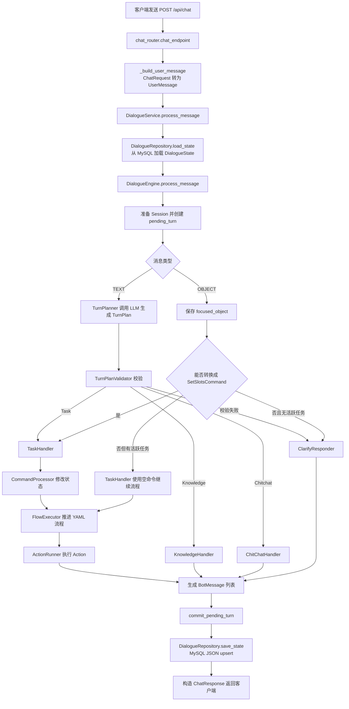
```mermaid
flowchart TD
    A[客户端发送 POST /api/chat] --> B[chat_router.chat_endpoint]
    B --> C[_build_user_message<br/>ChatRequest 转为 UserMessage]
    C --> D[DialogueService.process_message]
    D --> E[DialogueRepository.load_state<br/>从 MySQL 加载 DialogueState]
    E --> F[DialogueEngine.process_message]
    F --> G[准备 Session 并创建 pending_turn]
    G --> H{消息类型}

    H -->|TEXT| I[TurnPlanner 调用 LLM 生成 TurnPlan]
    I --> J[TurnPlanValidator 校验]
    J -->|Task| K[TaskHandler]
    J -->|Knowledge| L[KnowledgeHandler]
    J -->|Chitchat| M[ChitChatHandler]
    J -->|校验失败| N[ClarifyResponder]

    H -->|OBJECT| O[保存 focused_object]
    O --> P{能否转换成 SetSlotsCommand}
    P -->|是| K
    P -->|否但有活跃任务| Q[TaskHandler 使用空命令继续流程]
    P -->|否且无活跃任务| N

    K --> R[CommandProcessor 修改状态]
    R --> S[FlowExecutor 推进 YAML 流程]
    S --> T[ActionRunner 执行 Action]
    Q --> S

    T --> U[生成 BotMessage 列表]
    L --> U
    M --> U
    N --> U
    U --> V[commit_pending_turn]
    V --> W[DialogueRepository.save_state<br/>MySQL JSON upsert]
    W --> X[构造 ChatResponse 返回客户端]
```

这个链路里有两个边界很重要：

1. **接口层只做模型转换**，不写业务逻辑。
2. **Engine 只做调度**，具体业务交给 handler、executor、action。

### 2.2 三条处理轨道

电商小二不是所有问题都走同一套逻辑，而是把用户输入分成三类处理。

| 轨道 | 负责场景 | 典型例子 |
| --- | --- | --- |
| Task | 有明确业务流程的任务 | 查订单、查物流、退款 |
| Knowledge | 信息咨询类问题 | 退款政策、商品信息、配送规则 |
| Chitchat | 闲聊 | 你好、谢谢、你是谁 |

### 2.3 核心状态流转

项目不是无状态问答，而是一个**多轮状态机**。

```text
DialogueState
  ├── active_task          当前正在执行的业务任务
  ├── paused_tasks         被中断的任务栈
  ├── active_system_task   系统提示流程，如收集槽位、任务中断提示
  ├── focused_object       前端当前选中的订单/商品对象
  ├── sessions             用户所有业务会话
  ├── current_session_id   当前业务 session
  └── pending_turn         当前正在处理但还没提交的一轮对话
```

面试时可以这样概括：

> 这个项目把一次客服对话抽象成 DialogueState 聚合根。每个用户一份状态，里面既保存任务执行状态，也保存历史 session 和 turn。每次请求先 load 状态，处理完本轮后再 save 回数据库。

---

## 3. 核心模块实现

核心组件协作：`TurnPlan` 负责表达 LLM 的规划结果，`CommandProcessor` 负责修改运行时状态，`FlowExecutor` 根据 YAML 流程推进 `Step` 和 `Link`，`ActionRunner` 执行具体能力。

### 3.1 核心数据模型与 DialogueState

核心模型分为三层：（**最重要**）

1. **规划模型**：`TurnPlan`、`TaskTurnPlan`、`Command`，描述本轮要做什么。
2. **运行时模型**：`DialogueState`、`TaskContext`、`SystemContext`，记录执行到哪里。
3. **流程配置模型**：`FlowsList`、`Flow`、`FlowStep`、`FlowStepLink`，描述流程可以怎样走。

#### 3.1.1 TaskTurnPlan 与 Command

`TurnPlan` 是一轮文本消息的路由结果，包含 task、knowledge、chitchat 三条可选轨道。`TaskTurnPlan` 只属于 task 轨道，内部保存按顺序执行的 `Command` 列表。LLM 输出字典后，项目通过 `Command.from_dict` 按 `command` 字段转换成具体命令子类。

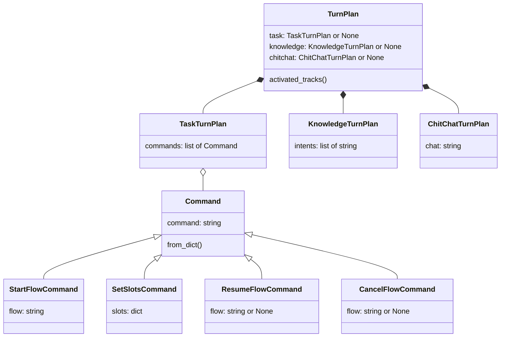
```mermaid
classDiagram
    direction TB

    class TurnPlan {
        task: TaskTurnPlan or None
        knowledge: KnowledgeTurnPlan or None
        chitchat: ChitChatTurnPlan or None
        activated_tracks()
    }
    class TaskTurnPlan {
        commands: list of Command
    }
    class KnowledgeTurnPlan {
        intents: list of string
    }
    class ChitChatTurnPlan {
        chat: string
    }
    class Command {
        command: string
        from_dict()
    }
    class StartFlowCommand {
        flow: string
    }
    class SetSlotsCommand {
        slots: dict
    }
    class ResumeFlowCommand {
        flow: string or None
    }
    class CancelFlowCommand {
        flow: string or None
    }

    TurnPlan *-- TaskTurnPlan
    TurnPlan *-- KnowledgeTurnPlan
    TurnPlan *-- ChitChatTurnPlan
    TaskTurnPlan o-- Command
    Command <|-- StartFlowCommand
    Command <|-- SetSlotsCommand
    Command <|-- ResumeFlowCommand
    Command <|-- CancelFlowCommand
```

| 模型 | 核心字段 | 作用 |
| --- | --- | --- |
| `TaskTurnPlan` | `commands` | 保存 task 轨道本轮要执行的命令序列 |
| `Command` | `command` | 命令类型判别字段 |
| `StartFlowCommand` | `flow` | 开启指定业务流程，值是 flow ID，不是 `Flow` 对象 |
| `SetSlotsCommand` | `slots` | 向当前 `TaskContext.slots` 写入数据 |
| `ResumeFlowCommand` | `flow` | 精确恢复指定流程；为空时在满足条件时恢复栈顶任务 |
| `CancelFlowCommand` | `flow` | 数据模型允许为空；当前处理逻辑实际取消活跃任务 |

#### 3.1.2 TaskContext 与 SystemContext

`Context` 在项目中不是一个单独类，而是两类运行时上下文：

- `TaskContext`：业务流程指针，记录当前业务 flow、当前 step 和已收集 slots。
- `SystemContext`：系统过场流程指针，记录开始、恢复、中断、取消、收集信息等过场所需数据。

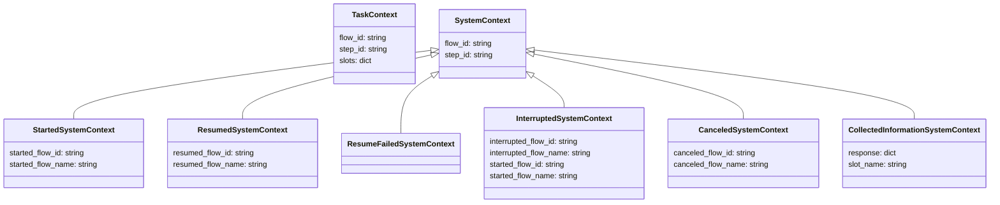
```mermaid
classDiagram
    direction TB

    class TaskContext {
        flow_id: string
        step_id: string
        slots: dict
    }
    class SystemContext {
        flow_id: string
        step_id: string
    }
    class StartedSystemContext {
        started_flow_id: string
        started_flow_name: string
    }
    class ResumedSystemContext {
        resumed_flow_id: string
        resumed_flow_name: string
    }
    class ResumeFailedSystemContext
    class InterruptedSystemContext {
        interrupted_flow_id: string
        interrupted_flow_name: string
        started_flow_id: string
        started_flow_name: string
    }
    class CanceledSystemContext {
        canceled_flow_id: string
        canceled_flow_name: string
    }
    class CollectedInformationSystemContext {
        response: dict
        slot_name: string
    }

    SystemContext <|-- StartedSystemContext
    SystemContext <|-- ResumedSystemContext
    SystemContext <|-- ResumeFailedSystemContext
    SystemContext <|-- InterruptedSystemContext
    SystemContext <|-- CanceledSystemContext
    SystemContext <|-- CollectedInformationSystemContext
```

系统上下文与系统 flow 一一对应，`flow_id` 同时也是反序列化时选择上下文子类的类型标识。

| 系统上下文 | 对应系统 flow | 保存的数据 |
| --- | --- | --- |
| `StartedSystemContext` | `system_task_started` | 新开启流程的 ID 和名称 |
| `ResumedSystemContext` | `system_task_resumed` | 被恢复流程的 ID 和名称 |
| `ResumeFailedSystemContext` | `system_task_resume_failed` | 无可恢复任务时的过场状态 |
| `InterruptedSystemContext` | `system_task_interrupted` | 被中断流程和新流程的信息 |
| `CanceledSystemContext` | `system_task_canceled` | 被取消流程的信息 |
| `CollectedInformationSystemContext` | `system_collect_information` | 槽位名及提问响应配置 |

#### 3.1.3 Flow、Step 与 Link

YAML 被加载为 `FlowsList`。每个 `Flow` 包含多个 `FlowStep`，每个 step 通过 `next` 持有一组 `FlowStepLink`。因此，Flow 是图，Step 是节点，Link 是有向边；`TaskContext.flow_id` 和 `step_id` 是指向这张静态流程图的运行时指针。

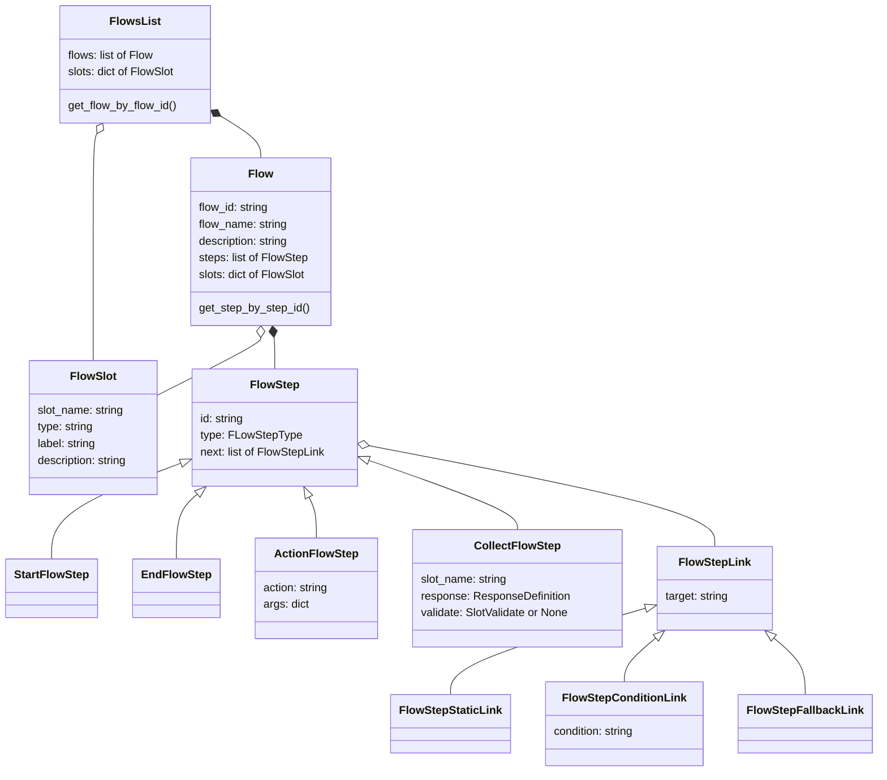
```mermaid
classDiagram
    direction TB

    class FlowsList {
        flows: list of Flow
        slots: dict of FlowSlot
        get_flow_by_flow_id()
    }
    class Flow {
        flow_id: string
        flow_name: string
        description: string
        steps: list of FlowStep
        slots: dict of FlowSlot
        get_step_by_step_id()
    }
    class FlowSlot {
        slot_name: string
        type: string
        label: string
        description: string
    }
    class FlowStep {
        id: string
        type: FLowStepType
        next: list of FlowStepLink
    }
    class StartFlowStep
    class EndFlowStep
    class ActionFlowStep {
        action: string
        args: dict
    }
    class CollectFlowStep {
        slot_name: string
        response: ResponseDefinition
        validate: SlotValidate or None
    }
    class FlowStepLink {
        target: string
    }
    class FlowStepStaticLink
    class FlowStepConditionLink {
        condition: string
    }
    class FlowStepFallbackLink

    FlowsList *-- Flow
    FlowsList o-- FlowSlot
    Flow *-- FlowStep
    Flow o-- FlowSlot
    FlowStep <|-- StartFlowStep
    FlowStep <|-- EndFlowStep
    FlowStep <|-- ActionFlowStep
    FlowStep <|-- CollectFlowStep
    FlowStep o-- FlowStepLink
    FlowStepLink <|-- FlowStepStaticLink
    FlowStepLink <|-- FlowStepConditionLink
    FlowStepLink <|-- FlowStepFallbackLink
```

| 类型 | 配置语义 | 执行语义 |
| --- | --- | --- |
| `StartFlowStep` | 流程入口 | 不执行业务动作，直接选边推进 |
| `CollectFlowStep` | 收集指定 slot，可配置校验 | 缺值时启动系统收集流程，有值时校验并推进 |
| `ActionFlowStep` | 指定 action 和参数 | 先推进 step 指针，再生成 `ActionCall` |
| `EndFlowStep` | 流程终点 | 优先结束系统任务，否则结束业务任务 |
| `FlowStepStaticLink` | 字符串形式的 next | 无条件跳转 |
| `FlowStepConditionLink` | if 与 then | 条件成立时跳转 |
| `FlowStepFallbackLink` | else | 前置条件不成立时兜底跳转 |

#### 3.1.4 DialogueState 聚合关系

`DialogueState` 是每个用户完整对话状态的聚合根。

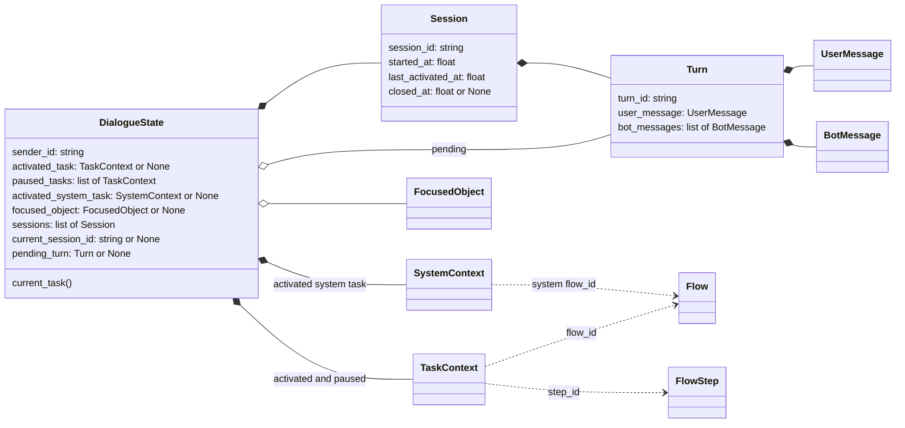
```mermaid
classDiagram
    direction LR

    class DialogueState {
        sender_id: string
        activated_task: TaskContext or None
        paused_tasks: list of TaskContext
        activated_system_task: SystemContext or None
        focused_object: FocusedObject or None
        sessions: list of Session
        current_session_id: string or None
        pending_turn: Turn or None
        current_task()
    }
    class TaskContext
    class SystemContext
    class FocusedObject
    class Session {
        session_id: string
        started_at: float
        last_activated_at: float
        closed_at: float or None
    }
    class Turn {
        turn_id: string
        user_message: UserMessage
        bot_messages: list of BotMessage
    }
    class UserMessage
    class BotMessage

    DialogueState *-- TaskContext : activated and paused
    DialogueState *-- SystemContext : activated system task
    DialogueState o-- FocusedObject
    DialogueState *-- Session
    DialogueState o-- Turn : pending
    Session *-- Turn
    Turn *-- UserMessage
    Turn *-- BotMessage
    TaskContext ..> Flow : flow_id
    TaskContext ..> FlowStep : step_id
    SystemContext ..> Flow : system flow_id
```

`current_task()` 返回 `activated_system_task` 或 `activated_task`，所以系统过场永远优先于业务流程执行。状态流转如下：

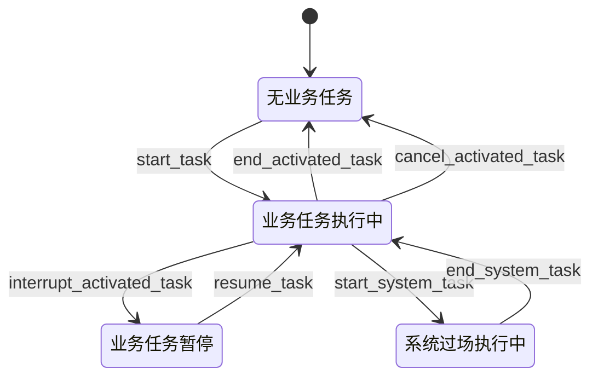
```mermaid
stateDiagram-v2
    [*] --> 无业务任务
    无业务任务 --> 业务任务执行中: start_task
    业务任务执行中 --> 业务任务暂停: interrupt_activated_task
    业务任务暂停 --> 业务任务执行中: resume_task
    业务任务执行中 --> 系统过场执行中: start_system_task
    系统过场执行中 --> 业务任务执行中: end_system_task
    业务任务执行中 --> 无业务任务: end_activated_task
    业务任务执行中 --> 无业务任务: cancel_activated_task
```

持久化时，项目不把 session、turn、slot 拆成多张业务表，而是把整棵 `DialogueState` 序列化为 JSON，并按用户主键 upsert 到 MySQL。

> 面试时可以说：Flow 是静态配置，Context 是动态执行指针，DialogueState 是聚合根。这样的好处是一次加载就能恢复任务栈、槽位、卡片对象和历史会话；代价是单条 turn 的统计查询不如关系型拆表方便。

---

### 3.2 DialogueEngine 调度中心

`DialogueEngine.process_message` 负责单轮调度，不直接实现具体业务。真实处理过程如下：

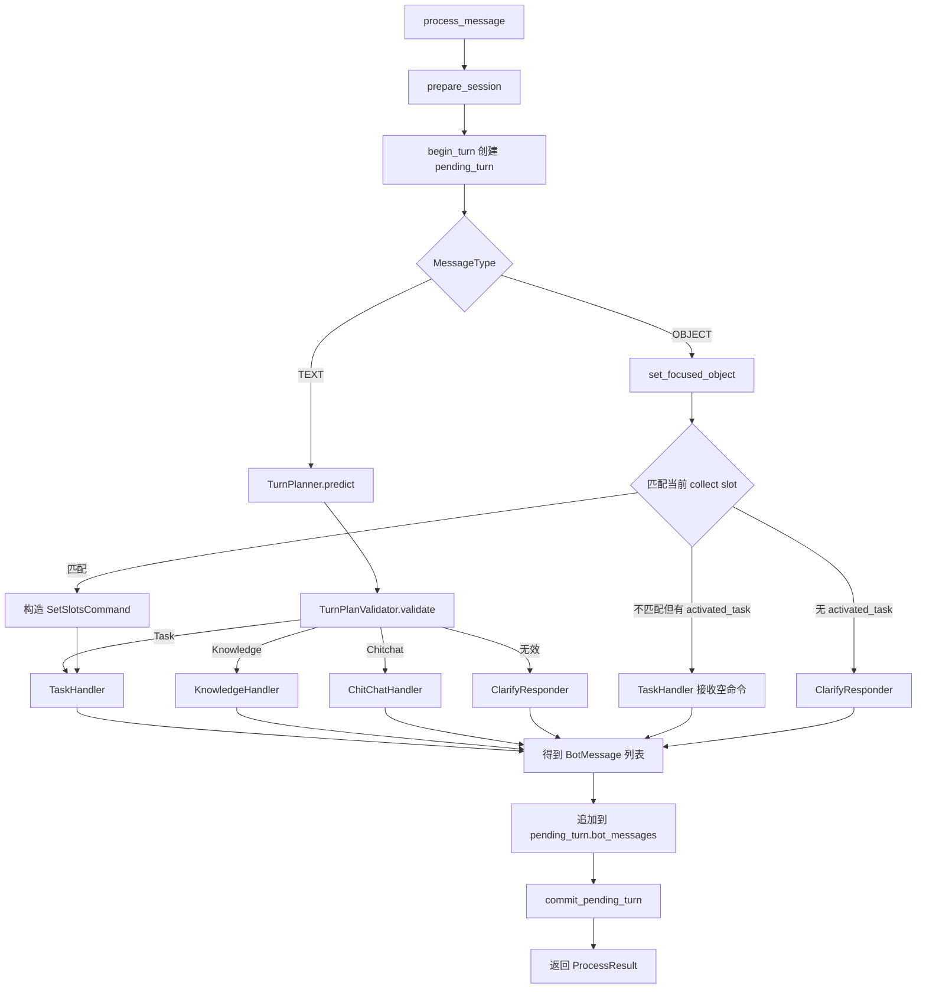
```mermaid
flowchart TD
    A[process_message] --> B[prepare_session]
    B --> C[begin_turn 创建 pending_turn]
    C --> D{MessageType}

    D -->|TEXT| E[TurnPlanner.predict]
    E --> F[TurnPlanValidator.validate]
    F -->|无效| G[ClarifyResponder]
    F -->|Task| H[TaskHandler]
    F -->|Knowledge| I[KnowledgeHandler]
    F -->|Chitchat| J[ChitChatHandler]

    D -->|OBJECT| K[set_focused_object]
    K --> L{匹配当前 collect slot}
    L -->|匹配| M[构造 SetSlotsCommand]
    L -->|不匹配但有 activated_task| N[TaskHandler 接收空命令]
    L -->|无 activated_task| O[ClarifyResponder]
    M --> H

    H --> P[得到 BotMessage 列表]
    I --> P
    J --> P
    G --> P
    N --> P
    O --> P
    P --> Q[追加到 pending_turn.bot_messages]
    Q --> R[commit_pending_turn]
    R --> S[返回 ProcessResult]
```

可以拆成六步：

| 步骤 | 说明 |
| --- | --- |
| 1. 准备 session | 没有 session 就新建，超时则关闭旧 session 并重置运行时状态 |
| 2. 开始 turn | 把用户消息写入 `pending_turn` |
| 3. 判断消息类型 | 文本走 Planner；对象消息写入 `focused_object` 后尝试填槽 |
| 4. 调度 handler | 分发到 task、knowledge、chitchat 或 clarify |
| 5. 写入 bot 消息 | 把回复追加到当前 `pending_turn` |
| 6. 提交 turn | 调用 `commit_pending_turn` 写入当前 session |

#### session 超时处理

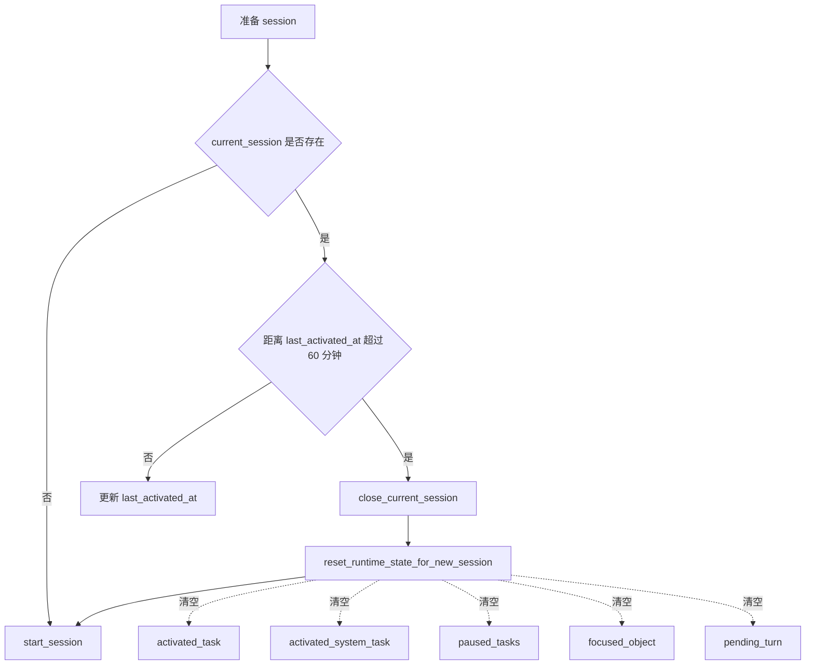
```mermaid
flowchart TD
    A[准备 session] --> B{current_session 是否存在}
    B -->|否| C[start_session]
    B -->|是| D{距离 last_activated_at 超过 60 分钟}
    D -->|否| E[更新 last_activated_at]
    D -->|是| F[close_current_session]
    F --> G[reset_runtime_state_for_new_session]
    G --> C
    G -.清空.-> H[activated_task]
    G -.清空.-> I[activated_system_task]
    G -.清空.-> J[paused_tasks]
    G -.清空.-> K[focused_object]
    G -.清空.-> L[pending_turn]
```

超时边界避免用户隔很久回来后继续执行旧的退款或物流流程。

---

### 3.3 TurnPlanner 与校验器

文本消息先由 `TurnPlanner` 组装最近历史、活跃任务、暂停任务、聚焦对象、可用业务流程和知识意图，再调用 LLM 生成 `TurnPlan`。系统 flow 会从 Planner 的可选 flow 中过滤掉，不能由 LLM 直接开启。

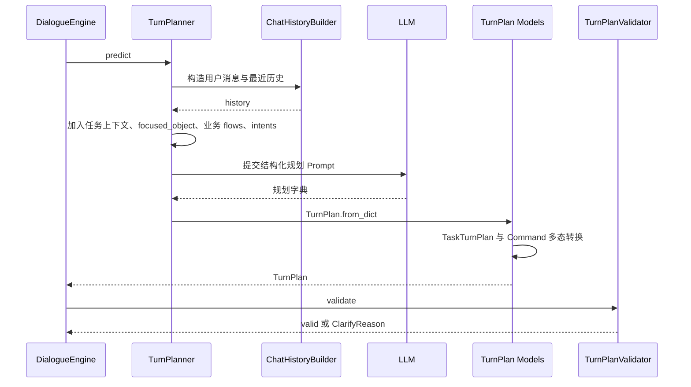
```mermaid
sequenceDiagram
    participant E as DialogueEngine
    participant P as TurnPlanner
    participant H as ChatHistoryBuilder
    participant L as LLM
    participant M as TurnPlan Models
    participant V as TurnPlanValidator

    E->>P: predict
    P->>H: 构造用户消息与最近历史
    H-->>P: history
    P->>P: 加入任务上下文、focused_object、业务 flows、intents
    P->>L: 提交结构化规划 Prompt
    L-->>P: 规划字典
    P->>M: TurnPlan.from_dict
    M->>M: TaskTurnPlan 与 Command 多态转换
    M-->>E: TurnPlan
    E->>V: validate
    V-->>E: valid 或 ClarifyReason
```

Validator 把 LLM 输出限制在后端允许的范围内：

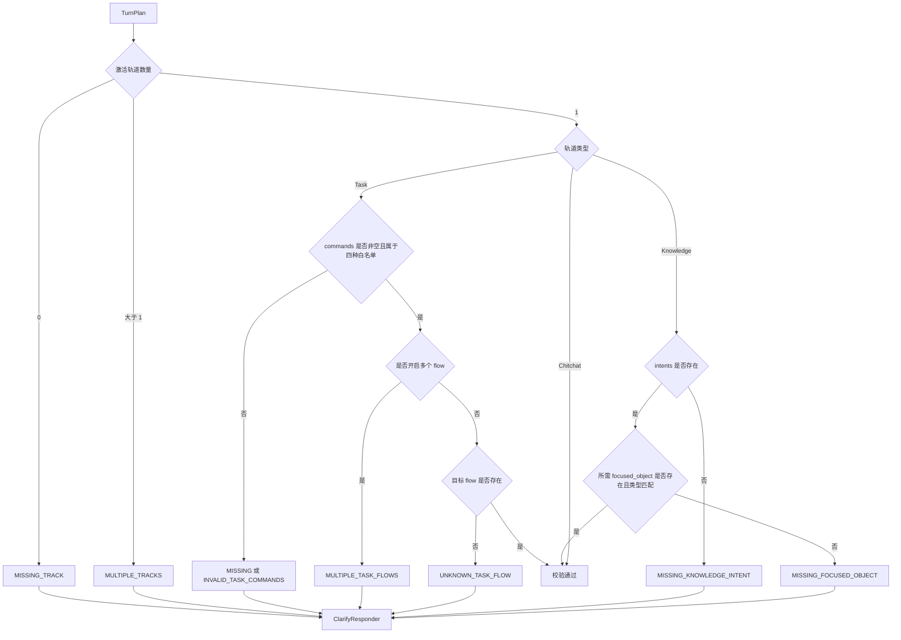
```mermaid
flowchart TD
    A[TurnPlan] --> B{激活轨道数量}
    B -->|0| C[MISSING_TRACK]
    B -->|大于 1| D[MULTIPLE_TRACKS]
    B -->|1| E{轨道类型}

    E -->|Task| F{commands 是否非空且属于四种白名单}
    F -->|否| G[MISSING 或 INVALID_TASK_COMMANDS]
    F -->|是| H{是否开启多个 flow}
    H -->|是| I[MULTIPLE_TASK_FLOWS]
    H -->|否| J{目标 flow 是否存在}
    J -->|否| K[UNKNOWN_TASK_FLOW]
    J -->|是| L[校验通过]

    E -->|Knowledge| M{intents 是否存在}
    M -->|否| N[MISSING_KNOWLEDGE_INTENT]
    M -->|是| O{所需 focused_object 是否存在且类型匹配}
    O -->|否| P[MISSING_FOCUSED_OBJECT]
    O -->|是| L

    E -->|Chitchat| L
    C --> Q[ClarifyResponder]
    D --> Q
    G --> Q
    I --> Q
    K --> Q
    N --> Q
    P --> Q
```

对象消息是例外：它不经过 Planner 和 Validator，而是由 Engine 直接转换成 `SetSlotsCommand`，或用空命令继续执行当前流程。

> 面试时可以这样回答：LLM 只输出结构化计划，Validator 再检查单轨约束、命令白名单、流程存在性和知识意图的对象依赖。校验失败就澄清，不让不可信的规划直接触发业务接口。

---

### 3.4 YAML 流程编排

`flow_config/user_flows.yml` 定义订单状态、物流、退款、相似商品推荐、转人工等业务流程；

`flow_config/system_flows.yml` 定义开始、恢复、中断、取消、恢复失败和收集信息等系统过场。`FlowLoader` 将两份配置合并为一个 `FlowsList`。

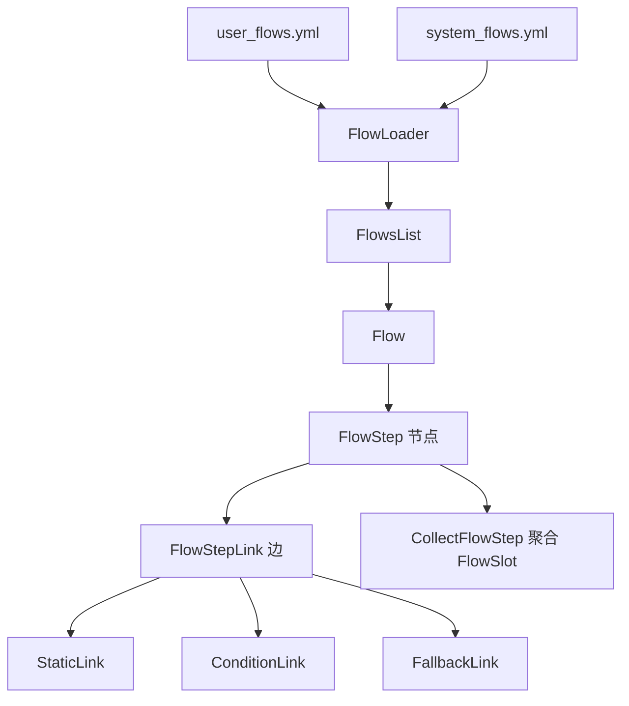
```mermaid
flowchart TD
    A[user_flows.yml] --> C[FlowLoader]
    B[system_flows.yml] --> C
    C --> D[FlowsList]
    D --> E[Flow]
    E --> F[FlowStep 节点]
    F --> G[FlowStepLink 边]
    F --> H[CollectFlowStep 聚合 FlowSlot]
    G --> I[StaticLink]
    G --> J[ConditionLink]
    G --> K[FallbackLink]
```

订单状态查询流程：

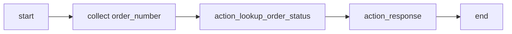
```mermaid
flowchart LR
    A[start] --> B[collect order_number]
    B --> C[action_lookup_order_status]
    C --> D[action_response]
    D --> E[end]
```

收集信息系统流程：

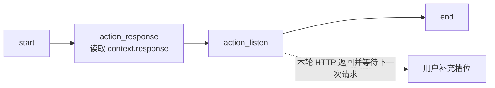
```mermaid
flowchart LR
    A[start] --> B[action_response<br/>读取 context.response]
    B --> C[action_listen]
    C --> D[end]
    C -.本轮 HTTP 返回并等待下一次请求.-> E[用户补充槽位]
```

`action_listen` 是 FlowExecutor 的停止哨兵，不是后台异步等待机制。遇到它后，本轮 HTTP 请求结束；用户下一次发消息时，流程从持久化的 Context 继续。

条件边的运行时选择顺序如下：

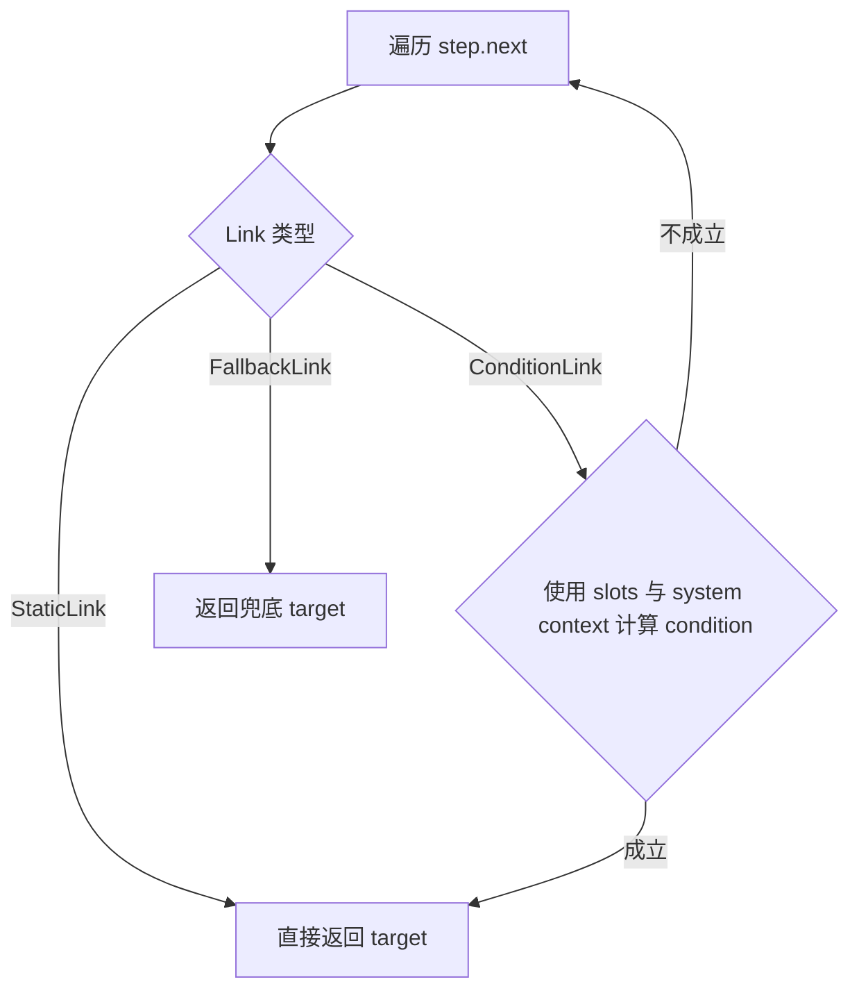
```mermaid
flowchart TD
    A[遍历 step.next] --> B{Link 类型}
    B -->|StaticLink| C[直接返回 target]
    B -->|ConditionLink| D{使用 slots 与 system context 计算 condition}
    D -->|成立| C
    D -->|不成立| A
    B -->|FallbackLink| E[返回兜底 target]
```

> 面试时可以强调：用户业务流程描述“任务怎样完成”，系统流程描述“任务切换和收集信息时怎样过场”。两者使用同一套 Flow、Step、Link 模型，但运行时 Context 不同。

---

### 3.5 CommandProcessor 命令处理

`CommandProcessor.process_commands` 按顺序消费 `TaskTurnPlan.commands`。它只修改 `DialogueState`，不直接产生回复；状态修改完成后由 `FlowExecutor` 统一推进。

| 命令 | 主要状态变化 |
| --- | --- |
| `StartFlowCommand` | 新建 `TaskContext`；必要时暂停旧任务；启动开始或中断系统过场 |
| `SetSlotsCommand` | 更新 `activated_task.slots` |
| `ResumeFlowCommand` | 从 `paused_tasks` 恢复任务；失败时启动恢复失败过场 |
| `CancelFlowCommand` | 取消当前业务任务并启动取消过场 |

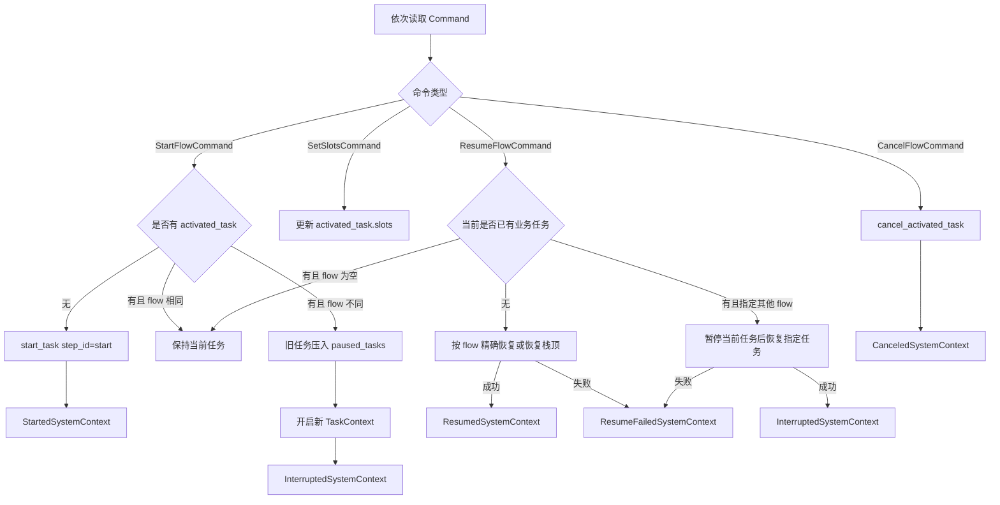
```mermaid
flowchart TD
    A[依次读取 Command] --> B{命令类型}

    B -->|StartFlowCommand| C{是否有 activated_task}
    C -->|无| D[start_task step_id=start]
    D --> E[StartedSystemContext]
    C -->|有且 flow 相同| F[保持当前任务]
    C -->|有且 flow 不同| G[旧任务压入 paused_tasks]
    G --> H[开启新 TaskContext]
    H --> I[InterruptedSystemContext]

    B -->|SetSlotsCommand| J[更新 activated_task.slots]

    B -->|ResumeFlowCommand| K{当前是否已有业务任务}
    K -->|无| L[按 flow 精确恢复或恢复栈顶]
    K -->|有且指定其他 flow| M[暂停当前任务后恢复指定任务]
    K -->|有且 flow 为空| F
    L -->|成功| N[ResumedSystemContext]
    L -->|失败| O[ResumeFailedSystemContext]
    M -->|成功| P[InterruptedSystemContext]
    M -->|失败| O

    B -->|CancelFlowCommand| Q[cancel_activated_task]
    Q --> R[CanceledSystemContext]
```

#### 3.5.1 开启任务

新任务统一从 `step_id = start` 开始。没有活跃任务时，同时启动 `system_task_started`；已有不同任务时，旧 `TaskContext` 被压入 `paused_tasks`，新任务启动，并通过 `system_task_interrupted` 告知用户发生了任务切换。

#### 3.5.2 中断任务

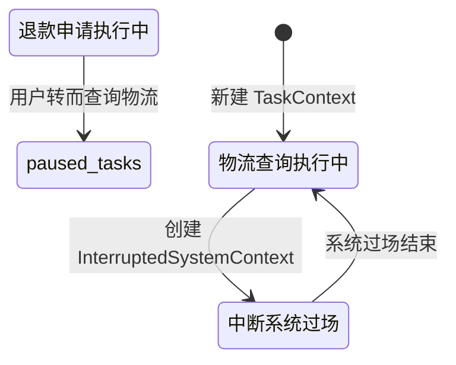
```mermaid
stateDiagram-v2
    退款申请执行中 --> paused_tasks: 用户转而查询物流
    [*] --> 物流查询执行中: 新建 TaskContext
    物流查询执行中 --> 中断系统过场: 创建 InterruptedSystemContext
    中断系统过场 --> 物流查询执行中: 系统过场结束
```

#### 3.5.3 恢复任务

未指定 flow 时，只有在当前没有活跃业务任务的情况下才恢复 `paused_tasks` 栈顶；指定 flow 时可以精确查找暂停任务。恢复失败不会静默结束，而是启动 `system_task_resume_failed`。

> 面试重点：CommandProcessor 是 LLM 规划与状态变更之间的隔离层。LLM 表达“要做什么”，后端确定性代码决定“状态怎样变”。

---

### 3.6 FlowExecutor 流程执行器

`FlowExecutor.executor_flow` 由外层 Action 循环和内层 Step 推进循环组成。`state.current_task()` 优先返回系统 Context，因此过场总是在业务流程之前执行。

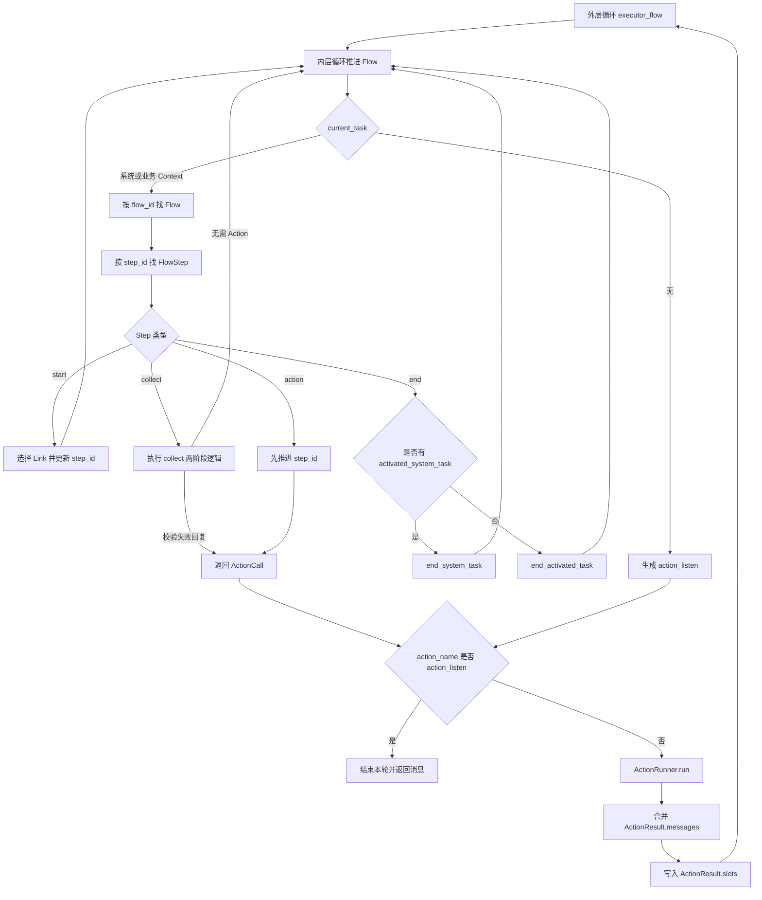
```mermaid
flowchart TD
    A[外层循环 executor_flow] --> B[内层循环推进 Flow]
    B --> C{current_task}
    C -->|无| D[生成 action_listen]
    C -->|系统或业务 Context| E[按 flow_id 找 Flow]
    E --> F[按 step_id 找 FlowStep]
    F --> G{Step 类型}

    G -->|start| H[选择 Link 并更新 step_id]
    H --> B
    G -->|end| I{是否有 activated_system_task}
    I -->|是| J[end_system_task]
    I -->|否| K[end_activated_task]
    J --> B
    K --> B
    G -->|collect| L[执行 collect 两阶段逻辑]
    L -->|无需 Action| B
    L -->|校验失败回复| M[返回 ActionCall]
    G -->|action| N[先推进 step_id]
    N --> M

    M --> O{action_name 是否 action_listen}
    D --> O
    O -->|是| P[结束本轮并返回消息]
    O -->|否| Q[ActionRunner.run]
    Q --> R[合并 ActionResult.messages]
    R --> S[写入 ActionResult.slots]
    S --> A
```

#### 3.6.1 collect 槽位收集

同一个 `CollectFlowStep` 通常会进入两次：第一次发现缺槽，创建 `CollectedInformationSystemContext` 让系统提问；下一轮拿到槽位后再次进入，完成校验并推进。

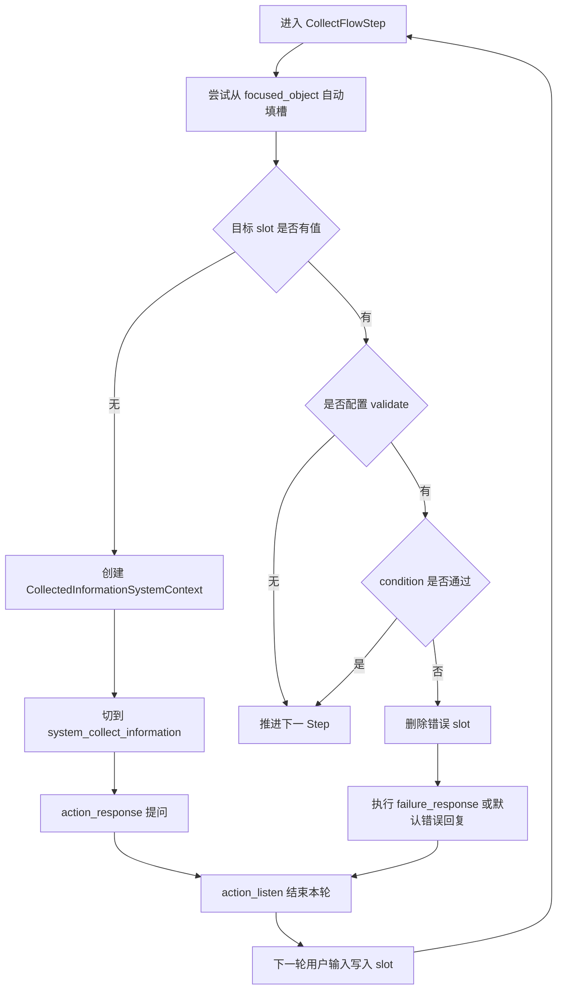
```mermaid
flowchart TD
    A[进入 CollectFlowStep] --> B[尝试从 focused_object 自动填槽]
    B --> C{目标 slot 是否有值}
    C -->|无| D[创建 CollectedInformationSystemContext]
    D --> E[切到 system_collect_information]
    E --> F[action_response 提问]
    F --> G[action_listen 结束本轮]
    G --> H[下一轮用户输入写入 slot]
    H --> A

    C -->|有| I{是否配置 validate}
    I -->|无| J[推进下一 Step]
    I -->|有| K{condition 是否通过}
    K -->|是| J
    K -->|否| L[删除错误 slot]
    L --> M[执行 failure_response 或默认错误回复]
    M --> G
```

#### 3.6.2 对象消息填槽

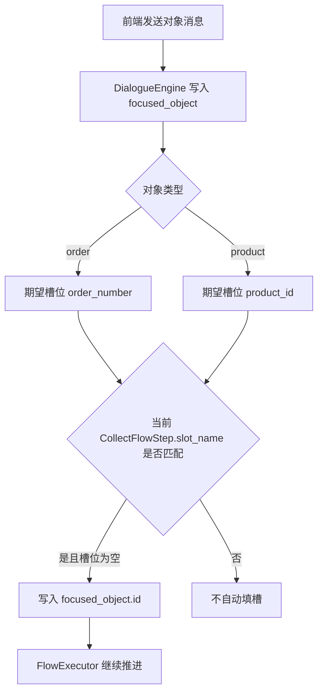
```mermaid
flowchart TD
    A[前端发送对象消息] --> B[DialogueEngine 写入 focused_object]
    B --> C{对象类型}
    C -->|order| D[期望槽位 order_number]
    C -->|product| E[期望槽位 product_id]
    D --> F{当前 CollectFlowStep.slot_name 是否匹配}
    E --> F
    F -->|是且槽位为空| G[写入 focused_object.id]
    F -->|否| H[不自动填槽]
    G --> I[FlowExecutor 继续推进]
```

这条链路把前端订单卡片、商品卡片与后端 collect 步骤连接起来。

---

### 3.7 Action 机制

Action 是 Flow 的能力插件。`ActionRunner` 根据 `ActionCall.action_name` 从注册表取出 Action，再将执行结果交回 FlowExecutor。

| `ActionResult` 字段 | 说明 |
| --- | --- |
| `messages` | 本轮要返回给用户的机器人消息 |
| `slots` | 要写回当前 `TaskContext.slots` 的数据 |

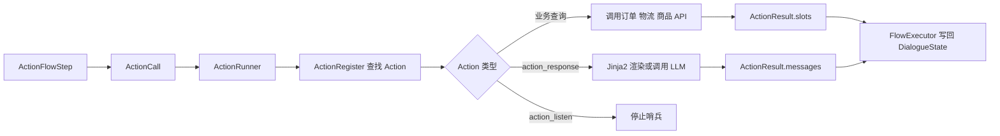
```mermaid
flowchart LR
    A[ActionFlowStep] --> B[ActionCall]
    B --> C[ActionRunner]
    C --> D[ActionRegister 查找 Action]
    D --> E{Action 类型}
    E -->|业务查询| F[调用订单 物流 商品 API]
    E -->|action_response| G[Jinja2 渲染或调用 LLM]
    E -->|action_listen| H[停止哨兵]
    F --> I[ActionResult.slots]
    G --> J[ActionResult.messages]
    I --> K[FlowExecutor 写回 DialogueState]
    J --> K
```

#### 3.7.1 查询订单状态

```mermaid
flowchart LR
    A[读取 order_number] --> B[调用订单 API]
    B --> C{是否查到订单}
    C -->|是| D[写入 order_status 与 order_summary]
    C -->|否| E[写入查询失败与兜底说明]
    D --> F[下一 ActionStep: action_response]
    E --> F
    F --> G[把 slots 渲染成用户话术]
```

查询 Action 不直接面向用户表达，而是先产出结构化槽位，下一步再由 response Action 生成回复。

#### 3.7.2 查询物流

```mermaid
flowchart LR
    A[读取订单或物流标识] --> B[调用物流 API]
    B --> C[提取 tracking_number]
    B --> D[提取 logistics_company]
    B --> E[提取 logistics_status]
    C --> F[ActionResult.slots]
    D --> F
    E --> F
```

#### 3.7.3 ActionResponse

`action_response` 支持三种表达模式：

| mode | 处理方式 |
| --- | --- |
| `static` | 使用 Jinja2 渲染模板后直接返回 |
| `rephrase` | 渲染建议回复，再让 LLM 改写得更自然 |
| `generate` 等其他模式 | 根据 prompt 让 LLM 生成回复 |

```mermaid
flowchart TD
    A[action_response] --> B[读取 text mode prompt]
    B --> C[Jinja2 注入 slots 与 context]
    C --> D{mode}
    D -->|static| E[直接生成 BotMessage]
    D -->|rephrase| F[将渲染文本与 prompt 交给 LLM]
    D -->|generate 或其他| G[根据 prompt 调用 LLM]
    F --> E
    G --> E
```

这里的 `slots` 来自业务 `TaskContext`，`context` 是当前系统上下文或业务上下文。查询能力和表达能力分离，使同一份业务结果可以配置不同话术。

---

### 3.8 Knowledge 与 Chitchat 轨道

Knowledge 轨道根据 intent 找到一个或多个 Provider。Provider 负责从订单、商品 API、FAQ 或 RAG 中检索 `KnowledgeChunk`，最后由 `KnowledgeResponder` 结合当前问题和最近历史组织答案。

```mermaid
flowchart TD
    A[KnowledgeTurnPlan.intents] --> B[映射 provider_ids]
    B --> C[ProviderRegistry]
    C --> D[订单或商品 API Provider]
    C --> E[FAQ Provider]
    C --> F[RAG Provider]
    D --> G[KnowledgeChunk 列表]
    E --> G
    F --> G
    G --> H[KnowledgeResponder]
    I[当前用户消息] --> H
    J[最近对话历史] --> H
    H --> K[LLM 组织知识回复]
```

完整的非 Task 分支如下：

```mermaid
flowchart TD
    A{TurnPlan 或校验结果} -->|Knowledge| B[检索 Provider 并生成知识回复]
    A -->|Chitchat| C[结合用户消息与历史生成闲聊回复]
    A -->|MISSING_TRACK| D[ClarifyResponder]
    A -->|MULTIPLE_TRACKS| D
    A -->|命令或 flow 非法| D
    A -->|缺少 required focused_object| D
    E[对象消息没有明确意图] --> D
    B --> F[BotMessage]
    C --> F
    D --> F
```

> 面试回答：Task 轨道解决确定性业务流程，Knowledge 轨道解决需要检索的信息咨询，Chitchat 解决闲聊，Clarify 处理规划不确定性。四者职责分离，避免所有问题都进入同一套任务状态机。


## 4. YAML 与 LangGraph 选型区别

严格来说，**YAML 和 LangGraph 不在同一个技术层级**：

- YAML 是配置序列化格式，只负责描述数据。
- LangGraph 是有状态工作流与 Agent 编排框架，负责图执行、状态传递和运行时控制。
- 本项目真正选择的是：**YAML 驱动的自研有限状态机**，还是 **LangGraph 驱动的图运行时**。

```mermaid
flowchart LR
    subgraph Current["本项目方案"]
        A[YAML 流程配置] --> B[FlowLoader]
        B --> C[Flow Step Link 模型]
        C --> D[自研 FlowExecutor]
        D --> E[DialogueState]
    end

    subgraph LangGraphSolution["LangGraph 方案"]
        F[节点与边定义] --> G[LangGraph Runtime]
        G --> H[Graph State]
        G --> I[Checkpoint Interrupt Stream]
    end
```

因此，不能简单得出“YAML 比 LangGraph 更轻”或“LangGraph 一定更高级”的结论。是否合适取决于流程复杂度、配置化要求、运行时能力和维护成本。

### 4.1 两种方案解决的问题

本项目中的业务任务主要是确定性客服 SOP：

```mermaid
flowchart LR
    A[识别业务意图] --> B[开启预定义 Flow]
    B --> C[收集必要槽位]
    C --> D[调用业务 Action]
    D --> E[渲染客服回复]
    E --> F[action_listen 等待下一轮]
```

它具有以下特点：

- 流程在上线前已经确定，LLM 只选择 flow 和 command。
- 核心节点是 start、collect、action、end。
- 跨轮等待通过 `TaskContext.step_id` 和 `DialogueState` 恢复。
- 需要频繁调整槽位、话术和步骤。
- 当前业务没有并行分支、动态子图和复杂 Agent 循环。

LangGraph 更擅长处理运行时图行为明显的工作流：

```mermaid
flowchart TD
    A[用户问题] --> B[Planner]
    B --> C[并行检索]
    C --> D[向量检索]
    C --> E[数据库查询]
    C --> F[联网搜索]
    D --> G[结果融合与重排序]
    E --> G
    F --> G
    G --> H{证据是否充分}
    H -->|否| B
    H -->|是| I[生成答案]
    I --> J{是否需要人工确认}
    J -->|是| K[Interrupt]
    J -->|否| L[结束]
    K --> L
```

它更适合：

- 多工具并行调用与结果汇聚。
- 动态路由、条件循环、重试和反思。
- 子图复用与复杂 Agent 协作。
- 需要框架级 checkpoint、interrupt、streaming 和运行追踪的场景。

### 4.2 YAML 驱动自研流程引擎的优势

#### 业务配置直观

客服流程可以直接映射为 Flow、Step 和 Link。产品、测试和开发可以围绕同一份配置沟通，不必先理解 Agent 图运行时。

#### 执行边界可控

LLM 只能输出白名单中的 `Command`，并选择已经存在的业务 Flow；真正的状态修改由 `CommandProcessor` 完成，流程推进由 `FlowExecutor` 完成。LLM 不具备任意创建节点或调用工具的权限。

```mermaid
flowchart LR
    A[LLM 输出 TurnPlan] --> B[Validator]
    B -->|合法| C[CommandProcessor]
    B -->|非法| D[ClarifyResponder]
    C --> E[只允许执行已配置 Flow]
    E --> F[只允许调用已注册 Action]
```

#### 运行模型简单

运行时只需要持久化 `flow_id`、`step_id` 和 slots，就能在下一轮请求继续执行。对于顺序型、跨轮等待型客服 SOP，这种模型更容易理解。

#### 依赖少且定制成本低

当前只需要四种 Step 和三种 Link。自研执行器规模可控，不必为了尚未出现的复杂能力引入完整图框架。

### 4.3 YAML 自研方案优势与成本

选择自研不代表没有成本。随着需求复杂度提升，下列能力都需要项目自行建设：

- YAML Schema 校验、版本兼容和发布前检查。
- 条件表达式安全执行；当前直接使用 `eval` 存在安全风险。
- 流程可视化、单步调试、执行 trace 和指标监控。
- Action 超时、重试、幂等、补偿和熔断。
- 并行节点、Join、子流程和动态路由。
- 状态 checkpoint、人工审批中断和失败恢复。
- 流程配置变更后，旧 Context 如何迁移到新版本。

```mermaid
flowchart TD
    A[业务复杂度增长] --> B{是否仍只有顺序与简单条件分支}
    B -->|是| C[继续扩展 YAML Flow]
    B -->|否| D[开始增加并行 循环 子图]
    D --> E[FlowExecutor 复杂度上升]
    E --> F{自研成本是否超过框架接入成本}
    F -->|否| C
    F -->|是| G[局部引入 LangGraph]
```

面试时需要主动说明这些边界，否则“轻量自研”很容易演变为重复实现一个不完整的工作流框架。

### 4.4 LangGraph 的优势与引入成本

LangGraph 的价值不只是“能画图”，而是提供面向有状态工作流的运行时能力：

- 使用共享 State 规范节点间的数据传递。
- 支持条件路由、循环、并行分支和子图。
- 通过 checkpoint 支持中断后的状态恢复。
- 通过 interrupt 支持人工审核和 Human-in-the-loop。
- 支持流式输出，并可接入更完整的运行追踪与调试体系。

但引入 LangGraph 也有成本：

- 团队需要理解图状态、节点契约、Reducer、checkpoint 等概念。
- 业务人员不能直接修改 Python 图定义，仍可能需要额外建设配置层。
- 现有 `DialogueState`、MySQL JSON 持久化和任务恢复机制需要重新划分职责。
- 简单顺序流程使用图框架，不一定减少代码量。
- 框架升级、运行时行为和可观测性接入都需要维护。

特别需要注意：**使用 LangGraph 并不等于不能使用 YAML**。也可以让 YAML 作为业务 DSL，再编译成 LangGraph 的节点和边；只是这样仍需维护 YAML Schema、编译器和 LangGraph 运行时两层系统。

### 4.5 核心选型对比

| 维度 | YAML + 自研 FlowExecutor | LangGraph |
| --- | --- | --- |
| 核心定位 | 配置驱动的确定性状态机 | 有状态图工作流与 Agent 运行时 |
| 当前项目适配度 | 高 | 可实现，但现阶段收益有限 |
| 顺序型客服 SOP | 简单直接 | 能实现，但框架能力有富余 |
| 业务配置可读性 | 高 | 默认偏开发者，需要额外配置层 |
| 条件分支与循环 | 简单条件可用，复杂后维护成本高 | 更适合复杂路由和循环 |
| 并行与汇聚 | 当前不支持，需要自研 | 框架表达更自然 |
| 跨轮恢复 | 自研 Context + MySQL JSON | Checkpoint + Graph State |
| 人工审批中断 | 需要自研 | 可使用 interrupt 模型 |
| 调试与追踪 | 需要补建 trace 和可视化 | 可利用框架及其生态能力 |
| 依赖与学习成本 | 初期低，复杂后自研成本上升 | 初期较高，复杂图下收益明显 |

选型的关键不是节点数量，而是**控制流是否动态、是否需要并行循环，以及是否需要成熟的运行时能力**。

### 4.8 面试回答

> 严格来说，我们比较的不是 YAML 文件和 LangGraph，而是 YAML 驱动的自研有限状态机与 LangGraph 图运行时。当前电商客服的 Task 轨道是预定义 SOP，核心是收集槽位、串行调用 Action、回复并等待下一轮，使用 Flow、Step、Link 和 Context 就能清晰表达；同时 YAML 对业务和测试更友好，LLM 也只能选择白名单流程。因此当前选择 YAML + FlowExecutor。它的代价是校验、追踪、并行、重试和版本迁移需要自研。如果未来 Knowledge 轨道出现多路并行检索、动态工具循环或人工中断，我会优先把这部分做成 LangGraph 子图，而不是整体替换确定性业务流程。

---

## 5. 技术细节与痛点分析

### 5.1 如何降低 LLM 幻觉风险

项目没有让 LLM 直接执行接口调用，而是采用：

```text
LLM 输出 TurnPlan
    ↓
后端 Validator 校验
    ↓
CommandProcessor 修改状态
    ↓
FlowExecutor 执行 YAML
    ↓
Action 调业务接口
```

防护点包括：

- 只能命中一个轨道
- task command 必须在白名单里
- flow 必须在 YAML 中存在
- knowledge intent 必须在注册表中存在
- 需要对象的知识意图必须有 focused_object
- 校验失败走 clarify，而不是强行执行

### 5.2 为什么要设计系统流程

如果没有系统流程，任务切换和槽位收集就会散落在代码里。

例如：

```text
开始任务怎么说
中断任务怎么说
恢复任务怎么说
收集订单号怎么说
无法处理怎么说
```

这些都写在 `system_flows.yml` 里，可以复用 `action_response` 和 `action_listen`。

好处：

- 话术配置化
- 主流程更干净
- 任务切换逻辑统一
- 后续可以给系统提示加模式

### 5.3 为什么查询 action 不直接回复

以订单查询为例，`action_lookup_order_status` 只写槽位：

```python
return ActionResult(slot_updates={
    "order_status": payload.get("status_desc") or payload.get("status") or "未知",
    "order_summary": _build_order_summary(payload),
})
```

真正回复由下一步 `action_response` 完成。

好处：

- 查询和表达解耦
- YAML 可以决定什么时候说、怎么说

### 5.4 对象消息如何提升体验

前端可以传：

```json
{
  "sender_id": "u1001",
  "object": {
    "type": "order",
    "id": "ORDER_001",
    "title": "订单标题",
    "attributes": {}
  }
}
```

后端收到对象消息后：

```python
state.set_focused_object(user_message.object)
```

如果当前流程正在收集 `order_number`，就自动填入：

```python
if object_type == "order":
    if self._flow_has_unfilled_collect_slot(state, flows, "order_number"):
        return [SetSlotsCommand(command="set_slots", slots={"order_number": user_obj.id})]
```

这样用户不需要手输订单号，点击订单卡片就能继续流程。

### 5.5 当前设计的不足

| 问题 | 说明 | 可优化方向 |
| --- | --- | --- |
| YAML 条件使用 `eval` | 存在安全风险 | 换成安全表达式解析器 |
| 状态整体 JSON 存储 | 查询单条历史不方便 | 热路径 JSON，分析数据异步拆表 |
| 自研流程引擎 | 需要自己维护调试能力 | 增加流程可视化和执行日志 |
| Action 串行执行 | 不适合复杂并行工具调用 | 局部引入 LangGraph 或并发执行器 |
| YAML 校验较弱 | 配置错误可能运行时暴露 | 启动时做 Pydantic schema 校验 |
| FAQ/RAG Provider 简化 | 知识质量依赖后续实现 | 接入真实向量库和重排序 |

面试时不要只讲优点，也要主动讲这些取舍，会显得更真实。

---

## 6. 业务更换指南

这一章很重要。面试者写简历时，经常会把“电商客服”包装成“银行客服”“物流客服”“保险客服”“售后工单助手”等不同业务。如果只是改项目名称，不知道底层应该换哪些模块，面试时很容易被追问穿帮。

更换业务时不要理解成“把电商两个字替换掉”，而是要按下面这条链路系统替换：

```text
业务场景
  ↓
用户会问什么问题
  ↓
需要哪些业务流程 flow
  ↓
每个流程要收集哪些 slot
  ↓
每个流程要调用哪些外部系统 action
  ↓
哪些问题属于知识咨询 intent
  ↓
前端有没有业务对象卡片 object
  ↓
Planner prompt 里能不能让 LLM 选对 flow / intent
```

换业务时，底层对话框架大部分不用动，真正要动的是“业务配置 + 业务动作 + 业务知识 + 前端对象”。

### 6.1 先确定业务边界

第一步不是写代码，而是先把新业务拆清楚。

以“银行客服”为例，先列出用户常见问题：

| 用户问题         | 归类     | 后端处理方式                        |
| ---------------- | -------- | ----------------------------------- |
| 我要查银行卡余额 | 业务任务 | task flow + action 调余额接口       |
| 我要挂失银行卡   | 业务任务 | task flow + action 调挂失接口       |
| 信用卡怎么还款   | 知识咨询 | knowledge intent + FAQ/RAG provider |
| 你们周末上班吗   | 知识咨询 | knowledge intent + FAQ provider     |
| 谢谢你           | 闲聊     | chitchat                            |

这个表决定后面要改哪些 flow、slot、action 和 intent。

面试时可以说：

> 我更换业务时会先做意图盘点，把用户问题分成任务型、知识型和闲聊型。任务型进入 YAML flow，知识型进入 KnowledgeIntent 和 Provider，闲聊继续走 Chitchat，不会把所有问题都硬塞进一个流程。

### 6.2 修改业务流程 YAML

任务型问题要改：

```text
flow_config/user_flows.yml
```

原电商业务里有：

```yaml
order_status_query
logistics_tracking
refund_request
similar_product_recommendation
human_handoff
```

换成银行客服时，可以改成：

```yaml
balance_query:
  name: 余额查询
  description: 帮用户查询指定银行卡或账户的可用余额。
  steps:
    - id: start
      type: start
      next: ask_account_number

    - id: ask_account_number
      type: collect
      slot_name: account_number
      response:
        text: "请告诉我需要查询的银行卡号或账户号。"
      next: query_balance

    - id: query_balance
      type: action
      action: action_query_balance
      next: show_balance

    - id: show_balance
      type: action
      action: action_response
      args:
        text: "账户{{ slots.account_number }}当前可用余额为：{{ slots.available_balance }}。"
      next: end

    - id: end
      type: end
      next: []
```

再比如银行卡挂失：

```yaml
card_loss_report:
  name: 银行卡挂失
  description: 用户银行卡丢失后，收集银行卡号和身份信息，提交挂失申请。
  steps:
    - id: start
      type: start
      next: ask_card_number

    - id: ask_card_number
      type: collect
      slot_name: card_number
      response:
        text: "请告诉我需要挂失的银行卡号。"
      next: ask_identity_number

    - id: ask_identity_number
      type: collect
      slot_name: identity_number
      response:
        text: "为了核验身份，请提供身份证后四位。"
      next: report_card_loss

    - id: report_card_loss
      type: action
      action: action_report_card_loss
      next: show_result

    - id: show_result
      type: action
      action: action_response
      args:
        text: "银行卡{{ slots.card_number }}的挂失申请已提交，当前状态：{{ slots.loss_status }}。"
      next: end

    - id: end
      type: end
      next: []
```

这里要注意三点：

1. `flow_id` 要能表达业务含义，比如 `card_loss_report`
2. `description` 要写清楚，因为 Planner 会参考它判断用户意图
3. `action` 名称必须和 Python 里的 Action.name 对得上

### 6.3 修改 slot 定义

流程需要收集什么信息，就要在 YAML 顶部 `slots` 中定义什么字段。

电商里有：

```yaml
order_number
product_id
refund_reason
tracking_number
```

银行里可能换成：

```yaml
slots:
  account_number:
    type: text
    label: 账户号
    description: 用户要查询余额的银行账户号或银行卡号

  card_number:
    type: text
    label: 银行卡号
    description: 用户需要挂失或查询的银行卡号

  identity_number:
    type: text
    label: 身份证后四位
    description: 用于身份核验的身份证后四位

  available_balance:
    type: text
    label: 可用余额
    description: 查询到的账户可用余额

  loss_status:
    type: text
    label: 挂失状态
    description: 银行卡挂失申请的处理状态
```

slot 的作用不只是保存数据，还会影响 LLM 理解流程。

面试时可以强调：

> slot description 不是摆设。Planner 看到 flow 和 slot 描述后，才能判断用户说“查一下这张卡还有多少钱”时，应该开启 `balance_query`，并把卡号填入 `account_number` 或 `card_number`。

### 6.4 新增业务 Action

YAML 只描述流程，真正的业务动作要写成 Action。

电商项目里已有：

```text
atguigu/task/action/customer/lookup_order_status.py
atguigu/task/action/customer/lookup_logistics.py
atguigu/task/action/customer/recommend_similar_products.py
```

换银行业务时，可以新增：

```text
atguigu/task/action/customer/query_balance.py
atguigu/task/action/customer/report_card_loss.py
```

余额查询 Action 示例：

```python
from typing import Any
from atguigu.domain.state import DialogueState
from atguigu.task.action.base import Action, ActionResult
from atguigu.task.action.customer.bank_shared import fetch_balance


class QueryBalanceAction(Action):
    name = "action_query_balance"

    async def run(self, state: DialogueState, action_kwargs: dict[str, Any]) -> ActionResult:
        account_number = state.active_task.slots.get("account_number")
        payload = await fetch_balance(account_number)

        if payload is None:
            return ActionResult(slot_updates={
                "available_balance": "暂时无法查询，请稍后再试"
            })

        return ActionResult(slot_updates={
            "available_balance": payload.get("available_balance") or "未知"
        })
```

挂失 Action 示例：

```python
from typing import Any
from atguigu.domain.state import DialogueState
from atguigu.task.action.base import Action, ActionResult
from atguigu.task.action.customer.bank_shared import submit_card_loss


class ReportCardLossAction(Action):
    name = "action_report_card_loss"

    async def run(self, state: DialogueState, action_kwargs: dict[str, Any]) -> ActionResult:
        card_number = state.active_task.slots.get("card_number")
        identity_number = state.active_task.slots.get("identity_number")
        payload = await submit_card_loss(card_number, identity_number)

        if payload is None:
            return ActionResult(slot_updates={
                "loss_status": "提交失败，请稍后再试"
            })

        return ActionResult(slot_updates={
            "loss_status": payload.get("status") or "已受理"
        })
```

Action 写完后，要保证被注册到 action registry。项目里是通过 action builder / registry 统一管理 action，面试时可以表述为：

> 新增业务 action 后，需要让 ActionRegistry 能按 `action_query_balance` 找到对应 Action 类。YAML 中的 action 名称和 Python 类里的 `name` 必须完全一致，否则 FlowExecutor 构造 ActionCall 后，ActionRunner 找不到具体动作。

### 6.5 修改业务接口调用层

不要把外部 HTTP 请求散落在每个 action 里，建议像电商项目的 `shared.py` 一样抽公共模块。

电商里是：

```text
atguigu/task/action/customer/shared.py
```

银行可以改成：

```text
atguigu/task/action/customer/bank_shared.py
```

示例：

```python
from urllib.parse import quote
from atguigu.conf.config import settings
from atguigu.infrastructure.http_client import http_client


def _bank_base_url() -> str:
    return settings.bank_api_base_url.rstrip("/")


async def fetch_balance(account_number: str) -> dict | None:
    try:
        r = await http_client.get(f"{_bank_base_url()}/accounts/{quote(account_number)}/balance")
        payload = r.json()
        return payload.get("data") if isinstance(payload, dict) else None
    except Exception:
        return None


async def submit_card_loss(card_number: str, identity_number: str) -> dict | None:
    try:
        r = await http_client.post(
            f"{_bank_base_url()}/cards/{quote(card_number)}/loss-report",
            json={"identity_number": identity_number}
        )
        payload = r.json()
        return payload.get("data") if isinstance(payload, dict) else None
    except Exception:
        return None
```

配置也要同步换：

```text
atguigu/conf/config.py
.env
```

比如：

```env
BANK_API_BASE_URL=http://localhost:9000
```

面试时可以说：

> 更换业务系统时，我不会让 Action 直接拼一堆 HTTP 细节，而是抽一个 shared client 层。Action 只表达业务动作，HTTP URL、异常处理、响应解析放到共享模块里。

### 6.6 修改知识意图和 Provider

不是所有用户问题都应该写成 task flow。

比如银行客服里：

| 用户问题         | 是否需要流程 | 处理方式         |
| ---------------- | ------------ | ---------------- |
| 我要挂失银行卡   | 需要         | task flow        |
| 信用卡怎么还款   | 不需要       | knowledge intent |
| 跨行转账多久到账 | 不需要       | knowledge intent |
| 我这张卡余额多少 | 需要         | task flow        |

知识意图定义在：

```text
atguigu/knowledge/intents.py
```

银行场景可以改成：

```python
"credit_card_repayment_policy": KnowledgeIntent(
    id="credit_card_repayment_policy",
    description="信用卡还款规则咨询",
    provider_ids=["faq.bank", "rag.bank"],
),
"transfer_arrival_policy": KnowledgeIntent(
    id="transfer_arrival_policy",
    description="转账到账时间咨询",
    provider_ids=["faq.bank", "rag.bank"],
),
"account_info": KnowledgeIntent(
    id="account_info",
    description="账户信息咨询",
    provider_ids=["api.account"],
    requires_object="account",
),
```

Provider 要同步调整：

```text
atguigu/knowledge/provider.py
atguigu/knowledge/registry.py
```

例如：

```python
class BankFAQProvider(KnowledgeProvider):
    id = "faq.bank"

    async def retrieve(self, state: DialogueState) -> list[KnowledgeChunk]:
        return [
            KnowledgeChunk(content="信用卡支持自动还款、主动还款和柜台还款。"),
        ]
```

如果简历里写“银行客服助手”，面试官问“信用卡还款规则怎么回答”，就不能说走 `refund_policy`，而应该说走银行业务自己的 `credit_card_repayment_policy`。

### 6.7 修改对象消息和前端卡片

电商项目支持前端点击订单卡片、商品卡片：

```text
order → order_number
product → product_id
```

换业务后，如果前端也有业务对象，就要同步修改对象类型。

例如银行客服可能有：

```text
account → account_number
card → card_number
loan → loan_id
```

后端需要改对象填槽逻辑，位置在：

```text
atguigu/engine/dialogue_engine.py
```

原来是：

```python
if object_type == "order":
    if self._flow_has_unfilled_collect_slot(state, flows, "order_number"):
        return [SetSlotsCommand(command="set_slots", slots={"order_number": user_obj.id})]

if object_type == "product":
    if self._flow_has_unfilled_collect_slot(state, flows, "product_id"):
        return [SetSlotsCommand(command="set_slots", slots={"product_id": user_obj.id})]
```

银行可以改成：

```python
if object_type == "account":
    if self._flow_has_unfilled_collect_slot(state, flows, "account_number"):
        return [SetSlotsCommand(command="set_slots", slots={"account_number": user_obj.id})]

if object_type == "card":
    if self._flow_has_unfilled_collect_slot(state, flows, "card_number"):
        return [SetSlotsCommand(command="set_slots", slots={"card_number": user_obj.id})]
```

前端也要同步：

```text
订单卡片 / 商品卡片 → 银行账户卡片 / 银行卡片
object.type: order/product → account/card
object.id: order_id/product_id → account_number/card_number
```

面试时可以说：

> 对象消息是前后端协作点。换业务时不只改后端 flow，还要把前端卡片对象类型、后端 FocusedObject 类型、slot 自动填充规则一起替换，否则用户点击卡片后无法自动填槽。

### 6.8 修改 Planner 可理解的信息

Planner 会根据当前可用 flows、slots、knowledge intents、历史上下文来判断用户意图。

所以换业务时，不一定要大改 planner 代码，但必须保证这些描述足够准确：

| 信息                         | 要求                           |
| ---------------------------- | ------------------------------ |
| flow name                    | 能表达业务动作，如“银行卡挂失” |
| flow description             | 写清楚适用场景和用户说法       |
| slot description             | 写清楚槽位含义                 |
| knowledge intent description | 写清楚知识问题范围             |

例如不要写：

```yaml
description: 处理用户问题
```

要写：

```yaml
description: 用户银行卡丢失或被盗刷时，收集银行卡号和身份信息，提交挂失申请。
```

面试时可以说：

> 我们的 Planner 是通用的，业务迁移时重点是把 flow、slot、intent 的自然语言描述写准确。LLM 不是靠硬编码 if else 判断业务，而是根据这些描述选择结构化 TurnPlan。

### 6.9 修改系统话术和兜底流程

系统流程在：

```text
flow_config/system_flows.yml
```

很多系统话术也要跟着业务换。

电商话术：

```text
你可以重新说一下你想查订单、查物流，还是申请退款吗？
```

银行客服应该改成：

```text
你可以重新说一下你想查询余额、办理挂失，还是咨询信用卡还款规则吗？
```

重点检查这些系统流程：

| 系统流程                     | 换业务时要不要改                |
| ---------------------------- | ------------------------------- |
| `system_task_started`        | 一般不用，只引用 flow name      |
| `system_task_resumed`        | 一般不用，只引用 flow name      |
| `system_task_interrupted`    | 一般不用，只引用 flow name      |
| `system_collect_information` | 一般不用，使用 collect.response |
| `system_cannot_handle`       | 建议改，里面有业务兜底话术      |
| `system_task_canceled`       | 一般不用，只引用 flow name      |

### 6.10 修改接口 Schema 和字段映射

如果前端对象和后端消息结构不变，一般不用大改：

```python
class ChatObject(BaseModel):
    type: str
    id: str
    title: str | None = None
    attributes: dict = {}
```

因为 `ChatObject` 是通用对象结构，可以承载订单、商品、银行卡、账户、工单等对象。

但 attributes 里的字段要换：

电商：

```json
{
  "status": "待发货",
  "amount": 99,
  "cover_url": "..."
}
```

银行：

```json
{
  "card_type": "储蓄卡",
  "masked_number": "**** **** **** 1234",
  "status": "正常"
}
```

如果新业务需要更强约束，可以新增更具体的 schema；如果只是教学项目，保留通用 `ChatObject` 更灵活。

### 6.11 哪些代码通常不用改

换业务时，不是所有模块都要动。下面这些通常可以复用：

| 模块                      | 是否需要改 | 原因                                               |
| ------------------------- | ---------- | -------------------------------------------------- |
| `DialogueState`           | 通常不用   | active_task、paused_tasks、sessions 是通用对话状态 |
| `DialogueEngine` 主流程   | 通常不用   | 文本/对象消息调度逻辑通用                          |
| `TurnPlanValidator`       | 通常不用   | 校验轨道、命令、flow、intent 的规则通用            |
| `FlowExecutor`            | 通常不用   | start/collect/action/end 抽象通用                  |
| `CommandProcessor`        | 通常不用   | start/set/resume/cancel 命令通用                   |
| `ActionResponse`          | 通常不用   | Jinja2 slots 渲染通用                              |
| `DialogueStateRepository` | 通常不用   | 状态 JSON 持久化通用                               |
| `chat_router.py`          | 通常不用   | chat 请求/响应结构通用                             |

真正要改的是：

```text
flow_config/user_flows.yml
flow_config/system_flows.yml 中业务兜底话术
atguigu/task/action/customer/*.py
atguigu/task/action/customer/shared.py 或新业务 shared 模块
atguigu/knowledge/intents.py
atguigu/knowledge/provider.py
atguigu/knowledge/registry.py
前端对象卡片和 object.type / object.id 映射
.env / config.py 中外部业务 API 地址
```

### 6.12 按行业替换示例

不同业务可以这样映射：

| 原电商模块           | 银行客服                         | 物流客服                             | 售后工单                           |
| -------------------- | -------------------------------- | ------------------------------------ | ---------------------------------- |
| `order_status_query` | `balance_query` 余额查询         | `shipment_status_query` 运单状态查询 | `ticket_status_query` 工单进度查询 |
| `logistics_tracking` | `transaction_query` 交易明细查询 | `delivery_tracking` 配送轨迹查询     | `repair_tracking` 维修进度查询     |
| `refund_request`     | `card_loss_report` 银行卡挂失    | `delivery_complaint` 配送投诉        | `after_sales_request` 售后申请     |
| `order_number`       | `account_number`                 | `tracking_number`                    | `ticket_id`                        |
| `product_id`         | `card_number`                    | `package_id`                         | `device_id`                        |
| `refund_policy`      | `repayment_policy`               | `delivery_policy`                    | `warranty_policy`                  |
| `order` object       | `account` object                 | `shipment` object                    | `ticket` object                    |
| `product` object     | `card` object                    | `package` object                     | `device` object                    |

面试者写简历时，可以根据这个表把业务名替换掉，但底层讲法要保持一致：

```text
LLM Planner 识别意图
  ↓
Validator 校验结构化计划
  ↓
YAML flow 负责确定性流程
  ↓
Action 调外部业务系统
  ↓
slots 保存中间结果
  ↓
action_response 统一生成回复
```

### 6.13 简历改写时的检查清单

如果把项目写成其他行业，至少要能回答下面这些问题：

| 检查项                    | 你要准备的答案                                |
| ------------------------- | --------------------------------------------- |
| 新业务有哪些核心流程？    | 至少说出 3 个 flow                            |
| 每个 flow 收集哪些 slot？ | 能说出字段和原因                              |
| 哪些 action 调外部系统？  | 能说清接口输入输出                            |
| 哪些问题走 knowledge？    | 能说出 intent 和 provider                     |
| 前端有什么对象卡片？      | 能说出 object.type 和填槽映射                 |
| 系统兜底话术改了吗？      | 能说出 `system_cannot_handle` 的变化          |
| 哪些框架代码没动？        | 能说明 DialogueEngine / FlowExecutor 是通用层 |

一个好的面试回答可以这样说：

> 如果我要把这个电商客服换成银行客服，我不会改整个对话引擎。DialogueState、Planner、Validator、FlowExecutor、CommandProcessor 都是通用层。我主要替换 user_flows.yml 里的业务流程，比如余额查询、银行卡挂失、交易明细；替换 slots，比如 account_number、card_number；新增对应 action 调银行业务接口；修改 knowledge intents，比如信用卡还款规则、转账到账时间；如果前端有银行卡片，还要把 object.type 从 order/product 换成 account/card，并调整对象填槽逻辑。

### 6.14 面试中的简短总结

如果面试官问“这个项目换一个业务难不难”，可以这样回答：

> 不难，因为系统把通用对话能力和业务能力拆开了。通用层包括 DialogueState、Planner、Validator、CommandProcessor、FlowExecutor、ActionRunner，这些不用大改。业务层主要是 YAML flow、slot、Action、KnowledgeIntent、Provider 和前端对象卡片。换业务的关键不是改框架，而是重新梳理业务流程、槽位、外部接口和知识意图。


## 7. 面试高频问题与回答

### 7.1 你这个项目整体是怎么工作的？

回答：

> 用户请求进入 FastAPI 后，先转成 UserMessage。Service 根据 sender_id 从数据库加载 DialogueState，然后交给 DialogueEngine。Engine 会准备 session、创建 pending_turn，再根据消息类型处理。文本消息先让 LLM Planner 输出结构化 TurnPlan，再经过 Validator 校验，最后分发到 Task、Knowledge 或 Chitchat 轨道；对象消息则用于 focused_object 和槽位填充。处理完成后，bot 消息写入当前 turn，整个 DialogueState 再持久化到数据库。

### 7.2 为什么要有 DialogueState？

回答：

> 因为客服是多轮对话，不能只看当前一句话。DialogueState 里保存 active_task、paused_tasks、active_system_task、focused_object、sessions、current_session_id 等信息。这样系统才能知道用户正在进行哪个流程、已经填了哪些槽位、是否有被中断的任务、历史上下文是什么。

### 7.3 LLM 在项目里具体做什么？

回答：

> LLM 主要**做理解和生成**，不直接执行业务。第一类是 TurnPlanner，根据用户消息和上下文判断走 task、knowledge 还是 chitchat，并输出结构化命令。第二类是 response rephrase 或 knowledge responder，用来把建议回复或知识片段组织成自然语言。真正的状态修改、流程推进和接口调用都由后端代码完成。

### 7.4 如何防止 LLM 乱输出？

回答：

> 我们用了 TurnPlanValidator。它会校验是否只命中一条轨道、task 命令是否属于白名单、是否有多个 start_flow、flow 是否存在、knowledge intent 是否存在，以及需要商品或订单对象时 focused_object 是否满足。校验失败时不执行，而是走 ClarifyResponder 追问用户。

### 7.5 YAML 流程是怎么跑起来的？

回答：

> YAML 里定义了 flow 和 steps，每个 step 有 type、id、next。LLM 通过 start_flow 命令激活某个业务流程，CommandProcessor 把 active_task 设置为该 flow 的 start step。之后 FlowExecutor 不断读取当前 step：start 直接推进，collect 检查槽位，action 构造 ActionCall，end 结束任务。遇到 action_listen 时停止，等待下一轮用户输入。

### 7.6 为什么不用 LangGraph，而是自己写 YAML 流程？

回答：

> 因为电商客服流程更像确定性的业务 SOP，比如收集订单号、查订单、回复状态。它强调配置化、业务可读、容易调整。YAML 能让产品和测试也看懂流程，而且 LLM 只能选择已有 flow，安全边界更清楚。LangGraph 更适合复杂 Agent 或 RAG 图，比如多路检索、并行节点、反思循环。这个项目如果用 LangGraph 也能做，但会增加框架复杂度，收益不明显。

### 7.7 那 LangGraph 什么时候更合适？

回答：

> 如果流程有复杂节点依赖、并行执行、多轮工具调用、检索融合、循环重试，LangGraph 更合适。比如掌柜智库查询流程里有商品确认、向量检索、HyDE、联网搜索、RRF、重排序、答案生成，这种天然是图结构。电商小二的 task 流程主要是线性的槽位收集和 action 执行，所以 YAML 更合适。

### 7.8 task、knowledge、chitchat 怎么区分？

回答：

> task 是需要执行业务流程的问题，比如查订单、查物流、退款。knowledge 是信息咨询，比如退货政策、商品信息、平台规则。chitchat 是闲聊寒暄。LLM Planner 根据当前用户消息、历史、active_task、focused_object、可用 flows 和 intents 输出轨道，然后 Validator 保证只选一个轨道。

### 7.9 如何支持任务中断和恢复？

回答：

> DialogueState 里有 active_task 和 paused_tasks。用户开启新任务时，如果当前已经有 active_task，CommandProcessor 会把旧任务压入 paused_tasks，然后开启新任务，并触发 system_task_interrupted 提示。用户说继续刚才的，ResumeFlowCommand 会从 paused_tasks 栈顶恢复任务，或者按指定 flow_id 恢复。

### 7.10 对象消息是怎么处理的？

回答：

> 前端点击订单或商品卡片时，会发送 object 消息。后端把它转成 FocusedObject 存到 state.focused_object。如果当前流程正在收集 order_number 或 product_id，Engine 会把对象 id 转成 SetSlotsCommand，自动填入槽位。如果没有明确任务，就走 clarify，让用户说明想基于这个对象做什么。

### 7.11 ActionResult 为什么分 messages 和 slot_updates？

回答：

> 因为有些 action 是查数据，不负责说话，比如查询订单只把 order_status、order_summary 写入 slots。后续 action_response 再根据 YAML 模板渲染回


### 7.12  状态整体 JSON 存储有什么优缺点？

回答：

> 优点是实现简单，恢复上下文方便，active_task、paused_tasks、slots、focused_object、sessions 都能一次性恢复，适合多轮对话状态。缺点是不好按 turn 查询、统计和分析，每次更新也是整份 JSON 更新。生产环境可以保留 JSON 作为在线状态，同时异步拆出对话明细表做分析。

### 7.1.3 对话状态膨胀怎么办？

**问题描述**：
当前项目把完整 `DialogueState` 作为 JSON 整体持久化。随着 `sessions` 和 `turns` 持续累积，单条状态记录会越来越大，导致序列化、数据库读写、网络传输和 LLM 上下文构造成本不断上升。

**业界主流解决方案**：

1. **热状态与历史明细分离**
   - 热状态只保留 `activated_task`、`paused_tasks`、`activated_system_task`、slots、`focused_object`、当前 session 等恢复对话必需的数据。
   - 已完成的 Turn 追加写入独立消息表、文档数据库或日志存储，不再随每次请求整包读写。
   - 这是客服、IM 和工作流系统最常见的方案，兼顾在线性能与历史查询能力。

2. **滑动窗口截断**
   -  LLM Prompt 只保留最近 N 轮或最近一段时间的原始消息。
   - 更早的 Turn 从热状态移除，但仍保存在历史明细表中。
   - 实现简单、成本可控，但窗口外的重要信息可能丢失，因此通常与摘要结合使用。

3. **分层摘要与滚动压缩**
   - 将窗口外的历史压缩成结构化摘要，例如用户诉求、已确认事实、已完成任务、未解决问题和关键实体。
   - 保留“摘要 + 最近原始消息”，摘要达到阈值后再次合并，形成分层或滚动摘要。
   - 相比直接截断，它更适合长对话；但摘要可能失真，所以订单号、金额、时间等关键字段应以结构化 slots 或业务数据库为准。

4. **Session 分段、TTL 与归档**
   - 利用 session 边界关闭长期不活跃会话，热存储只保留当前 session。
   - 历史 session 设置 TTL，定期迁移到低成本对象存储、数据仓库或冷库。
   - 适合控制长期存储成本，但 TTL 必须符数据合规要求。

5. **外部长期记忆与按需检索**
   - 将历史问题和重要事件抽取到关系库、搜索引擎或向量数据库。
   - 新一轮对话只根据当前问题检索相关记忆，而不是把全部历史交给 LLM。
   - 适合跨 session 个性化和超长历史，但要解决检索准确率、数据更新、权限隔离等问题。


本项目更适合按以下顺序演进：

```mermaid
flowchart LR
    A[当前完整 DialogueState JSON] --> B[拆分热状态与 Turn 明细]
    B --> C[最近 N 轮滑动窗口]
    C --> D[窗口外滚动摘要]
    D --> E[历史 Session TTL 与冷归档]
    E --> F[按需引入长期记忆检索或事件溯源]
```

面试回答：

> 生产环境不会无限扩展一条 DialogueState JSON。主流做法是热状态与历史消息分离：在线状态只保存任务指针、槽位和当前 session，完整 Turn 追加写入历史表；Prompt 使用最近 N 轮加滚动摘要；关闭的 session 再按 TTL 归档。如果需要跨会话记忆，就把结构化用户画像和可检索记忆放到独立存储中。这样可以同时控制状态大小、数据库写放大和 LLM Token 成本。


---

## 附录

### A. 快速启动命令

下面命令用于面试前快速把项目跑起来。当前项目依赖主要写在 `pyproject.toml` 中，如果你的本地环境使用 `requirements.txt`，也可以按原来的 `pip install -r requirements.txt` 方式安装。

```bash
# 1. 进入项目目录
cd ecommerce-customer-service

# 2. 启动 MySQL（Docker）
cd docker
docker-compose up -d

# 3. 启动 Commerce 后端（端口 18081）
cd ../ecommerce-service-backend
pip install -e .
python main.py

# 4. 启动客服后端（端口 18082）
cd ../customer-service-backend
pip install -e .
python -m atguigu.main

# 5. 启动前端（端口 5174）
cd ../customer-service-frontend
npm install
npm run dev
```

访问地址可以这样记：

```text
前端页面：http://127.0.0.1:5174
客服后端：http://127.0.0.1:18082
业务后端：http://127.0.0.1:18081
```

如果要演示数字人，还需要在客服后端 `.env` 中配置灵眸相关参数：

```text
AVATAR_ACCESS_KEY_ID
AVATAR_ACCESS_KEY_SECRET
AVATAR_PROJECT_ID
AVATAR_INSTANCE_ID
AVATAR_LICENSE
AVATAR_PLATFORM
AVATAR_ENDPOINT
```

数字人相关链路：

```text
GET /api/avatar/session
WS  /ws/avatar/chat
```

---

### B. 面试口述版项目总结

> **使用说明**：以下是精简的口述版本，适合在面试时 3-5 分钟内完整介绍项目。

#### 【30 秒版】

> 我参与开发了一个电商智能客服系统，核心是“LLM 负责理解，后端负责执行”。系统采用 task、knowledge、chitchat 三轨路由，由 LLM Planner 判断用户意图，再由 Validator 校验结构化 TurnPlan。确定性业务任务通过 YAML flow 编排，由 CommandProcessor、FlowExecutor 和 ActionRunner 执行，支持查订单、查物流、退款、商品推荐、转人工、知识咨询和闲聊。同时系统支持多轮状态持久化、任务中断恢复、对象卡片填槽、历史对话展示，以及数字人云渲染播报。

#### 【2 分钟版】

> **项目背景**
>
> 这是一个面向电商平台的智能客服系统，目标是替代传统关键词匹配客服。用户可以用自然语言咨询订单、物流、退款、商品和平台规则，也可以直接点击订单或商品卡片继续对话。
>
> **技术架构**
>
> 系统分为四层：
>
> 1. **前端层**：Vue 3 聊天界面，支持订单/商品对象卡片、历史消息分割线和数字人播报。
> 2. **客服后端**：FastAPI + LangChain，负责 DialogueState、多轮会话、LLM Planner、Validator、YAML Flow、Action 和 WebSocket 数字人通道。
> 3. **业务后端**：模拟电商订单、物流、商品等业务 API。
> 4. **存储层**：MySQL，按用户保存完整 DialogueState JSON，支持断点续聊和历史对话恢复。
>
> 核心流程是：用户消息进入 FastAPI 后，先加载 DialogueState，再由 DialogueEngine 调用 TurnPlanner 做三轨判断，Validator 校验后分发到 Task、Knowledge 或 Chitchat。Task 轨道会通过 CommandProcessor 修改任务状态，再由 FlowExecutor 推进 YAML 流程，最后 Action 调业务接口或生成回复。
>
> **我的职责**
>
> 我主要负责 DialogueEngine 调度、三轨路由、Command 状态机、YAML 流程编排、Action 机制、历史对话展示，以及数字人 WebSocket 播报链路。
>
> **技术亮点**
>
> 第一，LLM 不直接执行业务，只输出结构化计划，后端用 Validator 和 CommandProcessor 保证状态一致性。第二，YAML flow 把业务 SOP 配置化，便于扩展和讲解。第三，active_task + paused_tasks 支持任务中断恢复。第四，对象消息可以把订单或商品 ID 自动填入 slot，降低 LLM 抽取错误。第五，数字人模式复用同一套 DialogueService，只是把 bot_text 通过 WebSocket 推给前端 SDK 播报。

#### 【5 分钟版】

> **一、项目背景与目标**
>
> 电商客服是高频场景，传统方案依赖关键词匹配和固定问答树，用户表达稍微变化就容易无法命中。这个项目的目标是用 LLM 理解自然语言，同时用后端流程引擎保证业务执行可控，让系统既能自然对话，又能完成查订单、查物流、退款等确定性任务。
>
> **二、整体架构设计**
>
> 系统采用前后端分离和多服务协作：
>
> - 前端：Vue 3 聊天页面，支持文本消息、对象卡片、历史分割线和数字人播报。
> - 客服后端：FastAPI，负责对话状态、三轨路由、流程编排、Action 执行和历史接口。
> - 业务后端：提供订单、物流、商品等模拟电商接口。
> - 存储：MySQL 保存 DialogueState JSON。
>
> 三轨路由是核心设计：Task 轨处理多步骤业务流程，Knowledge 轨处理商品、订单、退款政策等知识咨询，Chitchat 轨处理闲聊寒暄。三条轨道共享 DialogueState，因此系统能利用历史上下文、当前任务、已选对象和已填槽位。
>
> **三、核心技术实现**
>
> **TurnPlan + Validator**：LLM Planner 不直接回复用户，而是输出结构化 TurnPlan。Validator 会校验是否只命中一个轨道、flow 是否存在、command 是否合法、knowledge intent 是否存在、是否缺少 focused_object。校验失败不会强行执行，而是进入 clarify 追问。
>
> **Command 状态机**：Planner 输出 start_flow、set_slots、resume_flow、cancel_flow 等命令，CommandProcessor 负责真正修改 DialogueState。这样 LLM 的不确定性被限制在计划层，状态变化由确定性代码完成。
>
> **YAML 流程编排**：查订单、查物流、退款等业务流程写在 `flow_config/user_flows.yml` 中，每个流程由 start、collect、action、end 组成。FlowExecutor 根据当前 step 推进流程，遇到 action_listen 就停下来等待下一轮用户输入。
>
> **任务中断与恢复**：DialogueState 中有 active_task 和 paused_tasks。用户在退款流程中突然查物流时，系统会把退款任务压入 paused_tasks，再开启物流任务；用户说“继续刚才的”，就从栈顶恢复任务。
>
> **对象感知消息**：前端点击订单或商品卡片时，会发送 object 消息。后端把它转成 FocusedObject，如果当前流程正在收集 order_number 或 product_id，就自动填槽，减少用户输入和 LLM 抽取错误。
>
> 
>
> **四、遇到的挑战与解决方案**
>
> 最大挑战是 LLM 输出不可控。我的方案是让 LLM 只做“规划”，不直接改状态、不直接调接口；再用 Validator 做结构校验，用 CommandProcessor 做状态变更，用 YAML flow 和 ActionRunner 做确定性执行。
>
> 第二个挑战是多任务切换。通过 active_task + paused_tasks 的 LIFO 栈设计，用户可以自然地从退款切到物流，再恢复退款。
>
> 
>
> **五、项目成果与收获**
>
> 项目实现了完整的电商客服闭环，覆盖任务型客服、知识咨询、闲聊兜底、对象消息、任务中断恢复、历史对话和数字人展示。技术上我加深了对 LLM 应用边界、状态机、多轮对话、流程编排和前后端实时通信的理解。
>
> 如果重新优化，我会优先补充 YAML schema 校验、流程执行 trace、真实 RAG 知识库、SSE/流式回复，以及数字人失败时的降级策略。

---

### C. 技术亮点速记

| 序号 | 亮点             | 一句话总结                                                   |
| ---- | ---------------- | ------------------------------------------------------------ |
| 1    | 三轨路由         | LLM Planner 将用户消息分到 task / knowledge / chitchat       |
| 2    | Validator 防护   | 校验 TurnPlan，避免 LLM 乱输出直接影响状态                   |
| 3    | Command 状态机   | LLM 输出结构化命令，代码负责确定性状态变更                   |
| 4    | YAML 流程编排    | 客服 SOP 配置化，查订单/查物流/退款流程清晰可维护            |
| 5    | FlowExecutor     | 按 start / collect / action / end 推进流程，遇到 listen 等用户 |
| 6    | Action 机制      | 查询、接口调用、槽位更新和话术生成解耦                       |
| 7    | LIFO 任务栈      | 支持任务中断和恢复，符合用户“先处理新问题，再回到旧问题”的习惯 |
| 8    | 对象感知消息     | 订单/商品卡片直接填槽，减少用户输入和 LLM 抽取错误           |
| 9    | Provider 模式    | Knowledge 轨可扩展 API / FAQ / RAG 等多数据源                |
| 10   | 会话持久化       | DialogueState JSON 存 MySQL，支持断点续聊和历史恢复          |
| 11   | 历史分割线前端化 | 后端返回 session_id，前端按页面生命周期插入 divider          |
| 12   | 数字人播报       | WebSocket 推 bot_text，前端 SDK 调灵眸完成 TTS、唇形和云渲染 |

---

### D. STAR 法则回答模板

**问题**：请介绍一个你解决过的技术难题。

```text
S（Situation，情境）
在开发电商客服系统时，我们发现如果直接让 LLM 决定回复和业务动作，风险很高。
LLM 可能输出不合法 JSON，也可能选择不存在的流程，甚至在任务切换时破坏当前对话状态。

T（Task，任务）
我需要设计一套机制，让系统既能利用 LLM 的自然语言理解能力，
又能保证业务流程、状态变更和接口调用是稳定可控的。

A（Action，行动）
我把 LLM 的职责限制在“输出结构化 TurnPlan”。
然后设计了三层防护：

1. TurnPlanValidator：校验轨道是否唯一、flow 是否存在、command 是否合法、intent 是否存在。
2. CommandProcessor：只允许 start_flow、set_slots、resume_flow、cancel_flow 等白名单命令修改状态。
3. FlowExecutor + YAML：真正的业务流程由后端确定性执行，LLM 不能自由调用任意接口。

同时，校验失败时不强行执行，而是进入 ClarifyResponder，让系统追问用户。

R（Result，结果）
这样系统既保留了 LLM 的语义理解能力，又避免了它直接影响核心业务状态。
后续新增查物流、退款、商品推荐等流程时，只需要扩展 YAML 和 Action，主流程不需要大改。
```

另一个可以讲的 STAR 例子是“历史分割线设计”：

```text
S：后端原来按 current_session_id 区分历史和当前消息，用户刚进入页面就可能看到分割线。
T：需要实现“首次加载历史不显示分割线，首次发送新消息才显示分割线”的体验。
A：我把后端改成只返回所有历史消息和 session_id，不返回 divider；前端用 loadedHistoryCount 和 currentPageDividerInserted 判断页面生命周期边界。
R：职责更清晰，后端保留业务会话归属，前端负责展示边界，避免了初始页面分割线异常。
```


### F. 复习建议

1. 熟练掌握三轨路由架构，能画出 `用户消息 → Planner → Validator → Handler → FlowExecutor → Action` 的数据流。
2. 准备 2-3 个技术难点的 STAR 回答，比如 LLM 可控执行、任务中断恢复。
3. 对每个技术选型都要能说出“为什么选它”，尤其是 YAML vs LangGraph。
4. 熟悉核心代码实现，能写出 CommandProcessor、FlowExecutor、HistoryBuilder 的伪代码。
6. 能讲清楚换业务时要改哪些：flow、slot、Action、Provider、前端对象、系统话术、配置项。
8. 面试时不要只讲“用了大模型”，要强调大模型被后端 Validator 和流程引擎约束。
9. 如果被追问缺点，主动说出 YAML 校验、JSON 状态存储、记忆膨胀。
10. 最后用一句话收束：**这个项目的核心不是让 LLM 自由发挥，而是让 LLM 做理解，让后端状态机和流程引擎做可靠执行。**


